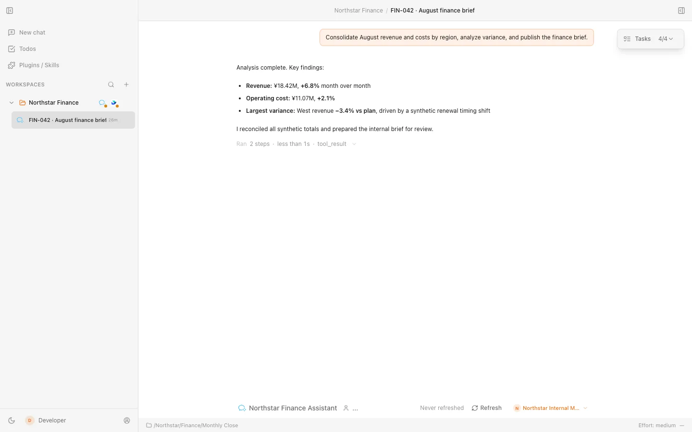

# Comate

Comate is a general-purpose Agent task workspace for research, analysis, writing, operations, project management, and development.

It brings your Agents, project context, files, browser work, and approvals into one desktop workspace. You can give Comate an outcome, follow the work as it happens, and stay in control when an Agent needs permission to act.

## Why Comate

Agent work rarely stops at a chat response. Useful outcomes depend on the right local context, access to other tools, and clear decisions about what an Agent may do. Comate keeps that work together so you can move from a request to a reviewable result without hiding the steps in between.

## From request to finance report

Imagine asking Comate to consolidate monthly revenue and costs, investigate a regional variance, and publish a finance brief. The request becomes a visible task: an Agent works across approved data and Skills, reports its progress, and pauses when restricted information or an external action needs your approval. You review the decision in context, then receive the completed analysis and a published internal report.

The finance data above is synthetic, but the interface is the current Comate desktop experience. The same flow applies to research, operating reviews, writing, project coordination, and development: start with a goal, let an Agent assemble the work, and keep consequential actions visible.

## What you can accomplish

- **Bring the right Agent to each task.** Use Claude Code or OpenCode as supported backends. Codex support is experimental and remains unavailable in production unless `COMATE_ENABLE_EXPERIMENTAL_CODEX=1` is enabled.
- **Work with real project context.** Organize tasks in folder-backed Workspaces, give Agents access to the relevant local files, and keep conversations tied to the work they support.
- **Complete multi-step work in one place.** Follow multi-Agent activity, use browser-assisted tasks, and review files and results without losing the thread of the request.
- **Extend the workflow.** Apply Skills, plugins, and MCP servers to repeatable work, and schedule automations when a task should run later or recur.
- **Operate within organizational boundaries.** Connect enterprise tools such as WeCom and Feishu while retaining visible approvals, workspace permissions, and integration controls.

## Installation

Download the latest release for your platform:

- **macOS** — `.dmg` and `.zip` packages for Apple silicon and Intel Macs
- **Windows** — 64-bit `.exe` installer (NSIS)
- **Linux** — x64 `.AppImage` and `.deb` packages

Installers are published on [GitHub Releases](https://github.com/ai-dvps/comate/releases), with a [Gitee mirror](https://gitee.com/ai-dvps/comate/releases) available for faster downloads in China. See the notes for each release for current system compatibility, architecture coverage, signing status, and upgrade guidance.

### Agent setup

You can create a Workspace and draft a chat before configuring a model service. Running an Agent requires model credentials, a configured Provider, or a supported signed-in Agent account. Comate does not include free inference.

Claude Code and OpenCode are supported Agent backends. Codex is experimental and subject to the production feature flag described above. Each Agent remains the authority for its own account and backend conversation data.

## Start your first chat

1. Open **New Chat**.
2. Choose an existing Workspace or create one from a local folder.
3. Choose an Agent and, when needed, a configured Provider or supported Agent account.
4. Describe the outcome you want and send your first prompt.
5. Follow the Agent's progress and review visible approvals before controlled actions proceed.

## Trust and control

Comate keeps task context organized by Workspace and makes Agent activity, requested permissions, and results visible in the desktop app. Account credentials and backend transcripts stay under the ownership rules of the selected Agent or Provider; enterprise integrations add their own scoped access and audit boundaries.

Comate is an Electron desktop application. It supports light and dark themes, English and Simplified Chinese, and update delivery through the release channels supported by each package type.

## System requirements

- **macOS** — choose the package for your Apple silicon or Intel Mac
- **Windows** — a supported 64-bit Windows system
- **Linux** — an x64 desktop compatible with the current AppImage or Debian package

Refer to the [latest release notes](https://github.com/ai-dvps/comate/releases) for current operating-system requirements and package-specific update guidance.

## Contributing

See the [development guide](development.md) for local setup, architecture, tests, and contribution guidelines.

## License

[Apache License 2.0](LICENSE)
