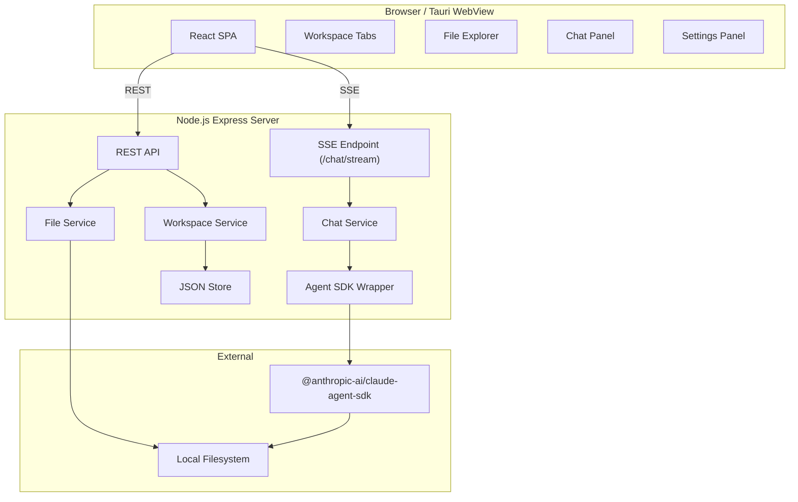

# Claude Code GUI Workspace Manager

## Summary

Build a personal workspace manager and GUI for Claude Code as a Node.js local web server with a React frontend. The backend integrates the `@anthropic-ai/claude-agent-sdk` for multi-session chat with built-in history persistence, while the app manages workspace metadata, file exploration, and tabbed navigation. Delivered in four phases: foundation, core UI, chat integration, and configuration.

---

## Problem Frame

Developers using Claude Code across multiple projects face friction when switching context. Each project requires different settings, installed skills, MCP servers, and hooks. The CLI operates in a single directory at a time; moving between projects means exiting, changing directories, and re-establishing context. Session history is not organized by project, making it hard to resume work or compare conversations across codebases. (See origin document for full problem frame.)

---

## Requirements

- R1. Developer can create a workspace by selecting a local folder path.
- R2. Each workspace has an editable name and description.
- R3. Each workspace stores Claude Code settings (model, API key, etc.).
- R4. Each workspace tracks installed skills, MCP servers, and hooks.
- R5. Multiple workspaces can be open simultaneously in tabs.
- R6. Workspace configuration persists across app restarts.
- R7. Each workspace supports multiple concurrent Claude Code sessions.
- R8. Chat is implemented via the Claude Code TypeScript SDK.
- R9. Session history is delegated to and managed by the Claude Code SDK.
- R10. Developer can create, name, and switch between sessions within a workspace.
- R11. Chat messages are streamed in real-time.
- R12. File explorer displays the workspace folder structure.
- R13. Developer can navigate directories and view file contents.
- R14. File explorer is read-only in the MVP.

**Origin actors:** A1 (Developer)
**Origin flows:** F1 (Create workspace), F2 (Open workspace and start chat), F3 (Switch between workspace tabs)

---

## Scope Boundaries

### Deferred for later

- Tauri desktop application wrapper.
- Integrations with third-party services.
- IM connectivity (Slack, Discord, etc.).
- External triggers (webhooks, API calls from other systems).
- Write operations in the file explorer (create, edit, delete files).
- Multi-session concurrency limits or resource management.

### Outside this product's identity

- Multi-user or team collaboration features.
- Hosted or cloud-deployed version.
- Mobile interface.
- Advanced IDE features (code editing, debugging, linting, version control UI).
- Full replacement of the Claude Code CLI — the app is an alternative interface, not a superset.

### Deferred to Follow-Up Work

- Keyboard shortcuts and vim-style navigation in the file explorer.
- Theme/dark mode customization.
- Workspace import/export for backup or sharing.
- Search across file contents within a workspace.

---

## Context & Research

### Relevant Code and Patterns

- No existing codebase — this is a greenfield project. No local patterns to follow.

### Institutional Learnings

- No institutional learnings exist in `docs/solutions/`. This project should seed that directory with architectural decisions as they are made.

### External References

- **Claude Code Agent SDK (TypeScript):** `@anthropic-ai/claude-agent-sdk` provides `query()` for streaming agent execution, built-in session persistence via `session_id`, `resume`, `continue`, and `forkSession` options. Sessions are stored locally (typically `~/.claude/`). The `cwd` option ties execution to a specific directory.
- **Claude Code Agent SDK Sessions:** `https://code.claude.com/docs/en/agent-sdk/sessions` — covers `continue`, `resume`, `forkSession`, and `persistSession` options.
- **Anthropic TypeScript SDK (core API):** `@anthropic-ai/sdk` provides `client.messages.create()` and `client.messages.stream()` for direct API access. Distinct from the Agent SDK; this plan uses the Agent SDK for its higher-level session management.
- **UI/UX Design Document:** `docs/design/ui-ux-design.md` — comprehensive design specification covering layout architecture, design tokens (colors, typography, spacing), component specs (tabs, sidebar, file drawer, file panel, chat, code blocks), interaction patterns, keyboard shortcuts, and animation tokens. All frontend implementation units should follow this document for visual and behavioral consistency.

---

## Key Technical Decisions

- **Agent SDK over core API:** The `@anthropic-ai/claude-agent-sdk` is used instead of the core `@anthropic-ai/sdk` because it provides built-in session persistence (`session_id`, `resume`, `continue`), tool execution, and sandbox configuration — aligning with the requirement that session history be delegated to the SDK. (see origin: docs/brainstorms/claude-code-gui-workspace-manager-requirements.md)
- **Express + React architecture:** Express serves the backend API and static frontend assets. React with Vite powers the frontend. This is the simplest path for a local tool and aligns with the eventual Tauri wrapper (Tauri wraps a webview pointing at the local server).
- **Server-Sent Events (SSE) for chat streaming:** SSE is chosen over WebSockets because chat streaming is one-way (server to client) and SSE is simpler to implement and reconnect automatically.
- **JSON file persistence for workspace metadata:** Workspace configuration is stored as JSON files on disk. This avoids adding a database dependency for a single-user local tool. The app must track session ID associations; the SDK handles the actual conversation history.
- **SDK sessions stored globally, mapped per-workspace by the app:** The Agent SDK persists sessions in a global location (`~/.claude/`). The app maintains its own mapping of which session IDs belong to which workspace. The `cwd` option on each `query()` call ensures the agent operates in the correct workspace directory.
- **Backend-only SDK access:** The Agent SDK runs only on the backend. API keys and SDK configuration never reach the frontend. This is a security requirement for any tool handling API keys.

---

## Open Questions

### Resolved During Planning

- **Which SDK package?** Resolved: `@anthropic-ai/claude-agent-sdk` is the correct package because it provides built-in session persistence and agent-level abstractions that the core SDK lacks.
- **How does session history delegation work?** Resolved: The SDK stores conversation history internally (JSONL logs). The app only needs to track `session_id` per workspace and pass `resume: sessionId` or `continue: true` when starting a chat.

### Deferred to Implementation

- **How should workspace settings map to SDK configuration options?** The exact mapping between workspace settings fields (model, API key, etc.) and SDK `query()` options needs validation against the actual SDK API during implementation.
- **How to handle SDK session storage conflicts with CLI sessions?** The Agent SDK and Claude Code CLI may share the same `~/.claude/` storage. During implementation, verify whether running the app alongside the CLI causes session collisions and whether the SDK supports namespaced or project-local storage.
- **Exact SSE event format for chat streaming:** The shape of SSE events (chunk format, error events, completion signal) should be defined during implementation based on the SDK's streaming output structure.

---

## Output Structure

```
claude-code-gui/
├── docs/
│   ├── brainstorms/
│   │   └── claude-code-gui-workspace-manager-requirements.md
│   └── plans/
│       └── 2026-05-15-001-feat-claude-code-gui-workspace-manager-plan.md
├── src/
│   ├── server/
│   │   ├── index.ts              # Express server entry
│   │   ├── routes/
│   │   │   ├── workspaces.ts     # Workspace CRUD API
│   │   │   ├── files.ts          # File explorer API
│   │   │   └── chat.ts           # Chat + SSE streaming API
│   │   ├── services/
│   │   │   ├── sdk-client.ts     # Agent SDK wrapper
│   │   │   └── chat-service.ts   # Chat session orchestration
│   │   ├── models/
│   │   │   └── workspace.ts      # Workspace data model
│   │   └── storage/
│   │       └── json-store.ts     # JSON file persistence
│   └── client/
│       ├── main.tsx              # React entry
│       ├── App.tsx               # Root component + routing
│       ├── components/
│       │   ├── WorkspaceTabs.tsx
│       │   ├── WorkspaceLayout.tsx
│       │   ├── FileExplorer.tsx
│       │   ├── FileViewer.tsx
│       │   ├── ChatPanel.tsx
│       │   ├── SessionSelector.tsx
│       │   ├── SettingsPanel.tsx
│       │   └── WorkspaceConfig.tsx
│       └── stores/
│           └── workspace-store.ts
├── package.json
├── tsconfig.json
├── tsconfig.server.json
├── vite.config.ts
└── README.md
```

---

## High-Level Technical Design

> *This illustrates the intended approach and is directional guidance for review, not implementation specification. The implementing agent should treat it as context, not code to reproduce.*



**Data flow for chat:**
1. User sends a message in the Chat Panel.
2. Frontend POSTs to `/api/workspaces/:id/sessions/:sessionId/chat`.
3. Backend Chat Service calls the Agent SDK `query()` with `cwd` set to the workspace folder and `resume` set to the session ID.
4. SDK streams response chunks.
5. Backend forwards chunks via SSE to the frontend.
6. Frontend renders streamed message content.

**Data flow for workspace switch:**
1. User clicks a different workspace tab.
2. Frontend updates active workspace state.
3. File Explorer requests new workspace's directory tree.
4. Chat Panel loads sessions associated with the new workspace.

---

## Implementation Units

### U1. Project Scaffolding and Development Environment

**Goal:** Initialize the project with TypeScript, Express backend, React frontend, and development tooling.

**Requirements:** R6 (persistence infrastructure)

**Dependencies:** None

**Files:**
- Create: `package.json`
- Create: `tsconfig.json`
- Create: `tsconfig.server.json`
- Create: `vite.config.ts`
- Create: `src/server/index.ts`
- Create: `src/client/main.tsx`
- Create: `src/client/App.tsx`
- Create: `index.html`

**Approach:**
- Set up a single Node.js project with separate TypeScript configs for server and client.
- Use Vite for the frontend build (fast HMR, modern tooling).
- Use `tsx` or `ts-node` for backend development.
- Configure concurrent dev scripts (`concurrently` or `npm-run-all`) to run backend and frontend together.
- Express serves static frontend assets from `dist/` in production and proxies to Vite dev server in development.

**Patterns to follow:**
- No existing patterns — this establishes the conventions for the project.

**Test scenarios:**
- Test expectation: none — pure scaffolding and configuration.

**Verification:**
- `npm run dev` starts both backend and frontend without errors.
- `npm run build` produces a working production bundle.
- Express serves the frontend at the root path.

---

### U2. Workspace Data Model and Persistence

**Goal:** Define the workspace data model and implement JSON file persistence.

**Requirements:** R1, R2, R3, R4, R6

**Dependencies:** U1

**Files:**
- Create: `src/server/models/workspace.ts`
- Create: `src/server/storage/json-store.ts`
- Test: `src/server/models/workspace.test.ts`
- Test: `src/server/storage/json-store.test.ts`

**Approach:**
- Define the `Workspace` interface: `id`, `name`, `description`, `folderPath`, `settings` (model, apiKey, etc.), `skills`, `mcpServers`, `hooks`, `createdAt`, `updatedAt`.
- Implement a `JsonStore` class that reads/writes workspace records to a JSON file in a known location (e.g., `~/.claude-code-gui/workspaces.json` or project-local).
- Provide CRUD operations: create, read, update, delete, list.
- Generate workspace IDs using UUIDs or nanoids.

**Patterns to follow:**
- Store data in the user's home directory to avoid cluttering workspace folders.

**Test scenarios:**
- **Happy path:** Create a workspace, persist it, read it back — all fields match.
- **Happy path:** List workspaces returns all persisted workspaces.
- **Edge case:** Workspace with special characters in name persists and reads correctly.
- **Edge case:** Empty workspace list returns an empty array, not an error.
- **Error path:** Duplicate workspace name is allowed (IDs are unique; names are for display).
- **Error path:** Invalid folder path (nonexistent directory) is rejected at creation time.

**Verification:**
- All CRUD operations work via direct store calls.
- Data persists across process restarts.

---

### U3. Workspace API and Frontend Shell

**Goal:** Expose workspace CRUD via REST API and build the frontend app shell with workspace navigation.

**Requirements:** R1, R2, R3, R4, R5, R6

**Dependencies:** U1, U2

**Files:**
- Create: `src/server/routes/workspaces.ts`
- Create: `src/client/stores/workspace-store.ts`
- Create: `src/client/components/WorkspaceList.tsx`
- Modify: `src/client/App.tsx`
- Test: `src/server/routes/workspaces.test.ts`

**Approach:**
- REST endpoints: `GET /api/workspaces`, `POST /api/workspaces`, `GET /api/workspaces/:id`, `PUT /api/workspaces/:id`, `DELETE /api/workspaces/:id`.
- Frontend state management: Use React Context + useReducer or a lightweight store (Zustand recommended) for workspace list and active workspace.
- App shell: Sidebar with workspace list, main area for active workspace content.
- Open workspace action loads it into the active view.

**Patterns to follow:**
- RESTful route naming. JSON request/response bodies.
- **UI/UX reference:** Follow `docs/design/ui-ux-design.md` §4.1 (Workspace Tabs), §4.2 (Sidebar Tab Switcher), and §2.2 (Regions) for layout structure and component styling.

**Test scenarios:**
- **Happy path:** Create workspace via POST, verify it appears in GET list.
- **Happy path:** Update workspace name via PUT, verify change in subsequent GET.
- **Error path:** DELETE nonexistent workspace returns 404.
- **Error path:** POST with missing required fields (`folderPath`) returns 400.
- **Integration:** Frontend creates workspace through API, store updates, sidebar reflects new entry.

**Verification:**
- All REST endpoints respond correctly via curl or API client.
- Frontend can create, list, and select workspaces.

---

### U4. Workspace Tabs and Navigation

**Goal:** Enable multiple workspaces to be open simultaneously in tabs with stateful switching.

**Requirements:** R5

**Dependencies:** U3

**Files:**
- Create: `src/client/components/WorkspaceTabs.tsx`
- Create: `src/client/components/WorkspaceLayout.tsx`
- Modify: `src/client/App.tsx`
- Modify: `src/client/stores/workspace-store.ts`

**Approach:**
- Track "open workspaces" as a set of workspace IDs separate from the full workspace list.
- Tabs render open workspace names with close buttons.
- Clicking a tab switches the active workspace.
- Closing a tab removes it from the open set but does not delete the workspace.
- Each open workspace maintains its own UI state (scroll position, selected file, active session) that is preserved when switching tabs.

**Patterns to follow:**
- Tab state is ephemeral (not persisted); only workspace configuration is persisted.
- **UI/UX reference:** Follow `docs/design/ui-ux-design.md` §4.1 (Workspace Tabs) for tab styling, active states, and close-button behavior.

**Test scenarios:**
- **Happy path:** Open two workspaces, both appear as tabs.
- **Happy path:** Switch between tabs — each workspace's content area updates.
- **Edge case:** Close the last tab — UI shows an empty state or workspace list.
- **Edge case:** Attempt to open a workspace that is already open — focus existing tab instead of duplicating.

**Verification:**
- User can open multiple workspaces and switch between them smoothly.
- Tab close removes the tab without data loss.

---

### U5. File Explorer

**Goal:** Display workspace folder structure and enable file navigation and content viewing.

**Requirements:** R12, R13, R14

**Dependencies:** U3

**Files:**
- Create: `src/server/routes/files.ts`
- Create: `src/client/components/FileExplorer.tsx`
- Create: `src/client/components/FileViewer.tsx`
- Test: `src/server/routes/files.test.ts`

**Approach:**
- Backend API: `GET /api/workspaces/:id/files?path=` returns directory listing (name, type, children). `GET /api/workspaces/:id/files/content?path=` returns file contents as text.
- Security: Validate that the requested path is within the workspace folder (resolve and check prefix). Reject paths that escape the workspace.
- Frontend: Recursive tree component for directories. Clicking a file opens it in the File Viewer (text display only; no editing in MVP).
- Handle binary files gracefully (show a "binary file" placeholder instead of garbled text).

**Patterns to follow:**
- Directory traversal uses `fs.promises.readdir` and `fs.promises.readFile`.
- Path validation uses `path.resolve` and string prefix checks.
- **UI/UX reference:** Follow `docs/design/ui-ux-design.md` §4.4 (File Tree Item), §4.8 (File Drawer), §4.9 (File Panel), §5.1 (File Interactions), and §11 (State Definitions) for tree rendering, drawer behavior, and side-by-side pinning.

**Test scenarios:**
- **Happy path:** Navigate a directory tree, see files and subdirectories.
- **Happy path:** Click a text file, see its contents in the viewer.
- **Edge case:** Empty directory shows an empty folder indicator.
- **Edge case:** Binary file shows a placeholder instead of raw bytes.
- **Error path:** Path outside workspace returns 403.
- **Error path:** Nonexistent file returns 404.
- **Error path:** Directory listed as file or vice versa returns appropriate error.

**Verification:**
- File explorer accurately reflects the workspace filesystem.
- Path traversal attacks are blocked.

---

### U6. SDK Integration Layer

**Goal:** Install and wrap the Agent SDK, providing a backend service for session creation and streaming.

**Requirements:** R8, R9

**Dependencies:** U1, U2

**Files:**
- Create: `src/server/services/sdk-client.ts`
- Create: `src/server/services/chat-service.ts`
- Test: `src/server/services/chat-service.test.ts`

**Approach:**
- Install `@anthropic-ai/claude-agent-sdk`.
- Create `SdkClient` wrapper that encapsulates SDK initialization and `query()` calls.
- `ChatService` orchestrates sessions: reads workspace `folderPath` from the data model, creates a new `query()` call with `cwd` set to the workspace folder, captures the `session_id` from the stream, and handles resume/fork logic.
- Store session ID → workspace mapping in the JSON store alongside workspace metadata.
- Handle SDK errors (connection failure, invalid API key, rate limits) and translate them to application errors.

**Patterns to follow:**
- SDK runs only on the backend. Never expose API keys to the frontend.

**Test scenarios:**
- **Happy path:** Create a chat session with correct `cwd` — SDK initializes and streams.
- **Happy path:** Resume an existing session by ID — SDK restores prior context.
- **Error path:** Invalid API key — SDK error is caught and surfaced as a structured error.
- **Error path:** SDK connection failure — chat service returns an error, does not crash the server.
- **Integration:** Chat service creates session, stores session ID, subsequent resume uses the same ID.

**Verification:**
- SDK can be initialized and `query()` can be called successfully.
- Session IDs are captured and associated with workspaces.
- SDK errors are handled gracefully.

---

### U7. Chat Interface and Session Management

**Goal:** Build the frontend chat panel with real-time streaming, session creation, and session switching.

**Requirements:** R7, R9, R10, R11

**Dependencies:** U4, U6

**Files:**
- Create: `src/server/routes/chat.ts`
- Create: `src/client/components/ChatPanel.tsx`
- Create: `src/client/components/SessionSelector.tsx`
- Create: `src/client/components/MessageList.tsx`
- Test: `src/server/routes/chat.test.ts`

**Approach:**
- Backend: `POST /api/workspaces/:id/sessions` creates a new session. `GET /api/workspaces/:id/sessions` lists sessions. `POST /api/workspaces/:id/sessions/:sessionId/chat` initiates a chat and returns an SSE stream.
- SSE stream format: each event contains a chunk of the assistant's response. A special `done` event signals completion. Error events signal failures.
- Frontend: ChatPanel shows message history (loaded from SDK via session resume), input field, and send button. Messages stream in real-time as SSE events arrive.
- SessionSelector: Dropdown to create a new session or switch to an existing one. New sessions are created with a default name that the user can edit.
- MessageList: Renders user and assistant messages. Handles streaming partial content.

**Patterns to follow:**
- SSE reconnection is handled by the browser automatically. The frontend should reconnect if the connection drops.
- Each workspace maintains its own session list in the frontend state.
- **UI/UX reference:** Follow `docs/design/ui-ux-design.md` §4.3 (Session List Item), §4.5 (Message Bubbles), §4.6 (Code Blocks), §4.7 (Input Area), §5.2 (Session Interactions), §5.4 (Chat Interactions), §6 (Keyboard Shortcuts), §7 (Animation & Motion), and §12 (Empty States) for chat panel layout, message styling, streaming indicators, and input behavior.

**Test scenarios:**
- **Happy path:** Send a message, receive a streamed response rendered incrementally.
- **Happy path:** Create a new session, it appears in the session selector.
- **Happy path:** Switch to a different session, prior messages load (via SDK resume).
- **Edge case:** Send empty message — frontend blocks or backend rejects gracefully.
- **Edge case:** Stream interruption (network drop) — UI shows partial message and allows retry.
- **Error path:** SDK error during streaming — SSE sends an error event, UI displays error message.
- **Integration:** Full flow: create workspace → create session → send message → receive stream → switch workspace → return → session history intact.

**Verification:**
- Chat messages stream in real-time.
- Sessions can be created, named, and switched.
- Session history is preserved when switching workspaces and returning.

---

### U8. Settings and Workspace Configuration UI

**Goal:** Provide UI for editing workspace settings (model, API key, etc.) and tracking installed skills, MCP servers, and hooks.

**Requirements:** R3, R4

**Dependencies:** U3

**Files:**
- Create: `src/client/components/SettingsPanel.tsx`
- Create: `src/client/components/WorkspaceConfig.tsx`
- Modify: `src/server/routes/workspaces.ts`

**Approach:**
- SettingsPanel: Form fields for model selection (dropdown), API key (password input with reveal toggle), and other Claude Code settings.
- WorkspaceConfig: Skills list (add/remove by name), MCP servers list (name + command/args), hooks list (name + script path).
- All changes are persisted via the existing workspace PUT endpoint.
- API key is stored per-workspace. If not set, fall back to a global default or environment variable.
- Skills/MCP/hooks are tracked as metadata only in the MVP (the app does not install or validate them; it just records what the user says is installed).

**Patterns to follow:**
- Form validation for required fields. Sensitive fields (API key) use password input.
- **UI/UX reference:** Follow `docs/design/ui-ux-design.md` §3.1 (Color Tokens), §3.2 (Typography), §3.3 (Spacing Scale), and §8 (Responsive Behavior) for form styling and responsive layout.

**Test scenarios:**
- **Happy path:** Edit workspace settings, save, reload page — settings persist.
- **Happy path:** Add a skill to the skills list, it appears and persists.
- **Edge case:** API key field shows masked value, reveal toggle works.
- **Error path:** Attempt to save invalid model name — validation blocks submission.

**Verification:**
- Settings changes persist across app restarts.
- Skills, MCP, and hooks lists can be edited and saved.

---

## System-Wide Impact

- **Interaction graph:** The Express server exposes REST and SSE endpoints consumed by the React frontend. The Agent SDK is invoked only from the backend `ChatService`. The `JsonStore` is accessed by workspace routes and chat service.
- **Error propagation:** SDK errors bubble through `ChatService` → chat route → SSE error events → frontend error display. File system errors bubble through file route → HTTP error responses.
- **State lifecycle risks:** Workspace tabs are ephemeral; only workspace configuration and session IDs are persisted. If the app crashes, open tabs are lost but workspaces and sessions remain. SDK session history is managed externally by the SDK.
- **API surface parity:** N/A — no other interfaces exist yet.
- **Integration coverage:** Cross-layer scenarios that unit tests alone will not prove: (1) Frontend creates workspace → backend persists → frontend lists it, (2) Frontend sends chat message → backend calls SDK → SSE streams to frontend → message renders, (3) Switch workspace tabs → file explorer updates → session list updates.
- **Unchanged invariants:** The local filesystem is read-only in the MVP. No files are modified by the app.

---

## Risks & Dependencies

| Risk | Mitigation |
|------|------------|
| Agent SDK API changes | Pin SDK version in package.json. Monitor changelog. Abstract SDK calls behind `SdkClient` wrapper to limit blast radius. |
| SDK session storage conflicts with CLI | During implementation, test running app and CLI concurrently. If conflicts exist, investigate SDK's project-local storage options or session namespacing. |
| Port conflicts on user machine | Allow configurable port via environment variable or CLI flag. Attempt to bind and provide clear error if port is taken. |
| File system permission errors | Wrap file operations in try/catch. Return user-friendly error messages. Restrict access to workspace folder only. |
| Large directory trees in file explorer | Implement lazy loading/virtualization for directories with many files. Defer to follow-up if not needed in MVP. |
| API key exposure | Never send API keys to frontend. Store in backend only. |

---

## Phased Delivery

### Phase 1: Foundation
- **U1. Project Scaffolding** — Development environment, build pipeline, server setup.
- **U2. Workspace Data Model** — Persistence layer, CRUD operations.

### Phase 2: Core UI
- **U3. Workspace API and Frontend Shell** — REST API, workspace list, app shell.
- **U4. Workspace Tabs** — Multi-tab navigation.
- **U5. File Explorer** — Directory tree, file viewer.

### Phase 3: Chat Integration
- **U6. SDK Integration Layer** — Agent SDK setup, session orchestration.
- **U7. Chat Interface** — Streaming chat, session management.

### Phase 4: Configuration
- **U8. Settings and Configuration** — Workspace settings, skills/MCP/hooks tracking.

---

## Documentation / Operational Notes

- Add a `README.md` with setup instructions: `npm install`, `npm run dev`, `npm run build`.
- Document the workspace data file location so users can back it up.
- Include a note about API key storage (per-workspace, backend-only).

---

## Sources & References

- **Origin document:** [docs/brainstorms/claude-code-gui-workspace-manager-requirements.md](docs/brainstorms/claude-code-gui-workspace-manager-requirements.md)
- **Claude Code Agent SDK (TypeScript) Reference:** `https://code.claude.com/docs/en/agent-sdk/typescript`
- **Claude Code Agent SDK Sessions:** `https://code.claude.com/docs/en/agent-sdk/sessions`
- **Anthropic TypeScript SDK (core API):** `https://platform.claude.com/docs/en/api/sdks/typescript`
