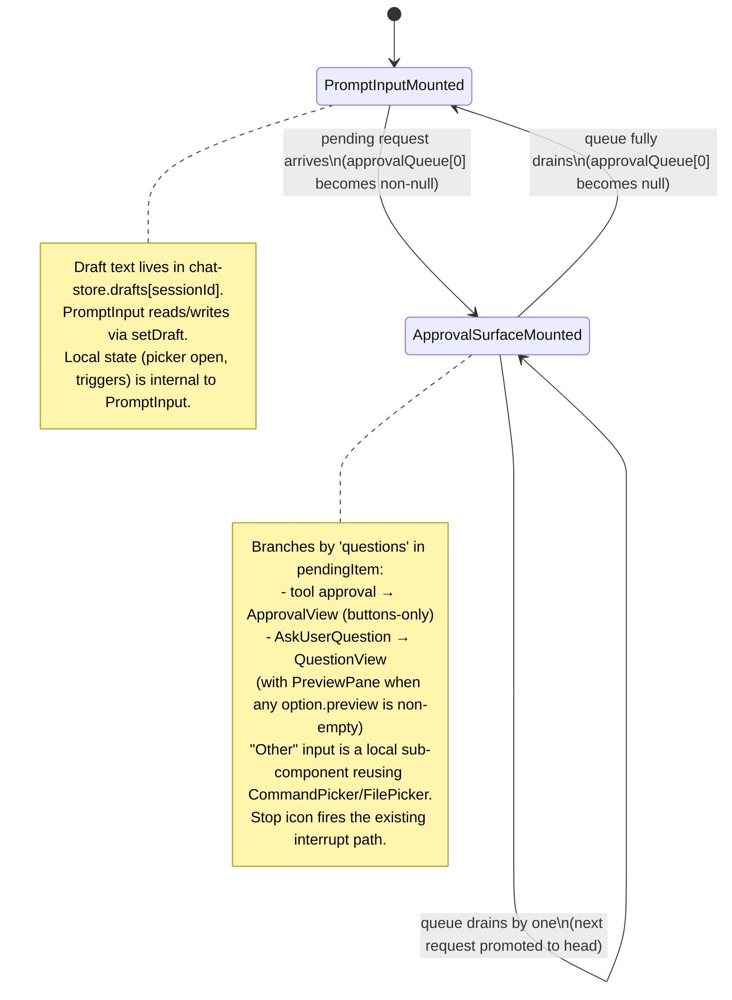

# feat: Approval & AskUserQuestion Surface Swap

## Summary

Introduce a new `ApprovalSurface` (with a `PreviewPane` sub-component) that renders in place of `PromptInput` while a `canUseTool` callback is pending, hoist the prompt-input draft into `chat-store` so the swap preserves typed work, add DOMPurify for client-side sanitization of HTML option previews, flip the server's `previewFormat` to `'html'`, and delete the existing `ApprovalBanner`. `CommandPicker` and `FilePicker` are reused unchanged for the `AskUserQuestion` "Other" rich-input.

---

## Problem Frame

The current `ApprovalBanner` pins above the still-editable `PromptInput`, splitting the user's attention between an in-progress draft and a request that has already paused the SDK turn — and renders option previews as italic text that destroys whitespace in ASCII diagrams. This plan replaces that surface with a focus-trap that swaps the input region in place. See origin: `docs/brainstorms/2026-05-17-approval-and-question-surface-swap-requirements.md`.

---

## Requirements

- R1. Render `ApprovalSurface` in place of `PromptInput` whenever a `canUseTool` request is pending for the active session; do not change any other layout in `ChatPanel`. (Origin R1)
- R2. Preserve the in-progress prompt-input draft across the swap so resolving (or aborting) a request restores the textarea exactly as it was. (Origin R2)
- R3. When more than one request is queued, show one at a time in FIFO order with a `1 of N` indicator; swap between queued requests without remounting the prompt input between them. (Origin R3)
- R4. Tool-approval surface renders the tool name, optional description, an input summary with Show more / Show less, and three buttons: Allow, Allow always (only when SDK supplied `suggestions`), Deny — no free-text input. (Origin R4)
- R5. Allow always echoes the SDK-supplied `updatedPermissions` suggestions back through the existing resolve callback (unchanged from current implementation). (Origin R5)
- R6. Deny returns the hardcoded `{ behavior: 'deny', message: 'User denied this tool call.' }`. (Origin R6)
- R7. Question surface renders all 1–4 questions stacked vertically; a single Confirm at the bottom commits all answers at once and is disabled until every question has at least one selection. (Origin R7)
- R8. Each question's option list ends with an "Other" entry that, when selected, reveals a rich text input directly below that question's options. Selecting "Other" does not deselect existing multi-select selections; deselecting "Other" hides the input and discards its typed value. (Origin R8)
- R9. The "Other" rich input is a multi-line textarea reusing the existing `CommandPicker` and `FilePicker` for `/` and `@` triggers, with the contract: Enter inserts newline (Confirm is a separate button), Escape closes any open picker. (Origin R9)
- R10. Confirm builds `{ behavior: 'allow', updatedInput: { questions, answers } }` where each answer is the comma-joined labels of selected non-"Other" options plus any non-empty "Other" text. Empty "Other" with "Other" selected blocks Confirm. (Origin R10)
- R11. Server config sets `toolConfig.askUserQuestion.previewFormat: 'html'`. (Origin R11)
- R12. The surface uses side-by-side layout (option list left, preview pane right) whenever any option in the request carries a non-empty `preview` field; uses the stacked single-column layout otherwise. (Origin R12)
- R13. Preview HTML is sanitized client-side (DOMPurify) before injection via `dangerouslySetInnerHTML`, inside a CSS-isolated wrapper that applies a constrained typography baseline consistent with the chat surface. (Origin R13)
- R14. Render a surface-level "Chat about this" button alongside Confirm whenever at least one option in the request carries preview content. Otherwise omit it. (Origin R14)
- R15. "Chat about this" returns `{ behavior: 'allow', updatedInput: { questions, answers } }` where `answers` applies a single fixed discussion-request string to every question; surface state is discarded; the prompt-input draft is restored on swap-back. (Origin R15)
- R16. Render a Stop icon button in a fixed corner of the surface chrome; clicking it opens an anchored confirm popover (Cancel / Confirm) matching the existing `PromptInput` Stop affordance. (Origin R16)
- R17. The surface's Stop reuses the existing interrupt path (`POST .../interrupt` → `query.interrupt()`); the SDK's AbortSignal listener already in `src/server/services/session-runtime.ts` resolves the pending callback as a deny, the surface unmounts, and the prompt input remounts with the preserved draft. (Origin R17)

**Origin flows:** F1 (tool approval), F2 (AskUserQuestion no previews), F3 (AskUserQuestion with previews), F4 (Stop while pending)
**Origin acceptance examples:** AE1 (covers R1, R2), AE2 (covers R3), AE3 (covers R7, R8, R9, R10), AE4 (covers R11, R12, R13), AE5 (covers R14, R15), AE6 (covers R16, R17, R2)

---

## Scope Boundaries

- Adding Vitest or any test framework. The repo has no test framework today; this plan keeps that posture and records test scenarios as manual exercise checklists anchored to origin AE-IDs.
- Sanitizing tool-approval inputs. Only `AskUserQuestion` option previews need HTML sanitization.
- New SSE event types. The existing `pending_approval` / `pending_question` / `approval_resolved` events already carry everything the surface needs.
- Modifying `CommandPicker` or `FilePicker`. The existing components are reused as-is.
- Light-mode theming, custom denial messages, "approve with changes," cross-machine draft sync, per-option "Chat about this" placement, banner-shape revert toggle, settings UI for `.claude/settings.local.json`, subagent-originated `AskUserQuestion` — all inherited from origin Scope Boundaries.
- Cross-session draft persistence beyond what naturally falls out of hoisting the draft into the per-session store (i.e., if you switch sessions and return, your draft is intact — but no localStorage sync, no server-side draft sync).

### Deferred to Follow-Up Work

- Vitest setup and automated tests for `ApprovalSurface`, `PreviewPane`, `chat-store` draft slice, and `ChatPanel` swap wiring: a separate plan once the team is ready to introduce a test framework.

---

## Context & Research

### Relevant Code and Patterns

- `src/client/components/ApprovalBanner.tsx` — current banner shape; the `ApprovalView` and `QuestionView` sub-component structure is the pattern to port (and the file to delete in U5).
- `src/client/components/PromptInput.tsx` — slash-trigger detection at lines 91–99 / 127–137, `@`-trigger detection at lines 102–125, picker handle wiring at lines 162–225, Stop popover at lines 384–436. The trigger-detection logic is the reference implementation to port into the "Other" input.
- `src/client/components/CommandPicker.tsx` / `src/client/components/FilePicker.tsx` — already decoupled from `PromptInput` via `forwardRef` handles and an `anchor` ReactNode prop. The host owns picker open state, render the anchor, wires `onSelect`/`onOpenChange`, and forwards arrow/Enter/Esc/Tab to `pickerHandleRef.current`. No modifications needed; the "Other" input is a new host.
- `src/client/components/ui/popover.tsx` — Radix popover wrapper; the Stop-confirm pattern from `PromptInput.tsx:384–436` reproduces verbatim in the surface chrome.
- `src/client/components/ui/button.tsx` — variants `default | secondary | destructive | ghost | outline`, sizes `default | sm`. Allow / Allow always / Deny / Confirm / Chat about this all use this.
- `src/client/stores/chat-store.ts` — `approvalQueue: Record<sessionId, PendingItem[]>` with discriminator `'questions' in item`, `resolveApproval(workspaceId, sessionId, requestId, result)` that POSTs to `/api/workspaces/:id/sessions/:sessionId/approvals/:requestId`. The existing `draftQueue` slice handles the send-while-approval-pending race and is unrelated to the new `drafts` slice this plan introduces.
- `src/server/services/session-runtime.ts:100–145` — `buildCanUseToolCallback`; the AbortSignal listener already resolves a pending callback as `{ behavior: 'deny', message: 'Tool approval aborted by SDK: ...' }` when `query.interrupt()` fires.
- `src/server/services/sdk-client.ts:55–57` — `toolConfig: { askUserQuestion: { previewFormat: 'markdown' } }`. The only one-line flip in U6.
- `src/server/routes/chat.ts:137–178` — resolve endpoint already accepts `{ behavior, updatedPermissions?, answers?, questions?, message? }` and shapes the SDK-side payload correctly for both approval and AskUserQuestion paths. No server-route changes needed.
- `node_modules/@anthropic-ai/claude-agent-sdk/sdk.d.ts:5654` confirms `previewFormat?: 'markdown' | 'html'` in the installed SDK (`^0.2.141`).

### Institutional Learnings

- `docs/solutions/` does not exist in this repo; no prior captured learnings on sanitization, focus-trap UX, draft preservation, or `canUseTool` lifecycle. Treat the relevant decisions as greenfield from an institutional-knowledge standpoint; this plan is a strong candidate for capture via `/ce-compound` once landed.

### External References

- Claude Agent SDK user-input docs: https://code.claude.com/docs/en/agent-sdk/user-input (the origin doc is the canonical reference for `AskUserQuestion` shape).
- DOMPurify default API and recommended hooks for `target=_blank` + `rel="noopener noreferrer"` injection on `<a>` elements.

---

## Key Technical Decisions

- **Draft preservation by hoisting into `chat-store`** (rather than keeping `PromptInput` mounted behind a visibility toggle): the draft becomes per-session state in the store, surviving the surface swap as well as session switches; the alternative (visibility toggle) is less invasive but more fragile because `PromptInput`'s local state — picker open flags, `fileTriggerStart`, `lastInsertedCommand`, `prevInputRef` — would all have to survive being hidden mid-trigger. Confirmed at Phase 5.1.5.
- **No automated tests in this plan** (no test framework installed in the repo). Test scenarios are manual exercise checklists anchored to origin AE-IDs; adding Vitest is deferred to a separate plan. Confirmed at Phase 5.1.5.
- **`ApprovalBanner` is deleted, not kept in parallel**: the new surface is a structural replacement, not a coexistence option. (Carried from origin Scope Boundaries.)
- **Sanitization happens at point of injection** inside `PreviewPane` (not at SSE receipt in `chat-store`). Defense-in-depth at render is the conventional pattern and keeps `chat-store` free of presentation concerns. Memoize the sanitized output per `(option-label, preview-string)` to avoid re-sanitizing on every keystroke / re-render.
- **CSS isolation via a Tailwind scoped class** (`.preview-content`) rather than shadow-DOM: cheaper, consistent with the rest of the app's Tailwind-only styling, and the threat model — sanitized SDK output rendered to a single trusted user — does not justify shadow-DOM's complexity.
- **`PreviewPane` is a separate component**, not inlined into `ApprovalSurface`: keeps the sanitization + scoped-wrapper concern in one place and lets future surfaces reuse it (e.g., the SubagentDrawer might want preview rendering eventually).
- **Side-by-side layout is request-wide, not per-question**: the moment any option in the request has non-empty `preview`, the entire surface flips to side-by-side; questions whose options have no preview still render normally inside the left column. Mirrors origin R12.
- **"Chat about this" is surface-level (once per request)**, not per-question. The fixed copy is pinned at plan time and lives as a single constant; tweaking copy later is a one-line change.
- **No new SSE event types or server-side state changes**: the existing `pending_approval`, `pending_question`, `approval_resolved`, and `interrupted` events plus the existing `approvalQueue` slice already carry everything the surface needs.
- **No changes to `CommandPicker` / `FilePicker`**: the "Other" input is a new host that wires the existing imperative ref API.

---

## Open Questions

### Resolved During Planning

- Where is the preserved draft held? — `chat-store.drafts: Record<sessionId, string>` (per session). (Origin Outstanding Question on R2.)
- Surface-to-next-queued-request transition? — Instant; no fade or slide. (Origin Outstanding Question on R3.)
- Initial focused option for the preview pane? — First option whose `preview` is non-empty, falling back to the first option. (Origin Outstanding Question on R12.)
- "Chat about this" copy? — Pinned default: `"I have questions before answering — can we discuss the options before I pick?"`. A single string constant in `ApprovalSurface.tsx`; tweak at impl time if the implementer finds something better. (Origin Outstanding Question on R15.)
- System-note copy when surface Stop vs prompt-input Stop fires? — Single shared copy emitted by the existing interrupt flow; the surface does not emit its own note. (Origin Outstanding Question on R16, R17.)
- Disabled-state styling of `ChatPanel` chrome while the surface is active? — No change. The surface itself is the only signal. (Origin Outstanding Question on R4.)

### Deferred to Implementation

- Exact DOMPurify allow-list and hook configuration: nail down during U1 by inspecting the actual HTML the SDK emits for previews; baseline is the typography + lists + tables + preformatted + emphasis + `<a>` (with `target="_blank" rel="noopener noreferrer"` hardening via DOMPurify's `afterSanitizeAttributes` hook). The SDK pre-filters `<script>`, `<style>`, `<!DOCTYPE>` per docs.
- Side-by-side narrow-viewport breakpoint: pick at impl by exercising the chat panel at various resizable widths. Default lean: collapse to stacked layout below ~500px panel width; revisit if it looks wrong in practice.
- Picker-token rendering inside `updatedInput.answers`: verbatim is the assumption; verify during U4 implementation that the SDK does not misinterpret bare `@` / `/` tokens.
- Whether the "Other" input's own draft text needs to survive the user toggling "Other" off and back on within the same question: default lean is no (origin R8 says "deselecting Other discards its typed value"), but worth re-checking once the surface is live.

---

## High-Level Technical Design

> *This illustrates the intended approach and is directional guidance for review, not implementation specification. The implementing agent should treat it as context, not code to reproduce.*

**Surface lifecycle (state machine).** The chat panel's bottom region renders exactly one of `PromptInput` or `ApprovalSurface` at any time, driven by `approvalQueue[activeSessionId][0]`.



**Side-by-side layout activation rule.**

| Request shape | Layout |
|---|---|
| Tool approval (no `questions`) | Stacked single-column. |
| `AskUserQuestion`; no option has non-empty `preview` | Stacked single-column. |
| `AskUserQuestion`; at least one option has non-empty `preview` | Side-by-side: options left, `PreviewPane` right. "Chat about this" button rendered alongside Confirm. |

**Preview rendering pipeline (per option).**

```
option.preview (string from SSE)
  → DOMPurify.sanitize(preview, { config including a hook that adds target=_blank rel=noopener noreferrer on <a> })
  → memoized by (option.label, preview-string)
  → injected via dangerouslySetInnerHTML into a <div class="preview-content"> wrapper
  → constrained typography baseline applied via Tailwind utilities scoped to .preview-content
```

---

## Implementation Units

### U1. Add DOMPurify dependency and HTML sanitizer utility

**Goal:** Provide a single sanitization entry point for HTML preview content that the rest of the client uses.

**Requirements:** R13.

**Dependencies:** None.

**Files:**
- Modify: `package.json` (add `dompurify`, `@types/dompurify` to `dependencies` and `devDependencies` respectively; bump lockfile)
- Create: `src/client/lib/sanitize-html.ts`

**Approach:**
- Export a single named function `sanitizePreviewHtml(html: string): string`.
- Configure DOMPurify with an allow-list aligned to the documented SDK output: typography (`p`, `div`, `span`, `h1`–`h6`, `br`, `hr`), emphasis (`strong`, `em`, `code`, `kbd`, `mark`), lists (`ul`, `ol`, `li`), preformatted blocks (`pre`, `code` with optional `class` attribute), tables (`table`, `thead`, `tbody`, `tr`, `th`, `td`), links (`a` with `href`), images (`img` with `src`, `alt`).
- Strip all `on*` event-handler attributes, `javascript:` URLs, `style` attributes, and any `<script>`, `<style>`, `<iframe>`, `<object>`, `<embed>`, `<form>`, `<input>`, `<button>`, `<link>`, `<meta>`, `<base>` tags.
- Register an `afterSanitizeAttributes` hook that adds `target="_blank"` and `rel="noopener noreferrer"` on every `<a>` with an `href`.
- Do not memoize inside the utility; the caller (`PreviewPane`) memoizes per `(label, preview)`.

**Patterns to follow:**
- Project uses kebab-case for `.ts` utilities. The file lives under `src/client/lib/`, a new directory for client-only utilities.

**Test scenarios:**
- Happy path: `<p>Hello <strong>world</strong></p>` survives sanitization with both tags intact.
- Happy path: `<pre>line one\n  indented two</pre>` preserves whitespace and line breaks.
- Edge case: `<a href="https://example.com">link</a>` emerges with `target="_blank"` and `rel="noopener noreferrer"` added.
- Error path: `<script>alert(1)</script>` is stripped entirely.
- Error path: `<a href="javascript:alert(1)">x</a>` has the `href` removed (or the `<a>` stripped).
- Error path: `<p onclick="bad()">x</p>` has the `onclick` removed.
- Edge case: `<style>body { display: none }</style>` is stripped.
- Test expectation: manual exercise via a temporary scratch page or browser devtools console invocation; no test framework installed.

**Verification:**
- Calling `sanitizePreviewHtml` on each test input above returns the expected sanitized output when exercised manually in the browser console.

---

### U2. Build `PreviewPane` component

**Goal:** Reusable component that renders sanitized HTML preview content inside a CSS-isolated, typography-constrained wrapper.

**Requirements:** R12, R13.

**Dependencies:** U1.

**Files:**
- Create: `src/client/components/PreviewPane.tsx`
- Modify: `src/client/index.css` (add a `.preview-content` scoped class with constrained typography rules — base font, line height, `pre`/`code` monospace, `<a>` underline, list indentation, table border collapse)

**Approach:**
- Props: `{ html: string | null, ariaLabel?: string }`.
- When `html` is null or empty, render a subtle "No preview" placeholder.
- Otherwise, memoize `sanitizePreviewHtml(html)` per `html` input via `useMemo`, inject via `dangerouslySetInnerHTML` inside a `<div className="preview-content overflow-auto h-full">` wrapper.
- The `.preview-content` Tailwind/CSS class scopes typography rules so SDK-emitted HTML cannot inherit or override surrounding app styles. Use `@layer components` in `index.css` to keep specificity manageable.
- Lazy-import DOMPurify if bundle size becomes a concern; baseline is direct import.

**Patterns to follow:**
- PascalCase `.tsx` component; default export; no forwardRef needed.
- Tailwind tokens for the wrapper: `bg-surface border border-border/50 rounded-md p-3 overflow-auto`.

**Test scenarios:**
- Happy path: passing an `<h3>` + `<pre>` HTML string renders the heading and preformatted block with whitespace preserved.
- Edge case: passing `null` or empty string renders the "No preview" placeholder.
- Integration: changing the `html` prop re-renders the pane with the new content; memoization does not stale.
- Edge case: the `.preview-content` wrapper does not let injected styles bleed onto sibling chat surface elements (verify by injecting a preview containing an `<h3>` and confirming the chat panel's other H3-styled elements are unaffected).
- Test expectation: manual exercise in the running app once U5 wires the pane into a live `AskUserQuestion` flow; no test framework installed.

**Verification:**
- Side-by-side rendering of two preview options (one HTML-rich, one plain `<p>`) shows correct typography for both and the wrapper class scopes styles correctly when inspected in devtools.

---

### U3. Hoist prompt-input draft into `chat-store`

**Goal:** Move `PromptInput`'s `input` text state into a per-session store slice so it survives the swap to `ApprovalSurface`.

**Requirements:** R2.

**Dependencies:** None.

**Files:**
- Modify: `src/client/stores/chat-store.ts`
- Modify: `src/client/components/PromptInput.tsx`

**Approach:**
- Add `drafts: Record<sessionId, string>` to the store with selector `drafts[sessionId] ?? ''` and action `setDraft(sessionId: string, content: string): void`. Initialize lazily on first write.
- Clear the draft for a session when a message is successfully sent (i.e., in `sendMessage`, after the server accepts the push) — preserves the existing UX where Send clears the textarea.
- Do NOT clear the draft when the surface mounts (R2 — preserve), when the surface unmounts (R2 — restore), or on session switch (drafts persist per-session by design).
- Refactor `PromptInput` to derive `input` from `useChatStore((s) => s.drafts[activeSessionId] ?? '')` and call `setDraft(activeSessionId, value)` in `handleInputChange`. Local state for picker triggers (`pickerOpen`, `filePickerOpen`, `fileTriggerStart`, `lastInsertedCommand`, `argumentHint`, `prevInputRef`) stays local — only the textarea text moves to the store.
- The existing `draftQueue` slice (send-while-approval-pending) is unrelated and stays as-is.

**Patterns to follow:**
- Zustand slice idiom from existing chat-store: `Record<sessionId, T>` keying with setter helpers that merge by spread.
- Default-export of `PromptInput` and component file conventions remain unchanged.

**Test scenarios:**
- Happy path: type into `PromptInput`, verify `chat-store.drafts[sessionId]` updates as you type.
- Happy path: type a multi-line draft, send the message, verify the draft is cleared post-send.
- Edge case: switch to a different session, then back — the draft for the first session is restored exactly as it was.
- Edge case: type a draft, fire a tool-approval request (e.g., trigger Bash), confirm the surface renders with the draft preserved in the store; allow the approval; confirm the draft is restored in the remounted `PromptInput`.
- Edge case: partial picker state (e.g., user typed `/ana` to open the slash picker, then a request arrives) — text is preserved; picker-open flags are local to `PromptInput` and lost on unmount. Expected: draft text restored, picker NOT reopened automatically. (This is acceptable per R2.)
- Test expectation: manual exercise via the running app; no test framework installed.

**Verification:**
- Drafts survive both the surface swap and session switches; sending a message clears the draft for the active session only.

---

### U4. Build `ApprovalSurface` component

**Goal:** New focus-trap surface that renders tool approvals (buttons-only) or `AskUserQuestion` requests (stacked options with optional side-by-side preview, "Other" rich input, Confirm, and "Chat about this" when previews exist), with an on-surface Stop control.

**Requirements:** R1, R3, R4, R5, R6, R7, R8, R9, R10, R12, R14, R15, R16, R17.

**Dependencies:** U2 (`PreviewPane`).

**Files:**
- Create: `src/client/components/ApprovalSurface.tsx` (includes `ApprovalView`, `QuestionView`, and a local `OtherInput` sub-component all in one file to keep imports tight)

**Approach:**
- Top-level component takes the same props as the current `ApprovalBanner` plus an `onStop` callback and a `queueDepth: number`: `{ pendingItem, queueDepth, isResolving, onAllow, onAllowAlways, onDeny, onAnswerQuestion, onChatAbout, onStop }`. The discriminator is `'questions' in pendingItem`.
- Surface chrome: header row with title (`pendingItem.title || pendingItem.toolName` or "Clarifying question") plus `1 of N` indicator on the right plus the Stop icon button. Body is the variant view. Footer (in `QuestionView`) is Confirm and optional "Chat about this".
- **`ApprovalView`** (tool approval): port the existing `ApprovalBanner.tsx` `ApprovalView` body — title/description, input summary with Show more / Show less, Allow / Allow always / Deny buttons. No layout change beyond living inside the new surface chrome.
- **`QuestionView`**: stack each question vertically with header + prompt + options. Each option button mirrors current `ApprovalBanner.tsx` `QuestionView` styling (checkbox/radio indicator + label + description). Append an "Other" entry as the final option in each list. When "Other" is selected, render an `OtherInput` directly below that question's options.
- Compute `hasPreviews = pendingItem.questions.some(q => q.options.some(o => !!o.preview))`. When true, render the surface in side-by-side layout: left column scrolls the question list, right column is `<PreviewPane html={focusedOptionPreview}>` where `focusedOption` is the hovered-or-keyboard-focused option (initially the first option in the request whose `preview` is non-empty, falling back to the first option). Update `focusedOption` on mouse-enter and on keyboard arrow nav.
- `OtherInput` sub-component: a textarea host that wires the imperative `CommandPicker` / `FilePicker` refs and ports the trigger detection logic from `PromptInput.tsx:91–137` (slash at start of empty buffer; `@` at position 0 of empty OR preceded by whitespace; whitespace closes the open picker; `fileTriggerStart` indexes the `@` for splice-on-select). Keyboard contract: ArrowUp / ArrowDown / Enter / Escape / Tab forwarded to the active picker handle when a picker is open; Enter inserts a newline (default browser behavior) when no picker is open (Confirm is a separate button on the surface).
- Confirm builds answers per R10: comma-joined labels of selected non-"Other" options, plus the "Other" textarea content when "Other" is selected. Disabled when any question has zero selections OR when "Other" is selected with empty text.
- "Chat about this" button rendered alongside Confirm when `hasPreviews`. Fires `onChatAbout()` with no payload; the parent (`ChatPanel`) is responsible for shaping the allow payload with the fixed discussion string.
- Stop icon button in the surface header. Click opens a `Popover` (reusing `src/client/components/ui/popover.tsx`) with Cancel / Confirm — same pattern as `PromptInput.tsx:384–436`. Confirm calls `onStop()`.
- The fixed "Chat about this" discussion string is a top-level constant in this file (e.g., `const CHAT_ABOUT_THIS_MESSAGE = 'I have questions before answering — can we discuss the options before I pick?'`); easy to tweak.

**Patterns to follow:**
- PascalCase default-exported component; named exports for the discussion-string constant and any helper types.
- Reuse `Button` from `src/client/components/ui/button.tsx` with variants `default` (Allow / Confirm), `secondary` (Allow always / Chat about this), `destructive` (Deny), `ghost` (Stop).
- Reuse `Popover` for the Stop confirm, matching `PromptInput.tsx:384–436`.
- Reuse `CommandPicker` and `FilePicker` exactly as `PromptInput.tsx` does: `forwardRef` handles, `anchor` prop, controlled `open` state, `onSelect` callback.
- Tailwind tokens: `bg-surface border border-border/50 rounded-lg px-4 py-3 max-w-3xl mx-auto` matching the existing banner's outer style.

**Test scenarios:**
- Covers AE1. Happy path: simulate a `pending_approval` for a Bash tool, verify the surface renders the tool name, input summary, and Allow / Allow always / Deny buttons; clicking Allow fires the existing resolve flow.
- Covers AE3. Happy path: simulate a `pending_question` with two questions (one single-select, one multi-select); select one option for the first, click "Other" on the second and type `@src/server/services/sdk-client.ts also see /help` (using the pickers and typing); click Confirm; verify the resolved payload's `answers` field is correct and the typed text appears verbatim in the second question's answer.
- Covers AE2. Happy path: simulate three queued requests; verify the indicator reads `1 of 3` initially and decrements on each resolve; verify the surface stays mounted across the first two resolves and only swaps back to `PromptInput` after the third.
- Covers AE4. Happy path: simulate a `pending_question` with three options, two carrying preview HTML (one styled `<div>`, one `<pre>` ASCII diagram); verify the surface renders side-by-side with the first preview-bearing option focused; arrow-key down to the third option; verify the preview pane updates; verify `<pre>` whitespace is preserved.
- Covers AE5. Happy path: from the AE4 setup, click "Chat about this"; verify the resolved payload is `behavior: 'allow'` with the fixed discussion string applied to every question; verify the surface swaps back to `PromptInput`.
- Covers AE6. Edge case: with a question surface mounted and partial "Other" text typed, click Stop and Confirm in the popover; verify the SDK interrupt fires, the surface unmounts, the prompt input remounts with its own preserved draft (the "Other" text is discarded), and a system note appears in the conversation.
- Edge case: with no `preview` in any option, verify the surface renders in stacked single-column layout and the "Chat about this" button is NOT rendered.
- Edge case: select "Other" on a question, type some text, deselect "Other"; the input disappears and the text is discarded. Re-selecting "Other" shows an empty input.
- Edge case: multi-select question — select two non-"Other" options, then select "Other" and type text. Confirm allows submission only if all other questions are answered.
- Error path: HTML preview containing a `<script>` survives DOMPurify only as plain text or stripped entirely (depending on how the SDK pre-filter and DOMPurify interact); verify the script does NOT execute (check via window-attached spy on `alert` or a dev-only DOMPurify hook log).
- Integration: arrow-key navigation through options updates `focusedOption` and the preview pane in tandem; mouse hover overrides keyboard focus.
- Test expectation: manual exercise via running app + dev-server with the server emitting representative `pending_approval` / `pending_question` SSE events (use a scratch route, the existing dev workflow, or paused Bash approval); no test framework installed.

**Verification:**
- Each of the six origin AEs (AE1–AE6) is exercisable end-to-end via this component plus U5's wiring, with observable behavior matching the AE's expected outcome.

---

### U5. Wire surface swap in `ChatPanel`; delete `ApprovalBanner`

**Goal:** Replace the banner-above-input layout with the surface swap; remove the now-dead `ApprovalBanner` file.

**Requirements:** R1, R2, R3, R14, R15, R16, R17.

**Dependencies:** U3 (draft store-backed in `PromptInput`), U4 (`ApprovalSurface` exists).

**Files:**
- Modify: `src/client/components/ChatPanel.tsx`
- Delete: `src/client/components/ApprovalBanner.tsx`

**Approach:**
- In `ChatPanel.tsx`, replace the current `currentApproval ? <ApprovalBanner ... /> : null` block (lines 144–154) AND the `<PromptInput .../>` block (lines 156–167) with a single conditional that renders either `ApprovalSurface` or `PromptInput`. The surface or input lives in the same bottom-region container; no other layout changes.
- Wire callbacks: pass the existing `handleAllow`, `handleAllowAlways`, `handleDeny`, `handleAnswerQuestion` callbacks unchanged. Add a new `handleChatAbout` that builds an allow payload with the fixed discussion string applied to every question (use the constant exported from `ApprovalSurface.tsx`). Add `handleStop` if not already wired to the surface (it's already on `PromptInput`; pass the same handler to `ApprovalSurface.onStop`).
- Pass `queueDepth={approvalQueueLength - 1}` so the surface can render `1 of N`.
- Drop the `ApprovalBanner` import. Delete `src/client/components/ApprovalBanner.tsx`.
- No changes to `MessageList`, `SubagentDrawer`, or any other component in `ChatPanel`.

**Patterns to follow:**
- The current `ChatPanel.tsx` already builds resolve payloads from `currentApproval`; reuse those payload-shaping helpers. The Stop interrupt path is already wired via `useChatStore.interruptSession`.

**Test scenarios:**
- Covers AE1. Happy path: type a multi-line draft, trigger a tool approval, verify `PromptInput` unmounts and `ApprovalSurface` mounts in the same screen location; click Allow; `PromptInput` remounts with the draft restored.
- Covers AE2. Happy path: queue three requests via rapid tool calls, verify the surface stays mounted across all three resolves and only swaps back to `PromptInput` after the third resolves.
- Covers AE5. Happy path: trigger an `AskUserQuestion` with preview-bearing options; click "Chat about this"; verify the resolve POST contains the fixed discussion string for every question.
- Edge case: no draft typed when a request arrives — surface mounts cleanly; on resolve, `PromptInput` remounts with an empty draft.
- Edge case: session switch while a surface is mounted on the previous session — verify the new session's UI is correct (PromptInput or surface, depending on the new session's queue) and the previous session's queue and draft are intact when switched back.
- Test expectation: manual exercise via running app; no test framework installed.

**Verification:**
- The chat panel's bottom region never renders both `PromptInput` and `ApprovalSurface` simultaneously.
- `ApprovalBanner.tsx` no longer exists in the codebase; no imports reference it.

---

### U6. Flip server `previewFormat` to `'html'`

**Goal:** Switch the SDK config so option previews arrive as HTML rather than markdown.

**Requirements:** R11.

**Dependencies:** U1 (client sanitizer available), U5 (client surface renders previews).

**Files:**
- Modify: `src/server/services/sdk-client.ts` (line 55–57)

**Approach:**
- Change `previewFormat: 'markdown'` to `previewFormat: 'html'` in the `toolConfig.askUserQuestion` block.
- No other server-side changes. The `pending_question` SSE event already carries `option.preview` as a `string | undefined`; the client decides how to render.

**Patterns to follow:**
- Single-line config change; no new exports.

**Test scenarios:**
- Happy path: trigger an `AskUserQuestion` flow that the model will furnish with previews; verify the previews arrive as HTML strings (inspect SSE payload via devtools or a dev server log) and render correctly in `PreviewPane`.
- Edge case: trigger an `AskUserQuestion` with no preview content; verify the surface still uses stacked single-column layout (`hasPreviews === false`) and `PreviewPane` is not rendered.
- Test expectation: manual exercise via running app + a deliberately crafted prompt that elicits `AskUserQuestion` with rich previews; no test framework installed.

**Verification:**
- Sanitized HTML previews render in the side-by-side pane with correct typography; the prior markdown ASCII-diagram regression is gone.

---

## System-Wide Impact

- **Interaction graph:** The surface swap reuses the existing approval/interrupt routes; no new HTTP routes, no new SSE event types. `chat-store.drafts` is a new slice but is keyed by `sessionId` and does not interact with `approvalQueue` or `draftQueue`.
- **Error propagation:** Sanitization failures (DOMPurify rejecting all content) result in an empty preview pane, not a crash. The existing approval-resolve error path is unchanged. Interrupt errors continue to surface as the existing system note.
- **State lifecycle risks:** Switching sessions while a surface is mounted on session A must not leak A's surface state to B. Mitigation: `ApprovalSurface` is keyed by `pendingItem.requestId` so React unmounts and remounts cleanly when the active session changes (and `chat-store.drafts` is per-session, so `PromptInput` reads the correct draft when it remounts on session B).
- **API surface parity:** None — this is a UI-only refactor plus a one-line server config flip.
- **Integration coverage:** The end-to-end loop (server emits `pending_question` → client renders `ApprovalSurface` → user confirms → server forwards `updatedInput` to SDK) is exercised by AE3–AE5; manual exercise covers it.
- **Unchanged invariants:** The resolve endpoint payload shape (`{ behavior, updatedPermissions?, answers?, questions?, message? }`) does not change; `src/server/routes/chat.ts:137–178` continues to work unmodified. The `SseEvent` mirror invariant between `src/client/types/message.ts` and `src/server/types/message.ts` is not touched (no new event types). The `CommandPicker` / `FilePicker` public API does not change.

---

## Risks & Dependencies

| Risk | Mitigation |
|---|---|
| DOMPurify config too permissive lets a styling exploit (`<style>` injection breaks layout) | Allow-list explicit; `<style>` not on the list; verify by inspecting actual SDK HTML output during U1. |
| DOMPurify config too restrictive strips legitimate preview content | Use the documented SDK-emitted shape as the source of truth; baseline allow-list is generous on typography and code structure. Add tags during U1 if the SDK emits something the allow-list rejects. |
| Hoisting the draft into chat-store regresses keyboard responsiveness because every keystroke writes to Zustand | Zustand updates are cheap; the existing `chat-store` already mutates on every SSE event. If profiling shows a hot path, debounce the write or restore local state with a one-way sync. |
| `PromptInput` losing its picker-open state mid-trigger feels jarring (e.g., user typing `/an` when a request arrives) | Acceptable per R2 (only text is preserved); document in the impl notes. |
| Side-by-side layout breaks on narrow chat panels | Pick a breakpoint during U2/U4 implementation; fall back to stacked when width < threshold. |
| Manual exercise misses an edge case because there's no test framework | Origin AEs (AE1–AE6) define the manual checklist; record findings in a follow-up `docs/solutions/` entry if any defect is found. Consider scheduling Vitest setup as a follow-up plan. |
| Bundle-size regression from DOMPurify | DOMPurify is ~22kb gzipped; acceptable cost given the alternative (writing a hand-rolled sanitizer) is far riskier. |

---

## Documentation / Operational Notes

- After this work lands, file a `/ce-compound` capture covering: DOMPurify config baseline, focus-trap UX pattern, draft-hoist-to-store pattern, and any `AskUserQuestion` SDK quirks discovered during manual exercise — `docs/solutions/` is currently empty, so this is a strong seed entry.
- No rollout flag, no migration; ship as a single PR or a small stack (e.g., U1+U2+U3 then U4+U5+U6).

---

## Sources & References

- **Origin document:** `docs/brainstorms/2026-05-17-approval-and-question-surface-swap-requirements.md`
- **Prior brainstorm (partially superseded):** `docs/brainstorms/2026-05-16-prompt-input-and-streaming-input-mode-requirements.md`
- **Prior plan (Streaming Input Mode):** `docs/plans/2026-05-16-009-feat-streaming-input-mode-prompt-input-plan.md`
- Related code:
  - `src/client/components/ApprovalBanner.tsx` (to delete in U5)
  - `src/client/components/PromptInput.tsx` (modified in U3)
  - `src/client/components/ChatPanel.tsx` (modified in U5)
  - `src/client/components/CommandPicker.tsx`, `src/client/components/FilePicker.tsx` (reused in U4)
  - `src/client/stores/chat-store.ts` (extended in U3)
  - `src/server/services/sdk-client.ts` (flipped in U6)
  - `src/server/services/session-runtime.ts` (read-only context for U4's Stop wiring)
- **External docs:** Claude Agent SDK user-input guide at https://code.claude.com/docs/en/agent-sdk/user-input; DOMPurify documentation.
