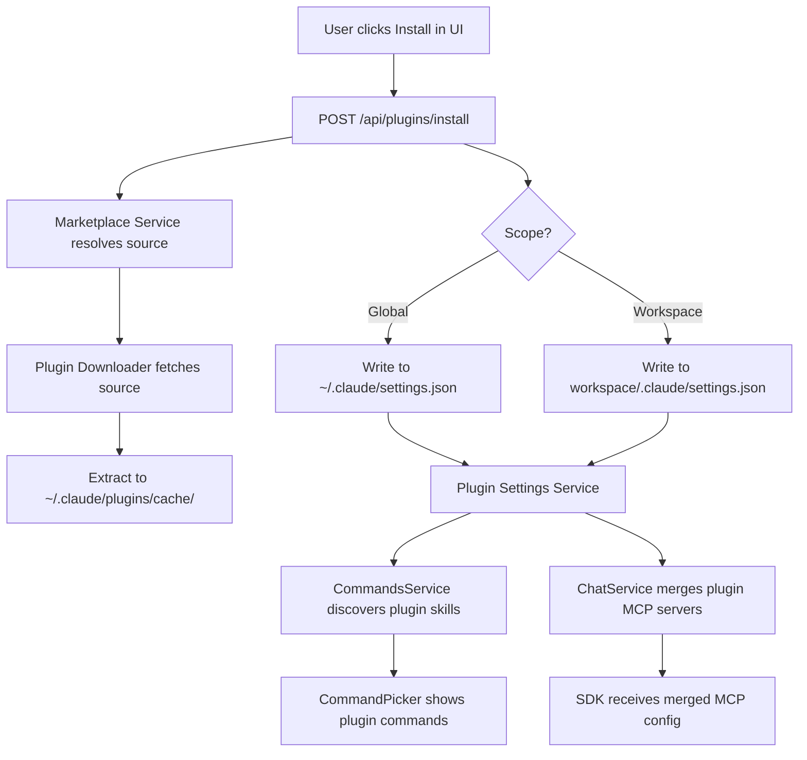

# Plugin Manager for Comate

## Summary

Add a plugin manager to Comate that mirrors Claude Code CLI's `/plugin` experience. The implementation extends the Express backend with marketplace fetching, plugin download/caching, and CLI-compatible settings I/O, then wires plugin components into the existing command discovery and SDK initialization flows. The React frontend gains a dedicated workspace plugin page with marketplace browsing, install/uninstall/update, and enable/disable controls.

---

## Problem Frame

Comate already supports workspace-level extensions — skills, commands, MCP servers, and hooks — but configuring them is entirely manual. There is no discovery mechanism, no versioning, and no sharing. Claude Code CLI solves this with a plugin ecosystem, but Comate users cannot access it from the desktop app. The plugin manager closes this gap while staying file-format-compatible with the CLI so plugins work across both tools.

*(See origin document for full problem framing, actors, and flows.)*

---

## Requirements

- R1. Discover plugins from Claude Code-compatible marketplaces configured in settings.
- R2. Support user-configurable custom marketplace registries as a secondary source.
- R3. Marketplace browser displays plugin metadata (name, displayName, description, version, author, keywords, source).
- R4. Marketplace browser supports searching by name, keyword, or description.
- R5. Install a plugin to global (user) or workspace (project) scope.
- R6. Download and cache plugins to the CLI-compatible cache directory.
- R7. Write installed plugin entries to `~/.claude/settings.json` (global) or workspace `.claude/settings.json`.
- R8. Support direct-source URL install (git repository or zip archive).
- R9. Enable or disable an installed plugin without uninstalling.
- R10. Uninstall a plugin, removing it from settings and optionally purging cached data.
- R11. Check for plugin updates and surface availability in the UI.
- R12. Update a plugin to the latest version, replacing the cached copy.
- R13. Plugin skills and commands are discovered alongside existing workspace skills and commands.
- R14. Plugin MCP server configurations merge with workspace MCP server configurations.
- R15. Plugin hooks merge with workspace hook configurations.
- R16. Plugin agents are made available to the Claude Agent SDK when enabled.

**Origin actors:** A1 (End user), A2 (Claude Code CLI), A3 (Marketplace registry)
**Origin flows:** F1 (Browse and install), F2 (Update), F3 (Uninstall), F4 (Enable/disable)
**Origin acceptance examples:** AE1 (install to workspace scope), AE2 (disable removes skill), AE3 (update replaces cache)

---

## Scope Boundaries

- Plugin authoring tools (`plugin init`, `plugin validate`, `plugin tag`) are out of scope.
- LSP servers, monitors, and themes are out of scope — the app lacks supporting infrastructure.
- Enterprise managed-scope with policy enforcement is out of scope.
- Plugin rating, review, and payment systems are out of scope.
- Dependency resolution between plugins is deferred to a later phase.
- Hook execution engine is not being built; plugin hooks are stored/merged but execution depends on future hook infrastructure.

### Deferred to Follow-Up Work

- Agent discovery and registration: R16 is partially addressed by extending the skills/commands discovery path, but full agent lifecycle management (separate from skills) is deferred pending clarification of how the Agent SDK consumes agents.
- Domain allowlists for direct URL installs: v1 allows any git/zip URL.
- Plugin dependency resolution: deferred to a later phase.

---

## Context & Research

### Relevant Code and Patterns

- `src/server/utils/claude-settings.ts` — Already reads `~/.claude/settings.json` for env extraction. The plugin manager must reuse and extend this for `enabledPlugins` read/write.
- `src/server/services/commands-service.ts` — Discovers commands from SDK init, `.claude/commands/`, `.claude/skills/`, and `~/.claude/commands/`. Plugin skills/commands are added as a new source.
- `src/server/services/chat-service.ts` — Builds SDK options including MCP servers from workspace SQLite. Plugin MCP servers are merged here.
- `src/server/routes/providers.ts` + `src/client/stores/provider-store.ts` — Excellent prior art for CRUD REST API + Zustand store + settings UI tab.
- `src/client/components/SettingsPanel.tsx` — Tabbed settings modal with dirty tracking. The plugin page follows similar patterns but lives outside SettingsPanel (accessed from workspace toolbar).
- `src/server/storage/sqlite-store.ts` — JSON-text columns for nested data; idempotent migrations.
- `src-tauri/capabilities/default.json` — No filesystem permissions granted to Tauri frontend. All plugin I/O must happen in the Express sidecar.

### Institutional Learnings

- Environment propagation through Tauri → sidecar → SDK → child process is fragile; explicit read-and-inject is required.
- Provider management plan (`docs/plans/2026-05-30-007-feat-llm-provider-management-plan.md`) established patterns for global registry + client store + settings UI that the plugin store should mirror.

### External References

- Claude Code plugin reference documentation: `https://code.claude.com/docs/en/plugins-reference`
- Plugin manifest schema (`plugin.json`) and component directory structure are defined in the origin requirements document.

---

## Key Technical Decisions

- **CLI-compatible cache and settings paths:** Plugin cache uses `~/.claude/plugins/cache/` and settings use `~/.claude/settings.json` / workspace `.claude/settings.json`. This ensures plugins installed in Comate work in the CLI and vice versa.
- **Workspace manual components win on conflict:** If a workspace skill and a plugin skill share the same invocation name, the manually-created workspace skill takes precedence. This follows the existing `project > skill > personal` priority in `CommandsService`.
- **Plugin source priority in discovery:** Plugin commands/skills are treated at the same priority level as `skill` sources (below `project`, above `personal`).
- **All file I/O in Express backend:** No Tauri filesystem permissions are added. Downloads, extractions, and settings writes happen in the Node.js sidecar.
- **Direct URL install key format:** Plugins installed from direct URLs use `name@direct` as the `enabledPlugins` key to distinguish them from marketplace installs.
- **Graceful degradation for broken plugins:** A plugin with a missing or invalid manifest is shown as "broken" in the installed list and excluded from discovery, but it does not block other plugins or manual components.

---

## Open Questions

### Resolved During Planning

- **Plugin cache path:** Exact CLI paths (`~/.claude/plugins/cache/`) for interoperability.
- **Component merge conflicts:** Workspace manual components override plugin components on name conflict.
- **Where global plugins are managed:** From the workspace plugin page via a scope selector (Global / This Workspace), per user direction.

### Deferred to Implementation

- **Agent discovery mechanism:** How the Agent SDK discovers agents from plugin directories. If the SDK auto-discovers from a filesystem path, plugin agents can be symlinked or registered at runtime.
- **Hook execution timing:** The app stores hooks in SQLite but may not pass them to the SDK. The exact integration point for hook execution depends on whether Comate gains hook infrastructure before or during this work.
- **Marketplace registry JSON schema:** The exact shape of the marketplace registry response. Assume a top-level array or object with a `plugins` key containing plugin metadata entries until a concrete registry is available.

---

## Output Structure

```
src/
├── server/
│   ├── services/
│   │   ├── plugin-settings-service.ts    # CLI settings I/O + cache path resolution
│   │   ├── marketplace-service.ts        # Registry fetching + plugin metadata
│   │   └── plugin-downloader.ts          # Git clone + zip download/extract
│   ├── routes/
│   │   └── plugins.ts                    # REST API for plugin CRUD
│   └── utils/
│       └── claude-settings.ts            # Extended with plugin settings helpers
├── client/
│   ├── stores/
│   │   └── plugin-store.ts               # Zustand store for plugin UI state
│   ├── components/
│   │   ├── PluginSettingsPage.tsx        # Main plugin settings container
│   │   ├── PluginMarketplaceTab.tsx      # Marketplace browser + search
│   │   └── InstalledPluginsTab.tsx       # Installed list + enable/disable/update/uninstall
│   └── i18n/
│       ├── en/
│       │   └── settings.json             # Plugin UI strings
│       └── zh-CN/
│           └── settings.json             # Plugin UI strings
```

---

## High-Level Technical Design

> *This illustrates the intended approach and is directional guidance for review, not implementation specification. The implementing agent should treat it as context, not code to reproduce.*



**Discovery flow:** `CommandsService.populate()` reads `enabledPlugins` from the appropriate settings file, resolves each plugin's cache path, and scans `<cache>/<plugin-id>/skills/` and `/commands/` using the existing `command-fs-parser.ts` logic. Plugin-discovered commands are tagged with source `plugin`.

**SDK integration flow:** `ChatService.buildSdkOptions()` reads enabled plugins, loads each plugin's `.mcp.json` from cache, resolves `${CLAUDE_PLUGIN_ROOT}` to the plugin directory, and merges the resulting `mcpServers` into the workspace's SQLite-stored MCP servers. Workspace-defined servers override plugin-defined servers on name conflict.

---

## Implementation Units

### U1. Plugin settings I/O and cache service

**Goal:** Create the foundational backend service for reading/writing plugin state to CLI-compatible settings files and resolving plugin cache paths.

**Requirements:** R6, R7

**Dependencies:** None

**Files:**
- Create: `src/server/services/plugin-settings-service.ts`
- Modify: `src/server/utils/claude-settings.ts`
- Test: `src/server/services/plugin-settings-service.test.ts`

**Approach:**
- Extend `claude-settings.ts` with typed helpers for `enabledPlugins` and `pluginConfigs` read/write.
- Implement `PluginSettingsService` with methods: `getInstalledPlugins(scope, workspacePath)`, `addPlugin(scope, pluginId, workspacePath)`, `removePlugin(scope, pluginId, workspacePath)`, `setPluginEnabled(scope, pluginId, enabled, workspacePath)`, `resolvePluginCachePath(pluginId)`.
- Handle missing settings files by creating them with the plugin entry.
- Handle corrupted JSON by backing up the file and creating a fresh one with the entry.

**Patterns to follow:**
- `src/server/utils/claude-settings.ts` for settings file I/O
- `src/server/storage/data-dir.ts` for directory resolution

**Test scenarios:**
- Happy path: read `enabledPlugins` from global settings
- Happy path: write plugin entry to workspace settings, preserving existing keys
- Edge case: missing `~/.claude/settings.json` → create file with plugin entry
- Edge case: corrupted workspace `.claude/settings.json` → backup and recreate
- Error path: read-only settings file → throw descriptive error
- Edge case: plugin already in `enabledPlugins` → idempotent write

**Verification:**
- Service reads and writes plugin state to both global and workspace settings files
- Settings file format matches Claude Code CLI's expected structure

---

### U2. Marketplace resolution and download service

**Goal:** Fetch marketplace registries and download plugin sources to the CLI-compatible cache.

**Requirements:** R1, R2, R3, R8

**Dependencies:** U1

**Files:**
- Create: `src/server/services/marketplace-service.ts`
- Create: `src/server/utils/plugin-downloader.ts`
- Test: `src/server/services/marketplace-service.test.ts`

**Approach:**
- `MarketplaceService` fetches JSON registries from user-configurable marketplace URLs via `fetch()`.
- Aggregate plugins from multiple registries into a unified list with `pluginId@marketplace` qualified names.
- `PluginDownloader` handles two source types:
  - **Git:** Clone repository to cache directory (use `git clone --depth 1` for efficiency).
  - **Zip:** Download via `fetch()`, stream to temp file, extract using a zip library.
- Downloaded plugins land in `~/.claude/plugins/cache/<pluginId>/`.
- Parse `plugin.json` from the downloaded directory to validate and extract metadata.

**Technical design:**
- For git sources, the cache directory name is derived from `pluginId` (not the repo URL) so that updates replace the same directory.
- For zip sources, extract to a temp directory first, validate `plugin.json`, then atomically move to the cache directory.
- Registry format assumption: `{ "plugins": [ { "name", "displayName", "description", "version", "source", "author" } ] }` until a concrete registry is provided.

**Patterns to follow:**
- `src/server/routes/providers.ts` for HTTP fetch patterns
- `src/server/utils/install-wecom-cli.ts` for local file copy patterns (not download, but cache management)

**Test scenarios:**
- Happy path: fetch marketplace registry and parse plugin list
- Happy path: download plugin from git URL → cache directory exists with `plugin.json`
- Happy path: download and extract plugin from zip URL → cache directory exists with `plugin.json`
- Error path: unreachable marketplace → return empty list with error metadata
- Error path: invalid git URL → descriptive error before clone attempt
- Edge case: partial zip download → cleanup temp files, do not leave partial cache
- Edge case: downloaded plugin missing `plugin.json` → mark as invalid, reject install
- Integration: marketplace aggregates plugins from two configured registries

**Verification:**
- Can fetch registries, download git plugins, and download zip plugins to the cache
- Invalid or partial downloads do not leave corrupted cache entries

---

### U3. Plugin REST API routes

**Goal:** Express routes for all plugin management operations.

**Requirements:** R5, R9, R10, R11, R12

**Dependencies:** U1, U2

**Files:**
- Create: `src/server/routes/plugins.ts`
- Modify: `src/server/index.ts`
- Test: `src/server/routes/plugins.test.ts`

**Approach:**
- Mount new router at `/api/plugins`.
- Endpoints:
  - `GET /api/plugins/installed?workspaceId=` — list installed plugins for scope (global + workspace)
  - `GET /api/plugins/marketplace?query=` — list available plugins with optional search filter
  - `POST /api/plugins/install` — body `{ pluginId, source, scope, workspaceId? }`
  - `POST /api/plugins/uninstall` — body `{ pluginId, scope, workspaceId?, purgeData? }`
  - `POST /api/plugins/update` — body `{ pluginId, scope, workspaceId? }`
  - `POST /api/plugins/enable` — body `{ pluginId, scope, workspaceId?, enabled }`
  - `GET /api/plugins/updates` — list plugins with available updates
- Use `PluginSettingsService` for settings I/O.
- Use `MarketplaceService` + `PluginDownloader` for install/update flows.
- Return enriched plugin metadata (from cache manifest + registry) in responses.

**Patterns to follow:**
- `src/server/routes/providers.ts` for CRUD route structure and error handling
- `src/server/routes/workspace-commands.ts` for workspace-scoped route patterns

**Test scenarios:**
- Happy path: install plugin to workspace scope → settings updated, cache populated
- Happy path: uninstall plugin with `purgeData=true` → settings cleaned, cache removed
- Happy path: check updates returns version differences
- Edge case: install already-cached plugin to new scope → only update settings, no re-download
- Error path: install fails mid-download → settings unchanged, partial cache cleaned
- Integration: install route triggers both settings write and cache update atomically

**Verification:**
- All endpoints return correct data and modify settings appropriately
- Install/uninstall operations are atomic (settings and cache stay in sync)

---

### U4. Plugin skill and command discovery

**Goal:** Extend `CommandsService` to discover skills and commands from enabled plugins in the cache.

**Requirements:** R13, R16

**Dependencies:** U1

**Files:**
- Modify: `src/server/services/commands-service.ts`
- Modify: `src/server/services/command-fs-parser.ts`
- Test: `src/server/services/commands-service.test.ts`

**Approach:**
- In `CommandsService.populate()`, after loading project skills/commands and before personal commands, read enabled plugins from the appropriate settings file.
- For each enabled plugin, resolve its cache path and scan `skills/` and `commands/` subdirectories using existing `CommandFsParser` logic.
- Add `plugin` to the `CommandSource` union type.
- Set `SOURCE_PRIORITY` so `plugin` sits between `project` (highest) and `personal` (lowest): `project(0) > plugin(1) > personal(2)`.
- If a plugin is disabled, skip its directory entirely.
- If a plugin manifest is missing or invalid, log a warning and skip that plugin (do not fail the entire discovery).

**Patterns to follow:**
- Existing skill/command discovery from `.claude/skills/` in `commands-service.ts`
- `chokidar` watcher patterns for cache invalidation when plugins change

**Test scenarios:**
- Happy path: enabled plugin's skills appear in workspace command list (Covers AE2)
- Happy path: disabled plugin's skills are excluded from command list
- Edge case: plugin skill name conflicts with workspace skill → workspace skill wins
- Edge case: plugin with no skills/commands → no error, empty contribution
- Edge case: corrupted plugin manifest → plugin skipped, other sources still discovered
- Integration: plugin commands appear in `CommandPicker` alongside existing commands
- Integration: enabling a plugin immediately adds its commands on next discovery refresh

**Verification:**
- Plugin skills/commands are discoverable and respect enable/disable state
- Discovery does not break when plugins are missing or malformed

---

### U5. Plugin MCP server and hook integration

**Goal:** Merge plugin MCP servers and hooks into workspace SDK options.

**Requirements:** R14, R15

**Dependencies:** U1, U4

**Files:**
- Modify: `src/server/services/chat-service.ts`
- Modify: `src/server/services/sdk-client.ts`
- Test: `src/server/services/chat-service.test.ts`

**Approach:**
- In `ChatService.buildSdkOptions()`, after loading workspace MCP servers from SQLite, read enabled plugins from settings.
- For each enabled plugin, load its `.mcp.json` from the cache directory if present.
- Resolve `${CLAUDE_PLUGIN_ROOT}` placeholders to the plugin's cache directory path.
- Merge plugin MCP servers into the `mcpServers` object: workspace-defined servers override plugin-defined servers on name conflict.
- For hooks: merge plugin hook configurations with workspace hooks from SQLite. Store the merged result in the workspace model (or pass directly to SDK if hook execution exists).
- Validate that referenced MCP server binaries exist on PATH; if not, log a warning and skip that server.

**Patterns to follow:**
- Existing MCP server merge logic in `chat-service.ts`
- `src/server/utils/sdk-env.ts` for environment variable construction

**Test scenarios:**
- Happy path: plugin MCP server appears in SDK options
- Happy path: workspace MCP overrides plugin MCP on name conflict
- Edge case: plugin declares MCP but binary missing from PATH → warning, server skipped
- Edge case: plugin `.mcp.json` uses `${CLAUDE_PLUGIN_ROOT}` → resolved to cache path
- Edge case: plugin has no `.mcp.json` → no error, empty contribution
- Error path: malformed `.mcp.json` → skip that plugin's MCP servers, log warning
- Integration: SDK query receives merged MCP config including plugin servers

**Verification:**
- Plugin MCP servers are passed to SDK when plugin is enabled
- Workspace MCP servers continue to work unaffected when no plugins are installed

---

### U6. Frontend plugin store

**Goal:** Zustand store for plugin UI state management.

**Requirements:** R4

**Dependencies:** U3

**Files:**
- Create: `src/client/stores/plugin-store.ts`
- Test: `src/client/stores/plugin-store.test.ts`

**Approach:**
- Create `usePluginStore` with state for: `installedPlugins`, `marketplacePlugins`, `updateAvailable`, `isLoading`, `error`.
- Actions:
  - `fetchInstalledPlugins(workspaceId?)` — GET `/api/plugins/installed`
  - `fetchMarketplacePlugins(query?)` — GET `/api/plugins/marketplace`
  - `installPlugin(pluginId, source, scope)` — POST `/api/plugins/install`
  - `uninstallPlugin(pluginId, scope, purgeData?)` — POST `/api/plugins/uninstall`
  - `updatePlugin(pluginId, scope)` — POST `/api/plugins/update`
  - `setPluginEnabled(pluginId, scope, enabled)` — POST `/api/plugins/enable`
  - `checkUpdates()` — GET `/api/plugins/updates`
- Optimistic updates for enable/disable toggles.
- Marketplace results cached with a short TTL (e.g., 5 minutes) to avoid refetching.

**Patterns to follow:**
- `src/client/stores/provider-store.ts` for CRUD store patterns
- `src/client/stores/commands-store.ts` for request deduplication

**Test scenarios:**
- Happy path: fetch installed plugins populates store state
- Happy path: enable toggle updates optimistically then confirms with server
- Error path: marketplace fetch fails → `error` set, UI can show retry
- Edge case: rapid toggle clicks → debounce to single API call, last state wins
- Edge case: install while marketplace fetch in flight → both requests complete independently

**Verification:**
- Store correctly reflects plugin state and supports all UI interactions
- Network errors surface in store error state for UI handling

---

### U7. Plugin settings page UI

**Goal:** Dedicated plugin management page with marketplace browser, installed plugin list, and scope selection.

**Requirements:** R3, R4, R5, R9, R10, R11, R12

**Dependencies:** U3, U6

**Files:**
- Create: `src/client/components/PluginSettingsPage.tsx`
- Create: `src/client/components/PluginMarketplaceTab.tsx`
- Create: `src/client/components/InstalledPluginsTab.tsx`
- Modify: `src/client/components/WorkspaceSessionList.tsx` (or equivalent workspace view) — add toolbar button
- Modify: `src/client/components/SettingsPanel.tsx` — remove Coming Soon placeholders for skills/MCP/hooks
- Modify: `src/client/i18n/en/settings.json`
- Modify: `src/client/i18n/zh-CN/settings.json`

**Approach:**
- Add a toolbar button to the bottom of each workspace's session list that opens the plugin settings page.
- The plugin settings page is a modal or dedicated view with:
  - **Scope selector:** Toggle between "Global" and "This Workspace" that determines which settings file actions target.
  - **Installed tab:** List of installed plugins (global + workspace, with visual badges). Each row shows name, version, source marketplace, enable/disable toggle, and expand-to-show components (skills, agents, MCP servers, hooks). Update indicator badge when update available. Uninstall button.
  - **Marketplace tab:** Search input + grid/list of available plugins. Each card shows metadata and an "Install" button scoped by the current selector. "Install from URL" button for direct git/zip URLs.
- Remove Coming Soon placeholders from SettingsPanel for skills, MCP, and hooks sections.
- Add i18n keys for all plugin UI strings in both English and Chinese.

**Patterns to follow:**
- `src/client/components/SettingsPanel.tsx` for tabbed layout and modal structure
- `src/client/components/ProviderSection.tsx` for list-based settings UI with toggles
- `src/client/components/ConfirmDialog.tsx` for uninstall confirmation

**Test scenarios:**
- Happy path: render installed plugins with correct enable/disable state
- Happy path: search marketplace filters results by name/keyword
- Happy path: install button triggers API and adds plugin to installed list
- Edge case: empty marketplace → show empty state with "Add marketplace URL" CTA
- Edge case: no installed plugins → show empty state with "Browse marketplace" CTA
- Edge case: scope switch from Global to Workspace updates the action target
- Error path: network error fetching marketplace → show error banner with retry

**Verification:**
- Page is accessible from workspace toolbar, functional, and follows existing UI patterns
- All plugin operations (install, uninstall, enable, update) are reachable from the UI
- Coming Soon placeholders are removed from SettingsPanel

---

## System-Wide Impact

- **Interaction graph:** `CommandsService.populate()` now reads settings files and scans plugin cache directories. `ChatService.buildSdkOptions()` now reads plugin `.mcp.json` files. Both are called on workspace switch and session start.
- **Error propagation:** A broken plugin manifest should log a warning and skip that plugin, never failing the entire discovery or SDK initialization. This is a change from the current behavior where only filesystem errors are handled.
- **State lifecycle risks:** Settings files are shared with the Claude Code CLI. Concurrent writes from Comate and CLI are possible. The plan mitigates this by reading the file, modifying the specific key, and writing back atomically — but last-write-wins is accepted as a v1 limitation.
- **API surface parity:** New `/api/plugins/*` routes are backend-only; no external API surface changes.
- **Integration coverage:** The plugin manager must be tested with real marketplace registries and real git/zip URLs to verify download and extraction. Unit tests alone cannot prove marketplace integration.
- **Unchanged invariants:** Existing workspace skills/commands/MCP/hooks stored in SQLite continue to work exactly as before. The plugin manager only adds new sources; it does not modify existing storage or discovery paths.

---

## Risks & Dependencies

| Risk | Mitigation |
|------|-----------|
| Concurrent settings file writes with CLI corrupt `enabledPlugins` | Read-modify-write the specific key atomically; document last-write-wins limitation for v1 |
| Plugin download fails mid-stream leaving partial cache | Download to temp directory, validate manifest, then atomic move to cache |
| Plugin manifest parsing errors break command discovery | Wrap plugin discovery in try/catch; skip broken plugins, log warnings |
| Marketplace registry format differs from assumptions | Start with a flexible parser that accepts both array and `{plugins:[]}` shapes; validate required fields |
| MCP server binary from plugin not on PATH | Validate binary existence before passing to SDK; skip with warning badge in UI |
| Large plugin cache grows unbounded | Uninstall purges cache by default; future work can add orphan cleanup |

---

## Documentation / Operational Notes

- The plugin manager requires no additional Tauri permissions since all file I/O stays in the Express sidecar.
- Users must have `git` installed on their system for git-based plugin installs.
- The `~/.claude/plugins/cache/` directory is shared with Claude Code CLI; do not change its structure.
- Update the user-facing documentation (if any) to describe the plugin manager and how to add custom marketplace URLs.

---

## Sources & References

- **Origin document:** [docs/brainstorms/plugin-manager-requirements.md](docs/brainstorms/plugin-manager-requirements.md)
- Related code: `src/server/services/commands-service.ts`, `src/server/services/chat-service.ts`, `src/server/utils/claude-settings.ts`
- Related plan: `docs/plans/2026-05-30-007-feat-llm-provider-management-plan.md`
- External docs: [Claude Code Plugins Reference](https://code.claude.com/docs/en/plugins-reference)
