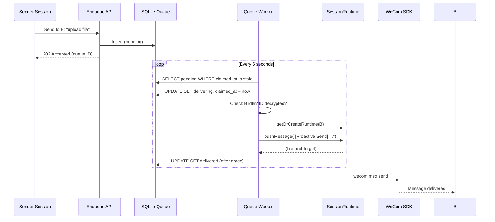

# WeCom Proactive Message Queue with Session Handoff

## Summary

Build a durable SQLite-backed queue and background worker for WeCom proactive messages. When user A asks the bot to message user B, the request is queued instead of sent immediately. A worker polls the queue and dispatches to B's session only once B's runtime is idle and B's WeCom user ID is decrypted. The agent in B's session constructs and sends the message, ensuring the outgoing message appears in B's conversation history. A standalone queue UI panel lets operators view, retry, and clean up messages; undelivered messages auto-fail after 12 hours.

---

## Problem Frame

Currently, proactive WeCom messages bypass the recipient's session history. When A asks the bot to message B, `wecomBotService.sendProactiveMessage` sends directly via the WeCom SDK. B's session transcript never sees the outgoing message, so when B replies, the bot lacks context and responds incoherently. Because the Claude Agent SDK owns the transcript, the only reliable fix is to have the agent in B's session actually perform the send.

However, this introduces two blocking conditions: B may be actively chatting (runtime busy), and B's WeCom user ID may still be encrypted until the resolver decrypts it. An inline HTTP handler cannot block for an indeterminate amount of time, and fire-and-forget risks interrupting B's active turn. A queue with a background worker is the minimal mechanism that satisfies all constraints.

---

## Stakeholder and Impact Awareness

- **End users (A and B):** A gets confirmation their request was queued. B receives messages only when not actively chatting, avoiding jarring interruptions.
- **Bot operators:** Gain visibility into stuck or failed proactive sends and can recover without restarting the app.
- **Developers:** The queue follows existing SQLite + `setInterval` patterns; no new infrastructure is introduced.

---

## Key Technical Decisions

- **SQLite queue over external message broker:** The project already uses `better-sqlite3` for all persistence and `setInterval` for background tasks (e.g., `WeComUserIdResolver`). Adding Redis or another broker would introduce operational complexity inconsistent with the self-contained desktop app model.
- **Worker polls sequentially with row-level locking:** The worker claims one entry at a time via `UPDATE ... SET status = 'delivering', claimed_at = ? WHERE status = 'pending'`. This prevents duplicate dispatch if multiple worker timers exist or the process restarts mid-dispatch.
- **`delivering` transient state before `delivered`:** After the worker pushes a message to B's runtime, it transitions the entry to `delivering` and waits a short grace period (e.g., 30 seconds) before marking `delivered`. If the process crashes during dispatch, the next poll will find the stale `delivering` entry and either complete it or fail it based on age. This at-least-once semantics is acceptable for proactive messaging.
- **Structured proactive-send directive via `pushMessage`:** The SDK only supports user messages via `SessionRuntime.pushMessage`. The worker will push a message with a recognizable prefix (e.g., `[Proactive Send]`) that the updated `send-wecom-message` skill interprets as a system directive. This is the least invasive way to trigger agent action in B's session without SDK changes.
- **Enqueue endpoint resolves recipient at request time:** The enqueue API accepts a plaintext WeCom user ID, looks up the encrypted ID via the resolver's mapping table, and stores the encrypted ID in the queue. If the mapping does not yet exist, the enqueue returns an error immediately rather than creating an orphan queue entry. This keeps the queue bounded to resolvable recipients.
- **Queue UI as a sidebar tab:** Following the existing `sessions` / `todos` / `files` pattern, the queue UI is a fourth tab in the sidebar, scoped to the active workspace.

---

## High-Level Technical Design

### Queue Lifecycle State Machine

```text
pending ──[worker claims]──► delivering ──[grace period passes]──► delivered
   │                              │
   │                              └─[agent error]──► failed
   │
   └─[12h timeout]──► failed
   │
   └─[operator deletes]──► (removed)

failed ──[operator retries]──► pending
```

### Dispatch Sequence



### Worker-to-Agent Message Protocol

The worker pushes a user message with this shape:

```text
[Proactive Send] Recipient: {recipientPlaintextId}
Original request: {originalMessageContent}
```

The `send-wecom-message` skill is updated with a new section that detects the `[Proactive Send]` prefix and instructs the agent to:
1. Extract the recipient and message content.
2. Call `wecom msg send --to-user {recipient} --message "{content}"`.
3. Confirm delivery in the response.

---

## Implementation Units

### U1. Queue storage schema and CRUD operations

**Goal:** Create the SQLite table and store methods for queue entries.

**Requirements:** R1, R2, R9 (delete), R11 (timeout tracking)

**Dependencies:** None

**Files:**
- `src/server/storage/sqlite-store.ts` (add table + methods)
- `src/server/storage/sqlite-store.test.ts` (add tests)

**Approach:**
Follow the existing `todos` table pattern. Add `wecom_proactive_messages` with columns:
- `id TEXT PRIMARY KEY`
- `workspace_id TEXT NOT NULL`
- `sender_session_id TEXT NOT NULL`
- `recipient_encrypted_user_id TEXT NOT NULL`
- `recipient_plaintext_user_id TEXT NOT NULL`
- `message_content TEXT NOT NULL`
- `status TEXT NOT NULL` (`pending`, `delivering`, `delivered`, `failed`)
- `error_reason TEXT`
- `created_at TEXT NOT NULL`
- `updated_at TEXT NOT NULL`
- `delivered_at TEXT`
- `claimed_at TEXT`
- `retry_count INTEGER NOT NULL DEFAULT 0`

Add store methods:
- `enqueueProactiveMessage(...)`
- `listProactiveMessages(workspaceId, statusFilter?)`
- `claimNextPendingMessage(workspaceId)` — atomically updates one `pending` row to `delivering`
- `updateProactiveMessageStatus(id, status, errorReason?)`
- `deleteProactiveMessage(id)`
- `getProactiveMessage(id)`

Add a cascade delete trigger or explicit cleanup in `deleteWorkspace`.

**Patterns to follow:** Existing `todos` table schema and migration pattern in `SqliteStore` constructor.

**Test scenarios:**
- Happy path: enqueue, list, update status, delete round-trip
- Edge case: `claimNextPendingMessage` returns null when no pending rows exist
- Edge case: `claimNextPendingMessage` skips rows already in `delivering`
- Error path: delete non-existent row returns false without error
- Integration: `listProactiveMessages` with `statusFilter` returns only matching rows

**Verification:** Store tests pass; queue table is queryable via store methods.

---

### U2. SessionRuntime idle-state exposure

**Goal:** Allow the worker to check whether a session is actively processing a turn before dispatching.

**Requirements:** R3, R5

**Dependencies:** None

**Files:**
- `src/server/services/session-runtime.ts`
- `src/server/services/session-runtime.test.ts`

**Approach:**
Expose `isProcessingTurn(): boolean` on `SessionRuntime`. The runtime already tracks `currentMessageStartId` (set on `assistant_start`, cleared on `assistant_done` / `interrupted`). Use this as the idle indicator. Also consider `pendingApprovals.size > 0` as "busy" since the runtime is waiting for user interaction mid-turn.

Add `cancelIdleClose(): void` to `SessionRuntime` so the worker can prevent the 10-minute idle-close timer from firing during dispatch. The existing `chatService.cancelIdleClose(sessionId)` already exists but operates from the outside; ensure the runtime-level method is available for direct use.

**Patterns to follow:** Existing `SessionRuntime.getStatus()` and `isClosed()` methods.

**Test scenarios:**
- Happy path: fresh runtime returns `isProcessingTurn() === false`
- Happy path: after `pushMessage`, runtime returns `true` until `assistant_done`
- Edge case: runtime with pending approvals returns `true`
- Edge case: after `interrupted`, runtime returns `false`
- Integration: `cancelIdleClose` resets the idle timer; timer does not fire until next `scheduleIdleClose`

**Verification:** `session-runtime.test.ts` covers idle-state transitions.

---

### U3. Queue worker and dispatch logic

**Goal:** Build the background worker that polls the queue, checks conditions, and dispatches to recipient sessions.

**Requirements:** R3, R4, R5, R6, R7, R10 (retry), R11

**Dependencies:** U1, U2

**Files:**
- `src/server/services/wecom-queue-worker.ts`
- `src/server/services/wecom-queue-worker.test.ts`

**Approach:**
Create `WeComQueueWorker` as a singleton service initialized in `src/server/index.ts` alongside `wecomUserResolver`. Use a `setInterval` with `.unref()` (follow resolver pattern) at a 5-second poll interval.

Per-poll loop:
1. For each workspace, call `store.claimNextPendingMessage(workspaceId)`.
2. If a row is claimed, check dispatch conditions:
   - Call `store.getWecomUserMapping(entry.recipientEncryptedUserId)` to verify ID is decrypted.
   - Call `chatService.getRuntimeIfExists(sessionId)` to check if runtime exists and is idle.
   - If no runtime exists but session exists, the runtime is considered idle (will be created on dispatch).
3. If conditions are not met, release the claim (reset to `pending`) and skip.
4. If conditions are met:
   - Call `chatService.getOrCreateRuntime(sessionId, workspaceId, true)` (bot session, no event handler needed).
   - Call `runtime.cancelIdleClose()`.
   - Call `runtime.pushMessage(formatProactiveDirective(entry))`.
   - Wait 30 seconds (grace period), then mark `delivered`.
   - If grace-period wait is interrupted by shutdown, leave in `delivering`; next startup will reconcile.

Timeout check: On each poll, also query for `pending` rows where `created_at < now - 12 hours` and mark them `failed` with reason `timeout`.

Reconciliation on startup: Query for `delivering` rows where `claimed_at < now - 5 minutes`. Reset them to `pending` (they were orphaned by a crash).

**Patterns to follow:** `WeComUserIdResolver` singleton + `setInterval` + `.unref()` pattern.

**Test scenarios:**
- Happy path: pending row, idle runtime, decrypted ID → dispatched and marked delivered
- Covers AE1: full happy path with runtime creation and pushMessage
- Covers AE2: busy runtime → claim released back to pending
- Covers AE3: encrypted ID → claim released back to pending
- Covers AE5: 12h timeout → auto-fail
- Error path: agent throws during runtime creation → mark failed with error reason
- Error path: process crash during grace period → stale `delivering` reset to `pending` on next startup
- Edge case: multiple workspaces with pending messages → worker processes one per workspace per poll
- Integration: `retry` resets `failed` to `pending` and worker re-evaluates

**Verification:** Worker tests pass; manual verification via enqueue API + observing queue status transitions.

---

### U4. HTTP API for enqueue and queue management

**Goal:** Expose REST endpoints for enqueueing proactive messages, listing queue entries, retrying, and deleting.

**Requirements:** R1 (enqueue), R8 (retry), R9 (delete), R12-R14 (UI data)

**Dependencies:** U1

**Files:**
- `src/server/routes/wecom-queue.ts`
- `src/server/routes/wecom-queue.test.ts`

**Approach:**
Add workspace-scoped routes under `/api/workspaces/:id/wecom-queue`:

- `POST /` — Enqueue a proactive message.
  - Body: `{ toUser: string, message: string }`
  - Look up `toUser` in `wecom_user_id_mappings` to get encrypted ID.
  - If mapping not found, return 400 with error `recipient_not_resolved`.
  - Look up session via `store.getWecomSession(workspaceId, encryptedUserId)`.
  - If no session, return 400 with error `recipient_no_session`.
  - Insert queue row with `pending` status.
  - Return 202 with queue entry ID.

- `GET /` — List queue entries for workspace.
  - Query: `?status=pending|delivering|delivered|failed`
  - Return array of queue entries.

- `POST /:entryId/retry` — Retry a failed or delivering entry.
  - Reset status to `pending`, clear `error_reason`, increment `retry_count`.
  - Return updated entry.

- `DELETE /:entryId` — Delete an entry.
  - Return 204.

Mount the router in `src/server/index.ts` with `app.use('/api/workspaces/:id/wecom-queue', wecomQueueRoutes)`.

**Patterns to follow:** Existing `todoRoutes` and `wecomBridgeRoutes` patterns (workspace-scoped, `mergeParams: true`, try/catch, JSON error responses).

**Test scenarios:**
- Happy path: enqueue with valid recipient → 202 + queue ID
- Happy path: list with status filter → filtered results
- Happy path: retry failed entry → status reset to pending
- Error path: enqueue with unresolved recipient → 400
- Error path: enqueue with no session → 400
- Error path: retry non-existent entry → 404
- Error path: delete non-existent entry → 404

**Verification:** Route tests pass; API responds correctly via manual curl/Postman.

---

### U5. Queue UI panel

**Goal:** Build the React UI for viewing and managing the queue.

**Requirements:** R12, R13, R14

**Dependencies:** U4

**Files:**
- `src/client/components/WeComQueuePanel.tsx`
- `src/client/stores/wecom-queue-store.ts`
- `src/client/components/Sidebar.tsx` (add tab)
- `src/client/i18n/en/chat.json` (add keys)
- `src/client/i18n/zh-CN/chat.json` (add keys)

**Approach:**
Add a Zustand store `wecom-queue-store.ts` that polls the list API every 5 seconds (or on demand) and exposes:
- `entries: QueueEntry[]`
- `statusFilter: string | null`
- `fetchEntries(workspaceId)`
- `retryEntry(entryId)`
- `deleteEntry(entryId)`

Create `WeComQueuePanel.tsx` as a table/list view with columns: status badge, sender, recipient, message preview, created time. Include a status filter dropdown and action buttons (retry, delete) per row. Follow the existing `TodoList` visual style.

Add a `'queue'` tab to `Sidebar.tsx` alongside `sessions`, `todos`, `files`. Use a WeCom icon or a queue icon. The tab is only visible when a workspace is active.

Add i18n keys under the `chat` namespace for queue labels.

**Patterns to follow:** `todo-store.ts` (Zustand + async API calls), `TodoList.tsx` (list UI with status badges and actions), `Sidebar.tsx` tab pattern.

**Test scenarios:**
- Happy path: panel renders entries fetched from store
- Happy path: filter dropdown updates visible entries
- Happy path: retry button calls store action and refreshes list
- Happy path: delete button calls store action and removes row
- Edge case: empty state shows appropriate message
- Edge case: error fetching entries shows error banner

**Verification:** UI renders correctly in dev mode; actions trigger API calls observable in network tab.

---

### U6. WeCom skill update for proactive-send recognition

**Goal:** Update the `send-wecom-message` skill so the agent recognizes proactive-send directives pushed by the worker and acts on them correctly.

**Requirements:** R6

**Dependencies:** U3

**Files:**
- `src/server/assets/send-wecom-message.md`
- `scripts/generate-wecom-skill.ts` (if skill is auto-generated)

**Approach:**
Add a new section to the skill markdown:

```markdown
<proactive_send>
When you receive a message starting with `[Proactive Send]`, this is a system directive to send a WeCom message on behalf of another user. Extract the recipient and message content, then send it using `wecom msg send` as normal. Do not ask clarifying questions — execute the send immediately.
</proactive_send>
```

If `scripts/generate-wecom-skill.ts` embeds the markdown into `src/server/assets/wecom-skill.ts`, regenerate the skill file. Ensure `wecomBotService.writeSkillFiles` writes the updated skill to each workspace's `.claude/skills/send-wecom-message/SKILL.md` on bot connect.

**Patterns to follow:** Existing skill markdown structure in `src/server/assets/send-wecom-message.md`.

**Test scenarios:**
- Happy path: agent receives `[Proactive Send]` message and calls `wecom msg send`
- Error path: agent receives malformed directive and responds with error note
- Integration: skill file is written to workspace on bot connect

**Verification:** Manual test: enqueue a message, observe agent in B's session execute the send via the skill.

---

## Scope Boundaries

- Authorization rules on who can message whom through the bot.
- Rate limiting or spam protection for proactive sends.
- Group chat support (1:1 only in this scope).
- Scheduled messages (future addition via a scheduled-at timestamp).
- Automatic retry with backoff (manual retry only in this scope).
- Delivery receipts or read receipts from WeCom.
- Audit logging of operator actions.

### Deferred to Follow-Up Work

- Badge count / desktop notification when messages fail.
- Auto-retry with exponential backoff.
- Scheduled / delayed sends.
- Message editing or recall after enqueue.

---

## Risk Analysis & Mitigation

| Risk | Likelihood | Impact | Mitigation |
|---|---|---|---|
| Worker dispatches to busy runtime, corrupting B's conversation | Medium | High | U2 adds `isProcessingTurn()`; worker checks before dispatch. |
| Duplicate delivery after process crash during grace period | Low | Medium | `delivering` state + 5-minute stale-claim reconciliation prevents most duplicates. At-least-once is acceptable for proactive messaging. |
| Queue grows unbounded if many users never become idle | Low | Medium | 12-hour timeout auto-fails stuck messages. |
| Recipient ID resolution fails silently, leaving orphan entries | Low | High | Enqueue API rejects unresolved recipients immediately; queue stores only encrypted IDs. |
| Skill update not propagated to existing connected workspaces | Medium | Low | `writeSkillFiles` runs on every bot reconnect; operators can manually reconnect bots if needed. |

---

## Dependencies / Assumptions

- `wecomUserResolver` maintains the `wecom_user_id_mappings` table and eventually decrypts all user IDs.
- `SessionRuntime.pushMessage` accepts arbitrary user message text; there is no SDK-level system message API.
- The desktop app runs as a single Node.js process; `setInterval` timers are sufficient for background work. No clustering or horizontal scaling is expected.
- The queue worker starts after `wecomBotService` and `wecomUserResolver` initialization in `src/server/index.ts`.

---

## Test Strategy Summary

- **Unit tests:** Store CRUD (`sqlite-store.test.ts`), runtime idle state (`session-runtime.test.ts`), worker dispatch logic (`wecom-queue-worker.test.ts`), API routes (`wecom-queue.test.ts`).
- **Integration tests:** Full happy path from enqueue API through worker dispatch to delivered status (manual or integration test).
- **UI tests:** Component rendering and interaction in `WeComQueuePanel` (manual verification via dev mode).
- **Characterization tests:** None required; this is new functionality, not legacy modification.
