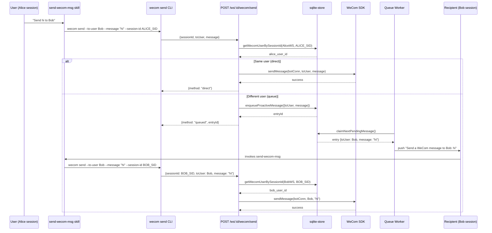

# Unify WeCom Message Skill into Send-WeCom-Msg

## Summary

Replace the split `send-wecom-message` and `enqueue-wecom-proactive-message` skills with a single `send-wecom-msg` skill, a unified `wecom send` CLI command, and a smart `POST /api/workspaces/:workspaceId/wecom/send` endpoint. The endpoint resolves the caller's WeCom user from their session ID and routes same-user messages directly through the WeCom SDK; cross-user or unmapped messages are enqueued for the existing worker to deliver as natural-language prompts.

---

## Problem Frame

The recent skill split added surface area and still forced the agent to choose the right skill up front. In practice the user intent is always "send a message to a user" — the decision of direct-send vs. enqueue should be automatic based on who the caller is and who the recipient is. Carrying two skills, two CLI commands, and two HTTP POST routes creates unnecessary complexity.

---

## Requirements

- R1. Single `send-wecom-msg` skill replaces both old skills
- R2. Skill collects `${CLAUDE_SESSION_ID}`, recipient, and message
- R3. New `wecom send` CLI command passes session_id, to_user, and message to the unified endpoint
- R4. Unified endpoint looks up caller user from session_id
- R5. Same user → direct send via WeCom SDK
- R6. Different or unmapped user → enqueue for worker delivery
- R7. Worker delivers queued messages by injecting natural-language prompts into the recipient's session
- R8. Remove all old skill, CLI, and route artifacts
- R9. Keep markdown auto-detection and drafting guidance in the skill
- R10. Keep structured CLI exit codes with detailed error messages
- R11. Preserve queue monitoring endpoints (list/retry/delete)

**Origin actors:** A1 (Sender agent), A2 (Unified endpoint), A3 (Queue worker), A4 (Recipient agent)
**Origin flows:** F1 (Direct send), F2 (Queued send)
**Origin acceptance examples:** AE1 (same-user direct), AE2 (cross-user queued), AE3 (unmapped fallback)

---

## Scope Boundaries

- **In scope:** Skill unification, CLI replacement, unified endpoint, session-to-user storage lookup, worker prompt migration, cleanup of old artifacts
- **Unchanged:** Queue monitoring list/retry/delete endpoints remain as-is, worker polling interval and retry logic, session-specific skill loading
- **Out of scope:** New automated tests for skill generation, WeCom SDK version changes

### Deferred to Follow-Up Work

- None identified

---

## Context & Research

### Relevant Code and Patterns

- `src/server/assets/send-wecom-message.md` and `send-wecom-proactive-msg.md` — existing skill sources
- `scripts/generate-wecom-skill.ts` and `generate-wecom-proactive-skill.ts` — skill generation pipeline
- `src/server/services/wecom-bot-service.ts` — skill deployment via `writeSkillFiles`/`removeSkillFiles`; direct send via `sendProactiveMessage`
- `packages/wecom-cli/src/commands/msg/send.ts` and `queue/enqueue.ts` — existing CLI commands using oclif v4 with `BaseCommand`
- `src/server/routes/wecom-bridge.ts` — `POST /api/wecom/send` and `POST /api/wecom/resolve-user`
- `src/server/routes/wecom-queue.ts` — queue POST/GET/retry/delete routes
- `src/server/services/wecom-queue-worker.ts` — polls queue and pushes `[Proactive Send]` directives into recipient runtimes
- `src/server/storage/sqlite-store.ts` — proactive message and session storage; lacks session-to-user reverse lookup
- `src/server/index.ts` — route registration

### Institutional Learnings

- Commit planning documents alongside code changes (`docs/solutions/conventions/commit-plan-and-brainstorm-files-with-code-changes.md`)
- SSE/session runtime interactions are sensitive to async teardown and identity-guarded state mutations

---

## Key Technical Decisions

- **Natural-language worker prompts over structured directives:** Removing `<proactive_send>` from the skill means the worker pushes a request like "Send a WeCom message to Alice: hello" into the recipient's session. The recipient's agent treats it as a normal user request and invokes the unified skill. This removes the tight coupling between worker string format and skill content.
- **Workspace-scoped unified endpoint:** `POST /api/workspaces/:workspaceId/wecom/send` replaces both the unscoped `/api/wecom/send` and the workspace-scoped queue POST. Using the workspace-scoped pattern is consistent with the queue monitoring routes and lets the server resolve the bot connection from the workspace.
- **CLI passes session-id explicitly:** The skill interpolates `${CLAUDE_SESSION_ID}` into the `wecom send` command. The CLI forwards it in the POST body. This keeps the skill in control of session identity and the CLI as a thin transport.
- **Storage adds session-to-user lookup:** A new `getWecomUserBySessionId` method is required because the existing storage only maps user→session, not session→user.

---

## Open Questions

### Resolved During Planning

- **Endpoint path:** `POST /api/workspaces/:workspaceId/wecom/send`
- **Worker prompt shape:** "Send a WeCom message to {recipient}: {message}"
- **Direct send msgType:** Pass through from CLI; default to text, markdown when `--msg-type markdown` is set
- **Bot connection absent during direct send:** Fallback to queue rather than error, so the message is not lost

### Deferred to Implementation

- **Exact bot-connection resolution for direct send:** Whether to expose `getBotConnectionByWorkspaceId` on `wecomBotService` or compute botId inline in the route handler. Decide once touching `wecom-bot-service.ts` for skill deployment changes. Fallback to queue if no connection is found.

---

## High-Level Technical Design

> *This illustrates the intended approach and is directional guidance for review, not implementation specification.*

---

## Implementation Units

### U1. Unified skill markdown and generation pipeline

**Goal:** Replace the two skill sources with a single `send-wecom-msg` markdown file and a single generation script.

**Requirements:** R1, R2, R9

**Dependencies:** None

**Files:**
- Create: `src/server/assets/send-wecom-msg.md`
- Modify: `scripts/generate-wecom-skill.ts`
- Modify: `package.json`
- Delete: `src/server/assets/send-wecom-message.md`
- Delete: `src/server/assets/send-wecom-proactive-msg.md`
- Delete: `scripts/generate-wecom-proactive-skill.ts`
- Delete: `src/server/assets/wecom-proactive-skill.ts`
- Modify: `src/server/assets/wecom-skill.ts` (regenerate)

**Approach:**
- Write `send-wecom-msg.md` with frontmatter `name: send-wecom-msg` and a focused description.
- Include `<objective>`, `<quick_start>` (showing `wecom send --to-user ... --message ... --session-id ${CLAUDE_SESSION_ID}`), `<workflow>`, `<examples>` ("send a message to ZhangSan"), `<anti_patterns>`, and `<success_criteria>`.
- Remove any `<proactive_send>` directive and any distinction between "send now" vs "notify another user".
- Keep markdown auto-detection guidance.
- Update `generate-wecom-skill.ts` to read the new markdown file and export `SKILL_MD`.
- Remove the proactive generation script and its generated output.
- Update `package.json` `generate:skills` to run only the remaining script.

**Patterns to follow:**
- Existing skill markdown structure in `send-wecom-message.md`
- Existing generation script escaping pattern

**Test scenarios:**
- Happy path: `npm run generate:skills` succeeds and produces a valid `src/server/assets/wecom-skill.ts`
- Edge case: verify no files reference the deleted `PROACTIVE_SKILL_MD` export
- Integration: `npm run build:server` passes after asset regeneration

**Verification:**
- `src/server/assets/wecom-skill.ts` exists and exports `SKILL_MD`
- No stale references to `send-wecom-message` or `send-wecom-proactive-msg` in `src/server/assets/`

---

### U2. Bot service skill deployment

**Goal:** Deploy only the unified skill to workspaces.

**Requirements:** R8

**Dependencies:** U1

**Files:**
- Modify: `src/server/services/wecom-bot-service.ts`

**Approach:**
- Remove the `PROACTIVE_SKILL_MD` import.
- Update `writeSkillFiles` to create `.claude/skills/send-wecom-msg/SKILL.md` only.
- Update `removeSkillFiles` to delete only `.claude/skills/send-wecom-msg/`.

**Patterns to follow:**
- Existing `writeSkillFiles` and `removeSkillFiles` implementations

**Test scenarios:**
- Happy path: on bot connect, `send-wecom-msg/SKILL.md` is written
- Edge case: on bot disconnect, the skill directory is removed
- Integration: reconnecting a bot does not leave stale `send-wecom-message` or `enqueue-wecom-proactive-message` directories

**Verification:**
- Manual reconnect test shows only `send-wecom-msg/SKILL.md` in `.claude/skills/`

---

### U3. Unified CLI command

**Goal:** Replace `wecom msg send` and `wecom queue enqueue` with a single `wecom send` command.

**Requirements:** R3, R10

**Dependencies:** U1

**Files:**
- Create: `packages/wecom-cli/src/commands/send.ts`
- Modify: `packages/wecom-cli/src/index.ts`
- Delete: `packages/wecom-cli/src/commands/msg/send.ts`
- Delete: `packages/wecom-cli/src/commands/queue/enqueue.ts`
- Delete: `packages/wecom-cli/src/commands/msg/` directory (if empty)
- Delete: `packages/wecom-cli/src/commands/queue/` directory (if empty)
- Modify: `packages/wecom-cli/test/cli.test.js`

**Approach:**
- Create `Send` command extending `BaseCommand`.
- Flags: `--to-user` (required), `--message` (required), `--session-id` (required), `--msg-type` (optional, `text` or `markdown`).
- Read `.claude/wecom-context.json` for `workspaceId` and `serverUrl`.
- POST to `POST /api/workspaces/:workspaceId/wecom/send` with `{ sessionId, toUser, message, msgType }`.
- Map HTTP responses to exit codes: `0` success, `1` invalid args, `2` missing context, `3` HTTP failure.
- Print detailed error messages on failure.
- Update `index.ts` to register the new command.
- Remove old command files and directories.
- Update CLI tests to cover the new command and verify old commands no longer appear.

**Patterns to follow:**
- Existing `BaseCommand` pattern (`packages/wecom-cli/src/commands/base.ts`)
- Existing exit code convention

**Test scenarios:**
- Happy path: command with valid flags posts correct JSON body
- Edge case: `--session-id` omitted but `CLAUDE_SESSION_ID` env var set
- Error path: missing context file returns exit code 2
- Error path: HTTP 4xx/5xx returns exit code 3 with message printed to stderr
- Integration: `wecom --help` lists only `send`, not `msg:send` or `queue:enqueue`

**Verification:**
- `npm test` in `packages/wecom-cli` passes
- `wecom send --help` shows expected flags

---

### U4. Storage layer: session-to-user lookup

**Goal:** Add a method to resolve a WeCom user ID from a session ID.

**Requirements:** R4

**Dependencies:** None

**Files:**
- Modify: `src/server/storage/sqlite-store.ts`
- Test: `src/server/storage/sqlite-store.test.ts`

**Approach:**
- Add `getWecomUserBySessionId(workspaceId: string, sessionId: string): Promise<string | null>`.
- Query the `wecom_sessions` table by `workspace_id` and `session_id`, returning `wecom_user_id`.

**Patterns to follow:**
- Existing storage query methods (parameterized SQL, async/await)

**Test scenarios:**
- Happy path: returns correct `wecom_user_id` for an existing session mapping
- Edge case: returns `null` for an unknown `session_id`
- Edge case: returns `null` when the session exists in a different workspace

**Verification:**
- `sqlite-store.test.ts` passes with new test cases

---

### U5. Unified HTTP endpoint

**Goal:** Create the smart endpoint that routes direct sends vs. queueing, and remove the old POST routes.

**Requirements:** R5, R6, R8

**Dependencies:** U4

**Files:**
- Create: `src/server/routes/wecom-send.ts`
- Modify: `src/server/index.ts`
- Modify: `src/server/routes/wecom-bridge.ts` (remove POST /api/wecom/send handler)
- Modify: `src/server/routes/wecom-queue.ts` (remove POST handler)
- Test: create `src/server/routes/wecom-send.test.ts`
- Modify: `src/server/routes/wecom-queue.test.ts` (remove or migrate POST tests)

**Approach:**
- Create `wecom-send.ts` exporting an Express router.
- Define `POST /` (mounted at `/api/workspaces/:workspaceId/wecom/send`).
- Parse body: `sessionId`, `toUser`, `message`, optional `msgType`.
- Call `sqliteStore.getWecomUserBySessionId(workspaceId, sessionId)`.
- If user found and equals `toUser`:
  - Resolve the bot connection for the workspace (via `wecomBotService` or a new helper).
  - Send the message through the WeCom SDK, respecting `msgType`.
  - Return `200` with `{ method: 'direct', sent: true }`.
- Else:
  - Call `sqliteStore.enqueueProactiveMessage(workspaceId, { toUser, message })`.
  - Return `202` with `{ method: 'queued', sent: false, entryId }`.
- In `src/server/index.ts`, mount the new router and remove old POST registrations (keep `wecomBridgeRoutes` for `/api/wecom/resolve-user`; keep `wecomQueueRoutes` for GET/retry/delete).
- Write route tests covering direct, queued, and unmapped paths.

**Patterns to follow:**
- Existing route handler patterns (`wecom-queue.ts`, `wecom-bridge.ts`)
- Existing JSON response shapes

**Test scenarios:**
- Happy path direct: same user → returns `200` with `method: 'direct'`
- Happy path queued: different user → returns `202` with `method: 'queued'` and an `entryId`
- Happy path unmapped: unknown session → returns `202` with `method: 'queued'`
- Error path: missing required body fields → `400`
- Error path: workspace has no active bot connection for direct send → fallback to queued
- Integration: direct send actually invokes the WeCom SDK send method

**Verification:**
- New route tests pass
- `npm run build:server` succeeds
- Manual curl test shows correct routing behavior

---

### U6. Queue worker natural-language prompts

**Goal:** Replace the `[Proactive Send]` directive with a natural-language prompt that triggers the unified skill.

**Requirements:** R7

**Dependencies:** U5 (queueing must work, but worker changes are mostly independent)

**Files:**
- Modify: `src/server/services/wecom-queue-worker.ts`
- Test: `src/server/services/wecom-queue-worker.test.ts`

**Approach:**
- Update the dispatch block where the worker pushes text into the recipient's `SessionRuntime`.
- Instead of `[Proactive Send] Recipient: ...\nOriginal request: ...`, push a message like `Send a WeCom message to {recipient}: {message}`.
- The recipient agent will treat this as a normal user request, load the `send-wecom-msg` skill, and execute the send via the unified CLI.
- Ensure the worker still checks prerequisites: decrypted user ID, existing session, idle runtime.

**Patterns to follow:**
- Existing worker dispatch via `sessionRuntime.pushUserMessage` or equivalent

**Test scenarios:**
- Happy path: worker injects prompt text containing recipient and original message
- Edge case: prompt text is formatted so the recipient agent reliably invokes the skill
- Error path: recipient runtime busy → worker skips and retries later (existing behavior)
- Integration: end-to-end queued message results in recipient agent executing a direct send

**Verification:**
- Worker tests pass
- Manual end-to-end test: enqueue a message, observe recipient session receives a natural send request

---

### U7. Cleanup and end-to-end verification

**Goal:** Remove all remaining old artifacts and verify the full pipeline.

**Requirements:** R8

**Dependencies:** U1, U2, U3, U5, U6

**Files:**
- Delete: `src/server/assets/send-wecom-message.md`
- Delete: `src/server/assets/send-wecom-proactive-msg.md`
- Delete: `scripts/generate-wecom-proactive-skill.ts`
- Delete: `src/server/assets/wecom-proactive-skill.ts`
- Delete: `packages/wecom-cli/src/commands/msg/send.ts`
- Delete: `packages/wecom-cli/src/commands/queue/enqueue.ts`
- Delete: `packages/wecom-cli/src/commands/msg/` directory (if empty)
- Delete: `packages/wecom-cli/src/commands/queue/` directory (if empty)
- Delete: `src/server/routes/wecom-bridge.ts` POST handler (keep `POST /api/wecom/resolve-user`)
- Delete: `src/server/routes/wecom-queue.ts` POST handler (keep GET/retry/delete)
- Verify: no stale imports referencing `PROACTIVE_SKILL_MD`, `send-wecom-message`, `enqueue-wecom-proactive-message`, `msg:send`, or `queue:enqueue`

**Approach:**
- Run `npm run generate:skills`.
- Run `npm run build:server`.
- Run `npm test`.
- Perform manual end-to-end verification: reconnect a bot, verify only `send-wecom-msg` skill exists, send same-user and cross-user messages.
- Run `npm run generate:skills`.
- Run `npm run build:server`.
- Run `npm test`.
- Perform manual end-to-end verification: reconnect a bot, verify only `send-wecom-msg` skill exists, send same-user and cross-user messages.

**Test scenarios:**
- Integration: `npm run build:server` succeeds with no errors
- Integration: `npm test` passes
- Edge case: grep for old skill names confirms zero stale references
- Integration: manual same-user send completes without queue entry
- Integration: manual cross-user send creates queue entry and delivers via recipient session

**Verification:**
- Clean build, all tests green, no stale references, manual end-to-end successful

---

## System-Wide Impact

- **Interaction graph:** The unified endpoint bridges `wecomBotService` (for direct SDK sends), `sqliteStore` (for session lookup and enqueueing), and the Express router. The worker bridges `sqliteStore` and `SessionRuntime`.
- **Error propagation:** Direct-send SDK failures should surface as HTTP 5xx with a clear message so the CLI can map to exit code 3. Queue enqueue failures should also surface clearly.
- **State lifecycle risks:** The `getWecomUserBySessionId` query must be scoped to `workspace_id` to prevent cross-workspace session collisions.
- **API surface parity:** The CLI contract changes completely; any documentation referencing `wecom msg send` or `wecom queue enqueue` must be updated.
- **Integration coverage:** End-to-end coverage must prove that a queued message flows through the worker, into a recipient session, and back through the unified endpoint as a direct send.
- **Unchanged invariants:** Queue monitoring GET/retry/delete routes, worker polling interval, SSE session runtime behavior, and WeCom bot connection lifecycle remain unchanged.

---

## Risks & Dependencies

| Risk | Mitigation |
|------|------------|
| Session ID lookup missing or slow | Add indexed query in U4; verify with store tests |
| Bot connection not resolvable from workspaceId for direct send | Implement workspace→bot lookup in `wecomBotService` during U5; fallback to queue if connection absent |
| Recipient agent misinterprets natural-language prompt | Keep prompt explicit and action-oriented ("Send a WeCom message to X: Y"); verify end-to-end in U7 |
| Old skill files left behind in existing workspaces | Bot reconnect overwrites skills; `removeSkillFiles` cleans on disconnect |
| Build breaks due to deleted imports | U7 includes a grep pass and full build/test verification |

---

## Documentation / Operational Notes

- Update any internal documentation referencing the old CLI commands (`wecom msg send`, `wecom queue enqueue`) to use `wecom send`.
- The queue monitoring UI at `/api/workspaces/:id/wecom-queue` continues to work without changes.

---

## Sources & References

- **Origin document:** [docs/brainstorms/2026-06-11-unify-wecom-message-skill-requirements.md](docs/brainstorms/2026-06-11-unify-wecom-message-skill-requirements.md)
- Related code: `src/server/services/wecom-bot-service.ts`, `src/server/routes/wecom-queue.ts`, `packages/wecom-cli/src/index.ts`
- Related plans: `docs/plans/2026-06-10-003-refactor-split-wecom-skill-plan.md` (the split being reversed)