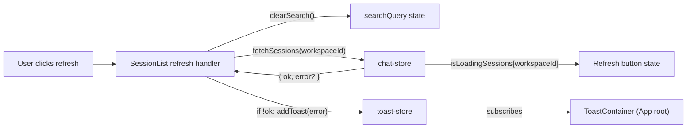
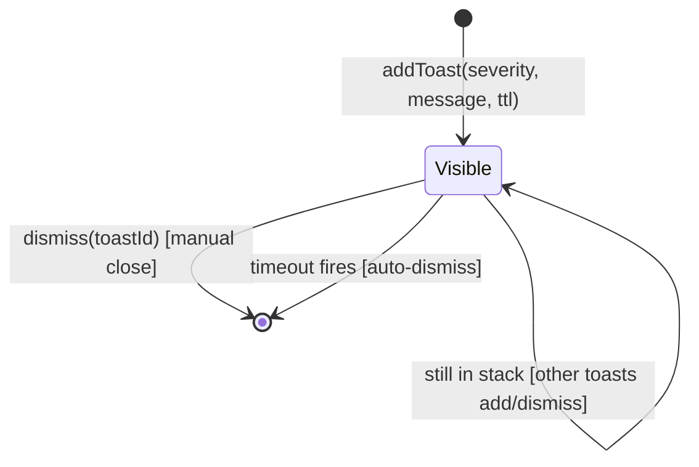

## Summary

Add a manual refresh button next to the "New Session" button in the session list sidebar that clears the search filter and reloads the current workspace's sessions, with a spinning icon and disabled state while loading. Build a reusable, application-level toast system (auto-dismiss, manual dismiss, stacking, severity levels) mounted at the app root in the top-right viewport, and use it to surface refresh failures.

## Problem Frame

Sessions are loaded automatically when a workspace mounts or switches, but the user has no manual way to reload the list after sessions are created, renamed, or deleted elsewhere. The existing background polling only refreshes session status, not the session list itself. When a refresh does fail, there is no consistent, reusable feedback surface — errors are either swallowed silently in stores or rendered as one-off inline banners (see the provider error toast in `src/client/App.tsx`). This plan ships both the manual reload affordance and the reusable toast mechanism other features can adopt.

## Requirements

- R1. A refresh button is shown next to the "New Session" button at the top of the session list sidebar for every workspace. (origin R1)
- R2. Clicking the refresh button reloads the current workspace's session list from the server. (origin R2)
- R3. Clicking the refresh button clears the session search filter. (origin R3)
- R4. The refresh button is disabled while sessions for the workspace are loading. (origin R4)
- R5. The refresh icon spins while sessions for the workspace are loading. (origin R5)
- R6. When session reload fails, an error toast is shown using the application-level toast system. (origin R6)
- R7. Toasts auto-dismiss after a configurable timeout. (origin R7)
- R8. Toasts can be dismissed manually with a close button. (origin R8)
- R9. Multiple toasts can be visible at the same time in a stacked layout. (origin R9)
- R10. Toasts support severity levels: info, success, warning, and error. (origin R10)
- R11. Toasts render in a fixed container positioned in the top-right corner of the viewport. (origin R11)
- R12. The toast system exposes a shared client-side mechanism so any feature can show a toast without adding a new rendering container. (origin R12)

## Key Technical Decisions

- **Toast system as a Zustand store + thin selector hook.** Matches the existing client store pattern (`chat-store`, `workspace-store`, `provider-store`, `todo-store`). Other features call `useToastStore` actions directly; one component subscribes and renders the stack. React Context was considered but rejected because every other cross-feature state in this app uses Zustand and the team is already comfortable with that shape.
- **Toast container mounted at the app root.** `src/client/App.tsx` already renders the layout shell and the one-off provider toast. Mounting the new container as a sibling there keeps it visible across the whole app without per-route wiring. Use `fixed` rather than the existing provider toast's `absolute` so the container escapes the layout's overflow-hidden ancestors.
- **Mirror the existing provider toast's visual language.** Reuse `bg-surface border border-border rounded-lg shadow-lg` and the top-right anchor so severity variants feel native. Severity drives the accent icon color and border tint; the card shape stays uniform.
- **`fetchSessions` returns a result rather than throwing.** Today it catches every error and only `console.error`s, so callers cannot tell whether the request failed. Change the return type to `{ ok: boolean; error?: string }` and keep the existing `isLoadingSessions` toggling. Existing call sites in `src/client/components/ChatPanel.tsx` already call it fire-and-forget, so widening the return type stays backwards-compatible. Throwing was rejected because it would surface as unhandled promise rejections at those call sites.
- **Key loading state off the existing `isLoadingSessions[workspaceId]` flag.** No new flag is needed for the disabled state or the spinning icon; the refresh handler simply calls `fetchSessions` and the component reads the per-workspace loading flag it already uses.
- **Reuse the existing `Button` UI primitive.** `src/client/components/ui/button.tsx` already exposes a `ghost` variant and an `icon-sm` size that match the new refresh button's visual weight alongside the existing "New Session" button.
- **New translation key `chat:refreshSessions`.** The existing `chat:refresh` is reused elsewhere (bot message refresh). A dedicated label keeps the refresh button's aria-label semantically distinct. `chat:refreshFailed` already exists for the error message; `common:close` already exists for the toast dismiss button.

## High-Level Technical Design

The refresh button and toast system are two decoupled concerns that share a single failure path: the refresh handler asks `fetchSessions` for a result, and on failure calls the toast store's `addToast` action. The toast container subscribes to the store and renders.

Toast lifecycle is a small state machine: a toast starts `visible` with a scheduled timeout; manual dismiss or timeout fire transitions it out of the store. The store owns the stack; the container is a pure projection of store state.

## Implementation Units

### U1. Toast store with auto-dismiss, manual dismiss, stacking, and severity

**Goal:** Build the reusable client-side toast mechanism that holds a stack of toasts and manages their lifecycle, including auto-dismiss scheduling.

**Requirements:** R7, R8, R9, R10, R12

**Dependencies:** None

**Files:**
- `src/client/stores/toast-store.ts` (create)
- `src/client/stores/toast-store.test.ts` (create)

**Approach:**
- Define `ToastSeverity = 'info' | 'success' | 'warning' | 'error'` and a `Toast` shape: `{ id: string; severity: ToastSeverity; message: string; ttl: number }`. `ttl` is the auto-dismiss delay in milliseconds; `0` disables auto-dismiss for that toast.
- Create `useToastStore` with `create()` following the existing store pattern in `src/client/stores/chat-store.ts`.
- State: `toasts: Toast[]`; pending timeouts live in a module-level `Map<string, ReturnType<typeof setTimeout>>` keyed by toast id (mirrors the existing `sessionSubscriptions` / `workspacePollIntervals` map pattern).
- `addToast({ severity, message, ttl = DEFAULT_TTL })` pushes a toast with a generated id. If `ttl > 0`, schedule a timeout that calls `dismissToast(id)` and clears itself from the map. Returns the id so callers can dismiss programmatically.
- `dismissToast(id)` clears any pending timeout for that id and removes the toast from the array immutably.
- `DEFAULT_TTL` constant lives at module scope (start at 4000ms; tunable per call via the `ttl` option).
- Id generation reuses the existing `Date.now()-Math.random().toString(36).slice(2,9)` shape used by `generateId` in `chat-store.ts` (extract a local equivalent so the store does not import chat-store).

**Patterns to follow:**
- Module-level cleanup map pattern: `sessionSubscriptions` and `workspacePollIntervals` in `src/client/stores/chat-store.ts`.
- Id generator pattern: `generateId` in `src/client/stores/chat-store.ts`.

**Test scenarios:**
- Happy path: `addToast` pushes a toast with the requested severity and message onto the stack and returns a unique id.
- Edge case (Covers AE6): two `addToast` calls leave both toasts in the stack in insertion order.
- Edge case: `addToast` with `ttl: 0` does not schedule an auto-dismiss timeout.
- Error/failure path (Covers AE5): `dismissToast` removes the toast from the stack immediately.
- Integration: an auto-dismiss timeout fires and removes the toast (use `node:test`'s mock timers via `import { mock } from 'node:test'`).
- Integration: manual dismiss before the timeout cancels the pending timeout so the same toast id is not double-removed.

**Verification:**
- `node --test src/client/stores/toast-store.test.ts` passes.
- TypeScript and ESLint pass on the new files.

### U2. Toast container component mounted at the app root

**Goal:** Render the toast stack in a fixed top-right viewport container with severity styling, manual dismiss affordance, and accessible live region semantics.

**Requirements:** R7, R8, R9, R10, R11

**Dependencies:** U1

**Files:**
- `src/client/components/ToastContainer.tsx` (create)
- `src/client/App.tsx` (modify)
- `src/client/i18n/en/common.json` (modify — add `dismissToast` label if not already present; otherwise reuse `common:close`)
- `src/client/i18n/zh-CN/common.json` (modify — same key)

**Approach:**
- Subscribe to `useToastStore` toasts in a new `ToastContainer` component.
- Render a `fixed top-2 right-2 z-50 flex flex-col gap-2` container. `z-50` sits above the existing `z-20` provider toast and `z-30` header.
- Map each toast to a card mirroring the existing provider toast's classes (`bg-surface border rounded-lg shadow-lg px-3 py-2 flex items-center gap-2 max-w-xs`). Severity drives the icon and accent color:
  - `info`: `Info` icon, neutral border.
  - `success`: `CheckCircle2` icon, `border-success/50`.
  - `warning`: `AlertTriangle` icon, `border-warning/50`.
  - `error`: `AlertCircle` icon, `border-destructive/50`.
  All four icons import from `lucide-react`, already a dependency.
- Each card carries a `role` of `alert` for `error`/`warning` and `status` otherwise; the container sets `aria-live="polite"` so screen readers announce new toasts.
- Each card has a close button with `aria-label={t('common:close')}` wired to `dismissToast(toast.id)`.
- Mount `<ToastContainer />` inside `src/client/App.tsx`'s returned JSX as a sibling to the existing main content `
` so it overlays all routes.
- Enter/exit animation: a single Tailwind transition class (`transition-all duration-200`) is sufficient; do not introduce an animation library.

**Patterns to follow:**
- Visual classes: provider toast block in `src/client/App.tsx` (top-right anchor, `bg-surface border border-border rounded-lg shadow-lg`).
- `cn()` utility for conditional severity classes: `src/client/components/ui/utils.ts`.

**Test scenarios:**
- Test expectation: none — the repo has no React component test setup, matching the precedent set in `docs/plans/2026-06-13-004-feat-session-list-activity-sort-plan.md`. Verify via manual smoke test.

**Verification:**
- Manual smoke test: trigger a toast via the refresh path (U4) and confirm the card renders in the top-right viewport, severity styling matches each variant, and the close button dismisses it.
- Vite build succeeds with the new component imported.

### U3. Surface `fetchSessions` failure to callers

**Goal:** Change `fetchSessions` so callers can detect failure without breaking existing fire-and-forget call sites.

**Requirements:** R6 (partial — enables the error toast)

**Dependencies:** None

**Files:**
- `src/client/stores/chat-store.ts` (modify)

**Approach:**
- Change `fetchSessions`'s declared return type from `Promise<void>` to `Promise<{ ok: boolean; error?: string }>`.
- Restructure the body to set the loading flag in a `try` block, attempt the fetch, and clear the loading flag in `finally`:
  - On `!res.ok`: return `{ ok: false, error: i18next.t('common:failedToFetchSessions', 'Failed to fetch sessions') }`.
  - On success: persist the loaded sessions, kick off background polling, return `{ ok: true }`.
  - On caught error: log via `console.error` (preserves current observability), return `{ ok: false, error: err instanceof Error ? err.message : i18next.t('common:networkError', 'Network error') }`.
- Existing call site in `src/client/components/ChatPanel.tsx:63` ignores the return value, so widening the type is non-breaking.
- Do not change `isLoadingSessions` semantics; it still flips true on entry and false in `finally`.

**Patterns to follow:**
- Result-style returns are not yet idiomatic in this store, but the `try/finally` shape mirrors how `loadMessages` and `fetchOlderMessages` already pair loading-flag management with their try/catch.

**Test scenarios:**
- Happy path: a successful fetch returns `{ ok: true }` and updates `sessions[workspaceId]`.
- Error/failure path: a network failure returns `{ ok: false, error }` and the loading flag is cleared.
- Error/failure path: a non-2xx response returns `{ ok: false, error }` from the `!res.ok` branch.
- Regression: the fire-and-forget call site in `ChatPanel.tsx` still compiles and does not produce unhandled rejections.

These scenarios are new territory for this repo's chat-store (no chat-store test file exists today). The implementer can verify them either by adding a `src/client/stores/chat-store.fetch-sessions.test.ts` using `node:test` with a mocked `globalThis.fetch`, or by manual smoke test in the dev build. Store-test setup is a separate deferred concern (see Scope Boundaries).

**Verification:**
- TypeScript compiles with the widened return type and the existing call site.
- Manual smoke test: initial workspace mount still loads sessions correctly.

### U4. Refresh button in SessionList wired to the toast system

**Goal:** Add the refresh button next to the "New Session" button, clear the search filter, reload sessions, and show an error toast on failure.

**Requirements:** R1, R2, R3, R4, R5, R6 (full)

**Dependencies:** U1, U3

**Files:**
- `src/client/components/SessionList.tsx` (modify)
- `src/client/i18n/en/chat.json` (modify — add `refreshSessions` aria-label)
- `src/client/i18n/zh-CN/chat.json` (modify — add `refreshSessions` aria-label)

**Approach:**
- Restructure the top-of-sidebar row so the "New Session" button shares a flex row with a new refresh button. Keep the existing create-session collapse behavior intact; the refresh button stays visible alongside the collapsed "New Session" trigger and alongside the expanded create form.
- Add the refresh button using the existing `Button` primitive with `variant="ghost"` and `size="icon-sm"`. Use `RefreshCw` from `lucide-react` as the icon.
- Wire the click handler:
  - Clear the local `searchQuery` state (R3).
  - `const result = await fetchSessions(workspaceId)` (R2).
  - If `!result.ok`, call `addToast({ severity: 'error', message: result.error ?? t('chat:refreshFailed') })` (R6).
- Read `isLoadingSessions[workspaceId]` (already selected at top of component) for the disabled state (R4). Apply `disabled={isLoading}` to the button.
- Apply the spinning class when `isLoading` is true: `className={cn('...', isLoading && 'animate-spin')}` on the `RefreshCw` icon (R5).
- Add `aria-label={t('chat:refreshSessions')}` to the button so the icon-only control is announced.
- Pull `fetchSessions` and `addToast` from their respective stores; selectors already follow the `useChatStore((s) => s.x)` pattern in the same component.
- Preserve the existing search-field reset on workspace switch — clearing search via the refresh button is independent and does not interact with that effect.

**Patterns to follow:**
- `Button` primitive usage: `src/client/components/ui/button.tsx`.
- Per-workspace loading flag selector: existing `isLoading` line in `src/client/components/SessionList.tsx`.
- `cn()` utility for conditional classes: `src/client/components/ui/utils.ts`.

**Test scenarios:**
- Happy path (Covers AE1, AE2): clicking refresh clears the search input, reloads the session list, and the list updates.
- Happy path (Covers AE3): the refresh icon spins and the button is disabled while `isLoadingSessions[workspaceId]` is true.
- Error/failure path (Covers AE4): a failed reload shows an error toast in the top-right viewport via the toast store.
- Edge case: refresh while a search filter is active resets the filter and shows the full list.
- Regression: the create-session form collapse and the search field still work as before.
- Regression: switching workspaces still resets the search query.

These are verified by manual smoke test (no component test setup in the repo).

**Verification:**
- Manual smoke test in the dev build covers each scenario above.
- ESLint and TypeScript pass.

## Scope Boundaries

### Out of scope

- Migrating the existing provider error toast in `src/client/App.tsx` to the new toast system.
- Migrating other existing inline/console error surfaces to toasts.
- Auto-refresh, visibility-based polling, or background polling of the session list.
- Per-severity duration tuning (a single default TTL applies to all severities).
- Toast action buttons (beyond the dismiss affordance).
- Toast animations beyond a single Tailwind transition.
- Server-side changes to the session list endpoint.

### Deferred to follow-up work

- Setting up a general `chat-store` test harness so `fetchSessions` and other store actions get automated coverage beyond manual smoke tests.
- Adding React component tests for SessionList and ToastContainer.
- Migrating the existing provider toast onto the new system once other call sites prove the toast API holds up.

## Acceptance Examples

- AE1. **Refresh reloads sessions.**
  - **Given:** a workspace with sessions already loaded.
  - **When:** the user clicks the refresh button.
  - **Then:** the session list is re-fetched from the server and the list updates.
- AE2. **Refresh clears search.**
  - **Given:** the user has typed `alpha` and the list is filtered.
  - **When:** the user clicks the refresh button.
  - **Then:** the search input is empty and the full session list is shown after reload.
- AE3. **Refresh shows loading state.**
  - **Given:** the user clicks the refresh button.
  - **Then:** the refresh icon spins and the button is disabled until the request completes.
- AE4. **Refresh failure shows error toast.**
  - **Given:** the session reload request fails.
  - **Then:** an error-severity toast appears in the top-right viewport and auto-dismisses after the timeout.
- AE5. **Toast manual dismiss.**
  - **Given:** an error toast is visible.
  - **When:** the user clicks the toast's close button before the timeout.
  - **Then:** the toast disappears immediately and the pending auto-dismiss is cancelled.
- AE6. **Toast stacking.**
  - **Given:** an error toast is already visible.
  - **When:** another feature shows a success toast.
  - **Then:** both toasts are visible in a stacked layout in the top-right viewport.
- AE7. **Toast severity styling.**
  - **Given:** toasts of severity info, success, warning, and error are shown.
  - **Then:** each severity renders with a visually distinct icon color and border tint.

## Sources & Research

- Origin requirements: `docs/brainstorms/2026-06-13-session-list-refresh-button-requirements.md`
- Predecessor plan with matching store/component/test conventions: `docs/plans/2026-06-13-004-feat-session-list-activity-sort-plan.md`
- Existing one-off toast visual baseline: provider toast in `src/client/App.tsx` (top-right anchor, `bg-surface border border-border rounded-lg shadow-lg`)
- Existing reusable button primitive: `src/client/components/ui/button.tsx`
- Existing store and module-level cleanup-map patterns: `src/client/stores/chat-store.ts` (`sessionSubscriptions`, `workspacePollIntervals`, `generateId`)
- Existing session-list rendering, search filter, and per-workspace loading flag: `src/client/components/SessionList.tsx`
- Existing `node:test` helper tests for layout precedent: `src/client/lib/session-filter.test.ts`, `src/client/lib/session-sort.test.ts`
- Convention: `docs/solutions/conventions/commit-plan-and-brainstorm-files-with-code-changes.md` — the brainstorm and this plan should ship with the implementation
