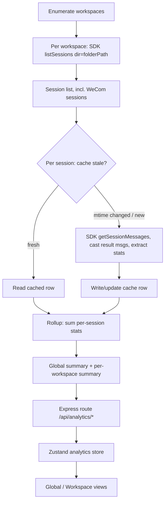

## Summary

Add two analytics dashboards to comate — a Global overview and a per-Workspace view — opened as a header modal like Settings, with all metrics derived from the Claude Agent SDK session transcripts that back comate's sessions. Aggregation is incremental: per-session extracted stats are cached in SQLite keyed by session id and transcript mtime, so only changed sessions are re-parsed on each open.

## Problem Frame

Comate surfaces token usage only as a live, in-memory, per-session indicator that resets on restart. Users cannot see usage across sessions or workspaces, model or provider mix, tool usage, or estimated spend. The sibling `claude-code-history-viewer` project provides this overview from Claude Code transcripts; comate wants the same experience for its own sessions, scoped to comate workspaces plus WeCom bot sessions.

## Requirements

**Entry and navigation**

- R1. Analytics opens as a modal from the header toolbar, following the existing Settings modal pattern.
- R2. The modal exposes two sub-tabs: Global and Workspace.

**Global statistics**

- R3. The Global tab aggregates across all comate workspaces and WeCom bot sessions.
- R4. The Global tab shows headline metric cards: total tokens with estimated cost, total messages with session count, total session duration, and distinct tools used.
- R5. The Global tab shows provider distribution, model distribution, most-used tools, a daily activity heatmap, and a top-workspaces ranking by tokens.

**Workspace statistics**

- R6. The Workspace tab provides a workspace selector (fuzzy-searchable to handle many workspaces) for choosing among the user's workspaces.
- R7. The Workspace tab shows headline metric cards scoped to the selected workspace: total messages, total tokens with session count, total and average session duration, and tools used, each with a recent growth trend.
- R8. The Workspace tab shows an activity heatmap, most-used tools, a daily activity trend, and a token-type distribution.

**Data sourcing and aggregation**

- R9. Statistics are derived from the Claude Agent SDK session transcripts via the SDK's session-message accessor, not from a new raw-message persistence layer.
- R10. Aggregation covers all comate workspaces plus WeCom bot sessions, and excludes the Claude Code CLI's own transcripts under `~/.claude/projects`.
- R11. Cost is computed from token counts and model pricing, labeled as estimated, with a pricing-coverage indicator for models whose pricing is unknown.
- R12. Aggregation is incremental: per-session extracted stats are cached keyed by session id and transcript mtime, so only sessions whose transcript changed since the last extraction are re-parsed.

**Presentation and quality**

- R13. The dashboards follow the app's light and dark themes and the existing en and zh-CN localizations.
- R14. Each view renders an empty state when no transcript data exists for its scope, a loading state while aggregation runs, and an error state if a transcript read fails.

## High-Level Technical Design

Aggregation is a data-flow pipeline from workspace enumeration to rendered charts. The cache sits between transcript extraction and rollup so unchanged sessions are summed, not re-parsed.

The per-session extraction reads only `result`-typed transcript entries (turn boundaries), which carry `usage`, `modelUsage`, `total_cost_usd`, and `duration_ms`. The cache stores one rolled row per session; rollup is pure summation plus a small set of distribution merges (model/provider/tool maps, daily buckets).

## Key Technical Decisions

- **Transcript-derived via direct JSONL reads (CONFIRMED by probe), not the SDK accessor.** The SDK's `getSessionMessages` returns only the live post-compaction view. Probe on session `9de1757a-82c4-43ba-91f6-a601c9061588` (8 compactions): the raw JSONL holds 560 usage-bearing `assistant` entries; `getSessionMessages` returned only 59 (**10.5% coverage**) — the other ~89.5% sit in compacted-away regions the accessor skips. A stats layer built on the accessor would undercount this one session roughly 9×, and the effect worsens for longer/more-compacted sessions. So v1 extraction reads the JSONL file directly at `~/.claude/projects/<encoded-cwd>/<sessionId>.jsonl`, where `<encoded-cwd>` is the workspace `folderPath` with `/`→`-` (verified: `/Users/shunyun/workspace/ai/claude-code-gui` → `-Users-shunyun-workspace-ai-claude-code-gui`). `listSessions` still comes from the SDK (it yields session ids + mtimes used for cache staleness). The accessor is not used for extraction.
- **WeCom sessions are included automatically.** WeCom bot sessions live in the same workspace project directory as normal sessions, so per-workspace session enumeration already returns them; no separate enumeration or join is needed.
- **Incremental per-session cache in SQLite.** A cache table stores one extracted-stats row per session keyed by session id and transcript mtime. On aggregation, only sessions whose mtime changed (or that are new) are re-parsed; rollups sum cached rows. First-ever extraction of a session pays the full parse; subsequent opens are cheap.
- **No charting library.** The reference app hand-rolls SVG/Tailwind chart components with no chart dependency; comate ports that approach rather than adopting recharts/d3. Avoids a new dependency and matches the reference exactly.
- **Cost is an estimate, always computed (never read).** Comate transcripts carry no `total_cost_usd` and no `result`-type entries at all (probe: 0 of each). Cost is computed from per-turn `.message.usage` token counts on `assistant` entries × a model pricing table, labeled estimated, with a coverage percentage for unknown-priced models. Per-model attribution uses `.message.model` on each assistant turn (confirm exact field during implementation).
- **Read-only snapshot, refresh on open plus manual refresh.** No live cost accrual during streaming in v1; the existing live per-session usage indicator stays a separate surface. Matches the reference app's read-only model.
- **Searchable workspace selector.** The Workspace tab uses a fuzzy-searchable selector (fuzzysort is already a dependency) for users with many workspaces.

## Implementation Units

### U1. Server: analytics cache layer

- **Goal:** Provide a SQLite-backed repository that stores per-session extracted stats and decides which sessions need re-extraction based on transcript mtime.
- **Requirements:** R12
- **Dependencies:** None
- **Files:**
  - `src/server/storage/sqlite-store.ts` (modify: add table creation + migration)
  - `src/server/services/analytics-cache.ts` (create)
  - `src/server/services/analytics-cache.test.ts` (create)
- **Approach:** Add a `session_analytics_cache` table. Directional schema (refine during implementation): `session_id` (PK), `workspace_id`, `transcript_mtime` (INTEGER), `extracted_at` (INTEGER), token totals (`total_tokens`, `input_tokens`, `output_tokens`, `cache_read_tokens`, `cache_creation_tokens`), `total_cost_usd` (REAL), `duration_ms` (INTEGER), `message_count` (INTEGER), `first_message_ts`, `last_message_ts`, and JSON blobs for `model_usage`, `tool_usage`, and `daily_stats`. The repository exposes: upsert row, lookup by session id, `staleSessionIds([(sessionId, mtime)])` returning the subset whose stored mtime differs or row is missing, and a per-workspace clear for testing. Mirror the existing migration pattern in `sqlite-store.ts` (PRAGMA table_info guards before ALTER).
- **Patterns to follow:** Existing migrations in `src/server/storage/sqlite-store.ts` (column-add guards); repository style of other services that inject the store.
- **Test scenarios:**
  - Happy path: upsert a row, lookup returns matching values.
  - Upsert twice for the same session id updates the row in place (no duplicate).
  - `staleSessionIds` flags a session whose stored mtime is older than the provided mtime.
  - `staleSessionIds` flags a session id with no stored row.
  - `staleSessionIds` returns empty when all stored mtimes match.
  - Rows for different workspaces coexist and are scoped correctly by `workspace_id`.
  - Per-workspace clear removes only that workspace's rows.
- **Verification:** `analytics-cache.test.ts` passes against a temporary in-memory or file SQLite database.

### U2. Server: analytics service and routes

- **Goal:** Aggregate transcript data into global and per-workspace summaries using the cache, expose them over Express routes.
- **Requirements:** R3, R4, R5, R7, R8, R9, R10, R11, R12
- **Dependencies:** U1
- **Files:**
  - `src/server/services/analytics-service.ts` (create)
  - `src/server/services/analytics-pricing.ts` (create, pure helpers + pricing table)
  - `src/server/services/analytics-aggregation.ts` (create, pure rollup helpers)
  - `src/server/services/analytics-transcript-path.ts` (create: resolve `<encoded-cwd>` JSONL path from `folderPath`)
  - `src/server/services/analytics-transcript-reader.ts` (create: stream-parse JSONL, sum `.message.usage` on `assistant` entries, attribute model via `.message.model`, accumulate tool usage + daily buckets, detect `compact_boundary`)
  - `src/server/services/analytics-transcript-reader.test.ts` (create)
  - `src/server/services/analytics-service.test.ts` (create)
  - `src/server/services/analytics-aggregation.test.ts` (create)
  - `src/server/routes/analytics.ts` (create)
  - `src/server/index.ts` (modify: mount the router)
- **Approach:** `AnalyticsService` enumerates workspaces via the store, calls `sdkClient.listSessions({ dir: ws.folderPath })` per workspace (returns normal and WeCom sessions together) to get session ids + transcript mtimes, computes staleness against the cache, re-extracts only stale sessions, then rolls up. **Characterization probe (run 2026-06-13 on `9de1757a…`, 8 compactions) — confirmed findings that fix the extraction design:** (1) `getSessionMessages` returns only the live post-compaction view: 59 usage entries vs 560 in the raw file (10.5% coverage), so extraction reads the JSONL file directly; (2) there is NO `result`-type entry and NO `total_cost_usd` field — per-turn usage lives on `assistant` entries' `.message.usage` (560 in the sample), and cost is always computed from usage × pricing; (3) the JSONL uses **camelCase** field names (`compactMetadata`, `preTokens`, `postTokens`, `durationMs`) — NOT the snake_case the SDK type declares — so the raw reader uses camelCase; (4) duration is sourced from `system/turn_duration` entries (15 present), not a `duration_ms` field on results; (5) transcript path is `~/.claude/projects/<encoded-cwd>/<sessionId>.jsonl` where `<encoded-cwd>` = `folderPath` with `/`→`-` (verified). Extraction therefore: resolve the path via `analytics-transcript-path.ts`, stream-parse the JSONL with `analytics-transcript-reader.ts`, sum `.message.usage` across `assistant` entries, attribute tokens to models via `.message.model`, accumulate tool usage from `tool_use` blocks, bucket by day from entry timestamps, and detect `compact_boundary` entries to set a compaction flag on the cache row. Because raw reads see the full file, compacted-away turns are summed like any other — the compaction flag drives only an informational caveat, not a coverage gap (model/tool breakdowns for compacted segments ARE recovered). `compactMetadata.preTokens`/`postTokens` are an aggregate cross-check, not the source. Keep extraction and rollup in pure helper modules so they are unit-testable without filesystem/SDK. Pricing lives in `analytics-pricing.ts` as a model-to-rates table ported from the reference app, with a `coveragePercent` computation for unknown-priced models. Routes: `GET /api/analytics/global` and `GET /api/analytics/workspaces/:id`, delegating to the service. Growth trend compares the last 7 days against the prior 7 days over `daily_stats`.
- **Patterns to follow:** `src/server/services/chat-service.ts` (SDK client injection, `dir: workspace.folderPath` usage); `src/server/routes/workspaces.ts` (Router shape); router mounting in `src/server/index.ts`.
- **Test scenarios:**
  - Rollup sums tokens, messages, and duration across multiple per-session stat rows. Covers the global-aggregation happy path.
  - Incremental path: given a mix of fresh and stale sessions, only stale session ids trigger extraction (assert via a spy/fake extractor). Covers R12.
  - Cost computed from modelUsage and pricing; a session using a model with unknown pricing is excluded from cost and lowers coverage below 100%. Covers AE3, R11.
  - WeCom sessions present in the enumerated list are included in the rollup (model the enumeration as returning a WeCom-sourced session). Covers AE2, R10.
  - Empty workspace returns a zeroed summary with empty distributions. Covers AE1.
  - Growth trend over a fixed `daily_stats` fixture yields the expected last-7-vs-prior-7 deltas.
  - `GET /api/analytics/global` returns the summary shape; `GET /api/analytics/workspaces/:id` returns a workspace-scoped summary and 404s for an unknown workspace id.
  - Compaction completeness: a fixture session whose transcript contains a `compact_boundary` is extracted with pre- and post-compaction turns both summed (extraction path chosen by the characterization step), the cache row records a compaction flag, and the rollup summary surfaces a coverage caveat for the compacted segment. Covers the top risk and R11 honesty.
- **Verification:** Service and aggregation tests pass; routes return the expected shapes via the route-level test pattern in `src/server/routes/`.

### U3. Client: analytics store

- **Goal:** Provide a Zustand store that fetches global and per-workspace summaries and exposes loading, data, and error state.
- **Requirements:** R14
- **Dependencies:** U2
- **Files:**
  - `src/client/stores/analytics-store.ts` (create)
  - `src/client/stores/analytics-store.test.ts` (create)
- **Approach:** Follow `src/client/stores/workspace-store.ts`. State holds `globalSummary`, `workspaceSummaries` keyed by workspace id, `isLoading` flags for each scope, and `error`. Actions `fetchGlobal()` and `fetchWorkspace(workspaceId)` use plain `fetch` against the routes from U2, transition `isLoading` true→data on success and true→error on failure. A `refresh()` re-fetches the currently-active scope for the manual refresh button.
- **Patterns to follow:** `src/client/stores/workspace-store.ts` (create + set shape, plain fetch); `src/client/stores/chat-store.ts` fetch helpers.
- **Test scenarios:**
  - Initial state has null summaries and false loading flags.
  - `fetchGlobal` transitions loading→data on a successful fetch (mocked global fetch).
  - `fetchGlobal` transitions loading→error when fetch rejects or returns non-ok.
  - `fetchWorkspace` stores the summary keyed by workspace id.
  - `refresh` re-invokes the last-fetched scope.
- **Verification:** Store tests pass with a mocked fetch.

### U4. Client: shared chart and metric components

- **Goal:** Port the reference app's self-contained SVG/Tailwind analytics components so the views can compose them.
- **Requirements:** R4, R5, R8, R13
- **Dependencies:** None
- **Files:**
  - `src/client/components/analytics/MetricCard.tsx` (create)
  - `src/client/components/analytics/SectionCard.tsx` (create)
  - `src/client/components/analytics/BillingBreakdownCard.tsx` (create)
  - `src/client/components/analytics/ActivityHeatmap.tsx` (create)
  - `src/client/components/analytics/ToolUsageChart.tsx` (create)
  - `src/client/components/analytics/ProviderDistributionChart.tsx` (create)
  - `src/client/components/analytics/ModelDistributionList.tsx` (create)
  - `src/client/components/analytics/DailyTrendChart.tsx` (create)
  - `src/client/components/analytics/TokenDistributionChart.tsx` (create)
  - `src/client/components/analytics/formatters.ts` (create: number, currency, duration formatters)
- **Approach:** Port the components from the sibling `claude-code-history-viewer` project's `src/components/AnalyticsDashboard/components/` and shared utils, adapting class names to comate's Tailwind theme tokens (the reference uses `bg-background`/`text-muted-foreground`; comate uses `bg-surface`/`text-tertiary` etc. — remap to comate tokens). Keep components presentational and props-driven. Use `lucide-react` icons consistent with the rest of the app.
- **Patterns to follow:** Reference app components (sibling project); comate theme tokens in `tailwind.config.js` and `src/client/components/SettingsPanel.tsx`.
- **Test expectation:** none — presentational SVG/Tailwind components. The repo has no React rendering test harness; parity is verified visually against the reference app during U5/U6.
- **Verification:** Components render without type errors and visually match the reference app when composed in the views.

### U5. Client: Global and Workspace views, selector, and states

- **Goal:** Compose the shared components into the two dashboard views, with a searchable workspace selector and loading, error, and empty states.
- **Requirements:** R3, R4, R5, R6, R7, R8, R14
- **Dependencies:** U3, U4
- **Files:**
  - `src/client/components/analytics/GlobalStatsView.tsx` (create)
  - `src/client/components/analytics/WorkspaceStatsView.tsx` (create)
  - `src/client/components/analytics/WorkspaceSelector.tsx` (create)
  - `src/client/lib/workspace-filter.ts` (create: pure helper)
  - `src/client/lib/workspace-filter.test.ts` (create)
  - `src/client/i18n/en/analytics.json` (create)
  - `src/client/i18n/zh-CN/analytics.json` (create)
  - `src/client/i18n/index.ts` (modify: register the namespace)
- **Approach:** `GlobalStatsView` reads `globalSummary` from the store and renders metric cards, distribution/tool/heatmap charts, and the top-workspaces ranking. `WorkspaceStatsView` reads `workspaceSummaries[selectedId]`, renders the scoped cards with growth trends and charts, and owns the `WorkspaceSelector`. The selector filters workspaces by name via a pure `matchesWorkspaceQuery` helper (fuzzysort), defaulting to the active workspace. Loading state shows a spinner (mirror the reference app's `LoadingState`); empty state shows a message when the summary is zeroed with no sessions; error state surfaces the store error with a retry. Add the `analytics` i18n namespace with en and zh-CN entries for all labels.
- **Patterns to follow:** Reference app `GlobalStatsView`/`ProjectStatsView` (sibling project); `src/client/lib/session-filter.ts` for the pure-filter-helper pattern; i18n registration in `src/client/i18n/index.ts`.
- **Test scenarios:**
  - `matchesWorkspaceQuery` matches by name case-insensitively; empty query returns all workspaces; non-matching query returns none.
  - WeCom-flagged or long workspace names truncate/filter correctly.
- **Verification:** Filter helper test passes; both views render the reference app's metric and chart families and handle loading, empty, and error states.

### U6. Client: analytics modal shell, header entry, and tab state

- **Goal:** Add the analytics modal opened from the header, with Global/Workspace tab switching, and wire it into the app shell.
- **Requirements:** R1, R2, R13
- **Dependencies:** U5
- **Files:**
  - `src/client/components/AnalyticsPanel.tsx` (create)
  - `src/client/App.tsx` (modify: add `showAnalytics` state and render the panel)
  - `src/client/components/HeaderToolbar.tsx` (modify: add the analytics trigger button)
- **Approach:** Mirror `SettingsPanel.tsx`'s shell — a `showAnalytics` boolean in `App.tsx`, a header toolbar button, and a fixed overlay with a centered card and a row of tab buttons (Global/Workspace). The active tab is persisted (localStorage key, or a field on the analytics store) so reopening the modal lands on the last-used tab, matching the origin F1 flow; it is not ephemeral component state. The panel hosts `GlobalStatsView` and `WorkspaceStatsView` based on the active tab. Add i18n keys for the modal title, tab labels, and trigger button label.
- **Patterns to follow:** `src/client/components/SettingsPanel.tsx` (modal shell, internal tabs); `src/client/App.tsx` `showSettings` wiring; `src/client/components/HeaderToolbar.tsx` button style.
- **Test expectation:** none — modal shell and wiring; verified manually that the header button opens the modal, tabs switch, and the modal closes on backdrop/Esc consistent with Settings.
- **Verification:** Header analytics button opens the modal; tabs switch between Global and Workspace; Esc/backdrop closes it; both themes render correctly.

## Scope Boundaries

### Deferred to Follow-Up Work

- Session statistics view (per-session rank, tokens per message, duration rank, percentile, timeline) — deferred in the origin brainstorm.
- Direct JSONL file reading for first-touch extraction *speed* — the incremental cache already makes re-opens cheap, so the speed optimization is deferred. NOTE: direct JSONL reading for *completeness* (compaction recovery) is NOT deferred — see the U2 characterization step and the compaction TOP RISK. If the SDK accessor truncates compacted sessions, v1 reads JSONL directly regardless of the speed optimization.
- Caching the rolled-up global/workspace summaries for instant open; v1 recomputes rollups (cheap) over cached per-session rows.
- Real-time cost accrual during active streaming; v1 is a read-only snapshot.
- Exporting or sharing analytics reports.

### Outside this product's identity

- Reading or scanning the Claude Code CLI's own transcripts under `~/.claude/projects` — comate sessions only.

## Open Questions

*Deferred to implementation*

- ~~Confirm transcript entry shape~~ — **resolved by probe (2026-06-13):** no `result`-type and no `total_cost_usd`; per-turn usage is on `assistant` entries' `.message.usage` (560 in the sample). Cost is computed, never read. JSONL fields are camelCase (`compactMetadata`, `preTokens`, `durationMs`). Remaining sub-question: confirm `.message.model` is the per-turn model-name field used for model distribution.
- ~~Confirm SDK accessor compaction behavior~~ — **resolved by probe (2026-06-13):** `getSessionMessages` returns only the live post-compaction view (59/560 = 10.5% coverage on the sample). v1 reads JSONL directly; transcript-path resolution (encoded cwd under `~/.claude/projects`, `/`→`-`) is a required sub-task (`analytics-transcript-path.ts`).
- Exact workspace selector component shape (combobox vs dropdown); the searchable behavior is fixed, the chrome is not.
- Pricing table source: port the reference app's model-to-rates table verbatim, or maintain a slimmed table covering the models comate users actually hit.
- Whether the cache row's JSON blobs (`model_usage`, `tool_usage`, `daily_stats`) should be normalized into child tables; a JSON column is proposed for v1 simplicity.

## Risks & Dependencies

- **Compaction truncates the SDK accessor's view (CONFIRMED by probe; mitigated by design).** Probe on `9de1757a…` (8 compactions): raw JSONL has 560 usage-bearing `assistant` entries; `getSessionMessages` exposed only 59 (10.5%). Stats built on the accessor would undercount this session ~9× and worse for longer sessions. Mitigation (now in the design): v1 reads JSONL directly, so all 560 are summed and compacted sessions need no special token handling — the compaction flag drives only an informational caveat. Residual: none for token/cost/message totals; model/tool breakdowns for compacted-away turns ARE recovered because the raw entries are present.
- **Transcript entry shape (RESOLVED by probe).** Confirmed: no `result`-type entry and no `total_cost_usd`; per-turn usage is on `assistant` entries' `.message.usage`. JSONL fields are camelCase (`compactMetadata`, `preTokens`, `durationMs`), not the SDK type's snake_case — the raw reader uses camelCase. `message-normalizer.ts` corroborates the `sessionMessage.message` access pattern. No residual risk.
- **First-open latency for heavy histories.** A workspace with many never-cached sessions pays full extraction on first open. Mitigation: loading indicator, incremental cache makes subsequent opens fast, and a follow-up could background-warm the cache.
- **Cache staleness edge.** Stats update only when transcript mtime changes; if the SDK ever rewrites a transcript without bumping mtime, stats could lag. Mitigation: rely on mtime (the SDK appends on turn completion, which updates mtime), and expose a manual refresh that can force re-extraction.
- **SDK transcript-path encoding (RESOLVED).** Verified: `<encoded-cwd>` = `folderPath` with `/`→`-`, under `~/.claude/projects/`. The resolver is a small helper (`analytics-transcript-path.ts`), not a risk.

## Sources & Research

- Origin requirements: `docs/brainstorms/2026-06-13-global-and-workspace-analytics-requirements.md`.
- Reference app (sibling project `claude-code-history-viewer`): global, project, and session views under `src/components/AnalyticsDashboard/views/`; calculation utilities under `src/components/AnalyticsDashboard/utils/`; chart components under `src/components/AnalyticsDashboard/components/`; pricing utilities; types `src/types/analytics.ts` and `src/types/stats.types.ts`; copy strings `src/i18n/locales/en/analytics.json`.
- SDK transcript plumbing: `src/server/services/sdk-client.ts` (`listSessions`, `getSessionMessages` with `dir: workspace.folderPath`); `src/server/services/chat-service.ts` (SDK usage, WeCom session tagging via `listWecomSessions`); SDK type definitions in `node_modules/@anthropic-ai/claude-agent-sdk/sdk.d.ts` (result-success shape, `modelUsage`, `usage`).
- Existing token display (separate, untouched): `src/client/components/SessionTokenUsage.tsx`, `src/client/stores/chat-store.ts` (`SessionUsage`, `TurnUsage`).
- Patterns to mirror: modal shell `src/client/components/SettingsPanel.tsx` and `src/client/App.tsx` (`showSettings`); header `src/client/components/HeaderToolbar.tsx`; store `src/client/stores/workspace-store.ts`; routes `src/server/routes/workspaces.ts` mounted in `src/server/index.ts`; SQLite migrations `src/server/storage/sqlite-store.ts`; i18n `src/client/i18n/index.ts`; pure-helper test pattern `src/client/lib/session-filter.ts` + `.test.ts`. Tests use Node's built-in runner (`node:test` + `node:assert`).
