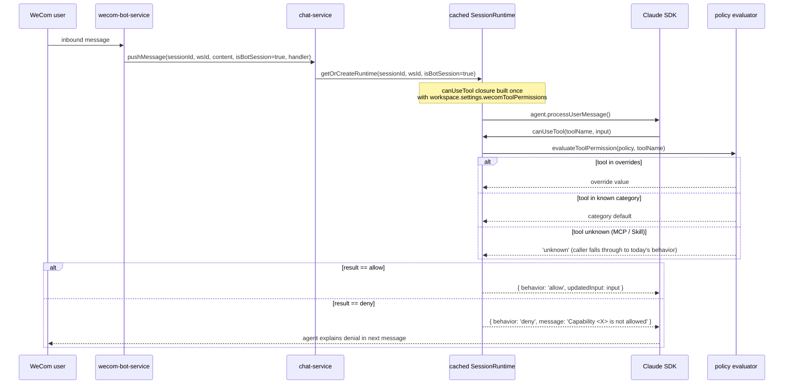
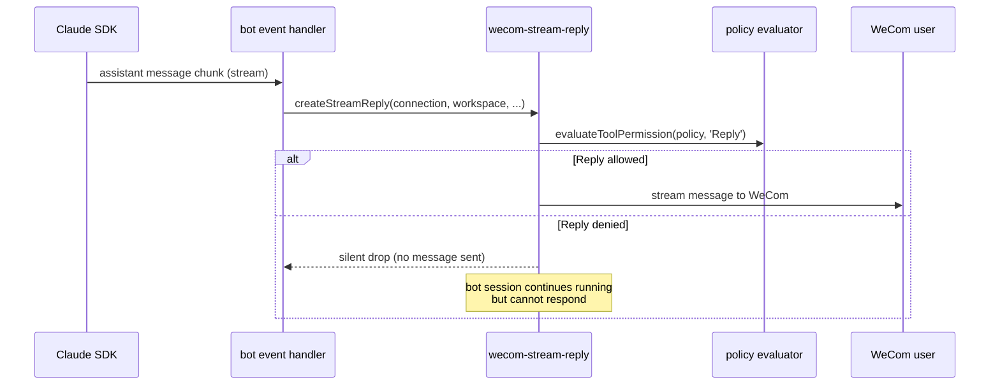
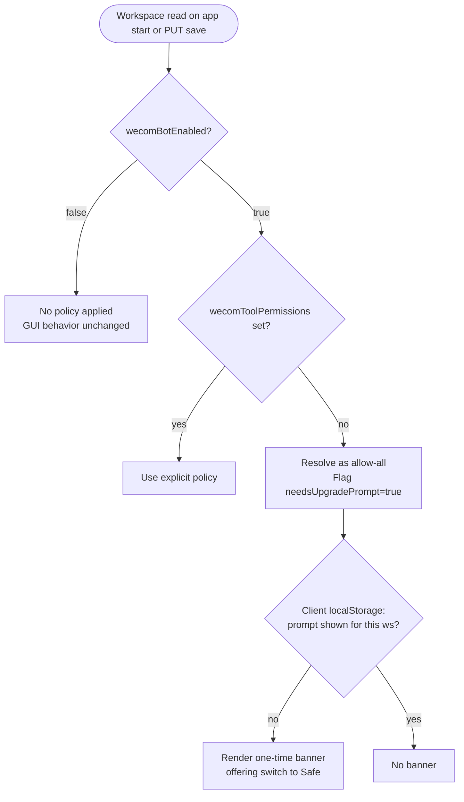

# feat: Configurable Tool Permissions for WeCom Bot

## Summary

Replace the hardcoded allow-all in `src/server/services/chat-service.ts:789–794` with a configurable two-tier permission policy: six fixed categories with allow/deny defaults plus per-tool overrides, persisted per workspace via the existing `WorkspaceSettings` JSON blob. Add a new "Permissions" sub-tab to the WeCom settings. New deployments default to a safe preset; existing bot-enabled deployments are grandfathered to allow-all with a one-time prompt to switch.

---

## Problem Frame

The brainstorm (`docs/brainstorms/2026-06-14-wecom-bot-tool-permissions-requirements.md`) captures the full problem frame. The short version: an external auditor's question — "what can this bot do?" — currently has no reviewable answer. The hardcoded branch ignores the tool name and returns allow for every call. This plan replaces that branch with an explicit, configurable, per-workspace policy.

---

## Requirements

Carried forward from origin. Each requirement is implemented across one or more units; cross-references appear under each unit's `**Requirements:**` field.

- **Permission model:** R1, R2, R3, R4
- **Defaults and migration:** R5, R6, R7, R8
- **Permission check behavior:** R9, R10, R11
- **Configuration UI:** R12, R13, R14, R15
- **Persistence:** R16, R17

Origin flows covered: F1 (first-time enablement), F2 (upgrade grandfathering), F3 (denied tool), F4 (admin customization).
Origin acceptance examples covered: AE1–AE7.

---

## Scope Boundaries

### In scope

- Six-category two-tier permission model with category defaults and per-tool overrides
- Safe preset default for new bot-enabled workspaces; grandfathering with one-time prompt for existing ones
- New Permissions sub-tab in the WeCom settings (alongside Connection, Users, Prompts)
- Persistence on `WorkspaceSettings` via the existing PUT `/api/workspaces/:id` save path
- Permission gating for Claude SDK built-in tools AND the WeCom Reply capability on bot sessions only
- Named posture presets as shorthand for setting category defaults (Allow all / Safe / Custom)
- Read-only policy view for non-admin viewers
- Vitest + React Testing Library scaffolding for client component tests (none exists today)

### Deferred to follow-up work

- Permission gating for MCP tools — `canUseTool` fires for them today; categorizing dynamic tool inventories is its own design
- Permission gating for Skills — same rationale as MCP
- Audit log of permission changes (who changed what, when) — separate compliance feature
- Per-user or per-role permission policies within a workspace
- Tool-level command filtering inside a category (e.g., allow `ls` but deny `rm` inside Shell)
- Runtime invalidation on policy change (current design: policy changes apply to the next bot session, not mid-conversation)

### Outside scope

- Changes to the GUI session permission flow — bot sessions only
- Changes to the WeCom connection logic, file handling, or prompt templates
- Changes to how the Claude Agent SDK is initialized beyond the `canUseTool` branch and the reply path

---

## Context & Research

### Relevant code and patterns

- **Hardcoded branch to replace:** `src/server/services/chat-service.ts:789–794` inside `buildSdkOptions` (signature at line 669). The function already receives the full `Workspace` object — `workspace.settings.wecomToolPermissions` is reachable at the call site without an extra store round-trip.
- **SDK `PermissionResult`:** `node_modules/@anthropic-ai/claude-agent-sdk/sdk.d.ts:1887–1899`. Two-arm union: `{ behavior: 'allow'; updatedInput? }` or `{ behavior: 'deny'; message; interrupt? }`. **No `'ask'` behavior exists.** Bot policy is synchronous binary.
- **`canUseTool` signature:** `(toolName, input, options) => Promise<PermissionResult>` (`sdk.d.ts:155–197`). The current implementation ignores the third argument's `options`; the deny message goes to the model in the conversation, not to a UI prompt.
- **`isBotSession` threading:** `pushMessage` at `chat-service.ts:487` → `getOrCreateRuntime` at line 341 → `buildSdkOptions` at line 399. Set to `true` at exactly three call sites in `src/server/services/wecom-bot-service.ts:190, 225, 261` (text, voice, file/image/video). GUI chat route at `src/server/routes/chat.ts:240` calls `pushMessage` without the flag.
- **Cached runtime implication:** `getOrCreateRuntime` caches by `sessionId` (cache map at `chat-service.ts:347`). Options are built once at runtime creation and reused for the lifetime of the cached runtime. Policy changes do not affect already-cached runtimes; they apply on the next runtime open after idle-close.
- **Reply is not an SDK tool:** The WeCom send-message path lives in `src/server/services/wecom-bot-service.ts:352` (`sendMessage`) and `:369` (`sendDirectMessage`), invoked through the `handler` closure passed to `pushMessage`. The reply stream is constructed by `src/server/services/wecom-stream-reply.ts`. Gating the Reply category must hook this path, not `canUseTool`.
- **WorkspaceSettings schema:** `src/server/models/workspace.ts:1–9`. Flat optional fields. Adding `wecomToolPermissions` is a one-line interface change; no DDL migration (settings column is `TEXT NOT NULL DEFAULT '{}'`).
- **`wecomFilePromptTemplate` precedent:** Added at three touchpoints — model interface (`workspace.ts:8`), client form state + Save spread (`SettingsPanel.tsx:32–46, 182–236`), consumer read at `wecom-bot-service.ts:298–307` (`resolveFilePrompt`). The new feature follows the same shape.
- **WeCom settings UI pattern:** `WeComBotSection` at `src/client/components/SettingsPanel.tsx:1006–1262`. Sub-tabs declared as union type `WeComSubTab` at line 1004; rendered via `subTabs` array at lines 1071–1094; each tab body is a self-contained `
`. The Prompts sub-tab at lines 1241–1259 (single `<textarea>`) is the smallest precedent.
- **Form state pattern:** `WorkspaceFormState` at `SettingsPanel.tsx:32–46`, hydrated from `Workspace.settings` via `buildWorkspaceFormState` (line 48). Held per workspace in `workspaceState: Record<string, WorkspaceFormState>` (line 92). Edits via `updateSelectedWorkspace` (line 259). Save via `handleSave` (line 182) — the field list in the spread is hand-maintained, so adding a field means adding one line.
- **Workspace save round-trip:** Server PUT at `src/server/routes/workspaces.ts:54–77`. Wholesale settings merge in `UpdateWorkspaceInput.settings`. Bot connection lifecycle (`wecomBotService.connect`/`disconnect`) is the only side effect — no other setting triggers service action. Client action `updateWorkspace` at `src/client/stores/workspace-store.ts:111–132`.
- **No version-detection infrastructure:** No `PRAGMA user_version`, no `schemaVersion`, no `app_version` table, no `seenVersion` in client storage. Grandfathering must use absence-of-field detection on `WorkspaceSettings` plus a client-side "shown" flag.
- **`useAppSettings` hook:** `src/client/hooks/use-app-settings.ts` reads from localStorage. The grandfathering "shown" flag follows this pattern.
- **i18n structure:** `src/client/i18n/en/settings.json:135–164` and the parallel `zh-CN/settings.json`. Top-level `wecom` object with flat leaf keys plus a nested `wecom.tabs` object (one key per sub-tab). The `botSessionNote` key at line 155 (both locales) currently promises "full tool auto-approval" and becomes inaccurate the moment this feature ships — must be updated.

### Test infrastructure

- **Server-side tests use Node's built-in `node:test`:** confirmed across `src/server/services/chat-service.test.ts`, `sqlite-store.test.ts`, `analytics-*.test.ts`, and ~14 other test files. Pattern: imports from `node:test` and `node:assert`, mocks via direct method replacement on imported singletons, accesses internals via `__setXxxForTesting` / `__restoreXxx` exports.
- **No client-side test infrastructure exists:** No Vitest, no React Testing Library, no jsdom. This plan adds them.
- **Test file naming:** `<source-name>.test.ts` adjacent to source.

### Institutional learnings

- `docs/solutions/conventions/commit-plan-and-brainstorm-files-with-code-changes.md` — stage plan + brainstorm docs alongside code on the feature branch.
- No prior learnings on `canUseTool` policy, WorkspaceSettings extension, grandfathering, or permission UI. This feature is net-new for the knowledge base; `/ce-compound` after implementation could seed `docs/solutions/conventions/` with the two-tier category/override shape and the grandfathering mechanism.

---

## Key Technical Decisions

- **Policy shape: posture + categoryDefaults + overrides.** Storage carries three fields: a `posture` shorthand (`'allow-all' | 'safe' | 'custom'`) used by the UI, a `categoryDefaults: Record<Category, 'allow' | 'deny'>` map used by the evaluator, and an optional `overrides: Record<toolName, 'allow' | 'deny'>` map. The evaluator consults overrides first, then category default, then denies. Posture and categoryDefaults can drift (selecting a preset rewrites defaults; manual toggles flip posture to `custom`), so the evaluator never reads `posture` — it is purely a UI affordance. *(see origin: R2, R3, R4)*

- **Grandfathering via absence-of-field + localStorage shown-flag.** When the server reads a workspace where `wecomBotEnabled === true` and `wecomToolPermissions === undefined`, the resolved policy is allow-all and a `needsUpgradePrompt: true` flag is returned to the client. The client tracks prompt-shown state in localStorage keyed by workspace ID (precedent: `useAppSettings`). No DB schema change required; no app-version tracking infrastructure required. *(see origin: R7, R8; Dependencies / Assumptions)*

- **Reply gating at the send path, not in `canUseTool`.** Reply is not an SDK tool — it lives in `wecom-bot-service.ts`'s send methods, invoked through the handler closure passed to `pushMessage`. The gate is a single policy check at the entry of the reply stream construction. Both the SDK tool gate and the Reply gate consult the same `evaluateToolPermission` / category-lookup logic; they just live at different code locations. *(see origin: R11; research finding 3)*

- **Policy changes apply to the next bot session, not mid-conversation.** The SDK runtime cache (`chat-service.ts:347`) is keyed by sessionId and built once. Invalidating cached runtimes on policy change would force-close active bot conversations, which is more disruptive than the alternative. The UI surfaces this with a hint; invalidation is deferred (Scope Boundaries). *(see origin: Dependencies / Assumptions; research finding 2)*

- **Server-side tests use existing `node:test` pattern; client tests use Vitest + RTL.** Two frameworks coexist; each used where it fits. The existing `chat-service.test.ts` pattern (mock singletons via direct method replacement, export `__setXxxForTesting` helpers for internals) is the model for new server tests. Vitest + React Testing Library + jsdom is added only for client component tests.

- **Read-only viewer mode = disabled controls on the same UI, not a separate route.** The Permissions tab renders the same controls; the editor-role check sets `disabled` on toggles and hides the Save button. Matches the lightest implementation; a separate route is not justified by the requirement.

- **Posture selector exposes three presets: Allow all, Safe, Custom.** Selecting Allow all or Safe rewrites `categoryDefaults` to the preset's values. Manual toggle changes flip posture to Custom. No additional named presets (Read-only, Reply-only) — those are reachable via Custom + manual toggles, and adding them as named presets adds UI surface without new capability.

---

## High-Level Technical Design

### Permission decision flow (SDK tools)

### Permission decision flow (Reply capability)

### Grandfathering state resolution

---

## Implementation Units

### U1. Storage shape, policy types, and evaluator

- **Goal:** Establish the data model and the pure decision logic that the rest of the feature depends on.
- **Requirements:** R2, R3, R4, R16, R17.
- **Dependencies:** None.
- **Files:**
  - `src/server/models/workspace.ts` — extend `WorkspaceSettings` with `wecomToolPermissions?: ToolPermissionPolicy`
  - `src/server/services/tool-permission-policy.ts` — new file: `ToolPermissionPolicy` type, `ToolCategory` enum, `CATEGORY_TOOL_MAP` constant, `SAFE_PRESET` and `ALLOW_ALL_PRESET` constants, `evaluateToolPermission(policy, toolName)` function, `resolveEffectivePolicy(workspace)` function
  - `src/server/services/tool-permission-policy.test.ts` — new file: unit tests using `node:test`
- **Approach:**
  - `ToolPermissionPolicy` shape: `{ posture: 'allow-all' | 'safe' | 'custom'; categoryDefaults: Record<ToolCategory, 'allow' | 'deny'>; overrides?: Record<string, 'allow' | 'deny'> }`. The `posture` field is UI shorthand only; the evaluator ignores it.
  - `CATEGORY_TOOL_MAP`: maps each of the six categories (File Read, File Write, Shell, Network, Sub-agents, Reply) to its member tool names per R3's table. Reply maps to the sentinel string `'__wecom_reply__'` since it is not an SDK tool.
  - `evaluateToolPermission(policy, toolName)`: returns `'allow'`, `'deny'`, or `'unknown'`. Unknown is returned when the tool is not in any category (MCP, Skill, future SDK tool without a clear category fit) — callers fall through to today's behavior per R10.
  - `resolveEffectivePolicy(workspace)`: returns `{ policy: ToolPermissionPolicy; source: 'explicit' | 'grandfathered-allow-all' | 'default-allow-all'; needsUpgradePrompt: boolean }`. When `wecomToolPermissions` is unset and `wecomBotEnabled` is true, returns allow-all with `needsUpgradePrompt: true`. When bot is disabled, returns allow-all with `source: 'default-allow-all'` (no policy applies to GUI sessions anyway).
- **Patterns to follow:** Type definitions in `models/`; pure logic in `services/` exported as named functions (precedent: `resolveFilePrompt` in `wecom-bot-service.ts:298–307`). Server imports use `.js` extension.
- **Test scenarios:**
  - `evaluateToolPermission` returns override value when override exists for tool — covers R2, R4, AE2
  - `evaluateToolPermission` returns category default when no override — covers R4
  - `evaluateToolPermission` returns `'unknown'` for tool not in any category — covers R10, AE5
  - `evaluateToolPermission` returns `'deny'` for unconfigured policy (defensive default)
  - `SAFE_PRESET` matches R3's table (File Read allow, File Write deny, Shell deny, Network deny, Sub-agents deny, Reply allow) — covers R6
  - `ALLOW_ALL_PRESET` allows every category — covers R5
  - `resolveEffectivePolicy` returns explicit policy when `wecomToolPermissions` is set — covers R1
  - `resolveEffectivePolicy` returns allow-all + `needsUpgradePrompt: true` when bot enabled and policy unset — covers R7, R8
  - `resolveEffectivePolicy` returns allow-all + no prompt when bot disabled — covers R1
- **Verification:** All `node:test` scenarios pass. The evaluator is a pure function with no I/O; running `node --test src/server/services/tool-permission-policy.test.ts` exercises every code path.

### U2. Server-side permission gating for SDK tools and Reply path

- **Goal:** Replace the hardcoded allow-all in `buildSdkOptions` with policy evaluation; gate the Reply capability at the send path.
- **Requirements:** R1, R4, R9, R10, R11.
- **Dependencies:** U1.
- **Files:**
  - `src/server/services/chat-service.ts` — replace the `if (isBotSession)` block at lines 789–794 with a policy-aware `canUseTool` that calls `evaluateToolPermission`
  - `src/server/services/wecom-stream-reply.ts` — add a policy check at the entry of the reply stream construction; consult `evaluateToolPermission(policy, '__wecom_reply__')`
  - `src/server/services/wecom-bot-service.ts` — ensure the `handler` closure passed to `pushMessage` carries the resolved policy so `wecom-stream-reply` can consult it without an extra store lookup (the workspace is already loaded at handler creation)
  - `src/server/services/chat-service.test.ts` — extend with new test cases for the policy-aware `canUseTool`
- **Approach:**
  - In `buildSdkOptions`, when `isBotSession === true`, read `resolveEffectivePolicy(workspace)` once and capture the result in the closure scope. The `canUseTool` callback calls `evaluateToolPermission(policy, toolName)`; on `'allow'` returns `{ behavior: 'allow', updatedInput: input }`; on `'deny'` returns `{ behavior: 'deny', message: '<capability name> is not allowed for this workspace' }`; on `'unknown'` falls through to today's allow-all behavior (covers R10).
  - The capability name in the denial message maps tool name → category label (e.g., `Bash` → `'Shell commands'`).
  - In `wecom-stream-reply.ts`, accept the policy (or the workspace) as a parameter at construction time. If `evaluateToolPermission(policy, '__wecom_reply__')` returns `'deny'`, the reply stream becomes a no-op (chunks are received but not forwarded to WeCom). The agent continues running; the user simply receives nothing.
  - For non-bot sessions, behavior is unchanged — GUI sessions do not set `canUseTool` via this branch.
- **Patterns to follow:** The existing `chat-service.test.ts` pattern — mock `workspaceStore.get` to return a workspace with the desired `wecomToolPermissions`, drive a `pushMessage` call, and assert on the SDK's received `canUseTool` result. Use the existing `__setIdleGracePeriodForTesting` export pattern if any new test-only hooks are needed.
- **Test scenarios:**
  - Bot session invokes SDK tool in allowed category — `canUseTool` returns allow — covers R1, AE3 (partial)
  - Bot session invokes SDK tool in denied category — `canUseTool` returns deny with capability name in message — covers R9, AE1
  - Bot session invokes tool with allow override on denied category — `canUseTool` returns allow — covers R2, AE2
  - Bot session invokes tool with deny override on allowed category — `canUseTool` returns deny — covers R2
  - Bot session invokes MCP tool — `canUseTool` returns allow (today's behavior) — covers R10, AE5
  - GUI session invokes any tool — `canUseTool` is not set by this branch (GUI uses its own approval flow) — covers R1
  - Workspace with `wecomToolPermissions === undefined` and bot enabled — `canUseTool` returns allow for all SDK tools (grandfathered) — covers R7
  - Reply path with Reply category allowed — reply stream forwards chunks — covers R11
  - Reply path with Reply category denied — reply stream drops chunks silently — covers R11, AE6
- **Verification:** `node --test src/server/services/chat-service.test.ts` passes including the new cases. Manually: configure a workspace with Shell denied, send a WeCom message that triggers `Bash`, observe the bot reply with the denial explanation.

### U3. Grandfathering detection and one-time-prompt state

- **Goal:** Detect pre-feature workspaces on first read after upgrade and surface the one-time prompt state to the client.
- **Requirements:** R5, R7, R8.
- **Dependencies:** U1, U4 (the client hook test requires Vitest scaffolding that U4 introduces).
- **Files:**
  - `src/server/services/tool-permission-policy.ts` — `resolveEffectivePolicy` (from U1) already returns `needsUpgradePrompt`. Add a small `postUpgradePromptState(workspace)` helper if the client needs more than the boolean.
  - `src/server/routes/workspaces.ts` — extend the GET handler (and the PUT response) to include the resolved `needsUpgradePrompt` flag in the workspace payload, so the client does not have to re-derive it
  - `src/client/hooks/use-wecom-permissions-prompt.ts` — new hook: reads `needsUpgradePrompt` from the workspace payload, tracks "shown" state in localStorage keyed by workspace ID (precedent: `useAppSettings`)
  - `src/client/hooks/use-wecom-permissions-prompt.test.ts` — new file: unit tests (Vitest, since this is a client hook — alternatively fold into U4's RTL setup)
  - `src/server/services/tool-permission-policy.test.ts` — extend with cases for the prompt-state helper
- **Approach:**
  - The server-derived `needsUpgradePrompt` flag is the single source of truth for "should we show the banner." The client's responsibility is only to remember "have we shown it" so the banner does not reappear on every WeCom settings open.
  - localStorage key shape: `wecom-permissions-prompt-shown:<workspaceId>` → `'true'`. The hook reads this on mount; the banner calls the hook's `markShown()` after first render.
  - The hook does not need to handle the "user switched to safe preset" case explicitly — once `wecomToolPermissions` is set on the workspace, `resolveEffectivePolicy` returns `needsUpgradePrompt: false` and the banner stops rendering regardless of localStorage.
- **Patterns to follow:** `useAppSettings` at `src/client/hooks/use-app-settings.ts` for localStorage access. The existing workspace GET handler shape at `src/server/routes/workspaces.ts`.
- **Test scenarios:**
  - `resolveEffectivePolicy` returns `needsUpgradePrompt: true` for bot-enabled workspace with unset policy — covers R7
  - `resolveEffectivePolicy` returns `needsUpgradePrompt: false` once policy is set — covers R8
  - `useWecomPermissionsPrompt` returns `shouldShow: true` when server flag is true and localStorage is unset
  - `useWecomPermissionsPrompt` returns `shouldShow: false` when localStorage says shown — covers R8 dismissal
  - `useWecomPermissionsPrompt.markShown()` writes localStorage; subsequent reads return `shouldShow: false`
  - Different workspace IDs have independent shown-state
- **Verification:** `node --test` passes for server logic. Vitest passes for client hook (U4 provides the Vitest config). Manual: enable bot on a workspace before upgrading, run app, open WeCom settings, observe banner; dismiss; reopen, banner does not reappear.

### U4. Vitest + React Testing Library scaffolding and Permissions sub-tab UI core

- **Goal:** Add client test infrastructure; ship the primary Permissions sub-tab UI (posture selector, category toggles, per-tool overrides, save wiring) and the i18n strings it depends on.
- **Requirements:** R12, R13, R14, R16.
- **Dependencies:** U1, U3.
- **Files:**
  - `package.json` — add `vitest`, `@testing-library/react`, `@testing-library/jest-dom`, `@testing-library/user-event`, `jsdom` as devDependencies; add `test:client` script
  - `vitest.config.ts` — new file: configure environment as jsdom, set up `setupFiles` for `@testing-library/jest-dom`
  - `src/client/components/SettingsPanel.tsx` — extend `WeComSubTab` union (line 1004) with `'permissions'`; add to `subTabs` array (lines 1071–1094); add the sub-tab body (posture selector, category cards with toggles, override expander, save button); extend `WorkspaceFormState` (lines 32–46) with `wecomToolPermissions`; extend `handleSave` (line 182) with the new field in the settings spread
  - `src/client/components/PermissionsSubTab.tsx` — new component: receives the current policy + onUpdate callback; renders posture selector (Allow all / Safe / Custom) and the six category cards
  - `src/client/components/PermissionsSubTab.test.tsx` — new file: component tests via RTL
  - `src/client/i18n/en/settings.json` — add `wecom.tabs.permissions` plus leaf keys for posture names, category names, category descriptions, override labels, save-time warning, freeze hint
  - `src/client/i18n/zh-CN/settings.json` — parallel additions
  - `src/client/i18n/en/settings.json` line 155 and `zh-CN/settings.json` line 155 — update `botSessionNote` to reflect that bot sessions now follow the workspace's tool permission policy
- **Approach:**
  - The sub-tab body is a vertical stack of category cards. Each card has a header (category name + description), a default toggle (allow/deny), and an expandable "Tools in this category" section listing each tool with an override control (Inherit / Always allow / Always deny).
  - Posture selector sits at the top: three buttons or a segmented control. Selecting Allow all or Safe calls `onUpdate` with the corresponding preset's `categoryDefaults` and `posture: '<preset>'`; preserves existing `overrides`. Any manual toggle or override change after that flips `posture` to `'custom'`.
  - The save path uses the existing `handleSave` — adding one line to the settings spread is the only wiring required on the save side.
  - `botSessionNote` rewrite: from "Bot sessions have full tool auto-approval" to "Bot sessions follow this workspace's tool permission policy" (and zh-CN equivalent).
- **Patterns to follow:** The Prompts sub-tab (lines 1241–1259) for the smallest tab body precedent; `WeComBotSection` for state and onUpdate wiring; `react-i18next` `useTranslation('settings')` with `t('wecom.<key>')` for all strings.
- **Test scenarios:**
  - Renders all six categories with correct tool membership — covers R3, R13
  - Default toggle flips category default; posture becomes Custom — covers R2, R14
  - Override control flips tool override; parent category default unchanged — covers R2, AE2
  - Posture selector "Allow all" sets all category defaults to allow — covers R14
  - Posture selector "Safe" sets category defaults to R3's safe-preset values — covers R6, R14, AE3
  - Save button calls onUpdate with the full `wecomToolPermissions` object — covers R16
  - Empty / undefined policy on first render shows posture as "Allow all" (grandfathered default) — covers R5
- **Verification:** `npm run test:client` passes. Manual: open WeCom settings on a workspace, switch to Permissions sub-tab, observe posture selector and six category cards, toggle defaults, expand tools, set an override, click Save, reopen — values persist.

### U5. Permissions sub-tab UX details

- **Goal:** Add the secondary UX surfaces the brainstorm requires: grandfathering one-time banner, read-only viewer mode, all-denied-including-Reply save-time warning, policy-freeze hint.
- **Requirements:** R8, R11, R15.
- **Dependencies:** U4.
- **Files:**
  - `src/client/components/PermissionsSubTab.tsx` — extend with: one-time banner rendered above the posture selector when `useWecomPermissionsPrompt().shouldShow` is true; "All categories including Reply are denied" warning rendered when save is attempted in that state; "Changes apply to the next bot session" hint rendered as static text below the posture selector
  - `src/client/components/SettingsPanel.tsx` — pass a `readOnly` flag (derived from workspace viewer role) down to `WeComBotSection` and through to the Permissions sub-tab; when `readOnly`, all toggles and the Save button are disabled
  - `src/client/hooks/use-wecom-permissions-prompt.ts` — already created in U3; U5 wires the hook's output to the banner
  - `src/client/components/PermissionsSubTab.test.tsx` — extend with cases for banner rendering, dismissal, read-only mode, all-denied warning
- **Approach:**
  - The grandfathering banner is a dismissible info card with a CTA "Switch to Safe preset" that calls `onUpdate` with `SAFE_PRESET` and a "Dismiss" button that calls `useWecomPermissionsPrompt().markShown()`.
  - Read-only mode reuses the same component tree; the `disabled` attribute cascades through controls. No separate route.
  - The all-denied warning fires at save time: if every category default is `deny` and no override allows Reply, the Save button shows a confirmation dialog ("The bot will be unable to respond to messages. Save anyway?"). User confirms; save proceeds.
  - The policy-freeze hint is static text — no logic, just an i18n string. It sets the expectation that mid-conversation policy changes do not take effect immediately.
- **Patterns to follow:** Existing info banner / toast patterns in `SettingsPanel.tsx` (connection status indicator at the top of WeComBotSection is the closest precedent for an inline status block).
- **Test scenarios:**
  - Renders grandfathering banner when `shouldShow` is true — covers R8, AE4
  - Banner CTA "Switch to Safe preset" calls `onUpdate` with `SAFE_PRESET` and calls `markShown()` — covers R8, F2
  - Banner "Dismiss" calls `markShown()` without changing policy — covers R8, AE4
  - Banner does not render when `shouldShow` is false — covers R8
  - Read-only mode disables every toggle and the Save button — covers R15, AE7
  - Save attempt with all categories denied including Reply shows confirmation dialog — covers R11, AE6
  - Confirmation dialog "Save anyway" proceeds with save; "Cancel" returns without saving
  - Policy-freeze hint renders as static text below the posture selector
- **Verification:** `npm run test:client` passes including new cases. Manual: simulate upgrade scenario (workspace with bot enabled and no policy), open WeCom settings, observe banner; click "Switch to Safe preset", observe policy change; reopen, banner gone.

---

## System-Wide Impact

- **End users (WeCom message senders):** When a tool is denied, the bot replies explaining the denial instead of silently running the tool. When Reply is denied, the bot processes messages but sends nothing back — the user perceives the bot as unresponsive.
- **Workspace admins:** New configuration surface in WeCom settings. Existing deployments see a one-time prompt on first visit post-upgrade; no forced migration.
- **External auditors:** Can answer "what can this bot do?" by reading the Permissions sub-tab. Read-only access does not require write permissions.
- **Developers:** New `ToolPermissionPolicy` type and `tool-permission-policy.ts` module are the canonical policy logic — future MCP/Skills gating should extend this module rather than forking.
- **Operational:** No new infrastructure. No new dependencies on the server side. Client gains Vitest + RTL as devDependencies.

---

## Risks & Dependencies

- **SDK `canUseTool` stability.** The plan depends on the SDK continuing to call `canUseTool` for every tool invocation and on the `'allow' | 'deny'` PermissionResult shape. A future SDK version that adds a third behavior or removes the callback would require rework. Mitigation: the SDK is `^0.3.144` and the callback shape is stable across the vendored types.

- **Cached runtime vs. policy changes.** Admins who change policy mid-conversation will not see the change apply to the active bot session. The UI surfaces this with a hint. If user feedback demands immediate effect, runtime invalidation becomes a follow-up — but invalidating mid-conversation is itself disruptive and was deferred intentionally.

- **Reply-deny silent failure mode.** If an admin denies every category including Reply, the bot processes messages but cannot respond. The save-time warning mitigates this, but a misconfigured workspace could appear "broken" to end users. Mitigation: the warning is loud and the default safe preset keeps Reply allowed.

- **MCP / Skills audit gap.** The brainstorm explicitly accepted this gap for v1; the deferred follow-up to cover MCP and Skills is the most likely source of "why isn't X gated?" questions from auditors. Mitigation: documented in Scope Boundaries; the evaluator returns `'unknown'` for non-builtin tools so the gate is additive.

- **i18n drift.** Adding keys to en without zh-CN (or vice versa) silently falls back to the key string at runtime; the lint script does not catch this. Mitigation: U4 adds both locales in the same unit; a follow-up could add a CI check that compares key sets.

- **Test framework coexistence.** Two test runners (`node --test` for server, `vitest` for client) means two test commands. Mitigation: a top-level `npm test` script can run both; package.json scripts make the separation explicit.

---

## Open Questions

### Resolve before implementation

_None._

### Deferred to implementation

- Q-impl-1. Exact wording of the denial message the bot sends when a tool is denied (R9). Direction: "<Capability name> is not allowed for this workspace's bot." Final wording tuned during i18n key authoring.
- Q-impl-2. Exact appearance of the grandfathering banner (info card vs. toast vs. modal). The plan defaults to info card based on the existing connection-status block precedent; visual tuning happens during implementation.
- Q-impl-3. Whether the policy-freeze hint should also surface a "Close all active bot sessions" action for admins who want immediate effect. Deferred — the action is not in scope per the policy-freeze decision, but adding it as a power-user affordance is cheap if requested.

---

## Acceptance Examples

Carried from origin. Each is covered by test scenarios in the implementation units.

- AE1 — denied Shell category → bot attempts Bash → denial reply — covered by U2 test scenarios
- AE2 — File Write allowed with Edit override deny → Write succeeds, Edit denied — covered by U1 and U2 test scenarios
- AE3 — fresh workspace enables bot → safe preset active by default — covered by U4 test scenarios
- AE4 — existing deployment upgrades → bot continues working, banner offers safe preset — covered by U3 and U5 test scenarios
- AE5 — MCP tool invoked → today's behavior, not gated — covered by U2 test scenarios
- AE6 — all categories denied including Reply → save-time warning, bot silent on next message — covered by U5 test scenarios
- AE7 — read-only viewer opens Permissions tab → controls disabled — covered by U5 test scenarios

---

## Sources & Research

- Brainstorm (origin): `docs/brainstorms/2026-06-14-wecom-bot-tool-permissions-requirements.md`
- Precedent for adding a configurable bot-specific setting: `docs/brainstorms/2026-06-12-wecom-file-prompt-template-requirements.md`, `docs/plans/2026-06-12-002-feat-wecom-bot-file-handling-plan.md`
- SDK type definitions: `node_modules/@anthropic-ai/claude-agent-sdk/sdk.d.ts:155–197` (`CanUseTool`), `:1887–1899` (`PermissionResult`), `:1520–1526` (`PermissionMode` — orthogonal, not used here)
- Hardcoded branch to replace: `src/server/services/chat-service.ts:789–794`
- WeCom settings UI: `src/client/components/SettingsPanel.tsx:1006–1262`
- Workspace model and persistence: `src/server/models/workspace.ts:1–9`, `src/server/storage/sqlite-store.ts:457–471, 476–509, 1146–1159`
- Test infrastructure precedent: `src/server/services/chat-service.test.ts` (node:test pattern, mock singletons, `__setXxxForTesting` helpers)
- Institutional learning: `docs/solutions/conventions/commit-plan-and-brainstorm-files-with-code-changes.md`
