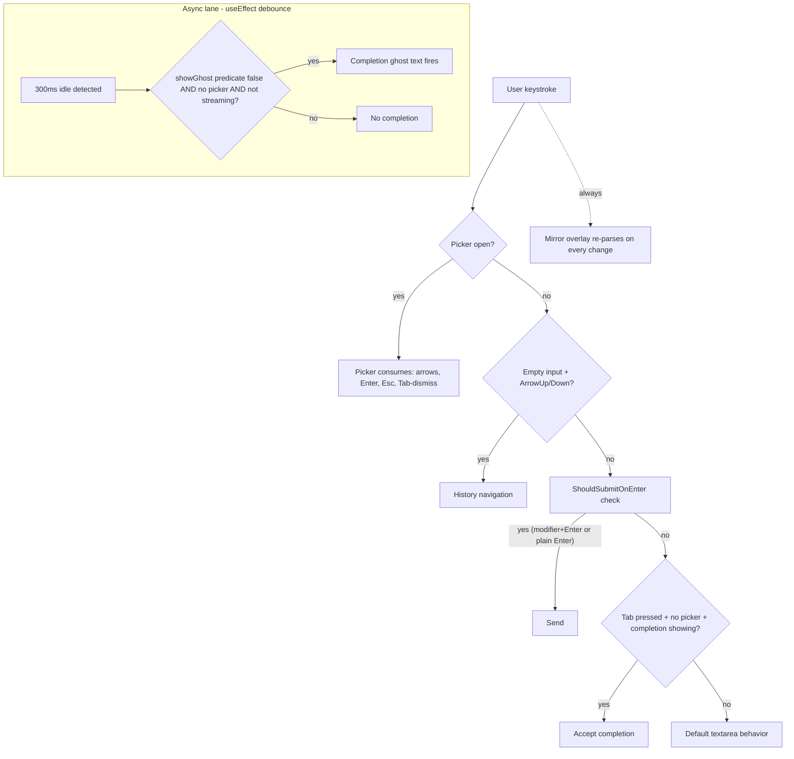

# Prompt Input Enhancements

## Summary

Four enhancements to the prompt input in `src/client/components/PromptInput.tsx`: (1) slash/file picker trigger flexibility with fuzzy and glob matching, (2) per-session prompt history with arrow-key recall and a searchable popup, (3) live markdown source highlighting via a mirror-div overlay behind the existing textarea, and (4) ghost-text sentence completion from a local n-gram model. All four preserve the existing textarea integrations (pickers, draft state, send-on-Enter, approval surface, provider/approval toolbar).

---

## Problem Frame

Today's prompt input is a plain `<textarea>` with two pickers that fire on narrow triggers and match by strict prefix or server-side fuzzy, no history recall, and no live syntax feedback. The four frictions are detailed in the origin brainstorm; in short: `/` only triggers at start of input and does not reliably reopen after dismissal, `CommandPicker` is strict-prefix only (no fuzzy, no glob), there is no shell-style history recall, and prompts with markdown structure are typed blind.

The remedy is four scoped behavior upgrades behind one architectural commitment: preserve the textarea's existing hooks (`onChange`, `onKeyDown`, draft state, picker anchoring, send-on-Enter, IME composition) so the four features compose with each other and with the existing pickers, approval surface, and provider/approval toolbar.

---

## Requirements

Carried forward from origin (see `docs/brainstorms/2026-06-14-prompt-input-enhancements-requirements.md`). Grouped by capability; R-IDs preserved verbatim for traceability.

**Triggers and matching**

- R1. Both `/` and `@` open their picker when typed at the start of an empty input OR after a whitespace character mid-text. Mid-word `@` does not trigger.
- R2. After a picker is dismissed, typing the trigger character again reopens the picker without requiring the input to be empty.
- R3. Only one picker is open at a time. Opening one closes the other.
- R4. While a picker is open, continued typing updates the filter. Typing whitespace after the trigger segment, pressing Escape, or pressing Tab dismisses the picker.
- R5. `CommandPicker` uses fuzzy subsequence matching (e.g., `cmt` matches `/commit`), matching `FilePicker`'s existing behavior.
- R6. When a picker filter contains `*` or `?`, the picker switches to glob-style wildcard matching for that filter. Otherwise fuzzy.
- R7. Zero glob matches shows an empty state consistent with today's no-match message.

**Prompt history**

- R8. Per-session history of every successfully sent prompt. Failed sends, cancelled prompts, and unsent drafts are not recorded.
- R9. Adjacent duplicates skipped (bash-style `ignoredups`).
- R10. Empty input + no picker open + ArrowUp → draft becomes most recent prompt. Subsequent ArrowUp walks back; ArrowDown walks forward; past either end is a no-op.
- R11. Recalled prompts become the editable draft. Sending appends per R8–R9.
- R12. ArrowDown past the most recent entry restores the original draft if it was non-empty.
- R13. Searchable history popup opened by keyboard shortcut + History button in the input toolbar.
- R14. Popup lists sent prompts reverse-chronologically with type-to-filter using the same fuzzy+glob rules as R5–R6.
- R15. Popup keyboard navigation identical to `CommandPicker`.
- R16. Multi-line prompts in popup show a visual indicator (truncated first line + line-count badge); full prompt on hover/tooltip.
- R17. While streaming, history navigation and the History button are disabled; the shortcut is a no-op.
- R18. History source is derived from existing session message storage via the existing chat-store. No new persistence layer; no migration.

**Markdown source highlighting**

- R19. Mirror-div overlay renders behind the textarea, displaying the same content with markdown source highlighting applied. Textarea text is transparent (caret visible); only the overlay's styled rendering shows.
- R20. Overlay highlights inline markdown: bold, italic, bold-italic, inline code, strikethrough, links. Punctuation dimmed; content styled.
- R21. Overlay highlights block markdown: ATX headings, bullet/numbered lists, blockquotes, fenced code blocks, horizontal rules.
- R22. Overlay re-parses on every draft change. Re-parse latency for inputs under ~5KB is imperceptible.
- R23. Overlay font metrics match the textarea exactly. Caret aligns with the corresponding character.
- R24. Overlay scroll tracks the textarea synchronously. No drift during typing or scrolling.
- R25. Overlay respects the active theme via existing design tokens.
- R26. Overlay does not interfere with focus, selection, IME composition, accessibility, or auto-grow height. Picker popovers continue to anchor correctly.

**Sentence completion**

- R27. Ghost-text completion suggestions from a local n-gram model built from the current session's sent prompts.
- R28. Completion fires after typing-idle debounce (~300ms). Continued typing, ArrowLeft/Right, Escape, or non-text input dismisses the current suggestion.
- R29. Suggestion renders as faded ghost text after the caret. Tab accepts; Escape dismisses. Continued typing updates if prefix still matches, otherwise dismisses.
- R30. Argument-hint ghost text takes priority — completion does not fire while it is showing.
- R31. Completion does not fire while a picker is open.
- R32. Visual stacking: mirror overlay (back) → textarea transparent text → argument-hint OR completion ghost (front). Never both ghost layers simultaneously.
- R33. No candidates → no ghost text. No loading state, no API fallback.
- R34. N-gram model updates incrementally as prompts are sent in the current session.

**Cross-feature integration**

- R35. The four features compose without interfering incompatibly.
- R36. While streaming, all four pause naturally (overlay continues read-only).
- R37. Send-on-Enter behavior unchanged.

---

## Key Technical Decisions

- **Mirror-div overlay, roll-your-own ~150 lines + PrismJS** over CodeMirror 6 swap or `react-simple-code-editor`. The existing textarea integrations (pickers, draft state, send-on-Enter, IME, accessibility, approval surface anchoring) all survive unchanged. PrismJS's `markdown` grammar is sync, covers every inline+block token in scope, and pairs naturally with the overlay's CSS-only token styling. CodeMirror 6 is overkill for <5KB inputs and would force re-implementing picker triggers, history nav, completion ghost text, and approval-surface anchoring in its own API.
- **IME-safe textarea handling via an `isComposing` ref.** During `compositionstart` → `compositionend`, the textarea's `value` must not be re-rendered from React state; doing so clobbers the IME candidate string and produces duplicated or dropped characters. The mirror overlay may continue to render the pre-composition value during composition — the IME's own candidate overlay sits on top of the textarea.
- **Fuzzy via fuzzysort (already a dep) + glob via `picomatch` + `is-glob`.** Fuzzysort is already used server-side in `src/server/services/file-search.ts`; reuse client-side. `picomatch` is 6× faster than `minimatch` and does not freeze on long ranges. `is-glob` is the cleanest detector for whether a filter string contains glob magic. Glob fires only when the filter contains `*` or `?`; otherwise fuzzy. Per-query matcher memoization to avoid recompiling the glob regex per row.
- **Per-session history derived from existing chat-store via a new `useSentPrompts(sessionId)` hook.** No new persistence layer; user messages are already in `messages[sessionId]` with `role === 'user'` and a `text` part. Filter by role, extract text, dedup adjacent, reverse-chronological. Switching sessions dies with the session, naturally.
- **History popup as a sibling of `CommandPicker` / `FilePicker`, not a unification.** The two existing pickers share ~80% structural code; a unified shell is tempting but adds risk without product value. The plan keeps three separate components with the same imperative-handle pattern (`{moveDown, moveUp, commitActive}`). Unification is deferred.
- **Word-level trigram + bigram fallback n-gram model, hand-rolled.** Hash-map-of-maps keyed by trailing-2-words context; bigram fallback when trigram count is zero. ~5–15MB for ~1000 prompts; lookup <0.5ms. No web worker, no debounce on the lookup itself. Training is batched on prompt send (not real-time per keystroke) to avoid polluting the model with abandoned mid-sentence fragments.
- **Per-script tokenization for the n-gram model: word-level for Latin, character-level for CJK.** The repo's `zh-CN` locale and WeCom (WeChat Work) integration mean Chinese prompts are common. Word-level tokenization produces no useful n-grams for unsegmented CJK text; the model switches to character-level trigrams for CJK script segments.
- **Explicit z-index stacking for the four-layer composition** rather than relying on DOM order. Mirror overlay `z-0`, textarea `z-10`, ghost text `z-20`, picker popovers `z-50` (Radix default). DOM order is fragile when features compose; explicit z-index is robust.
- **Slash trigger now tracks a `slashTriggerStart` analogous to `fileTriggerStart`.** Today `CommandPicker` derives its filter as `value.slice(1)` assuming `/` is at index 0. Mid-text `/` breaks that assumption. The new state tracks the slash position so the filter is `value.slice(slashTriggerStart + 1, cursorPos)`.
- **Tab key priority: picker dismiss > completion accept > default Tab behavior.** Tab is already used to dismiss pickers. Completion Tab-accept must be gated on `!pickerOpen && !filePickerOpen` to avoid stealing Tab when a picker is open.
- **Mirror overlay hidden during IME composition.** When `isComposingRef.current === true`, the overlay's visibility is set to hidden so only the textarea's IME candidate shows. Showing pre-composition text behind the candidate produces glyph mismatch drift as the candidate grows.
- **Auto-grow sync via `useLayoutEffect` shared metrics, not ResizeObserver.** `adjustHeight` runs pre-paint; `ResizeObserver` fires post-layout. A one-frame height mismatch between textarea and overlay is visible as a flash of wrong overlay line count behind transparent textarea text. Extract a shared `useTextareaMetrics` hook (or read computed box in `useLayoutEffect`) so both elements receive the same height in the same render commit.
- **`::selection` styling on the textarea.** Because textarea text is transparent, selection visibility depends on `::selection` background contrasting with both transparent glyphs and the overlay's styled spans. Specify a `::selection` rule in U4's CSS file; do not rely on platform defaults.
- **Session-switch cleanup invariant: every piece of transient input state introduced by a unit must be enumerated in the cleanup block at `PromptInput.tsx:120-126`.** Today that block resets `pickerOpen`, `filePickerOpen`, `fileTriggerStart`, `argumentHint`, `lastInsertedCommand`. New state to add: U1's `slashTriggerStart`, U3's `historyCursor`, U5's `completionSuggestion` plus the ref-bound completion span's `textContent`. Without this, switching sessions mid-completion leaks stale ghost text into the new session's draft view.
- **Per-script n-gram run splitting.** Mixed Latin+CJK prompts (e.g., `解释这个 authLogin 函数`) split into runs via script-class transitions; each run is tokenized independently; trigram context windows do not cross run boundaries. Cross-boundary context keys (`这个`, `authLogin`) would essentially never recur and would pollute the model with low-frequency noise.
- **Completion ghost text via React state by default; direct DOM mutation only if profiling shows the latency budget missed.** The codebase has no precedent for ref-driven `textContent` mutation; the per-keystroke path already triggers `setDraft` on every input change, so one more `setCompletionSuggestion` is unlikely to be the bottleneck. State the metric and threshold that would trigger the switch (p95 keystroke-to-paint > 16ms on a 1KB draft).

---

## High-Level Technical Design

### Visual stacking inside the input container

```
┌─────────────────────────────────────────────────────┐
│ Toolbar row: [Commands] [Files] [History]   [Provider│ Approval]   │
├─────────────────────────────────────────────────────┤
│  ┌───────────────────────────────────────────────┐  │
│  │ z-0  Mirror overlay (MarkdownOverlay)         │  │  styled, source-highlighted; hidden during IME composition
│  │ ──────────────────────────────────────────────│  │
│  │ z-10 Textarea (transparent text, visible caret)│  │  interactive; ::selection rule required for visible selection
│  │ ──────────────────────────────────────────────│  │
│  │ z-20 Ghost text (argument-hint XOR completion) │  │  pointer-events: none; React-state-driven by default
│  └───────────────────────────────────────────────┘  │
├─────────────────────────────────────────────────────┤
│ Action row: [Clear]              [Cmd+Enter] [Send] │
└─────────────────────────────────────────────────────┘

Picker popovers (CommandPicker / FilePicker / HistoryPicker) float above
the whole stack at z-50 via Radix Popover, anchored to the toolbar button.
Z-index constants should be extracted to a named layers module so the
stacking invariant is documented, not magic numbers.
```

### Keystroke routing priority



The sync keystroke lane and the async debounce lane both write to the same `completionSuggestion` state (or ref). On any keystroke that dismisses completion (continued typing non-matching, ArrowLeft/Right, Escape), the state is cleared synchronously before the next render; the debounce timer resets. The `showGhost` predicate (`!!argumentHint && input === lastInsertedCommand`) is the gate, not bare `argumentHint` — a stale `argumentHint` after the user edits past `lastInsertedCommand` does not block completion.

### Component additions and seams

- `src/client/components/MarkdownOverlay.tsx` — new; receives `value: string` and `hidden: boolean` (for IME composition), renders the highlighted mirror behind the textarea. Sibling of `<textarea>` inside the existing `relative` container at `PromptInput.tsx:469`.
- `src/client/components/HistoryPicker.tsx` — new; mirrors `CommandPicker`'s `forwardRef` + imperative-handle pattern. Anchored to a new History button in the toolbar.
- `src/client/components/PromptGhostText.tsx` — new; renders either argument-hint or completion suggestion (mutually exclusive via the `showGhost` predicate). Replaces the inline ghost-text block at `PromptInput.tsx:483-491`.
- `src/client/hooks/useSentPrompts.ts` — new; derives a reverse-chronological sent-prompts array per session from chat-store. Uses `parts.find(p => p.type === 'text')` (not `parts[0]`).
- `src/client/hooks/useTextareaMetrics.ts` — new; shared auto-grow metrics hook running in `useLayoutEffect`. Returns `{ height, scrollTop, scrollLeft }` and applies them to both the textarea and the overlay in the same render commit. Replaces the existing `adjustHeight` callback.
- `src/client/lib/picker-filter.ts` — new; shared helper that picks glob (picomatch) vs. fuzzy (fuzzysort) based on `is-glob(filter)`. Consumed by `CommandPicker`, `FilePicker`, `HistoryPicker`.
- `src/client/lib/ngram-completion.ts` — new; trigram+bigram model with per-script run-split tokenization (Latin word-level, CJK char-level, no cross-boundary contexts). Updated batched on prompt send.
- `src/client/components/picker-parity.test.tsx` — new; locks the three picker handle shapes to the same `{moveDown, moveUp, commitActive}` contract so deferred unification stays safe.
- `src/client/lib/layers.ts` (optional) — new; named z-index constants for the input-stack layers (overlay, textarea, ghost, picker) so the stacking invariant is documented, not magic numbers.
- `src/client/components/PromptInput.tsx` — modified; gains the trigger-flexibility rewrite (`slashTriggerStart`), history cursor state, History button, completion debounce + state-driven ghost rendering, IME-safe composition ref with overlay-hide behavior, the wrapping of the existing textarea inside `MarkdownOverlay`, and the extended session-switch cleanup list.

---

## Implementation Units

### U1. Picker trigger flexibility

**Goal:** Both `/` and `@` trigger anywhere after whitespace; re-trigger after dismissal works without requiring empty input.

**Requirements:** R1, R2, R3, R4
**Flows:** F1, F3

**Dependencies:** None (foundational — U2, U3, U5 build on this trigger state).

**Files:**
- `src/client/components/PromptInput.tsx` (modify `handleInputChange` trigger logic at lines 128–206; add `slashTriggerStart: number | null` state alongside the existing `fileTriggerStart`; add `slashTriggerStart` to the session-switch cleanup block at lines 120–126)
- `src/client/components/PromptInput.test.tsx` (new — establishes the test file consumed by U6)

**Approach:**

The current `handleInputChange` treats `/` as a start-of-input trigger only (lines 195–205). The new logic mirrors the existing `@` mid-text trigger (lines 169–193): on every input change, check whether the character at `cursorPos - 1` is `/` AND either `cursorPos === 1` or the previous character is whitespace. If so, set `slashTriggerStart = cursorPos - 1` and open `CommandPicker`. The existing `@` block already does this — copy the pattern.

`CommandPicker` currently derives its filter as `value.slice(1)` (CommandPicker's existing inline mode). With `slashTriggerStart`, the filter becomes `value.slice(slashTriggerStart + 1, cursorPos)`. This requires passing the trigger-segment slice from `PromptInput` to `CommandPicker` via the existing `initialFilter` prop and updating it as the user types — same pattern `FilePicker` already uses.

The `pickerSource === 'slash'` branch in `handleKeyDown` (lines 263–289) and the same branch in `handleInputChange` (lines 159–167) must continue to route based on `pickerSource`, not on cursor position or trigger-index assumptions. The trigger-index refactor only affects filter derivation, not keydown routing. Add a regression test that locks this: type `fix /cmt`, ArrowDown → CommandPicker's active row advances.

For R2 (re-trigger after Escape): the current `prev === ''` guard (line 198) blocks re-triggering when input is non-empty. Remove that guard for the mid-text-after-whitespace branch (lines 195–205). Keep the empty-input `prev === ''` check as a separate branch for the "first character of empty input" trigger.

For R3 (mutual exclusion): the existing `setFilePickerOpen(false)` / `setPickerOpen(false)` calls in the trigger blocks already handle this. Verify it still holds after the rewrite.

For R4 (filter updates): the existing filter-update paths for `pickerOpen && pickerSource === 'slash'` and the equivalent `filePickerOpen` path (lines 138–167) continue to work; the only change is the filter-derivation source.

**Session-switch cleanup:** add `setSlashTriggerStart(null)` to the cleanup block at lines 120–126.

**Patterns to follow:** The existing `@` mid-text trigger logic in `PromptInput.tsx:169-193` is the pattern — copy its shape verbatim and swap `@` for `/`.

**Test scenarios:**
- Happy: type `/` in empty input → `CommandPicker` opens with empty filter (preserves existing behavior)
- Happy: type `fix ` then `/` → `CommandPicker` opens (new)
- Happy: type `email/foo` → no picker opens (mid-word `/` does not trigger)
- Happy: type `@` in empty input → `FilePicker` opens (preserves existing)
- Happy: type `fix ` then `@` → `FilePicker` opens (preserves existing)
- Happy: type `email@x` → no picker opens (mid-word `@` does not trigger)
- Edge: open `/commit` picker, press Escape, type `/` again → picker reopens with empty filter (new)
- Edge: open `@file` picker, press Escape, type `@` again → picker reopens with empty filter (new)
- Integration: `FilePicker` open, type `/` after whitespace → `FilePicker` closes, `CommandPicker` opens (R3)
- Integration: `CommandPicker` open, type `@` after whitespace → `CommandPicker` closes, `FilePicker` opens (R3)
- Regression: type `fix /cmt`, ArrowDown → `CommandPicker` active row advances (locks pickerSource routing)
- Edge: session switch mid-picker → `slashTriggerStart` resets; no stale trigger slice leaks (U1 session-switch cleanup)
- Edge: open `/commit` picker, type space → picker closes (R4)
- Edge: open `/commit` picker, type Tab → picker closes (R4)
- Edge: open `/commit` picker, press Escape → picker closes (R4)

**Verification:** All scenarios above pass; existing `@` and button-triggered picker paths continue to work; no regressions in the `argumentHint` flow (still triggers on slash-command selection).

---

### U2. Fuzzy + glob matching for both pickers

**Goal:** `CommandPicker` gains fuzzy subsequence matching; both pickers switch to glob when the filter contains `*` or `?`.

**Requirements:** R5, R6, R7
**Flows:** F2

**Dependencies:** U1 (the trigger logic must produce the right filter slice before matching matters).

**Files:**
- `src/client/lib/picker-filter.ts` (new)
- `src/client/components/CommandPicker.tsx` (modify filter at lines 90–94)
- `src/client/components/FilePicker.tsx` (modify filter — the client currently delegates to server `search()`; for glob mode the client must fetch the full file list once and filter locally)
- `src/client/lib/picker-filter.test.ts` (new — unit tests for the helper)
- `package.json` (add `picomatch`, `is-glob`)

**Approach:**

Create `picker-filter.ts` exporting `filterItems<T>(items, query, key)`. The function uses `is-glob(query.trim())` to branch: if glob, compile a memoized picomatch matcher with `{ nocase: true, dot: true }` and filter; otherwise use `fuzzysort.go(query, items, { key, limit: 100 })` and return `.map(r => r.obj)`. Empty query returns all items.

For `CommandPicker`, replace the strict-prefix `commands.filter(c => c.name.toLowerCase().startsWith(needle))` with `filterItems(commands, filter, 'name')`. The picker becomes ~5 lines simpler.

For `FilePicker`, the current architecture delegates matching to the server (`useFiles(workspaceId).search(filter)` calls fuzzysort server-side at `src/server/services/file-search.ts:133`). For glob mode, the client must obtain the full file list and filter locally via `filterItems`. Three concrete data-source options, in increasing risk:

1. **Reuse the existing `search()` endpoint with empty query and raise the cap.** The existing endpoint caps results at 200 per the 2026-05-23 plan; for glob mode the picker passes an empty query with `?limit=10000` (or similar) to obtain the full list, then filters client-side. Requires a small server change to honor a higher limit when query is empty.
2. **Add a new `GET /api/workspaces/:id/files/all` endpoint** that returns the recursive tree in one call. Adds a route but keeps the existing search endpoint unchanged.
3. **Lazy cache**: the picker fetches the full list on first glob-mode open per workspace, caches in `files-store`, refetches on workspace file-tree change (existing watcher pattern).

The plan recommends option 1 — smallest surface, reuses existing watcher infrastructure, and the cap raise is one line. Whichever option lands, the picker must display a "truncated" indicator when results exceed the cap (mirror `CommandPicker.tsx:180-184` partial banner pattern) so glob mode does not silently lie about coverage in large workspaces.

Memoize the picomatch matcher inside `filterItems` via `useMemo` keyed on the filter string — picomatch compiles a regex per call otherwise.

Wrap the filter call in `useDeferredValue` per the vendored Vercel best-practices skill (`.agents/skills/vercel-react-best-practices/AGENTS.md` § "useDeferredValue for Expensive Derived Renders") so the picker input stays responsive on large lists.

**Patterns to follow:** Vercel best-practices skill at `.agents/skills/vercel-react-best-practices/AGENTS.md` — `useDeferredValue(query)` + `useMemo(filter, [items, deferredQuery])` for picker filtering; partial-results banner pattern from `CommandPicker.tsx:180-184`.

**Test scenarios:**
- Happy: `filterItems(['commit', 'compact', 'help'], 'cmt', 'name')` returns `['commit', 'compact']` (subsequence match)
- Happy: `filterItems(['commit'], 'comm', 'name')` returns `['commit']` (existing prefix still works as a fuzzy subset)
- Happy: `filterItems(['a.ts', 'b.tsx', 'c.spec.ts'], '*.ts', 'name')` returns `['a.ts', 'c.spec.ts']` (glob)
- Happy: `filterItems(['a.ts', 'b.tsx', 'c.spec.ts'], '*.spec.*', 'name')` returns `['c.spec.ts']` (glob with class)
- Happy: `filterItems(['foobar', 'foobaz'], 'foo?bar', 'name')` returns `['foobar']` (single-char glob)
- Happy: `filterItems(['a', 'b'], '', 'name')` returns `['a', 'b']` (empty filter returns all)
- Edge: glob with zero matches returns `[]` (R7 — picker renders no-match state)
- Edge: case-insensitive matching (`*.TS` matches `.ts`)
- Edge: dot-files (`*.ts` matches `.eslintrc.ts` with `{ dot: true }`)
- Integration (CommandPicker): type `/cmt` → list narrows to `/commit`, `/compact`
- Integration (FilePicker): type `@*.ts` → list shows only `.ts` paths
- Integration (FilePicker): type `@*spec*` → list shows paths containing `spec`
- Truncation: workspace has >200 `.ts` files, type `*.ts` → list shows partial-results banner; picker does not silently omit matches (R7 fidelity)

**Verification:** `CommandPicker` no longer uses `startsWith`; `FilePicker` switches to local-filter path only when `is-glob` returns true; existing server-side fuzzy endpoint unchanged; new helper has 100% unit-test coverage on the branching logic; truncation case asserts visible partial-results banner.

---

### U3. Per-session history: derivation + arrow-key navigation

**Goal:** Derive a per-session sent-prompts list from chat-store; navigate via ArrowUp/ArrowDown at empty input.

**Requirements:** R8, R9, R10, R11, R12, R17, R18
**Flows:** F4

**Dependencies:** U1 (the keydown handler in `PromptInput.tsx` is the same surface that will host history navigation). Independent of U2, U4, U5. U7 builds on top.

**Files:**
- `src/client/hooks/useSentPrompts.ts` (new)
- `src/client/hooks/useSentPrompts.test.ts` (new)
- `src/client/components/PromptInput.tsx` (add `historyCursor: number | null` state; add `originalDraftRef`; add ArrowUp/ArrowDown handling in `handleKeyDown` at line 232; add `historyCursor` reset to the session-switch cleanup block at lines 120–126)
- `src/client/components/PromptInput.test.tsx` (extend — arrow-key scenarios)

**Approach:**

`useSentPrompts(sessionId)` reads `useChatStore(s => s.messages[sessionId] ?? [])`, filters `role === 'user'` (NOT `parts[0].type === 'text'` — the codebase convention at `ChatMessageRenderer.tsx:198` is `parts.find(p => p.type === 'text')` because `tool_result` parts frequently lead), extracts `parts.find(p => p.type === 'text')?.text ?? ''` per message, drops empty results, runs adjacent-dedup (drop entry if equal to previous), then reverses for reverse-chronological order. Memoize on the messages array reference.

For ArrowUp/ArrowDown navigation: add `historyCursor: number | null` state. On ArrowUp when `input === ''` and `!pickerOpen && !filePickerOpen && !isStreaming && !isRestarting`:
- If `historyCursor === null`, set to `0` and replace draft with `history[0]` (most recent). Save the current draft as `originalDraftRef.current` for R12 restoration.
- Else if `historyCursor < history.length - 1`, increment and replace draft.
- Else no-op (past end).

ArrowDown:
- If `historyCursor === null`, no-op.
- If `historyCursor > 0`, decrement and replace draft.
- If `historyCursor === 0`, restore `originalDraftRef.current` (R12), set cursor to `null`.

**Session-switch cleanup:** add `setHistoryCursor(null)` to the cleanup block at lines 120–126.

**Patterns to follow:** `parts.find` pattern at `src/client/components/ChatMessageRenderer.tsx:198`; existing draft-state pattern in `chat-store.ts:190, 2243-2255`.

**Test scenarios:**
- Happy: empty input + ArrowUp → draft becomes most recent sent prompt
- Happy: ArrowUp x3 then ArrowDown x3 → cycles through history back to empty
- Happy: ArrowUp to a prompt, edit the draft, press ArrowUp again → next prompt replaces edited draft (R11)
- Happy: ArrowUp then ArrowDown past most recent → original draft restored (R12)
- Edge: empty session (no sent prompts) + ArrowUp → no-op, draft stays empty
- Edge: only one prompt sent + ArrowUp x2 → second ArrowUp is no-op
- Edge: streaming in progress + ArrowUp → no-op, draft stays empty (R17)
- Edge: picker open + ArrowUp → no-op (R10 requires no picker open)
- Edge: user message whose first part is `tool_result` and second part is `text` → text is extracted (not dropped by `parts[0]` assumption)
- Edge: user message with no `text` part at all → dropped from history (R8 fidelity)
- Edge: adjacent duplicate prompts sent → only one entry appears (R9)
- Edge: non-adjacent duplicate prompts sent → both entries appear (R9)
- Edge: session switch mid-navigation → `historyCursor` resets; no stale cursor leaks into new session (U3 session-switch cleanup)

**Verification:** `useSentPrompts(sessionId)` correctly derives from chat-store messages including non-zero-index text parts; ArrowUp/ArrowDown navigation respects all priority rules; streaming disables navigation; switching sessions resets cursor state.

---

### U7. History popup + History button + keyboard shortcut

**Goal:** A searchable History popup opened by a History button in the toolbar and a keyboard shortcut; mirrors the `CommandPicker` shape.

**Requirements:** R13, R14, R15, R16
**Flows:** F5

**Dependencies:** U3 (popup consumes `useSentPrompts` derivation); U2 (popup uses `picker-filter.ts` for fuzzy+glob matching).

**Files:**
- `src/client/components/HistoryPicker.tsx` (new — mirrors `CommandPicker.tsx`)
- `src/client/components/HistoryPicker.test.tsx` (new)
- `src/client/components/PromptInput.tsx` (add History button at lines 409–468 toolbar; add `historyPickerOpen` state; add shortcut handling in `handleKeyDown`)
- `src/client/i18n/en/chat.json` (add `history`, `historySearchPlaceholder`, `historyEmpty`, `historyShortcutHint` keys)
- `src/client/i18n/zh-CN/chat.json` (mirror)

**Approach:**

`HistoryPicker` is a `forwardRef` component exposing `{moveDown, moveUp, commitActive}` — same handle shape as `CommandPicker` and `FilePicker`. Anchored to a new History button in the toolbar via `<PopoverAnchor asChild>`. Uses `picker-filter.ts` from U2 for fuzzy+glob matching. Keyboard nav identical: ArrowDown/ArrowUp to cycle, Enter to commit the highlighted row to the draft (replacing current draft contents), Escape to close, Tab to dismiss.

The popup lists sent prompts in reverse-chronological order. Multi-line prompts display the first line truncated with a `… (+N more lines)` suffix (R16); the full prompt is shown on hover via a native `title` attribute.

The keyboard shortcut opens the popup. The plan defers the exact key to implementation; recommended starting point is `Alt+H` / `Option+H` (avoids Ctrl+R reload conflict, Cmd+H hide-app conflict on macOS, and existing Alt-combos are unused in the codebase today). The implementer surveys existing shortcuts before committing.

Disabled while streaming: the History button uses the existing `commandsDisabled` pattern (`disabled || isStreaming || isRestarting`); the shortcut is a no-op when `isStreaming || isRestarting`.

Mutual exclusion with the other pickers follows the existing pattern at `PromptInput.tsx:170-205` — opening `HistoryPicker` closes `CommandPicker` and `FilePicker` if open, and vice versa.

**Patterns to follow:** `CommandPicker.tsx` (forwardRef + imperative handle + Radix Popover + wasOpenRef first-open focus management); `FilePicker.tsx:83-101`; `ApprovalModeToggle.tsx` (toolbar-button disabled-state pattern).

**Test scenarios:**
- Happy: click History button → popup opens with reverse-chronological prompt list
- Happy: type filter in popup, ArrowDown + Enter → draft becomes selected prompt, popup closes, caret at end
- Happy: type `*fix*` in popup filter → only prompts containing `fix` shown (U2 glob integration)
- Happy: type `expl` in popup filter → fuzzy matches `explain the function` (U2 fuzzy integration)
- Edge: multi-line prompt in popup → first line + `… (+N more lines)` badge; hover shows full prompt
- Edge: streaming in progress → History button disabled; shortcut is no-op (R17)
- Edge: open History popup, then click Commands button → History closes, Commands opens (mutual exclusion)
- Edge: open History popup, type `@` (whitespace-preceded) → History closes, Files opens (R3 integration)
- Edge: empty session → popup shows empty state with `historyEmpty` text
- Edge: session switch mid-popup → popup closes; `historyPickerOpen` resets in cleanup block

**Verification:** Popup opens from both History button and shortcut; keyboard nav identical to `CommandPicker`; multi-line prompts render with badge; streaming disables both entry points; mutual exclusion with other pickers holds.

---

### U4. Markdown mirror-div overlay

**Goal:** Live markdown source highlighting via a mirror-div overlay behind the existing textarea.

**Requirements:** R19, R20, R21, R22, R23, R24, R25, R26
**Flows:** F6

**Dependencies:** U1 (the trigger-logic rewrite must preserve the `value` prop contract on the textarea — the overlay reads the same value). Independent of U2, U3, U7, U5.

**Files:**
- `src/client/components/MarkdownOverlay.tsx` (new)
- `src/client/hooks/useTextareaMetrics.ts` (new — shared auto-grow metrics hook running in `useLayoutEffect`, per HTD component additions)
- `src/client/components/PromptInput.tsx` (wrap the textarea inside the overlay; add `isComposing` ref and `compositionstart`/`compositionend` handlers; defer state writes until composition ends; replace `adjustHeight` with a shared `useTextareaMetrics` hook driving both textarea and overlay)
- `src/client/index.css` (add PrismJS token-class CSS overrides scoped to `.md-overlay .token.*`, using existing design-token CSS variables; add `::selection` rule for transparent-text textarea)
- `src/client/components/MarkdownOverlay.test.tsx` (new)
- `package.json` (add `prismjs`, `@types/prismjs`)

**Approach:**

`MarkdownOverlay` is a presentational component receiving `value: string` and rendering a `<pre aria-hidden>` with the exact font metrics, padding, white-space, and word-break as the textarea. It calls `Prism.highlight(value, Prism.languages.markdown, 'markdown')` on every render (sync, <2ms for <5KB), and injects the result via `dangerouslySetInnerHTML`. A trailing zero-width space ensures the last line's caret aligns when the textarea is at EOF.

The textarea's CSS changes: `color: transparent; caret-color: var(--text-primary)`. Everything else (`px-4 py-3`, `whitespace-pre-wrap break-words`, font family, line-height, etc.) stays identical to today. The overlay mirrors these exact classes.

**PrismJS post-processing for R20/R21 dim-punctuation contract.** PrismJS's markdown grammar does not natively produce the dim-punctuation output R20/R21 require. Inline code spans wrap the backticks inside a single `token.code` span; bold/italic wrap `**`/`*` inside `token.bold`/`token.italic`. To get "punctuation dimmed, content styled," either (a) post-process the token stream to split punctuation from content into nested spans, or (b) write custom CSS targeting nested `.token.punctuation` inside `.token.code`, `.token.bold`, etc. Option (b) is less code but requires verifying Prism's nested-punctuation emission for each token type; budget half a day for this CSS work. It is not free.

**IME-safe composition handling** (load-bearing per research):

- Add `isComposingRef = useRef(false)` in `PromptInput`.
- `onCompositionStart` sets `isComposingRef.current = true` AND sets the overlay's `visibility: hidden` (or `opacity: 0`) so only the textarea's IME candidate shows. Showing pre-composition text behind the candidate produces glyph mismatch drift.
- `onCompositionEnd` sets `isComposingRef.current = false`, restores overlay visibility, and calls `handleInputChange(e.currentTarget.value, e.currentTarget.selectionStart)` to commit the composed text to state.
- In `onChange`, check `isComposingRef.current` and skip the state write if true. The browser's IME overlay shows the candidate text; React does not need to track it.

This prevents the React-renders-value-during-composition bug that duplicates or drops CJK characters.

**Scroll sync and auto-grow via `useLayoutEffect`.** Pull height and scroll computation out of `adjustHeight` into a shared `useTextareaMetrics` hook that runs in `useLayoutEffect` (synchronous, pre-paint). The hook reads `textarea.scrollHeight`, `scrollTop`, `scrollLeft`, computes the bounded height, and writes all three values (height, scrollTop, scrollLeft) to both the textarea and the overlay in the same render commit. `useLayoutEffect` is the right primitive because `ResizeObserver` fires post-layout, producing a one-frame mismatch visible as a flash of wrong overlay line count. Also resync after programmatic draft changes (history recall, picker insertion).

**Selection layer.** Because textarea text is transparent, the browser's selection highlight paints against transparent glyphs over the overlay's styled spans. Without an explicit `::selection` rule, selection visibility depends on platform defaults that may not contrast with the overlay. Add a scoped `::selection { background: var(--accent); color: var(--accent-foreground); }` (or similar using design tokens) for the textarea inside `.md-input-container`.

**Token styling.** Scoped CSS at `.md-overlay .token.punctuation { color: rgb(var(--text-tertiary-rgb)); }` etc. Map each Prism token class to a design token: `bold` → bold weight; `italic` → italic; `code` → monospace with `surface-hover` background; `title` (headings) → larger weight and `text-primary`; `url` → `text-accent`; `strike` → line-through; `hr` → `text-tertiary`. Use HSL-channel CSS variables so theme switching is free.

**Patterns to follow:** Existing design tokens at `src/client/index.css:5-86`; Tailwind token mapping at `tailwind.config.js:10-30`; CSS-Tricks' "Creating an Editable Textarea That Supports Syntax-Highlighted Code" walkthrough for the overlay anatomy; `parts.find` vs `parts[0]` convention at `ChatMessageRenderer.tsx:198` (do not repeat the index-0 assumption in any per-line token logic).

**Test scenarios:**
- Happy: type `**bold**` → overlay shows `**` dimmed, `bold` in bold weight (R20)
- Happy: type `*italic*` → overlay shows `*` dimmed, `italic` in italic slant (R20)
- Happy: type `` `code` `` → overlay shows `` ` `` dimmed, `code` in monospace with surface background (R20; requires the PrismJS post-processing for nested punctuation)
- Happy: type `~~strike~~` → overlay shows `~~` dimmed, `strike` line-through (R20)
- Happy: type `[label](url)` → overlay shows brackets/parens dimmed, label styled, url in accent color (R20)
- Happy: type `# Heading` → overlay shows `#` dimmed, heading text in heading style (R21)
- Happy: type `- item` → overlay shows `-` dimmed (R21)
- Happy: type `1. item` → overlay shows `1.` dimmed (R21)
- Happy: type `> quote` → overlay shows `>` dimmed, quote styled (R21)
- Happy: type fenced code block → overlay shows distinct background and monospace font for the block content (R21)
- Happy: type `---` → overlay shows horizontal rule styling (R21)
- Edge: empty input → overlay renders empty (no errors)
- Edge: 5KB input → re-parse latency imperceptible (no debounce needed) (R22)
- Edge: Chinese IME composition (type `ni hao` via pinyin input) → no duplicated/dropped characters; overlay hidden during composition; overlay restores on compositionend with the committed text
- Edge: select text in textarea → selection rectangle visible against transparent glyphs and overlay's styled spans (requires `::selection` rule)
- Edge: long single-line input → no horizontal scrollbar (textarea wraps); overlay wraps identically (R23)
- Edge: scroll textarea vertically → overlay scrolls synchronously in the same render commit (R24, useLayoutEffect)
- Edge: auto-grow height triggers (paste large content) → overlay grows in lockstep, no one-frame flash of wrong line count (R26, useLayoutEffect shared metrics)
- Edge: theme switch (dark/light) → overlay restyles via CSS variables (R25)
- Edge: focus textarea → focus ring renders correctly (R26)
- Edge: picker popover opens → positions correctly relative to textarea (R26)

**Verification:** Overlay renders highlighted markdown on every keystroke with dim punctuation (PrismJS post-processing applied); caret in the textarea aligns visually with the corresponding character in the overlay; scroll positions track synchronously via useLayoutEffect; IME composition hides overlay and restores cleanly; selection is visible via explicit `::selection` rule; theme switching requires no JS.

---

### U5. N-gram completion: model + ghost text

**Goal:** Local trigram+bigram model built from session prompts; ghost text appears after debounce; Tab accepts.

**Requirements:** R27, R28, R29, R30, R31, R32, R33, R34
**Flows:** F7, F8

**Dependencies:** U3 (the n-gram model trains on the same sent-prompts source that `useSentPrompts` exposes). Independent of U1, U2, U4, U7 in execution but composes with the textarea keydown handler.

**Files:**
- `src/client/lib/ngram-completion.ts` (new — model + per-script tokenizer)
- `src/client/lib/ngram-completion.test.ts` (new)
- `src/client/hooks/useNgramCompletion.ts` (new — hook wrapping the model with per-session lifecycle)
- `src/client/components/PromptGhostText.tsx` (new — replaces the inline argument-hint block at `PromptInput.tsx:483-491`; renders argument-hint XOR completion suggestion)
- `src/client/components/PromptInput.tsx` (add `completionSuggestion: string | null` state; add Tab-accept in `handleKeyDown` gated on `!pickerOpen && !filePickerOpen`; wire training on send; add `completionSuggestion` reset to session-switch cleanup)
- `src/client/components/PromptGhostText.test.tsx` (new)

**Approach:**

`ngram-completion.ts` exports a `TrigramCompletion` class with two `Map<context, Map<nextToken, count>>` tables (trigrams and bigrams) and three methods:

- `train(text: string)`: tokenize per-script. Split text into runs via script-class transitions (regex like `/[A-Za-z0-9_]+|[一-鿿]+/g` — Latin/digit/underscore runs and CJK ideograph runs; whitespace and punctuation are run boundaries). Each run is tokenized independently: Latin runs split on word boundaries (already split by the regex); CJK runs split into individual characters. Trigram context windows do NOT cross run boundaries — each run's tokens are populated into the tables independently, then a one-token gap is inserted before the next run's tokens begin. Trigram context = `token[i] + '|' + token[i+1]`; bigram context = `token[i]`. Increment counts in the inner Map.
- `suggest(lastTokens: string[]): string | null`: try trigram first (`lastTokens.slice(-2)`), fall back to bigram (`lastTokens.slice(-1)`). Return the highest-count next token if it meets a confidence threshold (count ≥ 2 AND top count is ≥ 2× second count); otherwise null.
- `clear()`: empty both tables (for session-switch).

`useNgramCompletion(sessionId)` returns a stable `suggest` function bound to a per-session model. The model is reset when `sessionId` changes. Training happens on every successful send — wire it to the existing `onSend` callback in `PromptInput.tsx:217-223`.

For ghost text rendering, replace the inline block at `PromptInput.tsx:483-491` with `<PromptGhostText>`, which receives `argumentHint`, `completionSuggestion`, and `input`. It renders the argument-hint if `argumentHint` is showing (priority per R30); otherwise the completion suggestion; otherwise nothing. Same `pointer-events-none absolute inset-0 px-4 py-3 whitespace-pre-wrap break-words` pattern.

**Ghost-text rendering: React state by default.** The completion suggestion is stored in `completionSuggestion: string | null` state. A `useEffect` debounces the current draft text by 300ms (R28), skips when `pickerOpen || filePickerOpen || isStreaming || isRestarting || showArgumentHint` (R30, R31, R36 — note `showArgumentHint` is the derived `showGhost` predicate at line 358, not bare `argumentHint`), extracts the trailing 2 tokens (respecting run boundaries), calls `suggest()`, and writes the result to state. Switch to direct DOM mutation via ref-bound `<span>` only if profiling during implementation shows p95 keystroke-to-paint > 16ms on a 1KB draft. The codebase has no precedent for ref-driven `textContent` mutation, so the state-driven path is the consistent default.

Tab-accept in `handleKeyDown`: if `completionSuggestion` is non-null AND no picker is open AND `e.key === 'Tab'`, prevent default and append the suggestion to the draft at the caret position. The handler reads from the same state the debounce writes; React guarantees the latest committed value at event time.

Argument-hint priority: the existing `showGhost` predicate `!!argumentHint && input === lastInsertedCommand` is the gate. Completion runs only when `!showGhost`. The two layers never render simultaneously (R32).

Cold-start: the model is empty for new sessions; `suggest()` returns null; no ghost text (R33).

**Session-switch cleanup:** add `setCompletionSuggestion(null)` to the cleanup block at lines 120–126. Without this, switching sessions mid-completion leaks stale ghost text into the new session's draft view.

**Patterns to follow:** React-state-driven `<span>` rendering matches the existing argument-hint ghost text pattern at `PromptInput.tsx:483-491`; per-session hook lifecycle matches the existing `useChatStore` session-keyed selectors.

**Test scenarios:**
- Happy: send three prompts starting with `explain the function`, type `explain ` and pause → ghost text `the function` appears (R27, R34)
- Happy: ghost text showing, press Tab → draft becomes `explain the function` (R29)
- Happy: ghost text showing, press Escape → ghost dismissed (R29)
- Happy: ghost text showing, continue typing matching prefix → suggestion updates
- Happy: ghost text showing, continue typing non-matching → suggestion dismissed (R29)
- Edge: argument-hint ghost text showing (after `/commit` selection) → completion does not fire (R30, gates on `showGhost` predicate not bare `argumentHint`)
- Edge: `CommandPicker` open → completion does not fire (R31)
- Edge: `FilePicker` open → completion does not fire (R31)
- Edge: cold-start session, type anything → no ghost text (R33)
- Edge: streaming in progress → no completion (R36)
- Edge: send a CJK prompt like `解释这个函数`, then type `解释` → char-level CJK path fires; suggestion may include the next character
- Edge: send mixed Latin+CJK prompt `解释这个 authLogin 函数`, then type `解释这个` → CJK char-level path fires for `解释这个` (the run boundary stops the model from looking up `这个 | authLogin` cross-script context that would never recur)
- Edge: low-confidence suggestion (single occurrence, contested top) → no ghost text
- Edge: session switch mid-completion → `completionSuggestion` resets; no stale ghost text in new session (U5 session-switch cleanup)
- Integration: U1 picker trigger fires while completion is showing → completion dismisses, picker opens

**Verification:** `TrigramCompletion` unit tests cover tokenization (Latin + CJK + run-boundary handling), training, suggestion (including confidence threshold and fallback); `useNgramCompletion` resets on session change; `PromptGhostText` correctly XOR-renders argument-hint vs. completion; Tab-accept is gated on no-picker-open; session-switch cleanup prevents stale ghost text.

---

### U6. Integration tests for cross-feature composition

**Goal:** Cover AE1–AE14 from the origin brainstorm; verify all four features compose without breaking existing behavior; lock the three pickers to a structural parity contract.

**Requirements:** R35 (compose), R36 (streaming pauses all), R37 (send-on-Enter unchanged)
**Flows:** F9

**Dependencies:** U1, U2, U3, U4, U5, U7 all complete.

**Files:**
- `src/client/components/PromptInput.test.tsx` (extends the file created in U1 — full integration coverage)
- `src/client/components/PromptInput.composition.test.tsx` (new — dedicated composition scenarios)
- `src/client/components/picker-parity.test.tsx` (new — locks the three pickers' handle shapes)

**Approach:**

The existing test framework is Vitest 2.1 + @testing-library/react 16. All component tests must wrap with `I18nextProvider` (per `PermissionsSubTab.test.tsx:12-14` — components call `useTranslation()` at module top). Use `fireEvent` for clicks and `fireEvent.keyDown` for keyboard events; no `userEvent` migration needed (the existing test pattern uses `fireEvent`).

Mock the chat-store via `vi.mock('../stores/chat-store', ...)` to inject controlled message lists. Mock `useFiles` (which is exported from `files-store.ts`, not a separate hook file) for the FilePicker tests.

Each AE from the origin maps to one test:

- AE1 → trigger conditions for `@`
- AE2 → mid-text `/` trigger
- AE3 → re-trigger after Escape
- AE4 → mutual exclusion
- AE5 → CommandPicker fuzzy match
- AE6 → FilePicker glob match
- AE7 → ArrowUp/ArrowDown cycle + edit
- AE8 → History popup filter and commit
- AE9 → Markdown overlay rendering of inline + block
- AE10 → Completion accept via Tab
- AE11 → Completion defers to argument-hint
- AE12 → Cold-start no completion
- AE13 → All four features compose
- AE14 → Streaming pauses all

Plus:
- F4: history cycle including edit-then-recall
- F9: cross-feature composition — recall markdown-formatted prompt via ArrowUp, overlay highlights it, completion fires if model has a candidate, accept via Tab
- R36 coverage: stream starts → all features disable
- R37 coverage: existing send-on-Enter behavior unchanged (modifier-to-submit setting respected)
- Picker structural parity: assert `CommandPickerHandle`, `FilePickerHandle`, `HistoryPickerHandle` all expose the same `{moveDown, moveUp, commitActive}` shape. This locks the deferred unification safe — when the shapes diverge, the test fails.

**Patterns to follow:** `PermissionsSubTab.test.tsx` for the i18n wrapper pattern and `vi.fn()` callbacks; the chat-store mocking pattern used in `PermissionsSubTab.test.tsx`.

**Test scenarios:**
- All AE1–AE14 scenarios listed in the origin brainstorm
- F4 history cycle: ArrowUp x3, edit the recalled draft, ArrowUp again → next prompt replaces edited draft
- F9 composition: recall a markdown-formatted prompt via ArrowUp; overlay highlights the markdown; pause mid-line; completion suggests an extension based on session prompts; Tab accepts
- Streaming R36: mock `isStreaming = true`; type `/` → no picker; ArrowUp → no history nav; type and pause → no completion; overlay still renders the (read-only) draft
- Send-on-Enter R37: with `useModifierToSubmit = true`, plain Enter inserts newline, Cmd/Ctrl+Enter sends; with `useModifierToSubmit = false`, plain Enter sends, Shift+Enter inserts newline
- Picker parity: load all three picker handle types; assert each exposes `moveDown`, `moveUp`, `commitActive` as functions
- Regression: existing slash-command discovery, file autocomplete, argument-hint ghost text, and send/clear/stop flows continue to work unchanged

**Verification:** `npm run test:client` is green; coverage includes all 14 AEs plus F4 and F9; picker parity assertion passes; existing tests still pass; no behavioral regressions in pre-existing PromptInput paths.

---

## Scope Boundaries

### Deferred for follow-up work

- **Picker unification** — `CommandPicker` and `FilePicker` share ~80% structural code. Extracting a shared `Picker` shell is a real opportunity but adds risk without product value. Three components with the same imperative-handle pattern is fine for now.
- **Visual picker row enhancements** — icons per command source, source attribution badges, file metadata (size/modified/git status), color coding. Explicitly out of v1 per origin; ships independently.
- **GFM tables and task lists in markdown highlighting** — Inline + block coverage is v1.
- **Recently-used and most-used ranking in pickers and history popup** — v1 is reverse-chronological.
- **Editing prompts inline before resending** — v1: popup commits to draft, where the user edits before sending.
- **Provider-powered completion (Claude Haiku)** — v1 is local n-gram; the architecture should not preclude API completion later.
- **Cursor-aware picker reopening** — picker follows the cursor into existing trigger segments. The brainstorm chose the simpler "re-trigger on type" rule.
- **History popup shortcut configurability** — exact key is deferred to implementation; if user feedback indicates the chosen shortcut conflicts, a settings toggle can land later.

### Outside this plan's identity

- **WYSIWYG markdown rendering** (Notion/Slack-style). Source highlighting was chosen.
- **CodeMirror 6 / TipTap / Lexical editor swap.** Mirror-div overlay was chosen.
- **Cross-workspace prompt history and n-gram corpus.** Per-session scope was chosen.
- **Inline popup for sentence completion with multiple suggestions.** Ghost text was chosen.

---

## Risks & Dependencies

- **IME composition correctness is the highest-risk surface.** The mirror overlay requires the textarea's `value` to NOT be re-rendered from React state during composition, AND requires the overlay's visibility to hide during composition so the pre-composition text doesn't mismatch the IME candidate. The `isComposing` ref + visibility toggle pattern (U4) handles this, but Chinese/Japanese/Korean input is the most likely place to find regressions in manual QA. Mitigation: explicit IME test scenarios in U4 and U6; manual QA pass with each of the three IMEs before ship.
- **PrismJS does not natively produce R20/R21's dim-punctuation output.** Inline code spans, bold, italic, etc. wrap their punctuation inside the content span. Achieving "punctuation dimmed, content styled" requires either post-processing the token stream or custom CSS targeting nested `.token.punctuation`. The plan budgets half a day for this CSS work in U4; without it, the overlay's visual contract is unmet. Mitigation: spike the CSS for `token.code` (inline backticks) early — if it proves fiddly, escalate to token-stream post-processing before mass-producing CSS for every token type.
- **Auto-grow one-frame race would have produced visible flash of wrong line count.** Addressed in deepening: use `useLayoutEffect` shared metrics (`useTextareaMetrics`), not `ResizeObserver`. The plan now specifies this; implementer must not regress to `ResizeObserver` for "robustness" — `useLayoutEffect` is the right primitive when the budget is one frame.
- **Session-switch cleanup invariant is load-bearing.** Every piece of transient input state introduced by a unit (`slashTriggerStart`, `historyCursor`, `completionSuggestion`) must be enumerated in the cleanup block at `PromptInput.tsx:120-126`. Forgetting any one of them produces stale-ghost-text or stale-cursor bugs that are hard to diagnose. Mitigation: each unit explicitly enumerates its session-switch cleanup; U6 has a session-switch integration test.
- **Caret alignment drift at non-100% browser zoom.** The textarea and mirror `<pre>` round glyph widths differently at fractional zoom in Firefox and Chrome. No real fix exists; mitigation is to test at 90%, 110%, 125% during QA and accept minor drift. Document in `docs/solutions/` if it becomes user-visible.
- **Tab-key priority is fragile.** Tab is already used to dismiss pickers; completion Tab-accept must be gated on `!pickerOpen && !filePickerOpen`. A future picker-add or keydown-handler change could break this. Mitigation: explicit integration test in U6 covering Tab behavior under all combinations.
- **N-gram cold-start produces no completions for the first ~5 prompts.** Users opening a fresh session will not see completion until they have sent several prompts. This is documented behavior (R33) but may surprise users. Mitigation: consider a small seed corpus (deferred per scope).
- **CJK character-level trigrams produce noisy suggestions.** Without word segmentation, char-level n-grams over Chinese text suggest plausible-but-wrong continuations. Run-boundary splitting (added in deepening) prevents cross-script context pollution but does not eliminate within-CJK noise. Mitigation: the confidence threshold (count ≥ 2 AND 2× margin) suppresses most noise; if it remains too noisy, the CJK path can be disabled via a feature flag without touching the Latin path.
- **FilePicker glob mode may silently truncate in large workspaces.** The full-file-list fetch (U2 option 1: cap-raise on empty query) caps at the server's hard limit. A workspace with >cap `.ts` files will show a partial list under `*.ts` glob. Mitigation: explicit truncation banner (mirror `CommandPicker.tsx:180-184` partial pattern); truncation test in U2.
- **New dependencies (`prismjs`, `picomatch`, `is-glob`)** add ~15KB total to the client bundle. PrismJS in particular is large; only the markdown grammar is imported (no nested language grammars) to bound the size.
- **Existing test coverage for `PromptInput`, `CommandPicker`, `FilePicker` is zero.** This plan establishes the first tests; until U6 lands, regressions in pre-existing behavior are caught only by manual QA. Mitigation: U1's test file is created early; subsequent units add coverage as they touch code.

---

## Open Questions

### Resolve Before Implementation

- None. All plan-level decisions are settled. The history-popup shortcut key is recommended (`Alt+H`); the implementer verifies it does not conflict with existing shortcuts before committing.

### Deferred to Implementation

- **PrismJS import strategy.** Import the full `prismjs` package and rely on tree-shaking, or import only `prismjs/components/prism-markdown` directly. Affects bundle size; verify via bundle analyzer during implementation.
- **`useStickToBottom` interference.** The chat output uses `use-stick-to-bottom`; verify the mirror overlay's scroll sync (U4) does not conflict with this library's scroll management on the parent container.
- **Picker filter `useDeferredValue` interaction with IME.** The deferred-value pattern may interact unexpectedly with the IME composition state; manual QA needed.
- **History-popup shortcut on Windows.** `Alt+H` is the recommendation; verify Windows behavior (Alt commonly triggers menu accelerators in some Windows apps — Tauri's behavior here needs verification).
- **N-gram model persistence across server restarts.** Per-session scope means the model dies with the session. If sessions persist via SDK JSONL (they do), the model could be rebuilt on session reopen; this is a v1+ enhancement, not v1.

---

## Sources & Research

- **Origin brainstorm**: `docs/brainstorms/2026-06-14-prompt-input-enhancements-requirements.md` — R1–R37, F1–F9, AE1–AE14, scope boundaries, key decisions.
- **Existing picker architecture**: `src/client/components/CommandPicker.tsx`, `src/client/components/FilePicker.tsx`, `src/client/components/ui/popover.tsx` — the `forwardRef` + imperative-handle + Radix Popover pattern this plan extends.
- **Existing argument-hint ghost text**: `src/client/components/PromptInput.tsx:88-89, 297-310, 358, 483-491` — the existing two-layer (textarea + ghost div) composition; the plan adds a third layer (mirror overlay) and a fourth (completion ghost).
- **Existing trigger logic**: `src/client/components/PromptInput.tsx:128-206` — the asymmetry (`/` start-only, `@` mid-text-after-whitespace) U1 fixes.
- **Existing draft and session state**: `src/client/stores/chat-store.ts:179, 190, 2153-2161, 2243-2255`, `src/client/types/message.ts:40-47` — the data U3's `useSentPrompts` derives from.
- **Existing test pattern**: `src/client/components/PermissionsSubTab.test.tsx` — the I18nextProvider wrapper + fireEvent pattern U6 follows.
- **Tailwind design tokens**: `src/client/index.css:5-86`, `tailwind.config.js:10-30` — the HSL-channel CSS variables U4's PrismJS token styling uses.
- **Fuzzy search (existing)**: `src/server/services/file-search.ts:125-138` — `fuzzysort.go` server-side; U2 reuses the library client-side.
- **External: mirror-div overlay technique** — `https://css-tricks.com/creating-an-editable-textarea-that-supports-syntax-highlighted-code/`; `react-simple-code-editor` source for the anatomy; CodeMirror dev issue #109 for the comparison.
- **External: IME composition in React** — React issue #3926; "Handling Text Composition in React" (WesionaryTEAM); MDN `compositionstart` event docs.
- **External: PrismJS markdown grammar** — Prism tokens documentation; Stack Overflow on hiding markdown punctuation from PrismJS output.
- **External: glob matching** — picomatch Best of JS benchmark data; npm trends comparison vs. minimatch/micromatch; `is-glob` README.
- **External: n-gram modeling** — Jurafsky & Martin SLP3 Ch.3; "N-gram Modeling with Markov Chains" (Kevin Sookocheff); pwy.io's Markov in <200 lines reference.
- **Vendored skill reference**: `.agents/skills/vercel-react-best-practices/AGENTS.md` § "useDeferredValue for Expensive Derived Renders" — the picker-filter pattern U2 adopts.
- **Repo convention**: `docs/solutions/conventions/commit-plan-and-brainstorm-files-with-code-changes.md` — stage the brainstorm doc + this plan alongside the implementation when the work lands.
