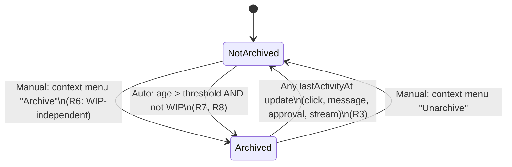
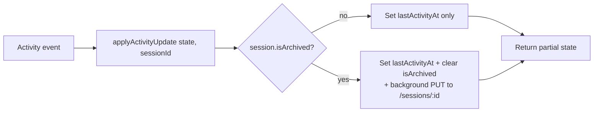

# feat: Add session archive feature

## Summary

Add a session archive state that hides stale or user-flagged sessions from the sidebar by default. Sessions archive via right-click context menu or automatically after a configurable inactivity threshold (default 14 days, WIP-exempt). An "Archived" tag renders beside the timestamp, a "Show archived" filter toggles visibility, and any session activity (click, message, approval, stream completion) auto-clears the flag.

---

## Problem Frame

As sessions accumulate across workspaces, the sidebar list becomes dominated by stale conversations the user is no longer actively working in. Every session the user has ever opened competes for the same visual real estate as the handful they return to, forcing them to scroll past dormant sessions on every visit. The existing WIP tag lets users mark sessions they want to keep visible; there is no symmetric way to demote sessions they want out of the way without deleting them.

---

## Requirements

Requirements are carried forward from the origin brainstorm (R1–R18). Implementation units reference them by ID. The full text lives in `docs/brainstorms/2026-06-14-session-archive-feature-requirements.md`.

**Archive state and lifecycle**

- R1. Persisted archived state using the same pattern as `isDraft` / `isWip`.
- R2. Default list hides archived sessions.
- R3. Any `lastActivityAt` update clears archived state.

**Manual archive**

- R4. Context menu shows "Archive" / "Unarchive".
- R5. Toggling is optimistic with server sync.
- R6. Manual archive of a WIP session is allowed; archive and WIP are independent flags.

**Automatic archive**

- R7. Sessions older than the threshold auto-archive.
- R8. WIP sessions are exempt from auto-archive.
- R9. Auto-archive runs at list load.
- R10. Auto-archive never deletes data.

**Visibility filter**

- R11. "Show archived" checkbox near the search input.
- R12. Defaults to unchecked; sorting stays by activity.
- R13. Resets to unchecked on workspace switch.

**Visual indicator**

- R14. "Archived" tag alongside the relative timestamp.
- R15. Distinct visual treatment from `draft`, `wip`, approval, and status indicators.
- R16. Coexists with automatic session states without precedence rules.

**Threshold configuration**

- R17. User-configurable integer days in app-level settings.
- R18. Defaults to 14 days; changes apply on next list load.

---

## Key Technical Decisions

- **Persist `is_archived` as a column on the `sessions` table, not in the legacy `session_metadata` side table.** Matches the modern pattern used by `is_wip` after the metadata → sessions migration. Storage is `INTEGER NOT NULL DEFAULT 0`.
- **Preserve `is_archived` through `syncSdkSession` re-syncs.** The ON CONFLICT update list deliberately omits the local-only `is_wip` boolean; `is_archived` joins that exclusion list so SDK re-discovery does not wipe the local archive state. (Note: `is_draft` is NOT in the exclusion list — it is overwritten on re-sync, which is unrelated to this plan.)
- **Extend the local-only-boolean preservation block in `updateSession` and `getSession` to cover `isArchived`.** The recent WIP-toggle blink-fix plan (`docs/plans/2026-06-02-012-fix-session-wip-toggle-blink-plan.md`) documents how `mapSdkSessionInfo` strips local-only fields and the server response overwrote the optimistic state, making the toggle appear to fail until reload. The fix preserved `providerId`, `isWip`, and `approvalMode` by reattaching them from `getLocalSession` before returning. `isArchived` must be added to the same preservation block in the same change; otherwise the archive toggle will rediscover the blink-then-vanish bug.
- **Auto-archive runs server-side in `listSessions`, with the threshold passed as a query param.** Single source of truth, consistent state across clients, single round trip on fetch. The threshold remains in client localStorage per the brainstorm's app-level decision; it is sent on each fetch as `?archive_threshold_days=N`. The server reads and mutates `is_archived` based on age and WIP exemption before returning the list.
- **Reactivation clearing is centralized in a state-update helper, not duplicated per-site.** The grep over `lastActivityAt` writes identified seven call sites in `src/client/stores/chat-store.ts`. A single helper that returns the partial state update (`{ lastActivityAt: ..., sessions: <flipped if archived> }`) keeps the reactivation rule in one place. Sites that update `lastActivityAt` simply spread the helper's result.
- **Archived tag color is slate/gray.** Existing pills use amber (`draft`), purple (`wip`), red (approval auto), amber (approval readonly). Slate/gray signals "stale/dimmed" semantics without colliding with the warning family.
- **Threshold change in settings does not trigger an immediate list re-fetch.** The new value applies on the next natural list load (manual refresh, workspace switch, app launch). Cheaper than plumbing an imperative re-fetch through the settings panel; matches the brainstorm's R18 lean.

---

## High-Level Technical Design

### Archive state machine

### Reactivation clearing flow

The seven `lastActivityAt` write sites in `src/client/stores/chat-store.ts` (assistant message start, pending approval, pending question, result, `createSession`, `setActiveSession`, `sendMessage`) all flow through a single helper that returns the partial state update. The helper sets the new `lastActivityAt` value, and if the session was archived, also clears `isArchived` and dispatches a background PUT to persist the unarchive.

---

## Implementation Units

### U1. Server persistence: add `is_archived` column and CRUD support

**Goal:** Persist the archived flag on the `sessions` table with the same lifecycle as `is_wip`.

**Requirements:** R1.

**Dependencies:** None.

**Files:**
- `src/server/storage/sqlite-store.ts` (modify — schema, CRUD, sync, parse, types)
- `src/server/models/session.ts` (modify — `ChatSession`, `UpdateSessionInput`)

**Approach:**
- Add `is_archived INTEGER NOT NULL DEFAULT 0` to the `sessions` CREATE TABLE block (around line 95–112).
- Add an `ALTER TABLE` migration guard alongside the existing `approval_mode` / `provider_id` migrations (around line 115–123), using the same `PRAGMA table_info(sessions)` pattern.
- Extend `RawSessionRow` (around line 1161–1177) with `is_archived: number`.
- Extend `parseSessionRow` (around line 1179–1197) to map `isArchived: row.is_archived === 1`.
- Extend `createLocalSession` INSERT column list (around line 721–724).
- Extend `updateLocalSession` SET builder (around line 728–758) to accept and set `isArchived`.
- In `syncSdkSession` (around line 779–810), INSERT the column with default; **do not** add it to the ON CONFLICT update list — preserve local archive state across SDK re-syncs.
- Add `isArchived?: boolean` to `ChatSession` and `isArchived?: boolean` to `UpdateSessionInput` in `src/server/models/session.ts`.

**Patterns to follow:** Existing `is_wip` column treatment end-to-end. Migration guard mirrors the `approval_mode` block exactly.

**Test scenarios:**
- Happy path: a newly created session has `is_archived === false` after read-back.
- Migration: opening the store on a database file created before this column adds the column with default 0; existing rows read back as `isArchived: false`.
- Sync preservation: setting `is_archived = 1` directly, then calling `syncSdkSession` with fresh SDK data, leaves `is_archived = 1` after the upsert.
- Update path: calling `updateLocalSession(id, { isArchived: true })` then `getLocalSession(id)` returns `isArchived: true`.

**Verification:** `node --test --import tsx src/server/storage/sqlite-store.test.ts` passes with new cases. Manual smoke: toggle `is_archived` via direct DB inspection, restart the server, confirm persistence.

---

### U2. Server manual archive endpoint

**Goal:** Expose manual archive toggle via the existing PUT session route, with the local-only-boolean preservation fix extended to prevent the blink bug.

**Requirements:** R4, R5, R6.

**Dependencies:** U1.

**Files:**
- `src/server/routes/chat.ts` (modify — PUT handler around line 51–86)
- `src/server/services/chat-service.ts` (modify — `updateSession` around line 158–224, `getSession`, `listSessions` mapping paths)

**Approach:**
- In `PUT /api/workspaces/:id/sessions/:sessionId` route handler: destructure `isArchived` from the body; add `hasArchived = isArchived !== undefined && typeof isArchived === 'boolean'` guard; extend the empty-body 400 to mention `isArchived`; pass through to `chatService.updateSession`.
- In `chatService.updateSession`: write `isArchived` early via `workspaceStore.updateLocalSession(id, { isArchived: input.isArchived })` (mirrors the `setSessionMetadata` call for `isWip` at line 161). Branch is allowed regardless of `isWip` state — manual archive and WIP are independent.
- **Preservation block extension:** In every code path that returns a `ChatSession` built from `mapSdkSessionInfo` (in both `updateSession` and `getSession`), after `syncSdkSession`, read `workspaceStore.getLocalSession(id)` and copy `isArchived` onto the returned object. The current block already does this for `providerId`, `isWip`, `approvalMode`; add `isArchived` to the same reattachment. Without this, the optimistic client state will be overwritten by a server response missing the field and the archive toggle will blink then vanish (the WIP-toggle blink bug).

**Patterns to follow:** Existing `isWip` toggle path through route → service → response. The preservation block is the recently-applied fix from `docs/plans/2026-06-02-012-fix-session-wip-toggle-blink-plan.md`.

**Test scenarios:**
- Happy path: `PUT` with `{ isArchived: true }` returns a session with `isArchived: true`; subsequent `GET` returns the same.
- WIP coexistence: `PUT` with `{ isArchived: true }` on a session with `is_wip = 1` returns both `isArchived: true` and `isWip: true`. Neither flag clears the other.
- Blink-bug guard: after `PUT`, the returned object's `isArchived` reflects the persisted value even when `mapSdkSessionInfo` produces a session without that field.
- Validation: `PUT` with `{ isArchived: "yes" }` returns 400.
- Empty body: `PUT` with `{}` returns 400 listing all accepted fields including `isArchived`.

**Verification:** `node --test --import tsx src/server/services/chat-service.test.ts` passes with new cases.

---

### U3. Server auto-archive in `listSessions`

**Goal:** On every list fetch, flip `is_archived` to true for non-WIP sessions whose activity age exceeds the threshold.

**Requirements:** R7, R8, R9, R10.

**Dependencies:** U1, U2.

**Files:**
- `src/server/routes/chat.ts` (modify — GET handler around line 11–24, accept and forward query param)
- `src/server/services/chat-service.ts` (modify — `listSessions` around line 96–127)

**Approach:**
- GET route reads `archive_threshold_days` query param; parses as integer; falls back to `undefined` (meaning "do not auto-archive this request") when absent or unparseable. Forwards to `chatService.listSessions(workspaceId, { archiveThresholdDays })`.
- In `listSessions`, after the SDK sync loop and before returning the merged list, when `archiveThresholdDays` is a positive integer:
  - For each session in the merged list, compute age from `session.lastModified ?? Date.parse(session.updatedAt)`.
  - If `age > thresholdDays * 86400_000` AND `session.isWip !== true` AND `session.isArchived !== true`: call `workspaceStore.updateLocalSession(id, { isArchived: true })` and set the in-memory copy's `isArchived = true` so the response is consistent without an extra DB read.
  - WIP sessions (`isWip === true`) are skipped entirely — manual archive (R6) remains the only path for WIP.
  - Already-archived sessions are skipped to avoid redundant writes.
- No deletion path. Auto-archive flips the flag only.

**Patterns to follow:** Existing iteration patterns in `listSessions`. The metadata batched-read pattern (avoid N+1) applies — batch the threshold writes if more than one session crosses; otherwise accept the per-session write since the typical case is zero or one session newly stale per fetch.

**Test scenarios:**
- Happy path: with threshold 14 days, a session last active 20 days ago (not WIP) is returned with `isArchived: true` after the call; DB row matches.
- WIP exemption: same scenario with `isWip: true` returns the session with `isArchived: false` and no DB write occurs.
- Already-archived skip: a session already archived and 30 days old returns `isArchived: true` without a redundant DB write (assert call count on `updateLocalSession`).
- Threshold absent: when the query param is missing, no auto-archive logic runs; sessions return whatever `is_archived` value they have in DB.
- Threshold malformed: `?archive_threshold_days=abc` is treated as absent (no auto-archive), not a 400.
- Just-under-threshold: a session 13 days old with threshold 14 returns `isArchived: false`.
- Boundary: a session exactly 14 days old with threshold 14 returns `isArchived: false` (strict greater-than).

**Verification:** `node --test --import tsx src/server/services/chat-service.test.ts` passes with new cases.

---

### U4. Client store: archive state, manual toggle, reactivation clearing, threshold param

**Goal:** Client store carries `isArchived`, exposes a manual toggle action, clears archived on every activity update, and sends the threshold on list fetches.

**Requirements:** R1, R3, R5, R6.

**Dependencies:** U1, U2, U3 (server must accept the new field and threshold param).

**Files:**
- `src/client/stores/chat-store.ts` (modify — type, action, helper, fetch, activity sites)

**Approach:**
- Add `isArchived?: boolean` to the local `ChatSession` interface (around line 96–112).
- Add `toggleSessionArchive: (workspaceId, sessionId, isArchived) => Promise<void>` to the store interface and implementation, mirroring `toggleSessionWip` (around line 1986–2029). Same optimistic → PUT → confirm/rollback flow.
- Add a private helper `applyActivityUpdate(state, sessionId)` returning a partial state update. It sets `lastActivityAt[sessionId] = Date.now()`. If the session was archived, it also clears `isArchived` on the in-memory session and queues a background `PUT /api/workspaces/:id/sessions/:sid` with `{ isArchived: false }` (fire-and-forget with console.warn on error — reactivation is best-effort; the next list load converges).
- Replace the seven `lastActivityAt[sid] = Date.now()` sites with `...applyActivityUpdate(state, sid)` spreads. Sites: assistant message start (~line 809), pending approval (~line 1253), pending question (~line 1278), result (~line 1338), `createSession` (~line 1929), `addSession` (~line 1956), `sendMessage` (~line 2172).
- In `fetchSessions` (around line 1861–1897), read the threshold from `useAppSettings` (the hook reads localStorage directly via `getInitialSettings`) and append `?archive_threshold_days=N` to the GET URL when the value is a positive integer. Server-side auto-archive (U3) handles the rest.

**Patterns to follow:** `toggleSessionWip` for the toggle action. The seven `lastActivityAt` sites are already co-located with their semantic event — the helper preserves that locality rather than routing all activity through a single dispatch.

**Test scenarios:**
- Toggle optimistic: calling `toggleSessionArchive(ws, sid, true)` immediately sets the session's `isArchived` to true in state, then confirms from server response.
- Toggle rollback: if the PUT fails, `isArchived` reverts to its prior value.
- Reactivation clearing — sendMessage: an archived session that receives a `sendMessage` call has `isArchived === false` in the next state.
- Reactivation clearing — setActiveSession: an archived session that becomes active has `isArchived === false`. A background PUT to `/sessions/:id` with `{ isArchived: false }` is fired.
- Reactivation idempotence: calling `applyActivityUpdate` on a non-archived session produces no background PUT.
- WIP independence: toggling archive on a WIP session leaves `isWip` unchanged; toggling WIP on an archived session leaves `isArchived` unchanged.
- Threshold param: `fetchSessions` builds the URL with `?archive_threshold_days=14` when settings has `archiveThresholdDays: 14`; omits the param when settings has the value missing or non-positive.

**Verification:** New test file or extended existing tests pass. Manual smoke: archive a session via devtools store mutation, send a message to it, confirm it returns to the default list.

---

### U5. App settings: threshold field and SettingsPanel UI

**Goal:** Expose the auto-archive threshold as a configurable integer in app-level settings.

**Requirements:** R17, R18.

**Dependencies:** None (can land in parallel with U1–U4).

**Files:**
- `src/client/hooks/use-app-settings.ts` (modify)
- `src/client/components/SettingsPanel.tsx` (modify — `GeneralTab` around line 502–615)
- `src/client/i18n/en/settings.json` (modify)
- `src/client/i18n/zh-CN/settings.json` (modify)

**Approach:**
- Add `archiveThresholdDays: number` to `AppSettings` interface in `use-app-settings.ts`.
- Parse in `getInitialSettings` as `typeof parsed.archiveThresholdDays === 'number' && parsed.archiveThresholdDays > 0 ? parsed.archiveThresholdDays : 14`. Default `14` in the fallback return.
- Add `setArchiveThresholdDays: (n: number) => void` callback following the existing setter pattern (`setUseModifierToSubmit` at line 102).
- In `SettingsPanel` `GeneralTab`, mirror the existing `messageWindowCap` numeric input (around line 544–565): local form state, `<input type="number" min={1}>`, parse on save with `parseInt(val, 10)` and `isNaN` guard (reject save when invalid; surface inline error or revert). Add the field to `snapshotRef.current` and `isDirty`.
- Add i18n keys: `general.archiveThresholdDays` (label) and `general.archiveThresholdDaysHint` (helper text explaining the auto-archive behavior and the 14-day default).

**Patterns to follow:** `messageWindowCap` end-to-end (interface, setter, form state, dirty tracking, numeric input, validation).

**Test scenarios:**
- Defaults: a fresh localStorage (no `app-settings` key) yields `archiveThresholdDays === 14`.
- Round-trip: calling `setArchiveThresholdDays(30)` then re-reading settings returns `30`; localStorage JSON contains the value.
- Invalid persistence: if localStorage is manually corrupted with a string or negative number, `getInitialSettings` falls back to `14`.
- SettingsPanel save: entering `7` and saving calls `setArchiveThresholdDays(7)`; the value persists across reloads.
- SettingsPanel validation: entering `0`, `-1`, or non-numeric input does not call the setter on save (the existing `messageWindowCap` guard pattern).

**Verification:** New test or extended `use-app-settings` test file passes. Manual smoke: change threshold, refresh the page, send a `fetchSessions` and confirm the URL contains the new value.

---

### U6. Sidebar UI: filter, context menu, and Archived tag

**Goal:** Surface archive in the sidebar — filter checkbox, context menu item, and timestamp-adjacent tag.

**Requirements:** R2, R4, R11, R12, R13, R14, R15, R16.

**Dependencies:** U4 (store must expose the action and field).

**Files:**
- `src/client/components/SessionList.tsx` (modify)
- `src/client/components/SessionListItem.tsx` (modify)
- `src/client/i18n/en/chat.json` (modify)
- `src/client/i18n/zh-CN/chat.json` (modify)

**Approach:**

*Filter and checkbox (SessionList.tsx):*
- Add `showArchived` state via `useState(false)` near line 33.
- Add a `useEffect` keyed on `workspaceId` that resets `showArchived` to `false` (mirrors the `searchQuery` reset at line 119–122) — satisfies R13.
- In the filter pipeline (around line 51–60), insert `.filter((s) => showArchived || !s.isArchived)` between `sortedSessions` and `matchesSessionQuery`.
- Render a compact checkbox row immediately below the search input (inside the `
` block, after the search `
`). Use `<label className="flex items-center gap-1.5 text-[10px] text-text-tertiary"><input type="checkbox" .../> {t('showArchived')}</label>`. Reset state on workspace switch — same pattern as search.

*Context menu (SessionList.tsx):*
- Append a second `<button>` to the context menu `
` (around line 322–346). Label is `t('archive')` when `!session.isArchived`, `t('unarchive')` when `session.isArchived`. On click, call `toggleSessionArchive(workspaceId, session.id, !session.isArchived)` and `setContextMenu(null)` — mirrors the WIP item at line 336–338.

*Archived tag (SessionListItem.tsx):*
- In the timestamp row (around line 156–182), add a pill alongside `wip` and `approvalMode` when `session.isArchived` is true. Use the same `text-[9px] px-1 py-0.5 rounded` sizing as the WIP pill. Color: `bg-slate-500/20 text-slate-400` (slate/gray to signal stale, distinct from amber/purple/red).
- Place the Archived pill in the same flex row as `wip` and `approvalMode`, before the timestamp ``. The pill does not suppress or interact with other pills (R16).

*i18n keys (chat.json, both locales):*
- `archive`: "Archive" / "归档"
- `unarchive`: "Unarchive" / "取消归档"
- `archived`: "Archived" / "已归档"
- `showArchived`: "Show archived" / "显示已归档"

**Patterns to follow:** WIP pill and WIP context menu item are the direct templates. `draft` amber pill shows the inline-badge pattern in the upper row; archive follows the WIP/lower-row placement per R14.

**Test scenarios:**
- Filter default: archived sessions are absent from `filteredSessions` when `showArchived === false`.
- Filter enabled: archived sessions appear when `showArchived === true`, sorted by activity alongside non-archived.
- Filter reset: switching workspaces resets `showArchived` to `false`.
- Context menu label: a non-archived session's context menu shows "Archive"; an archived session's shows "Unarchive".
- Context menu action: clicking "Archive" calls `toggleSessionArchive(ws, sid, true)`.
- Tag rendering: an archived session rendered via `SessionListItem` shows the "Archived" pill in the timestamp row.
- Tag coexistence: a WIP + archived session shows both pills simultaneously.
- Tag absence: a non-archived session does not render the Archived pill.

**Verification:** New Vitest component test for `SessionList` (filter + context menu) and `SessionListItem` (tag rendering) passes. Manual smoke: archive a session, confirm it disappears; check "Show archived", confirm it reappears with the tag; click the archived session, confirm the tag disappears.

---

## Scope Boundaries

### Deferred to Follow-Up Work

- Capturing the "local-only boolean preservation" pattern as a `docs/solutions/` entry. It has now applied to `providerId`, `isWip`, `approvalMode`, and (via U2) `isArchived` — a genuine cross-cutting convention worth promoting. Use `ce-compound` after this plan ships.
- Adding test coverage for the existing `toggleSessionWip` action and its context menu item. U4 adds coverage for `toggleSessionArchive`; backfilling WIP is a separate cleanup.

### Outside this Plan's Scope

- Bulk archive operations (select multiple, archive all). Brainstorm Scope Boundaries.
- Keyboard shortcut for archive toggle. Brainstorm Scope Boundaries.
- Archive count badge on workspace tabs. Brainstorm Scope Boundaries.
- Search-across-archived enhancements beyond what the existing name search already does. Brainstorm Scope Boundaries.
- Auto-deletion or expiration of archived sessions. Brainstorm Scope Boundaries.
- Distinction between "auto-archived" and "manually archived" in stored state or UI. Brainstorm Scope Boundaries.
- Server-side persistence of the threshold. Brainstorm Key Decision: app-level threshold; the value flows as a query param per fetch.
- Immediate re-evaluation of archive state when the threshold changes. R18 defers to next list load.

---

## System-Wide Impact

- **Data lifecycle:** A new boolean column on `sessions` with backward-compatible default. No data migration risk — existing rows read as not-archived.
- **Multi-client consistency:** Server-side auto-archive keeps the visible state identical across clients on the same workspace. Manual archive hits the server immediately (optimistic + PUT). Reactivation clearing fires a background PUT; convergence is at most one list-load away if the PUT fails.
- **Cardinal rules:** None violated. The archive flag is preserved through `syncSdkSession` exactly as `is_wip` is; SDK re-discovery does not wipe local state.

---

## Risks & Dependencies

- **Blink-then-vanish regression.** Highest-priority risk. If U2's preservation block extension is skipped or incomplete, the archive toggle will appear to fail until reload — the same bug recently fixed for WIP. U2's test scenarios include an explicit guard case.
- **Reactivation PUT storm.** Seven `lastActivityAt` sites each potentially fire a background PUT when reactivating an archived session. In practice, archived sessions are hidden and rarely become active in rapid succession; still, the helper should fire-and-forget with a console warning on failure, and the next list load converges state.
- **Auto-archive write amplification.** On the first fetch after many sessions cross the threshold, `listSessions` may issue many `updateLocalSession` writes in one call. The threshold default (14 days) bounds this to a small weekly delta in typical use; if it becomes a problem, batch the writes in a single transaction.
- **Threshold param absence.** Older clients (or tests) that omit `archive_threshold_days` disable auto-archive for that request. Documented as intentional in U3 — graceful degradation, not an error.

---

## Acceptance Examples

Carried forward from the origin brainstorm (AE1–AE6). The implementation must satisfy each:

- AE1. Manual archive via context menu hides the session from the default list. (Covers R4, R5; U2, U6.)
- AE2. Sessions older than the threshold auto-archive on list load; WIP sessions do not. (Covers R7, R8; U3.)
- AE3. Clicking an archived session (with filter enabled) clears the archive flag and the session remains in the default list on next load. (Covers R3; U4, U6.)
- AE4. Show-archived checkbox resets to unchecked on workspace switch. (Covers R11, R12, R13; U6.)
- AE5. Manually archiving a WIP session preserves the WIP flag. (Covers R6; U2, U4.)
- AE6. Archived session row shows the Archived tag alongside other indicators without precedence conflicts. (Covers R14, R15, R16; U6.)

---

## Sources / Research

- `docs/brainstorms/2026-06-14-session-archive-feature-requirements.md` — origin document; full R1–R18 and AE1–AE6.
- `docs/brainstorms/2026-05-26-session-work-in-progress-tag-requirements.md` — sibling feature; brainstorm pattern reference.
- `docs/plans/2026-05-26-004-feat-session-work-in-progress-tag-plan.md` — structural template for the implementation units.
- `docs/plans/2026-06-02-012-fix-session-wip-toggle-blink-plan.md` — the local-only-boolean preservation fix U2 extends. Read before implementing U2.
- `docs/solutions/conventions/commit-plan-and-brainstorm-files-with-code-changes.md` — commit the brainstorm and this plan alongside the implementation.
- Codebase anchors: `src/server/storage/sqlite-store.ts` (schema, CRUD, sync), `src/server/services/chat-service.ts` (`updateSession`, `getSession`, `listSessions`, `mapSdkSessionInfo`), `src/server/routes/chat.ts` (GET and PUT session routes), `src/client/stores/chat-store.ts` (`toggleSessionWip` template, seven `lastActivityAt` write sites), `src/client/components/SessionList.tsx` (search area, filter pipeline, context menu), `src/client/components/SessionListItem.tsx` (tag row), `src/client/hooks/use-app-settings.ts` (settings storage), `src/client/components/SettingsPanel.tsx` (`messageWindowCap` numeric input template).
