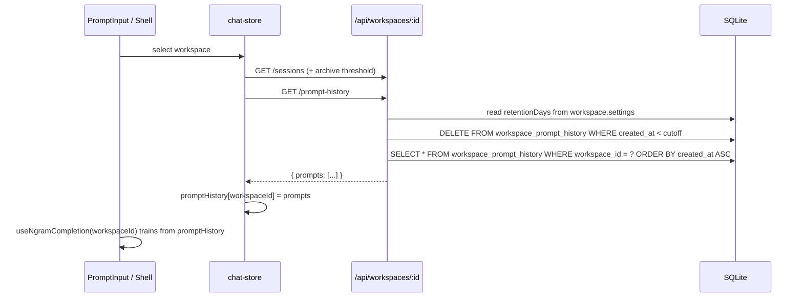
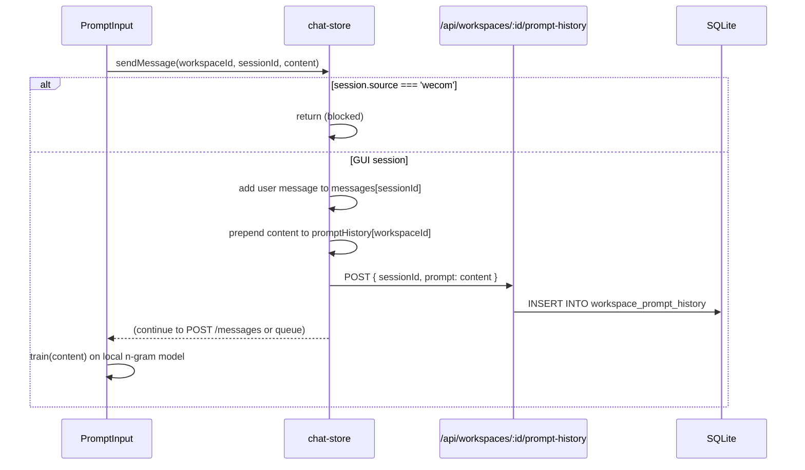

# Workspace-Scoped Prompt History

## Summary

Move the sent-prompt history from session scope to workspace scope. The history currently powers the `HistoryPicker` popup and the local n-gram completion model; both are keyed by `sessionId`. After this change, every user-sent prompt from a regular GUI session is recorded at send time into a workspace-scoped log stored in SQLite. The History popup and n-gram completion read from that log. Entries older than a configurable retention threshold are pruned when the workspace loads. WeCom bot sessions are excluded, and only user-sent prompts are recorded.

---

## Problem Frame

Today the sent-prompt history is derived per session from `chat-store.messages[sessionId]` via `useSentPrompts(sessionId)`. That means:

- History is lost when a session is deleted or not loaded.
- Switching to a new session in the same workspace starts with an empty history and an empty n-gram model.
- The History popup cannot recall prompts sent in other sessions of the same workspace.
- The n-gram completion cannot learn from the user's broader workspace-level prompting patterns.

The product decision is to make the history workspace-scoped: every prompt the user sends from the application's prompt input box is appended to a single log for that workspace, and both the History popup and the n-gram model consume that log.

Scope confirmations from planning:

- **Only regular GUI sessions** are included; WeCom bot sessions are excluded.
- **Only user-sent prompts** are recorded (not assistant messages, not system messages, not tool results).
- **Record at send time** in the client, at the same moment the optimistic user message is added to the session.
- **Persistence** is a new SQLite table.
- **Retention** prunes entries older than a threshold when the workspace loads.
- The retention threshold is surfaced in the **existing workspace settings page**.

---

## Requirements

Carried forward from the origin brainstorm, with scope refined above. Original IDs are preserved where they apply.

- R8. History records every successfully initiated user send from the prompt input box.
- R9. Adjacent duplicate prompts are skipped in the History popup (bash-style `ignoredups`).
- R13. Searchable history popup opened by the History toolbar button and keyboard shortcut.
- R14. Popup lists sent prompts reverse-chronologically with type-to-filter.
- R16. Multi-line prompts in the popup show a truncated first line plus line-count badge.
- R17. While streaming, history navigation and the History button are disabled.
- R18 (revised). History source is the workspace-scoped SQLite log, not the in-memory session messages.
- R27 (revised). N-gram model is built from the workspace-scoped history log.
- R28–R34. Completion behavior (debounce, Tab accept, no picker overlap, etc.) is unchanged; only the training source changes.

New requirements from this plan:

- R35. History is persisted in a new SQLite table.
- R36. WeCom bot sessions never write to the workspace history log.
- R37. Retention threshold is a per-workspace setting; default is 30 days.
- R38. Entries older than the retention threshold are deleted when the workspace's history is first loaded.
- R39. Deleting a workspace cascades deletion of its prompt-history rows.

---

## Key Technical Decisions

- **SQLite table, not JSON / localStorage / session message derivation.** The existing persistence layer for workspace-level state is `better-sqlite3` in `src/server/storage/sqlite-store.ts`. A new table is consistent with todos, proactive messages, and analytics caches.
- **Client-side recording at send time.** `chat-store.sendMessage` already guards against bot sessions and is the canonical owner of the prompt-input send action. Recording there satisfies "only GUI sessions" and "only user sent" without extra server-side source checks.
- **Optimistic local update + async POST.** The workspace-history POST is fire-and-forget after the optimistic chat-store update. Failure to persist does not block sending; the local history and n-gram model still update immediately so the UI remains responsive.
- **Server prunes on read, not on write.** The `GET /api/workspaces/:id/prompt-history` endpoint reads the workspace's retention setting, deletes expired rows, then returns the remaining rows. This satisfies "prune on load" with a single code path and no background job.
- **Chronological storage, reverse-chronological display.** The server stores and returns rows in chronological order. The client stores them chronologically in `chatState.promptHistory[workspaceId]`; `useSentPrompts` reverses and adjacent-dedups for the popup, while the n-gram model trains in chronological order.
- **Retention threshold lives in `WorkspaceSettings`.** This keeps workspace-level configuration in one place and reuses the existing settings save flow in `SettingsPanel.tsx`.
- **N-gram model reloads on workspace change, trains incrementally on send.** `useNgramCompletion(workspaceId)` rebuilds the model from the fetched workspace history when `workspaceId` changes, then continues incremental training via the existing `train(text)` call from `PromptInput` on each send. This matches today's incremental behavior while adding workspace-level bootstrapping.
- **History table rows include `session_id`.** Although the log is workspace-scoped, retaining `session_id` supports future audit/debugging without affecting the API surface (the client receives only prompts and timestamps).

---

## High-Level Technical Design

### Data model

```sql
CREATE TABLE workspace_prompt_history (
  id TEXT PRIMARY KEY,
  workspace_id TEXT NOT NULL,
  session_id TEXT NOT NULL,
  prompt TEXT NOT NULL,
  created_at TEXT NOT NULL
);

CREATE INDEX idx_workspace_prompt_history_workspace_created
  ON workspace_prompt_history (workspace_id, created_at DESC);
```

- `id`: UUIDv4 primary key.
- `workspace_id`: foreign-key-ish reference to `workspaces.id` (enforced by cascade delete in application code).
- `session_id`: the GUI session that originated the prompt.
- `prompt`: the full trimmed user text.
- `created_at`: ISO-8601 timestamp; used for ordering and retention pruning.

### Component seams

```
PromptInput (workspaceId)
  │
  ├─ on send ──► chat-store.sendMessage(workspaceId, sessionId, content)
  │                │
  │                ├─ optimistic user message in messages[sessionId]
  │                └─ addPromptHistory(workspaceId, sessionId, content)
  │                     ├─ optimistic prepend to promptHistory[workspaceId]
  │                     └─ POST /api/workspaces/:id/prompt-history
  │
  ├─ HistoryPicker (workspaceId) ──► useSentPrompts(workspaceId)
  │                                    └─ promptHistory[workspaceId]
  │
  └─ useNgramCompletion(workspaceId)
       ├─ on workspace change: train(model, promptHistory[workspaceId])
       └─ on send: train(model, trimmedPrompt)
```

### Sequence: workspace load



### Sequence: send message



---

## Implementation Units

### U1. SQLite schema, migration, and cascade delete

**Goal:** Add the `workspace_prompt_history` table and ensure workspace deletion cleans it up.

**Requirements:** R35, R39

**Files:**
- `src/server/storage/sqlite-store.ts`

**Approach:**

In the `SqliteStore` constructor, after the existing `CREATE TABLE IF NOT EXISTS` statements, add:

```sql
CREATE TABLE IF NOT EXISTS workspace_prompt_history (
  id TEXT PRIMARY KEY,
  workspace_id TEXT NOT NULL,
  session_id TEXT NOT NULL,
  prompt TEXT NOT NULL,
  created_at TEXT NOT NULL
);
CREATE INDEX IF NOT EXISTS idx_workspace_prompt_history_workspace_created
  ON workspace_prompt_history (workspace_id, created_at DESC);
```

In `delete(id)`, add:

```ts
this.db.prepare('DELETE FROM workspace_prompt_history WHERE workspace_id = ?').run(id);
```

**Test scenarios:**
- Fresh database: table and index are created on startup.
- Existing database: migration is idempotent (`CREATE TABLE IF NOT EXISTS`).
- Delete workspace: rows for that workspace are removed; other workspaces' rows remain.

**Verification:** Schema exists; `PRAGMA index_list(workspace_prompt_history)` shows the index; delete workspace removes rows.

---

### U2. Storage-layer CRUD and pruning

**Goal:** Add typed store methods for recording, listing, and pruning workspace prompt history.

**Requirements:** R35, R38

**Files:**
- `src/server/storage/sqlite-store.ts`
- `src/server/models/workspace.ts` (for `WorkspaceSettings` type)

**Approach:**

Add a model interface near `workspace.ts` or inline in `sqlite-store.ts`:

```ts
export interface WorkspacePromptHistoryEntry {
  id: string;
  workspaceId: string;
  sessionId: string;
  prompt: string;
  createdAt: string;
}
```

Add store methods:

```ts
createPromptHistory(workspaceId: string, sessionId: string, prompt: string): WorkspacePromptHistoryEntry
listPromptHistory(workspaceId: string): WorkspacePromptHistoryEntry[]
prunePromptHistory(workspaceId: string, retentionDays: number): number
```

`createPromptHistory` inserts with `uuidv4()` and `new Date().toISOString()`.

`listPromptHistory` returns rows ordered by `created_at ASC`.

`prunePromptHistory` computes `cutoff = now - retentionDays * 86400_000`, deletes matching rows, and returns the deleted count. A retention value of `0` or negative means "keep forever" (skip deletion); the settings default will be `30`, so this is a defensive escape hatch.

**Test scenarios:**
- `createPromptHistory` inserts a row and returns it with an ISO `createdAt`.
- `listPromptHistory` returns rows in chronological order.
- `prunePromptHistory(30)` deletes rows older than 30 days and leaves newer rows.
- `prunePromptHistory(0)` deletes nothing.

**Verification:** Unit tests for the three methods pass; row order and pruning boundary are exact.

---

### U3. Server routes

**Goal:** Expose HTTP endpoints for recording and fetching workspace-scoped history.

**Requirements:** R35, R38

**Files:**
- `src/server/routes/workspace.ts` (preferred) or a new `src/server/routes/prompt-history.ts`

**Approach:**

Add under the existing workspace router so the path is `/api/workspaces/:id/prompt-history`.

```ts
// POST /api/workspaces/:id/prompt-history
router.post('/prompt-history', (req, res) => {
  const workspaceId = req.params.id;
  const { sessionId, prompt } = req.body;
  if (!sessionId || typeof sessionId !== 'string') { ...400... }
  if (!prompt || typeof prompt !== 'string') { ...400... }
  const trimmed = prompt.trim();
  if (!trimmed) { ...400... }
  const entry = store.createPromptHistory(workspaceId, sessionId, trimmed);
  res.status(201).json(entry);
});

// GET /api/workspaces/:id/prompt-history
router.get('/prompt-history', (req, res) => {
  const workspaceId = req.params.id;
  const workspace = store.get(workspaceId);
  if (!workspace) { ...404... }
  const retentionDays = workspace.settings?.promptHistoryRetentionDays ?? 30;
  if (retentionDays > 0) {
    store.prunePromptHistory(workspaceId, retentionDays);
  }
  const prompts = store.listPromptHistory(workspaceId);
  res.json({ prompts });
});
```

The POST intentionally does **not** prune; pruning happens on read (workspace load).

**Test scenarios:**
- POST with valid body returns 201 and the persisted entry.
- POST with empty/invalid body returns 400.
- GET returns prompts in chronological order.
- GET prunes expired rows based on `workspace.settings.promptHistoryRetentionDays`.
- GET for unknown workspace returns 404.

**Verification:** Route tests cover 201, 400, 404, ordering, and pruning.

---

### U4. Client chat-store state and fetch actions

**Goal:** Add `promptHistory` to `ChatState`, fetch it on workspace load, and provide an action to append a new prompt.

**Requirements:** R18 (revised), R35

**Files:**
- `src/client/stores/chat-store.ts`

**Approach:**

Extend `ChatState`:

```ts
promptHistory: Record<string, string[]>
fetchPromptHistory: (workspaceId: string) => Promise<void>
addPromptHistory: (workspaceId: string, sessionId: string, content: string) => void
```

Initialize `promptHistory: {}`.

`fetchPromptHistory`:
- GET `/api/workspaces/${workspaceId}/prompt-history`.
- On success, map `prompts` to `entry.prompt` strings and store chronologically: `promptHistory: { ...state.promptHistory, [workspaceId]: prompts.map(p => p.prompt) }`.
- On error, log and leave existing cache (do not clear).

`addPromptHistory`:
- Trim `content`; if empty, return.
- Optimistically prepend to `promptHistory[workspaceId]` (the array will be reversed back to chronological when fetched, but for local consistency we keep chronological order in the store: push to end, then dedupe? No — simpler: store reverse-chronological locally and accept that `useSentPrompts` just returns it; but then `useNgramCompletion` training order would be reverse. Better to store chronological and have `useSentPrompts` reverse. For the optimistic update, append to the end of the chronological array.)
- POST `/api/workspaces/${workspaceId}/prompt-history` with `{ sessionId, prompt: trimmed }`.

Call `fetchPromptHistory(workspaceId)` inside `fetchSessions` after sessions are loaded, so the history is ready when the workspace becomes active.

Call `useChatStore.getState().cleanupWorkspace(workspaceId)` in `workspace-store.ts:deleteWorkspace`? It already calls it; extend `cleanupWorkspace` to also delete `promptHistory[workspaceId]` from state.

**Test scenarios:**
- `fetchPromptHistory` populates `promptHistory[workspaceId]`.
- `addPromptHistory` trims content and appends optimistically.
- Empty content is ignored.
- `cleanupWorkspace` removes `promptHistory[workspaceId]`.

**Verification:** Chat-store tests (or manual verification) show history populated after `fetchSessions`; optimistic append reflects immediately in `useSentPrompts`.

---

### U5. Refactor `useSentPrompts` and `HistoryPicker` to workspace scope

**Goal:** Replace the session-scoped derivation with a workspace-scoped read from `promptHistory`.

**Requirements:** R13, R14, R16, R18 (revised)

**Files:**
- `src/client/hooks/useSentPrompts.ts`
- `src/client/components/HistoryPicker.tsx`
- `src/client/components/PromptInput.tsx`

**Approach:**

Rewrite `useSentPrompts`:

```ts
export function useSentPrompts(workspaceId: string | undefined): string[] {
  const history = useChatStore((s) => workspaceId ? (s.promptHistory[workspaceId] ?? []) : [])
  return useMemo(() => {
    const prompts: string[] = []
    for (const text of history) {
      const trimmed = text.trim()
      if (!trimmed) continue
      if (prompts.length > 0 && prompts[prompts.length - 1] === trimmed) continue
      prompts.push(trimmed)
    }
    return prompts.reverse()
  }, [history])
}
```

Change `HistoryPickerProps.sessionId` to `workspaceId`. Internally, `useSentPrompts(workspaceId)`.

In `PromptInput`, update the `HistoryPicker` usage to pass `workspaceId` instead of `sessionId`.

**Test scenarios:**
- `useSentPrompts(undefined)` returns `[]`.
- `useSentPrompts(workspaceId)` returns reverse-chronological, trimmed, adjacent-deduped prompts.
- `HistoryPicker` still opens, filters, and commits with the workspace-scoped prop.

**Verification:** Existing History popup tests pass with the prop change; new unit test for `useSentPrompts` covers dedup and ordering.

---

### U6. Refactor `useNgramCompletion` to workspace scope

**Goal:** Build the n-gram model from the workspace history log instead of a per-session blank slate.

**Requirements:** R27 (revised), R28–R34

**Files:**
- `src/client/hooks/useNgramCompletion.ts`
- `src/client/components/PromptInput.tsx`

**Approach:**

Change signature to `useNgramCompletion(workspaceId: string | undefined)`.

```ts
export function useNgramCompletion(workspaceId: string | undefined): NgramCompletionAPI {
  const modelRef = useRef(new TrigramCompletion())
  const trainedWorkspaceRef = useRef<string | null>(null)

  const history = useChatStore((s) =>
    workspaceId ? (s.promptHistory[workspaceId] ?? []) : []
  )

  useEffect(() => {
    modelRef.current.clear()
    trainedWorkspaceRef.current = null
    if (workspaceId && history.length > 0) {
      for (const prompt of history) {
        modelRef.current.train(prompt)
      }
      trainedWorkspaceRef.current = workspaceId
    }
  }, [workspaceId])

  // If history arrives after the workspace effect ran, train once without
  // re-training on subsequent sends (those go through the explicit train cb).
  useEffect(() => {
    if (!workspaceId) return
    if (trainedWorkspaceRef.current === workspaceId) return
    if (history.length === 0) return
    modelRef.current.clear()
    for (const prompt of history) {
      modelRef.current.train(prompt)
    }
    trainedWorkspaceRef.current = workspaceId
  }, [workspaceId, history])

  const suggest = useCallback((text: string) => {
    return modelRef.current.suggest(text)
  }, [])

  const train = useCallback((text: string) => {
    modelRef.current.train(text)
  }, [])

  return { suggest, train }
}
```

`PromptInput` currently receives `completion` from `useNgramCompletion(sessionId)`. Change to `useNgramCompletion(workspaceId)`. The `handleSend` call to `train(trimmed)` remains unchanged.

**Test scenarios:**
- Switching workspace clears and reloads the model from that workspace's history.
- Sending a prompt trains the model immediately.
- The model does not re-train from history on every new send.

**Verification:** Completion suggestions appear based on prompts from any session in the workspace; switching workspaces swaps the model corpus.

---

### U7. Send-time recording with bot-session exclusion

**Goal:** Record every GUI user send in the workspace history log at send time.

**Requirements:** R8, R36

**Files:**
- `src/client/stores/chat-store.ts`

**Approach:**

In `sendMessage`, after the bot-session guard and before the approval-queue check, call `addPromptHistory`:

```ts
sendMessage: (workspaceId: string, sessionId: string, content: string) => {
  const session = get().sessions[workspaceId]?.find((s) => s.id === sessionId)
  if (session?.source === 'wecom') {
    console.warn('[sendMessage] blocked: cannot send messages to bot sessions')
    return
  }

  // Record in workspace-scoped history at send time
  get().addPromptHistory(workspaceId, sessionId, content)

  // ... existing subscription, optimistic message, approval queue, POST logic ...
}
```

Because `addPromptHistory` is called before the approval-queue check, prompts queued behind a pending approval are still recorded at user send time. This matches the existing behavior where the optimistic user message is already visible in the session.

`addPromptHistory` itself trims and ignores empty content, so no extra guard is needed here.

**Test scenarios:**
- Send in a GUI session: prompt appears in `promptHistory[workspaceId]` immediately and is persisted.
- Send in a WeCom bot session: `sendMessage` returns early; no history recorded.
- Send while an approval is pending: prompt is recorded immediately and later sent when approval resolves.

**Verification:** Manual test: send prompts in two different sessions of the same workspace; History popup shows both; delete one session; History popup still shows both.

---

### U8. Workspace settings retention threshold UI

**Goal:** Surface the retention threshold in the workspace settings page.

**Requirements:** R37

**Files:**
- `src/server/models/workspace.ts`
- `src/client/components/SettingsPanel.tsx`
- `src/client/i18n/en/settings.json`
- `src/client/i18n/zh-CN/settings.json`

**Approach:**

Add to `WorkspaceSettings`:

```ts
export interface WorkspaceSettings {
  // ... existing fields ...
  promptHistoryRetentionDays?: number;
}
```

In `SettingsPanel.tsx`:
- Add `promptHistoryRetentionDays: string` to `WorkspaceFormState`.
- Initialize it in `buildWorkspaceFormState` from `workspace.settings?.promptHistoryRetentionDays ?? 30`.
- Add a numeric input in `BasicInfoSection` (below folder path) bound to `state.promptHistoryRetentionDays`.
- In `handleSave`, include `promptHistoryRetentionDays: parsedDays` in the settings object sent to `updateWorkspace`.

Input constraints: integer, minimum `1`. If the user clears the field, default to `30` on save.

Add i18n keys:

```json
"workspace": {
  "promptHistoryRetentionDays": "Prompt History Retention (days)",
  "promptHistoryRetentionDaysHint": "Sent prompts older than this are removed when the workspace loads. Default is 30 days."
}
```

Mirror in `zh-CN/settings.json`:

```json
"promptHistoryRetentionDays": "提示词历史保留天数",
"promptHistoryRetentionDaysHint": "超过此天数的已发送提示词将在工作区加载时被清除。默认值为 30 天。"
```

**Test scenarios:**
- Settings panel shows the current retention value.
- Changing the value and saving persists it to `workspace.settings`.
- Invalid values (non-numeric, < 1) fall back to 30 on save.
- The GET prompt-history endpoint respects the saved value.

**Verification:** Save a workspace with retention = 1; insert old rows manually; reload workspace; old rows are pruned.

---

## Flows

### F1. Load workspace

1. User selects / opens a workspace.
2. `workspace-store` sets `activeWorkspaceId`.
3. `chat-store.fetchSessions(workspaceId)` is called.
4. `fetchSessions` calls `fetchPromptHistory(workspaceId)`.
5. Server prunes expired rows and returns the remaining history.
6. Client stores history in `promptHistory[workspaceId]`.
7. `useSentPrompts(workspaceId)` and `useNgramCompletion(workspaceId)` consume the history.

### F2. Send a prompt

1. User presses Enter in `PromptInput`.
2. `chat-store.sendMessage(workspaceId, sessionId, content)` runs.
3. Bot-session guard passes (GUI session).
4. `addPromptHistory(workspaceId, sessionId, content)` optimistically appends to `promptHistory[workspaceId]` and POSTs to the server.
5. Server inserts into `workspace_prompt_history`.
6. Existing session-message POST (or queue) proceeds.
7. `PromptInput` calls `completion.train(trimmed)`.

### F3. Open History popup

1. User clicks the History button or presses the shortcut.
2. `PromptInput` opens `HistoryPicker` with `workspaceId`.
3. `HistoryPicker` reads `useSentPrompts(workspaceId)` (reverse-chronological, deduped).
4. User types a filter; `filterItems` narrows the list.
5. User selects a row; `PromptInput` sets the draft to the selected prompt.

### F4. Change retention setting

1. User opens Settings → Workspace → Basic Info.
2. Changes "Prompt History Retention (days)".
3. Clicks Save; `updateWorkspace` persists `settings.promptHistoryRetentionDays`.
4. Next workspace load triggers `GET /prompt-history`, which prunes using the new threshold.

---

## Cross-Cutting Concerns

### Migration

- The schema migration is additive (`CREATE TABLE IF NOT EXISTS`).
- No data migration is needed; history previously lived only in per-session message arrays.

### Cleanup on workspace close/delete

- `chat-store.cleanupWorkspace(workspaceId)` already runs when a workspace is deleted. Extend it to `delete state.promptHistory[workspaceId]`.
- The SQLite cascade in `SqliteStore.delete` handles persisted rows.

### Backwards compatibility

- `useSentPrompts` signature changes from `(sessionId)` to `(workspaceId)`. All call sites (`HistoryPicker`, `PromptInput`) are updated in this plan.
- `useNgramCompletion` signature changes from `(sessionId)` to `(workspaceId)`. `PromptInput` is updated.
- The old per-session derivation is removed; there are no other consumers.

### Security / privacy

- The prompt text is stored in the same SQLite file as the rest of the workspace metadata.
- WeCom bot sessions are excluded at the client send path, so bot user prompts never enter the log.

---

## Test Scenarios (integration checklist)

- **TS1.** Fresh install: table created; default retention is 30 days.
- **TS2.** Send prompts in Session A and Session B of the same workspace; History popup shows both, most recent first.
- **TS3.** Send the same prompt twice in a row; History popup shows one entry.
- **TS4.** Delete Session A; History popup still shows prompts from Session A.
- **TS5.** Switch to a different workspace; History popup shows that workspace's prompts only.
- **TS6.** Send a prompt in a WeCom bot session (via bot path, not `sendMessage`); prompt does not appear in workspace history.
- **TS7.** Set retention to 1 day; manually insert a 2-day-old row; reload workspace; old row is gone.
- **TS8.** N-gram completion suggests a continuation learned from a prompt sent in another session of the same workspace.
- **TS9.** Offline / server error on `addPromptHistory`: local history and n-gram model still update; UI is not blocked.
- **TS10.** Workspace deletion removes all its history rows from SQLite.

---

## Risks & Mitigations

| Risk | Likelihood | Impact | Mitigation |
|------|------------|--------|------------|
| History table grows unbounded if retention is disabled/very large. | Medium | Medium | Default 30-day retention; UI enforces minimum 1 day; pruning runs on every workspace load. |
| Optimistic `addPromptHistory` could record prompts that the server rejects (e.g., network failure). | Low | Low | Acceptable — the user initiated the send; the local session already shows the optimistic message. |
| `useNgramCompletion` re-trains from history on every `promptHistory` update if effect deps are wrong. | Medium | High | Use a `trainedWorkspaceRef` to ensure history is only trained once per workspace switch; explicit `train` handles new sends. |
| Changing `useSentPrompts` signature misses a call site. | Low | High | TypeScript will flag mismatches; grep for `useSentPrompts` and `HistoryPicker` props. |
| Retention setting saved as string instead of number. | Low | Medium | Parse in `handleSave` and validate with `typeof === 'number' && > 0`. |
| Bot-session guard in `sendMessage` is the only exclusion; future code paths could bypass it. | Low | High | Document the invariant in code comments; all user sends must go through `chat-store.sendMessage`. |

---

## Open Questions

1. **Should queued (approval-pending) prompts be recorded at initial send time or when actually dispatched?** The plan chooses initial send time to match the optimistic message behavior. Confirm with product if delayed recording is preferred.
2. **Should the retention threshold allow "never delete" (e.g., `0`)?** The plan treats `0` as "keep forever" defensively, but the UI defaults to and validates a minimum of `1`. Decide whether to expose a "Forever" option.
3. **Should `session_id` be exposed in the client history API?** The plan returns only prompt strings to keep the client surface minimal; `session_id` is stored for future audit use.
