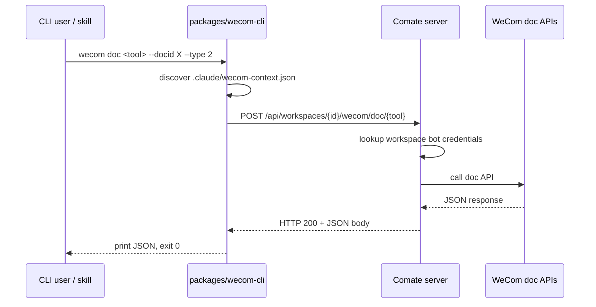

# Add `wecom doc` commands and server endpoints

## Summary

Add a `wecom doc` topic to `packages/wecom-cli` and matching Comate server endpoints so the Rust `wecom-cli doc` category can be retired. The CLI proxies each tool call to `POST /api/workspaces/{workspaceId}/wecom/doc/{tool-kebab-case}`; the server authenticates with WeCom and returns the raw API response. File-reading helpers run server-side.

---

## Problem Frame

The Rust `wecom-cli` exposes a `doc` category for managing WeCom documents, smartpages, and smartsheets. The TypeScript `packages/wecom-cli` only supports sending messages. Consolidating on the TypeScript stack requires reimplementing the `doc` category there. The existing TypeScript CLI already loads workspace context and proxies `send` to the Comate server, so extending that proxy model to doc operations keeps bot credentials server-side and avoids duplicating auth logic.

---

## Requirements

**CLI structure and commands**

- R1. Add a `doc` topic to `packages/wecom-cli` with one explicit subcommand for each tool in the Rust `doc` category.
- R2. Each subcommand declares typed oclif flags matching the tool's scalar input fields.
- R3. Each subcommand maps to a server endpoint under `/api/workspaces/{workspaceId}/wecom/doc/{tool-kebab-case}`.
- R4. Each subcommand prints the server's JSON response to stdout on success and exits 0.
- R5. CLI help lists available tools and their flags.

**Context and auth**

- R6. The CLI continues to use the existing `.claude/wecom-context.json` format (`botId`, `serverUrl`, `workspaceId`) without adding `botSecret`.
- R7. Missing context file exits 2; invalid context file or missing `workspaceId` exits 1, consistent with the existing `send` command.

**Server endpoints**

- R8. The server exposes one POST endpoint per doc tool under `/api/workspaces/{workspaceId}/wecom/doc/{tool-kebab-case}`.
- R9. Each endpoint accepts tool-specific params as JSON, calls the corresponding WeCom API using server-stored bot credentials, and returns the raw WeCom JSON response.
- R10. Server returns HTTP 200 with JSON body for successful WeCom calls, even when the WeCom `errcode` is non-zero.
- R11. Server endpoints reuse existing workspace bot configuration; no new per-workspace setup is required.

**Helper tools**

- R12. Server endpoints exist for the three helper workflows: `smartpage-create`, `smartsheet-add-records-auto-file`, and `smartsheet-update-records-auto-file`.
- R13. Helper endpoints accept local file paths in their params, read the files from the workspace, upload images/files to WeCom, and substitute the results before calling the underlying tool.
- R14. Helper endpoints enforce the same file-size limits as the Rust helpers: images up to 30 MB, files up to 10 MB.

**Response and error handling**

- R15. The CLI forwards server error responses to stderr and exits with a non-zero code.
- R16. Network failures between CLI and server (connection refused, DNS failure, timeout) exit with code 4, consistent across all doc subcommands.

---

## Key Technical Decisions

- **Generic server proxy for passthrough tools:** A single route handler dispatches passthrough tool names to a shared service call. The three helper tools (`smartpage-create`, `smartsheet-add-records-auto-file`, `smartsheet-update-records-auto-file`) use dedicated handlers for file preprocessing; all other tools are pure passthrough. Tool-specific validation happens in the CLI via typed flags. This keeps the server surface small while honoring the one-endpoint-per-tool URL contract.
- **Typed flags plus optional `--json` override:** Scalar and top-level fields become oclif flags. Complex nested structures (e.g., smartsheet `records` arrays) are supplied via an optional `--json` flag whose keys replace flag-built keys at the same path; flags provide defaults that `--json` overrides. This is consistent across all commands and balances helpful help text with the large schema surface.
- **Server-side file helpers:** File reading, base64 encoding, and WeCom upload stay in the server, not the CLI. The CLI only forwards file paths.
- **Workspace-relative file paths for helpers:** Helper endpoints accept only workspace-relative file paths and reject absolute paths. Relative paths are resolved against the workspace root, validated to stay within the workspace boundary, and the boundary-check pattern from `wecom-file-storage.ts` is reused.
- **No CLI context file changes:** `botSecret` remains server-side; the CLI context file keeps its current shape.

---

## High-Level Technical Design

The flow mirrors the existing `wecom send` proxy pattern.



Helper tools follow the same flow, but the server first reads the referenced local files, uploads images/files to WeCom, substitutes the returned URLs/IDs, and then calls the underlying doc API.

---

## Output Structure

```
packages/wecom-cli/src/
├── commands/
│   ├── base.ts                 # existing
│   ├── send.ts                 # existing
│   └── doc/
│       ├── base-doc-command.ts
│       ├── get-doc-content.ts
│       ├── create-doc.ts
│       ├── edit-doc-content.ts
│       ├── smartpage-create.ts
│       ├── smartpage-export-task.ts
│       ├── smartpage-get-export-result.ts
│       ├── smartsheet-get-sheet.ts
│       ├── smartsheet-add-sheet.ts
│       ├── smartsheet-update-sheet.ts
│       ├── smartsheet-delete-sheet.ts
│       ├── smartsheet-get-fields.ts
│       ├── smartsheet-add-fields.ts
│       ├── smartsheet-update-fields.ts
│       ├── smartsheet-delete-fields.ts
│       ├── smartsheet-get-records.ts
│       ├── smartsheet-add-records.ts
│       ├── smartsheet-update-records.ts
│       ├── smartsheet-delete-records.ts
│       ├── upload-doc-image.ts
│       ├── upload-doc-file.ts
│       ├── smartsheet-add-records-auto-file.ts
│       └── smartsheet-update-records-auto-file.ts
├── lib/
│   ├── context.ts              # existing
│   └── http.ts                 # existing
└── index.ts                    # update COMMANDS map

src/server/
├── routes/
│   ├── wecom-send.ts           # existing
│   └── wecom-doc.ts            # new
├── services/
│   ├── wecom-bot-service.ts    # existing
│   ├── wecom-file-storage.ts   # existing
│   └── wecom-doc-service.ts    # new
└── index.ts                    # register route
```

---

## Implementation Units

### U1. Server doc route scaffold and generic proxy

**Goal:** Create the server route and service that accept doc tool calls, authenticate with the workspace's bot credentials, proxy to WeCom, and return the raw response.

**Requirements:** R8, R9, R10, R11

**Dependencies:** None

**Files:**
- Create: `src/server/routes/wecom-doc.ts`
- Create: `src/server/services/wecom-doc-service.ts`
- Modify: `src/server/index.ts`

**Approach:**
- Add an Express router mounted at `/api/workspaces/:workspaceId/wecom/doc/:tool`.
- For passthrough tools, the route handler validates `workspaceId`, looks up the workspace in the SQLite store, and delegates to `wecomDocService.callTool(workspace, tool, params)`.
- The service uses the workspace's stored `wecomBotId` / `wecomBotSecret` to call the WeCom doc API. The exact SDK or REST call is left to implementation; the service isolates that choice.
- Return HTTP 200 with the WeCom JSON body. Surface server-side errors as JSON with `error` and `message` fields.

**Patterns to follow:**
- `src/server/routes/wecom-send.ts` for route shape and workspace lookup.
- `src/server/services/wecom-bot-service.ts` for bot credential access.

**Test scenarios:**
- Covers AE1. Happy path: `POST /api/workspaces/{id}/wecom/doc/get-doc-content` with a configured workspace returns the mocked WeCom JSON response.
- Error path: missing workspace → 404 or structured error.
- Error path: WeCom returns non-zero `errcode` → still HTTP 200 with the WeCom body.

**Verification:**
- `POST /api/workspaces/{id}/wecom/doc/get-doc-content` returns the WeCom response for a configured workspace.

---

### U2. Server helper endpoints with file processing

**Goal:** Implement the three helper workflows that read local files, upload images/files to WeCom, and call the underlying tool with substituted params.

**Requirements:** R12, R13, R14

**Dependencies:** U1

**Files:**
- Modify: `src/server/services/wecom-doc-service.ts`
- Modify: `src/server/routes/wecom-doc.ts`

**Approach:**
- Add dedicated handlers for `smartpage-create`, `smartsheet-add-records-auto-file`, and `smartsheet-update-records-auto-file`.
- Resolve file paths against `workspace.folderPath`, validate they stay within the workspace boundary, and reject absolute paths.
- For images: read file, base64-encode, call WeCom image upload, replace `image_path` with `image_url` (and `title` from filename).
- For files: read file, base64-encode, call WeCom file upload, replace `file_path` with `file_id`.
- Enforce size limits: images 30 MB, files 10 MB.
- Then call the underlying tool (`smartpage_create`, `smartsheet_add_records`, or `smartsheet_update_records`) with the processed params.

**Patterns to follow:**
- `src/server/services/wecom-file-storage.ts` for workspace boundary validation.
- `src/helpers/doc/auto_file_upload.rs` in the Rust repo for the substitution logic and size limits.

**Test scenarios:**
- Covers AE3. Happy path: `smartpage-create` with a valid `page_filepath` returns the created doc JSON.
- Covers AE3. Happy path: `smartsheet-add-records-auto-file` with `image_path` and `file_path` returns records-added JSON.
- Edge case: file outside workspace boundary → rejected with a clear error.
- Edge case: image over 30 MB or file over 10 MB → rejected before upload.
- Error path: WeCom upload fails → surfaced in the response.

**Verification:**
- Helper endpoints process local file paths and return the underlying WeCom tool response.

---

### U3. CLI doc topic base class and registration

**Goal:** Add a `doc` topic base command that loads context, builds the endpoint URL, and POSTs the request body, then register the topic in the CLI.

**Requirements:** R1, R3, R6, R7

**Dependencies:** None

**Files:**
- Create: `packages/wecom-cli/src/commands/doc/base-doc-command.ts`
- Modify: `packages/wecom-cli/src/index.ts`

**Approach:**
- Extend the existing `BaseCommand` with a `BaseDocCommand` class that exposes helpers for building the doc endpoint URL and POSTing JSON.
- The base command validates `workspaceId` and exits 1 if missing, matching the `send` command.
- Import and register each doc subcommand in the `COMMANDS` map exported from `src/index.ts` under the `doc:` topic prefix (e.g., `doc:get-doc-content`).

**Patterns to follow:**
- `packages/wecom-cli/src/commands/base.ts` for context loading and exit codes.
- `packages/wecom-cli/src/commands/send.ts` for `postJson` usage.

**Test scenarios:**
- Happy path: base command loads context and builds the correct endpoint URL.
- Error path: missing context file → exit 2.
- Error path: invalid context file → exit 1.
- Error path: missing `workspaceId` → exit 1.

**Verification:**
- `wecom doc --help` lists the doc subcommands.

---

### U4. CLI doc content and smartpage subcommands

**Goal:** Create oclif subcommands for the document content and smartpage tools.

**Requirements:** R1, R2, R3, R4, R5

**Dependencies:** U3

**Files:**
- Create: `packages/wecom-cli/src/commands/doc/get-doc-content.ts`
- Create: `packages/wecom-cli/src/commands/doc/create-doc.ts`
- Create: `packages/wecom-cli/src/commands/doc/edit-doc-content.ts`
- Create: `packages/wecom-cli/src/commands/doc/smartpage-create.ts`
- Create: `packages/wecom-cli/src/commands/doc/smartpage-export-task.ts`
- Create: `packages/wecom-cli/src/commands/doc/smartpage-get-export-result.ts`

**Approach:**
- Each command extends `BaseDocCommand`.
- Define typed flags for scalar fields (e.g., `--docid`, `--url`, `--type`, `--doc-name`, `--content-type`, `--title`).
- Support `--json` as an optional override that provides the raw request body.
- Build the request body from flags, POST to the matching server endpoint, print the JSON response, and exit 0.
- For `smartpage-create`, accept `--page-filepath` flags; the server handles file reading.

**Patterns to follow:**
- `packages/wecom-cli/src/commands/send.ts` for flag declarations and response handling.

**Test scenarios:**
- Covers AE1. Happy path: `wecom doc get-doc-content --docid DOCID --type 2` posts `{ docid: "DOCID", type: 2 }` and prints the server response.
- Happy path: `wecom doc create-doc --doc-type 3 --doc-name "周报"` posts the expected body.
- Edge case: missing required flag → oclif validation error, exit 1.
- Edge case: `--json` overrides flag-built body.

**Verification:**
- `wecom doc get-doc-content --help` shows the expected flags.

---

### U5. CLI smartsheet, upload, and helper subcommands

**Goal:** Create oclif subcommands for the smartsheet CRUD tools, upload tools, and the auto-file helper variants.

**Requirements:** R1, R2, R3, R4, R5

**Dependencies:** U3

**Files:**
- Create: `packages/wecom-cli/src/commands/doc/smartsheet-get-sheet.ts`
- Create: `packages/wecom-cli/src/commands/doc/smartsheet-add-sheet.ts`
- Create: `packages/wecom-cli/src/commands/doc/smartsheet-update-sheet.ts`
- Create: `packages/wecom-cli/src/commands/doc/smartsheet-delete-sheet.ts`
- Create: `packages/wecom-cli/src/commands/doc/smartsheet-get-fields.ts`
- Create: `packages/wecom-cli/src/commands/doc/smartsheet-add-fields.ts`
- Create: `packages/wecom-cli/src/commands/doc/smartsheet-update-fields.ts`
- Create: `packages/wecom-cli/src/commands/doc/smartsheet-delete-fields.ts`
- Create: `packages/wecom-cli/src/commands/doc/smartsheet-get-records.ts`
- Create: `packages/wecom-cli/src/commands/doc/smartsheet-add-records.ts`
- Create: `packages/wecom-cli/src/commands/doc/smartsheet-update-records.ts`
- Create: `packages/wecom-cli/src/commands/doc/smartsheet-delete-records.ts`
- Create: `packages/wecom-cli/src/commands/doc/upload-doc-image.ts`
- Create: `packages/wecom-cli/src/commands/doc/upload-doc-file.ts`
- Create: `packages/wecom-cli/src/commands/doc/smartsheet-add-records-auto-file.ts`
- Create: `packages/wecom-cli/src/commands/doc/smartsheet-update-records-auto-file.ts`

**Approach:**
- Same pattern as U4: typed flags for scalar fields, optional `--json` override, POST to the matching endpoint, print response.
- For `smartsheet-add-records-auto-file` and `smartsheet-update-records-auto-file`, accept `--json` for the records body because the record structure is nested.

**Patterns to follow:**
- Same as U4.

**Test scenarios:**
- Happy path: `wecom doc smartsheet-get-records --docid DOCID --sheet-id SHEETID` posts the expected body.
- Happy path: `wecom doc smartsheet-add-records-auto-file --json '{...}'` posts the records body to the helper endpoint.
- Edge case: invalid flag value → exit 1.

**Verification:**
- `wecom doc smartsheet-get-records --help` and `wecom doc upload-doc-image --help` show the expected flags.

---

### U6. CLI tests

**Goal:** Add integration tests for the doc topic that verify help output, context-file handling, flag validation, and error paths.

**Requirements:** R1, R4, R5, R7, R15, R16

**Dependencies:** U3, U4, U5

**Files:**
- Modify: `packages/wecom-cli/test/cli.test.js` or create `packages/wecom-cli/test/doc.test.js`

**Approach:**
- Use `node:test` + `node:assert` + child-process spawn, following the existing test style.
- Test help output for the doc topic and a representative subset of subcommands.
- Test missing/invalid context file and missing `workspaceId` exit codes.
- Test missing required flags and invalid flag values.
- Test successful calls against a local mock server (or record expected request body via a stub).
- Test network failure (connection refused) → exit 4 with error forwarded to stderr.

**Patterns to follow:**
- `packages/wecom-cli/test/cli.test.js`

**Test scenarios:**
- `wecom doc --help` lists all subcommands.
- `wecom doc get-doc-content --help` lists `--docid`, `--url`, `--type`, and `--json`.
- Covers AE2. Missing context file → exit 2 with the missing-context message.
- Missing required flags on a doc subcommand → exit 1.
- Invalid enum-like flag value on a doc subcommand → exit 1.
- HTTP 500 from server → exit 3 with error forwarded to stderr.
- Network failure (connection refused) → exit 4 with error forwarded to stderr.

**Verification:**
- `npm test` in `packages/wecom-cli` passes.

---

## System-Wide Impact

- **CLI bundle:** Adding 22 subcommands increases the `packages/wecom-cli/dist/index.js` bundle size. The `COMMANDS` map must be updated and the bundle must still execute standalone after `npm run build`.
- **Sidecar and install integrations:** `scripts/build-sidecar.ts` copies the CLI bundle to `src-tauri/resources/wecom-send.js`, and `src/server/utils/resolve-wecom-cli.ts` resolves it at runtime. No path changes are required, but the standalone-bundle verification step matters more because the doc topic adds many commands.
- **Server file access:** Helper endpoints read files from workspace directories. They must reuse the workspace-boundary validation from `wecom-file-storage.ts` so a malformed request cannot escape the workspace.
- **Skill documentation:** Skills that invoke `wecom-cli doc` commands will rely on the new subcommand names and flags. Any existing skill docs referencing Rust `wecom-cli doc` syntax need updating, but the plan does not modify skill docs directly.
- **WeCom bot credentials:** No new credential fields are introduced; existing workspace `wecomBotId` / `wecomBotSecret` settings are reused.

---

## Scope Boundaries

**Deferred for later**

- Auto-discovery of new WeCom tools without CLI updates.
- Dynamic `--schema` output for tools.
- Client-side caching of tool lists or responses.
- Non-doc categories (`contact`, `meeting`, `msg`, `schedule`, `todo`).

**Outside this product's identity**

- Reimplementing the full Rust MCP client with local credential encryption.

---

## Risks & Dependencies

| Risk | Mitigation |
|------|------------|
| The WeCom Node SDK may not expose all doc APIs directly, requiring raw REST calls. | Isolate SDK vs. REST choice inside `wecom-doc-service.ts`; verify during U1 implementation. |
| Typed flags for 22 tools create a large maintenance surface when WeCom schemas change. | Use a shared base command and flag-building helpers; document that schema changes require CLI updates. |
| File helper endpoints must safely resolve workspace-relative paths. | Reuse the boundary validation from `wecom-file-storage.ts`; add explicit tests for traversal attempts. |
| The single-file esbuild bundle may not preserve all new `COMMANDS` registrations. | Verify the bundle standalone after build; follow the fallback decision tree from the oclif refactor plan if needed. |

---

## Open Questions

- Exact WeCom SDK methods or REST endpoints for each doc tool must be verified during U1 implementation.
- Whether `--json` on helper subcommands fully replaces the flag-built body or merges with it should be decided when the first helper command is implemented.

  **Resolved:** `--json` keys replace flag-built keys at the same path; flags provide defaults that `--json` overrides. This rule is consistent across all commands (see Key Technical Decisions).

---

## Sources & Research

- Origin requirements: `docs/brainstorms/2026-06-16-wecom-cli-doc-migration-requirements.md`
- Rust `doc` category tool list: `skills/wecomcli-doc/SKILL.md` and `skills/wecomcli-smartsheet/SKILL.md` in the Rust repo
- Existing CLI patterns: `packages/wecom-cli/src/commands/send.ts`, `packages/wecom-cli/src/commands/base.ts`, `packages/wecom-cli/src/index.ts`
- Existing server patterns: `src/server/routes/wecom-send.ts`, `src/server/services/wecom-bot-service.ts`, `src/server/services/wecom-file-storage.ts`
- Prior CLI refactor plan: `docs/plans/2026-06-10-005-refactor-wecom-cli-oclif-plan.md`
