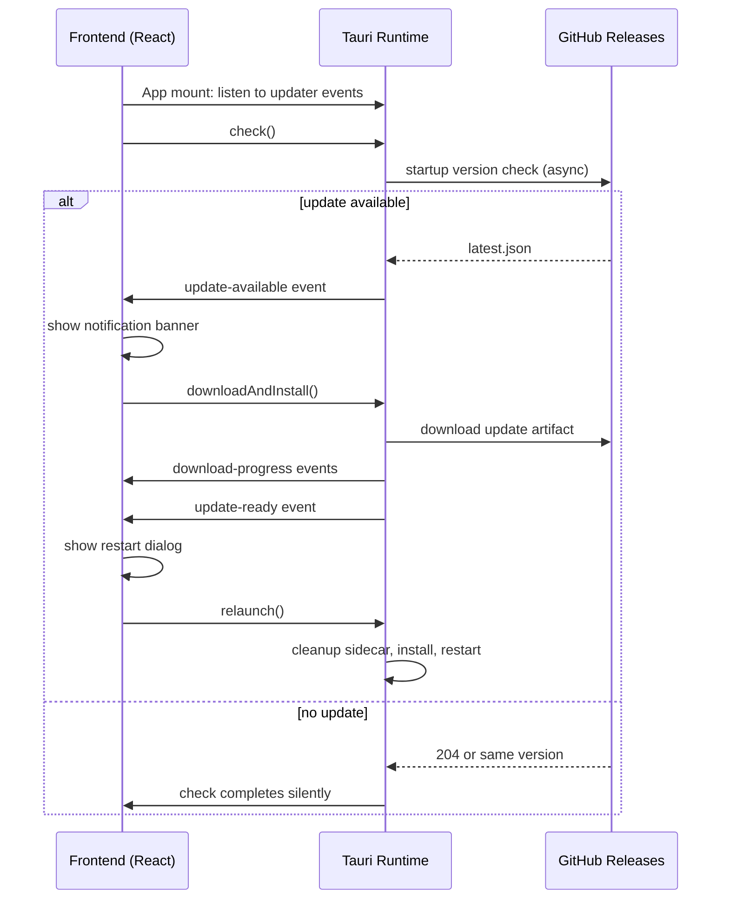

# Add Built-in Desktop Auto-Updater

## Summary

Add a Tauri-native auto-updater to the Comate desktop app that checks GitHub Releases on startup and every 4 hours, downloads updates in the background, and prompts the user to install and restart. The implementation wires the official `tauri-plugin-updater` into the Rust shell, exposes update state to the React frontend through the plugin's events, and adds lightweight UI for notifications, progress, and restart confirmation.

---

## Problem Frame

Comate is currently distributed manually through IM: the developer transfers install packages and users uninstall the old version before installing the new one. This does not scale beyond the internal team and creates version fragmentation. An in-app updater removes the manual step and ensures users reach current releases without re-downloading the full package or re-running an installer.

---

## Requirements

**Update discovery**
- R1. On application startup and periodically while running, the app checks GitHub Releases for a newer version.
- R2. The version check must not block the main application from loading or functioning.
- R3. If a newer version exists, the app shows a non-blocking notification to the user.

**Download and installation**
- R4. The user can initiate the download from the update notification.
- R5. While downloading, the app shows visible progress to the user.
- R6. After download completes, the app prompts the user to restart to install the update.

**User control**
- R7. The user can dismiss or defer the update notification without installing.
- R8. The user can check for updates manually via a menu or settings action, in addition to the automatic startup check.

**Error handling**
- R9. If the version check fails (network error, unreachable manifest), the app fails silently and does not show an error to the user.
- R10. If a download fails, the app surfaces an actionable error message and allows the user to retry.

**Platform support**
- R11. The updater works on macOS, Windows, and Linux.
- R12. The periodic background check runs at a reasonable interval and does not degrade performance or battery life.

---

## Key Technical Decisions

- Use Tauri's official `tauri-plugin-updater` and `@tauri-apps/plugin-updater` — the standard v2 path, with mandatory Ed25519 signature verification built in. A custom updater would re-implement cross-platform package replacement and signature logic.
- Frontend owns both the update UX and the update polling schedule — the Tauri JS API exposes `check()`, `downloadAndInstall()`, progress callbacks, and `relaunch()`, so the frontend can drive the entire flow. Rust only registers the plugin and handles graceful sidecar cleanup before restart.
- GitHub Releases hosts the manifest and binaries — the repository is public, CI already publishes releases on `v*` tags, and no additional infrastructure is needed.
- Update state is synchronized through the plugin's built-in events and the Zustand update store — the frontend listens for plugin events in `App.tsx` and reduces them into `updater-store.ts`. This avoids inventing a new IPC contract.
- Startup check is triggered from the frontend after `App.tsx` mounts; `checkOnStartup` in `tauri.conf.json` is disabled to avoid the frontend missing the initial event. The frontend calls `check()` once on mount and then schedules the 4-hour periodic `setInterval`.
- Dismissing an update silences it until the next app launch or periodic check — no permanent "skip version" logic in v1, keeping storage and UX simple.
- Linux updates use the AppImage target — Tauri's updater only supports self-replacement on Linux via AppImage; `.deb` and `.rpm` remain manual-install fallbacks.
- Contributor builds stay unsigned and skip updater artifact generation — `bundle.createUpdaterArtifacts` is `false` in the committed config and enabled only in release CI via the `--config` flag when `TAURI_SIGNING_PRIVATE_KEY` is present. This avoids failing local or PR builds that lack the signing secret.

---

## System-Wide Impact

- **Sidecar lifecycle during updater restart.** The existing `cleanup_sidecar` path in `src-tauri/src/lib.rs` gracefully shuts down the Node.js sidecar. The updater's `relaunch()` triggers `RunEvent::Exit` while the process is still alive, so the cleanup path must run with a long enough grace period for the sidecar to finish in-flight sessions. The normal 500ms fast-shutdown grace may be too short for an update restart.
- **Single-instance plugin interaction with relaunch.** `tauri-plugin-single-instance` is already registered. `relaunch()` spawns a new process before the old one exits; on Windows the named mutex may cause the new instance to be treated as a duplicate. This must be tested on all three platforms immediately after the plugin is wired.
- **System tray / close-to-tray behavior during update prompts.** The app hides the main window on close. The restart dialog must force-show the main window before prompting, otherwise a user who closed-to-tray will never see it. On macOS this also resets the activation policy from `Accessory` to `Regular`.
- **Frontend event listener pattern.** The frontend currently has no Tauri event listeners. The updater introduces `listen()` from `@tauri-apps/api/event` via a single `useEffect` in `App.tsx`, registered once at mount and cleaned up on unmount.
- **Settings/preferences storage ownership.** `use-app-settings.ts` owns the `app-settings` localStorage key. Updater preferences (`autoCheckUpdates`) live there; the update store reads them but does not write directly to the same key. Last-check timestamp should also be written through the settings hook to avoid races.
- **CI/CD artifact requirements.** Adding `appimage` to Linux bundle targets and enabling updater artifacts changes the release payload. Contributor builds must not fail when signing secrets are absent.
- **macOS lifecycle edge.** `RunEvent::ExitRequested` may fire during updater restart instead of `RunEvent::Exit`; the shutdown handler should cover both to ensure sidecar cleanup runs.

---

## High-Level Technical Design

The frontend owns a small state machine: `idle` → `checking` → `available` → `downloading` → `ready` → `restarting`. The update store reduces plugin events into this state. Rust does not track the state machine; it only registers the plugin and handles pre-restart cleanup.

---

## Implementation Units

### U0. Signing key and endpoint setup

**Goal:** Generate the Tauri updater signing keypair and configure the GitHub Releases endpoint before any code changes land.

**Requirements:** R1, R11.

**Dependencies:** None.

**Files:**
- `src-tauri/tauri.conf.json`

**Approach:**
Generate an Ed25519 keypair with `tauri signer generate`, store the private key in CI secrets (`TAURI_SIGNING_PRIVATE_KEY`), and embed the public key in `tauri.conf.json` under `plugins.updater.pubkey`. Configure the updater `endpoints` array to point to the static GitHub Releases asset URL: `https://github.com/ai-dvps/claude-code-gui/releases/latest/download/latest.json`.

**Patterns to follow:** Existing CI signing secret pattern documented in `docs/plans/2026-06-13-001-chore-release-comate-0-0-3-plan.md`.

**Test scenarios:**
- `tauri signer sign --help` runs successfully after key generation.
- The public key string is valid and accepted by `tauri.conf.json` schema validation.

**Verification:** The `latest.json` endpoint URL is reachable and returns valid JSON in a test release.

---

### U1. Add updater plugin dependencies and Tauri configuration

**Goal:** Enable the Tauri updater runtime and point it at GitHub Releases.

**Requirements:** R1, R2, R11.

**Dependencies:** U0.

**Files:**
- `src-tauri/Cargo.toml`
- `src-tauri/Cargo.lock`
- `src-tauri/tauri.conf.json`
- `src-tauri/tauri.macos.conf.json` (if platform-specific targets are split)
- `package.json`
- `package-lock.json`
- `src-tauri/capabilities/default.json`

**Approach:**
Add `tauri-plugin-updater` to the Rust crate, gated with `#[cfg(desktop)]`; add `tauri-plugin-process` only if the updater plugin's built-in `relaunch()` is insufficient. Add `@tauri-apps/plugin-updater` to the frontend dependencies. In `tauri.conf.json`, keep `bundle.createUpdaterArtifacts` as `false` in the committed config so contributor builds without signing secrets do not fail; override it to `true` in the release workflow via the Tauri CLI `--config` flag when `TAURI_SIGNING_PRIVATE_KEY` is present. Set `plugins.updater.checkOnStartup` to `false` so the frontend controls startup timing, add `appimage` to Linux bundle targets, and configure the `plugins.updater` block with the public key and GitHub Releases endpoint. Add updater and process permissions to `src-tauri/capabilities/default.json`.

**Patterns to follow:** Existing plugin registration in `src-tauri/src/lib.rs` for `tauri-plugin-shell`, `tauri-plugin-dialog`, and `tauri-plugin-log`.

**Test scenarios:**
- `cargo check` passes after adding dependencies.
- `npm install` resolves the new frontend packages.
- `tauri build` succeeds in CI with signing secrets present.
- `tauri build` succeeds locally with signing secrets absent by falling back to `createUpdaterArtifacts: false` or skipping artifact signing.

**Verification:** The built app contains the updater plugin, the `latest.json` endpoint is embedded, and the capability file grants updater and process permissions.

---

### U2. Rust-side updater plugin initialization and restart cleanup

**Goal:** Register the updater plugin and ensure the sidecar is cleaned up before the updater restarts the app.

**Requirements:** R1, R2, R9, R11.

**Dependencies:** U1.

**Files:**
- `src-tauri/src/lib.rs`

**Approach:**
Register `tauri_plugin_updater::init()` in the Tauri builder with `#[cfg(desktop)]`. The frontend will call `check()` and `downloadAndInstall()` directly, so no custom Rust commands are needed for the core flow.

Add an `is_updating: AtomicBool` field to `AppState`. Before the frontend calls `relaunch()`, it sets this flag via a Tauri command. The `RunEvent::Exit` and `RunEvent::ExitRequested` handlers check the flag and call `cleanup_sidecar` with a 5-second grace period when it is set; otherwise they use the existing 500ms fast shutdown.

Test `relaunch()` against `tauri-plugin-single-instance` on macOS, Windows, and Linux. If the new instance is swallowed, add a command-line argument (e.g., `--updater-relaunch`) to the relaunch call and modify the single-instance callback to allow processes carrying that argument to proceed.

**Patterns to follow:** The existing `perform_shutdown` and `cleanup_sidecar` paths in `src-tauri/src/lib.rs`; the `RunEvent::Exit` handling from `docs/plans/2026-06-02-010-fix-macos-cmdq-dock-quit-cleanup-plan.md`.

**Test scenarios:**
- App starts and the updater plugin initializes without errors.
- No network connection: startup check fails silently, app continues normally.
- Update restart triggers `cleanup_sidecar` with the extended grace period.
- `relaunch()` works on all three platforms with `tauri-plugin-single-instance` active.

**Verification:** Run the app with a mock `latest.json` endpoint and confirm the restart path cleans up the sidecar before relaunching.

---

### U3. Frontend updater service, store, and notification UI

**Goal:** Provide the frontend with update state, polling, and UI for notifications, progress, and restart.

**Requirements:** R1, R2, R3, R4, R5, R6, R7, R8, R9, R10, R12.

**Dependencies:** U1, U2.

**Files:**
- `src/client/lib/updater-api.ts` (new)
- `src/client/stores/updater-store.ts` (new)
- `src/client/stores/updater-store.test.ts` (new)
- `src/client/components/UpdateNotification.tsx` (new)
- `src/client/components/UpdateRestartDialog.tsx` (new)
- `src/client/App.tsx`
- `src/client/i18n/en/common.json`
- `src/client/i18n/zh-CN/common.json`

**Approach:**
Create `updater-api.ts` as a thin wrapper around `@tauri-apps/plugin-updater` and `@tauri-apps/api/event`, guarded by `isTauri()`. It initializes event listeners for plugin events in `App.tsx` and exposes `checkForUpdates()` and `downloadAndInstallUpdate()`. Create `updater-store.ts` with a Zustand store tracking `status`, `version`, `downloadProgress`, and `error`, plus reducers for each plugin event. Define `autoCheckUpdates` (boolean, default true) and `lastUpdateCheckAt` (ISO timestamp) in this unit; the settings UI in U4 reads and writes these through the settings hook.

Create `UpdateNotification.tsx` as a persistent banner that appears when `status === 'available'` or `status === 'downloading'` (and briefly shows a `checking` indicator during manual checks), with actions to download/dismiss. `dismissUpdate()` resets status to `idle` and hides the banner until the next automatic or manual check; it does not permanently skip the version. Create `UpdateRestartDialog.tsx` as a modal that appears when `status === 'ready'`, warns about interrupting active sessions, and offers "Restart Now" / "Restart Later". Both components mount near the root of `App.tsx`, reuse the existing `ConfirmDialog` focus/ARIA patterns, and are keyboard and screen-reader accessible. Trigger the first check in a `useEffect` after `App.tsx` mounts. Add i18n keys for all updater strings to both language files.

The periodic check runs from a `setInterval` in `updater-api.ts`: every 4 hours with jitter, guarded by `isTauri()`, `autoCheckUpdates` preference, and a check that the app is not currently downloading or ready to restart.

**Patterns to follow:** `src/client/stores/toast-store.ts` for Zustand; `src/client/lib/tauri-api.ts` for Tauri guards; `src/client/components/ConfirmDialog.tsx` for modal behavior; `chat-store.ts` for `setInterval` polling patterns.

**Test scenarios:**
- Store transitions through states correctly when plugin events arrive in order.
- Manual check transitions the store to `checking`, then to `available` or `idle`.
- `checkForUpdates()` returns `null` and store enters `idle` when no update exists.
- Version check failure (network error, unreachable manifest) keeps the store in `idle` and does not surface an error to the user (R9).
- Download failure sets `error`, surfaces an actionable message, and lets the user retry (R10).
- Calling `dismissUpdate()` resets status to `idle` and silences the banner until the next check.
- Periodic check is skipped when `autoCheckUpdates` is false or when a download/restart is already in flight.
- Banner appears when an update is available; progress updates during download; restart dialog appears when ready.

**Verification:** Unit-test the store reducers; manually verify the full flow against a mock release.

---

### U4. Updater preferences in Settings

**Goal:** Let users trigger update checks and control auto-check behavior from the existing settings UI.

**Requirements:** R8, R12.

**Dependencies:** U3.

**Files:**
- `src/client/hooks/use-app-settings.ts`
- `src/client/hooks/use-app-settings.test.ts` (new)
- `src/client/components/SettingsPanel.tsx`
- `src/client/i18n/en/settings.json`
- `src/client/i18n/zh-CN/settings.json`

**Approach:**
Add `autoCheckUpdates` (boolean, default `true`) and `lastUpdateCheckAt` (ISO-8601 timestamp or `null`, default `null`) to the `AppSettings` schema in `use-app-settings.ts`. The hook already merges stored settings with defaults, so existing user data without these fields receives the defaults automatically. Add a section to the General tab of `SettingsPanel.tsx` that displays the current app version, a "Check for Updates" button, the last-check time, and a toggle for `autoCheckUpdates`. The last-check timestamp should be written through the settings hook when a check completes. Add i18n keys for the new settings strings.

**Patterns to follow:** `use-app-settings.ts` for localStorage persistence and default merging; `SettingsPanel.tsx` General tab for app-level preferences.

**Test scenarios:**
- Toggle off disables periodic checks.
- Manual check button triggers an immediate check.
- Last-check time updates after a check completes and persists in `app-settings`.
- Adding new settings fields is backward-compatible with existing stored settings.

**Verification:** Open Settings, click "Check for Updates", and confirm the update store transitions through `checking` and either `available` or `idle`.

---

### U5. Update CI/CD to publish signed updater artifacts

**Goal:** Ensure every release produces signed update packages and a `latest.json` manifest on GitHub Releases.

**Requirements:** R1, R11.

**Dependencies:** U0, U1.

**Files:**
- `.github/workflows/build.yml`

**Approach:**
Verify the workflow sets `TAURI_SIGNING_PRIVATE_KEY` and `TAURI_SIGNING_PRIVATE_KEY_PASSWORD` as repository-level secrets scoped only to release jobs. Ensure `tauri-apps/tauri-action@v0` is invoked with `includeUpdaterJson: true` so it generates and uploads `latest.json` and `.sig` files. Add `appimage` to the Linux build matrix alongside the existing `.deb`/`.rpm` targets; AppImage is the only Linux format Tauri's updater can self-replace, while `.deb` and `.rpm` remain manual-install fallbacks. Make `bundle.createUpdaterArtifacts` conditional on the presence of signing secrets so PR builds and contributor forks without the private key skip artifact generation instead of failing. Add a build step that verifies updater artifacts and signatures exist before marking the release as ready. Ensure PR builds without signing secrets do not fail.

**Patterns to follow:** Existing release workflow `docs/plans/2026-06-13-001-chore-release-comate-0-0-3-plan.md`.

**Test scenarios:**
- Draft release contains `latest.json` and `.sig` files for each platform artifact.
- Unsigned contributor builds do not fail when signing secrets are absent.
- Linux AppImage artifact is produced and signed.

**Verification:** Publish a test release and confirm the app can check, download, and install from it.

---

## Scope Boundaries

- Silent automatic installation without user consent — updates always prompt before installing.
- Delta or patch updates — full binaries are downloaded.
- Two-tier updates where the Node.js sidecar updates independently of the Tauri shell.
- OS package managers (Homebrew, WinGet, etc.) as a primary update channel.
- Automatic rollback to previous versions.
- Update scheduling or "install tonight" behavior.
- Permanent "skip this version" persistence — dismissed updates reappear on next check.
- Linux `.deb` and `.rpm` self-updates — these formats remain manual install.
- In-app changelog rendering beyond the release notes field provided by the updater manifest.

---

## Risks & Dependencies

- `tauri-plugin-single-instance` may block the updater's `relaunch()` if the new process is seen as a duplicate. This must be tested on all three platforms as soon as U2 is wired. Mitigation: add a short delay before `relaunch()` if testing reveals a race, or document the limitation.
- Code signing and notarization are required for a friction-free macOS/Windows experience. The current CI has signing secrets, but Apple Developer membership and Windows certificate purchase may still be needed. Mitigation: defer strict codesigning to a fast-follow if internal distribution tolerates Gatekeeper/SmartScreen warnings.
- Windows MSI updates can loop when the app is installed to a custom directory. Mitigation: evaluate NSIS vs MSI in U0/U5; default to the documented install path if MSI is kept.
- Restart interrupts the Node.js sidecar and any active Claude Code sessions. Mitigation: the restart dialog warns users and U2 uses an extended sidecar cleanup grace period.
- Linux support requires adding AppImage to the build matrix; without it, R11 is not satisfied for Linux users.
- GitHub unauthenticated API rate limits (60 req/hour/IP) are avoided by using the static release asset URL rather than the GitHub API.
- Downgrade attacks are mitigated by `tauri-plugin-updater`, which rejects manifests whose version is not greater than the running version. A compromised signing key would let an attacker ship malicious updates; mitigation is to keep `TAURI_SIGNING_PRIVATE_KEY` in a repository secret scoped to release jobs and to rotate the keypair immediately if exposure is suspected (new public key embedded in the next release).

---

## Open Questions

### Resolve Before Implementation

- [Affects U0][Ops] Has the Ed25519 signing key pair been generated, and is the public key ready to embed in `tauri.conf.json`?
- [Affects U5][Build] Should Windows use NSIS instead of MSI to avoid the custom-install-path update loop, or keep MSI and document the limitation?

### Resolved During Planning

- [Affects U1][Ops] `bundle.createUpdaterArtifacts` will be `false` in the committed `tauri.conf.json`; the release workflow overrides it to `true` via the Tauri CLI `--config` flag when `TAURI_SIGNING_PRIVATE_KEY` is available. This keeps unsigned contributor builds green while producing signed updater artifacts in CI.

### Deferred to Implementation

- [Affects U3][UX] Exact wording and visual design of the update banner and restart dialog.
- [Affects U3][UX] Whether to show release notes in the banner or only in the restart dialog.
- [Affects U2][Technical] Exact grace period and cleanup sequencing for sidecar shutdown before updater restart.

---

## Sources & Research

- Tauri v2 Updater Plugin documentation and JavaScript API reference (see agent research).
- Existing local patterns: `src-tauri/src/lib.rs` (sidecar lifecycle, tray poller), `src/client/stores/toast-store.ts` (notification state), `src/client/hooks/use-app-settings.ts` (app preferences), `src/client/components/ConfirmDialog.tsx` (modal pattern).
- Prior release plan: `docs/plans/2026-06-13-001-chore-release-comate-0-0-3-plan.md`.
- Prior system-tray/background-mode plan: `docs/plans/2026-05-23-003-feat-system-tray-background-mode-plan.md`.
- Prior macOS lifecycle fix plan: `docs/plans/2026-06-02-010-fix-macos-cmdq-dock-quit-cleanup-plan.md`.
