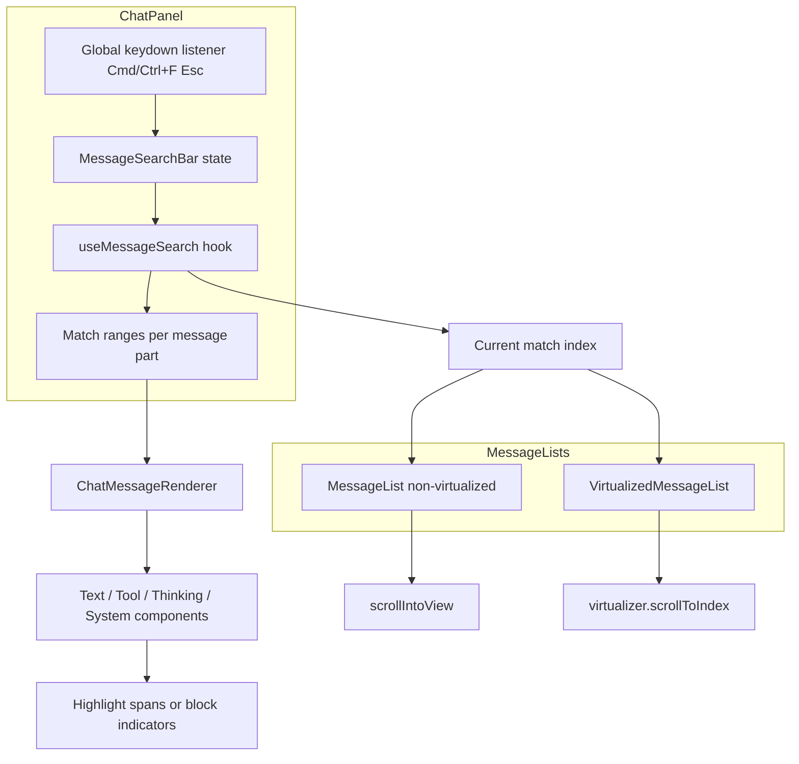

## Summary

Add a floating search bar to the chat panel that searches loaded messages in the active session. Search state lives in `ChatPanel` so it survives the switch between non-virtualized and virtualized message lists. Matching runs over message data, and highlights are rendered through the existing message component tree.

## Problem Frame

Long chat sessions accumulate many messages. When a user needs to refer back to an earlier prompt, response, tool result, or system notice, scrolling manually is slow and unreliable. There is no way to quickly locate specific text inside the current conversation.

## Requirements

**Search UI and activation**

- R1. A floating search bar appears inside the chat panel when the user presses `Cmd/Ctrl+F`.
- R2. The search bar contains a text input, a match counter showing the current match index and total (e.g., `2/12`), previous/next buttons, and a clear/close control.
- R3. The search bar can also be closed by pressing `Esc`.

**Matching behavior**

- R4. Typing in the search input performs substring, case-insensitive matching against all rendered text content of the loaded messages in the active session.
- R5. Matching covers user prompts, assistant responses, tool results, thinking blocks, and system messages.
- R6. Matching messages are visually highlighted in the message list without hiding non-matching messages.

**Navigation and interaction**

- R7. The user can navigate between highlighted matches using the previous/next buttons.
- R8. Navigation scrolls the selected match into view.
- R9. When no matches are found, the search bar shows an empty state indicating zero matches.

**Lifecycle and reset**

- R10. The search query resets to empty and the search bar closes when the user switches to a different session.
- R11. Closing the search bar clears highlights and removes the match counter.

## Key Technical Decisions

- **Lift search state to `ChatPanel`.** This keeps search active when a session crosses the 50-message virtualization threshold and avoids duplicate state inside `MessageList` and `VirtualizedMessageList`.
- **Match over message data, not the DOM.** The virtualized list only mounts visible items, so DOM-based text search would miss off-screen matches. The hook extracts searchable text from message parts and returns match ranges.
- **Prop-based highlighting through the message tree.** `ChatMessageRenderer` and the `ai-elements` components receive match ranges and render highlighted spans around matching substrings. This works for both list modes because it runs at render time.
- **Auto-expand collapsed sections on navigation.** When the current match is inside a `CompactableText`, `CompactableContainer`, or `Reasoning` block, the component expands so the highlight is visible.
- **Code blocks get block-level match indication in v1.** Shiki tokenization makes inline substring highlighting inside code blocks complex; a border/glow on the code block container is sufficient for the first version.
- **Debounce search input updates.** This avoids re-running matching and re-rendering the message tree on every keystroke.
- **Prevent default on `Cmd/Ctrl+F` and `Esc`.** This blocks the Tauri webview's native find and stops the event from reaching other `Escape` handlers.

## High-Level Technical Design

## Implementation Units

### U1. Create message search hook

- **Goal:** Encapsulate query state, substring matching, match indexing, and navigation.
- **Requirements:** R4, R5, R7, R9.
- **Files:**
  - `src/client/hooks/useMessageSearch.ts`
  - `src/client/hooks/useMessageSearch.test.ts`
- **Approach:** Build a hook that accepts the active session's loaded messages and the current query, and returns `{ query, setQuery, matches, currentMatchIndex, totalMatches, nextMatch, prevMatch, isSearching }`. Extract searchable text from each `MessagePart` (`text`, `thinking`, `tool_result`). Return match ranges keyed by message id and part index. Debounce `setQuery`. Navigation clamps at the first and last match and wraps if desired.
- **Patterns to follow:** Existing hook tests in `src/client/hooks/useSentPrompts.test.ts`; substring logic in `src/client/lib/session-filter.ts`.
- **Test scenarios:**
  - Empty query returns zero matches.
  - Substring matching is case-insensitive.
  - Multiple matches inside one message are counted separately.
  - `tool_result` and `thinking` parts are searchable.
  - No matches returns an empty array and a counter of `0/0`.
  - Navigation moves the current index forward and backward.
- **Verification:** Hook unit tests pass and cover all message part types.

### U2. Add floating search bar component

- **Goal:** Render the search input, match counter, previous/next buttons, and close control.
- **Requirements:** R1, R2, R3, R9.
- **Files:**
  - `src/client/components/MessageSearchBar.tsx`
  - `src/client/components/MessageSearchBar.test.tsx`
- **Approach:** Create a controlled input component mounted above the message list. It accepts `query`, `onQueryChange`, `matchCount`, `currentMatchIndex`, `onNext`, `onPrev`, and `onClose`. Focus the input on mount. Call `onClose` when `Esc` is pressed and stop propagation. Render a clear button when text is present.
- **Patterns to follow:** Clear-button styling from `PromptInput.tsx`; search input styling from `FileExplorer.tsx`; i18n keys added to `src/client/i18n/en/chat.json` and `zh-CN/chat.json`.
- **Test scenarios:**
  - Typing updates the query.
  - Previous/next buttons call their handlers.
  - Close button and `Esc` call `onClose`.
  - Counter displays current and total match counts.
- **Verification:** Component renders correctly and tests pass.

### U3. Wire shortcut and lifecycle into ChatPanel

- **Goal:** Open and close the search bar, and reset state when the session changes.
- **Requirements:** R1, R3, R10, R11.
- **Dependencies:** U1, U2.
- **Files:**
  - `src/client/components/ChatPanel.tsx`
- **Approach:** Add a `window` keydown listener in `ChatPanel` for `Cmd/Ctrl+F` that opens the search bar and calls `event.preventDefault()`, but skip the shortcut when the active element is an input or textarea. Store search query and visibility state in `ChatPanel`. Pass the active session's messages to `useMessageSearch`. Close the bar and clear the query in a `useEffect` when `activeSessionId` changes. Render `MessageSearchBar` conditionally above the messages area.
- **Patterns to follow:** Existing session-switch cleanup in `ChatPanel.tsx` (e.g., `setOpenDrawerToolUseId(null)`); global Escape handling in `SubagentDrawer.tsx`.
- **Test scenarios:**
  - `Cmd/Ctrl+F` opens the search bar.
  - `Esc` closes the search bar.
  - Switching sessions closes the bar and clears the query.
  - Typing in `PromptInput` does not trigger message search.
- **Verification:** Manual check in the dev build; jsdom test for state reset on session switch if feasible.

### U4. Render highlights in message components

- **Goal:** Visually highlight matches inside message content and auto-expand collapsed sections.
- **Requirements:** R5, R6.
- **Dependencies:** U1.
- **Files:**
  - `src/client/components/ChatMessageRenderer.tsx`
  - `src/client/components/ai-elements/message.tsx`
  - `src/client/components/ai-elements/compactable-text.tsx`
  - `src/client/components/ai-elements/reasoning.tsx`
  - `src/client/components/ai-elements/tool.tsx`
  - `src/client/components/ai-elements/code-block.tsx`
- **Approach:** Pass the active match ranges from `ChatPanel` down through `MessageList` / `VirtualizedMessageList` to `ChatMessageRenderer`. For text, thinking, and tool-result parts, wrap matching substrings in a styled highlight span. For `CompactableText`, `CompactableContainer`, and `Reasoning`, auto-expand when the current match falls inside. For code blocks, add a container class when a match is present inside.
- **Patterns to follow:** Tailwind tokens (`bg-accent`, `text-text-primary`, `rounded`); existing `ai-elements` component boundaries.
- **Test scenarios:**
  - A text match renders a highlighted span.
  - A code block containing a match shows a block-level indicator.
  - A collapsed section expands when the current match is inside it.
  - Highlights disappear when the search query is cleared.
- **Verification:** Browser or manual verification; component tests for range-to-span rendering if practical.

### U5. Scroll current match into view

- **Goal:** Navigate to the current match in both non-virtualized and virtualized lists.
- **Requirements:** R7, R8.
- **Dependencies:** U1, U4.
- **Files:**
  - `src/client/components/MessageList.tsx`
  - `src/client/components/VirtualizedMessageList.tsx`
- **Approach:** In `MessageList`, find the DOM element for the message containing the current match and call `scrollIntoView({ block: 'center' })`. In `VirtualizedMessageList`, map the current match to a `viewItems` index and call `virtualizer.scrollToIndex(index, { align: 'center' })`, then scroll the specific element into view. Trigger `virtualizer.measure()` after auto-expanding collapsed content so sizes are current.
- **Patterns to follow:** Existing `scrollToIndex` usage in `VirtualizedMessageList.tsx`.
- **Test scenarios:**
  - Clicking next/previous scrolls the match into view in the non-virtualized list.
  - Navigating in the virtualized list jumps to the correct item.
  - Expanding a collapsed message updates the virtualizer size before scrolling.
- **Verification:** Manual verification with long sessions; existing browser tests pass.

### U6. Add i18n keys and integration tests

- **Goal:** Localize the search UI and verify the end-to-end flow.
- **Requirements:** R2, R9.
- **Dependencies:** U2, U3, U5.
- **Files:**
  - `src/client/i18n/en/chat.json`
  - `src/client/i18n/zh-CN/chat.json`
  - `src/client/components/ChatPanel.browser.test.tsx` or `src/client/components/MessageList.test.tsx`
- **Approach:** Add keys for search placeholder, no-match state, previous/next labels, and close button. Add an integration test that opens search, types a query, asserts match count, navigates matches, and closes the bar.
- **Patterns to follow:** Existing `chat.json` keys; `SessionList.test.tsx` for store mocking and i18n wrapping.
- **Test scenarios:**
  - Covers AE1: open search and find matches.
  - Covers AE2: navigate between matches.
  - Covers AE3: close search clears highlights.
  - Covers AE4: switch session resets search.
  - Covers AE5: no matches shows empty state.
- **Verification:** New tests pass; both English and Chinese i18n files updated.

## Scope Boundaries

- Server-side message search, indexing, or storage changes.
- Searching across sessions or workspaces.
- Searching messages that have not yet been loaded from the server.
- Fuzzy matching, regular expressions, whole-word matching, or a case-sensitive mode.
- Search-and-replace or persistent search history.
- Inline highlighting inside Shiki-rendered code blocks in v1.
- Keyboard shortcuts other than `Cmd/Ctrl+F` to open search.

## Risks & Dependencies

- **Tauri shortcut interception.** If calling `event.preventDefault()` on `Cmd/Ctrl+F` inside the webview does not suppress the native find dialog, a Rust-side Tauri accelerator may be required. Verify early in U3.
- **Markdown rendering mismatch.** Search operates on raw message text, but highlights are applied in the rendered DOM. If the highlight layer is inserted before Streamdown renders, markdown syntax could be altered; if after, ranges must map to rendered text nodes. The plan leaves the exact insertion point to implementation-time discovery.
- **Virtualized list dynamic sizes.** Auto-expanding collapsed messages changes item heights. `VirtualizedMessageList` must remeasure before `scrollToIndex` lands accurately.
- **Escape handler ordering.** Multiple components listen for `Escape`. The search bar must stop propagation so it does not also close drawers, pickers, or panels.
- **Message window cap.** `chat-store.ts` keeps only the most recent `windowCap` (default 200) messages. Search is limited to this loaded window.

## Sources & Research

- Existing session-list search pattern: `src/client/lib/session-filter.ts`.
- Existing picker fuzzy search: `src/client/lib/picker-filter.ts`.
- Virtualization architecture and scroll behavior: `src/client/components/VirtualizedMessageList.tsx`, `docs/plans/2026-05-21-003-feat-session-message-virtualization-plan.md`, `docs/plans/2026-05-24-008-fix-virtualized-message-list-scroll-plan.md`.
- Message rendering components: `src/client/components/ChatMessageRenderer.tsx` and `src/client/components/ai-elements/`.
- Keyboard handling precedent: `src/client/lib/keyboard.ts`, `src/client/components/PromptInput.tsx`, `src/client/components/SubagentDrawer.tsx`.
