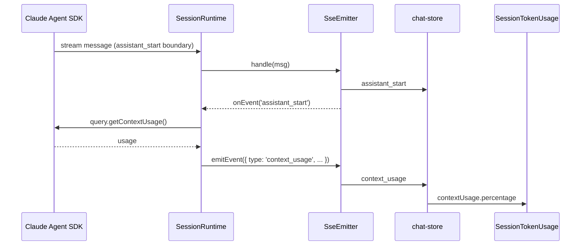

# Live Server-Pushed Context Usage

## Summary

Wire the SDK's `query.getContextUsage()` into the SSE stream so the client receives a `context_usage` event on every streaming lifecycle boundary. Replace the fetch-on-open `ContextUsagePanel` with a single, always-visible indicator in `SessionTokenUsage` that shows the server's percentage and falls back to the existing cumulative-input estimate.

---

## Problem Frame

The GUI has two context-usage surfaces that disagree after auto-compaction:

- `ContextUsagePanel` only fetches `query.getContextUsage()` when opened, so it stays stale during streaming and can show a pre-compaction value after compaction.
- `SessionTokenUsage` derives "Context: X%" from `sessionUsage.cumulativeInput`, which is reset to zero on `compact_boundary` and only updates at the next `result` event.

The result is a misleadingly low context-fill percentage during streaming. The real source of truth is `query.getContextUsage()`, but it is not connected to the streaming lifecycle.

---

## Requirements

### Server-side emission

- R1. The server emits a new `context_usage` SSE event after each lifecycle event in the streaming path: `assistant_start`, `tool_result`, `assistant_done`, `result`, and `compact_boundary`.
- R2. The `context_usage` event payload includes at least `totalTokens`, `maxTokens`, `percentage`, and `categories`.
- R3. The server fetches the current value via `query.getContextUsage()` before emitting the event.
- R4. Emission must not block or reorder the existing SSE stream; context-usage fetches are asynchronous relative to the lifecycle event they follow.

### Client-side handling

- R5. The client stores the latest `contextUsage` per session and updates it on each `context_usage` event.
- R6. The client clears or overwrites stale `contextUsage` when `compact_boundary` arrives.
- R7. `SessionTokenUsage` renders the accurate `contextUsage.percentage` when available.
- R8. `SessionTokenUsage` falls back to the existing `sessionUsage.cumulativeInput` estimate when no `contextUsage` data exists for the session.
- R9. The client does not poll the context-usage REST endpoint.

### UI cleanup

- R10. Remove the `ContextUsagePanel` component and its status-bar trigger.
- R11. Update any imports, tests, and i18n keys that reference `ContextUsagePanel`.

---

## Key Technical Decisions

- KTD1. **Server-side emission is driven from `SessionRuntime`, not from inside `SseEmitter`.** `SessionRuntime` owns the SDK `Query` and can call `getContextUsage()`. `SseEmitter` remains a stateless message normalizer; the runtime observes emitted lifecycle events via the existing `onEvent` callback and schedules the follow-up `context_usage` emission.
- KTD2. **Fetches are fire-and-forget and never awaited in the message loop.** A failed `getContextUsage()` call is logged server-side and the `context_usage` event is simply skipped. This preserves R4's non-blocking guarantee and prevents a failing control call from stalling the assistant stream.
- KTD3. **The client clears `contextUsage` immediately on `compact_boundary`.** The status bar falls back to the `sessionUsage` estimate until the next `context_usage` event arrives. This avoids showing a stale pre-compaction percentage during the compact window.
- KTD4. **The old REST endpoint and service method are removed along with the panel.** Once the client stops polling, the route and `ChatService.getContextUsage` become dead code. Removing them reduces surface area and makes the SSE push the only path.
- KTD5. **The `context_usage` payload is a mapped shape, not the raw SDK response.** The event exposes `totalTokens`, `maxTokens`, `percentage`, and `categories` explicitly so the client contract is stable even if the SDK shape changes.

---

## High-Level Technical Design

The same pattern applies after `tool_result`, `assistant_done`, `result`, and `compact_boundary`. Because `context_usage` is emitted through `SseEmitter.send()`, it is automatically assigned an event ID, stored in the ring buffer, and replayed on client reconnect.

---

## Scope Boundaries

### Deferred for later

- Detailed category breakdown UI. The `context_usage` event still carries `categories`, but no panel renders them in v1.
- Client-side polling for context usage.
- Changes to `sessionUsage` accounting logic.
- Pushing `context_usage` on every `text_delta`.

### Outside this product's identity

- Exposing context usage as a public API or analytics metric.

---

## Risks & Dependencies

- **Risk:** `query.getContextUsage()` may fail or return an unexpected shape while a streaming turn is active. **Mitigation:** fire-and-forget emission with server-side logging; the stream continues unchanged.
- **Risk:** Extra `context_usage` events increase ring-buffer and replay traffic. **Mitigation:** events are small and only emitted on lifecycle boundaries, not per delta.
- **Risk:** A `context_usage` event with pre-compaction data could race against `compact_boundary` on reconnect. **Mitigation:** `compact_boundary` clears the client copy, and every subsequent `context_usage` overwrites it.
- **Dependency:** The SDK returns reliable context-usage values during active streaming turns. If this assumption is wrong, the status bar may show transiently incorrect percentages.

---

## Acceptance Examples

- AE1. **After compaction.** Given a session with `contextUsage.percentage = 80%`, when `compact_boundary` arrives followed by `context_usage` with `percentage = 5%`, then `SessionTokenUsage` displays "Context: 5%".
- AE2. **During streaming.** Given an active streaming turn where the assistant generates a long reply, when `assistant_done` arrives followed by `context_usage` with a higher `totalTokens`, then `SessionTokenUsage` updates from the previous percentage to the new one without waiting for `result`.
- AE3. **Fallback.** Given a session with no runtime active and no `context_usage` event received, then `SessionTokenUsage` continues to derive the percentage from `sessionUsage.cumulativeInput`.

---

## Implementation Units

### U1. Extend the `SseEvent` union with `context_usage`

**Goal:** Add the new event type to both copies of the shared `SseEvent` union.

**Requirements:** R2

**Dependencies:** None

**Files:**
- `src/server/types/message.ts`
- `src/client/types/message.ts`

**Approach:** Add a new variant to the discriminated union in both files, keeping them byte-identical. The payload exposes `totalTokens`, `maxTokens`, `percentage`, and `categories`. Preserve the existing header comment and do not import additional server types into the client copy.

**Patterns to follow:** The two files are kept byte-identical by convention and verified by CI with `diff src/client/types/message.ts src/server/types/message.ts`.

**Test scenarios:**
- `diff` between the two files returns no output after the change.
- TypeScript compiles both client and server projects without errors.

**Verification:** Both `tsc` builds pass and the diff check is clean.

---

### U2. Emit `context_usage` after lifecycle boundaries

**Goal:** After each lifecycle SSE event, asynchronously fetch context usage and emit a `context_usage` event.

**Requirements:** R1, R3, R4

**Dependencies:** U1

**Files:**
- `src/server/services/session-runtime.ts`
- `src/server/services/sse-emitter.ts` (if a small public helper is needed)

**Approach:** In `SessionRuntime`, use the existing `onEvent` callback that already records every emitted event in the ring buffer. When the emitted event type is one of `assistant_start`, `tool_result`, `assistant_done`, `result`, or `compact_boundary`, call `this.getContextUsage()` without awaiting it in the message loop. When the promise resolves, call `this.emitter.emitEvent({ type: 'context_usage', totalTokens, maxTokens, percentage, categories })`. If the promise rejects, log the error and do not emit.

Because `emitEvent` routes through `SseEmitter.send()`, the new event receives an ID and is captured in the ring buffer for replay, and `onEvent` is invoked again. Guard against infinite recursion: the follow-up emission itself is type `context_usage`, not a lifecycle type, so it does not trigger another fetch.

**Patterns to follow:** The existing `onEvent` callback already tracks `assistant_start` / `assistant_done` / `interrupted` for `currentMessageStartId`; extend it with a second responsibility in the same callback.

**Test scenarios:**
- Happy path: a mocked SDK message that produces `assistant_start` eventually yields a `context_usage` event with the mocked `getContextUsage()` payload.
- Happy path: `tool_result`, `assistant_done`, `result`, and `compact_boundary` each yield a follow-up `context_usage` event.
- Edge case: `getContextUsage()` rejecting does not prevent subsequent `text_delta` or `result` events from flowing.
- Integration scenario: after emitting lifecycle events, reconnecting with `Last-Event-ID` replays the `context_usage` event from the ring buffer.

**Verification:** A server test captures emitted events and asserts a `context_usage` event follows each lifecycle event.

---

### U3. Update the chat store to handle `context_usage`

**Goal:** Store the latest context usage per session and clear it on compaction.

**Requirements:** R5, R6

**Dependencies:** U1

**Files:**
- `src/client/stores/chat-store.ts`

**Approach:** Add a new case to `handleSseEvent` for `context_usage` that writes `state.contextUsage[sessionId]` with the payload. In the existing `compact_boundary` handler, add `contextUsage` to the returned state, resetting the session entry to `undefined`. Remove or deprecate the `fetchContextUsage` action and any `contextUsageLoading` / `contextUsageError` state that existed only for the panel.

**Patterns to follow:** The store already keeps per-session maps keyed by `sessionId` (`sessionUsage`, `lastTurnUsage`, `resultMeta`). Mirror that pattern for `contextUsage`.

**Test scenarios:**
- Happy path: receiving `context_usage` updates `state.contextUsage[sessionId]`.
- Edge case: receiving `compact_boundary` clears `state.contextUsage[sessionId]`.
- Edge case: multiple `context_usage` events overwrite the previous value.

**Verification:** Store tests assert the expected `contextUsage` state after each event.

---

### U4. Make `SessionTokenUsage` prefer `contextUsage.percentage`

**Goal:** Display the server's percentage when available, otherwise keep the existing estimate.

**Requirements:** R7, R8

**Dependencies:** U3

**Files:**
- `src/client/components/SessionTokenUsage.tsx`

**Approach:** Read `contextUsage[sessionId]` from the store. If it exists, render `contextUsage.percentage`. Otherwise fall back to the current computation from `sessionUsage.cumulativeInput / contextWindow`. Preserve the existing "Context: X%" label and styling.

**Patterns to follow:** The component already derives a fill percentage from `sessionUsage`. Extend the selector to also read `contextUsage` and choose the authoritative value first.

**Test scenarios:**
- Covers AE2: when `contextUsage.percentage` is present, it is rendered.
- Covers AE3: when `contextUsage` is absent, the component falls back to the `cumulativeInput` estimate.
- Edge case: when neither `contextUsage` nor `sessionUsage` has data, a dash is shown.

**Verification:** Component tests pass for both the percentage and fallback paths.

---

### U5. Remove `ContextUsagePanel` and its references

**Goal:** Eliminate the fetch-on-open panel and all traces in the UI.

**Requirements:** R10, R11

**Dependencies:** U4

**Files:**
- `src/client/components/ContextUsagePanel.tsx` (delete)
- `src/client/components/ContextUsagePanel.test.tsx` (delete)
- `src/client/components/StatusBar.tsx`
- `src/client/i18n/en/chat.json`
- `src/client/i18n/zh-CN/chat.json`

**Approach:** Delete the component and its test. Remove the `ContextUsagePanel` import and JSX from `StatusBar.tsx` so the status bar only contains `SessionTokenUsage`. Remove the `contextUsage`, `loadingContextUsage`, and `contextUsageFailed` keys from both i18n files.

**Patterns to follow:** Delete files rather than leaving dead code; update imports in the same commit.

**Test scenarios:**
- `StatusBar` renders without `ContextUsagePanel` and still shows `SessionTokenUsage`.
- The i18n files no longer contain the removed keys.
- The deleted test file is gone.

**Verification:** TypeScript compiles and the relevant component tests pass.

---

### U6. Remove the unused context-usage REST endpoint

**Goal:** Stop maintaining the polling endpoint that no client surface uses.

**Requirements:** R9

**Dependencies:** U5

**Files:**
- `src/server/routes/chat.ts`
- `src/server/services/chat-service.ts`

**Approach:** Remove the `GET /api/workspaces/:id/sessions/:sessionId/context-usage` route and the `ChatService.getContextUsage` method. If any other code calls the service method, update or remove it.

**Patterns to follow:** Keep route removal atomic with the client-side removal so the surface is fully deleted in one change.

**Test scenarios:**
- Server builds without the route or service method.
- No remaining references to the old endpoint path or method name.

**Verification:** `tsc` for the server project passes and a grep finds no callers.

---

### U7. Add/update tests for SSE push and fallback behavior

**Goal:** Verify the new end-to-end behavior and prevent regression.

**Requirements:** R1–R9, AE1, AE2, AE3

**Dependencies:** U2, U3, U4

**Files:**
- `src/server/services/sse-emitter.test.ts` or `src/server/services/session-runtime.test.ts`
- `src/client/stores/chat-store.test.ts`
- `src/client/components/SessionTokenUsage.test.tsx`

**Approach:**
- Server: create a `SessionRuntime` or `SseEmitter` test harness that captures emitted events. Assert that lifecycle events are followed by `context_usage` events carrying the mocked payload.
- Store: dispatch the relevant SSE events and assert `contextUsage` updates and clears on `compact_boundary`.
- Component: render `SessionTokenUsage` with `contextUsage` present and absent, asserting the rendered percentage and fallback.

**Patterns to follow:** Existing `sse-emitter.test.ts` already captures events by constructing `SseEmitter(null, (_id, event) => events.push(event))`. Use the same pattern.

**Test scenarios:**
- Covers AE1: `compact_boundary` followed by `context_usage` with a lower percentage updates the displayed value.
- Covers AE2: `assistant_done` followed by `context_usage` updates the percentage before `result`.
- Covers AE3: no `contextUsage` event means the cumulative-input estimate is used.
- Error path: a rejected `getContextUsage()` does not break the SSE stream.

**Verification:** The relevant test suites pass.

---

## Sources & Research

- `docs/brainstorms/2026-06-20-live-context-usage-requirements.md` — origin requirements document.
- `src/server/services/session-runtime.ts` — runtime access to `query.getContextUsage()` and `onEvent` callback.
- `src/server/services/sse-emitter.ts` — SSE event emission and ring-buffer behavior.
- `src/client/stores/chat-store.ts` — store handling of SSE events.
- `src/client/components/SessionTokenUsage.tsx` — status-bar context-fill display.
- `docs/solutions/integration-issues/sse-subscription-race-condition-2026-05-21.md` — warns against unconditionally nulling shared response state during async teardown.
- `docs/solutions/integration-issues/sse-stream-resume-on-reconnect-2026-05-18.md` — ring-buffer replay behavior relevant to `context_usage` delivery on reconnect.
