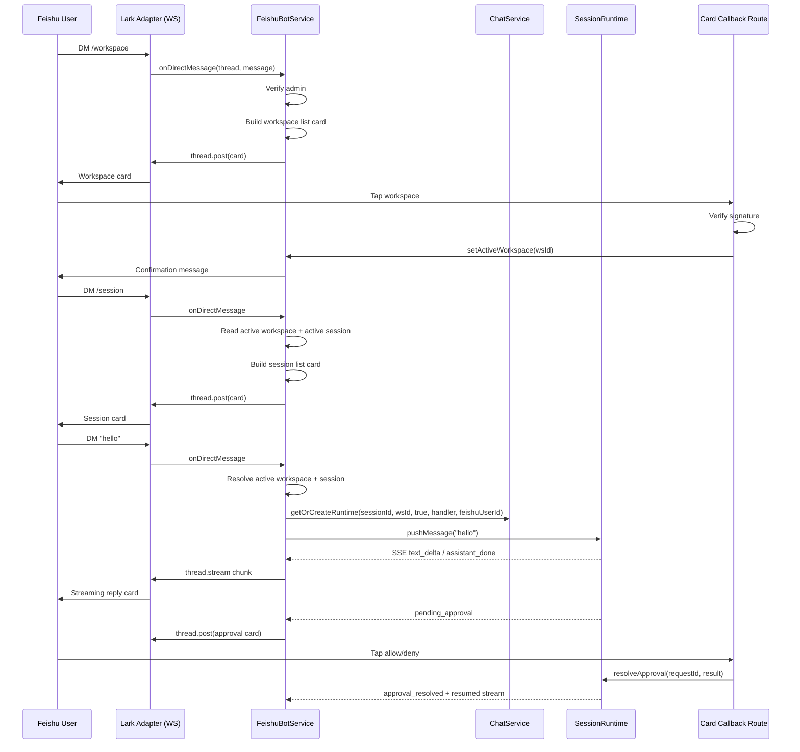

# Feishu/Lark Bot Integration

## Summary

Add a Feishu (Lark) direct-message bot channel to Comate. A configured Feishu app connects through the official `@larksuite/vercel-chat-adapter` and Vercel Chat SDK. Designated Feishu admin users can switch the bot's active workspace from inside Feishu with a `/workspace` card. Employees then list, select, or create their own sessions with a `/session` card, send messages that execute in the existing `SessionRuntime`, resolve tool-permission requests and `AskUserQuestion` prompts via interactive cards, and interrupt turns with `/stop`. The existing session runtime remains the execution brain; the Feishu adapter is only transport.

---

## Problem Frame

The organization mandates Feishu as the primary collaboration platform. Employees currently cannot operate Comate from Feishu, which forces them to open the desktop client to approve tools, answer questions, or interrupt a long turn. A Feishu bot channel lets employees stay in Feishu while using Comate's workspace sessions and agent runtime.

---

## Requirements

### Workspace binding

- R1. The active workspace's settings store a configurable list of Feishu user IDs that are allowed to switch the bot's active workspace.
- R2. An admin sending `/workspace` in a direct message receives an interactive card listing the Comate workspaces available for binding.
- R3. The workspace card shows enough information for the admin to identify each workspace, such as name and folder path.
- R4. Selecting a workspace from the card updates the bot's active workspace binding and confirms the switch to the admin.
- R5. After a switch, new employee messages are routed into the newly bound workspace; previously active sessions in the old workspace are left as-is.

### Session management

- R6. A user sending `/session` in a direct message receives an interactive card listing their existing sessions in the active workspace.
- R7. The session list card includes a control to create a new session.
- R8. Selecting a session sets it as the user's active session for subsequent messages in that workspace.
- R9. Creating a new session makes it the user's active session and returns a confirmation to the user.
- R10. Sessions are owned per Feishu user; one user cannot see another user's session list.

### Messaging

- R11. Text messages sent to the bot in a direct message are pushed into the user's active session in the active workspace.
- R12. The bot streams assistant output back to the Feishu user as a card message.
- R13. Tool-use progress and subagent progress may be rendered as lightweight status updates, but the primary output is the assistant's final response stream.

### Tool permissions and AskUserQuestion

- R14. When the agent requests tool permission, the bot surfaces an interactive card showing the tool name, title, and description, with allow and deny actions.
- R15. When the agent calls `AskUserQuestion`, the bot surfaces an interactive card showing each question, options, and multi-select state, with a submit action.
- R16. Resolving an approval or answering a question from Feishu feeds the result back into the active Comate session runtime and resumes the turn.
- R17. If a permission request or question times out, the bot notifies the user that the request expired.

### Interrupt

- R18. A user can interrupt an ongoing assistant turn from Feishu, for example via a `/stop` command or an interrupt button on the active message card.
- R19. Interrupting cancels the current turn and the bot confirms the interruption to the user.

### Bot lifecycle

- R20. The bot's Feishu credentials are stored in the workspace/bot settings and are not logged.
- R21. The server attempts to connect the Feishu bot on startup if the active workspace has credentials configured.
- R22. The server reports whether the Feishu bot is connected, disconnected, or not configured.

**Origin actors:** A1 (Feishu admin), A2 (Feishu employee), A3 (Comate server), A4 (Feishu adapter)

**Origin flows:** F1 (admin switches workspace), F2 (user lists/switches sessions), F3 (user sends chat message), F4 (tool permission request), F5 (AskUserQuestion), F6 (interrupt)

**Origin acceptance examples:** AE1 (admin workspace switch), AE2 (non-admin denied), AE3 (session list and selection), AE4 (tool permission denial), AE5 (AskUserQuestion with options), AE6 (interrupt while streaming)

---

## Scope Boundaries

### In scope

- Direct messages between a single Feishu user and the bot.
- Workspace binding switched by configured Feishu admin users.
- Per-user session selection and creation inside the active workspace.
- Chat turn execution through the existing `SessionRuntime`.
- Tool-permission and `AskUserQuestion` cards with allow/deny/submit actions.
- Interrupt via `/stop` command.

### Deferred for later

- Group-chat `@mention` support and multi-user group sessions.
- Feishu media, file, and voice message handling.
- Rendering rich tool output or task panels inside Feishu cards.
- Two-way sync of full session history; history is read on demand when `/session` is opened.
- Persistent state adapter for the Chat SDK beyond the provided in-memory adapter.

### Outside this product's identity

- Replacing the Comate desktop client or React UI with Feishu.
- Using Feishu as the primary workspace/session management surface for all users.

---

## Context & Research

### Relevant code and patterns

- `src/server/models/workspace.ts` — `WorkspaceSettings` is a JSON blob with optional nested fields; WeCom bot config and isolation settings already live there.
- `src/server/models/session.ts` — `ChatSession.source` is currently `'gui' | 'wecom'` and `CreateSessionInput.source` matches.
- `src/server/storage/sqlite-store.ts` — Schema is created with `CREATE TABLE IF NOT EXISTS` in the constructor; WeCom uses `wecom_user_sessions`, `wecom_user_id_mappings`, and `wecom_workspace_users` tables.
- `src/server/services/chat-service.ts` — `getOrCreateRuntime`, `pushMessage`, and `buildSdkOptions` already support bot sessions via `isBotSession` and a `botEventHandler` callback. Bot sessions reuse workspace tool-permission and isolation policy for WeCom.
- `src/server/services/session-runtime.ts` — `SessionRuntime` broadcasts every SSE event to `botEventHandlers`, supports `resolveApproval`, `interrupt`, and a timeout deny path.
- `src/server/services/wecom-bot-service.ts` and `src/server/services/wecom-stream-reply.ts` — Existing pattern for singleton bot service, session mapping, and SSE-to-channel streaming.
- `src/server/routes/chat.ts` — HTTP endpoints for resolving approvals/questions and interrupting a session.
- `src/server/routes/workspaces.ts` — `GET /api/workspaces/:id/bot/status` returns WeCom bot status; workspace update triggers connect/disconnect.
- `src/server/index.ts` — Initializes WeCom bot service after `server.listen()` and disconnects on shutdown.
- `src/client/components/SettingsPanel.tsx` — Workspace settings use a two-column layout with section tabs, dirty-state tracking, and a WeCom Bot section with sub-tabs. The section tab type is `WorkspaceSection`.
- `src/client/i18n/en/settings.json` and `src/client/i18n/zh-CN/settings.json` — Translation keys for the settings UI.

### External references

- Feishu official integration guide: [Vercel Chat SDK + Lark message publish](https://open.feishu.cn/document/mcp_open_tools/integrating-agents-with-feishu/vercel-chat-sdk-lark-message-publish)
- Chat SDK Lark adapter reference: [chat-sdk.dev/adapters/vendor-official/lark](https://chat-sdk.dev/adapters/vendor-official/lark)
- Lark card callback handling: [open.larksuite.com document](https://open.larksuite.com/document/uAjLw4CM/ukzMukzMukzM/feishu-cards/handle-card-callbacks)

### Research findings

- The Vercel Chat SDK core package is `chat`; the Lark adapter is `@larksuite/vercel-chat-adapter`; the in-memory state adapter is `@chat-adapter/state-memory`.
- The adapter still requires the `ai` peer dependency even when not using Vercel AI SDK models.
- The adapter is WebSocket-only; `handleWebhook()` returns HTTP 501. Incoming direct messages use `bot.onDirectMessage` (and occasionally `bot.onNewMention` for the first DM after restart).
- Outbound replies use `thread.post(text)` for plain text and `thread.stream(controller => ...)` for streaming card output via Lark cardkit typewriter.
- Interactive card actions are delivered through Feishu's card callback HTTP channel, not through the Chat SDK adapter, so card callbacks must be handled by a dedicated Express route using `@larksuiteoapi/node-sdk` `CardActionHandler` with signature verification.
- "Lark" is Feishu's international brand; the SDK packages use `lark`/`larksuite` in their names while the product-facing feature is called Feishu. The two terms refer to the same platform in this document.

---

## Key Technical Decisions

- **Use `@larksuite/vercel-chat-adapter` + `chat` + `@chat-adapter/state-memory` as the transport shim.** This matches the Feishu documented integration path and provides message normalization, WebSocket connection, and streaming card output without building a Feishu protocol handler from scratch. A native Feishu webhook implementation was considered, but the Chat SDK's `thread.stream()` typewriter streaming for card output is the documented way to produce streamed replies in Feishu; rebuilding that on raw webhooks would duplicate SDK logic.
- **Keep `SessionRuntime` as the execution brain.** The adapter only handles the channel; message execution, tool approvals, `AskUserQuestion`, and interrupts still flow through Comate's runtime, reusing the same patterns as the React client and WeCom bot.
- **Global active workspace binding persisted in SQLite.** A single `feishu_bot_binding` table stores one row with the active `workspaceId`. Admin `/workspace` selection updates this row. On startup the server connects using the active workspace's credentials. This preserves the documented 1:1 bot-to-workspace model while allowing reconfiguration from Feishu. This design assumes a single Feishu bot instance per Comate server; multi-tenant or multi-org topologies would require a separate binding model.
- **Sessions are per Feishu user and must be explicitly chosen.** If a user sends a plain message without an active session, the bot replies with instructions to run `/session` first. This honors the origin requirement that the bot does not auto-create a single session per user.
- **Reuse the existing workspace `wecomToolPermissions` and `wecomBotIsolation` fields for Feishu bot sessions.** Renaming these fields would require a migration and UI churn beyond v1 scope. The same category-based tool policy, bash whitelist, skill isolation, and admin-user list therefore apply to all bot sessions in a workspace. Feishu user IDs must be used as the identity key for Feishu sessions; if an admin wants a Feishu user to bypass bash whitelisting, that Feishu ID must be listed in the existing admin-user field. The `feishuAdminUserIds` list is separate because Feishu and WeCom admin identities are disjoint.
- **Serialize inbound direct messages per Feishu user.** A lightweight per-user promise queue in `FeishuBotService` ensures that a second message waits for the current turn to finish before it is pushed into the runtime. A turn is considered finished when the runtime emits `assistant_done`, `interrupted`, `result`, or `error_note`; pending approvals or questions do not block the queue because the user may still issue `/stop` or `/session` commands.
- **Card callbacks are served by a dedicated Express route.** Because the Chat SDK adapter does not expose card action handling, `POST /api/feishu/card` uses `@larksuiteoapi/node-sdk` `CardActionHandler` configured with the active workspace binding's `feishuEncryptKey` and `feishuVerificationToken`. The action payload carries the target `workspaceId` so the handler can route the action to the correct workspace after signature verification.
- **Timeout notification is bridged through a new SSE event.** `SessionRuntime.timeoutDeny` emits an `approval_timeout` event before resolving the approval with deny. The Feishu stream reply handler translates this into a Feishu message. The GUI SSE consumer must tolerate unknown event types without crashing; this should be verified explicitly.

---

## High-Level Technical Design

> This diagram illustrates the intended flow; it is directional guidance for review, not an implementation specification.

- `FeishuBotService` owns the single `Chat` instance and the active workspace binding.
- Each inbound DM is dispatched to a command handler or the chat handler.
- Chat turns register a `FeishuStreamReply` bot event handler that writes to `thread.stream` and posts separate approval/question cards.
- Card callbacks are resolved through a dedicated Express route that calls `runtime.resolveApproval` or updates workspace/session state.

---

## Implementation Units

### U1. Workspace model and settings UI for Feishu bot credentials

**Goal:** Add Feishu configuration fields to the workspace settings and expose them in a new Feishu Bot section.

**Requirements:** R1, R20, R22

**Dependencies:** None

**Files:**
- Modify: `src/server/models/workspace.ts`
- Modify: `src/client/components/SettingsPanel.tsx`
- Modify: `src/client/i18n/en/settings.json`
- Modify: `src/client/i18n/zh-CN/settings.json`
- Test: `src/client/components/SettingsPanel.test.tsx` (extend existing tests if present; otherwise create)

**Approach:**
- Extend `WorkspaceSettings` with `feishuAppId`, `feishuAppSecret`, `feishuEncryptKey`, `feishuVerificationToken`, `feishuBotEnabled`, and `feishuAdminUserIds`.
- Add `'feishu'` to `WorkspaceSection` and a `FeishuBotSection` component modeled on `WeComBotSection`.
- The Feishu section shows connection fields, an enable toggle, an admin-user list, and a status indicator fetched from `GET /api/workspaces/:id/feishu/status`.
- Include Feishu fields in `WorkspaceFormState` and `buildWorkspaceFormState`; persist them through `updateWorkspace`.
- Add translation keys under `settings.feishu.*` for both English and Simplified Chinese.

**Patterns to follow:**
- Existing `WeComBotSection` sub-tab and connection-form pattern.
- Existing dirty-state tracking with `snapshotRef` and deep comparison.

**Test scenarios:**
- Admin opens workspace settings, navigates to Feishu Bot, enters credentials and an admin list, saves, and the fields round-trip.
- Status indicator updates after save when the service attempts connection.
- Unsaved changes trigger the confirmation dialog on close.

**Verification:**
- `WorkspaceSettings` round-trips through the store.
- The settings UI exposes all Feishu fields and persists them on Save.

---

### U2. SQLite schema and store methods for Feishu state

**Goal:** Persist the global active workspace binding, per-user session ownership, and per-user active session selection.

**Requirements:** R4, R8, R9, R10

**Dependencies:** U1

**Files:**
- Modify: `src/server/storage/sqlite-store.ts`
- Test: `src/server/storage/sqlite-store.test.ts` (extend or create)

**Approach:**
- Add `feishu_bot_binding` table with a single row (`id INTEGER PRIMARY KEY CHECK (id=1), activeWorkspaceId TEXT NOT NULL`).
- Add `feishu_user_sessions` table (`workspaceId`, `feishuUserId`, `sessionId`, `createdAt`, `updatedAt`) with primary key `(workspaceId, feishuUserId, sessionId)`.
- Add `feishu_active_sessions` table (`workspaceId`, `feishuUserId`, `sessionId`, `updatedAt`) with primary key `(workspaceId, feishuUserId)`.
- Add store methods: `getFeishuActiveWorkspace`, `setFeishuActiveWorkspace`, `getFeishuActiveSession`, `setFeishuActiveSession`, `getFeishuSessionOwner` (verify a session belongs to a user), `listFeishuSessionsByUser`, `addFeishuUserSession`, and cleanup in `delete()`.
- When listing Feishu sessions for a user, join against the `sessions` table and silently drop orphaned mappings whose session has been deleted. If the user's active session was orphaned, clear the active session row.

**Patterns to follow:**
- Existing WeCom table shapes and method naming.
- Existing `CREATE TABLE IF NOT EXISTS` schema management.

**Test scenarios:**
- Set active workspace, read it back, replace it.
- Add sessions for two Feishu users in the same workspace; each user's list is isolated.
- Set active session; read it back; switching updates the row.
- Deleting a workspace removes Feishu binding, user sessions, and active-session rows.

**Verification:**
- Store methods round-trip and enforce per-user isolation.

---

### U3. Feishu bot service adapter lifecycle and direct-message routing

**Goal:** Manage the Chat SDK instance, active workspace binding, and inbound DM command routing.

**Requirements:** R1, R2, R3, R5, R6, R7, R11, R18, R21

**Dependencies:** U2

**Files:**
- Create: `src/server/services/feishu-bot-service.ts`
- Create: `src/server/services/feishu-card-builder.ts`
- Test: `src/server/services/feishu-bot-service.test.ts`

**Approach:**
- Implement `FeishuBotService` as a singleton.
- `initialize()` reads the active workspace from the store; if credentials are present, constructs `Chat` with `createLarkAdapter({ appId, appSecret })`, registers `onDirectMessage` and `onNewMention` handlers, and calls `bot.initialize()`.
- `connect(workspaceId)` updates the active binding and re-initializes the adapter with that workspace's credentials.
- `disconnect()` shuts down the adapter and clears the in-memory connection.
- `getStatus(workspaceId)` returns `not_configured`, `connecting`, `connected`, `disconnected`, or `error` for the requested workspace.
- Inbound DM dispatch:
  - `/workspace` → verify sender is in `feishuAdminUserIds` for the active workspace; post workspace-list card.
  - `/session` → verify active workspace and session ownership; post session-list card.
  - `/stop` → interrupt the user's active runtime if it is processing; the runtime's `interrupted` event is translated into a confirmation message by the active `FeishuStreamReply` handler (U4).
  - Plain text → if active session exists, push into runtime; otherwise reply with a prompt to run `/session`.
- Serialize plain-text and `/stop` handling per Feishu user with a lightweight promise queue. A turn is "finished" when the runtime emits `assistant_done`, `interrupted`, `result`, or `error_note`; pending approvals/questions do not block the queue because the user may still issue `/stop` or `/session` commands.
- Register the same handler on `onNewMention` to work around the adapter's first-DM routing quirk; ignore true group mentions by checking the thread is a DM.

**Patterns to follow:**
- `WeComBotService` singleton and `initialize`/`connect`/`disconnect`/`getStatus` shape.
- Per-workspace status endpoint pattern from `src/server/routes/workspaces.ts`.

**Test scenarios:**
- Admin runs `/workspace` and receives a card listing workspaces.
- Non-admin runs `/workspace` and receives an unauthorized message.
- User runs `/session` and sees only their own sessions.
- User sends plain text without an active session and is prompted to run `/session`.
- User sends `/stop` while a turn is processing and the runtime interrupts.

**Verification:**
- The service initializes, connects, and disconnects without crashing the server.
- Commands route to the correct handler and produce a Feishu response.

---

### U4. Session runtime integration and streaming reply

**Goal:** Push Feishu user messages into `SessionRuntime`, stream assistant replies back to Feishu, and surface approval/question cards.

**Requirements:** R11, R12, R13, R14, R15, R17, R19

**Dependencies:** U2, U3

**Files:**
- Create: `src/server/services/feishu-stream-reply.ts`
- Modify: `src/server/services/chat-service.ts`
- Modify: `src/server/services/session-runtime.ts`
- Modify: `src/server/types/message.ts`
- Modify: `src/client/types/message.ts` (keep byte-identical to server copy)
- Test: `src/server/services/feishu-stream-reply.test.ts`

**Approach:**
- Add a `FeishuStreamReply` class similar to `WeComStreamReply`. It receives SSE events from the runtime and writes text chunks to `thread.stream()`. It starts with a placeholder, debounces flushes, and finalizes on `assistant_done`, `interrupted`, `result`, or `error_note`.
- On `pending_approval`, post an interactive approval card to the same thread and track the request.
- On `pending_question`, post an interactive question card.
- On `approval_timeout`, post a message that the request expired.
- Extend `SseEvent` with `{ type: 'approval_timeout'; requestId: string }` in both server and client message types.
- In `SessionRuntime.timeoutDeny`, emit `approval_timeout` before resolving the approval with deny.
- Extend `ChatService.getOrCreateRuntime` and `pushMessage` with an optional `botUserId` parameter so Feishu sessions pass the Feishu open ID directly into `buildSdkOptions`. `buildSdkOptions` uses this identity for path/bash/skill isolation and falls back to the existing WeCom mapping lookup for backward compatibility.
- Add `'feishu'` to `ChatSession.source` and `CreateSessionInput.source`.

**Patterns to follow:**
- `WeComStreamReply` debounce/placeholder/finalize pattern.
- `SessionRuntime` bot event handler registration and cleanup.

**Test scenarios:**
- A user message produces a streaming card that ends with the assistant's full reply.
- A pending approval event causes an approval card to be posted.
- Tapping allow/deny on the approval card resolves the request and the turn resumes.
- A pending question event causes a question card; submitting answers resumes the turn.
- An approval timeout emits `approval_timeout` and the user receives an expiration message.
- The GUI SSE consumer tolerates the `approval_timeout` event without crashing or logging errors when a Feishu session is also open in the desktop client.

**Verification:**
- `FeishuStreamReply` consumes SSE events and produces a Lark stream without errors.
- Runtime policy isolation is applied using the Feishu user identity.

---

### U5. Card callback route and action resolution

**Goal:** Receive Feishu interactive card actions securely, route them to the correct workspace/session/runtime operation, and return appropriate toasts or updated cards.

**Requirements:** R4, R8, R9, R16, R18

**Dependencies:** U2, U3, U4

**Files:**
- Create: `src/server/routes/feishu-card.ts`
- Create: `src/server/services/feishu-card-action-handler.ts`
- Modify: `src/server/index.ts`
- Test: `src/server/routes/feishu-card.test.ts`

**Approach:**
- Add `/api/feishu/card` mounted before the global `express.json()` middleware so the `@larksuiteoapi/node-sdk` handler can read the raw request body for signature verification. The active Feishu workspace binding's credentials are used for verification, so the configured callback URL does not need a workspace segment.
- Use `CardActionHandler` from `@larksuiteoapi/node-sdk`, configured with the active workspace's `feishuEncryptKey` and `feishuVerificationToken`. Verify the workspace still exists and has `feishuBotEnabled` before processing the action. Parse `action.value` when Feishu delivers it as a JSON string instead of an object.
- The action `value` carries a typed payload such as `{ action: 'workspace_select', workspaceId }`, `{ action: 'session_select', workspaceId, sessionId }`, `{ action: 'session_create', workspaceId }`, `{ action: 'approval', workspaceId, sessionId, requestId, behavior }`, or `{ action: 'question', workspaceId, sessionId, requestId, answers }`.
- Validate the action user against the resource owner: only the Feishu user who owns the session can resolve its approvals or select its sessions; only admins can switch workspace. Look up ownership in `feishu_user_sessions` before resolving approvals or session selections.
- Deduplicate repeated taps using a short-lived in-memory set keyed by `open_message_id` and action hash. Add basic per-Feishu-user rate limiting to prevent abuse of approvals, session switches, and workspace binding changes.
- Return a toast on success; for approvals/questions, the runtime's resumed stream carries the actual response.

**Patterns to follow:**
- Existing Express route error handling (`console.error` + JSON error).
- Existing `runtime.resolveApproval` payload shape from `src/server/routes/chat.ts`.

**Test scenarios:**
- Valid card signature is accepted; invalid signature is rejected with 401.
- Workspace select updates the active binding and returns a success toast.
- Session select updates the user's active session.
- Approval allow/deny resolves the pending runtime request.
- Question submit resolves with the selected answers.
- A callback from a Feishu user who does not own the session is rejected with 403.
- Rapid repeated taps are rate-limited or deduplicated.
- Duplicate taps are ignored.

**Verification:**
- The callback route verifies signatures and routes actions without exposing internal errors.
- Runtime state updates after each action.

---

### U6. Server lifecycle wiring and status API

**Goal:** Connect the Feishu bot service to server startup, shutdown, and workspace updates, and expose a status endpoint.

**Requirements:** R21, R22

**Dependencies:** U3

**Files:**
- Modify: `src/server/index.ts`
- Modify: `src/server/routes/workspaces.ts`
- Test: `src/server/routes/workspaces.test.ts` (extend)

**Approach:**
- In `src/server/index.ts`, after `server.listen()`, call `feishuBotService.initialize()` and register shutdown cleanup.
- Add `GET /api/workspaces/:id/feishu/status` returning the Feishu bot status for the workspace. The endpoint returns `not_configured` when the workspace is not the active binding or lacks credentials; otherwise it returns `connecting`, `connected`, `disconnected`, or `error` from the adapter state.
- In `PUT /api/workspaces/:id`, after updating settings, call `feishuBotService.reconnectIfActive(workspace.id)` so credential or enable changes take effect if the workspace is the active binding. Enforce workspace-admin authorization when mutating `feishuAdminUserIds` or credential fields.
- On workspace deletion, clear the active binding if the deleted workspace was active, and validate on every inbound message/card action that the active workspace still exists and has `feishuBotEnabled` set; if not, clear the binding and reply with a configuration error.

**Patterns to follow:**
- WeCom bot service initialization and shutdown pattern in `src/server/index.ts`.
- Existing workspace status route pattern.

**Test scenarios:**
- Server starts with an active workspace that has credentials; the bot connects.
- Disabling the bot or clearing credentials on the active workspace disconnects it.
- Status endpoint returns `not_configured` when no active workspace exists.
- Graceful shutdown closes the Feishu adapter.

**Verification:**
- Startup, dynamic reconnect, and shutdown all leave the adapter in the expected state.

---

### U7. Session source tracking and GUI badge

**Goal:** Feishu-created sessions are visible in the GUI session list with a Feishu badge and can be opened normally.

**Requirements:** R10 (presentation isolation), R12 visibility

**Dependencies:** U2, U4

**Files:**
- Modify: `src/server/services/chat-service.ts`
- Modify: `src/server/storage/sqlite-store.ts`
- Modify: `src/client/components/SessionList.tsx`
- Modify: `src/client/i18n/en/settings.json`
- Modify: `src/client/i18n/zh-CN/settings.json`
- Test: `src/client/components/SessionList.test.tsx` (extend)

**Approach:**
- When `FeishuBotService` creates a session, pass `source: 'feishu'` to `chatService.createSession` and store the mapping in `feishu_user_sessions`.
- In `ChatService.listSessions`, join `feishu_user_sessions` and set `source = 'feishu'` for mapped sessions.
- In `SessionList.tsx`, render a Feishu badge for sessions where `source === 'feishu'`.
- Add translation keys for the badge tooltip.

**Patterns to follow:**
- Existing WeCom session source handling in `ChatService.listSessions`.
- Existing draft/WeCom badge rendering in `SessionList.tsx`.

**Test scenarios:**
- A Feishu-created session appears in the session list with a Feishu badge.
- A GUI-created session has no Feishu badge.
- Clicking a Feishu session opens it and loads messages correctly.

**Verification:**
- Feishu sessions are distinguishable in the GUI and behave like normal sessions.

---

## System-Wide Impact

- **Interaction graph:** `FeishuBotService` calls `ChatService`, `SqliteStore`, and the Chat SDK adapter. `ChatService` gains a `botUserId` parameter for bot identity. `SessionRuntime` gains an `approval_timeout` SSE event. A new `feishu-card.ts` route resolves actions into `SessionRuntime` or `FeishuBotService`.
- **Error propagation:** Feishu connection errors are logged and surfaced via the status API; they do not crash the server. Inbound message handling errors are caught and logged; a brief error message is sent to the Feishu user when possible.
- **State lifecycle risks:** If a Feishu session is deleted via the GUI, the `feishu_user_sessions` mapping becomes orphaned. The next `/session` call should list only existing sessions; if the active session was deleted, prompt the user to select or create another.
- **API surface parity:** New endpoints are `GET /api/workspaces/:id/feishu/status` and `POST /api/feishu/card`. Existing workspace CRUD, session CRUD, SSE, approval, and interrupt endpoints are unchanged.
- **Cross-layer coverage:** Scenarios that unit tests alone cannot prove:
  - A GUI user opens a Feishu session while the bot is streaming a response — both observe the same runtime events.
  - Server restart reconnects the bot and resumes the active workspace binding.
  - A card action resolves an approval that originated in a streaming turn.
- **Unchanged invariants:**
  - The SSE streaming protocol and event types are extended only with `approval_timeout`; no existing events change shape.
  - GUI session creation and messaging behavior is unchanged.
  - Workspace settings persistence format remains additive within the JSON settings blob.

---

## Risks & Dependencies

| Risk | Mitigation |
|------|------------|
| The Chat SDK packages (`chat`, `@larksuite/vercel-chat-adapter`, `@chat-adapter/state-memory`, `ai`, `@larksuiteoapi/node-sdk`) are not yet installed | Add them to `package.json`, verify `ai` peer constraints, and run `npm install` before implementation. |
| The Chat SDK adapter's first-DM routing quirk sends a direct message through `onNewMention` | Register the same dispatch handler on both `onDirectMessage` and `onNewMention`; ignore non-DM mentions; log inbound message source for observability. |
| Card callbacks require a publicly reachable callback URL while the app runs as a desktop sidecar | Document that the card callback URL must point to the local server URL (`http://localhost:<port>/api/feishu/card`) and that Feishu must be able to reach it (e.g., via a tunnel in development or the deployed endpoint in production). |
| `@larksuiteoapi/node-sdk` signature verification requires raw body; global `express.json()` would break it | Mount `/api/feishu/card` before the global JSON middleware or use route-specific raw-body middleware. |
| `ai` peer dependency is required even though Vercel AI SDK models are not used | Install `ai` alongside the Chat SDK packages. |
| Reusing `wecomToolPermissions`/`wecomBotIsolation` for Feishu is semantically confusing | Document that v1 applies the same workspace bot policy to all bot channels; add cross-reference labels in the Feishu settings UI; plan a v1.1 migration to generic `botToolPermissions`/`botIsolation` names. |
| In-memory Chat SDK state is lost on restart | Acceptable for v1; dedupe/locks only need to survive process lifetime. A persistent state adapter can be introduced later. |
| Credential exposure via workspace API | Strip `feishuAppSecret`, `feishuEncryptKey`, and `feishuVerificationToken` from `GET /api/workspaces/:id` responses unless the caller is a workspace admin. Require workspace-admin authorization for mutations to credential and admin-list fields. |
| Cross-user approval resolution via missing session ownership check | Enforce `feishu_user_sessions` ownership lookup before every `resolveApproval`/`resolveQuestion` in the card callback handler. |
| Dangling global binding after workspace deletion or disable | Validate the active workspace exists and is enabled on every inbound message and card action; clear the binding atomically on workspace delete/disable. |
| No audit trail for security-relevant actions | Add structured `diagLog` entries for workspace switches, credential changes, admin-list mutations, session binding changes, and approval resolutions. |

---

## Documentation / Operational Notes

- Feishu app setup:
  - Create a Feishu custom bot app and obtain `App ID`, `App Secret`, `Encrypt Key`, and `Verification Token`.
  - Set the card callback request URL to the server's `/api/feishu/card` endpoint.
  - Grant the app permissions for direct messaging and interactive cards.
- In Comate workspace settings, open the Feishu Bot section, enter the four credentials, enable the bot, and list the Feishu user IDs that are allowed to switch workspace.
- The active workspace binding is global. After the admin switches workspace from Feishu, all subsequent employee DMs operate in the new workspace until switched again.
- Feishu bot sessions follow the workspace's tool-permission policy and bot-isolation settings configured in the WeCom Bot > Permissions/Isolation tabs.
- If an approval or question times out, the user receives a message that the request expired and the turn continues with a denial.

---

## Sources & References

- **Origin document:** [docs/brainstorms/2026-06-21-feishu-lark-integration-requirements.md](docs/brainstorms/2026-06-21-feishu-lark-integration-requirements.md)
- **Grounding dossier:** `docs/brainstorms/2026-06-21-feishu-lark-integration-requirements.md` and manual research on `src/server/services/wecom-bot-service.ts`, `src/server/services/chat-service.ts`, `src/server/services/session-runtime.ts`, `src/server/storage/sqlite-store.ts`, `src/server/routes/chat.ts`, `src/server/routes/workspaces.ts`, and `src/client/components/SettingsPanel.tsx`.
- **External docs:**
  - [Feishu Vercel Chat SDK integration guide](https://open.feishu.cn/document/mcp_open_tools/integrating-agents-with-feishu/vercel-chat-sdk-lark-message-publish)
  - [Chat SDK Lark adapter reference](https://chat-sdk.dev/adapters/vendor-official/lark)
  - [Lark card callback handling](https://open.larksuite.com/document/uAjLw4CM/ukzMukzMukzM/feishu-cards/handle-card-callbacks)
