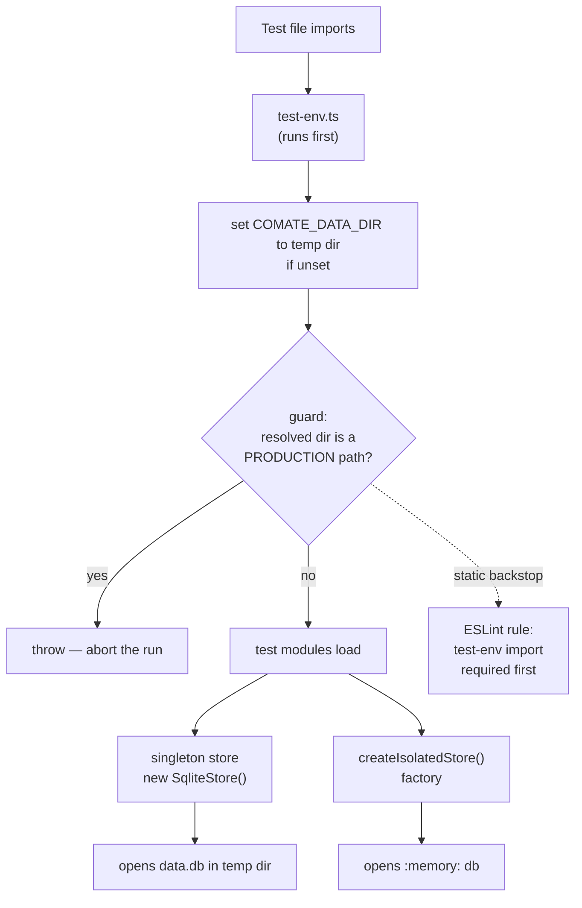

# Harden SQLite Test Database Isolation

## Summary

Server tests already avoid the production `data.db` (commit `1ac95f4` redirected every non-vendor server test via `src/server/test-utils/test-env.ts` and gave `SqliteStore` an optional `dbPath`). This plan hardens that pattern so it cannot regress: an enforced runtime guard, hermetic in-memory stores, a public reset hook to retire fragile private-`db` casts, a lint rule, a `test:server` script with CI, and a doc refresh.

## Problem Frame

A backend test deleting rows in `beforeEach` once destroyed real user data because `SqliteStore` opened `~/.comate/data.db` (or the Tauri app-support path) by default. The fix in `1ac95f4` works today — all 39 non-vendor server tests import `test-env.js` first, so the singleton resolves to a temp path — but the safety rests on one load-bearing assumption: **that every test imports `test-env.js` before anything that constructs the singleton, and nothing enforces it.** A new test file that forgets the import, or a future module that constructs `SqliteStore()` at import time, silently reintroduces the hazard. There is no lint rule, no `test:server` script, and no CI test job to catch a regression, so the isolation is currently "correct by manual discipline" rather than "correct by invariant." Separately, several tests reach into the private `db` field via a `as unknown as { db }` cast, which depends on TypeScript not enforcing `private` across files.

## Requirements

**Isolation invariants**

- R1. No server test opens or mutates the production SQLite database — `data.db` under the prod data dir (`~/Library/Application Support/com.comate.app/`, or `~/.comate` as fallback) — under any execution path.
- R2. A test that omits the isolation setup fails loudly at runtime rather than silently touching production data.
- R3. No test reaches into the private `db` field of `SqliteStore` via a type cast.

**Test ergonomics**

- R4. Isolated stores can be in-memory, giving hermetic and fast unit tests with no temp-file cleanup.

**Automation and discoverability**

- R5. Server tests run via a documented npm script and in CI, so isolation (and the tests themselves) are exercised automatically on every change.
- R6. The isolation convention is documented accurately in the convention doc and `CLAUDE.md`, covering the `test-env` helper, the `dbPath` constructor argument, the guard, and the in-memory option.

## Key Technical Decisions

- **Primary enforcement is a runtime guard, not a lint rule.** The single point of failure is import ordering, which a static rule can nudge but a developer can bypass (disable, misorder, or add a new test that imports a service before `test-env`). A runtime assertion in `test-env.ts` that fails the run when the resolved storage dir matches a production path is foolproof and fires regardless of runner. The ESLint rule (U4) is defense-in-depth, not the main defense.
- **Default new/converted unit tests to in-memory (`:memory:`) SQLite; keep temp-file where it already works.** In-memory stores are faster, fully hermetic, and need no cleanup; the unconditional `PRAGMA journal_mode = WAL` no-ops harmlessly on `:memory:`. Route/service tests that already run isolated via the redirected singleton are left on the temp file to avoid needless churn.
- **Expose a public test reset hook rather than the private `db` or full dependency injection.** A `resetData()` (or `clearAllTables()`) method retires the private-field casts with minimal API surface. Full DI of the store into all 21 services/routes is a larger refactor and is out of scope — the singleton-plus-redirect is already safe.
- **Keep the `test-env`-redirected singleton for route/service tests.** Those tests stub-and-restore singleton methods; converting them all to injected in-memory stores is scope creep. Only the tests that cast into `db` migrate.

## High-Level Technical Design

A server test can reach the SQLite file through several module-level paths; the guards sit at the points where a production path could be chosen.

Two independent layers: the runtime guard in `test-env.ts` (fires on every server test run because every test imports it), and the ESLint rule (catches the missing-import mistake statically before the run).

---

## Implementation Units

### U1. In-memory SQLite support and a public test reset hook on SqliteStore

- **Goal:** Give `SqliteStore` a hermetic in-memory option and a public method that clears all tables, so tests never need to cast into the private `db`.
- **Requirements:** R3, R4.
- **Dependencies:** none.
- **Files:**
  - `src/server/storage/sqlite-store.ts` (constructor + new method)
  - `src/server/storage/sqlite-store.test.ts` (coverage for both)
- **Approach:** The constructor already takes `dbPath?: string`; accept the `:memory:` sentinel (or a small options object) and open the `Database` against it, skipping any path-`ensureDir` work that is meaningless for memory DBs. Add a public `resetData()` that runs `DELETE FROM` across every known table inside a transaction — the same set the cascade-on-`delete()` touches, plus analytics cache — so tests can clean state without touching `db`.
- **Patterns to follow:** Mirror the existing `delete()` workspace-cascade table list so `resetData()` stays in sync with the real table set.
- **Test scenarios:**
  - *Happy path:* an in-memory `SqliteStore` round-trips a workspace create→get→delete and returns the same results as the file-backed store.
  - *Happy path:* `resetData()` removes rows inserted across workspaces, sessions, todos, proactive messages, prompt history, and Feishu tables.
  - *Edge case:* `resetData()` on a freshly constructed (empty) store completes without error.
  - *Edge case:* in-memory construction does not create any files on disk and the WAL pragma applies without throwing.
- **Verification:** `sqlite-store.test.ts` passes against an in-memory store and exercises `resetData()` for each table family.

### U2. Runtime guard and an isolated-store factory in test-utils

- **Goal:** Make isolation enforced, not best-effort, and give tests a one-call way to obtain a hermetic store.
- **Requirements:** R1, R2, R4.
- **Dependencies:** U1 (in-memory option for the factory).
- **Files:**
  - `src/server/test-utils/test-env.ts` (add the production-path assertion)
  - `src/server/test-utils/test-store.ts` (new factory)
- **Approach:** In `test-env.ts`, after assigning `COMATE_DATA_DIR`, call `getStorageDir()` and assert the result is not one of the known production roots — the Tauri app-support dir and the bare `~/.comate` fallback — throwing a clear error naming the offending path if it is. Add `src/server/test-utils/test-store.ts` exporting `createIsolatedStore()` that returns a fresh `SqliteStore` (in-memory by default, optional temp-file override) plus a `withIsolatedStore(testFn)` wrapper handling construction and teardown.
- **Patterns to follow:** Reuse `getStorageDir()` from `src/server/storage/data-dir.ts` rather than re-resolving paths, so the guard sees exactly what the singleton sees.
- **Test scenarios:**
  - *Happy path:* `createIsolatedStore()` returns a store that round-trips data with no file artifacts left behind.
  - *Error path:* when `COMATE_DATA_DIR` is forced to the prod app-support path or `~/.comate`, importing `test-env.ts` throws an error that names the production path.
  - *Error path:* the guard fires even when the env var is pre-set to a production value (it does not silently trust a pre-set var).
  - *Edge case:* `getStorageDir()` resolving to the temp dir the helper itself created passes the guard.
- **Verification:** A dedicated guard test forces prod paths and asserts the throw; the factory test confirms hermetic isolation.

### U3. Migrate fragile tests off the private `db` cast

- **Goal:** Remove every `as unknown as { db: ... }` cast so tests use the public API.
- **Requirements:** R3.
- **Dependencies:** U1 (`resetData()`), U2 (factory where a fresh store is cleaner than truncation).
- **Files:**
  - `src/server/services/feishu-bot-service.test.ts`
  - `src/server/services/feishu-user-resolver.test.ts`
  - `src/server/routes/workspaces-feishu.test.ts`
  - `src/server/storage/sqlite-store.test.ts`
- **Approach:** Replace `db.prepare('DELETE FROM ...')` cleanup blocks with `store.resetData()` (or a scoped variant) and replace inline `db.prepare('INSERT ...')` seeding with the store's public mutators where one exists; where a test must seed a row shape the public API cannot express, prefer `createIsolatedStore()` plus a thin documented test helper over reaching into `db`. The gold-standard `sqlite-store.test.ts` casts in every `beforeEach`; migrate them all to `resetData()`.
- **Patterns to follow:** Keep the existing stub-and-restore structure of route/service tests; only swap the data-access mechanism.
- **Test scenarios:**
  - *Regression:* each migrated test passes unchanged in behavior (same assertions, same outcomes).
  - *Regression:* a repo-wide search for the private-`db` cast (`as unknown as { db`) and the direct access pattern (`.db?.prepare`) returns zero hits after migration.
  - *Edge case:* tests that previously seeded via raw `INSERT` still assert the same observable state through the public read API.
- **Verification:** All four suites pass; `grep` for both the `as unknown as { db` cast and the direct `.db?.prepare` access returns zero hits; no behavioral assertion changed.

### U4. ESLint static guard: require the test-env import first in server tests

- **Goal:** Catch a missing or misordered `test-env` import before the run even starts.
- **Requirements:** R2.
- **Dependencies:** none (independent of U1–U3).
- **Files:**
  - `.eslintrc.cjs` (new rule scoped to `src/server/**/*.test.ts`)
  - fixture(s) exercising the rule, where the lint plugin test conventions require them
- **Approach:** Add an `@typescript-eslint` `no-restricted-syntax` / `no-restricted-imports` combination (or `eslint-plugin-import` `first` + an assertion that the first import is `test-env.js`) scoped to server test files, excluding vendored tests under `src/server/vendor/`. The rule is a backstop; the runtime guard (U2) is authoritative.
- **Patterns to follow:** Match the existing flat `.eslintrc.cjs` style and the `ignorePatterns` already excluding `src/server/vendor/`.
- **Test scenarios:**
  - *Happy path:* a server test file beginning with the `test-env` import lints clean.
  - *Error path:* a server test file missing the `test-env` import is flagged with an actionable message.
  - *Edge case:* vendored tests under `src/server/vendor/` are not flagged.
- **Verification:** `npm run lint` passes on the real test files and flags a deliberately broken fixture.

### U5. `test:server` npm script and a CI test job

- **Goal:** Make server tests — and therefore the isolation guard — run automatically.
- **Requirements:** R1, R2, R5.
- **Dependencies:** none (independent; benefits from U2 existing so the guard runs in CI too).
- **Files:**
  - `package.json` (new `test:server` script)
  - `.github/workflows/ci.yml` (new) or an extension of the existing workflow
- **Approach:** Add `"test:server": "tsx --test \"src/server/**/*.test.ts\" --exclude \"src/server/vendor/**\""` (final glob/flags tuned during implementation). Add a CI workflow (or a job in the existing one) that installs deps, rebuilds the native binding if needed, and runs `test:server` (and optionally `test:client`) on pull requests.
- **Patterns to follow:** Mirror the repo's existing GitHub Actions workflow structure.
- **Test scenarios:**
  - *Happy path:* `npm run test:server` discovers and runs every non-vendor server test file and exits 0 on green.
  - *Error path:* a failing server test causes `npm run test:server` to exit non-zero.
  - *Integration:* the CI job runs the same command and fails the build on a failing test, including when the U2 guard trips.
- **Verification:** The script runs locally; a pushed PR with a deliberately failing test turns the CI job red.

### U6. Documentation refresh: convention doc and CLAUDE.md testing section

- **Goal:** Close the doc-vs-code gap so the written convention matches the hardened pattern.
- **Requirements:** R6.
- **Dependencies:** U1–U5 (document what shipped).
- **Files:**
  - `docs/solutions/conventions/use-isolated-test-database-for-comate.md`
  - `CLAUDE.md` (Testing subsection)
- **Approach:** Update the convention doc to reflect the `test-env.ts` helper, the `dbPath` constructor argument, the in-memory option, the runtime guard, the `createIsolatedStore()` factory, and the `resetData()` hook; fix the stale "Bad" example that references `store.db` (a now-private field); point contributors at `npm run test:server`. Add a short, explicit rule to the `CLAUDE.md` Testing section: every server test must import `test-utils/test-env.js` first and must never construct `SqliteStore()` without an isolated path.
- **Test expectation:** none — documentation only.
- **Verification:** The convention doc examples compile and reflect current code; `CLAUDE.md` names the rule and the script.

---

## Scope Boundaries

- **Full dependency injection of the store** into all 21 services/routes that import the singleton — out of scope. The singleton-plus-`test-env` redirect is already safe; DI is a separate refactor.
- **Converting all 39 singleton-based tests to per-test in-memory DBs** — out of scope. Only the tests that cast into `db` migrate (U3); the rest are already isolated and converting them is needless churn.
- **Client-side tests** — out of scope; they do not touch the SQLite layer.
- **Migrating server tests from `node:test` to Vitest** — out of scope and orthogonal.

### Deferred to Follow-Up Work

- A CI matrix across macOS/Windows/Linux to validate the bundled `better-sqlite3` native binding per platform (single-platform CI is the U5 baseline).
- Injecting the store into services so isolation becomes structural rather than environment-based (the long-form version of the DI refactor kept out of scope above).

## Risks & Dependencies

- **Native binding in CI.** Production bundles a prebuilt `.node` via `getNativeBindingPath()`; in plain-node CI that helper returns `undefined` and `better-sqlite3` falls back to its own prebuilt binary, which may need a rebuild step in the workflow. If CI can't load the binding, `test:server` cannot run — validate the install/rebuild step in U5.
- **Guard false positives.** A path heuristic could mis-classify a legitimate custom `COMATE_DATA_DIR` as production. Mitigate by checking against the exact known prod roots (app-support bundle path, `~/.comate`) rather than fuzzy matching, and asserting the temp dir the helper itself creates passes.
- **`resetData()` drift.** If new tables are added to `SqliteStore` later without updating `resetData()`, tests could leak state. Mitigate by deriving the table set (single source) or documenting the sync requirement next to the method.

## System-Wide Impact

Test infrastructure and CI only. No runtime or production behavior changes. Affects every contributor running or adding server tests — the new `test:server` script and CI job change the default workflow, and the lint rule makes the `test-env` import mandatory rather than conventional.

## Sources / Research

- `src/server/storage/sqlite-store.ts:14-15,37-41,1612` — production path, optional `dbPath`, and the `store` singleton.
- `src/server/storage/data-dir.ts:4-9` — `COMATE_DATA_DIR` / `~/.comate` resolution.
- `src/server/test-utils/test-env.ts` — current isolation helper (temp-dir redirect only, no guard).
- `src/server/storage/sqlite-store.test.ts` — gold-standard isolated test; also the most prolific user of the private-`db` cast.
- `docs/solutions/conventions/use-isolated-test-database-for-comate.md` — existing convention (now stale relative to `test-env.ts` and `dbPath`).
- Institutional learning: `use-isolated-test-database-for-comate` (severity high) records the original data-loss incident and the `COMATE_DATA_DIR` mitigation; this plan operationalizes an enforced version of it.
