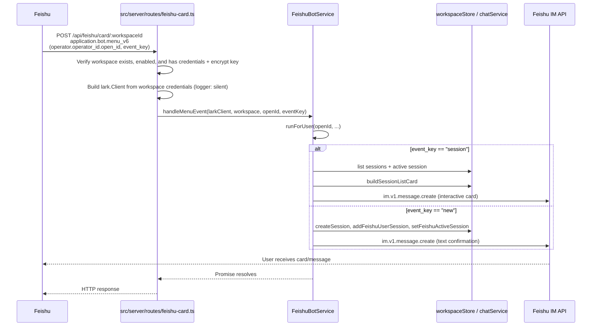

# Feishu Bot Menu Commands

## Summary

Extend the existing Feishu callback route to handle bot menu events (`application.bot.menu_v6`) and route them to Thread-free variants of the `/session` and `/new` command logic. Responses are sent directly to the user's DM via the Feishu message API.

---

## Problem Frame

Feishu bot menus are configured with event keys. Clicking a menu sends an `application.bot.menu_v6` event to the app's callback URL. Today only text commands (`/session`, `/new`) trigger session-switching and new-session behavior, so menu clicks are a more discoverable entry point that currently do nothing.

---

## Requirements

- R1. The app must handle Feishu `application.bot.menu_v6` events delivered to the existing Feishu callback endpoint.
- R2. A menu event whose `event_key` is `session` must produce the same session-list card as typing `/session`.
- R3. A menu event whose `event_key` is `new` must create a new session and notify the user the same way as typing `/new`.
- R4. Menu-triggered responses must be sent to the user's DM via the same Feishu message API used by existing card sends.
- R5. Menu event handling must respect the active Feishu workspace binding and fail gracefully when no workspace is bound, disabled, or missing the Feishu app credentials (`feishuAppId`/`feishuAppSecret`) needed to build the reply DM client. (Payload encryption / `feishuEncryptKey` is not required — see KTD1.)
- R6. The existing `/session` and `/new` text command behavior must remain unchanged.

---

## Key Technical Decisions

- **KTD1. Handle menu events in the existing Feishu callback route.** Adding a separate endpoint would require operators to configure another URL and verification token in the Feishu developer console. Extending the current route reuses signature verification and keeps the public surface unchanged. **Security invariant:** menu events MUST be dispatched only through the existing `lark.EventDispatcher.invoke` call, which runs `checkIsEventValidated` before invoking any registered handler, so they inherit request-signature verification. Any future refactor must preserve this — moving the menu handler outside `invoke` would let anyone who knows the callback URL forge menu events. Note: the SDK's `checkIsEventValidated` returns `true` unconditionally when the encrypt key is empty, so for token-only workspaces (no `feishuEncryptKey`) there is effectively no signature check — the menu flow accepts this same posture as card-action handling rather than forcing encryption, which would break common setups. (If enforcement is later desired, it should be an endpoint-wide setting, not a menu-only gate.)
- **KTD2. Construct a fresh `lark.Client` in the route handler from workspace credentials.** The singleton `feishuBotService` connection may point to a different workspace or be disconnected. Creating a client per callback ensures the correct app credentials are used and removes a hidden dependency on service connection state.
- **KTD3. Extract Thread-free command logic in `FeishuBotService`.** Menu events arrive without a chat-SDK `Thread`. The core session-list and new-session logic must be callable with only a workspace, user `open_id`, and `larkClient`.
- **KTD4. Serialize menu commands through the existing per-user queue.** Rapid double-clicks of the "new" menu could otherwise create duplicate sessions. Reusing `runForUser` keeps menu and chat command handling consistent.

---

## High-Level Technical Design

---

## Implementation Units

### U1. Add `application.bot.menu_v6` handler to the Feishu card route

- **Goal:** Receive and validate Feishu bot menu events in the existing callback route.
- **Requirements:** R1, R5
- **Dependencies:** None
- **Files:** `src/server/routes/feishu-card.ts`, `src/server/routes/feishu-card.test.ts`
- **Approach:**
  - Register an `application.bot.menu_v6` handler in the `lark.EventDispatcher` alongside `url_verification` and `card.action.trigger`.
  - Extract `operator.operator_id.open_id` and `event_key` from the normalized event payload (the SDK nests the user id under `operator.operator_id`, not `operator`). Defensively handle missing fields.
  - Before constructing the client, verify the workspace has `feishuAppId` and `feishuAppSecret` configured (needed to build the reply DM client). If either is missing, reject the event with `400` and do not dispatch — without credentials there is no client to send a DM, so return an error HTTP response and send nothing. (A `feishuEncryptKey` is NOT required: payload encryption is optional on Feishu and the rest of the endpoint already operates without it.)
  - Construct a `lark.Client` from the workspace's `feishuAppId` and `feishuAppSecret`, configured with `loggerLevel: lark.LoggerLevel.error` to suppress info/debug request-detail logging (the `lark.Client` option is `loggerLevel`, an enum — there is no string `'silent'` option on the client; `connect` sets no logger level, so this is additional hardening).
  - Call `feishuBotService.handleMenuEvent(larkClient, workspace, openId, eventKey)` **fire-and-forget** (attach a `.catch` for diagnostics, do not `await`). The HTTP response returns immediately so Feishu does not retry — a retry would re-enter `runForUser` and could create a duplicate session for `new`, undercutting KTD4. The per-user queue still serializes the actual DM work; errors are reported back to the user inside `handleMenuEvent`.
  - Return a response that Feishu expects (an empty object or toast) without leaking internal errors.
- **Patterns to follow:** Mirror the existing `card.action.trigger` handler's error handling and logging style. Use `diagLog` for diagnostics.
- **Test scenarios:**
  - Menu event with `event_key: "session"` invokes `handleMenuEvent` and returns a success-shaped response.
  - Menu event with `event_key: "new"` invokes `handleMenuEvent` and returns a success-shaped response.
  - Menu event with unknown `event_key` returns a helpful error toast.
  - Menu event missing `operator.operator_id.open_id` returns an error toast.
  - Workspace missing `feishuAppId`/`feishuAppSecret` returns `400` and sends no message.
  - Workspace with app credentials but no `feishuEncryptKey` is still admitted (encryption is optional).
  - Workspace disabled returns `403`.
  - Root callback with no active workspace binding returns `400`.
- **Verification:** All `feishu-card.test.ts` cases pass; the new handler is covered.

### U2. Extract Thread-free command logic in `FeishuBotService`

- **Goal:** Make the `/session` and `/new` core logic callable without a chat-SDK `Thread` so menu events can reuse it.
- **Requirements:** R2, R3, R4, R6
- **Dependencies:** U1
- **Files:** `src/server/services/feishu-bot-service.ts`
- **Approach:**
  - Add a public `handleMenuEvent(larkClient, workspace, openId, eventKey)` method.
  - Inside it, use `runForUser(openId, ...)` to serialize per-user menu commands.
  - Extract private helpers for the core behaviors:
    - `sendSessionListCard(larkClient, workspace, openId)` — lists sessions, builds the card, sends it.
    - `createAndNotifyNewSession(larkClient, workspace, openId)` — creates a session, registers it, sets it active, sends confirmation.
  - Refactor `handleSessionCommand` and `handleNewSessionCommand` to delegate to these helpers while keeping their existing `Thread`-based error posting for text commands (R6).
  - Add a Thread-free variant of the active-workspace check (e.g. `requireActiveWorkspaceForMenu(larkClient, openId)`) that sends any error text via `larkClient.im.v1.message.create` instead of `thread.post` — the existing `requireActiveWorkspace` posts through a `Thread` that menu events do not have. Since U1 already gates on workspace existence/enabledness/credentials at the route and constructs the client, `handleMenuEvent` always receives a workspace and a client; this service-level check only guards the active-binding mismatch.
  - Treat `openId` (from `operator.operator_id.open_id`) as the trusted identity anchor: every session lookup and creation (`listFeishuSessionsByUser`, `addFeishuUserSession`) MUST be scoped to that `openId`, mirroring the text-command handlers, so a compromised identity cannot cross user boundaries.
  - For menu events, send error messages via `larkClient.im.v1.message.create` instead of `thread.post`.
- **Patterns to follow:** Use the existing `sendCardToThread` direct-message pattern (`im.v1.message.create` with `receive_id_type: 'open_id'`). Keep naming and diagnostics consistent with existing command handlers.
- **Test scenarios:**
  - `handleMenuEvent(..., "session")` with existing sessions calls `larkClient.im.v1.message.create` with the interactive session-list card.
  - `handleMenuEvent(..., "session")` with no sessions still sends a card showing the empty state.
  - `handleMenuEvent(..., "new")` creates a session, adds it to the user's Feishu sessions, sets it active, and sends a confirmation text.
  - Two rapid `handleMenuEvent(..., "new")` calls for the same user are serialized through `runForUser` — they process strictly in order with no interleaving (each click creates exactly one session; serialization prevents concurrent corruption, not dedup).
  - `handleMenuEvent` when the active Feishu workspace binding is cleared or disabled mid-flight sends an error text to the user via `im.v1.message.create`. (The route-level no-workspace case returns an HTTP error and sends no message — see AE3 — because there is no client to send with.)
  - Failure of `larkClient.im.v1.message.create` is logged and does not crash the handler.
- **Verification:** New or updated `feishu-bot-service.test.ts` cases pass; `/session` and `/new` text command tests still pass unchanged.

### U3. Add service-layer tests for menu command handling

- **Goal:** Cover menu event behavior at the service layer with isolated storage and mocked Feishu API calls.
- **Requirements:** R2, R3, R5
- **Dependencies:** U2
- **Files:** `src/server/services/feishu-bot-service.test.ts`
- **Approach:**
  - Import `../test-utils/test-env.js` as the first statement (mandatory convention).
  - Use the existing test harness: isolated workspace store, mocked `chatService`, mocked `larkClient`, and injected `connection`.
  - Add tests for `handleMenuEvent` covering happy paths and error paths.
  - Verify that the existing `/session` and `/new` text command tests still exercise the same helpers through their Thread-based wrappers.
- **Patterns to follow:** `src/server/services/feishu-bot-service.test.ts` already mocks the store, `chatService`, and `larkClient`. Extend those patterns.
- **Test scenarios:**
  - Covers AE1: bound workspace + "session" menu click → session-list card sent.
  - Covers AE2: bound workspace + "new" menu click → new session created and confirmation sent.
  - Covers AE3: no workspace bound at the route → HTTP error returned, no card or message sent (no client available). Separately, an active-binding mismatch inside the service → error text sent via DM.
  - Invalid `eventKey` → error text sent.
  - Concurrent menu clicks are serialized per user.
- **Verification:** `npm run test:server` passes for the Feishu bot service test file.

---

## Acceptance Examples

- AE1. **Session menu.** Given a workspace is bound and Feishu-enabled, when a user clicks the "session" menu, then the app sends the same session-list card that `/session` would send.
- AE2. **New menu.** Given a workspace is bound and Feishu-enabled, when a user clicks the "new" menu, then a new Feishu session is created and the user receives a confirmation message.
- AE3. **No workspace bound.** Given no Feishu workspace is bound, when a user clicks either menu, then the app returns an error response and sends no card or message.

---

## Scope Boundaries

- **Deferred for later:** A UI or settings field for mapping custom menu `event_key` values to command behavior. The first version uses the convention `session` and `new`.
- **Outside this change:** Group-chat menu handling (bot menus operate in DMs); any changes to WeCom bot behavior; changes to the existing `/session` and `/new` text commands.

---

## Risks & Dependencies

- **Risk:** Constructing a `lark.Client` in the route duplicates the connection logic in `feishuBotService.connect`. Mitigation: keep the construction minimal and identical to the existing client setup; do not add connection state or lifecycle.
- **Risk:** Menu events arriving when the service singleton is connected to a different workspace. Mitigation: KTD2 avoids relying on the singleton connection.
- **Risk:** Rapid menu clicks creating duplicate sessions. Mitigation: KTD4 serializes per-user menu commands through the existing queue.
- **Dependency:** The Feishu developer console must subscribe `application.bot.menu_v6` and point it at the app's existing Feishu callback URL.
- **Dependency:** The Feishu app must be configured with menu `event_key` values `session` and `new`.
- **Dependency:** The bound workspace must have `feishuAppId` and `feishuAppSecret` configured so the route can build a per-callback `lark.Client` to send the reply DM. A `feishuEncryptKey` is optional (payload encryption is off by default on Feishu); the route does not require it.

---

## Open Questions

None. The 2026-06-23 doc-review pass (coherence, feasibility, security-lens) resolved the following into the units above: the correct `operator.operator_id.open_id` payload path; the signature-verification security invariant and `feishuEncryptKey` precondition; the missing-credentials shadow path; the Thread-free `requireActiveWorkspace` variant; and the AE3/U2 reconciliation. A reviewer-raised but deferred item — whether menu-triggered session creation should require the operator to be a registered/allowlisted workspace user (vs. any authenticated Feishu user, matching current text-command behavior) — is intentionally left as-is to preserve parity with `/new`; revisit if bot exposure widens.

---

## Sources / Research

- Origin requirements doc: `docs/brainstorms/2026-06-23-feishu-bot-menu-commands-requirements.md`
- Existing command dispatch for `/session` and `/new`: `src/server/services/feishu-bot-service.ts:175-185`
- Existing Feishu card callback route and `EventDispatcher` usage: `src/server/routes/feishu-card.ts`
- Feishu menu event type and payload shape: `@larksuiteoapi/node-sdk` type definitions
- Project test database isolation convention: `docs/solutions/conventions/use-isolated-test-database-for-comate.md`
