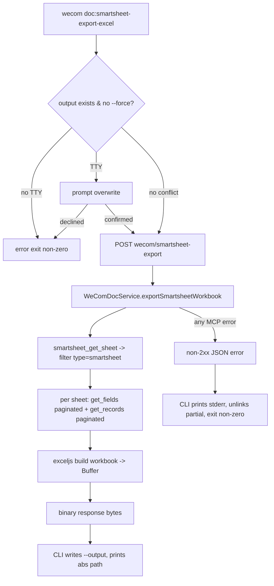

# WeCom CLI smartsheet-to-Excel export

## Summary

Add a `wecom doc:smartsheet-export-excel` command that downloads every smartsheet in a
WeCom document as a single `.xlsx` workbook (one worksheet per smartsheet). The workbook is
composed server-side from the existing `smartsheet_get_sheet` / `smartsheet_get_fields` /
`smartsheet_get_records` MCP calls and streamed back to the CLI as binary bytes, which the
CLI writes to a caller-supplied `--output` path.

## Problem Frame

The WeCom smart-document MCP exposes read APIs for smartsheets but no native export. Users
who want to feed smartsheet data into an LLM for analysis must export manually from the web
UI. A CLI command closes the gap so scripts and agents can pull a workbook directly. The
data and Excel-generation logic belong server-side (where bot credentials and the MCP client
already live) so the CLI stays a thin transport.

## Requirements

### CLI interface

- R1. The command is registered as `doc:smartsheet-export-excel` in `packages/wecom-cli/src/index.ts` and lives at `packages/wecom-cli/src/commands/doc/smartsheet-export-excel.ts`, following the existing oclif explicit-command pattern. (brainstorm R1)
- R2. Required flags: `--docid <document-id>`, `--output <file-path>`. Optional flag: `--force`. (brainstorm R2)
- R3. If `--output` exists and `--force` is absent: in a TTY, prompt to overwrite; without a TTY, fail immediately with a clear error and leave the existing file untouched. (brainstorm R3, AE1, AE2)

### Export behavior

- R4. The export covers every smartsheet in the document. `smartsheet_get_sheet` returns sheet entries with `sheet_id`, `title`, and `type`; only entries whose `type` is `smartsheet` are exported. (brainstorm R4)
- R5. Each smartsheet becomes one worksheet, named from its `title`, sanitized for Excel worksheet rules and deduplicated on collision. (brainstorm R5, AE4)
- R6. Each worksheet has a header row of field titles followed by all record rows. (brainstorm R6)
- R7. Records are requested with `key_type: CELL_VALUE_KEY_TYPE_FIELD_ID` so cell keys match the `field_id` values from `smartsheet_get_fields`. (brainstorm R7)
- R8. Fields and records are fetched exhaustively via `offset`/`limit` pagination, page size up to the API max of 1000, looping while the response signals more data. (brainstorm R8)
- R9. Cell values preserve scalar types where the WeCom field type maps cleanly (number, date/datetime from Unix-ms, checkbox/boolean, phone, email, text, single-select). Complex types (attachment, image, user, url, multi-select, location, reference, auto-number) flatten to readable text. Formula fields export their evaluated text. (brainstorm R9)

### Output and completion

- R10. On success the workbook is written to `--output` and the absolute path is printed to stdout. (brainstorm R10)
- R11. On any failure the command exits non-zero, prints a concise error to stderr, and removes any partially written output file. (brainstorm R11, AE3)

## Key Technical Decisions

- KTD1. Server-side composition via a new `WeComDocService` method. Add `exportSmartsheetWorkbook(workspace, docid): Promise<Buffer>` reusing the existing `this.mcpClient.callJsonTool(botId, botSecret, 'doc', method, args)`. The MCP method names are the snake_case forms `smartsheet_get_sheet`, `smartsheet_get_fields`, `smartsheet_get_records`. Keeps orchestration and credentials in one place and reusable by future clients.
- KTD2. `exceljs` for workbook generation, added to the root `package.json` (the server package). It supports `workbook.xlsx.writeBuffer()` → `Buffer`, typed cells, and worksheet naming. The CLI adds no Excel dependency — it only writes bytes.
- KTD3. Dedicated binary route, not the generic JSON proxy. Add `POST /api/workspaces/:workspaceId/wecom/smartsheet-export` returning the `.xlsx` bytes with `Content-Type: application/vnd.openxmlformats-officedocument.spreadsheetml.sheet`. The existing `wecom/doc/:tool` route always `res.json(...)`; a separate path avoids overloading the `:tool` param and the JSON contract. Errors return JSON with a non-2xx status, as elsewhere.
- KTD4. CLI extends `BaseCommand`, not `BaseDocCommand`. `BaseDocCommand.callDocTool()` only handles a JSON-text response (`this.log(response.body)`); the export needs a Buffer. The new command loads context with `loadContext()` directly and posts to the binary endpoint.
- KTD5. Binary HTTP helper in the CLI. Add `postForBinary(url, body): Promise<{ status: number; body: Buffer; contentType: string }>` to `packages/wecom-cli/src/lib/http.ts`, collecting response chunks into a `Buffer`. On non-200 the caller decodes `body.toString('utf-8')` as the JSON error shape (`{ error, message }`), matching `callDocTool`'s error handling.
- KTD6. Worksheet-title sanitization. Excel forbids `\ / ? * [ ] :` and caps names at 31 chars; blank names are invalid. Sanitize each title (replace illegal chars, trim, fall back to `Sheet`), then deduplicate by appending ` (2)`, ` (3)`, … while keeping within the 31-char limit. (covers R5/AE4)
- KTD7. Abort-on-failure cleanup is CLI-side. The server either returns a complete workbook or an error; the CLI writes the file only after a 200, and on any thrown error (including a mid-write failure) unlinks the output path if it created it. This avoids partial files without server-side temp-file bookkeeping. (covers R11/AE3)

## High-Level Technical Design

## Implementation Units

### U1. Add `exceljs` dependency

- **Goal:** Make a workbook generator available to the server.
- **Files:** `package.json` (root), lockfile.
- **Patterns:** Add `exceljs` to `dependencies`; install. Confirm it bundles into the sidecar build (`scripts/build-sidecar.ts`) like other server deps.
- **Verification:** `npm run build:server` compiles with an `import ExcelJS from 'exceljs'`.

### U2. Server export service method

- **Goal:** Compose sheet metadata, fields, and records into an `.xlsx` Buffer.
- **Files:** `src/server/services/wecom-doc-service.ts`.
- **Patterns:**
  - Add `async exportSmartsheetWorkbook(workspace: Workspace, docid: string): Promise<Buffer>`.
  - Resolve `botId`/`botSecret` and throw on missing, as `callTool` does.
  - Call `smartsheet_get_sheet` with `{ docid }`; keep entries where `type === 'smartsheet'`.
  - For each sheet: page `smartsheet_get_fields` (`{ docid, sheet_id, offset, limit: 1000 }`) until exhausted; page `smartsheet_get_records` (`{ docid, sheet_id, key_type: 'CELL_VALUE_KEY_TYPE_FIELD_ID', offset, limit: 1000 }`) following the continuation signal.
  - Build one `ExcelJS.Worksheet` per sheet via a sanitize+dedup helper (KTD6); write a header row of field titles, then a row per record mapping `field_values[field_id]` through a `formatCell(fieldType, value)` helper (KTD-driven mapping per R9).
  - Return `await workbook.xlsx.writeBuffer()` as a `Buffer`.
- **Test Scenarios:** see U6.
- **Verification:** Unit test reads the buffer back with `ExcelJS` and asserts worksheet names, header row, and typed cells.

### U3. Server binary route

- **Goal:** Expose the export over HTTP as binary.
- **Files:** new `src/server/routes/wecom-smartsheet-export.ts`; mount in `src/server/index.ts` next to `wecomDocRoutes`.
- **Patterns:**
  - `POST /api/workspaces/:workspaceId/wecom/smartsheet-export`, `Router({ mergeParams: true })`.
  - Validate `workspaceId`, load workspace (404 if absent), require `docid` in body (400 if absent), mirroring `wecom-doc.ts`.
  - On success: `res.status(200).set('Content-Type', 'application/vnd.openxmlformats-officedocument.spreadsheetml.sheet').send(buffer)`.
  - On error: `res.status(500).json({ error: 'smartsheet_export_failed', message })`; do not leak stack traces.
  - Mount path so it does not collide with the existing `wecom/doc/:tool` param route.
- **Verification:** Server test posts to the route against a mocked MCP and asserts a 200 with binary body and the xlsx content type.

### U4. CLI binary HTTP helper

- **Goal:** Let the CLI receive binary bytes.
- **Files:** `packages/wecom-cli/src/lib/http.ts`.
- **Patterns:** Add `postForBinary(url, body)` returning `{ status, body: Buffer, contentType }`; collect chunks into `Buffer.concat`. Leave `postJson`/`getJson` untouched.
- **Verification:** Exercised through the CLI command test (U7).

### U5. CLI export command

- **Goal:** Wire flags, overwrite handling, transport, and cleanup.
- **Files:** new `packages/wecom-cli/src/commands/doc/smartsheet-export-excel.ts`; register in `packages/wecom-cli/src/index.ts` `COMMANDS` as `doc:smartsheet-export-excel`.
- **Patterns:**
  - Extend `BaseCommand` (KTD4). Flags per R2.
  - Resolve `--output` to an absolute path. If it exists and no `--force`: prompt via `ux.confirm` when `process.stdout.isTTY`, else `this.error(..., { exit: 1 })` (R3).
  - `loadContext()`; build endpoint `${serverUrl}/api/workspaces/${workspaceId}/wecom/smartsheet-export`; `postForBinary(url, { docid })`.
  - On 200: write the Buffer to `--output`, print the absolute path (R10).
  - On non-200: decode the JSON error from the buffer and `this.error(..., { exit: 3 })`; network failure → exit 4 (mirror `callDocTool` exit codes).
  - Track whether this invocation created the file; on any failure after writing began, `fs.unlink` it and swallow ENOENT (R11).
- **Verification:** CLI test (U7).

### U6. Server tests

- **Goal:** Cover composition, pagination, typing, and the route.
- **Files:** extend `src/server/services/wecom-doc-service.test.ts` (or a sibling `wecom-smartsheet-export.test.ts`); a route test alongside.
- **Patterns:** Import `../test-utils/test-env.js` first (mandatory SQLite isolation). Mock `global.fetch` to return MCP JSON for `smartsheet_get_sheet` (mixed `type` entries), multi-page `smartsheet_get_fields`, and multi-page `smartsheet_get_records`. Read the returned buffer back with `ExcelJS`.
- **Test Scenarios:**
  - Only `type === 'smartsheet'` entries become worksheets.
  - Multi-page fields and records are fully fetched (assert `offset` progression and total row count).
  - `key_type: CELL_VALUE_KEY_TYPE_FIELD_ID` is sent on record calls.
  - Type mapping: number/date/checkbox become scalars; an attachment/user value flattens to text.
  - Duplicate titles dedupe to `Title` / `Title (2)`; an over-long title truncates to 31 chars.
  - Route returns 200 + xlsx content type; missing `docid` → 400; unknown workspace → 404.

### U7. CLI integration tests

- **Goal:** Cover flag handling, overwrite gates, success, and cleanup.
- **Files:** `packages/wecom-cli/test/cli.test.js`.
- **Patterns:** Extend the existing mock HTTP server to serve the binary export endpoint (and an error variant); use `writeContext` to seed `.claude/wecom-context.json`; spawn `dist/index.js`.
- **Test Scenarios:**
  - Success writes the file and prints its absolute path (AE: happy path, R10).
  - `--output` exists, no `--force`, non-TTY → exits non-zero, file untouched (AE2).
  - Server returns an error mid-export → CLI exits non-zero and the output file does not exist afterward (AE3, R11).
  - Missing `--docid`/`--output` → oclif validation error remapped to exit 1 by `BaseCommand.catch`.

## Scope Boundaries

- Deferred: selecting specific sheets or record ranges; CSV export; surfacing the command through the `wecom-doc` skill; preserving formatting, formulas, colors, or attachments as files; incremental/scheduled exports.
- Outside identity: a generic spreadsheet editor or a two-way WeCom-document sync tool.

## Risks & Dependencies

- WeCom API shape drift. The real `smartsheet_get_sheet` / `_get_fields` / `_get_records` response field names (`type`, `field_title` vs `title`, `has_more`/`next` continuation) are taken from the WeCom dev docs, not exercised live here; tests mock them. Verify against a real document before release.
- Large documents. Exhaustive pagination plus in-memory workbook construction could be heavy for very large sheets; acceptable for the current use case, noted for future streaming work.
- `exceljs` adds a sizable dependency to the sidecar bundle; confirm the build size and that native-free pure-JS modules bundle cleanly.

## Sources / Research

- CLI command pattern and registry: `packages/wecom-cli/src/commands/doc/smartsheet-get-records.ts`, `packages/wecom-cli/src/commands/base.ts`, `packages/wecom-cli/src/commands/doc/base-doc-command.ts`, `packages/wecom-cli/src/index.ts`.
- CLI HTTP transport: `packages/wecom-cli/src/lib/http.ts` (`postJson` returns text only — binary helper needed).
- Server proxy and service: `src/server/routes/wecom-doc.ts` (always `res.json`), `src/server/services/wecom-doc-service.ts` (`callTool`, `kebabToSnake`, `mcpClient.callJsonTool`), `src/server/index.ts:94-95` (route mounting).
- MCP transport: `src/server/services/wecom-mcp-client.ts` (`callJsonTool(botId, botSecret, category, method, args)`).
- API shapes: `claude-code-plugin/plugins/wecom/skills/wecom-doc/references/smartsheet-get-{sheet,fields,records}.md`; WeCom dev docs paths 101154 / 101157 / 101158.
- Test patterns: `src/server/services/wecom-doc-service.test.ts` (mocked `fetch`, isolated store), `packages/wecom-cli/test/cli.test.js` (mock server + spawned CLI).
