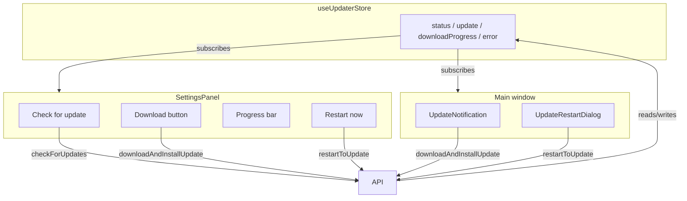

# Plan: Settings 与主窗口统一的更新安装流程

## Summary

扩展 Settings 面板 General 标签页中的 updater 区域，使其能够完成完整的更新流程：检查 → 下载（带进度条）→ 安装/重启。主窗口的现有更新通知保持为并行的同步入口。实现上复用现有的 `useUpdaterStore` 作为唯一状态源，并在 `updater-api` 层为下载和重启操作增加防重复触发保护。

## Problem Frame

当前 Settings 面板只提供「Check for update」按钮和一段文字状态。当检测到新版本时，用户必须回到主窗口点击 Download，造成发起检查的界面无法完成后续操作，且设置页面关闭后容易错过更新入口。

## Requirements

- R1. Settings 面板的 updater 区域实时反映共享 store 中的 `status`（idle / checking / available / downloading / ready / error）。
- R2. 当 `status === 'available'` 时，Settings 面板显示新版本号、release body 摘要和一个 Download 按钮。
- R3. 当 `status === 'downloading'` 时，Settings 面板显示进度条和百分比。
- R4. 当 `status === 'ready'` 时，Settings 面板显示 Install / Restart now 按钮，并提供稍后处理的选项。
- R5. Settings 面板中的 Download / Restart 操作与主窗口通知使用同一组 API。
- R6. 主窗口的更新通知和重启弹窗继续同步显示相同状态并允许相同操作。
- R7. 关闭并重新打开 Settings 时，updater 区域恢复当前状态，而不是重置为初始检查界面。
- R8. 任一界面触发 Download / Restart 后，另一界面立即同步；重复点击不得产生多个并行的下载或重启请求。

## Key Technical Decisions

- **单一状态源，无新 store**：Settings 和主窗口都直接读取 `useUpdaterStore` 的 `status`、`update`、`downloadProgress`、`error`。两个界面天然同步，不需要额外的事件总线或 prop 传递。
- **在 API 层防重入**：`downloadAndInstallUpdate` 和 `restartToUpdate` 在入口检查当前 `status`，已在 `downloading` / `ready` / `restarting` 状态时直接返回。这样无论用户在哪个界面点击，都不会触发重复操作。
- **Settings 内联展示，不引入新弹窗**：把下载、进度、重启入口直接嵌入 General 标签页现有的 updater 卡片区域，保持用户停留在设置页面即可完成作业。
- **复用与补充 i18n**：Restart / Later 等已有文案继续使用 `common` 命名空间；Settings 面板新增的「Download」按钮、进度提示等文案使用 `settings` 命名空间，保持与现有 General 标签页一致。

## High-Level Technical Design

Settings 面板和主窗口通过同一个 Zustand store 共享更新状态。用户从任意界面触发操作时，API 层先根据 store 状态判断是否允许执行，然后更新 store，两个界面同时重新渲染。

## Implementation Units

### U1. 为 updater 动作添加防重入保护

**Goal:** 确保从 Settings 或主窗口重复点击 Download / Restart 不会启动多个并行操作。

**Requirements:** R5, R8

**Dependencies:** 无

**Files:** `src/client/lib/updater-api.ts`, `src/client/lib/updater-api.test.ts`

**Approach:**
- 在 `downloadAndInstallUpdate` 入口检查 `currentUpdate` 是否存在，以及 store `status` 是否已为 `downloading`、`ready` 或 `restarting`；若是则直接返回。
- 在 `restartToUpdate` 入口检查 store `status` 是否为 `ready` 且不是 `restarting`；否则直接返回。
- 错误处理保持现有逻辑不变。

**Patterns to follow:** 现有 `checkForUpdates` 已有基于 `status` 的提前返回模式；保持风格一致。

**Test scenarios:**
- 当 `status === 'downloading'` 时调用 `downloadAndInstallUpdate`，不触发第二次下载。
- 当 `status === 'ready'` 时调用 `downloadAndInstallUpdate`，不触发新的下载。
- 当 `status !== 'ready'` 时调用 `restartToUpdate`，不触发重启。
- 正常路径（available → download → ready → restart）仍保持原有行为。

**Verification:** `src/client/lib/updater-api.test.ts` 全部通过。

### U2. 在 SettingsPanel 内联展示完整更新流程

**Goal:** 让 General 标签页的 updater 区域根据 store 状态显示对应的下载、进度、重启 UI。

**Requirements:** R1, R2, R3, R4, R7

**Dependencies:** U1

**Files:** `src/client/components/SettingsPanel.tsx`, `src/client/components/SettingsPanel.test.tsx`

**Approach:**
- 在 `GeneralSettingsTab` 中从 `useUpdaterStore` 读取 `update` 和 `downloadProgress`（目前只读取了 `status` 和 `error`）。
- 根据 `status` 渲染不同子区域：
  - `checking`：显示 spinner 或文案，禁用 Check 按钮。
  - `available`：展示版本号、`update.body` 摘要、Download 按钮。
  - `downloading`：展示进度条和百分比。
  - `ready`：展示 Restart now 和 Later 按钮。
  - `error`：展示错误文案。
- 保留「Check for update」按钮用于 `idle` / 无更新状态。
- 保持 auto-check toggle 不变。

**Patterns to follow:** 样式使用 Tailwind 设计 token（`bg-surface`、`border-border`、`text-accent`、`bg-accent` 等），并通过 `cn()` 组合；文案使用 `useTranslation('settings')`。

**Test scenarios:**
- `status === 'available'` 时渲染 Download 按钮。
- `status === 'downloading'` 时渲染进度条，且百分比等于 `downloadProgress`。
- `status === 'ready'` 时渲染 Restart now 按钮。
- 关闭并重新打开 Settings 后，UI 仍显示当前状态（通过 store 状态驱动）。
- 点击 Download / Restart 调用对应 updater API。

**Verification:** `src/client/components/SettingsPanel.test.tsx` 中新增相关用例通过；`npm run test:client` 通过。

### U3. 补充 settings 命名空间的 i18n 文案

**Goal:** 为 Settings 面板新增的 updater 控件提供中英双语文案。

**Requirements:** R2, R3, R4

**Dependencies:** U2

**Files:** `src/client/i18n/en/settings.json`, `src/client/i18n/zh-CN/settings.json`

**Approach:**
- 在 `general` 分组下新增必要的 key，例如 `updaterDownload`、`updaterDownloadingProgress`、`updaterInstallNow`、`updaterLater`、`updaterNewVersionAvailable` 等。
- 如果已有 `common` 命名空间中的文案（如 restart-related）可直接复用，则不重复添加。

**Patterns to follow:** 两个语言文件保持 key 一致；参考已有 `general.updaterTitle`、`general.updaterCheckNow` 等命名风格。

**Test scenarios:**
- 运行 `npm run lint` 无 i18n 相关报错。
- 切换 `en` / `zh-CN` 后 Settings 面板文案正确切换。

**Verification:** 在 `SettingsPanel.test.tsx` 中通过 `i18next` 实例渲染并断言文案 key 解析后的文本。

### U4. 更新主窗口组件测试并验证双端同步

**Goal:** 确认主窗口通知和重启弹窗在双入口场景下仍正确工作，并补全覆盖。

**Requirements:** R6, R8

**Dependencies:** U1, U2

**Files:** `src/client/components/UpdateNotification.tsx`（阅读/可能小改）、`src/client/components/UpdateRestartDialog.tsx`（阅读/可能小改）、相关测试文件

**Approach:**
- 主窗口组件理论上不需要功能改动，因为状态仍来自同一 store。
- 验证 `UpdateNotification` 在 `available` 时显示 Download，在 `downloading` 时显示进度，在 `checking` 时不显示关闭按钮等既有行为仍然成立。
- 若现有测试缺失或薄弱，补充基础渲染测试。

**Test scenarios:**
- 主窗口通知在 `downloading` 状态下显示与 Settings 一致的进度。
- 从 Settings 触发下载后，主窗口通知自动切换到 `downloading` 状态（通过共享 store 的集成测试或手动验证）。
- 从主窗口触发 Restart 后，Settings 中的 Restart 按钮不再触发第二次重启。

**Verification:** 相关组件测试通过；如无法自动化覆盖 Tauri 集成行为，则在计划备注中说明需手动验证。

## Scope Boundaries

- **Deferred for later:** 在 Settings 中渲染更丰富的 release notes（目前仅使用 `update.body` 纯文本）。
- **Deferred for later:** 修改自动检查更新的频率或后台策略。
- **Deferred for later:** 静默自动下载/自动安装，无需用户确认。
- **Outside this product's identity:** 用模态弹窗、系统托盘菜单等替代主窗口更新通知。

## Acceptance Examples

- AE1. **Settings 下载时主窗口同步**
  - **Covers:** R2, R3, R6
  - **Given:** 已检测到新版本，Settings 显示 Download 按钮。
  - **When:** 用户点击 Download。
  - **Then:** Settings 显示进度条；主窗口通知也显示相同进度。

- AE2. **关闭 Settings 后可在主窗口继续**
  - **Covers:** R6, R8
  - **Given:** 下载正在进行中。
  - **When:** 用户关闭 Settings 面板。
  - **Then:** 主窗口继续显示下载进度，用户可在主窗口完成安装。

- AE3. **重新打开 Settings 保留 ready 状态**
  - **Covers:** R7
  - **Given:** 更新已下载完成，`status === 'ready'`。
  - **When:** 用户关闭并重新打开 Settings。
  - **Then:** Settings 直接显示 Restart now 按钮，无需再次点击 Check for update。

- AE4. **重复点击不触发多次下载**
  - **Covers:** R8
  - **Given:** 下载正在进行中。
  - **When:** 用户快速在 Settings 和主窗口各点击一次 Download。
  - **Then:** 只启动一次下载；两个界面都显示 `downloading` 状态。

## Risks & Dependencies

- **依赖：** Tauri updater 事件必须继续提供 `Started` 中的 `contentLength` 和 `Progress` 中的 `chunkLength`，否则进度计算会回退到 0%。该依赖已由最近一次的 updater 修复覆盖。
- **风险：** Settings 面板是模态覆盖层，在 `downloading` 或 `ready` 状态下关闭它可能让用户误以为更新被取消。UI 文案应保持清晰：关闭 Settings 只是隐藏面板，下载/已下载状态仍保留在主窗口。
- **风险：** 双入口同时暴露操作按钮时，按钮的 disable 状态需要与 `status` 严格对应，否则用户可能在 `ready` 时仍看到 Download。实现时应完全由 store 状态驱动按钮文案和可用性。

## Sources / Research

- 当前主窗口更新通知：`src/client/components/UpdateNotification.tsx`
- 当前重启确认弹窗：`src/client/components/UpdateRestartDialog.tsx`
- Settings 面板 updater 区域：`src/client/components/SettingsPanel.tsx`
- 共享更新状态：`src/client/stores/updater-store.ts`
- 更新 API 与事件处理：`src/client/lib/updater-api.ts`
- i18n 命名空间：`src/client/i18n/en/settings.json`、`src/client/i18n/zh-CN/settings.json`
- 上游需求文档：`docs/brainstorms/2026-06-24-settings-update-flow-requirements.md`
