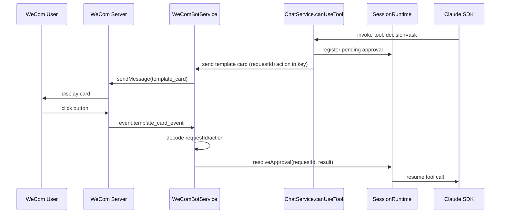
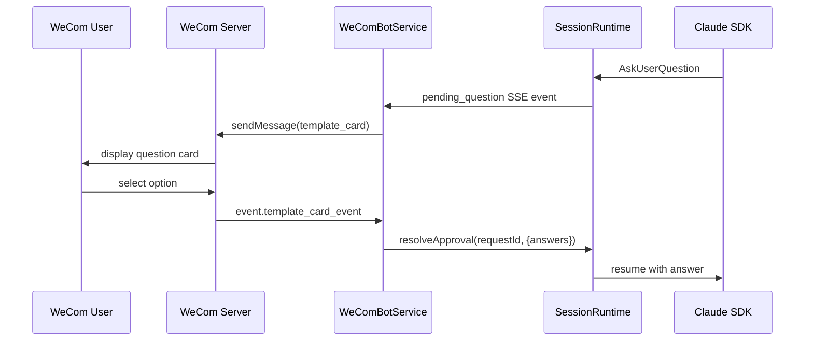
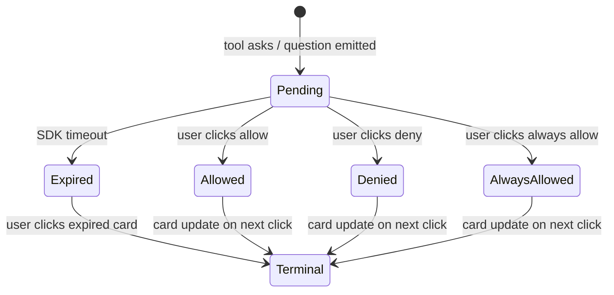

# feat: WeCom Bot 'ask' Permission via Template Cards

## Summary

Add `ask` as a third WeCom bot tool-permission value, surface both tool approvals and `AskUserQuestion` as WeChat Work template-card messages, and resolve card clicks through the existing websocket. GUI sessions show a non-interactive pending indicator but do not approve or deny.

---

## Problem Frame

The WeCom bot permission model is currently binary: a tool is either allowed or denied. Admins who want end users to approve sensitive actions per-use have no middle ground. At the same time, `AskUserQuestion` has no natural surface in a WeCom chat; the question is emitted as an SSE event and resolved through the GUI approvals API, leaving WeCom-only users stuck. WeChat Work template-card messages are the native, low-friction way to present these decisions directly in chat.

---

## Requirements

### Permission model

R1. `ToolPermissionPolicy` supports `ask` as a valid value for `categoryDefaults` and per-tool `overrides`, in addition to `allow` and `deny`.

R2. The permission evaluator returns `ask` when the resolved category default or override is `ask`; it continues to return `unknown` for MCP tools, Skills, and uncategorized SDK tools.

R3. Workspaces with existing `allow`/`deny` policies continue to behave exactly as before, and the safe/allow-all presets keep using only `allow`/`deny` defaults.

### Tool-approval cards

R4. When a bot session invokes a built-in SDK tool whose effective decision is `ask`, the tool call pauses and a WeCom template-card message is sent.

R5. The tool-approval card shows the tool category, a brief description of the requested action, and three buttons: `allow`, `always allow`, and `deny`.

R6. Selecting `allow` resolves the pending approval with a one-time grant. Selecting `always allow` returns the SDK's `suggestions` as `updatedPermissions` so the SDK can persist the grant. Selecting `deny` denies the call with a generic message that does not name the tool.

R7. If the user does not respond before the SDK approval timeout, the call is denied with a generic message and the card is updated to a terminal state on the next click.

### AskUserQuestion cards

R8. When a bot session emits a `pending_question` event, the system sends a WeCom template-card message containing the question text and response options.

R9. Single-choice and boolean questions present selectable options. The approach for free-text questions is chosen during implementation based on the card format's input support.

R10. The user's response via the card is fed back into the SDK as the `AskUserQuestion` answer.

### Card event routing

R11. Template-card click events are received through the existing `@wecom/aibot-node-sdk` websocket connection.

R12. The event payload is parsed to extract the encoded `requestId` and selected action; the matching pending approval is resolved.

R13. Multiple concurrent pending approvals per session are supported; each card carries a unique `requestId`.

R14. If the matching pending approval no longer exists, the original card is updated to a terminal state and no session action is taken.

### GUI visibility

R15. For bot sessions with pending approvals, the GUI session view shows a non-interactive indicator that the session is waiting for the WeCom user's decision.

---

## Key Technical Decisions

- **Encode `requestId` and action in the card button `key`.** The WeCom SDK's `template_card_event` only echoes `event_key` and `task_id`; it does not carry arbitrary metadata. The button key is the only round-trip channel, and it supports up to 1024 bytes.
- **Reuse `SessionRuntime.pendingApprovals` for bot sessions.** The runtime already re-emits pending approvals to GUI subscribers and exposes `sessionStatus.pendingCount`. Using the same map avoids parallel state and keeps the dock badge and tab indicators correct.
- **Return a Promise from the bot `canUseTool` callback for `ask` and `AskUserQuestion`.** This mirrors the GUI `SessionRuntime.buildCanUseToolCallback` pattern and lets the card event resolve the approval later.
- **Send cards proactively via `sendMessage` with `msgtype: 'template_card'`.** The `replyTemplateCard` API requires the inbound message frame, which is not available inside `canUseTool` or during SSE event handling.
- **Update card terminal states only when the user clicks.** `updateTemplateCard` requires the click event frame and must complete within five seconds. A server-side timeout cannot proactively update the card; instead, the timeout denies the approval and any later click renders the expired state.
- **Delegate `always allow` to the SDK via `updatedPermissions`.** The GUI approvals route already passes `suggestions` back to the SDK as `updatedPermissions`; the bot path does the same. Comate does not maintain a separate grant store.

---

## High-Level Technical Design

### Tool-approval flow

### AskUserQuestion flow

### Pending approval state

---

## Implementation Units

### U1. Extend tool permission policy and UI to support `ask`

**Goal:** Allow `ask` as a valid decision value in the server policy, client types, and permissions UI, while keeping presets backward-compatible.

**Requirements advanced:** R1, R2, R3.

**Dependencies:** None.

**Files:**
- `src/server/services/tool-permission-policy.ts`
- `src/server/models/workspace.ts`
- `src/client/types/wecom-permissions.ts`
- `src/client/components/PermissionsSubTab.tsx`
- `src/client/i18n/en/settings.json`
- `src/client/i18n/zh-CN/settings.json`
- `src/server/services/tool-permission-policy.test.ts`

**Approach:**
- Add `'ask'` to `ToolPermissionPolicy.categoryDefaults`, `overrides`, and `PermissionDecision`.
- Update `evaluateToolPermission` to return `'ask'`.
- Update `sanitizePolicy` to accept and preserve `'ask'`.
- Keep `SAFE_PRESET` and `ALLOW_ALL_PRESET` using only `allow`/`deny`.
- Add `ask` to the client `CategoryDecision` type and the `DecisionToggle` component.
- Add i18n keys for the new toggle state.

**Patterns to follow:** The existing two-tier permission model in `tool-permission-policy.ts` and the WeCom permissions sub-tab pattern from the 2026-06-14 tool-permissions plan.

**Test scenarios:**
- `ask` category default evaluates to `ask` for a built-in tool in that category.
- Per-tool `ask` override takes precedence over category default.
- `unknown` tools fall through to allow-all regardless of policy.
- `SAFE_PRESET` and `ALLOW_ALL_PRESET` contain no `ask` values.
- UI toggle renders `ask` state and calls `onChange('ask')`.

**Verification:** `npm run test:server` passes; permissions UI shows a three-state toggle for categories and overrides.

---

### U2. Build WeCom template card sender/parser module

**Goal:** Encapsulate template-card payload construction, button-key encoding, and click-event parsing in one place so the bot service and stream reply handler do not duplicate card logic.

**Requirements advanced:** R5, R9, R11, R12, R14.

**Dependencies:** U1.

**Files:**
- `src/server/services/wecom-template-card.ts` (new)
- `src/server/services/wecom-template-card.test.ts` (new)
- `src/server/types/wecom-template-card.ts` (new, if needed for shared types)

**Approach:**
- Provide helpers to build `button_interaction` cards for tool approvals and `vote_interaction`/`multiple_interaction` cards for questions.
- Encode `{requestId, action, sessionId}` into the button `key` using a compact, versioned format (e.g., JSON with delimiter or structured string) and verify it stays under 1024 bytes.
- Provide a parser for `event.template_card_event` payloads that decodes the key, validates the user matches the session owner, and returns the resolved action.
- Provide a helper to build the terminal-state card payload used to update an expired/resolved card.

**Technical design (directional):** Button keys look like `comate:1:<base64url(json({r:requestId,a:action,s:sessionId}))>`. The `comate:1:` prefix lets the event handler ignore non-Comate keys. Keep the encoded payload small because the key length budget is 1024 bytes and the SDK may add overhead.

**Patterns to follow:** The Feishu card action handler's owner-check and expired-state patterns; existing `wecom-bot-service.ts` sendMessage usage.

**Test scenarios:**
- Tool-approval card payload contains the expected `card_type`, `main_title`, and three buttons.
- Question card payload contains the question text and the correct number of options.
- Encoding/decoding a key round-trips `requestId`, `action`, and `sessionId`.
- Decoding rejects malformed or non-Comate keys.
- Terminal-state payload replaces buttons with a plain text notice.

**Verification:** New unit tests pass; a manually constructed card payload validates against the SDK's TypeScript types.

---

### U3. Convert bot `canUseTool` to async pending-approval model

**Goal:** When the bot policy resolves to `ask`, or when the tool is `AskUserQuestion`, pause the SDK call and register a pending approval that can be resolved later.

**Requirements advanced:** R4, R6, R7, R8, R10.

**Dependencies:** U1.

**Files:**
- `src/server/services/chat-service.ts`
- `src/server/services/chat-service.test.ts`

**Approach:**
- Change the bot `canUseTool` callback in `buildSdkOptions` from a synchronous return to an async function that can return a Promise.
- For `decision === 'ask'`: create a pending approval record, emit a `pending_approval` SSE event, and return a Promise that resolves when `resolveApproval` is called with the user's choice.
- For `toolName === 'AskUserQuestion'`: parse the questions, emit a `pending_question` SSE event, and return a Promise that resolves with `{ behavior: 'allow', updatedInput: { questions, answers } }`.
- For existing allow/deny/unknown cases, keep the current behavior unchanged.
- Use the SDK's `suggestions` option to populate `updatedPermissions` when the user chooses `always allow`.

**Patterns to follow:** `SessionRuntime.buildCanUseToolCallback` in `session-runtime.ts:229-335` is the direct pattern to mirror.

**Test scenarios:**
- Policy `ask` for `Bash` returns a Promise and registers a pending approval.
- Calling `resolveApproval` with `allow` resolves the Promise to `{ behavior: 'allow', updatedInput: input }`.
- Calling `resolveApproval` with `always allow` resolves to `{ behavior: 'allow', updatedInput: input, updatedPermissions: suggestions }`.
- Calling `resolveApproval` with `deny` resolves to `{ behavior: 'deny', message: <generic> }`.
- Timeout denies the pending approval with a generic message.
- `AskUserQuestion` in a bot session registers a pending question and resolves with answers.
- Existing allow/deny policies are unaffected.

**Verification:** `npm run test:server` passes for `chat-service.test.ts`.

---

### U4. Send template cards for pending approvals and questions

**Goal:** Intercept `pending_approval` and `pending_question` SSE events in the WeCom bot path and send template-card messages instead of leaving them as GUI-only events.

**Requirements advanced:** R4, R5, R8, R9.

**Dependencies:** U2, U3.

**Files:**
- `src/server/services/wecom-stream-reply.ts`
- `src/server/services/wecom-bot-service.ts`
- `src/server/services/wecom-stream-reply.test.ts` or `src/server/services/wecom-bot-service.test.ts`

**Approach:**
- Extend `wecom-stream-reply.ts` to handle `pending_approval` and `pending_question` events by calling a new method on `WeComBotService` that sends the corresponding template card.
- The stream-reply handler already receives SSE events through `botEventHandler`; add branches for the two pending event types.
- For `pending_approval`, send a tool-approval card with the tool name, title/description, and three action buttons.
- For `pending_question`, send a question card with the question list and options.
- Ensure the sent message has a stable `task_id` so later click events can correlate if needed.

**Patterns to follow:** Existing event branching in `wecom-stream-reply.ts` for `assistant_start`, `text_delta`, `tool_use_start`, `result`, etc.

**Test scenarios:**
- `pending_approval` event for `Bash` triggers a template card send.
- `pending_question` event triggers a question card send.
- The card payload includes the correct encoded button keys.
- Multiple pending events in quick succession each send a distinct card.
- Non-bot SSE events continue to stream normally.

**Verification:** Unit tests cover event-to-card mapping; manual end-to-end test shows the card arrives in WeCom.

---

### U5. Resolve approvals from template-card click events

**Goal:** Wire the existing WeCom websocket to handle `event.template_card_event`, decode the user's choice, and resolve the matching pending approval.

**Requirements advanced:** R11, R12, R13, R14.

**Dependencies:** U2, U3.

**Files:**
- `src/server/services/wecom-bot-service.ts`
- `src/server/services/wecom-template-card.ts`
- `src/server/services/wecom-bot-service.test.ts`

**Approach:**
- Add a `client.on('event.template_card_event', ...)` listener in `WeComBotService.connect`.
- Decode the button key to obtain `requestId`, `action`, and `sessionId`.
- Verify the clicking user owns the session using the existing WeCom user-to-session mapping.
- Look up the runtime via `chatService.getRuntimeIfExists(sessionId)`.
- If the pending approval exists, call `runtime.resolveApproval(requestId, result)` with the appropriate `PermissionResult`.
- If the pending approval does not exist, call `updateTemplateCard` on the event frame to render a terminal state such as "已过期" or "已处理".
- Apply the same 1-second rate-limit pattern used by the Feishu card handler.

**Patterns to follow:** `feishu-card-action-handler.ts` for owner checks, runtime lookup, and resolution; `wecom-bot-service.ts` for event listener wiring.

**Test scenarios:**
- Clicking `allow` resolves the pending approval and allows the tool call.
- Clicking `always allow` resolves with `updatedPermissions`.
- Clicking `deny` resolves with a generic denial message.
- Clicking a card from a different user is ignored.
- Clicking an expired card updates the card to terminal state without crashing.
- Clicking a non-Comate key is ignored.

**Verification:** Unit tests pass; end-to-end test shows a tool-approval card click resumes the session.

---

### U6. Show GUI pending indicator for bot sessions

**Goal:** When a bot session has unresolved pending approvals or questions, the GUI shows a non-interactive indicator so admins understand why the session is stalled.

**Requirements advanced:** R15.

**Dependencies:** U3.

**Files:**
- `src/client/components/ChatPanel.tsx` or the session status indicator
- `src/client/stores/chat-store.ts`
- Relevant component/browser test files

**Approach:**
- The server already re-emits `pending_approval` and `pending_question` events to SSE subscribers through `SessionRuntime.subscribe`.
- Bot sessions now use the same `pendingApprovals` map, so these events flow to the GUI automatically.
- In the client, detect when the active session is a bot session (`source === 'wecom'`) and has pending items; render a banner or inline note such as "等待企微用户确认" instead of the interactive approval panel.
- Suppress approve/deny controls for bot-session pending items.

**Patterns to follow:** Existing `ApprovalSurface` and session status rendering; the Feishu-bot GUI parity work for bot-session indicators.

**Test scenarios:**
- A bot session with a pending approval shows the non-interactive indicator.
- A GUI session with a pending approval still shows the interactive approval panel.
- The indicator clears when the approval resolves.

**Verification:** Browser/component tests pass; manual check shows the indicator appears during an `ask` flow.

---

## Scope Boundaries

### In scope

- Adding `ask` to the WeCom bot tool-permission model and UI.
- Template-card messages for tool approvals and `AskUserQuestion`.
- Parsing `template_card_event` clicks from the existing WeCom websocket.
- Resolving pending approvals in `SessionRuntime` from card events.
- Rendering terminal states for expired/invalid clicks.
- Non-interactive pending indicator in the GUI for bot sessions.

### Deferred to follow-up work

- Persistent approval queue or audit log.
- GUI controls that let admins approve or deny on behalf of the WeCom user.
- `ask` support for MCP tools or Skills.
- Per-user or per-role `ask` policies beyond the workspace-level policy.
- Group-chat-specific card behaviors beyond the standard bot API.

### Outside scope

- Changes to the GUI session permission flow.
- Changes to Feishu bot card handling.
- New WeCom connection or authentication mechanisms.

---

## Risks & Dependencies

- **SDK `always allow` persistence assumption.** The plan assumes the Claude Agent SDK writes `updatedPermissions` to `settings.local.json` and that subsequent tool calls in the same workspace read it. If the SDK does not persist automatically, the implementation must fall back to Comate-managed per-session or per-workspace grants. Verify this with a spike in U3 before relying on it.
- **WeCom card update constraints.** `updateTemplateCard` requires the click event frame and a response within five seconds. Server-side timeouts cannot proactively mark cards as expired; the expired state is only visible on the next user click.
- **Button key length.** Encoding `requestId`, `action`, and `sessionId` into the button key must stay under 1024 bytes. Long session IDs may require hashing or a shorter encoding scheme.
- **Concurrent pending approvals.** Multiple cards in one chat may confuse users. The implementation supports concurrency, but product validation may lead to serializing cards in a follow-up.
- **Free-text AskUserQuestion.** If WeCom cards do not provide a clean text input, the plan defers the exact UX to implementation; a fallback is to instruct the user to reply in chat and intercept the next text message.

---

## Open Questions

### Resolve before implementation

- None.

### Deferred to implementation

- Q1. Exact template-card layout, copy, and i18n keys for tool-approval and question cards.
- Q2. How to handle free-text `AskUserQuestion` if the card format does not provide a clean text input field.
- Q3. Whether to serialize multiple concurrent template cards to reduce user confusion.
- Q4. The precise generic denial message text for denied or timed-out tool calls.

---

## Sources & Research

- Origin requirements: `docs/brainstorms/2026-06-24-wecom-bot-ask-permission-requirements.md`
- Existing permission model: `src/server/services/tool-permission-policy.ts`
- Bot `canUseTool` injection point: `src/server/services/chat-service.ts:1092-1149`
- Pending-approval pattern: `src/server/services/session-runtime.ts:229-335`, `509-526`
- Feishu card-action precedent: `src/server/services/feishu-card-action-handler.ts`
- WeCom bot service and event wiring: `src/server/services/wecom-bot-service.ts:76-152`
- WeCom stream reply handler: `src/server/services/wecom-stream-reply.ts`
- WeChat Work template-card docs: card types, button keys, `task_id`, and `event.template_card_event` semantics from `developer.work.weixin.qq.com`.
