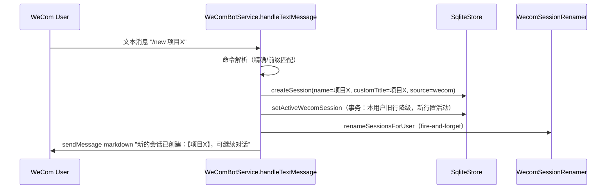

# Plan: WeCom Bot `/clear` & `/new` Session Commands

## Summary

为 WeCom bot 增加 `/clear` 与 `/new` 两个等价斜杠命令（可选标题）：各自创建新会话、通过显式标记将其设为用户当前会话、保留旧会话、回复带标题的确认消息。以 `wecom_user_sessions` 上的新增列取代「按创建时间取最新」的当前会话推断，不做回填。

---

## Problem Frame

当前每个 WeCom 用户只有一个永不失效的会话，且 WeCom 路径完全没有斜杠命令分发——入站文本被直接推给 Claude 会话。用户无法开启干净的新对话，飞书 bot 却已有 `/new`。本次改动把同样能力带到 WeCom，并用显式「当前会话」标记取代时间戳推断，使用户拥有多个会话时当前会话始终明确。来源：`docs/brainstorms/2026-06-25-wecom-clear-new-session-requirements.md`。

---

## Requirements

承自 origin 文档，按关注点分组（R-ID 与 origin 一致）。

### 命令解析与分发

- R1. 入站文本起始 token 为 `/clear` 或 `/new` 时识别为命令，其后可跟可选标题（第一个空格之后的全部文本）。
- R2. `/clear` 与 `/new` 行为完全等价（别名）。
- R3. 命令在转发给 Claude 会话之前被拦截，字面命令不得作为一轮对话被处理。

### 会话创建与当前会话跟踪

- R4. 每个命令创建一个 `source: wecom` 的新会话，并将其设为用户当前活动会话，取代此前活动会话。
- R5. 每个 WeCom 用户同一时刻只有一个活动会话；激活新会话使旧活动会话退居非活动；当前会话由显式 per-user 标记标识，不得用创建时间推断。
- R6. 用户后续普通（非命令）消息发往其当前活动会话。
- R7. 激活新会话时既有会话被保留（不删除），并在会话历史查看器中可见。
- R8. 已存在会话但无当前标记的用户，改动上线后下一条消息开启全新会话；既有会话不做回填。

### 标题处理

- R9. 提供标题（如 `/new 项目X`）时，新会话使用该标题。
- R10. 未提供标题时，使用默认 WeCom 标题（bot 现有自动创建会话所用的默认标题）。
- R11. 用户显式标题优先于自动改名功能，自动改名不得覆盖它。

### 回复

- R12. （偏离 origin R12 的 i18n 要求，详见 KTD）创建并激活成功后回复包含新会话标题的确认消息：「新的会话已创建：【&lt;title&gt;】，可继续对话」，其中 &lt;title&gt; 为用户提供的标题，或未提供时的默认 WeCom 标题（R10）。文案为硬编码中文字符串、不引入服务端 i18n，沿用飞书 `/new` 既有模式。

---

## Key Technical Decisions

- **当前会话标记为 `wecom_user_sessions` 上的新列（用户决定），单活动性由事务保证。** 不同于飞书的独立 `feishu_active_sessions` 表（靠主键 upsert 保证唯一），列方案靠应用层事务「先全员降级、再标记新行」来保证每用户单活动。代价是无数据库级约束，由 `setActiveWecomSession` 的事务与测试覆盖。
- **命令分发在 `handleTextMessage` 内拦截，镜像飞书 `createDispatchHandler`。** 匹配为精确 `/clear`/`/new` 或前缀 `/clear `/`/new `（带空格），故 `/newer` 不会误触发；命中则走命令分支，否则继续既有推给 agent 的路径。
- **`customTitle` 透传到创建路径以落实 R11。** 自动改名器按 `customTitle`（而非 `name`）判断是否跳过（`wecom-session-renamer.ts` `isEligibleForRename`），而当前创建路径不暴露该字段，故需扩展 `CreateSessionInput`/`createLocalSession` 在创建时一并写入 `custom_title`。
- **回复走既有 WeCom markdown `sendMessage`，硬编码中文，偏离 origin R12 的 i18n 要求。** 服务端无 i18n 基础设施，飞书 `/new` 亦用硬编码字面量；为一处文案新建服务端 i18n 不划算（用户在范围确认中已接受此偏离）。
- **不做回填，靠 `getOrCreateSession` 的「无活动则创建并激活」实现 R8。** 既有行默认非活动；markerless 用户与新用户的首条普通消息都会走到创建并激活分支，自然开启新会话。
- **进行中发送 `/new` 是安全的。** `/new` 只改会话簿记（建会话、标记活动、触发改名、回复），不碰任何正在进行的对话轮次；新会话与旧会话是独立 runtime，互不干扰。这解决了 origin 遗留的「进行中发命令」开放问题。
- **`/new` 创建后 fire-and-forget 触发改名器。** 与 `getOrCreateSession` 一致，使多会话编号即时刷新；改名器会按 `customTitle` 跳过带标题会话。
- **主动消息路径一并迁移到活动会话查找（用户决定）。** 范围内活动会话总等于最近创建的会话，故对已有活动会话的用户，`getActiveWecomSession` 与按时间倒序结果一致；迁移主要为消除「交互用活动标记、主动用时间戳」的定义分裂，并统一 markerless 边界（无活动会话 → 队列等待，与主动消息既有「无会话即排队」语义一致）。

---

## High-Level Technical Design

命令流（`/clear`/`/new` 等价）：

普通消息流改走活动会话查找：`getOrCreateSession` 以 `getActiveWecomSession` 取代「按 `createdAt` 倒序取最新」；命中且有效则复用，否则创建并 `setActiveWecomSession`（覆盖新用户与 markerless 老用户的 R8 路径）。活动状态是 per-user 单值：任一时刻每用户至多一行 `isActive=1`，由 `setActiveWecomSession` 事务维护。主动消息路径（`wecom-send`、`wecom-queue-worker`）同样改用 `getActiveWecomSession`，使「当前会话」跨路径统一定义（见 U6）。

---

## Implementation Units

### U1. Schema: 在 `wecom_user_sessions` 增加 active 列

- **Goal:** 为 `wecom_user_sessions` 增加默认为 0 的 `isActive` 列，经幂等迁移落地。
- **Requirements:** R5, R8（默认 0 即「不回填」）。
- **Dependencies:** 无。
- **Files:** `src/server/storage/sqlite-store.ts`；测试 `src/server/storage/sqlite-store.test.ts`。
- **Approach:** 新增 `migrateWecomUserSessionsActiveColumn()`，按 `PRAGMA table_info` 探测后 `ALTER TABLE ... ADD COLUMN isActive INTEGER NOT NULL DEFAULT 0`，并在构造器迁移块（`sqlite-store.ts:258-264`）调用。既有行因默认值而非活动，无需回填。
- **Patterns to follow:** `workspaces.lastOpenedAt` 迁移（`sqlite-store.ts:66-70`）。
- **Test scenarios:** 迁移幂等（连续调用两次不报错）；迁移后列存在且默认 0；既有行 `isActive=0`。
- **Verification:** 隔离 store 上列存在；既有行全部非活动。

### U2. Storage: 活动会话查询与激活方法

- **Goal:** 新增 `getActiveWecomSession`（带陈旧自愈）与 `setActiveWecomSession`（事务化「先降级再激活」），保证每用户单活动。
- **Requirements:** R4, R5, R7。
- **Dependencies:** U1。
- **Files:** `src/server/storage/sqlite-store.ts`；测试 `src/server/storage/sqlite-store.test.ts`。
- **Approach:** `getActiveWecomSession(workspaceId, wecomUserId)` 取 `isActive=1` 行，并校验会话仍存在（镜像飞书 `getFeishuActiveSession` 的陈旧清理，`sqlite-store.ts:877-909`），陈旧则清标记返回 null。`setActiveWecomSession` 包在 `db.transaction` 内：先 `UPDATE ... SET isActive=0 WHERE workspaceId=? AND wecomUserId=?`，再将目标行置 `isActive=1`。
- **Patterns to follow:** 飞书 `setFeishuActiveSession`/`getFeishuActiveSession`（`sqlite-store.ts:877-909`），改为列式。
- **Test scenarios:** 无活动返回 null；激活后可查；再次激活使前一行降级（单活动不变量）；旧会话仍可经 `listWecomSessionsByUser` 列出（保留）；活动行对应会话被删后自愈清零返回 null；两用户各自独立。
- **Verification:** 任意激活序列后，每用户至多一行活动。

### U3. Session 创建: 透传 customTitle

- **Goal:** 扩展会话创建以接受可选 `customTitle`，使 `/new` 标题作为受保护标记落库。
- **Requirements:** R9, R11。
- **Dependencies:** 无（与 U1/U2 并行）。
- **Files:** `src/server/models/session.ts`（`CreateSessionInput`）、`src/server/services/chat-service.ts`（`createSession`）、`src/server/storage/sqlite-store.ts`（`createLocalSession`）；测试 `src/server/storage/sqlite-store.test.ts`。
- **Approach:** 在 `CreateSessionInput` 增 `customTitle?: string` 并经 `chatService.createSession` 透传；`createLocalSession` 当前为位置参数签名且其 `INSERT` 未含 `custom_title`，故需三处改动：(1) `createLocalSession` 位置签名增 `customTitle` 参数；(2) `INSERT` 语句增 `custom_title` 列与对应值（参照 `syncSdkSession` 的列清单，`sqlite-store.ts:1088` 附近）；(3) 返回的 `ChatSession` 在有值时填 `customTitle`。提供标题时同时写 `name` 与 `custom_title`。改名器 `isEligibleForRename`（`wecom-session-renamer.ts:102-108`）已对 `customTitle` 跳过，故带标题会话天然受保护。
- **Patterns to follow:** 既有 `CreateSessionInput` 字段透传；`custom_title` 列（`sqlite-store.ts:165`）与 `ChatSession.customTitle`（`models/session.ts:20`）已存在。
- **Test scenarios:** 带 `customTitle` 创建 → 行 `custom_title` 已写且 `ChatSession.customTitle` 有值；不带 → `custom_title` NULL；带 `customTitle` 会话经 `renameSessionsForUser` 后名称不变；默认会话仍被改名。
- **Verification:** 带标题会话在一次改名器运行后保持不变。

### U4. 普通消息改走活动会话查找

- **Goal:** `getOrCreateSession` 改用活动标记解析当前会话；无活动时创建并激活新会话（覆盖新用户与 markerless 老用户的 R8）。
- **Requirements:** R6, R8。
- **Dependencies:** U1, U2。
- **Files:** `src/server/services/wecom-bot-service.ts`（`getOrCreateSession` 约 `:398-426`）；测试 `src/server/services/wecom-bot-service.test.ts`。
- **Approach:** 以 `getActiveWecomSession` 取代 `getWecomSession`（按时间倒序）。命中且有效则复用；否则走既有创建路径建会话并 `setActiveWecomSession` 标记活动——这使 markerless 老用户与新用户都开启新会话（R8）。保留既有 fire-and-forget 改名触发。
- **Patterns to follow:** 飞书 `getOrCreateSession` 的活动指针解析（`feishu-bot-service.ts:386-408`）。
- **Test scenarios:** Covers AE5。活动会话存在且有效 → 复用，不新建；无活动（新用户）→ 创建并标记活动；无活动（有旧非活动行的老用户，markerless）→ 创建新会话、旧行不被选中（AE5）；活动陈旧被清 → 创建新会话；后续消息复用同一活动会话。
- **Verification:** 普通消息发往显式活动会话，绝不按时间戳取最新。

### U5. 命令分发与 `/clear`、`/new` 处理

- **Goal:** 在 `handleTextMessage` 推给 agent 之前拦截 `/clear`/`/new`；创建并激活新会话、保留旧会话、触发改名、回复带标题确认。
- **Requirements:** R1, R2, R3, R4, R5, R7, R9, R10, R11, R12。
- **Dependencies:** U1, U2, U3, U4。
- **Files:** `src/server/services/wecom-bot-service.ts`（`handleTextMessage` 约 `:237-266`）；测试 `src/server/services/wecom-bot-service.test.ts`。
- **Approach:** `handleTextMessage` 在推 agent 前，判断 trim 后文本等于 `/clear`/`/new` 或以 `/clear `/`/new ` 开头（精确或带空格前缀，故 `/newer` 不触发，镜像 `feishu-bot-service.ts:225-236`）。命中则解析标题（首空格后文本，trim），经创建路径建会话：有标题时 `name` 与 `customTitle` 均为标题，无标题时用 WeCom 默认标题、不设 `customTitle`；调 `setActiveWecomSession`；fire-and-forget 触发改名器；经 `conn.client.sendMessage(userId, { msgtype:'markdown', markdown:{content} })` 回复。回复文案统一为「新的会话已创建：【&lt;title&gt;】，可继续对话」，&lt;title&gt; 为用户提供或默认标题。try/catch 包裹，失败给通用错误回复（镜像飞书 `handleNewSessionCommand` 错误路径）。可抽小私有助手（如 `instantiateWecomSession`）收敛「创建+激活+改名」。
- **Patterns to follow:** 飞书 `createDispatchHandler`（`:208-242`）、`handleNewSessionCommand`（`:410-435`）、`instantiateFeishuSession`（`:574-587`）；WeCom 回复 `sendMessage` markdown（`wecom-bot-service.ts:458-461`）。
- **Test scenarios:** Covers AE1–AE4。`/new 项目X` → 新会话标题「项目X」、活动、旧会话降级但保留、回复含「项目X」；`/clear 项目X` 与 `/new 项目X` 结果完全一致（别名）；`/new` 无标题 → 默认标题会话、回复含默认标题；`/new` 文本未被转发给 agent、不产生对话轮次；`/newer`/`/newx` 不触发命令；标题多余空格被 trim；`sendMessage` 间谍收到 markdown 内容；连接未就绪 → 通用错误回复且不抛；仅提供标题时才设 `customTitle`。（markerless 老用户首条普通消息的场景归 U4 / AE5。）
- **Verification:** 发送 `/clear`/`/new` 产生新活动会话与确认回复；后续消息进入该会话。

### U6. 主动消息路径统一到活动会话查找

- **Goal:** 把主动消息路径的「当前会话」解析也改为活动标记，消除交互路径与主动路径两套定义。
- **Requirements:** R5, R6（跨路径的「当前会话」一致）。
- **Dependencies:** U2。
- **Files:** `src/server/routes/wecom-send.ts`（`:69`）、`src/server/services/wecom-queue-worker.ts`（`:136`、`:153`）；测试 `src/server/services/wecom-queue-worker.test.ts`（或对应既有测试）。
- **Approach:** 将上述三处 `getWecomSession`（按时间倒序）改为 `getActiveWecomSession`。范围内活动会话总等于最近创建的会话，故对已有活动会话的用户两者结果一致；本单元主要为消除定义分裂并统一 markerless 边界。无活动会话的收件人查不到会话时，沿用队列既有的「等收件人有会话再投递」语义——`canDispatch`（`:136`）已把关，`:153` 的非空断言在其后仍安全。
- **Patterns to follow:** U4 的活动会话解析方式。
- **Test scenarios:** 收件人有活动会话 → 主动消息投到该会话；收件人无活动会话（markerless）→ `canDispatch` 返回未就绪、消息继续排队，不误投到旧的时间倒序会话；`:153` 仅在 `canDispatch` 通过后到达（断言安全）。
- **Verification:** 交互与主动两条路径都用 `getActiveWecomSession` 解析「当前会话」，无残留时间倒序解析。

---

## Scope Boundaries

### Deferred to Follow-Up Work

- 从 WeCom 列出/切回旧会话的 `/session` 命令（活动标记已为其打好基础）。
- 移除/弃用旧 `getWecomSession`（按时间倒序）：U4 与 U6 迁移完所有已知调用方后它即成死代码，可在后续清理（列为跟进，避免本次改动面过大）。

### Outside this change

- 服务端 i18n 基础设施（bot 回复沿用硬编码中文）。
- 独立 `wecom_active_sessions` 表（用户已选定列方案）。
- 回填既有会话的活动标记。
- 对飞书 bot、GUI 会话界面、或 `/clear`/`/new` 删除旧会话语义的改动。

---

## Risks & Dependencies

- **线上用户行为变化（按设计）：** 既有 WeCom 用户上线后首条消息会开启新会话（R8）；旧会话仍在历史查看器但不再「当前」。属预期，建议随版本说明提示。
- **单活动性靠应用层事务：** 列方案无数据库级约束，依赖 `setActiveWecomSession` 事务与 U2 测试兜底。
- **来源依赖：** origin `docs/brainstorms/2026-06-25-wecom-clear-new-session-requirements.md`；测试隔离约定（`test-utils/test-env` 首导入、`createIsolatedStore()`/`:memory:`、`resetData()`）为强制项。
- **无既有沉淀：** `docs/solutions/` 仅有测试隔离约定适用，无 WeCom 会话管理/迁移先例；上线后可用 `/ce-compound` 记录。

---

## Open Questions

- 列名定稿：`isActive` 还是 `isCurrent`（实现期确认）。
- `getWecomSession`（按时间倒序）是否还有其他调用方；若无则按 Deferred 清理。
- `getWecomSession`（按时间倒序）的调用方已由 U4/U6 迁移完毕（grep 已知 `wecom-send.ts`、`wecom-queue-worker.ts`）；如发现其他调用方，一并迁到 `getActiveWecomSession`。
- WeCom 是否对单用户消息串行处理（飞书用 `runForUser`）；若否，依赖 `setActiveWecomSession` 事务保证原子性，并记录残余竞态窗口。
- 标题长度/校验边界（WeCom 消息上限）。

---

## Acceptance Examples

承自 origin AE1–AE5。

- AE1. **Covers R1-R7, R9, R12.** 用户当前会话为 S1 时发送 `/new 项目X`：创建标题「项目X」的新会话、标记为当前（S1 降级但保留），回复「新的会话已创建：【项目X】，可继续对话」，下一条消息进入新会话。
- AE2. **Covers R1, R2.** 同一用户发送 `/clear 项目X`，结果与 AE1 完全一致。
- AE3. **Covers R10, R12.** 发送无标题 `/new`：新会话用默认标题，确认消息显示该默认标题（如「新的会话已创建：【&lt;默认标题&gt;】，可继续对话」）。
- AE4. **Covers R3.** 发送 `/new`：字面文本不作为用户消息转发给 Claude 会话（无多余对话轮次）。
- AE5. **Covers R5, R7, R8.** 无当前标记的老用户上线后发送「你好」：创建并标记全新会话，「你好」成为首轮，旧会话在历史查看器仍可见。

---

## Sources / Research

- WeCom 消息处理（无命令分发）：`src/server/services/wecom-bot-service.ts` `handleTextMessage`（`:237-266`）、`getOrCreateSession`（`:398-426`）。
- WeCom 回复路径：`conn.client.sendMessage(userId, { msgtype:'markdown', markdown:{content} })`（`wecom-bot-service.ts:458-461` 等）。
- 当前会话按时间推断：`getWecomSession`（`src/server/storage/sqlite-store.ts:652`）；多会话插入：`setWecomSession`（`:659`）；`listWecomSessionsByUser`（`:676`）；表定义（`:72-81`）；迁移机制与 `ALTER TABLE` 模板（`:258-264`、`:66-70`）。
- 飞书活动会话参照（概念同型）：`setFeishuActiveSession`/`getFeishuActiveSession`（`sqlite-store.ts:877-909`）、`feishu_active_sessions` 表（`:120-128`）。
- 飞书 `/new` 参照实现：`createDispatchHandler`（`src/server/services/feishu-bot-service.ts:208-242`）、`handleNewSessionCommand`（`:410-435`）、`instantiateFeishuSession`（`:574-587`）。
- 自动改名与 `customTitle` 保护门：`src/server/services/wecom-session-renamer.ts` `isEligibleForRename`（`:102-108`）、`renameSessionsForUser`（`:6-45`）；触发点 `wecom-bot-service.ts:417-422`。
- 会话模型与创建：`src/server/models/session.ts`（`ChatSession`、`CreateSessionInput`、`UpdateSessionInput`）、`src/server/services/chat-service.ts` `createSession`（`:167-169`）、`sqlite-store.ts` `createLocalSession`（`:1005`+）。
- 测试约定：`src/server/test-utils/test-env.ts`（强制首导入）、`src/server/services/feishu-bot-service.test.ts`（`/new` 参照测试）、`docs/solutions/conventions/use-isolated-test-database-for-comate.md`。
