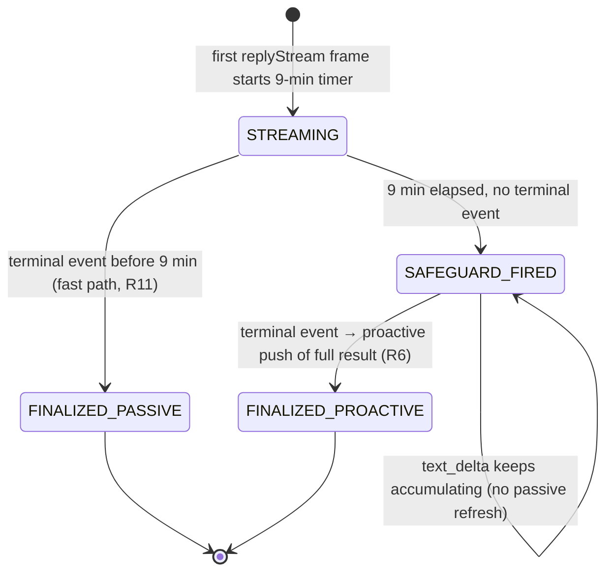

# feat: WeCom Long-Reply Timeout Safeguard and Proactive Result Delivery

## Summary

Add a 9-minute safety threshold to WeCom bot passive-reply streaming. When a turn has not produced a final result within 9 minutes, the bot sends the user a status notice, stops refreshing the passive reply (letting WeCom auto-end it at its 10-minute limit), and keeps the agent running. When the result finally arrives, it is pushed via proactive `sendMessage`, split into UTF-8-safe chunks when it exceeds WeCom's 20480-byte limit. A small runtime-lifecycle guard ensures an in-flight turn (including a long-pending approval) is not torn down by idle-close before the result can be delivered (see origin).

## Problem Frame

WeCom requires a streaming passive reply to set `finish=true` within 10 minutes or it auto-ends. The current stream-reply handler finalizes only on a terminal event (`result`, `interrupted`, `error_note`) with no intermediate safeguard. Long turns — extended thinking, multi-tool chains, long-pending approvals — can be cut off mid-stream while the Claude Code session keeps running, leaving the user with a frozen or truncated message and no eventual answer. Worse, the cached bot `SessionRuntime` can itself be torn down by the shared idle-close timer while such a turn is still in flight, so the terminal event never reaches a live handler. The fix is an additive safeguard path plus the runtime guard that makes it reliable; the existing fast path is preserved.

---

## Requirements

Traceable to the origin document. Coverage is full — every origin R/F/AE that affects implementation is referenced below.

- R1–R4, R9 (safeguard trigger + state): a 9-minute timer started on the first passive frame; on fire, send the status notice, stop passive refreshes, mark the passive channel closed, and do not actively finish the original message. → U3
- R5 (overridden below): after the safeguard, the handler keeps accumulating answer text but stops *refreshing* the passive reply. → U3, U4
- R6, R10, R11 (final delivery + error handling + fast path): on a terminal event, deliver the result proactively; guard empty results; log/retry send failures; leave the under-9-minute path unchanged. → U4
- R7, R8 (byte-safe splitting): measure UTF-8 bytes, chunk under 20480, prefer line/word boundaries, optional part indicator. → U1

**Override of origin R5 (carried from planning):** origin R5 says post-safeguard `text_delta` events are "ignored." This plan narrows that to *passive refresh* being ignored while accumulation continues — because the terminal `result` event carries no answer text of its own (the answer lives in `text_delta` events), discarding post-safeguard deltas would leave the final push empty. The proactive push therefore sends the **full accumulated result** (user-confirmed default), which may overlap text the user already saw in the auto-ended original reply.

**Plan-internal enabling change (not an origin requirement):** guard the shared idle-close timer so an in-flight turn holds the runtime open. Without it, the safeguard cannot deliver a result for the very long-turn cases (notably long-pending approvals) it targets. → U2

---

## Actors

- A1. WeCom User — expects a usable response even for long tasks.
- A2. Claude Code Agent — keeps running after the safeguard; its terminal event triggers delivery.
- A3. Bot Adapter (`wecom-stream-reply.ts`) — owns the timer, the passive/proactive switch, and the splitter.

---

## Key Technical Decisions

- **9-minute threshold, 1-minute buffer.** WeCom's hard limit is 10 minutes; firing at 9 leaves slack for the status notice to land before cutoff and absorbs clock drift (see origin, Key Decisions).
- **Stop the refresh, keep accumulating.** After the safeguard, `replyStreamNonBlocking` is no longer called, but `responseText` keeps growing so the final push has the complete answer. This overrides origin R5's literal "ignored" wording for the reason above.
- **Do not actively finish the original message.** Sending `finish=true` at the safeguard would race WeCom's own cutoff and adds state. Letting WeCom auto-end is simpler and matches the origin decision.
- **Push the full accumulated result** (user-confirmed). Self-contained, matches the existing `finalizeStream` semantics; overlaps the auto-ended original reply but never leaves the user stitching fragments.
- **Splitter measures UTF-8 bytes via `Buffer.byteLength`.** Chunk target stays at or under 20480; a small margin is reserved when a part indicator is appended so the indicator never pushes a chunk over the limit.
- **Reuse the proven proactive channel.** The existing `finalizeStream` fallback already delivers via `conn.client.sendMessage(wecomUserId, { msgtype: 'markdown', markdown: { content } })` using the encrypted `from.userid`. The safeguard reuses exactly this path — no new wiring or credentials.
- **Guard idle-close on `isProcessingTurn()` (resolved in review).** The shared `scheduleIdleClose` callback (`src/server/services/chat-service.ts`) currently closes the runtime unconditionally; it is only re-armed by SDK-message activity, so a silent in-flight turn (a pending approval with no streaming output) can be torn down at 10 minutes before the terminal event arrives. Adding an `isProcessingTurn()` check that re-schedules instead of closing is the only way the brainstorm's named long-pending-approval case delivers a result. This change is shared across GUI and bot sessions — see Risks.

---

## High-Level Technical Design

The reply handler moves through a small lifecycle. The safeguard adds one transition (STREAMING → SAFEGUARD_FIRED) and one terminal state (FINALIZED_PROACTIVE); the existing fast path (→ FINALIZED_PASSIVE) is unchanged.

Orthogonal to the reply lifecycle, the runtime lifecycle guard (U2) keeps the `SessionRuntime` alive while any turn is in flight, so a SAFEGUARD_FIRED handler still has a live runtime to receive the terminal event — including for silent turns (pending approvals, tools with no output) that today would be reclaimed by idle-close. Safeguard firing is idempotent (`passiveClosed` flag gates the status notice to once); the timer is cleared on every exit (fast-path finalize, safeguard fire, handler cleanup, terminal push).

---

## Implementation Units

### U1. UTF-8 byte-safe message splitter

- **Goal:** A pure utility that splits a string into chunks each at or under 20480 UTF-8 bytes, preferring line then word boundaries, with an optional `(n/N)` part indicator when more than one chunk results.
- **Requirements:** R7, R8
- **Dependencies:** none
- **Files:**
  - `src/server/utils/wecom-message-split.ts` (new)
  - `src/server/utils/wecom-message-split.test.ts` (new, `node:test`)
- **Approach:** A single exported function taking the text and the byte limit (default 20480). Measure with `Buffer.byteLength(chunk, 'utf8')`. Walk the string accumulating into a chunk until adding the next segment would exceed (limit − indicator margin). Prefer splitting on `\n`, then on a space, then on a safe character boundary (never inside a UTF-8 multi-byte sequence — iterate by code point, not byte). Append ` (n/N)` to every chunk only when the result count exceeds one. Return `[]` for empty/whitespace-only input so the caller can skip sending.
- **Patterns to follow:** Mirror the style of `src/server/utils/bot-placeholder.ts` and `src/server/utils/debounce.ts` (small, pure, named exports; co-located `node:test` file). Follow the server test-isolation rule: import `test-utils/test-env` as the first statement.
- **Test scenarios:**
  - **Happy path.** Input of 1000 ASCII bytes → one chunk, no indicator.
  - **At-limit boundary.** Input exactly 20480 bytes → one chunk, no split (WeCom allows ≤ 20480).
  - **Over-limit ASCII with newlines.** 30000 bytes across many `\n`-delimited lines → multiple chunks, each ≤ 20480, every split falls on a newline, each chunk carries ` (n/N)`.
  - **Multibyte UTF-8 (CJK).** A long Chinese string (3 bytes/char) sized to land mid-character at the naive byte boundary → no chunk splits a character; every chunk's `Buffer.byteLength` ≤ 20480.
  - **Word-boundary fallback.** Over-limit input with no newlines but spaces → splits fall on spaces.
  - **Long-token fallback.** A single token longer than the budget (no newline, no space) → split at a character boundary, still char-safe and ≤ 20480.
  - **Indicator byte safety.** A result that chunks into 2 parts → indicator bytes do not push either chunk over 20480 (margin reserved).
  - **Empty input.** `''` and whitespace-only → returns `[]`.
- **Verification:** Splitter unit tests pass; `npm run test:server` green. Every chunk in every scenario satisfies `Buffer.byteLength(chunk, 'utf8') <= 20480`.

### U2. Hold cached runtime open during an in-flight turn

- **Goal:** Guard the shared idle-close timer so a `SessionRuntime` mid-turn (streaming or blocked on an approval/tool with no output) is re-scheduled rather than torn down — enabling U3/U4 to deliver a result for long, silent turns.
- **Requirements:** plan-internal enabling change (underpins R6 for the long-pending-approval case)
- **Dependencies:** none
- **Files:**
  - `src/server/services/chat-service.ts` (modify — `scheduleIdleClose`)
  - `src/server/services/chat-service.test.ts` (modify, `node:test`)
- **Approach:** Inside `scheduleIdleClose`'s `setTimeout` callback, before calling `closeRuntime`, look up the runtime via `getRuntimeIfExists(sessionId)` and check `isProcessingTurn()`. If a turn is in flight, re-arm the timer (call `scheduleIdleClose(sessionId)` to cancel-and-reschedule) and return without closing; otherwise close as today. Streaming turns already reset the timer via per-message activity, so the new check specifically covers silent in-flight turns that today would be reclaimed. This is a shared lifecycle change affecting GUI and bot sessions.
- **Patterns to follow:** The existing `__setIdleGracePeriodForTesting(ms)` test hook shortens the grace period for deterministic tests — use it rather than real 10-minute waits. Use the public `getRuntimeIfExists` and the runtime's public `isProcessingTurn()`.
- **Test scenarios:**
  - **Idle runtime still closes (regression guard).** A runtime not processing a turn → after the (shortened) grace period, `closeRuntime` fires and the runtime is removed from the active set. Existing behavior preserved.
  - **Covers F2 enabling case — in-flight turn holds open.** A runtime with `isProcessingTurn()` true (simulate a pending approval or active stream) → after the grace period the callback re-schedules and does **not** close; the runtime remains live.
  - **Turn completes, then closes.** After the in-flight turn ends (`isProcessingTurn()` false) → the next grace expiry closes the runtime normally.
  - **Already-closed at fire time.** The runtime was closed between scheduling and firing → the callback no-ops (no throw, no double-close).
- **Verification:** `chat-service.test.ts` green with the shortened grace period; idle (non-processing) runtimes still close exactly as before; processing runtimes survive past the grace period.

### U3. Nine-minute safeguard and passive-channel closure

- **Goal:** Add the timer-driven safeguard to `createStreamReply`: send the status notice, stop passive refreshes, mark the channel closed, and keep the agent running — without touching the original message.
- **Requirements:** R1, R2, R3, R4, R9
- **Dependencies:** U2 (so a silent long turn still has a live runtime to reach the terminal event)
- **Files:**
  - `src/server/services/wecom-stream-reply.ts` (modify)
  - `src/server/services/wecom-stream-reply.test.ts` (modify, `node:test`)
- **Approach:** Add module constants for the 9-minute threshold and the status-notice text. In `createStreamReply`, start a `setTimeout` at stream construction (the placeholder frame is dispatched fire-and-forget at construction, so the clock starts then regardless of whether the first async frame lands). Store the timer in a closure variable and clear it at every stream exit. On fire (guarded by a `passiveClosed` flag so it runs once): send the notice via `conn.client.sendMessage(wecomUserId, …)`, set `passiveClosed = true`, call `stopAnimation()`/`stopPlaceholderAnimation()` and abort the debounce flush. Do **not** call `replyStream(..., true)`. In the `text_delta` branch, short-circuit before `flushStream()` when `passiveClosed` — but still append to `responseText` so U4 has the full text. Clear the timer in `handler.cleanup`, in the fast-path `finalizeStream`, and when the safeguard fires. Cover F2 (status + passive end) and F1/AE1 (fast path untouched).
- **Execution note:** Use fake timers (or the existing short-real-wait pattern already in the suite) for the 9-minute case rather than a real 9-minute wait.
- **Patterns to follow:** Existing `finalizeStream` / `clearPlaceholder` / `stopAnimation` structure in the same file; the `replyStreamNonBlocking(…).catch(log)` non-blocking-send convention.
- **Test scenarios:**
  - **Covers F1 / AE1 — fast path preserved.** Terminal event arrives before 9 minutes → no status notice sent, `replyStream(..., true)` is called exactly once (existing finalize), timer is cleared. Assert the status-notice `sendMessage` was never called.
  - **Covers F2 — safeguard fires.** 9 minutes elapse with no terminal event → status notice sent once via `sendMessage`, `replyStreamNonBlocking` is not called afterward, `replyStream(..., true)` is never called (no active finish). Assert `passiveClosed` gates the notice to once.
  - **Idempotent firing.** The timer callback and a near-simultaneous terminal event do not send the notice twice (flag guard).
  - **Deltas stop refreshing but keep accumulating.** After the safeguard, a `text_delta` event does not trigger `replyStreamNonBlocking`, yet `responseText` includes the delta's text (assert via the state U4 reads).
  - **Timer cleanup.** `handler.cleanup()` clears the safeguard timer (no leaked timer / no post-cleanup notice).
  - **Approvals/questions still work.** After the safeguard, a `pending_approval` / `pending_question` event still emits its template card (the card path is independent of passive refresh).
- **Verification:** Modified tests green; the existing placeholder/animation tests still pass unchanged; a turn under 9 minutes behaves exactly as before.

### U4. Proactive final-result delivery and error handling

- **Goal:** When a terminal event arrives after the safeguard, push the full accumulated result via proactive `sendMessage`, split through U1, guarding empties and retrying/log failures — while the under-9-minute path keeps using `finalizeStream`.
- **Requirements:** R5, R6, R10, R11
- **Dependencies:** U1 (splitter), U2 (live runtime to receive the terminal event)
- **Files:**
  - `src/server/services/wecom-stream-reply.ts` (modify)
  - `src/server/services/wecom-stream-reply.test.ts` (modify, `node:test`)
- **Approach:** Introduce a terminal dispatcher used by the `result` / `interrupted` / `error_note` branches. If `passiveClosed` is false → call the existing `finalizeStream()` (fast path, R11). If true → run a new proactive finalize: `clearPlaceholder()`, then if `responseText.trim()` is non-empty, split via U1 and send each chunk sequentially through `conn.client.sendMessage(wecomUserId, { msgtype: 'markdown', markdown: { content } })`; set a `streamFinalized`-equivalent flag so later events no-op. On a send rejection, log and retry the failing chunk once; on second failure, stop (the user already has the status notice). The error-notice branch keeps appending its `⚠️` text before the proactive push so errors after the safeguard are still surfaced. Clear the safeguard timer here too.
- **Patterns to follow:** The existing `finalizeStream` fallback-to-`sendMessage` block (same send shape, same `markdown` body), and its `catch`-and-log style.
- **Test scenarios:**
  - **Covers AE2 — split delivery.** Safeguard has fired; terminal arrives with ~30000 bytes of accumulated UTF-8 text → exactly two `sendMessage` calls, each payload `Buffer.byteLength` ≤ 20480, sent in order.
  - **Covers AE3 — empty guard.** Safeguard fired but `responseText` is empty/whitespace at terminal → no result `sendMessage` is sent (the user has only the status notice).
  - **Full-result content.** After the safeguard, text generated both before and after the threshold is present in the pushed payload (accumulation continued per U3).
  - **Fast path still passive.** Terminal before the threshold → `replyStream(..., true)` used, zero proactive `sendMessage` calls (R11).
  - **Send-failure handling.** `sendMessage` rejects on first attempt → retried once; on second rejection, no throw (turn/error handling stays intact), failure logged.
  - **Idempotent terminal.** A second terminal event after proactive finalize → no additional sends.
- **Verification:** Modified tests green; under-9-minute turns are byte-for-byte unchanged from today; over-9-minute turns deliver one status notice plus one or more result chunks, each within the byte limit.

---

## Test Strategy

- **Unit (node:test):** U1 splitter in isolation (pure, fast, exhaustive boundary coverage). U2 extends `chat-service.test.ts` using the `__setIdleGracePeriodForTesting` hook for deterministic idle-close timing. U3/U4 extend `wecom-stream-reply.test.ts` using a mock `conn` (already present in the suite) and fake/short-wait timers for the 9-minute case. Follow the mandatory server test-isolation rule (`test-utils/test-env` first import; `node:test`, not Vitest).
- **Integration shape:** the stream-reply suite already mocks `replyStream`/`replyStreamNonBlocking`/`sendMessage` — assertions assert call counts, payload byte sizes, and ordering rather than real WeCom I/O.
- **Manual/spot-check (deferred to execution):** a real long turn against a configured bot to confirm the status notice lands and the proactive result follows; and a long-pending-approval turn to confirm the runtime stays open (U2) and the result still delivers. Not automatable without a live WeCom endpoint.

---

## Scope Boundaries

### In scope (enabling change)

- U2 touches the **shared** `SessionRuntime` idle-close path used by both GUI and bot sessions. It is included because the safeguard cannot deliver results for silent long turns without it. This is a deliberate cross-cutting inclusion, not scope creep.

### Out of scope

- Per-conversation rate limiting (WeCom's 30/min, 1000/hour quotas) — explicitly deferred in the origin.
- Timeout handling for non-text inbound messages (files, images, voice).
- Changes to WeCom bot connection, session creation, user mapping, or tool-permission policy.
- UI or rich-formatting changes beyond the optional `(n/N)` part indicator.

### Deferred to Follow-Up Work

- Making the 9-minute threshold and the status-notice text workspace-configurable (currently module constants).
- Per-conversation send-rate limiting to harden against the 30/min quota under bursty multi-chunk results.
- A matching safeguard for the Feishu streaming-reply path, which shares the same long-task risk.

---

## Risks & Dependencies

- **Shared-lifecycle blast radius (U2).** The idle-close guard changes behavior for GUI sessions too: a stalled in-flight turn (e.g., a GUI session blocked on an approval) will now stay alive until the turn ends or the session is explicitly closed, rather than being silently torn down at 10 minutes. This is preferable to mid-approval teardown, but a genuinely hung turn is no longer reclaimed by idle-close — it relies on the turn completing or an explicit close. Worth a manual check during execution.
- **Timer/terminal race.** A terminal event landing near 9 minutes could race the safeguard. Mitigation: clear the timer on every terminal branch; gate the safeguard on a `passiveClosed` flag so the notice fires at most once. (U3)
- **WeCom send failure.** If the proactive push fails, the user is left with only the status notice. Accepted per the origin's dependencies; mitigated by a single retry (U4).
- **Byte-limit accuracy.** Correctness depends on `Buffer.byteLength` matching WeCom's UTF-8 accounting; covered by U1 boundary tests.

---

## Open Questions

### Deferred to implementation

- Exact fake-timer mechanism to use in the `node:test` suites for the 9-minute and idle-close cases (both have test hooks available; pick the most deterministic).
- Whether to prepend or append the `(n/N)` part indicator (append is the default; cheap to flip during implementation).
- Final shape of the terminal dispatcher in U4 (inline branch vs. a small helper) — a local readability call, not a plan-level decision.

---

## Sources & Research

- WeCom bot API (user-cited, `developer.work.weixin.qq.com/document/path/101463`): passive streaming replies must set `finish=true` within 10 minutes or auto-end; single markdown messages are capped at 20480 UTF-8 bytes; proactive replies are allowed within a 24-hour window per conversation, with 30/min and 1000/hour per-conversation ceilings.
- Current implementation: `src/server/services/wecom-stream-reply.ts` finalizes only on `result`/`interrupted`/`error_note`, and already contains a `sendMessage` fallback inside `finalizeStream` that proves the proactive channel.
- Idle-close behavior verified during plan review: `scheduleIdleClose` (`src/server/services/chat-service.ts`) closes unconditionally and is re-armed only by per-message activity, so silent in-flight turns can be reclaimed mid-turn — the reason U2 is required.
- Origin: `docs/brainstorms/2026-06-25-wecom-long-reply-timeout-requirements.md`.
