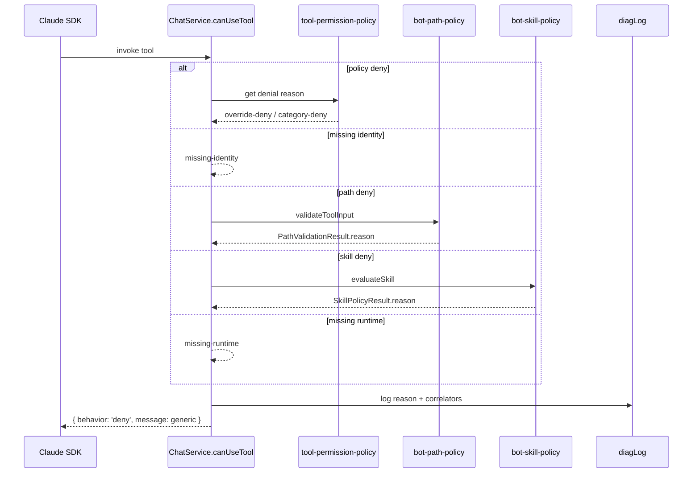
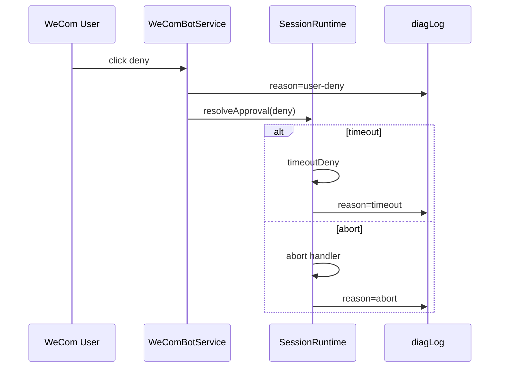

# feat: Add server-side denial reasons for WeCom bot tool permissions

## Summary

Add structured server-side logging for every bot-session tool denial in `chat-service.ts`, while keeping the user-facing `PermissionResult.message` generic to preserve the existing security posture against policy probing.

---

## Problem Frame

WeCom bot sessions currently return the same generic message — `"I can't do that in this workspace."` — for every denied tool call. Admins and operators have no way to tell whether a denial came from the workspace tool-permission policy, per-user path isolation, the skill allowlist, a missing user identity, or a missing runtime. We need diagnostic visibility without exposing capability details to untrusted WeCom users.

---

## Requirements

### Behavioral requirements

R1. Keep the user-facing deny message generic for WeCom bot users; it must not name the denied capability, path, or skill.

R2. Log a structured reason for every synchronous bot-session tool denial in `chat-service.ts`.

R3. Log a structured reason for `ask`-flow denials at resolution time: user deny, timeout, and SDK abort.

R4. Logged reason codes must not include PII, full paths, Bash command strings, question text, or secrets.

### Verification requirements

R5. Existing tests that assert the denial message does not leak capability names continue to pass.

R6. New or updated tests assert that the expected reason is logged at each denial site.

---

## Key Technical Decisions

- **Centralize detailed reasons in `diagLog`.** All denial reasons land in `sse-diag.log`, which is already used for runtime permission events. This keeps diagnostic evidence in one place and follows the existing `SessionRuntime` logging pattern. Note that `diagLog` is a local diagnostic sink; a future admin panel or persistent audit log is deferred.

- **Do not add a `reason` field to the SDK-facing `PermissionResult`.** The `message` returned to the Claude SDK is model-facing and may be paraphrased to the user. It stays generic; the detailed reason is for server logs only.

- **Add a denial-reason helper in `tool-permission-policy.ts`.** `evaluateToolPermission` returns a decision; a companion helper returns whether a `deny` came from a per-tool override (`override-deny`) or a category default (`category-deny`), avoiding duplicated resolution logic in callers. The helper must be kept in sync with `evaluateToolPermission`; cross-reference the two functions with comments.

- **Reuse existing `reason` fields from path and skill policies.** `PathValidationResult` and `SkillPolicyResult` already carry safe reason codes; log them directly. Add `missing-identity` and `missing-runtime` codes for the two denial sites that currently have none.

- **Log only safe correlators.** Each log line includes `sessionId`, `toolName`, `toolUseId`, and the `reason` code. It does not include tool `input`, paths, commands, or question text. `toolUseId` is the opaque SDK tool-use identifier already used for correlation; it is treated as a safe, non-PII correlator.

- **Construct denial log lines as string literals.** Do not pass objects or interpolated records to `diagLog`; its `util.inspect` formatter would recursively serialize them and could leak paths or commands if misused.

---

## Scope Boundaries

### In scope

- Synchronous denials in the bot `canUseTool` callback: policy deny, identity-sensitive deny, path-policy deny, skill-policy deny, and missing-runtime denials for `AskUserQuestion` and `ask` policy.
- Resolution-time denials for the `ask` flow: user deny via WeCom template card, SDK timeout, and SDK abort.
- Tests that verify logging and preserve the generic user-facing message.

### Deferred to follow-up work

- Returning category-level reasons to the WeCom user (requires an explicit security posture change or admin-only mode).
- A persistent audit log or database table for denials.
- A GUI admin panel for viewing denial reasons.
- Per-user or per-tool rate limiting on denial log volume.

### Outside scope

- Changes to GUI session permission flow.
- Changes to Feishu bot denial behavior.
- New policy categories or per-tool override behavior beyond logging.

---

## High-Level Technical Design

### Synchronous denial logging flow

### Ask-flow resolution logging flow

---

## Implementation Units

### U1. Add a tool-permission denial-reason helper

**Goal:** Let callers log *why* a tool was denied by policy without duplicating the override-vs-category resolution logic.

**Requirements advanced:** R2.

**Dependencies:** None.

**Files:**
- `src/server/services/tool-permission-policy.ts`
- `src/server/services/tool-permission-policy.test.ts`

**Approach:**
- Add `getToolPermissionDenialReason(policy, toolName)` that returns:
  - `'override-deny'` if `policy.overrides?.[toolName] === 'deny'`;
  - `'category-deny'` if the resolved category default is `'deny'`;
  - `undefined` otherwise.
- Keep `evaluateToolPermission` unchanged so existing callers are unaffected. Add a comment in both functions noting they must stay in sync if resolution order changes.

**Patterns to follow:** The existing pure-function evaluator style in `tool-permission-policy.ts`.

**Test scenarios:**
- Per-tool override deny returns `override-deny`.
- Category default deny returns `category-deny`.
- Allow/ask/unknown decisions return `undefined`.

**Verification:** `npm run test:server` passes for `tool-permission-policy.test.ts`.

---

### U2. Log synchronous bot-session denials in `chat-service.ts`

**Goal:** Every synchronous denial in the bot `canUseTool` callback logs a structured reason before returning the generic message.

**Requirements advanced:** R1, R2, R4, R5, R6.

**Dependencies:** U1.

**Files:**
- `src/server/services/chat-service.ts`
- `src/server/services/chat-service.test.ts`

**Approach:**
- Import `diagLog` from `../utils/diag-logger.js`. `chat-service.ts` already uses `sidecarLog` for operational logging; use `diagLog` specifically for permission-related diagnostic events so they are centralized in `sse-diag.log`.
- Add a local helper (or inline pattern) to build a log line such as:
  `[ChatService.botDeny] session=<id> tool=<name> toolUseId=<id> reason=<code>`.
  Build the line as a string literal; do not pass `input` or result objects to `diagLog`.
- For each synchronous denial site:
  - Policy deny: log the result of `getToolPermissionDenialReason`.
  - Identity-sensitive deny: log `missing-identity`.
  - Path-policy deny: log `PathValidationResult.reason`.
  - Skill-policy deny: log `SkillPolicyResult.reason`.
  - `AskUserQuestion` missing runtime: log `missing-runtime`.
  - `ask` policy missing runtime: log `missing-runtime`.
- Do not include `input`, paths, commands, or question text in the log line.
- Leave the returned `message` as the existing generic string.

**Patterns to follow:** Existing `sidecarLog` usage in `chat-service.ts` for operational logging; use `diagLog` for diagnostic denial reasons to align with `SessionRuntime`.

**Test scenarios:**
- Policy category deny for `Bash` logs `category-deny` and `result.message` does not contain `'shell'` or `'bash'`.
- Per-tool override deny logs `override-deny`.
- Missing identity for `Read`/`Bash`/`Skill` logs `missing-identity`.
- Path-policy deny logs each `PathValidationResult.reason` (`outside-workspace`, `other-user-dir`, `denylist`, `outside-user-dir-write`, `invalid-path`, `invalid-pattern`).
- Skill-policy deny logs `missing-skill-name` and `skill-not-allowed`.
- Missing runtime for `AskUserQuestion` logs `missing-runtime`.
- Missing runtime for `ask` policy logs `missing-runtime`.
- Allow decisions do not log a denial.

**Verification:** `npm run test:server` passes for `chat-service.test.ts`; no user-facing message leaks capability names.

---

### U3. Log ask-flow resolution denials

**Goal:** When a deferred `ask` approval is ultimately denied, record the reason at resolution time.

**Requirements advanced:** R3, R4, R6.

**Dependencies:** None. (U2 is independent, but U4 bundles test coverage for both U2 and U3.)

**Files:**
- `src/server/services/wecom-bot-service.ts`
- `src/server/services/session-runtime.ts`
- Relevant test files (`wecom-bot-service.test.ts`, `session-runtime.test.ts`)

**Approach:**
- In `WeComBotService.handleTemplateCardEvent`, when `parsed.action === 'deny'` for an approval card, call `diagLog` with `reason=user-deny` plus `sessionId`, `requestId`, `toolName`, and `toolUseId` (if available) from the pending card state.
- In `SessionRuntime.timeoutDeny`, look up the pending approval and include `toolName`, `toolUseId`, and `reason=timeout` in the existing `diagLog` line.
- In `SessionRuntime`'s abort handler, look up the pending approval via `this.pendingApprovals.get(requestId)` and add a `diagLog` line with `toolName`, `toolUseId`, and `reason=abort` before resolving the deny.
- Keep the user-facing messages (`'User denied this tool call.'`, `'Request timed out waiting for user response.'`, `'Tool approval aborted by SDK: ${requestId}'`) unchanged.

**Patterns to follow:** Existing `diagLog` usage in `SessionRuntime`; pending-approval map already stores `toolName` and `toolUseId`.

**Test scenarios:**
- WeCom user denies an approval card: `diagLog` receives `user-deny`.
- Approval timeout: `diagLog` receives `timeout`.
- SDK abort: `diagLog` receives `abort`.
- Allow/always-allow actions do not log a denial reason.

**Verification:** Relevant server tests pass; log lines do not include `input` contents.

---

### U4. Update tests to assert logging and generic messaging

**Goal:** Make the new diagnostic logging verifiable while preserving the existing security invariants.

**Requirements advanced:** R5, R6.

**Dependencies:** U2, U3.

**Files:**
- `src/server/services/chat-service.test.ts`
- `src/server/services/tool-permission-policy.test.ts`
- `src/server/services/wecom-bot-service.test.ts`
- `src/server/services/session-runtime.test.ts`

**Approach:**
- Stub or spy `diagLog` in the relevant test suites. If ESM mocking is awkward, add a small test seam such as a mutable `logDenial` callback that tests can replace, or accept the callback via an optional injection point in `chat-service.ts` / `session-runtime.ts`.
- For each existing denial test in `chat-service.test.ts`, add an assertion that `diagLog` was called with the expected reason code and that the log line does not contain tool `input` (negative invariant).
- Keep the existing assertions that `result.message` does not contain capability or tool names.
- Add coverage for `missing-identity` and `missing-runtime` if not already present.
- In `wecom-bot-service.test.ts` and `session-runtime.test.ts`, assert the resolution-time log reasons.

**Patterns to follow:** Existing `node:test` patterns in `chat-service.test.ts`; isolated SQLite test database via `test-utils/test-env`.

**Test scenarios:**
- Each synchronous denial scenario logs the expected reason.
- Each ask-flow resolution scenario logs the expected reason.
- User-facing messages remain generic in all denial cases.
- Allowed tool calls and non-denial paths do not log denials.

**Verification:** `npm run test:server` passes for the touched test files.

---

## Risks & Dependencies

- **Log sink reliability.** `diagLog` silently drops lines if its write stream is not writable. Denial events are diagnostic-only, so this is acceptable, but it means logs cannot be treated as a guaranteed audit trail.

- **Log volume.** A malicious or looping bot could generate many denial lines. `diagLog` writes to a local file; this is acceptable for the feature but worth monitoring if log rotation becomes an issue.

- **PII leakage in logs.** The implementer must review every log line to ensure no `input` path, command string, or question text is included. Only `sessionId`, `toolName`, `toolUseId`, and the reason code should be logged.

- **Policy-structure leakage to logs.** Reason codes such as `other-user-dir`, `denylist`, or `skill-not-allowed` reveal some policy shape to anyone with access to `sse-diag.log`. This is acceptable because the reasons are server-side only, but it should inform decisions about future log-sharing or support bundles.

- **Ask-flow race duplication.** If a user denies a card near the SDK timeout, both `user-deny` and `timeout` paths could log. This is a rare edge case and the `requestId` lets an operator correlate the lines; do not add complex deduplication unless it becomes a real problem.

- **ESM mocking friction.** `node:test` with ESM may make stubbing `diagLog` non-trivial. Introduce a small test seam if needed rather than skipping log assertions.

- **Scope tension.** The original request wanted the reason visible in the returned message; this plan logs it server-side only to preserve the existing security posture. That trade-off is documented in Scope Boundaries and KTDs.

---

## Open Questions

None. The security posture question was resolved: detailed reasons are logged server-side; the user-facing message stays generic.

---

## Sources & Research

- Bot `canUseTool` callback and generic denials: `src/server/services/chat-service.ts:1086-1194`
- Tool-permission evaluator: `src/server/services/tool-permission-policy.ts`
- Path-policy reasons: `src/server/services/bot-path-policy.ts`
- Skill-policy reasons: `src/server/services/bot-skill-policy.ts`
- Session-runtime timeout and abort handler: `src/server/services/session-runtime.ts`
- WeCom template-card user deny: `src/server/services/wecom-bot-service.ts:659-665`
- Existing denial-message tests: `src/server/services/chat-service.test.ts:627-649`, `823-874`
- Prior WeCom permission plans:
  - `docs/plans/2026-06-14-001-feat-wecom-bot-tool-permissions-plan.md`
  - `docs/plans/2026-06-19-001-feat-wecom-bot-user-isolation-plan.md`
  - `docs/plans/2026-06-24-004-feat-wecom-bot-ask-permission-plan.md`
