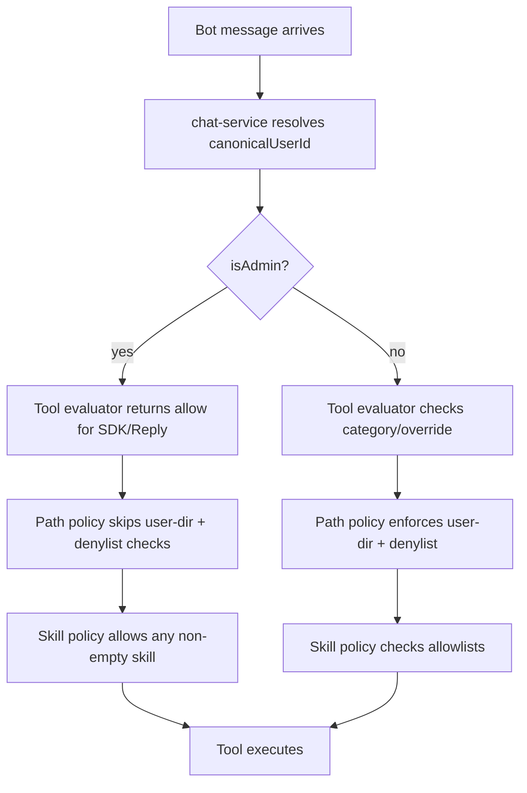

## Summary

Extend the WeCom bot admin bypass from skills-only to the full policy stack: tool-permission policy, file-path policy, and proactive send-file validation. Admins listed in `wecomBotIsolation.adminUserIds` gain allow-all access within the workspace boundary; non-admins and non-WeCom sessions are unaffected.

---

## Problem Frame

Today `wecomBotIsolation.adminUserIds` only grants extra skill access. Tool categories, per-tool overrides, per-user file isolation, the workspace denylist, and proactive send-file restrictions all treat admins as ordinary users. The result is that bot administrators cannot perform privileged operations their role implies — running shell commands, editing shared files, reading another user's data folder, or sending files from outside their own folder. The requirements doc defines the intended admin powers; this plan describes how to wire them through the existing policy layers.

---

## Requirements

### Tool permissions

- R1. WeCom bot admins bypass the workspace tool-permission policy for all SDK tools and the Reply capability.
- R2. Admin bypass overrides category defaults, per-tool overrides, and ask posture, returning allow.
- R3. Non-admin bot users continue to be evaluated against the configured policy.

### File access

- R4. WeCom bot admins can read any file or directory inside the workspace, including other users' data folders and denylisted paths.
- R5. WeCom bot admins can write any file inside the workspace, including shared areas and other users' data folders.
- R6. The workspace boundary remains: admins cannot escape the workspace root via absolute paths, parent traversal, or symlinks.

### Skills

- R7. WeCom bot admins can invoke any skill, regardless of whether it appears in `defaultAllowedSkills` or `adminAllowedSkills`.
- R8. Skill-name validation still requires a non-empty normalized skill name.

### Proactive send-file

- R9. The proactive WeCom send-file API bypasses the `data/<user-folder>` isolation check when the caller is an admin.
- R10. Non-admin callers continue to be restricted to their own data folder.

### Configuration / UI

- R11. The Isolation settings tab's admin-user hint is updated to describe the full admin powers (tools, files, skills).
- R12. The admin-user list itself is unchanged; it remains the source of admin identity.

### Scope protection

- R13. Admin bypass applies only to WeCom bot sessions; GUI sessions and Feishu bot sessions are unaffected.

---

## Key Technical Decisions

- **Extend the existing `isAdmin` snapshot.** `chat-service.ts` already resolves `isAdmin` from `wecomBotIsolation.adminUserIds`. Pass that flag into each policy layer rather than adding a second admin-resolution path.
- **Bypass lives inside each policy evaluator.** `evaluateToolPermission`, `validateToolInput`, and `validateSendFilePath` accept the flag and short-circuit their own restrictions. This keeps non-admin logic intact and preserves meaningful denial reasons for non-admins.
- **Admin tool bypass applies only to categorized SDK tools and Reply.** Unknown tools (MCP tools, `Skill_*`, future SDK tools without a category) keep today's fall-through behavior so the change does not silently expand scope.
- **Workspace boundary and symlink resolution stay in force for admins.** Admins skip per-user isolation and the denylist, but `resolveRealPath` and the workspace-prefix check remain.
- **Send-file route resolves admin status from workspace settings plus caller session.** The route already looks up the caller's WeCom user ID from the session; it also checks `adminUserIds` and passes the result into `wecomBotService.sendFile`.

---

## High-Level Technical Design

The proactive send-file path follows the same pattern outside the streaming session: the route resolves `isAdmin` and passes it to `validateSendFilePath`, which skips the `data/<user-folder>` check while keeping the workspace boundary.

---

## Implementation Units

### U1. Tool-permission evaluator admin bypass

- **Goal:** WeCom bot admins bypass category defaults, per-tool overrides, and ask posture for all categorized SDK tools and Reply.
- **Requirements:** R1, R2, R3.
- **Dependencies:** None.
- **Files:**
  - `src/server/services/tool-permission-policy.ts`
  - `src/server/services/tool-permission-policy.test.ts`
- **Approach:** Add an `isAdmin` parameter to `evaluateToolPermission`. When true and the tool maps to a known category (including `__wecom_reply__`), return `'allow'` before evaluating overrides or category defaults. Unknown tools still return `'unknown'`. `getToolPermissionDenialReason` needs no change because an admin will never reach a policy denial.
- **Patterns to follow:** Pure evaluator shape used by the existing `tool-permission-policy.ts`; preserve the `'unknown'` fall-through contract for MCP/future tools.
- **Test scenarios:**
  - Admin with a safe posture: `Bash` returns `'allow'`.
  - Admin with a per-tool `Bash: deny` override: `Bash` returns `'allow'`.
  - Admin with shell category set to `ask`: `Bash` returns `'allow'`.
  - Non-admin in the same policies above: returns the non-admin decision (`deny`, `ask`).
  - Admin calling an MCP tool: returns `'unknown'`.

### U2. Path-policy admin bypass

- **Goal:** WeCom bot admins can read and write any path inside the workspace, including other users' data folders and denylisted paths.
- **Requirements:** R4, R5, R6.
- **Dependencies:** U1 (so the `canUseTool` caller has an admin flag to pass).
- **Files:**
  - `src/server/services/bot-path-policy.ts`
  - `src/server/services/bot-path-policy.test.ts`
- **Approach:** Add `isAdmin: boolean` to `PathPolicyContext`. When true, `checkReadPath` skips `other-user-dir` and `denylist` checks after the workspace-escape check. `checkWritePath` skips the `outside-user-dir-write` restriction and allows any workspace-internal write. `checkGlobPattern` skips protected-segment and other-user checks but still rejects `..` traversal. `checkGrepPath` uses the admin read path. `resolveRealPath` and the workspace-prefix check remain unchanged.
- **Patterns to follow:** Existing context-object pattern from `SkillPolicyContext`; keep symlink resolution and workspace-boundary enforcement already used by non-admins.
- **Test scenarios:**
  - Admin reads a file in `data/<other-user>/`.
  - Admin reads a file under `.claude/`.
  - Admin writes a file in the workspace root (`shared/config.json`).
  - Admin writes a file in `data/<other-user>/`.
  - Admin is denied an absolute path outside the workspace and a `../etc/passwd` relative path.
  - Admin Glob pattern `data/**/*.txt` spans user folders.
  - Non-admin still receives `other-user-dir`, `denylist`, and `outside-user-dir-write` denials.

### U3. Skill-policy admin bypass for any skill

- **Goal:** WeCom bot admins can invoke any skill, not only those in `defaultAllowedSkills` or `adminAllowedSkills`.
- **Requirements:** R7, R8.
- **Dependencies:** None.
- **Files:**
  - `src/server/services/bot-skill-policy.ts`
  - `src/server/services/bot-skill-policy.test.ts`
- **Approach:** In `evaluateSkill`, when `ctx.isAdmin` is true and isolation is configured, return `{ allowed: true, skillName }` immediately after the non-empty skill-name check. Non-admin behavior and missing-name handling stay unchanged.
- **Patterns to follow:** The existing `SkillPolicyContext` already carries `isAdmin`; expand the existing admin branch from `adminAllowedSkills` to all skills.
- **Test scenarios:**
  - Admin invokes a skill in neither allowlist: allowed.
  - Admin invokes a skill with an empty/invalid name: denied with `missing-skill-name`.
  - Non-admin invokes an unlisted skill: denied with `skill-not-allowed`.
  - Existing default-skill and admin-skill tests continue to pass.

### U4. Wire admin flag through bot-session `canUseTool`

- **Goal:** The runtime passes the resolved admin flag into the tool, path, and skill policy checks.
- **Requirements:** R1, R3, R4, R5, R7, R13.
- **Dependencies:** U1, U2, U3.
- **Files:**
  - `src/server/services/chat-service.ts`
  - `src/server/services/chat-service.test.ts`
- **Approach:** Set `pathContext` with `isAdmin` and pass `isAdmin` to `evaluateToolPermission` inside the `canUseTool` callback. The `isAdmin` value is already computed from `wecomBotIsolation.adminUserIds`. Add integration tests using `captureBotCanUseTool` that set an admin user in workspace settings.
- **Patterns to follow:** Existing bot-session policy-gating tests in `chat-service.test.ts`; reuse the `captureBotCanUseTool` helper and mock workspace construction.
- **Test scenarios:**
  - Admin bot session: policy denies `Bash`, but `canUseTool('Bash')` returns allow.
  - Admin bot session: reads a file in `data/<other-user>/`.
  - Admin bot session: invokes an unlisted skill.
  - Non-admin bot session in the same workspace: each of the above is denied.
  - GUI session: `canUseTool` is not set (unchanged).
  - Feishu bot session: not treated as WeCom admin (unchanged).

### U5. Proactive send-file admin bypass

- **Goal:** Admins can use the proactive send-file API with files from any workspace folder; non-admins remain restricted to their own `data/<user>` folder.
- **Requirements:** R9, R10.
- **Dependencies:** None.
- **Files:**
  - `src/server/services/wecom-send-file-policy.ts`
  - `src/server/services/wecom-send-file-policy.test.ts`
  - `src/server/services/wecom-bot-service.ts`
  - `src/server/routes/wecom-send-file.ts`
  - `src/server/services/wecom-bot-service.send-file.test.ts` (if it exists; otherwise extend existing send-file tests)
- **Approach:** Add an `isAdmin` parameter to `validateSendFilePath`. When true, skip the `data/<user-folder>` segment check while keeping the workspace-boundary, symlink, and file-type checks. In the route, compute `isAdmin` from `workspace.settings.wecomBotIsolation.adminUserIds.includes(callerUserId)` and pass it to `wecomBotService.sendFile`. Update `sendFile` to forward the flag to the validator.
- **Patterns to follow:** Same path-resolution and prefix-check pattern already used by `wecom-send-file-policy.ts`; route already resolves caller identity via `store.getWecomUserIdBySession`.
- **Test scenarios:**
  - Policy unit: admin sends `docs/report.pdf` → allowed.
  - Policy unit: admin sends `data/<other-user>/secret.pdf` → allowed.
  - Policy unit: non-admin sends `docs/report.pdf` → denied with `other-user-dir`.
  - Policy unit: admin sending a directory or a symlink outside the workspace is still denied.
  - Route/service: admin caller sends a shared file; non-admin caller is denied.

### U6. Update Isolation settings admin-user hint

- **Goal:** The admin-users UI text accurately describes the full tool, file, and skill privileges.
- **Requirements:** R11, R12.
- **Dependencies:** None.
- **Files:**
  - `src/client/i18n/en/settings.json`
  - `src/client/i18n/zh-CN/settings.json`
- **Approach:** Update `wecom.isolation.adminUsers.hint` in both locales to state that admins can use all tools, read and write all files inside the workspace, and run all skills, and are not subject to the Bash whitelist. No component code changes.
- **Test expectation:** none — pure translation-string change.
- **Verification:** The hint in both locales mentions tool, file, and skill privileges.

---

## Acceptance Examples

- AE1. A workspace policy denies Shell. The admin asks the bot to run `Bash`; the command executes. A non-admin in the same workspace asks the same thing and receives a denial.
- AE2. The admin asks the bot to read `data/alice/secret.txt`; the content is returned. The admin asks to read `/etc/passwd`; the request is denied.
- AE3. The admin asks the bot to write `shared/config.json`; the file is written. The admin asks to write `../outside.json`; the request is denied.
- AE4. The admin asks the bot to invoke `unlisted-skill`; the skill runs. The admin asks to invoke a skill with an empty name; the request is denied.
- AE5. The admin calls the send-file API with `docs/report.pdf`; it succeeds. A non-admin calls the same API with `docs/report.pdf`; it is denied because the file is outside their own data folder.

---

## Scope Boundaries

### In scope

- WeCom bot admin bypass for tool permissions.
- WeCom bot admin bypass for file read/write path policy.
- WeCom bot admin bypass for skill allowlists.
- WeCom bot admin bypass for the proactive send-file API.
- UI hint update in the Isolation settings tab.

### Deferred for later

- Audit log of admin actions.
- Runtime policy invalidation for active bot sessions.
- Feishu bot admin parity.

### Outside scope

- GUI session permissions.
- New admin configuration UI.
- Changes to the workspace denylist definition.
- MCP tool or skill policy redesign beyond the admin bypass.

---

## Risks & Dependencies

- **Boundary weakening risk.** If the admin bypass is applied before the workspace-prefix check, admins could escape the workspace. Mitigation: unit tests for absolute paths, `..` traversal, and symlink escapes must pass for admins.
- **Session-staleness risk.** Changes to `adminUserIds` only affect the next bot session, matching existing tool-permission and isolation behavior. No runtime invalidation is added.
- **No external dependencies.** The change builds on existing workspace settings and policy modules.

---

## Sources / Research

- Origin requirements: `docs/brainstorms/2026-06-26-wecom-bot-admin-permissions-requirements.md`
- Predecessor plans that established the policy layers:
  - `docs/plans/2026-06-14-001-feat-wecom-bot-tool-permissions-plan.md`
  - `docs/plans/2026-06-19-001-feat-wecom-bot-user-isolation-plan.md`
  - `docs/plans/2026-06-22-001-feat-wecom-bot-proactive-file-send-plan.md`
- Test-isolation convention: `docs/solutions/conventions/use-isolated-test-database-for-comate.md`
- Policy modules: `src/server/services/tool-permission-policy.ts`, `src/server/services/bot-path-policy.ts`, `src/server/services/bot-skill-policy.ts`, `src/server/services/wecom-send-file-policy.ts`
- Runtime integration: `src/server/services/chat-service.ts`
- Send-file route: `src/server/routes/wecom-send-file.ts`
