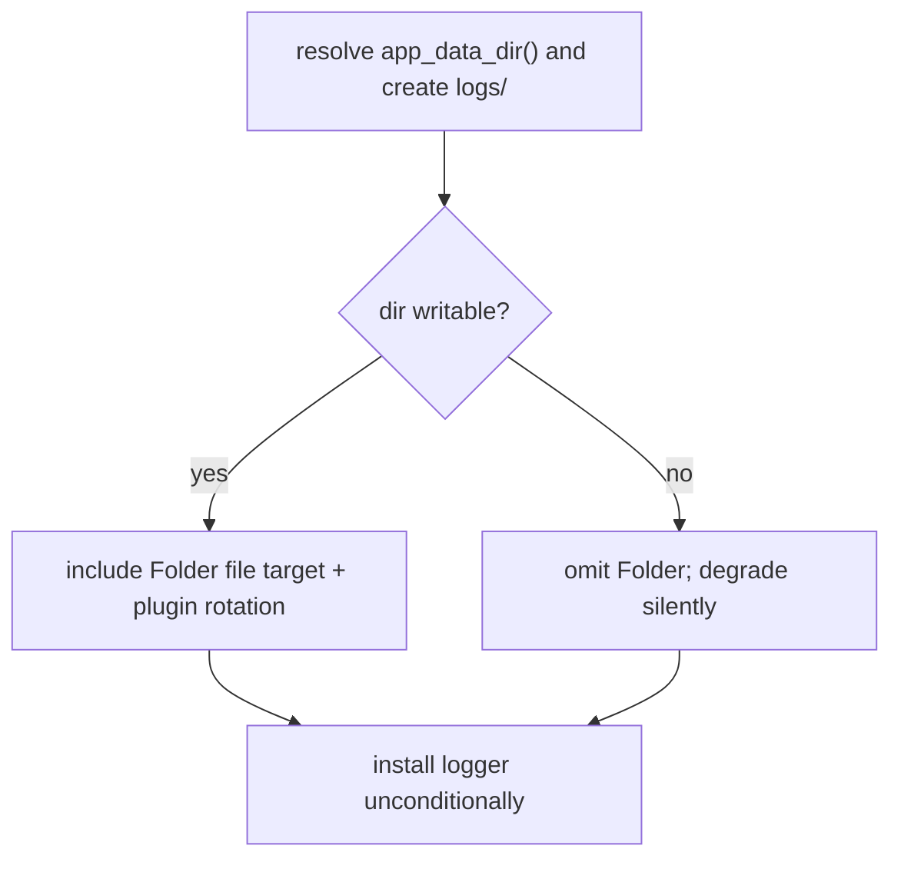

# Tauri/Rust Persistent File Logging

## Summary

Configure the existing `tauri-plugin-log` to write a persistent file in the app-data `logs/` folder in both debug and release builds, so the Rust shell's diagnostics — sidecar spawn/tray/shutdown errors, sidecar stderr, lifecycle events — survive in shipped apps instead of going silent.

---

## Problem Frame

The Rust shell already instruments its operations with `log::` macros and pipes the Node sidecar's stdout/stderr into those same macros. But `tauri-plugin-log` is installed only in debug builds with console/webview targets, so a packaged release build emits nothing — and Windows release has no console at all (`windows_subsystem = "windows"`).

The consequence: when a user reports a sidecar-startup, tray, or shutdown problem, there is no Rust-side log to consult. The Node side keeps its own logs but cannot record events that happen before or outside its own process. This plan makes the existing instrumented events persist in release.

---

## Requirements

**Capture scope**

- R1. The Rust log file records the Tauri/Rust process's own `log`-crate diagnostics plus the sidecar's stderr and lifecycle events (ready, terminated with code/signal) as the Rust process already observes them.
- R2. Sidecar stdout is echoed to the log only in debug builds; release does not echo it.

**Build mode and location**

- R3. The logger is installed in both debug and release builds — the current debug-only gate is removed.
- R4. The Rust log file is written under the app-data `logs/` folder in its own file, distinct from the Node-managed logs, not a repo-relative path.
- R5. Debug builds retain console/webview targets alongside the file; release uses the file as the primary target (and, on Windows, the only one).

**Robustness and bounds**

- R6. Logger initialization must not abort app startup if the log directory cannot be created or written — it degrades gracefully instead.
- R7. Log file growth is bounded so it cannot grow unbounded on an end-user's disk.

---

## Key Technical Decisions

- **Reuse `tauri-plugin-log`, install unconditionally.** It is already a dependency and already (debug-only) installed; v2 supports a custom-path file target and rotation, so a separate logger crate is unnecessary.
- **File target via `TargetKind::Folder` pointed at `app_data_dir()/logs/`.** Must be `Folder` (custom path), not `LogDir` (platform log dir like `~/Library/Logs/…`), so the Rust file co-locates with the Node logs. The shell already passes `app_data_dir()` to the sidecar as `COMATE_DATA_DIR`, so Rust and Node logs land in the same folder.
- **Distinct file name** (for example `main`), so the shell's log stays separable from the Node-managed `sidecar.log`, `sse-diag.log`, and `wecom-resolver.log`.
- **Explicit debug/release target split.** The default target is Stdout, so the split must be declared: debug = Stdout + Webview + Folder; release = Folder only.
- **No capability or frontend change.** The frontend does not use `@tauri-apps/plugin-log`, and Rust-side `log::` macros need no IPC capability, so enabling the plugin in release has no client-side coupling.
- **Rotation is belt-and-suspenders.** The plugin's `max_file_size` + rotation strategy is best-effort (known bugs: `#707` size not always enforced, `#1397` `KeepAll` caps near two files). The authoritative bound is the existing Node-side folder cleanup, which already sweeps every `.log` file in that folder. This refines the brainstorm's "independent" assumption: the two mechanisms are complementary, Node-authoritative.
- **Graceful degradation.** If `app_data_dir()` resolution or `logs/` creation fails, install the logger without the file target rather than propagating the error and aborting launch.

---

## High-Level Technical Design

Logger installation always happens (R3); whether the file target is included depends on directory writability (R6). Target selection depends on build mode (R5).

| Build mode | Targets |
|---|---|
| Debug (`tauri:dev`) | Stdout + Webview + Folder |
| Release (packaged) | Folder only |

Once the file target exists, the existing routing in the sidecar event loop already satisfies R1/R2 — no capture-code change is needed, only persistence.

---

## Implementation Units

### U1. Wire an unconditional file logger with debug/release split and graceful degradation

**Goal:** Make `tauri-plugin-log` install in both builds and write to a file in the app-data `logs/` folder, degrading safely if the directory is unavailable.

**Requirements:** R1, R2, R3, R4, R5, R6, R7 (R1/R2 via existing sidecar routing once the file target exists)

**Dependencies:** None

**Files:**

- Modify: `src-tauri/src/lib.rs` (the `.setup` logger block, currently debug-only with no file target)

**Approach:**

- In `.setup`, resolve `app.path().app_data_dir()` (already resolved later in the same setup for the sidecar) and `create_dir_all` the `logs` subdirectory with a silent-error guard.
- Build the target list conditionally on `cfg!(debug_assertions)`: debug gets Stdout + Webview + Folder; release gets Folder only. Use `TargetKind::Folder { path, file_name }` with the resolved logs path and a distinct file name.
- Configure `max_file_size` and a rotation strategy as best-effort in-process bounding (exact values deferred to implementation, aligned to the Node folder scale).
- Keep `TimezoneStrategy::UseLocal` and `log::LevelFilter::Info`.
- Install the plugin unconditionally (remove the `cfg!(debug_assertions)` gate). If directory resolution or creation failed, install without the Folder target and emit one degradation notice to stderr — do not propagate via `?`, which would abort app startup.

**Patterns to follow:**

- Existing silent-error directory guards (`src/server/utils/sidecar-logger.ts`): `mkdirSync(..., { recursive: true })` wrapped in `try/catch`.
- The sidecar env wiring already in this file (`COMATE_DATA_DIR = app_data_dir()`) — the logs path is `app_data_dir().join("logs")`, the same dir the sidecar receives.

**Execution note:** No Rust test harness exists in this repo (`package.json` test scripts are all JS/Node). Verify by build and runtime, not `cargo test`.

**Test scenarios:**

- Build: `npm run tauri:dev` and a release build both compile with the new logger configuration.
- Covers AE1. Release build: after running the packaged app and exercising a sidecar start/stop, the Rust log file exists under app-data `logs/` and contains the sidecar ready/lifecycle line plus any diagnostics.
- Covers AE3. Debug build: logs appear in the terminal/webview and in the file.
- Covers R2. Release build: sidecar stdout is not echoed to the file; sidecar stderr and lifecycle are.
- Covers AE2 / R6. If the logs directory cannot be created or written, the app still launches and the logger degrades without the file target rather than crashing.
- Integration: a sidecar stderr line (a Node-side error) appears in the Rust file in release.

**Verification:**

- A packaged release build produces the Rust log file in app-data `logs/` on first run.
- Debug runs keep console/webview output.
- App startup is not aborted when the logs directory is unavailable.

### U2. Document the Rust log file in the project guide

**Goal:** Keep the project guide's logging section accurate now that a new Rust log file exists.

**Requirements:** Supports R4 (discoverability of the file's location)

**Dependencies:** U1

**Files:**

- Modify: `CLAUDE.md` (the Logging subsection under Server Patterns)

**Approach:**

- Add a short note that the Tauri/Rust shell writes a log file to the app-data `logs/` folder in both debug and release, alongside the Node-managed logs.

**Test expectation:** none — documentation-only change.

---

## Acceptance Examples

- AE1. **Release log retrieval.** Given a packaged release build on a user's machine, when the app runs and the sidecar starts/stops/errors, then a Rust log file exists under app-data `logs/` containing lifecycle events and diagnostics; on Windows this is the only way to see them.
- AE2. **Graceful degradation.** Given app-data dir resolution or logs-dir creation fails at startup, when the logger initializes, then the app still launches (logger skips the file target) rather than crashing.
- AE3. **Debug keeps console.** Given a debug build (`tauri:dev`), when the app runs, then logs appear both in the console/webview and the file.

---

## Scope Boundaries

### Deferred to Follow-Up Work

- Unifying Rust and Node logs into an in-app view, or forwarding Rust logs to the UI for combined browsing.
- Cross-process tracing/correlation (shared trace IDs spanning Rust and Node).

### Outside This Work's Scope

- Structured/JSON log format changes — keep `tauri-plugin-log` defaults.
- OS-level crash dumps / native crash reporting.
- Modifying the Node side's logging or its cleanup policy.

---

## Risks & Dependencies

| Risk | Mitigation |
|---|---|
| `tauri-plugin-log` rotation bugs (`#707` size not enforced, `#1397` `KeepAll` caps near two files) | Treat plugin rotation as best-effort; the Node-side folder cleanup is the authoritative bound. |
| Residual unbounded growth if the sidecar never starts and plugin rotation misbehaves | Low risk — Info-level shell-event volume is small; acceptable. |
| `app_data_dir()` resolution failure | Handled by graceful degradation (R6); logger installs without the file target. |

**Dependencies:**

- The existing Node-side `runLogCleanup()` (plan `2026-05-27-008`) must remain in place as the authoritative folder-level bound for the shared `logs/` directory.

---

## Sources & Research

- **Origin:** [docs/brainstorms/2026-06-26-tauri-rust-file-logging-requirements.md](docs/brainstorms/2026-06-26-tauri-rust-file-logging-requirements.md)
- **tauri-plugin-log v2 docs:** https://v2.tauri.app/plugin/logging/ — confirms `TargetKind::Folder` (custom path), `max_file_size`, `RotationStrategy`; default target is Stdout.
- **Known rotation issues:** [#707](https://github.com/tauri-apps/plugins-workspace/issues/707), [#1397](https://github.com/tauri-apps/plugins-workspace/issues/1397).
- **Prior art (Node logs convention):** `docs/plans/2026-05-27-008-feat-unified-log-folder-auto-cleanup-plan.md` — established the `logs/` folder + 7-day/100MB cleanup.
- **Code:** `src-tauri/src/lib.rs` (logger setup block, sidecar event loop), `src/server/utils/log-cleanup.ts`, `src/server/storage/data-dir.ts`, `src/server/utils/sidecar-logger.ts`.
- A grounding dossier with verbatim quotes and `file:line` pointers is available for the implementer at `/tmp/compound-engineering/ce-brainstorm/rust-logs/grounding.md`.
