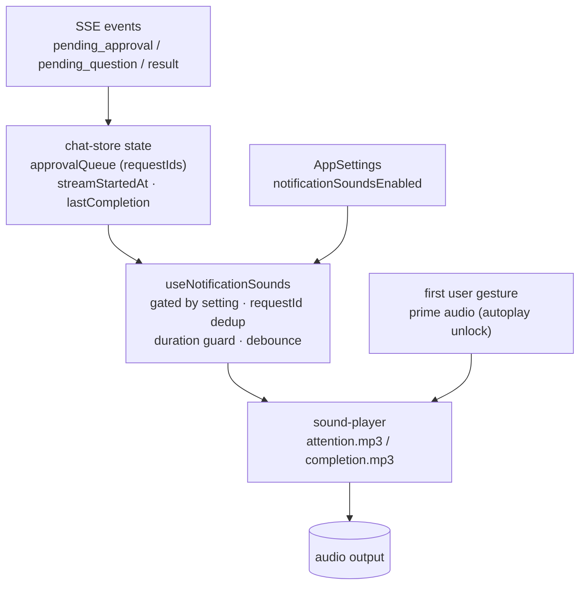

# Notification Sounds for Pending Requests and Task Completion

## Summary

Add client-side notification sounds that fire when Claude needs the user (a tool approval or `AskUserQuestion`) and when Claude finishes a turn and goes idle. Two audibly distinct sounds — "needs attention" and "completion" — sit behind a single global toggle in Settings → General, enabled by default. The completion sound is duration-guarded and rapid events are coalesced so ordinary back-and-forth never bursts.

## Problem Frame

When Claude runs a long task the user often switches windows. The only "needs attention" signal today is the dock badge (or taskbar flash); there is no audio, so users miss the moment Claude is blocked on an approval, waiting on a question, or simply finished and idle, and Claude stalls until they look back. A sound closes that gap. See the origin requirements doc for the full problem frame and acceptance examples.

## Requirements

**Trigger & sound**

- R1. The client plays the "needs attention" sound when a tool approval or `AskUserQuestion` request becomes pending.
- R2. The client plays the "completion" sound when a turn ends without error and Claude goes idle.
- R6. Two audibly distinct sounds exist: "needs attention" and "completion".

**Settings**

- R3. A single global toggle in Settings → General enables or disables all notification sounds.
- R4. When the toggle is off, no notification sounds play.
- R5. Notification sounds are enabled by default.

**Anti-bombardment**

- R7. The completion sound plays only for turns longer than a minimum duration (~3s).
- R8. Rapid successive sound triggers are coalesced so they do not stack into a burst.

## Key Technical Decisions

- **KTD1 — Hook-driven playback off store state, not inside the SSE handlers.** Audio is a side-effect of a React hook (`useNotificationSounds`) that subscribes to chat-store state, mirroring `src/client/lib/use-badge-sync.ts`. SSE events replay on reconnect, so a side-effect inside `handleSseEvent` would re-sound; a hook that diffs state transitions avoids that and keeps the retry-laden store path free of side-effects.
- **KTD2 — Replay-safety via requestId dedup and idempotent completion metadata.** Attention sounds dedupe by `requestId` (a ref Set), so a reconnect replaying a `pending_*` event does not re-sound. Completion is detected from store metadata keyed by turn-end time, which is idempotent under replay.
- **KTD3 — Audio assets in `public/`, unlocked on first user gesture.** Two short files under `public/` are served from the app's self origin (CSP `default-src 'self'` permits this; no Tauri capability needed). Because sounds fire from SSE rather than a click, the webview autoplay policy may block programmatic playback; the player primes/resumes audio on the app's first user interaction so later SSE-triggered playback succeeds.
- **KTD4 — Store surfaces turn timing and completion status.** The store records a per-session turn-start timestamp and, on turn-end, completion metadata including the error flag. This is pure state with no side-effects, letting the hook apply the duration guard and suppress error turns without inspecting raw events.

## High-Level Technical Design

Sound is a side-effect layered over existing store state, not a new transport. SSE events continue to mutate the chat store as today; the store additionally records turn timing and a completion record; a single mounted hook reads that state (gated by the setting) and asks a small player to play one of two bundled clips. The player handles the webview autoplay unlock.

State lives in the store; the side-effect lives in the hook; the player owns autoplay. The two sound flavors are distinct files selected by the hook's trigger path.

## Implementation Units

### U1. Sound player with autoplay unlock

- **Goal:** A client module that loads the two audio assets and exposes a `playSound(kind)` function, priming audio on the app's first user gesture so SSE-triggered playback is not blocked by the webview autoplay policy.
- **Requirements:** R6.
- **Dependencies:** none.
- **Files:** `src/client/lib/sound-player.ts` (new); `public/attention.mp3` (new); `public/completion.mp3` (new).
- **Approach:** Load two `HTMLAudioElement` instances lazily from the root URLs `/attention.mp3` and `/completion.mp3` (mirroring how `/feishu-icon.svg` is referenced). `playSound('attention' | 'completion')` plays the matching element. Register a one-time `pointerdown`/`keydown` listener on module load that primes the elements (load + a silenced play, or resume an `AudioContext`) to unlock playback, then marks audio unlocked. Calls before unlock are no-ops rather than throws. This is directional guidance on the unlock mechanism; the exact prime call is settled in implementation against what the webview accepts.
- **Patterns to follow:** `public/` asset referencing (`src/client/components/SessionListItem.tsx` for `/feishu-icon.svg`).
- **Test scenarios:**
  - Happy path: after unlock, `playSound('attention')` and `playSound('completion')` each target their distinct asset URL.
  - Edge: `playSound` invoked before the first gesture is a no-op and does not throw.
  - Edge: the first user gesture transitions audio to unlocked; a subsequent programmatic call proceeds.
  - Note: assert against a mocked `HTMLAudioElement.play` (jsdom has no real audio); real playback is covered by manual verification.
- **Verification:** in the running app, after one click, triggering a sound produces audio; calling before any click does not error.

### U2. Settings toggle (`notificationSoundsEnabled`)

- **Goal:** Add a global boolean setting and a General-tab toggle controlling all notification sounds, enabled by default.
- **Requirements:** R3, R4, R5.
- **Dependencies:** none.
- **Files:** `src/client/hooks/use-app-settings.ts`; `src/client/components/SettingsPanel.tsx`; `src/client/i18n/en/settings.json`; `src/client/i18n/zh-CN/settings.json`.
- **Approach:** Mirror `autoCheckUpdates` end-to-end — add `notificationSoundsEnabled: boolean` to the settings interface with default `true`, load and persist it through the existing localStorage flow, export a value and setter from `useAppSettings`, and render a pill-toggle in the GeneralTab. Add `general.notificationSounds` and `general.notificationSoundsHint` keys to both locale files.
- **Patterns to follow:** the `autoCheckUpdates` trace (interface field, default, localStorage load/save, setter, hook return, GeneralTab props, pill-toggle JSX) and the `general.*` + `*Hint` i18n convention.
- **Test scenarios:**
  - Happy path: the toggle reflects the setting and persists across a reload (localStorage round-trip).
  - Covers R5: a fresh install with no stored value defaults to enabled.
- **Verification:** Settings → General shows the toggle; flipping it survives an app restart.

### U3. Store turn-timing and completion metadata

- **Goal:** Have the chat-store record turn-start timestamps and completion metadata (end time, error flag, duration) so a side-effect hook can apply the duration guard and suppress error turns.
- **Requirements:** R2, R7 (enablers).
- **Dependencies:** none.
- **Files:** `src/client/stores/chat-store.ts`.
- **Approach:** Add `streamStartedAt: Record<string, number>` to `ChatState`, mirroring the existing `compactingStartTime` per-session shape. Set `streamStartedAt[sessionId]` at turn start in **both** the prompt-send action and the `assistant_start` case — prompt-send is a one-shot client action that is not replayed on reconnect, so capturing in `assistant_start` keeps the duration guard working after a reconnect to a turn already in flight; on the reconnect branch where the assistant message already exists, recover the start time from that message's stored timestamp. In the `result` case, compute `durationMs`, then write a per-session completion record holding `endedAt`, `isError` (read from the result payload, which the server already emits but the client does not yet read), and `durationMs`, and clear the start timestamp. This is pure state mutation with no side-effects and is idempotent under reconnect replay (same `endedAt`).
- **Patterns to follow:** the `compactingStartTime` record-per-session field; the existing `result` and `isStreaming` handling.
- **Test scenarios:**
  - Happy path: sending a prompt sets `streamStartedAt`; a result sets the completion record with `isError: false` and a positive `durationMs`.
  - Covers AE6: a result carrying the error flag records `isError: true`.
  - Edge: a sub-threshold turn still records its `durationMs` (the guard lives in the hook, not here).
  - Edge: reconnect replay of a result with the same `endedAt` does not corrupt the record.
  - Covers reconnect-start: a fresh store reconnecting to an in-flight session (prompt-send not replayed, `assistant_start` replayed) still yields a `streamStartedAt` recovered from the existing message, so the duration guard runs.
  - Integration: `durationMs` is close to the wall time between send and result.
- **Verification:** store state shows a start timestamp on send and a populated completion record on result.
- **Note:** confirm the exact `result` error field key (`data.isError` vs `is_error`) against the server payload in `src/server/services/sse-emitter.ts` during implementation (see Open Questions).

### U4. `useNotificationSounds` hook

- **Goal:** A React hook mounted once in `App` that plays the attention and completion sounds in response to store state — gated by the setting, replay-safe, with the duration guard and debounce.
- **Requirements:** R1, R2, R4, R7, R8.
- **Dependencies:** U1, U2, U3.
- **Files:** `src/client/lib/use-notification-sounds.ts` (new); `src/client/App.tsx` (mount alongside `useBadgeSync()`).
- **Approach:** Mirror `src/client/lib/use-badge-sync.ts` — select chat-store slices with `useChatStore` and act in a `useEffect`. Read `notificationSoundsEnabled`; if off, do nothing (R4). Keep refs: a `Set` of already-sounded attention `requestId`s and the last-sounded `endedAt` per session. For attention, when the approval/question queue gains a `requestId` not in the set, record it and call `playSound('attention')`, debounced so several new requests within ~1.5s coalesce into one play (R8). For completion, when a session's `endedAt` advances and `isError` is false and `durationMs` exceeds ~3000, call `playSound('completion')` (R2, R7).
- **Patterns to follow:** `src/client/lib/use-badge-sync.ts` (subscribe, effect, mount-once); inline `useRef` + `setTimeout` debounce (cf. `src/client/hooks/useMessageSearch.ts`).
- **Test scenarios:**
  - Covers AE2, AE3: a new approval/question `requestId` with sounds enabled plays attention once.
  - Covers AE1: with the toggle off, a new request plays nothing.
  - Covers AE7: three new `requestId`s within the debounce window play attention once.
  - Covers AE4: a longer-than-threshold, non-error completion plays completion.
  - Covers AE5: a sub-threshold completion plays nothing.
  - Covers AE6: an errored completion plays nothing.
  - Edge (replay): a reconnect re-emitting an already-sounded `requestId` does not re-play.
  - Edge: a completion replayed with the same `endedAt` does not re-play.
- **Verification:** with sounds enabled, a pending request and a long finished turn each produce the expected sound; rapid events coalesce; reconnect does not double-fire.

## Scope Boundaries

**Deferred for later**

- OS-level toast/desktop notifications (no notification plugin exists today).
- Per-event volume control or a volume slider.
- User-selectable or custom sound files.

**Outside this product's identity**

- A distinct sound for errors or abnormal stops.
- Per-workspace sound settings (global only).

### Deferred to Follow-Up Work

- Sourcing two short CC0/royalty-free clips during implementation — a soft alert for "needs attention" and a gentle chime for "completion" (each <~1s), from a free library (e.g. Pixabay / Mixkit / freesound CC0).
- Tuning the exact threshold (~3s) and debounce window (~1.5s) values.
- Confirming autoplay behavior on Windows WebView2 in addition to macOS WKWebView.

## Risks & Dependencies

- **Webview autoplay policy** may block SSE-triggered playback before a user gesture. Mitigation: KTD3 gesture-unlock. Verify on macOS and Windows.
- **Reconnect replay** could spuriously re-sound. Mitigation: KTD2 dedup and idempotent completion metadata.
- **`result` error field name** must be confirmed against the server payload (`data.isError` per the emitter, but the client handler has never read it). Fallback if unreadable: treat all completions as non-error, which only over-plays completion and never affects attention.
- **Existing users receive sounds on auto-update** because the default is on. Accepted per the user's decision; the toggle is the opt-out.

## Open Questions

- Exact `result` error field key — verify against `src/server/services/sse-emitter.ts` during U3. (Deferred to implementation.)
- Autoplay specifics per webview — confirm the gesture-unlock suffices on both macOS WKWebView and Windows WebView2. (Deferred to implementation/verification.)

## Sources / Research

- `src/client/lib/use-badge-sync.ts` — the hook pattern to mirror (subscribe to store state, side-effect in an effect, mount once in `App`).
- `src/client/App.tsx` — mount site for the hook, next to `useBadgeSync()`.
- `src/client/stores/chat-store.ts` — `handleSseEvent` (standalone function); `pending_approval`, `pending_question`, and `result` cases; the turn-start `isStreaming` flip; the `compactingStartTime` per-session record shape to mirror for `streamStartedAt`.
- `src/client/hooks/use-app-settings.ts` and `src/client/components/SettingsPanel.tsx` — the `autoCheckUpdates` boolean end-to-end pattern for the toggle.
- `src/client/i18n/en/settings.json` and `src/client/i18n/zh-CN/settings.json` — the `general.*` and `*Hint` label convention.
- `public/feishu-icon.svg` / `public/wecom-icon.svg` and `src-tauri/tauri.conf.json` — `public/` asset referencing precedent and the `default-src 'self'` CSP.
- `docs/solutions/integration-issues/` SSE reconnect/race-condition learnings — the replay-on-reconnect behavior that motivates the hook-plus-dedup design (KTD1, KTD2).
