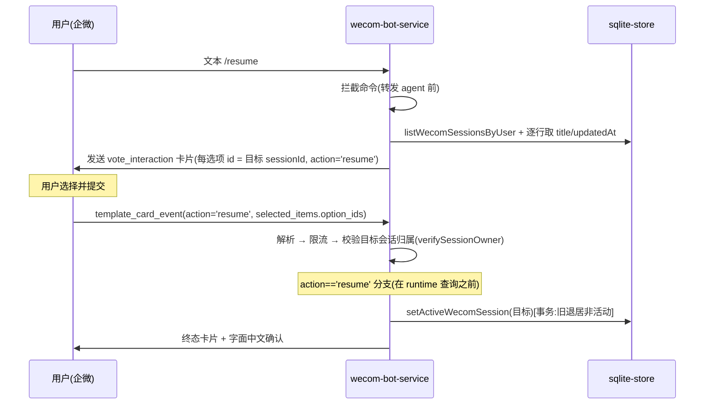

# Bot `/resume` 会话切换命令（WeCom + Feishu）

## Summary

为两个 bot 统一会话切换命令 `/resume`：WeCom 新增该命令（单选模版卡片 → 切换当前会话），飞书把 `/session`（含菜单按钮）硬重命名为 `/resume`。本计划在现有模版卡片与回调机制上增量实现，采用**无状态**方案——目标 sessionId 直接编码在卡片选项里，提交回调读出即切换，与飞书 `select_session` 一致。

---

## Problem Frame

承接 `/clear`/`/new` 的 Deferred 项：用户开新会话后，旧会话上下文被「搁浅」、无法从 bot 侧恢复。每用户「当前会话」标记（`wecom_user_sessions.isActive`）与按用户列出会话的能力（`listWecomSessionsByUser`）现已就位，飞书也早有等价的 `/session` 能力，但命令名与即将上线的 WeCom 不一致。本次把两边切换命令统一为 `/resume`，让用户在两个 bot 上用同一个命令恢复旧会话、带着原有上下文继续。

---

## Requirements

**命令解析与分发**

- R1. WeCom 与飞书都必须在消息转发给 Claude 会话之前拦截起始 token `/resume`（字面命令不得作为一轮对话处理）。
- R2. `/resume` 不接受参数；命令后的附加文本被忽略（switch-only）。

**卡片展示**

- R3. `/resume` 必须回复一张单选模版卡片，列出该用户在所属 workspace 内、来源为该 bot 的会话。
- R4. 卡片始终展示，即使会话不足两个；不得回退纯文本。
- R5. 每个选项展示「会话标题 + 最近活动时间」，最近活动用本地 `updatedAt` 字段。
- R6. 列表按最近活动倒序，并截断到平台单选卡片的选项数上限（最近 N 个）。
- R7. 当前活动会话也出现在卡片中并标注「当前」；再次选中它为无操作。
- R8. 已归档（`isArchived`）的会话不得出现。

**切换与回调**

- R9. 提交后，bot 从所选选项取出目标 sessionId，校验该用户拥有目标会话后，把它设为该用户当前活动会话（旧活动会话退居非活动）；会话不删除。目标 sessionId 直接编码在所选选项的 `id` 中（无状态）。
- R10. 切换只翻转当前会话标记、对下一条消息生效；不中断正在处理的轮次。
- R11. 切换成功后回复一条含所切会话标题的确认消息，使用字面中文串（与 `/new` 一致）。修正 origin R11 的 i18n 假设——经核实两个 bot 的回复均为字面中文串。
- R12. 提交时校验目标会话归属；目标会话不属于该用户（或选项 id 非法/越界）则拒绝（终态「无法操作该会话」）、不切换。不做过期/取代语义——任意提交均按所选会话切换，与飞书一致。（修订 origin R12 的「过期」语义为归属校验，见 KTD1。）

**跨 bot 一致性**

- R13. 飞书 `/session` 文本命令与菜单 event key 均硬重命名为 `/resume`/`'resume'`；旧形式不再被识别。
- R14. 飞书的会话列表卡片与切换逻辑保持不变（仅命令文本与菜单 key 变更）。

---

## Key Technical Decisions

- KTD1. **无状态卡片载荷，不引入 pending 存储。** 目标 sessionId 直接编码在每个 vote_interaction 选项的 `id` 里，提交回调从 `selected_items[].option_ids` 取出即切换——与飞书 `select_session` 一致。理由：审批/提问卡片的 pending 状态由 `requestToolApproval`/`requestToolQuestion` 在 SDK `canUseTool` 回调中注册、绑定进行中的轮次与 `SessionRuntime`，`/resume` 作为无轮次的主动命令无法复用；飞书已证明此场景无需持久状态。origin R12 的「过期/取代」语义是推断默认值、非用户要求，故放宽为「任意提交按所选会话切换 + 目标归属校验」。幂等性由 `setActiveWecomSession` 的事务单活动不变量提供。
- KTD2. **`'resume'` 作为独立 button-key action。** 提交按钮 key 携带 `action: 'resume'`，使 `handleTemplateCardEvent` 能把 `/resume` 提交与审批/提问提交区分开（提问卡片复用 `'allow'`、按 `pending.type` 路由，`/resume` 无 pending，故需独立 action）。新增 `'resume'` 必须放宽 `ToolApprovalAction` 类型与 `isValidAction`，否则 `decodeButtonKey` 返回 undefined、`parseTemplateCardEvent` 会**静默丢弃**整个 `/resume` 回调。
- KTD3. **字面中文回复串。** 两个 bot 的用户面字符串均为字面中文（`handleNewSessionCommand`、飞书 toast 均如此），不引入 i18n；据此修正 origin R11。
- KTD4. **最近活动用 `updatedAt`。** WeCom 会话的 `lastModified` 来自 SDK 且常为 `NULL`（直到 SDK 重新列举）；用本地 `updatedAt`（创建即写）作为「最近活动」。
- KTD5. **中途切换保留在途状态。** 切换仅翻 `isActive` 标记、对下一条消息生效，不拆除或打断旧会话正在进行的轮次（参照 SSE「不覆盖在途状态」经验）。
- KTD6. **目标会话归属校验（身份守卫）。** 提交回调用既有 `verifySessionOwner` 校验**目标**会话（非卡片来源会话）属于提交者，拦截伪造/越权的 option id；并对取出的 option id 做格式/越界检查作防御纵深。幂等性由 `setActiveWecomSession` 事务吸收。

---

## High-Level Technical Design

关键架构点是**无状态**：目标 sessionId 直接编码在每个 vote_interaction 选项的 `id` 里，提交回调从 `selected_items[].option_ids` 取出即切换——与飞书 `select_session` 一致。不引入 bot 侧 pending 存储（审批/提问的 pending 绑定在途轮次、无法服务于主动命令；飞书证明此场景无需持久状态）。幂等性由 `setActiveWecomSession` 的事务单活动不变量提供；身份守卫复用既有 `verifySessionOwner` 校验目标会话归属。命令在转发 agent 前被拦截，故无进行中轮次、也无 SDK requestId——提交回调据此在既有 runtime 查询之前分叉。

---

## Implementation Units

### U1. WeCom 会话列表卡片构建 + resume action 键

- **Goal:** 放宽 button-key action（含类型放宽）并新增 WeCom 会话列表卡片构建器（vote_interaction 单选，选项 `id` = 目标 sessionId），为 `/resume` 提供卡片与键编码基础。
- **Requirements:** R3, R5, R6, R7（展示侧）；为 R9 提供键/选项编码。
- **Dependencies:** 无（基础件）。
- **Files:** `src/server/services/wecom-template-card.ts`（放宽 `isValidAction` 含 `'resume'`；新增 `buildWecomSessionListCard`，复用 `buildQuestionCard` 的 vote_interaction 分支与 `encodeButtonKey`；终态卡片助手）；`src/server/types/wecom-template-card.ts`（**放宽 `ToolApprovalAction` 含 `'resume'`**——该类型经 `encodePayload`/`decodePayload`/`encodeButtonKey`/`decodeButtonKey`/`DecodedKeyPayload`/`ParsedCardEvent` 传播，放宽即全覆盖）。
- **Approach:** 每个选项 `id` 直接放目标 sessionId（非位置索引）；提交按钮 key = `encodeButtonKey(requestId, 'resume', currentSessionId)`，action 为 `'resume'` 作为回调分发判别（提问卡片复用 `'allow'` 按 `pending.type` 路由，`/resume` 无 pending，故需独立 action）；活动会话标签后缀 ` （当前）`；标题区字面中文。**务必同步放宽 `isValidAction` 与 `ToolApprovalAction`——否则 `decodeButtonKey` 返回 undefined、`parseTemplateCardEvent` 静默丢弃整个 `/resume` 回调。**
- **Patterns to follow:** `buildQuestionCard`（`wecom-template-card.ts` 的 vote_interaction 分支）；飞书 `buildSessionListCard`（`src/server/services/feishu-card-builder.ts`）。
- **Test scenarios:** 构建器产出 `vote_interaction` 单选（mode 0）结构；选项 `id` 为目标 sessionId（非索引）；活动会话标签含 ` （当前）`；候选超过 N 时截断到 N；`isValidAction('resume')` 为真；`encodeButtonKey(..,'resume',..)` 往返解码得 requestId/action/sessionId；**回归：`parseTemplateCardEvent` 不再丢弃 action='resume' 的事件**（防静默丢失）。
- **Verification:** 卡片结构断言；键编码往返一致；`'resume'` 事件不被 parse 丢弃。

### U2. WeCom `/resume` 命令分发 + 会话列表填充（无状态）

- **Goal:** 在 `handleTextMessage` 拦截 `/resume`；填充会话列表（标题 + `updatedAt`，倒序，截断 N，排除归档，标注当前）；构建卡片（选项 `id` = sessionId）并发送。
- **Requirements:** R1, R2, R3, R4, R5, R6, R7, R8。
- **Dependencies:** U1（卡片构建器）。
- **Files:** `src/server/services/wecom-bot-service.ts`（`/resume` 解析与分发；`handleResumeCommand`）；`src/server/storage/sqlite-store.ts`（按行取会话，或新增小批量助手）。
- **Approach:** 命令在转发 agent 前拦截（镜像 `/new` 的分发处）；填充镜像飞书 `collectSessionList`（逐行 `chatService.getSession`，并在该循环中按 `isArchived` 过滤以满足 R8——`listWecomSessionsByUser` 不返回 `isArchived`）；`updatedAt` 作最近活动；构建选项时 `id` = sessionId、`text` = 标题 + 最近活动（当前会话加 ` （当前）`）；直接发卡，**不注册任何 pending 状态**；不足 2 个会话仍发卡片（R4），0 会话优雅退化。
- **Patterns to follow:** `/new` 分发与 `handleNewSessionCommand`（`wecom-bot-service.ts`）；飞书 `collectSessionList` + `sendSessionListCard`（`feishu-bot-service.ts`）。
- **Test scenarios:** Covers AE4. `/resume` 被拦截、不转发 agent；卡片列出该用户会话（标题+时间、当前标注、归档排除；Covers AE5）；超量截断到 N（Covers AE3/F4）；不足 2 个仍发卡片（Covers AE2/F3）；0 会话退化；选项 `id` 即目标 sessionId；附加文本被忽略（R2）。
- **Verification:** 隔离 store 下断言分发与卡片选项编码。

### U3. WeCom `/resume` 提交回调：无状态切换当前会话

- **Goal:** 在 `handleTemplateCardEvent` 新增 `action === 'resume'` 分支（在 runtime 查询之前），从所选选项 `id` 取目标 sessionId、校验归属、`setActiveWecomSession`、字面确认、终态卡片。
- **Requirements:** R9, R10, R11, R12。
- **Dependencies:** U1（键/选项方案）。
- **Files:** `src/server/services/wecom-bot-service.ts`（`handleTemplateCardEvent` 新增分支；终态卡片更新）；`src/server/services/wecom-template-card.ts`（`verifySessionOwner`）；`src/server/storage/sqlite-store.ts`（`setActiveWecomSession`、`getWecomUserIdBySession`）。
- **Approach:** 分支插在既有所有权校验之后、runtime 查询之前；从 `selectedItems[0].option_ids[0]` 取目标 sessionId（做格式/越界检查作防御）；`verifySessionOwner(submitter, target)` 校验**目标**会话归属（非卡片来源会话）；`setActiveWecomSession(target)`（事务单活动，幂等）；终态卡片 + markdown 确认「已切换到会话：【title】，可继续对话」。无 pending 查询/过期/取代——任意提交均按所选会话切换（R12）。
- **Patterns to follow:** `handleTemplateCardEvent` 既有审批/提问分支与终态卡片更新；飞书 `handleSelectSession`（`feishu-card-action-handler.ts`）。
- **Execution note:** 先写失败用例（目标会话不属于该用户、option id 非法/越界、重复提交）再实现回调分支。
- **Test scenarios:** Covers AE1. 提交切换目标会话、旧活动退居非活动、回复确认（Covers F1）；重选当前会话为无操作确认（Covers F2/AE2）；**目标会话不属于该用户 或 option id 非法/越界 → 终态「无法操作该会话」、不切换（Covers AE6/R12）**；重复提交幂等（`setActiveWecomSession` 事务保证）；当前会话正忙时切换仍对下一条消息生效（R10）。
- **Verification:** 隔离 store 下断言 `isActive` 翻转与确认消息。

### U4. 飞书 `/session` → `/resume` 硬重命名（文本命令 + 菜单 key + 帮助文案）

- **Goal:** 把飞书 `/session` 文本命令与菜单 event key `'session'` 重命名为 `/resume`/`'resume'`，更新帮助文案；卡片与切换逻辑不变。
- **Requirements:** R13, R14。
- **Dependencies:** 无（与 U1–U3 独立，可并行）。
- **Files:** `src/server/services/feishu-bot-service.ts`（文本分发 `'/session'`→`'/resume'`；菜单 key 守卫 `'session'`→`'resume'`；`/stop` 提示与新会话问候等用户面字符串；相关注释）；`src/server/routes/feishu-card.ts`（菜单 event 路由若受 key 变更影响）。
- **Approach:** 同步 `feishu-bot-service.ts` 中所有 `/session` 引用——文本命令分发、菜单 key 守卫（`'session'`→`'resume'`）、`/stop` 提示与新会话问候等用户面字符串、以及相关注释；`buildSessionListCard`/`handleSelectSession` 不动；菜单 event_key 的飞书开发者后台改动由用户在后台同步（lockstep）。
- **Patterns to follow:** 现有飞书命令分发与菜单事件处理。
- **Test scenarios:** Covers AE7/F6. `/resume` 走会话列表卡片与切换；`/session` 不再被识别；菜单 key `'resume'` 触发会话列表（`'session'` 不再）；所有用户面 `/session` 文案已更新为 `/resume`。
- **Verification:** 飞书命令分发与菜单事件路由断言；后台 key 改动作为发布步骤记录（见 Documentation/Operational Notes）。

---

## Acceptance Examples

- AE1. WeCom 用户有 S1（当前）、S2、S3，发 `/resume` 得三者卡片（S1 标「当前」，倒序）；提交 S2 后 S2 成为当前（S1 退居非活动但保留），回复确认，下一条消息进入 S2。
- AE2. 该用户仅 1 个会话时，`/resume` 仍回只含该会话（标「当前」）的卡片，而非纯文本。
- AE3. 会话数 > N 时，卡片只列最近 N 个。
- AE4. 字面 `/resume` 不被转发给 Claude 会话。
- AE5. 已归档会话不出现在卡片中。
- AE6. 提交的目标会话不属于该用户（伪造/越权 option id），回「无法操作该会话」且不切换。（修订：origin 的「过期」语义改为归属校验，见 KTD1/R12。）
- AE7. 飞书发 `/resume` 得与原 `/session` 一致的卡片与切换；`/session` 不再被识别。

（覆盖关系见各单元 Test scenarios。）

---

## Scope Boundaries

### Deferred for later

- 分页 / 加载更多（从 bot 侧恢复超出最近 N 的会话）。
- `/resume <名称|序号>` 直接切换。
- 卡片内「新建会话」入口（switch-only）。

### Deferred to Follow-Up Work

- 批量会话获取优化：当前按行 `chatService.getSession` 循环，对截断到 N 的场景足够；若 N 较大或调用频繁再优化。

### Outside this change

- GUI 会话界面改动。
- 新增 `maxSessionsPerUser` 限制。
- 切换时删除或归档会话（既有会话一律保留）。
- 改动飞书会话列表卡片本身或切换逻辑（仅命令文本与菜单 key 变更）。

---

## Risks & Dependencies

- **飞书菜单 event_key lockstep（中）。** 代码改为期望 `'resume'` 后，飞书开发者后台的菜单 event_key 必须同步改为 `'resume'`，否则菜单按钮失效直到更新。Mitigation：作为发布步骤记录，发布时同步。
- **选项 id 容量假设（低→中）。** 无状态方案假设 WeCom vote_interaction 选项 `id` 可容纳 sessionId 长度字符串；若平台限制 id 长度/字符集，需回退到「索引 + 候选 sessionId[] 存储」（见 Open Questions）。
- **回调越权/竞态（低，已缓解）。** 伪造/越权 option id 经 `verifySessionOwner` 目标归属校验拦截；重复/迟到提交由 `setActiveWecomSession` 事务幂等吸收。
- 依赖：现有模版卡片 + 回调机制、`isActive` 标记、`listWecomSessionsByUser`、`verifySessionOwner`、飞书 `/session` 能力均已存在。

---

## Open Questions

- WeCom vote_interaction 选项数上限与单条文本长度上限的确切值（决定 N）：实现时对照 WeCom template_card 文档确认，先沿用现有提问卡片的有效上限为安全默认。
- **选项 `id` 容量**：确认 WeCom 选项 `id` 接受 sessionId 长度字符串；若不接受则回退到「索引 + 候选 sessionId[] 存储」（无状态方案的前提）。

---

## Documentation / Operational Notes

- 发布步骤：飞书开发者后台把会话列表菜单按钮的 event_key 由 `'session'` 改为 `'resume'`，与代码发布同步。
- WeCom 回复文案为字面中文串，无 i18n key 需登记。

---

## Sources / Research

- Origin：`docs/brainstorms/2026-06-26-bot-resume-session-requirements.md`。
- WeCom 命令/卡片/回调：`src/server/services/wecom-bot-service.ts`（`parseWecomNewSessionCommand`、`handleNewSessionCommand`、`handleTemplateCardEvent`、`instantiateWecomSession`、`sendTemplateCard`）、`src/server/services/wecom-template-card.ts`（`buildQuestionCard` vote_interaction 分支、`isValidAction`、`encodeButtonKey`/`decodeButtonKey`、`parseTemplateCardEvent`、`getTemplateCardEventDetail`、`verifySessionOwner`）、`src/server/types/wecom-template-card.ts`（`ToolApprovalAction`、`DecodedKeyPayload`、`ParsedCardEvent`）。
- 当前会话标记/列表：`src/server/storage/sqlite-store.ts`（`getActiveWecomSession`、`setActiveWecomSession`、`listWecomSessionsByUser`、`getWecomUserIdBySession`、`wecom_user_sessions` DDL）；`src/server/models/session.ts`（`ChatSession`，`updatedAt` vs `lastModified`）。
- pending/超时生命周期（不可复用，见 KTD1）：`src/server/services/session-runtime.ts`（`requestToolApproval`/`requestToolQuestion`、`pendingApprovals`、`getPendingCardState`）。
- 飞书参考：`src/server/services/feishu-bot-service.ts`（`/session`、`collectSessionList`、`handleMenuEvent`）、`src/server/services/feishu-card-builder.ts`（`buildSessionListCard`）、`src/server/services/feishu-card-action-handler.ts`（`handleSelectSession`）、`src/server/routes/feishu-card.ts`（菜单 event 路由）。
- 自动改名（与切换无交互）：`src/server/services/wecom-session-renamer.ts`。
- 经验：SSE 身份守卫与不覆盖在途状态（`docs/solutions/integration-issues/sse-subscription-race-condition-2026-05-21.md`、`sse-stream-resume-on-reconnect-2026-05-18.md`）；隔离测试库约定（`docs/solutions/conventions/use-isolated-test-database-for-comate.md`）。
- 相关计划：`docs/plans/2026-06-25-001-feat-wecom-clear-new-session-commands-plan.md`、`docs/plans/2026-06-23-004-feat-feishu-bot-menu-commands-plan.md`。
