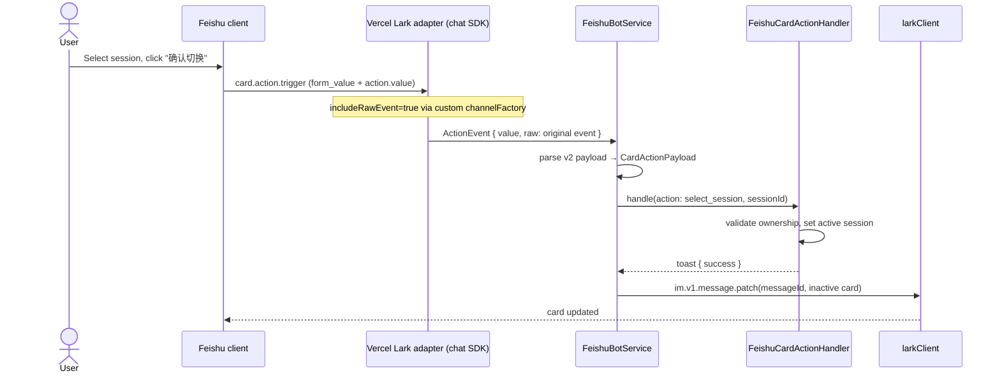

## Summary

Migrate the four legacy Feishu interactive cards to Feishu Cards v2. The session-switcher card becomes a form-container with a `select_static` dropdown and a submit button; after a successful switch the original card is patched to an inactive state. The workspace-list, approval, and question cards keep their user-visible behavior and move to v2 structures and callbacks.

## Problem Frame

The current session-switcher card renders every session as a separate row with its own "选择" button. As users accumulate sessions the card becomes long and hard to scan. Feishu Cards v2's form container lets a dropdown hold its value locally and submit once, which matches the desired "select then confirm" flow without intermediate server events. Migrating all four legacy cards together avoids maintaining two card builders and two callback parsers in parallel.

## Requirements

**Session switcher card (origin R1–R7)**

- R1. Render the session switcher as a Feishu Cards v2 form container.
- R2. Use a `select_static` element populated with all sessions owned by the user, ordered by `createdAt ASC`.
- R3. The current active session is the default selected option, labeled with "（当前）".
- R4. Provide a submit button labeled "确认切换".
- R5. On submit, the server switches the user's active session to the selected `sessionId`, validates ownership, and returns a success toast.
- R6. After a successful switch, update the original card to an inactive state where the dropdown and submit button are no longer interactive.
- R7. When the user has no sessions, show "你还没有会话，发送 /new 创建新会话" and omit the dropdown and submit button.

**Other legacy cards (origin R8–R11)**

- R8. Migrate the workspace-list card to v2 while keeping one-select-button-per-workspace behavior.
- R9. Migrate the approval card to v2 while keeping "允许" / "拒绝" behavior.
- R10. Migrate the question card to v2 while keeping single-select immediate resolution, multi-select toggle plus submit, and the free-form fallback prompt.
- R11. Each migrated card must use v2 action callback shapes and continue to identify the action via a stable `action` field in the callback value.

**Callback handling (origin R12–R14)**

- R12. The Feishu card action handler must parse v2 payloads, including `form_value` keyed by component name, and route to the existing action handlers.
- R13. For non-form v2 actions (workspace, approval, question options), continue to derive `workspaceId`, `sessionId`, and action intent from the callback value.
- R14. Rate limiting per user remains in place for all card interactions.

**Testing and compatibility (origin R15–R17)**

- R15. Update card-builder tests to assert v2 JSON structure and component tags.
- R16. Update action-handler tests to use v2 callback payloads.
- R17. The streaming answer card, already v2, remains unchanged.

## Key Technical Decisions

- **KTD1. Bridge v2 form submissions through the chat SDK's raw event.** The Vercel Lark adapter's normalized `ActionEvent.value` only carries `action.value`; Feishu form-container submit values live in the original event's `form_value`. Enable raw-event capture by supplying a custom `channelFactory` when creating the Lark adapter, so `FeishuBotService` can read `form_value` from the raw payload.
- **KTD2. Patch the inactive card with `im.v1.message.patch`.** The chat SDK's `thread.edit` path converts edits to markdown, so it cannot carry interactive card JSON. Use the underlying `larkClient.im.v1.message.patch` API to update the original message card after a successful session switch.
- **KTD3. Keep the legacy `create_session` action handler.** The new session card no longer emits `create_session`, but old cards may still exist in chat history. Retain the handler to avoid breaking those messages.
- **KTD4. Introduce a dedicated `FeishuCardV2` type and builder helpers.** The legacy `FeishuCard` interface models the v1 shape (`config`, `header`, `elements`). v2 uses `schema: '2.0'`, `body`, and a different element vocabulary, so it needs its own type and helpers.

## High-Level Technical Design

The session-switcher flow crosses three layers: the Feishu client, the chat SDK adapter, and the bot service. The diagram focuses on the form-submit path because it is the only flow that reads `form_value` and updates a card in-place.

Non-form v2 actions (workspace, approval, question buttons) follow the existing path: the adapter normalizes `action.value` into `ActionEvent.value`, and `FeishuBotService` parses it as before.

## Implementation Units

### U1. Add v2 card type and builder helpers

- **Goal:** Provide a typed v2 card representation and small helper functions for the elements the migration needs.
- **Requirements advanced:** R1, R8, R9, R10, R15.
- **Dependencies:** None.
- **Files:**
  - `src/server/services/feishu-card-builder.ts` — add `FeishuCardV2` type and helpers.
  - `src/server/services/feishu-card-builder.test.ts` — create tests for helpers and card shapes.
- **Approach:**
  - Define `FeishuCardV2` with `schema: '2.0'`, optional `header`, and `body: { elements }`.
  - Add helpers for `formContainer`, `selectStatic`, `submitButton`, `actionButton`, `plainText`, `markdownText`, and `divider`.
  - Rename the existing v1 `FeishuCard` interface to `LegacyFeishuCard` or replace it entirely; all call sites that send cards through `sendCardToThread` will be v2 after this migration.
- **Patterns to follow:** The streaming answer card already uses `schema: '2.0'`; align the new type with that shape.
- **Additional call sites to update:** `FeishuStreamReply.sendText` currently builds a legacy v1 text-only card. Either migrate it to a v2 `markdown` element or switch it to `msg_type: 'text'` so it stays compatible with the new card type.
- **Test scenarios:**
  - `selectStatic` produces `tag: 'select_static'` with `options`, `initial_option`, and `name`.
  - `formContainer` wraps elements with `tag: 'form_container'` and carries a submit button with `form_action_type: 'submit'`.
  - `actionButton` produces `tag: 'button'` with `type: 'primary'` or `'default'` and a `value` object.
- **Verification:** The builder tests pass and `npm run lint` is clean.

### U2. Migrate workspace-list card to v2

- **Goal:** Keep the one-button-per-workspace behavior while emitting a v2 card.
- **Requirements advanced:** R8, R11.
- **Dependencies:** U1.
- **Files:**
  - `src/server/services/feishu-card-builder.ts` — rewrite `buildWorkspaceListCard`.
  - `src/server/services/feishu-card-builder.test.ts` — add v2 assertions.
- **Approach:**
  - Render a v2 card with a markdown header and one action button per workspace.
  - Each button's `value` carries `{ action: 'select_workspace', workspaceId }`.
- **Test scenarios:**
  - Happy path: card contains one button per workspace, each with the correct `workspaceId`.
  - Edge case: empty workspace list renders a plain-text hint and no buttons.
- **Verification:** `feishu-card-builder.test.ts` passes and the card JSON validates against the v2 shape.

### U3. Migrate approval card to v2

- **Goal:** Preserve "允许" / "拒绝" behavior under v2.
- **Requirements advanced:** R9, R11.
- **Dependencies:** U1.
- **Files:**
  - `src/server/services/feishu-card-builder.ts` — rewrite `buildApprovalCard`.
  - `src/server/services/feishu-stream-reply.ts` — verify call site still compiles.
  - `src/server/services/feishu-card-builder.test.ts`.
- **Approach:**
  - Render tool info as markdown/plain text and add two action buttons.
  - Button values carry `{ action: 'approval', workspaceId, sessionId, requestId, behavior: 'allow'|'deny' }`.
- **Test scenarios:**
  - Happy path: both buttons exist with correct values.
  - Edge case: optional `title`/`description`/`inputSummary` fields render when present.
- **Verification:** Builder tests pass and `FeishuStreamReply.postApprovalCard` still sends the card successfully.

### U4. Migrate question card to v2

- **Goal:** Preserve single-select immediate resolution, multi-select toggle plus submit, and free-form fallback.
- **Requirements advanced:** R10, R11.
- **Dependencies:** U1.
- **Files:**
  - `src/server/services/feishu-card-builder.ts` — rewrite `buildQuestionCard`.
  - `src/server/services/feishu-stream-reply.ts` — verify call site.
  - `src/server/services/feishu-card-builder.test.ts`.
- **Approach:**
  - For single-select options, emit one immediate action button per option.
  - For multi-select options, emit toggle action buttons plus a submit button (`action: 'question_submit'`).
  - For free-form questions, render plain text "请在聊天中直接回复该问题。" and no buttons.
- **Test scenarios:**
  - Single-select card contains option buttons with correct `questionIndex` and `answer` values.
  - Multi-select card contains toggle buttons and a submit button.
  - Free-form card contains the fallback text and no interactive options.
- **Verification:** Builder tests pass and `FeishuStreamReply.postQuestionCard` still works.

### U5. Build new session-switcher card with form container

- **Goal:** Replace the per-session button list with a dropdown and confirm button.
- **Requirements advanced:** R1–R7.
- **Dependencies:** U1.
- **Files:**
  - `src/server/services/feishu-card-builder.ts` — rewrite `buildSessionListCard`.
  - `src/server/services/feishu-card-builder.test.ts`.
- **Approach:**
  - When sessions exist, render a `form_container` with a `select_static` named `sessionId` and a submit button.
  - Set `initial_option` to the active session and label it "（当前）".
  - When no sessions exist, render only the empty-state plain text from R7.
  - Remove the "新建会话" button.
- **Test scenarios:**
  - Covers AE1: dropdown defaults to the active session and the submit button carries `action: 'select_session'` plus `workspaceId`.
  - Covers AE2: no sessions produces the empty-state text and no form elements.
  - Options are ordered by `createdAt ASC` and non-active sessions are not marked "（当前）".
- **Verification:** Builder tests pass and the card JSON matches the Feishu v2 form-container spec.

### U6. Parse v2 callbacks and route actions

- **Goal:** Make the bot service understand both legacy button payloads and v2 form submissions.
- **Requirements advanced:** R12, R13, R14.
- **Dependencies:** U1, U2, U3, U4, U5.
- **Files:**
  - `src/server/services/feishu-bot-service.ts` — update adapter initialization and `handleCardAction`/`parseCardActionValue`.
  - `src/server/services/feishu-card-action-handler.ts` — adjust `CardActionPayload` if needed.
  - `src/server/services/feishu-bot-service.test.ts` — update mocks.
  - `src/server/services/feishu-card-action-handler.test.ts` — update payloads.
- **Approach:**
  - Pass a custom `channelFactory` to `createLarkAdapter` that calls `createLarkChannel` with `includeRawEvent: true`.
  - In `handleCardAction`, detect v2 form submits by `event.actionId` (the submit button's `name`) or by inspecting the raw payload.
  - Extract `form_value.sessionId` from the raw Feishu event and build a `CardActionPayload` with `action: 'select_session'`, `workspaceId`, and `sessionId`.
  - For non-form v2 actions, parse `event.value` as JSON and route by `payload.action` as today.
  - Preserve per-user rate limiting in `FeishuCardActionHandler`.
- **Execution note:** Start by writing a failing integration-style test that feeds a realistic v2 form-submit `ActionEvent` (including `raw`) into `handleCardAction` and asserts the correct handler is invoked.
- **Test scenarios:**
  - Happy path: form submit with `form_value: { sessionId: 'session-42' }` routes to `select_session` and sets the active session.
  - Edge case: non-form workspace button still routes to `select_workspace`.
  - Error path: missing `form_value` returns a parse-error toast.
  - Rate limit: rapid submissions from the same user are rejected.
- **Verification:** Action-handler and bot-service tests pass.

### U7. Re-render the session-switcher card inactive after success

- **Goal:** Fulfill R6 by disabling the form after a successful switch.
- **Requirements advanced:** R6.
- **Dependencies:** U5, U6.
- **Files:**
  - `src/server/services/feishu-bot-service.ts` — patch the original message after `select_session` succeeds.
  - `src/server/services/feishu-card-builder.ts` — add a helper for the inactive session-switcher card.
  - `src/server/services/feishu-bot-service.test.ts`.
- **Approach:**
  - After `feishuCardActionHandler.handle` returns a success toast for `select_session`, call `larkClient.im.v1.message.patch` with the original `messageId` and an inactive v2 card.
  - The inactive card should show the selected session name and disable or remove the dropdown and submit button. If Feishu v2 supports `disabled: true` on the form components, use it; otherwise replace the form with plain text.
  - Keep the 5-second callback response window in mind: send the patch before any slow I/O if possible (the active-session store write is local and fast).
- **Test scenarios:**
  - Covers AE1: successful switch triggers `im.v1.message.patch` with the correct `messageId` and an inactive card.
  - Error path: ownership failure does not patch the card.
- **Verification:** Bot-service tests assert the patch call and payload. Add `im.v1.message.patch` to the `MockLarkClient` in `src/server/services/feishu-bot-service.test.ts` so the patch path can be exercised.

### U8. Update integration tests and validate

- **Goal:** Ensure the migrated cards and callback parser work together and the suite stays green.
- **Requirements advanced:** R15, R16, R17.
- **Dependencies:** U1–U7.
- **Files:**
  - `src/server/services/feishu-bot-service.test.ts` — add a `patch` method to the `MockLarkClient` and assert v2 card payloads in `im.message.create`.
  - `src/server/services/feishu-card-action-handler.test.ts` — update payloads to v2 shapes where the card builder emits v2.
  - `src/server/services/feishu-card-builder.test.ts` — create or extend tests for v2 helpers and all four migrated cards.
- **Approach:**
  - Update existing action-handler tests to use v2-shaped payloads where the card builder now emits v2.
  - Update bot-service tests to assert v2 card JSON in `larkClient.im.v1.message.create` calls.
  - Add new builder tests for all four migrated cards.
  - Run `npm run lint` and `npm run test:server`.
- **Test scenarios:**
  - All four migrated cards produce valid v2 JSON.
  - The `sendText` fallback card in `FeishuStreamReply` is either v2-compatible or sent as `msg_type: 'text'`.
  - Each action type (workspace, session submit, approval allow/deny, question single/multi) routes correctly from a v2 payload.
  - The streaming answer card tests still pass unchanged.
- **Verification:** Lint and server tests pass.

## Scope Boundaries

- The streaming answer card stays unchanged; it already uses v2 through CardKit.
- The workspace-list card keeps one-button-per-workspace; it is not converted to a dropdown.
- No new Feishu text commands or bot menu items are added.
- No backend changes to session ownership, workspace admin logic, or the active-session store.
- The legacy `create_session` action handler remains for backward compatibility but is no longer emitted by the session card.

## Risks & Dependencies

- **Feishu v2 form-container behavior.** The plan assumes a form-container submit returns `form_value` keyed by component `name` in the raw event. This was verified against the Feishu docs but needs runtime confirmation during implementation.
- **Raw-event access.** The Vercel Lark adapter does not expose `includeRawEvent` in its public config. The plan uses the internal `channelFactory` override; if that proves unstable, the fallback is to use `@larksuiteoapi/node-sdk`'s `CardActionHandler` directly for card actions.
- **Card update API shape.** `im.v1.message.patch` supports updating interactive cards, but the exact v2 content envelope must be confirmed in a test environment.
- **Callback response timing.** Feishu expects a response within ~5 seconds. The active-session store write is local, but any unexpected latency in `chatService.getSession` during ownership checks should be watched.
- **Rate-limit distribution.** The current rate limit is in-memory per process. This is acceptable for a desktop app but will not coordinate across multiple server processes.

## Acceptance Examples

- AE1. **Successful session switch**
  - **Covers:** R1, R3, R5, R6.
  - **Given** the user owns sessions A (current) and B. **When** the card renders, the dropdown defaults to "A（当前）". The user selects B and clicks "确认切换". **Then** the server sets the active session to B, returns "会话已切换。", and patches the original card inactive.

- AE2. **Empty session state**
  - **Covers:** R7.
  - **Given** the user has no Feishu sessions. **When** the card renders. **Then** it shows "你还没有会话，发送 /new 创建新会话" with no dropdown or confirm button.

- AE3. **Ownership check on switch**
  - **Covers:** R5.
  - **Given** the user submits a session they do not own. **When** the submit reaches the server. **Then** it returns "你无法操作该会话。" and leaves the active session unchanged, without patching the card.

## Sources / Research

- Origin requirements: `docs/brainstorms/2026-06-27-feishu-cards-v2-migration-requirements.md`
- Current card builders: `src/server/services/feishu-card-builder.ts`
- Current action handler: `src/server/services/feishu-card-action-handler.ts`
- Card sending and callback entry point: `src/server/services/feishu-bot-service.ts`
- Streaming answer v2 shape precedent: `src/server/services/feishu-card-builder.ts` (`buildStreamingAnswerCard`)
- Feishu Cards v2 form container docs: https://open.feishu.cn/document/feishu-cards/card-json-v2-components/containers/form-container
- Feishu `im.v1.message.patch` docs: https://open.feishu.cn/document/uAjLw4CM/ukTMukTMukTM/reference/im-v1/message/patch
- Prior Feishu integration plan (callback ordering, raw body, rate limiting): `docs/plans/2026-06-21-001-feat-feishu-lark-integration-plan.md`
- WeCom card-update learning (5-second window, platform-native disable): `docs/solutions/integration-issues/wecom-update-template-card-5s-window.md`
