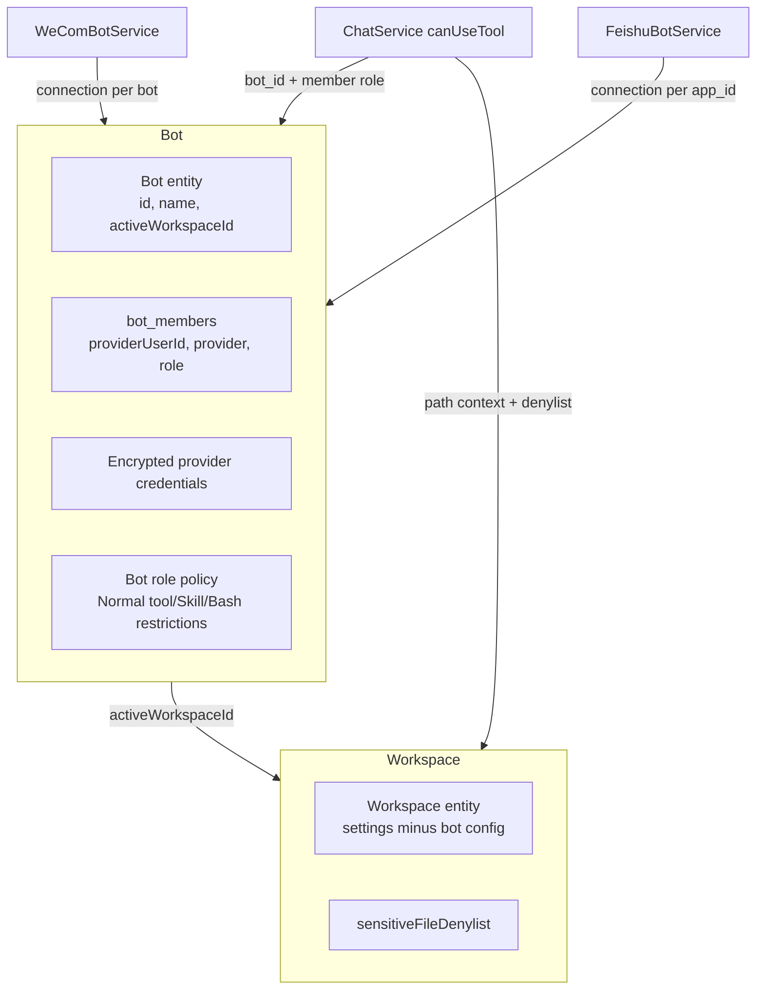

# Bot-Workspace Decoupling Implementation Plan

## Summary

Promote WeCom and Feishu bot configuration from per-workspace settings into a first-class `Bot` entity. A bot owns its provider credentials, member roles (Owner/Admin/Normal), tool/Skill/Bash policies, and a single active workspace. Workspaces keep only a configurable sensitive-file denylist and non-bot settings. Existing workspace bot configs migrate automatically to standalone bots. The work touches the SQLite schema, server services, provider connection management, chat policy injection, migration logic, and the GUI Settings page.

## Problem Frame

Today every workspace stores its own `wecomBotId`/`wecomBotSecret`, `feishuAppId`/`feishuAppSecret`, tool permissions, admin lists, and Skill isolation inside `Workspace.settings`. If the same bot should serve multiple workspaces, credentials and policies must be duplicated; RBAC is hard to maintain across workspace switches. Decoupling moves bot identity, roles, and policies above the workspace so switching active workspace becomes a single binding change.

## Requirements

Requirements are carried from `docs/brainstorms/2026-06-28-bot-workspace-decoupling-requirements.md` and grouped by concern. Each requirement keeps its original R-ID.

### Bot entity and workspace binding

- R1. Bot is created as an independent entity with name, provider connection settings, and a reference to its active workspace.
- R2. A workspace can be the active workspace of at most one bot at a time.
- R3. A bot has exactly one active workspace at a time.
- R4. Only a Bot Owner may change the active workspace.
- R5. The GUI shows each bot's provider connection state and active workspace.

### Provider connections

- R6. A bot can store and enable WeCom connection credentials.
- R7. A bot can store and enable Feishu connection credentials.
- R8. Enabling a provider establishes its connection; disabling tears it down.
- R9. WeCom and Feishu are independent per bot; each bot has its own Feishu `lark.Client`/`Chat` and WeCom `WSClient`, and inbound events route by `app_id` (Feishu) or bot connection context (WeCom).

### Members and roles

- R10. A bot maintains a per-provider member list that maps provider user IDs to roles.
- R11. Roles are Owner, Admin, and Normal, with distinct file/tool/Bash/Skill permissions.
- R12. New bot members default to Normal.
- R13. Only a Bot Owner may assign or change member roles in the GUI.
- R14. Role changes take effect immediately for all sessions of the bot, including in-flight tool calls.

### Role-based permissions

- R15. Owner may manage the bot, members, and active workspace, and has full file/tool/Skill permissions in the active workspace.
- R16. Admin has full file/tool/Skill permissions in the active workspace, including other users' `data/<user>` directories.
- R17. Normal may read shared workspace files and read/write only its own `data/<providerUserId>` directory; `data/<providerUserId>` is scoped per workspace.
- R18. Normal file access is constrained by the workspace sensitive-file denylist; denylist hits and cross-user reads are rejected with a uniform message and audited. Owner/Admin are not constrained by the denylist.

### Workspace switching

- R19. Owner may view and switch the active workspace in the GUI.
- R20. Owner may switch the active workspace in WeCom or Feishu via `/workspace` and an interactive card.
- R21. Switching only updates the active workspace reference; existing sessions stay in their original workspace, and active chat sessions receive a notification.
- R22. New inbound messages are routed to the active workspace.

### Sessions and routing

- R23. Inbound messages resolve the target workspace from the bot's current active workspace; WeCom events arrive on a bot connection, Feishu events route by `app_id` to the bot first.
- R24. Each provider user's sessions are isolated by workspace; sessions remain owned by the workspace that created them.
- R25. The GUI session list shows source badges for bot-created sessions.

### Migration and compatibility

- R26. On upgrade, each workspace's bot config migrates to an independent bot; credentials are not merged across workspaces.
- R27. Migration preserves provider credentials/enable state and maps old Skill/Bash/tool settings conservatively to bot-level role policies.
- R28. The workspace's native owner becomes the bot Owner; old admin-list users become Admin; all other existing bot users become Normal.
- R29. After migration, workspaces no longer store bot credentials, tool permissions, file scopes, Bash whitelist, Skill policies, or admin lists; only the sensitive-file denylist and non-bot workspace settings remain.

### GUI

- R30. Settings gains a "Bot Management" page listing bots, provider status, active workspace, and members.
- R31. The Workspace settings page shows only the bound bot and the sensitive-file denylist editor.
- R32. Bot deletion requires confirmation and explains that provider connections will drop and historical sessions remain in their workspaces.
- R33. Bot forms validate provider credentials and block binding a workspace already active for another bot.
- R34. Member management covers empty state, manual add, remove confirmation, and role changes with immediate refresh; Normal/Admin users do not see management actions.
- R35. Migration runs automatically at startup, supports dry-run, pauses bot services during migration, rolls back on failure, and reports status in the GUI.
- R36. Bot role policies include Skill allowlist and Bash whitelist: Owner configures them and is unrestricted; Admin is unrestricted; Normal is restricted to the lists.
- R37. Provider credentials are encrypted at rest and never logged in plaintext.
- R38. Security events are audited: credential changes, workspace binding switches, role changes, provider enable/disable, and file-access denials.

## Key Technical Decisions

- KTD1. **Bot owns policy and connection; workspace owns only the active binding and denylist.** This keeps the workspace model small and makes workspace switching a single foreign-key update.
- KTD2. **Provider credentials are encrypted at rest with AES-256-GCM.** The encryption key is derived from a machine-bound secret so credentials are not portable across machines, but they are safe from accidental log/db leakage.
- KTD3. **Role resolution is dynamic per tool call.** The old snapshot-at-runtime-start behavior is replaced by looking up the bot member and policy on every `canUseTool` invocation so R14 is satisfied without runtime restart.
- KTD4. **Sessions store `bot_id`.** Existing sessions are backfilled during migration; new bot sessions record the creating bot so ongoing sessions remain bound to the right bot and policy after workspace switches.
- KTD5. **Provider routing is bot-indexed.** WeCom connections are keyed by `bot_id`; Feishu connections are keyed by `app_id`. Inbound events resolve the bot first, then the active workspace.
- KTD6. **Migration is per-workspace, transactional, and dry-run capable.** No credential merge is performed; failure rolls back the schema writes and restores the legacy workspace settings so the app can still start.
- KTD7. **Owner/Admin bypass the workspace sensitive-file denylist; Normal is constrained by it.** This matches the requirement that the denylist protects shared sensitive files from Normal users while giving administrators full access.
- KTD8. **A single Owner per bot.** In the GUI the local Comate operator acts as Owner. In chat apps, a provider user must hold the Owner role to switch workspaces; if no Owner member exists, chat-based switching is unavailable until the operator adds one.

## High-Level Technical Design

### Routing changes

- **WeCom:** `WeComBotService.connections` becomes `Map<botId, BotConnection>`. Event handlers receive `botId` and read `bot.activeWorkspaceId` to resolve the target workspace. `getWorkspaceIdByBotId(botId)` returns the active workspace.
- **Feishu:** `FeishuBotService` holds `Map<appId, Connection>`. The chat adapter is created per bot with its own `app_id`. Raw events carry `app_id`; the dispatcher looks up the connection and bot, then resolves the active workspace.

### Policy flow in `ChatService.canUseTool`

1. Identify `botId` from the session.
2. Resolve the provider user ID from the session source (WeCom/Feishu) and look up the member role.
3. Owner/Admin allow all categorized tools/Skills/Bash.
4. Normal uses the bot-level `ToolPermissionPolicy`, Skill allowlist, Bash whitelist, path policy, and workspace denylist.
5. File-tool validation uses `bot-path-policy.ts` with the workspace denylist merged into the matchers.

## Implementation Units

### U1. Bot data model, storage schema, and encrypted credential store

**Goal:** Introduce the `Bot` domain model and persist it safely.

**Files:**

- `src/server/models/bot.ts` (new)
- `src/server/storage/sqlite-store.ts`
- `src/server/utils/credential-crypto.ts` (new)
- `src/server/storage/sqlite-store.test.ts` (new or extend)

**Approach:**

- Define `Bot`, `BotProviderSettings`, `BotRolePolicy`, `BotMember`, `CreateBotInput`, `UpdateBotInput` in `models/bot.ts`.
- Add SQLite tables in `SqliteStore` constructor:
  - `bots(id, name, active_workspace_id, created_at, updated_at)`
  - `bot_members(bot_id, provider, provider_user_id, role, created_at, updated_at)`
  - `bot_audit_logs(id, bot_id, actor_type, actor_id, event_type, details_json, created_at)`
- Add `sessions.bot_id` column and backfill it during migration.
- Add workspace setting `sensitiveFileDenylist: string[]` to `WorkspaceSettings`.
- Implement `credential-crypto.ts` with AES-256-GCM encrypt/decrypt. Derive the key from a machine-bound secret (e.g., a key file in the app data directory generated once at first use, with restrictive permissions). Never log plaintext credentials.
- Add store methods: `createBot`, `updateBot`, `getBot`, `listBots`, `deleteBot`, `setBotActiveWorkspace`, `getBotMembers`, `setBotMemberRole`, `removeBotMember`, `getBotMemberRole`, `listBotsForWorkspace`, `recordAuditLog`.

**Test scenarios:**

- Create and retrieve a bot with encrypted WeCom and Feishu credentials; verify decrypt returns original values.
- Tampering with the stored ciphertext causes decryption to throw, not return garbage.
- Setting a workspace as active for one bot blocks another bot from using it.
- `resetData()` clears the new bot tables.

### U2. Bot service layer

**Goal:** Provide business logic for bot CRUD, role resolution, policy resolution, and workspace binding.

**Files:**

- `src/server/services/bot-service.ts` (new)
- `src/server/services/bot-policy.ts` (new)
- `src/server/services/bot-skill-policy.ts`
- `src/server/services/tool-permission-policy.ts`

**Approach:**

- Implement `BotService` as a singleton with methods: `createBot`, `updateBot`, `deleteBot`, `setActiveWorkspace`, `addMember`, `setMemberRole`, `removeMember`, `resolveMemberRole`, `resolveActiveWorkspace`, `validateCredentials`.
- Enforce single Owner: `setMemberRole` rejects creating a second Owner unless the existing Owner is demoted first.
- `BotPolicy` resolves effective permissions for a member:
  - Owner/Admin: allow all tools/Skills/Bash.
  - Normal: apply `BotRolePolicy.normalToolPolicy`, `BotRolePolicy.skillAllowlist`, `BotRolePolicy.bashWhitelist`.
- Move Skill evaluation from workspace-scoped `WeComBotIsolationSettings` to bot-scoped `BotRolePolicy`. Update `bot-skill-policy.ts` to accept the bot policy context.
- Keep `tool-permission-policy.ts` unchanged; the bot policy references a `ToolPermissionPolicy` for Normal users.

**Test scenarios:**

- Owner/Admin bypass Normal tool policy and Skill allowlist.
- Normal is denied a file-write tool when the Normal policy denies `fileWrite`.
- Normal is denied a Skill not in the allowlist.
- Adding a second Owner fails until the first is demoted.
- Binding an already-bound workspace throws a clear error.

### U3. Per-bot provider connection management

**Goal:** Refactor WeCom and Feishu services from workspace-scoped or singleton connections to per-bot connections.

**Files:**

- `src/server/services/wecom-bot-service.ts`
- `src/server/services/feishu-bot-service.ts`
- `src/server/services/feishu-card-action-handler.ts`
- `src/server/index.ts`

**Approach:**

- Change `WeComBotService.connections` to `Map<string, BotConnection>` keyed by `botId`; `botIdToWorkspaceId` derives from `bot.activeWorkspaceId`.
- `initialize()` loads all bots with enabled WeCom credentials and calls `connect(bot)`.
- `connect(bot)` creates a `WSClient` with the encrypted credentials decrypted at runtime; store `botId` and active workspace on the connection; update `botIdToWorkspaceId` on `authenticated`.
- On active workspace switch, update the connection's `workspaceId` in place (or reconnect) so new events route correctly.
- Change `FeishuBotService` to maintain `Map<string, Connection>` keyed by `appId`. Each connection owns its own `lark.Client`, `Chat`, and event handlers.
- `initialize()` loads all bots with enabled Feishu credentials and connects each.
- In the Feishu event path, extract `app_id` from the raw event to look up the connection and bot, then use `bot.activeWorkspaceId`.
- Update `FeishuCardActionHandler` callbacks to operate on a bot (e.g., `setActiveWorkspace(botId)`) instead of a workspace.

**Test scenarios:**

- Two bots with different WeCom credentials can both be connected.
- Switching a bot's active workspace routes a subsequent inbound message to the new workspace.
- Two Feishu app IDs connect simultaneously and events route to the correct bot.
- Disabling a provider disconnects only that bot's connection.

### U4. Migration service from workspace-embedded config to standalone bots

**Goal:** Safely convert existing workspace settings into bots without losing credentials or policy state.

**Files:**

- `src/server/services/bot-migration-service.ts` (new)
- `src/server/storage/sqlite-store.ts`
- `src/server/index.ts`

**Approach:**

- Implement `BotMigrationService.migrate(options: { dryRun?: boolean })`.
- Run inside a SQLite transaction. Before writing, snapshot the workspace settings JSON of every workspace into a migration log row so rollback can restore it.
- For each workspace with bot-related settings:
  - Create a bot named from `wecomBotName`/`feishuBotName` or workspace name.
  - Encrypt and store provider credentials.
  - Set `active_workspace_id` to the current workspace.
  - Map old `wecomBotIsolation.adminUserIds` and `feishuAdminUserIds` to Admin members.
  - Map every other tracked WeCom/Feishu user to Normal.
  - Map old `wecomToolPermissions` to the bot's Normal tool policy; map old `defaultAllowedSkills`/`adminAllowedSkills` to the Normal Skill allowlist (Admin bypasses everything).
  - Strip bot-related fields from `Workspace.settings` and add an empty `sensitiveFileDenylist`.
  - Backfill `sessions.bot_id` for sessions whose workspace matches the new bot.
- On any error, roll back the transaction and leave legacy settings intact. The migration service logs status and a dry-run preview.
- Gate startup: if migration has not run, pause bot initialization, run migration, then initialize bots.

**Test scenarios:**

- Dry-run returns the list of bots that would be created without writing them.
- Migration creates one bot per workspace even when two workspaces share the same WeCom bot ID.
- After migration, workspace settings no longer contain `wecomBotId`, `feishuAppId`, etc.
- A failed migration leaves workspace rows unchanged and reports the error.
- Re-running migration is idempotent (use a `migration_version` marker or check for existing bots).

### U5. Chat policy injection with dynamic role checks

**Goal:** Enforce bot-level roles and policies for every tool call, including in-flight calls after role changes.

**Files:**

- `src/server/services/chat-service.ts`
- `src/server/services/bot-path-policy.ts`
- `src/server/services/bot-service.ts`
- `src/server/models/session.ts`

**Approach:**

- Add `botId?: string` to `ChatSession` and the sessions table; set it when a bot creates a session.
- In `ChatService.buildSdkOptions`, when `isBotSession`, resolve `botId` from the session, then resolve the member role and bot policy on each `canUseTool` call.
- Replace the static policy snapshot with dynamic lookups:
  - `evaluateToolPermission(normalPolicy, toolName, isAdminOrOwner)`
  - `evaluateSkill({ skillAllowlist, isAdminOrOwner }, toolName, input)`
  - For `Bash`, add a whitelist check for Normal users against `BotRolePolicy.bashWhitelist`.
- Update `bot-path-policy.ts` to accept a workspace denylist and an `isAdminOrOwner` flag. Owner/Admin bypass the denylist; Normal does not.
- Return the uniform denial message `"权限不足：无法访问该路径"` for path denials and log an audit event.

**Test scenarios:**

- A Normal user is denied reading another user's `data/<other>` directory.
- A Normal user is denied reading a file matching the workspace denylist.
- An Admin user can read/write another user's directory.
- After a member is promoted from Normal to Admin, the next tool call in the same session is allowed.
- A Bash command not in the whitelist is denied for Normal but allowed for Admin.

### U6. Workspace switch in WeCom and Feishu chat apps

**Goal:** Let a Bot Owner switch the active workspace from within WeCom and Feishu.

**Files:**

- `src/server/services/wecom-bot-service.ts`
- `src/server/services/wecom-template-card.ts`
- `src/server/services/feishu-bot-service.ts`
- `src/server/services/feishu-card-action-handler.ts`
- `src/server/services/feishu-card-builder.ts`

**Approach:**

- Add `/workspace` command detection in WeCom (`parseWecomWorkspaceCommand`).
- Build a WeCom template card listing workspaces with the current active one highlighted; selection triggers `BotService.setActiveWorkspace(botId, workspaceId)`.
- In Feishu, reuse `/workspace` and the existing card builder; update the action handler to verify the sender is a member with Owner role and to call the bot service.
- After a successful switch, send a proactive message to active sessions (or a best-effort broadcast to recent users) stating the new workspace name and noting that in-flight tasks continue in the previous workspace.
- Reject the command with a clear error if the sender is not Owner.

**Test scenarios:**

- Owner sends `/workspace` and receives a card; selecting a workspace updates `bot.active_workspace_id`.
- Non-Owner user sending `/workspace` is rejected.
- After switching, a new message from any user creates a session in the new workspace.
- An existing session in the old workspace continues to operate under the old workspace.

### U7. Server API routes for bot management and workspace binding

**Goal:** Expose bot CRUD, member management, workspace binding, and status endpoints.

**Files:**

- `src/server/routes/bots.ts` (new)
- `src/server/routes/workspaces.ts`
- `src/server/index.ts`

**Approach:**

- Add `src/server/routes/bots.ts` with:
  - `GET /api/bots` — list bots with provider status and active workspace.
  - `POST /api/bots` — create a bot.
  - `GET /api/bots/:id` — get bot details and members.
  - `PUT /api/bots/:id` — update bot name/provider settings.
  - `DELETE /api/bots/:id` — delete bot after confirming impact.
  - `POST /api/bots/:id/active-workspace` — switch active workspace (Owner only).
  - `POST /api/bots/:id/members` — add a member.
  - `PUT /api/bots/:id/members/:providerUserId/role` — change role.
  - `DELETE /api/bots/:id/members/:providerUserId` — remove member.
  - `GET /api/bots/:id/status` — provider connection status.
  - `POST /api/bots/migrate` — trigger dry-run or real migration; report status.
- Update `src/server/routes/workspaces.ts`:
  - Remove bot enable/connect logic from `PUT /api/workspaces/:id`.
  - Add/update `GET /api/workspaces/:id/bot` to return the bound bot (if any).
  - Add/update sensitive-file denylist persistence through normal workspace settings.
- Mount `bots.ts` in `src/server/index.ts`.

**Test scenarios:**

- Creating a bot with invalid WeCom credentials returns field-level errors.
- Selecting an already-bound workspace returns `400` with the message "该 workspace 已被其他 bot 激活绑定，请先解绑".
- Only the local operator (Owner) can add members or switch active workspace.
- Deleting a bot removes the active binding but leaves sessions untouched.

### U8. GUI Bot Management page

**Goal:** Add a Settings page where the operator can manage bots, members, and workspace binding.

**Files:**

- `src/client/components/SettingsPanel.tsx`
- `src/client/components/BotManagementPage.tsx` (new)
- `src/client/components/BotForm.tsx` (new)
- `src/client/components/BotMemberList.tsx` (new)
- `src/client/stores/bot-store.ts` (new)

**Approach:**

- Add a `bots` top-level tab or a "Bot Management" section in `SettingsPanel`.
- Implement `bot-store.ts` mirroring `workspace-store.ts` patterns: `fetchBots`, `createBot`, `updateBot`, `deleteBot`, `switchWorkspace`, `fetchMembers`, `addMember`, `removeMember`, `setMemberRole`, `runMigration`.
- Build `BotManagementPage.tsx`:
  - List of bots with provider status badges and active workspace.
  - Create/edit bot drawer/form (`BotForm.tsx`) with provider toggles, credential fields, and workspace selector.
  - Member management (`BotMemberList.tsx`) with empty state, add member by provider + user ID, role select, remove confirmation.
  - Deletion confirmation dialog explaining impact.
- Enforce UI-level gating so Normal/Admin users do not see management actions. Since the GUI runs locally for the operator, backend authorization remains the source of truth; the UI simply hides controls.

**Test scenarios:**

- Creating a bot shows the new bot in the list with the selected workspace.
- Validation errors appear next to credential fields when the server rejects them.
- Switching active workspace updates the active workspace label.
- Removing a member requires confirmation and refreshes the list.

### U9. Workspace settings cleanup and sensitive-file denylist UI

**Goal:** Remove bot-related fields from the workspace settings page and expose the denylist editor.

**Files:**

- `src/client/components/SettingsPanel.tsx`
- `src/client/components/WorkspaceSettingsForm.tsx` or existing workspace form
- `src/server/models/workspace.ts`

**Approach:**

- Remove WeCom/Feishu credential fields, tool permissions, isolation, and admin lists from the workspace form in `SettingsPanel`.
- Replace them with a read-only view of the bound bot and a link to Bot Management.
- Add a `sensitiveFileDenylist` editor (textarea with one glob per line) in the workspace form.
- Update `WorkspaceSettings` interface to remove migrated fields and add `sensitiveFileDenylist?: string[]`.
- Keep non-bot fields such as `promptHistoryRetentionDays`, `wecomFilePromptTemplate`, skills, MCP servers, and hooks.

**Test scenarios:**

- Saving a workspace persists the denylist globs.
- The workspace form no longer shows bot credential inputs.
- The bound bot is displayed with a link to Bot Management.

### U10. Audit logging and security hardening

**Goal:** Satisfy R37 and R38: encrypted credentials and audit logging.

**Files:**

- `src/server/services/bot-audit-logger.ts` (new)
- `src/server/services/bot-service.ts`
- `src/server/services/chat-service.ts`
- `src/server/utils/credential-crypto.ts`

**Approach:**

- Implement `BotAuditLogger` with `log(botId, actor, eventType, details)` writing to `bot_audit_logs` and to `diagLog` with sanitized details.
- Audit events:
  - `provider_credentials_changed`
  - `active_workspace_switched`
  - `member_role_changed`
  - `provider_enabled` / `provider_disabled`
  - `file_access_denied`
- Ensure credential values are never written to logs, API responses, or diagnostics; only `<set>` markers are logged.
- Mark `BotProviderSettings` secrets as sanitized in serialization (redact in toJSON if needed).

**Test scenarios:**

- Switching active workspace creates an audit row with old and new workspace IDs.
- A file-access denial creates an audit row with session, tool, and reason but not the full credential.
- Decrypt failures during bot startup are logged but do not leak the ciphertext.

### U11. Test coverage and integration verification

**Goal:** Ensure the new bot subsystem is safe to ship and migrations are reliable.

**Files:**

- `src/server/services/bot-service.test.ts` (new)
- `src/server/services/bot-migration-service.test.ts` (new)
- `src/server/services/bot-policy.test.ts` (new)
- `src/server/utils/credential-crypto.test.ts` (new)
- `src/server/routes/bots.test.ts` (new)
- `src/server/services/chat-service.test.ts` (extend)
- `src/server/services/wecom-bot-service.test.ts` (extend)
- `src/server/services/feishu-bot-service.test.ts` (extend)

**Approach:**

- Use `createIsolatedStore()` or `new SqliteStore(':memory:')` and import `src/server/test-utils/test-env` first in every test.
- Cover unit logic in service tests, route behavior with an in-memory store, and integration scenarios across bot creation → connection → message → policy.
- Add a migration integration test that creates an old-style workspace, runs migration, and verifies the resulting bot and cleaned workspace.

**Test scenarios:**

- End-to-end: create bot → enable WeCom → send message → Normal user denied denylisted file → Owner switches workspace → new message routes to new workspace.
- Migration dry-run produces no side effects.
- Migration rollback leaves the original workspace settings intact.

## Scope Boundaries

### In scope

- Independent bot entity with CRUD and member role management.
- One bot supporting both WeCom and Feishu connections simultaneously.
- Bot-level Owner/Admin/Normal roles and corresponding permissions.
- Workspace sensitive-file denylist as a configurable workspace setting.
- Single-active workspace binding and switching in GUI and chat apps.
- Automatic migration of existing workspace bot configurations.

### Deferred for later

- Maintaining member roles inside WeCom/Feishu chat apps.
- Audit-log viewer UI.
- Migrating existing sessions to a new workspace during a switch.
- Cross-provider identity merge (linking the same person's WeCom and Feishu accounts).
- Multi-workspace concurrent activation.

### Outside scope

- Changing the GUI session's own permission model.
- Adding providers other than WeCom and Feishu.
- Allowing bot file access outside the workspace directory.

## Risks and Dependencies

- **Credential encryption key loss.** If the machine-bound key is lost, encrypted credentials cannot be recovered. Mitigation: the migration snapshot preserves the old workspace settings until migration succeeds, and a dry-run lets operators preview the change.
- **Feishu SDK multi-instance behavior.** The SDK supports multiple clients, but event routing by `app_id` must be verified with the actual adapter. Mitigation: keep the existing single-connection path behind a feature flag during development and add integration tests before enabling multi-bot.
- **Role-change performance.** Dynamic role lookup on every tool call adds store queries. Mitigation: cache member roles per session with a short TTL or invalidate on member changes; measure in tests.
- **Migration failure on partial data.** Old workspaces may have partial bot settings. Mitigation: migration skips workspaces with no usable credentials and reports them; transaction rollback protects the rest.
- **Session source backward compatibility.** Pre-migration sessions lack `bot_id`; the migration backfills it. Any code that assumes `source === 'wecom'` implies a workspace-bound bot must now use `bot_id`.

## Sources / Research

- Requirements origin: `docs/brainstorms/2026-06-28-bot-workspace-decoupling-requirements.md`
- Current workspace settings model: `src/server/models/workspace.ts:10-33`
- SQLite schema and migration patterns: `src/server/storage/sqlite-store.ts:51-268`
- WeCom bot service (workspace-scoped connection): `src/server/services/wecom-bot-service.ts:149-263`
- Feishu bot service (singleton connection): `src/server/services/feishu-bot-service.ts:42-130`
- Chat policy injection snapshot: `src/server/services/chat-service.ts:1053-1126`
- Path policy and denylist: `src/server/services/bot-path-policy.ts:20-57`
- Feishu workspace card handler: `src/server/services/feishu-card-action-handler.ts:71-88`
- Workspace update route (current bot enable/disable): `src/server/routes/workspaces.ts:71-130`
- Client settings structure: `src/client/components/SettingsPanel.tsx:58-117`
