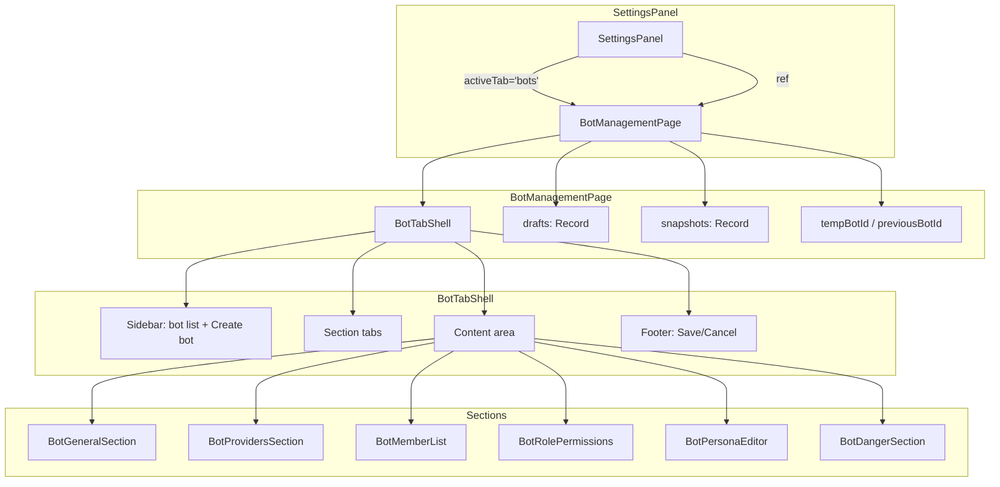

# Unify Bot Settings Layout with Workspace Settings

## Summary

Rebuild the Bots tab in Settings so it mirrors the Workspace tab: a left sidebar lists bots, the right pane shows horizontal section tabs (General, Providers, Members, Roles, Persona, Danger), and General/Providers use page-level Save/Cancel dirty tracking. Members, Roles, and Persona keep their existing per-section save behavior. New bots are staged in the sidebar before creation.

## Problem Frame

The current Bots tab (`src/client/components/BotManagementPage.tsx`) uses a list-to-drill-in model with full-page views and back buttons. This is visually and behaviorally different from the Workspace tab's stable two-column layout. Because bots are first-class entities with growing configuration surface (providers, members, roles, persona, delete), unifying the layout reduces context switching and makes Settings feel coherent.

---

## Requirements

### Page structure and navigation

- R1. The Bots tab displays a two-column layout: a left sidebar listing bots and a right content area showing the selected bot's settings.
- R2. The left sidebar shows each bot's name only, with the selected bot highlighted.
- R3. The sidebar includes a "Create bot" action that stages a new, unsaved bot entry.
- R4. The right content area shows horizontal section tabs: General, Providers, Members, Roles, Persona, Danger.
- R5. The active section tab is visually highlighted using existing accent styling conventions.
- R6. The General section is the default active section when selecting a bot.
- R7. Section tab labels are translatable via i18n keys in English and Chinese.
- R8. When no bots exist, the right content area shows an empty state with a create action instead of section tabs.

### Basic config staging and save

- R9. General section contains: bot name and active workspace selection.
- R10. Providers section contains: WeCom and Feishu enable toggles, credentials, and bot name per provider.
- R11. Edits to General and Providers are held in local draft state and are not persisted until the user clicks Save.
- R12. The page footer shows Save and Cancel buttons when a bot's basic config is dirty.
- R13. Clicking Save validates required fields (e.g., bot name, provider-required IDs) and then calls the bot creation or update API.
- R14. Clicking Cancel reverts General and Provider edits to the last saved snapshot.
- R15. Attempting to switch to another bot in the sidebar with unsaved basic changes shows the same unsaved-changes dialog used when closing Settings, with Save, Discard, and Keep editing options.
- R16. Attempting to close Settings with unsaved basic changes shows the existing unsaved-changes dialog.

### Members, Roles, and Persona

- R17. The Members section embeds the existing member-management UI and keeps its current immediate-save behavior for add, remove, and role assignment.
- R18. The Roles section embeds the existing role-permissions editor and keeps its current per-section Save button.
- R19. The Persona section embeds the existing per-role persona editor and keeps its current per-section Save/Cancel dirty guard.
- R20. Errors from immediate-save actions in Members, Roles, or Persona are surfaced inside their respective sections and do not block the page-level Save/Cancel flow.

### Danger

- R21. The Danger section contains a Delete bot action with a confirmation dialog.
- R22. The confirmation dialog explains that deletion disconnects providers and that existing sessions remain in their workspaces.
- R23. Deleting a bot removes it from the sidebar and clears the selection to another bot or the empty state.

### Create flow

- R24. Clicking "Create bot" inserts a temporary "New bot" row in the sidebar, selects it, and opens the General section with empty fields.
- R25. The temporary bot is not persisted until the user clicks Save.
- R26. Clicking Cancel while a temporary bot is selected removes the temporary row and reverts to the previously selected bot, or to the empty state if no bots exist.
- R27. Saving a new bot creates it via the bot creation API and replaces the temporary row with the persisted bot.

---

## Key Technical Decisions

- **KTD1. Reuse the Workspace tab shell vocabulary via a new `BotTabShell` component.** The Workspace tab uses a left sidebar (`w-64`) and horizontal section tabs (`src/client/components/SettingsPanel.tsx:1200-1314`). Building a parallel `BotTabShell` keeps the layout, selection, and scroll behavior consistent without altering the Workspace implementation.
- **KTD2. Split the current `BotForm` into `BotGeneralSection` and `BotProvidersSection`.** The existing form mixes name/workspace with WeCom/Feishu credentials. Separate section components let General and Providers live under their own tabs and share the same draft state object.
- **KTD3. Page-level Save/Cancel applies only to General + Providers.** Members, Roles, and Persona already have their own Save buttons and immediate or guarded persistence. Keeping them isolated avoids backend batch mutations and preserves the persona dirty guard. Visually, General and Providers tabs show the page-level footer only when dirty; Members, Roles, and Persona tabs show their own section-level Save buttons so the mixed model is obvious.
- **KTD4. Snapshot-based dirty tracking keyed by bot id.** `BotManagementPage` holds `drafts: Record<string, BotFormData>` and a matching `snapshots: Record<string, BotFormData>`. Dirty detection compares the two with a deep equality check, mirroring `SettingsPanel`'s `snapshotRef` pattern.
- **KTD5. Stage new bots as temporary sidebar entries.** A new bot gets a client-side temporary id (`temp-${crypto.randomUUID()}`), is inserted into the local bot list, and is marked `isNew`. Save calls `createBot`; Cancel removes the entry. This matches the draft-first model and avoids partial persisted state.
- **KTD6. Coordinate bot dirty state with `SettingsPanel` for Settings-close guard.** `BotManagementPage` exposes an imperative handle with `isDirty()`, `save()`, and `discard()`. `SettingsPanel` checks this handle when the Bots tab is active so the existing unsaved-changes dialog also protects bot edits on close.

---

## Implementation Units

### U1. Create `BotTabShell` layout component

- **Goal:** Provide the two-column, section-tab layout for the Bots tab without business logic.
- **Files:** `src/client/components/BotTabShell.tsx` (new).
- **Patterns:** Copy the flex layout and scroll-safe CSS from `WorkspaceTabShell` (`SettingsPanel.tsx:1241-1312`): outer `flex h-full`, left `w-64 border-r overflow-y-auto`, right `flex-1 flex flex-col overflow-hidden`, section tabs `flex border-b`, content `flex-1 overflow-y-auto p-6`, footer `border-t`. Render section tabs from a configurable list and an optional footer slot.
- **Test Scenarios:**
  - Renders the sidebar, section tabs, content area, and footer slot.
  - Highlights the selected bot and active section.
  - Shows empty state when `bots` array is empty, reusing `bots.emptyTitle` and `bots.emptyDescription` for the right-pane empty state.

### U2. Extract `BotGeneralSection` and `BotProvidersSection` from `BotForm`

- **Goal:** Move the General fields (name, active workspace) and Provider fields (WeCom/Feishu toggles + credentials) into separate tab sections while preserving validation helpers and secret sentinels.
- **Files:**
  - `src/client/components/BotGeneralSection.tsx` (new)
  - `src/client/components/BotProvidersSection.tsx` (new)
  - `src/client/components/bot-form-utils.ts` (new) — extract `BotFormData`, `emptyForm`, `botToForm`, `buildSecretValue`, and validation rules.
  - `src/client/components/BotForm.tsx` (update or remove if no longer used elsewhere).
  - `src/client/components/BotForm.test.tsx` (update or remove once `BotGeneralSection` and `BotProvidersSection` tests cover the same behavior).
- **Patterns:** Both sections receive `form: BotFormData` and `onUpdate(patch: Partial<BotFormData>)`. They are controlled components that read from and write to the shell's draft state. Preserve the existing secret masking and `true` sentinel behavior for unchanged secrets. `handleSave` in Unit 3 must import `buildSecretValue` and validation rules from `bot-form-utils.ts` rather than reimplementing them. Before removing `BotForm.tsx`, search the codebase for other consumers and either update them or keep `BotForm` as a thin wrapper.
- **Test Scenarios:**
  - `BotGeneralSection` edits name and active workspace.
  - `BotProvidersSection` toggles WeCom/Feishu and shows/hides credential fields.
  - Secret inputs display `••••••••` placeholder when the original secret is set and the field is empty.

### U3. Refactor `BotManagementPage` with draft state and section orchestration

- **Goal:** Replace the `view` state machine with sidebar selection + section tabs, and manage page-level drafts/snapshots for basic config.
- **Files:** `src/client/components/BotManagementPage.tsx`.
- **Patterns:**
  - State: `selectedBotId`, `activeSection`, `drafts: Record<string, BotFormData>`, `snapshots: Record<string, BotFormData>`, `tempBotId`, `previousBotId`, `showUnsavedDialog`, `pendingBotId`.
  - Handlers: `handleSave()` for basic config, `handleCancel()` for basic config, `handleCreateBot()` for staging, `handleSelectBot()` for guarded switching, `handleSaveRolePolicy(rolePolicy)` for the Roles section, `handleSavePersona(payload)` for the Persona section, `handleDeleteBot()` for the Danger section.
  - Initialize drafts/snapshots from `useBotStore().bots` on first load and when bots change, but do not overwrite drafts for the currently selected bot unless it was deleted. When `handleCreateBot()` creates a temporary bot, also initialize `drafts[tempId]` and `snapshots[tempId]` from `emptyForm()` so dirty detection has a baseline.
  - `isDirty()` compares `drafts[selectedBotId]` with `snapshots[selectedBotId]`.
  - `handleUpdate(patch)` merges into `drafts[selectedBotId]`.
  - `handleSave()` validates using the shared validation rules from `bot-form-utils.ts`, builds `providerSettings` by importing `buildSecretValue` from `bot-form-utils.ts` (no inline reimplementation), calls `createBot` for temporary bots or `updateBot` for existing bots, surfaces API or validation errors in a page-level banner above the footer, and updates the snapshot on success. While saving, disable the Save/Cancel buttons and show a loading indicator.
  - `handleCancel()` reverts the current draft to its snapshot; if the current bot is temporary, remove both the draft and snapshot entries and restore `previousBotId`.
- **Test Scenarios:**
  - Selecting a bot opens General by default.
  - Editing name marks basic config dirty and shows Save/Cancel footer.
  - Save persists changes and clears dirty state; validation and API errors surface in a page-level banner.
  - Cancel reverts changes.
  - Switching bots with unsaved changes shows the unsaved-changes dialog with Save, Discard, and Keep editing options.

### U4. Implement staged new-bot creation and bot-switch guard

- **Goal:** Allow creating a bot as a temporary sidebar entry and guard switching away from unsaved changes.
- **Files:** `src/client/components/BotManagementPage.tsx`.
- **Patterns:**
  - `handleCreateBot()` generates a temporary id, inserts a minimal bot object into the local list, selects it, sets `isNew`, and records `previousBotId`.
  - Sidebar click handler checks `isDirty()` first. If dirty, store the target id in `pendingBotId` and show the unsaved-changes dialog.
  - Dialog actions: Save-and-switch, Discard-and-switch, Keep editing.
- **Test Scenarios:**
  - Clicking "Create bot" inserts a temporary row, selects it, and opens General.
  - Saving the temporary bot calls `createBot` and replaces the row with the persisted bot.
  - Clicking Cancel while a temporary bot is selected removes the temporary row and restores the previous selection (or empty state).
  - Clicking another bot while dirty shows the unsaved dialog.
  - Choosing Discard switches bots and reverts edits.

### U5. Embed existing editors in Members, Roles, and Persona sections

- **Goal:** Reuse the existing member, role, and persona editors inside their tabs without changing their save behavior.
- **Files:** `src/client/components/BotManagementPage.tsx`.
- **Patterns:**
  - Members tab: render `BotMemberList` with `botId={selectedBotId}` and immediate callbacks to `addMember`, `setMemberRole`, `removeMember`.
  - Roles tab: render `BotRolePermissions` with `bot={selectedBot}`, `onSave={handleSaveRolePolicy}`, and `onBack={undefined}` so no back button appears inside the tab shell.
  - Persona tab: render `BotPersonaEditor` with `bot={selectedBot}`, ref, and `onSave={handleSavePersona}`.
  - Keep immediate-save section errors scoped to those sections; do not let them pollute the page-level Save/Cancel footer.
- **Test Scenarios:**
  - Members tab calls `addMember` immediately when a member is added.
  - Roles tab calls `updateBot` with role policy when its Save button is clicked.
  - Persona tab keeps its internal dirty guard when switching away.

### U6. Add `BotDangerSection` with delete flow

- **Goal:** Provide a dedicated Danger tab with a delete action and confirmation.
- **Files:** `src/client/components/BotDangerSection.tsx` (new).
- **Patterns:** Use the same dedicated dialog component pattern as `DeleteWorkspaceDialog` (`src/client/components/DeleteWorkspaceDialog.tsx`). Explain that deletion disconnects providers and that existing sessions remain in their workspaces. After deletion, `BotManagementPage` selects the next bot in the list or shows the empty state.
- **Test Scenarios:**
  - Clicking Delete shows a confirmation dialog.
  - Confirming calls `deleteBot`, removes the bot from the sidebar, and updates selection.

### U7. Coordinate bot dirty state with `SettingsPanel` close guard

- **Goal:** Ensure the existing Settings unsaved-changes dialog also protects bot edits when closing Settings.
- **Files:** `src/client/components/SettingsPanel.tsx`, `src/client/components/BotManagementPage.tsx`.
- **Patterns:**
  - Define a `BotManagementPageHandle` interface (`{ isDirty: () => boolean; save: () => Promise<void>; discard: () => void }`) in a shared location (e.g., `src/client/components/BotManagementPage.tsx`).
  - Convert `BotManagementPage` to support `React.forwardRef` and expose the handle via `useImperativeHandle` with stable dependencies.
  - In `SettingsPanel`, attach a ref to `<BotManagementPage ref={botPageRef} />`.
  - Update `SettingsPanel`'s existing `isDirty()` callback to also check `activeTab === 'bots' && botPageRef.current?.isDirty()`.
  - Update `SettingsPanel`'s existing `handleSave()` and `handleDiscard()` to delegate to `botPageRef.current` when `activeTab === 'bots'`.
- **Test Scenarios:**
  - Closing Settings while the Bots tab has unsaved basic changes shows the unsaved-changes dialog.
  - Choosing Save in the dialog saves bot changes and closes Settings.
  - Choosing Discard reverts bot changes and closes Settings.

### U8. Add i18n keys for new labels

- **Goal:** Provide translatable labels for section tabs, new bot default name, and danger copy.
- **Files:** `src/client/i18n/en/settings.json`, `src/client/i18n/zh-CN/settings.json`.
- **Patterns:** Add keys under `bots.sections` or similar namespace. Ensure both language files stay in sync.
- **New keys (proposed):**
  - `bots.sections.general`, `bots.sections.providers`, `bots.sections.members`, `bots.sections.roles`, `bots.sections.persona`, `bots.sections.danger`
  - `bots.newBotName` (default "New bot")
  - `bots.danger.title`, `bots.danger.deleteTitle`, `bots.danger.deleteDescription`
- **Test Scenarios:**
  - English and Chinese translations render correctly for all new section tabs.
  - Both `en/settings.json` and `zh-CN/settings.json` contain every new key before the unit is considered complete.

### U9. Add/update tests

- **Goal:** Cover the new layout, state transitions, dirty tracking, and Settings close guard.
- **Files:**
  - `src/client/components/BotManagementPage.test.tsx` (new)
  - `src/client/components/BotTabShell.test.tsx` (new)
  - `src/client/components/BotGeneralSection.test.tsx` (new)
  - `src/client/components/BotProvidersSection.test.tsx` (new)
  - `src/client/components/SettingsPanel.test.tsx` (update)
- **Patterns:** Use the existing test helpers: `renderWithI18n`, `makeBot`, `makeWorkspace`, mock `useBotStore` actions with `vi.fn()`, and assert dirty state via Save/Cancel button visibility.
- **Test Scenarios:**
  - `BotManagementPage` switches bots, saves basic config, stages new bots, and guards dirty switches.
  - `SettingsPanel` delegates close guard to `BotManagementPage` when the Bots tab is active.

---

## High-Level Technical Design

State flow:

1. `BotManagementPage` loads bots from `useBotStore` and initializes `drafts`/`snapshots` per bot.
2. Sidebar selection changes `selectedBotId`; `activeSection` resets to `general`.
3. `BotGeneralSection` and `BotProvidersSection` read from and write to `drafts[selectedBotId]`.
4. `isDirty()` compares drafts and snapshots for the selected bot.
5. Save validates, calls `createBot`/`updateBot`, then updates the snapshot.
6. Cancel reverts the draft to the snapshot; for temporary bots it removes the entry.

---

## Scope Boundaries

### In scope

- Restructuring the Bots tab to a two-column, section-tab layout.
- Page-level Save/Cancel for General and Providers.
- Staged new-bot creation in the sidebar.
- Reusing existing Members, Roles, and Persona editors inside section tabs.
- Unsaved-changes guard when switching bots or closing Settings.

### Deferred for later

- Batch-saving Members, Roles, or Persona together with basic config.
- Inline editing of bot names directly in the sidebar.
- Search or filtering in the bot list.
- Drag-to-reorder bots in the sidebar.

### Outside this product's identity

- Changing the Workspace tab layout or top-level Settings tabs.
- Changing runtime bot behavior, persona injection, or role permission enforcement.
- Adding new bot providers beyond WeCom and Feishu.

---

## Risks & Dependencies

- **Risk:** `BotForm` may be imported elsewhere. Search the codebase before removing or heavily refactoring it; if another route uses it, keep `BotForm` as a thin wrapper around the new sections or update the consumer.
- **Risk:** Secret sentinel logic is easy to regress during the split. Keep `buildSecretValue` and validation rules in one shared helper file and reuse them in Save.
- **Risk:** Two dirty-tracking systems (SettingsPanel for workspace/app, BotManagementPage for bots) can conflict. The imperative ref coordination in KTD6 keeps them separate but must be tested for the Settings-close path.
- **Dependency:** Existing bot CRUD and member APIs (`src/stores/bot-store.ts`) remain unchanged; the plan relies on their current signatures.
- **Dependency:** `BotMemberList`, `BotRolePermissions`, and `BotPersonaEditor` must be embeddable without API changes. Verify their prop interfaces during implementation.

---

## Acceptance Examples

- **AE1. Basic config follows page-level Save.** Given a bot named "TeamBot" is selected on General. When the owner changes the name to "TeamBot v2" and clicks Save. Then the bot is updated, the sidebar shows "TeamBot v2", and Save/Cancel return to inactive. (Covers R9, R11, R12, R13.)
- **AE2. Provider split keeps General short.** Given a bot is selected and the owner clicks the Providers tab. When the owner views the page. Then WeCom and Feishu credentials appear under Providers, not General. (Covers R4, R10.)
- **AE3. Create bot is staged before persistence.** Given the Bots tab shows one existing bot. When the owner clicks "Create bot", enters "NewBot", and clicks Save. Then a new bot named "NewBot" is created, appears in the sidebar, and is selected. (Covers R3, R24, R25, R27.)
- **AE4. Mixed save model is visible to users.** Given a bot is selected. When the owner adds a member in Members, saves role permissions in Roles, and edits the bot name in General without saving. Then the member and role changes persist; the name change remains a draft and is reverted on Cancel. (Covers R17, R18, R19, R20.)
- **AE5. Unsaved changes guard bot switching.** Given the owner edits the active workspace in General without saving. When the owner clicks another bot in the sidebar. Then an unsaved-changes dialog appears with Save, Discard, and Keep editing options. (Covers R15.)

---

## Sources / Research

- Origin requirements: `docs/brainstorms/2026-06-30-bot-settings-unified-layout-requirements.md`
- Reference layout pattern: `src/client/components/SettingsPanel.tsx` (`WorkspaceTabShell`, lines 1200-1314)
- Current Bots tab implementation: `src/client/components/BotManagementPage.tsx`
- Current bot form: `src/client/components/BotForm.tsx`
- Existing editors: `src/client/components/BotMemberList.tsx`, `src/client/components/BotRolePermissions.tsx`, `src/client/components/BotPersonaEditor.tsx`
- Bot client-side state: `src/client/stores/bot-store.ts`
- Responsive layout safety pattern: `docs/plans/2026-05-28-003-fix-settings-modal-responsive-bounds-plan.md`
- Workspace settings plan (dirty tracking pattern): `docs/plans/2026-05-21-004-feat-workspace-settings-page-plan.md`
- Per-role persona plan (section embedding precedent): `docs/plans/2026-06-30-003-feat-per-role-bot-persona-plan.md`
