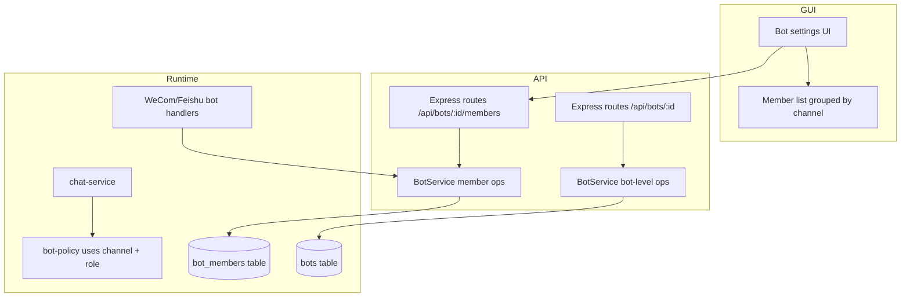

## Summary

Rename the bot "Provider" domain term to "Channel" across the TypeScript models, Express API, SQLite database, and React UI. Change bot ownership from a single global owner per bot to exactly one owner per `(bot, channel)` pair, while allowing multiple admins per channel. Bot-level configuration (role policy, persona, active workspace) stays shared; bot-level operations remain available only to the GUI/system actor. Existing bots are migrated so each configured channel gets an initial owner.

## Problem Frame

The current bot model calls WeCom and Feishu "providers" and enforces a single owner per bot. A bot connected to both channels forces one person to own both, even though each channel serves a different user population and may be administered by a different person. The terminology is also misleading: "provider" collides with the unrelated LLM provider concept. The requirements doc (see origin) resolves these by introducing per-channel ownership and renaming the domain to "Channel".

## Requirements

The plan advances every requirement from the origin document. The implementation units below map directly to the origin R-IDs.

### Terminology rename

- R1. `BotProvider` → `BotChannel` (values still `'wecom'`, `'feishu'`).
- R2. `provider` → `channel` and `providerUserId` → `channelUserId` on `BotMember`, `bot_members`, API payloads, and UI props/state.
- R3. `BotProviderSettings` → `BotChannelSettings`, `providerSettings` → `channelSettings`, `provider_settings_json` → `channel_settings_json`.
- R4. `WeComProviderConfig` → `WeComChannelConfig`, `FeishuProviderConfig` → `FeishuChannelConfig`.
- R5. User-facing labels, audit-log event types, and i18n keys updated from "provider" to "channel" for WeCom/Feishu access.

### Ownership model

- R6. Each `(bot, channel)` has exactly one owner.
- R7. A channel owner can add, remove, and change roles for members in their channel.
- R8. A channel can have multiple admins with the same runtime bypass as owners.
- R9. Removing or demoting the only owner of a channel fails.
- R10. Bot-level operations (create, delete, switch active workspace, change shared config) are authorized by the GUI/system actor, not by channel ownership.

### Runtime, migration, and UI

- R11. Runtime role resolution uses the renamed channel field; owner/admin bypass unchanged.
- R12. Unrecorded channel users default to `normal`.
- R13. Existing bots get an owner row for each configured channel.
- R14. Existing `admin` and `normal` members keep their role and channel association.
- R15. Member list groups members by channel and shows the owner per channel.
- R16. UI prevents creating a second owner in a channel and warns before removing the last owner.

## Key Technical Decisions

- **Rename in code first, then DB columns.** Server models, client store, services, and UI switch to `channel`/`channelUserId`/`channelSettings`. The SQLite schema is migrated by adding new columns, backfilling, and using table-recreate to drop the old columns. This matches the project's additive-only migration pattern while satisfying the requirement to rename the stored concept.
- **Keep LLM provider concepts untouched.** `providers` table, `sessions.provider_id`, and the LLM provider selector keep the word "provider"; only WeCom/Feishu bot access is renamed to "channel".
- **Preserve historical audit-log semantics.** Existing `bot_audit_logs` rows keep the old `provider_*` event-type strings and `provider`/`providerUserId` detail keys. The display layer (and any audit-log queries) must normalize these old keys to `channel`/`channelUserId` for rendering, or run a one-time backfill migration if uniform event types are required.
- **Channel-owner authorization lives in the service layer.** `BotService` member-management methods require the actor to be owner of the target channel. GUI routes continue to use `systemActor` for the trusted desktop user; bot handlers (e.g., future WeCom/Feishu commands) can pass a channel-owner actor.
- **Existing-bot migration promotes the previous global owner per channel, falling back to the first legacy admin.** The origin requirement (R13 / AE7) expects the previous global owner to become owner of each configured channel. Because pre-change databases created by `BotMigrationService` have no owner records, the implementation will first look for an existing global owner; if none exists, it will promote the first legacy admin of that channel. Channels with no admin start owner-less and require GUI assignment. Document this deviation from the origin requirement in U8.
- **No new `bot_channels` table.** The `(bot, channel)` scope is enforced through the existing `bot_members` composite key. A separate channels table is deferred until per-channel settings are needed.

## High-Level Technical Design

## Implementation Units

### U1. Rename domain types and interfaces

- **Goal:** Rename bot-provider types to bot-channel types in both server and client type systems.
- **Requirements:** R1, R2, R3, R4, R5.
- **Dependencies:** None.
- **Files:**
  - `src/server/models/bot.ts`
  - `src/client/stores/bot-store.ts`
  - `src/server/utils/bot-provider-crypto.ts`
  - `src/server/services/bot-audit-logger.ts`
- **Approach:** Type-only rename. Update `BotProvider` → `BotChannel`, `provider` → `channel`, `providerUserId` → `channelUserId`, `BotProviderSettings` → `BotChannelSettings`, `providerSettings` → `channelSettings`, config interfaces, and `ENCRYPTED_PROVIDER_KEYS`. Rename audit-log helpers like `logProviderEnabled` → `logChannelEnabled`. Keep values `'wecom'` and `'feishu'` unchanged.
- **Patterns to follow:** Server imports use `.js` extensions; client store duplicates server bot types rather than importing them.
- **Test scenarios:**
  - Type-check passes after renames.
  - No runtime behavior changes yet.
- **Verification:** `npm run lint` and `tsc` pass.

### U2. Add DB channel columns and backfill

- **Goal:** Introduce `channel` and `channel_user_id` columns and backfill from `provider`/`provider_user_id`; rename `provider_settings_json` to `channel_settings_json`.
- **Requirements:** R2, R3, R13, R14.
- **Dependencies:** U1.
- **Files:**
  - `src/server/storage/sqlite-store.ts`
- **Approach:**
  - In `SqliteStore` constructor, use `PRAGMA table_info(bot_members)` to detect the old `provider` column. If present, add `channel TEXT` and `channel_user_id TEXT` via `ALTER TABLE`, then backfill `channel = provider` and `channel_user_id = provider_user_id`.
  - Use the project's table-recreate pattern to immediately replace `provider_settings_json` with `channel_settings_json` in the `bots` table.
  - For `bot_members`, keep the old `provider`/`provider_user_id` columns until U3 switches reads/writes; drop them in U3 via table-recreate.
  - Add a unique partial index on `bot_members(bot_id, channel) WHERE role = 'owner'` so the database enforces R6's one-owner-per-channel invariant.
- **Patterns to follow:** Existing additive migrations at `src/server/storage/sqlite-store.ts:178-186` and table-recreate helpers like `migrateTodoDetailColumn`.
- **Test scenarios:**
  - Existing bots load and return `channelSettings` correctly after column rename.
  - Existing `bot_members` rows are backfilled with `channel`/`channel_user_id`.
  - Migration is idempotent on subsequent app starts.
- **Verification:** `npm run test:server` passes; isolated-store migration test covers backfill.

### U3. Update storage methods to read and write channel fields

- **Goal:** Switch all DB reads/writes from provider fields to channel fields.
- **Requirements:** R2, R3, R11.
- **Dependencies:** U2.
- **Files:**
  - `src/server/storage/sqlite-store.ts`
- **Approach:** Update `createBot`, `updateBot`, `getBot`, `setBotMember`, `getBotMemberRole`, `listBotMembers`, `removeBotMember`, and any SQL that selects/inserts members or bot settings to use `channel`, `channel_user_id`, and `channel_settings_json`. After reads are switched, drop the old `provider`/`provider_user_id` columns via table recreate. Rely on the unique partial index added in U2 to enforce the one-owner-per-channel constraint at the DB level.
- **Patterns to follow:** JSON columns are parsed/stringified in the store; member methods take `(botId, channel, channelUserId, role)`.
- **Test scenarios:**
  - Creating and updating bots persists `channelSettings` in the new JSON column.
  - Member CRUD works with `channel`/`channelUserId`.
  - Listing members returns the new field names.
- **Verification:** `npm run test:server` passes; storage tests use isolated DB.

### U4. Update service authorization to per-channel ownership

- **Goal:** Enforce exactly one owner per channel and restrict member management to that channel's owner.
- **Requirements:** R6, R7, R8, R9, R10.
- **Dependencies:** U1, U3.
- **Files:**
  - `src/server/services/bot-service.ts`
  - `src/server/services/bot-policy.ts`
- **Approach:**
  - Add `requireChannelOwner(botId, channel, channelUserId)`.
  - Change `ensureNoExistingOwner(botId)` → `ensureNoExistingChannelOwner(botId, channel)`.
  - Change `ensureAnotherOwnerExists(botId, provider, providerUserId)` to check only within the same channel.
  - Update `addMember`, `setMemberRole`, `removeMember` to require the actor to be owner of the target channel.
  - Keep bot-level methods (`createBot`, `deleteBot`, `updateBot`, `setActiveWorkspace`, shared-config updates) restricted to `system`/`user` actor, removing the global-owner check. These routes are reachable only through the trusted desktop GUI (`systemActor`), so no channel-owner actor can invoke them.
  - Update `bot-policy.ts` helpers to accept the renamed channel argument.
- **Patterns to follow:** Existing `BotActor` shape and `BotAuthorizationError` codes (`only-owner`, `owner-already-exists`, `last-owner`).
- **Test scenarios:**
  - Happy path: WeCom channel owner adds a WeCom admin.
  - Edge case: A user who is owner of both the WeCom and Feishu channels adds a Feishu owner successfully (ownership is per-channel).
  - Error path: adding a second owner to the same channel is rejected.
  - Error path: demoting or removing the only owner of a channel is rejected.
  - Error path: a channel owner cannot perform bot-level operations such as switching active workspace.
  - Error path: a channel admin cannot manage members.
- **Verification:** `npm run test:server` passes; `bot-service.test.ts` covers channel-scoped ownership.

### U5. Update API routes

- **Goal:** Rename provider to channel in the REST API and wire channel-owner authorization for member routes.
- **Requirements:** R2, R5, R7.
- **Dependencies:** U1, U4.
- **Files:**
  - `src/server/routes/bots.ts`
- **Approach:**
  - Rename request/response fields from `provider`/`providerUserId` to `channel`/`channelUserId`.
  - Update validation error messages.
  - Rename `redactProviderSettings` → `redactChannelSettings`.
  - For member-management routes, continue using `systemActor` for the trusted GUI. Because `systemActor` bypasses channel-owner checks by design, the service-layer `requireChannelOwner` guard is intended for future bot-handler callers, not for the GUI. Leave a documented extension point for bot handlers to supply a real channel-owner actor later.
- **Patterns to follow:** Route handlers return `{ bot }`, `{ members }`, `{ error }` shapes; `.js` extension imports.
- **Test scenarios:**
  - Adding a member accepts `channel` and `channelUserId`.
  - Invalid channel values return 400.
  - Responses include `channel` instead of `provider`.
  - Covers AE1.
- **Verification:** `npm run test:server` passes; `routes/bots.test.ts` updated.

### U6. Update runtime services

- **Goal:** WeCom, Feishu, and chat services use the renamed channel terminology and resolve roles per channel.
- **Requirements:** R2, R8, R11, R12.
- **Dependencies:** U1, U4.
- **Files:**
  - `src/server/services/wecom-bot-service.ts`
  - `src/server/services/feishu-bot-service.ts`
  - `src/server/services/chat-service.ts`
  - other services referencing `provider` in the bot-channel sense
- **Approach:**
  - Pass `channel` instead of `provider` to `botService.getMemberRole` and `bot-policy.ts` helpers.
  - Update audit-log calls from provider event types to channel event types.
  - Update connection maps and lookup logic that key off channel identifiers.
  - Because `setActiveWorkspace` is now restricted to `system`/`user` actor, the existing WeCom and Feishu `/workspace` chat commands will be rejected when invoked by channel owners. Either remove/disable those commands in this unit or introduce a channel-owner-scoped workspace-switch helper that does not call the system-only `setActiveWorkspace`.
- **Test scenarios:**
  - A WeCom admin session bypasses tool restrictions.
  - A Feishu admin session bypasses tool restrictions.
  - A normal user session is still restricted.
  - Covers AE4.
- **Verification:** Existing server tests and browser tests pass.

### U7. Update UI components and i18n

- **Goal:** Rename provider to channel in the React UI, group members by channel, and show channel-scoped ownership.
- **Requirements:** R2, R5, R15, R16.
- **Dependencies:** U1, U5.
- **Files:**
  - `src/client/components/BotMemberList.tsx`
  - `src/client/components/BotProvidersSection.tsx`
  - `src/client/components/BotManagementPage.tsx`
  - `src/client/i18n/en/bots.json` and `src/client/i18n/zh-CN/bots.json`
- **Approach:**
  - Rename component `BotProvidersSection` → `BotChannelsSection` and i18n keys `bots.providerWecom` → `bots.channelWecom`, `bots.sections.providers` → `bots.sections.channels`, etc.
  - Group `BotMemberList` rows by channel with a section header per channel.
  - Show an owner badge on the owner row.
  - Disable owner selection when the channel already has an owner.
  - Warn before removing the last owner of a channel.
  - When a new bot is created with WeCom or Feishu enabled, require the GUI user to assign an initial owner for each enabled channel before the bot can be saved, so that R6's one-owner-per-channel invariant holds from creation.
- **Patterns to follow:** Use `cn()` for Tailwind classes; `useTranslation('bots')`; Zustand bot store for server state.
- **Test scenarios:**
  - Member list renders grouped by channel.
  - Owner badge appears on the owner row.
  - Adding an owner is disabled when the channel already has one.
  - Removing the last owner shows a warning.
- **Verification:** `npm run test:client` and `npm run test:browser` pass.

### U8. Migrate existing bots to per-channel ownership

- **Goal:** Update the one-time workspace-to-bot migration so each configured channel gets an initial owner.
- **Requirements:** R13, R14.
- **Dependencies:** U3, U4.
- **Files:**
  - `src/server/services/bot-migration-service.ts`
- **Approach:**
  - After creating the bot and inserting admin/normal members, iterate configured channels.
  - For each channel, if a legacy admin exists, promote the first one to `owner`; otherwise leave the channel owner-less.
  - Bump the migration version to 2 (or add a separate `owner_promotion_completed` flag) and track it in `bot_migration_state` so the owner-promotion update runs only once on existing databases that already have version 1.
  - Update the `MigrationResult.preview.members` type to allow `'owner'` so previews are accurate.
- **Patterns to follow:** Transactional migration, dry-run/rollback behavior already present in `BotMigrationService`.
- **Test scenarios:**
  - Migration creates an owner for a channel with a legacy admin.
  - Migration leaves a channel owner-less when no admin exists.
  - Existing admins and normals keep their roles.
  - Covers AE7.
- **Verification:** `npm run test:server` passes; `bot-migration-service.test.ts` covers owner creation.

### U9. Add and update tests

- **Goal:** Verify the rename, ownership model, migration, and UI behavior.
- **Requirements:** All R-IDs, all AEs.
- **Dependencies:** U1–U8.
- **Files:**
  - `src/server/services/bot-service.test.ts`
  - `src/server/routes/bots.test.ts`
  - `src/server/services/bot-migration-service.test.ts`
  - `src/client/components/BotMemberList.test.tsx`
  - `src/server/storage/sqlite-store.bot-migration.test.ts`
- **Approach:** Add channel-scoped test cases and update existing provider-named cases. Use isolated DB for server tests.
- **Test scenarios:**
  - Covers AE2: a WeCom owner adds a Feishu owner.
  - Covers AE3: second owner in same channel rejected.
  - Covers AE5: last owner demotion rejected.
  - Covers AE6: channel owner cannot delete bot.
  - Covers AE7: migration creates per-channel owners.
- **Verification:** `npm run test:server`, `npm run test:client`, and `npm run test:browser` pass.

## Scope Boundaries

### In scope

- Rename Provider → Channel for WeCom/Feishu bot access across models, DB, API, and UI.
- Per-channel ownership and admin model.
- Migration of existing bots to per-channel owners.
- UI updates for channel grouping and owner visibility.

### Deferred for later

- Adding a WeChat channel.
- Per-channel tool policies, personas, or active workspaces.
- Bot handlers that let channel owners manage members via chat commands.
- Renaming the `bot_members` table itself or introducing a separate `bot_channels` table.

### Outside scope

- Changes to LLM provider management (`providers` table, `sessions.provider_id`, provider selector).
- Changes to workspace-level legacy isolation settings beyond migration.
- Changes to what owner/admin bypass covers.

## Open Questions

### Resolved during planning

- **Who becomes the initial owner for migrated channels?** The previous global owner becomes owner of each configured channel; if the pre-change database has no owner record, the first legacy admin of that channel is promoted. Channels with no admin start owner-less and require GUI assignment.
- **What happens to the DB column rename?** Add new columns, backfill, switch reads/writes, then use table recreate to remove old columns.
- **Do LLM provider concepts change?** No; only WeCom/Feishu bot access is renamed.

### Deferred to implementation

- Exact request shape for passing a channel-owner actor from future bot handlers.
- Final UI copy for the owner-less channel warning.

## Risks & Dependencies

- **Risk:** The wide rename touches many files and can miss stragglers.
  - **Mitigation:** Project-wide grep for `provider` in the bot subsystem during U1; rely on TypeScript compiler and tests to catch remaining references.
- **Risk:** SQLite table recreate for `bots` and `bot_members` could lose data if the migration is interrupted.
  - **Mitigation:** Wrap each recreate in a transaction and validate row counts before dropping old tables.
- **Risk:** Client and server bot types can drift during the rename.
  - **Mitigation:** Update `src/client/stores/bot-store.ts` immediately after `src/server/models/bot.ts` in the same unit.
- **Risk:** Existing production bots have no owner rows; migration must be idempotent and safe.
  - **Mitigation:** Use `bot_migration_state` version gating; promote first admin only when an owner is absent.

## Sources & Research

- Origin requirements: `docs/brainstorms/2026-07-01-bot-provider-to-channel-per-channel-owner-requirements.md`
- Bot models: `src/server/models/bot.ts`
- Bot service and auth: `src/server/services/bot-service.ts`
- Storage and migrations: `src/server/storage/sqlite-store.ts`
- API routes: `src/server/routes/bots.ts`
- UI member list: `src/client/components/BotMemberList.tsx`
- Migration service: `src/server/services/bot-migration-service.ts`
- Prior migration pattern: `docs/plans/2026-06-28-001-feat-bot-workspace-decoupling-plan.md`
- Test isolation convention: `docs/solutions/conventions/use-isolated-test-database-for-comate.md`

## Deferred / Open Questions

### From 2026-07-01 review

- **WeCom /workspace command conflicts with R10** — Requirements R10 / U4 / U6 (P0, feasibility, confidence 100)

  After the plan restricts setActiveWorkspace to system actor only, the WeCom bot handler's /workspace command (wecom-bot-service.ts:687) will reject all channel owners. The command will break at runtime with no migration path described.

- **Feishu setActiveWorkspace passes non-system actor** — Requirements R10 / U4 / U6 (P0, feasibility, confidence 100)

  FeishuBotService.setActiveWorkspace (feishu-bot-service.ts:396-400) calls botService.setActiveWorkspace with a {type:'feishu', provider:'feishu', providerUserId:actorUserId} actor. After U4 restricts setActiveWorkspace to system actor, this call will throw BotAuthorizationError and break Feishu workspace switching.

- **Modifying BotMigrationService cannot fix already-migrated bots** — U8. Migrate existing bots to per-channel ownership (P0, adversarial, confidence 100)

  The plan updates the one-time workspace-to-bot migration service to promote admins to owners. But in production, this migration has already run (version 1 is already recorded in bot_migration_state). The hasMigrationRun() guard prevents re-execution. Existing bots in production will never receive the owner-promotion logic. A separate post-migration step is required, but the plan does not describe one.

- **Ownership transfer UI flow undefined** — U7. Update UI components and i18n (P0, design-lens, confidence 100)

  R9 requires that removing the only owner succeeds when another owner is designated at the same time, but U7 disables owner selection when a channel already has an owner. These two constraints make ownership transfer impossible without a special UI mechanism (e.g., a transfer-ownership flow or atomic swap), which the plan does not describe. Implementers will either block waiting for a design decision or guess, producing inconsistent transfer UX.

- **GUI routes bypass per-channel ownership entirely** — U4. Update service authorization to per-channel ownership (P1, adversarial, confidence 100)

  The plan builds a complex per-channel ownership model but the GUI — the primary user interface — continues to use systemActor, which bypasses all ownership checks. This means the ownership model has no consumer in the shipped product; it only serves a deferred feature (bot handlers). The plan invests in infrastructure with no immediate user-facing value, and the service-layer ownership checks are effectively dead code for the GUI path.

- **AE2 test scenario impossible under plan auth rules** — U4. Update service authorization to per-channel ownership (P1, adversarial, confidence 100)

  The origin acceptance example AE2 states that a WeCom channel owner should be able to add a Feishu owner. However, the plan's own authorization rule requires the actor to be an owner of the target channel. A WeCom owner is not a Feishu owner, so the operation would be rejected. This contradiction means the plan cannot satisfy one of its own acceptance criteria without either changing the auth model or changing the acceptance example.

- **Member routes use systemActor, bypassing channel-owner authorization** — U5. Update API routes (P1, security-lens, confidence 100)

  The new model scopes member management to channel owners (R6, R7, R9), but the routes continue to invoke member-management methods using systemActor for all GUI requests. If systemActor bypasses the service-layer ownership check, the per-channel authorization model is not actually enforced on the API, allowing any GUI path to add or demote channel owners.

- **Plan contradicts origin on owner migration source** — U8. Migrate existing bots to per-channel ownership (P1, adversarial, confidence 100)

  The origin requirement R13 says existing bot owners are migrated per-channel, but the plan promotes the first legacy admin instead. Since the current migration service creates no owners at all, most production bots have no owners to migrate. The plan silently changes the requirement without acknowledging that the origin premise is false, which could lead to stakeholder misalignment about what the migration actually does.

- **Migration version gate blocks owner promotion on existing DBs** — U8 / Key Technical Decisions (P1, feasibility, confidence 100)

  BotMigrationService.hasMigrationRun() returns true when bot_migration_state.version is non-null (currently 1). The owner-promotion step must run on databases that already have version 1, but the current logic skips all migration work when a version exists. The plan does not specify a version-2 gate or a separate migration mechanism.

- **Missing empty and owner-less channel states** — U7. Update UI components and i18n (P1, design-lens, confidence 100)

  Migration can leave channels without owners, and channels may have no members. Without specified empty-state content, owner-less call-to-action, and visual prominence for owner-less channels, implementers will produce inconsistent UX. Users may not notice an owner-less channel that needs attention.

- **Warning interaction pattern undefined** — U7. Update UI components and i18n / R16 (P1, design-lens, confidence 100)

  R16 and U7 mention 'warn before removing the last owner' but do not specify the interaction pattern. Implementers must choose between a modal confirmation dialog, an inline alert, a disabled button with tooltip, or a multi-step flow. Each choice produces different UX and safety characteristics.

- **API routes lack authentication for member management** — Implementation Unit U5 (P1, security-lens, confidence 100)

  The Express API endpoints for adding, removing, and changing bot member roles are exposed without any authentication mechanism. Any local process or user can invoke these endpoints because the routes unconditionally pass a hardcoded systemActor(), bypassing the new per-channel authorization entirely. This renders the service-layer ownership checks inert for the GUI API and allows unauthorized member management.

- **Actor construction in chat-service.ts not detailed** — U6 (P1, feasibility, confidence 75)

  BotActor renames from provider/providerUserId to channel/channelUserId affect chat-service.ts:1243 where an actor is constructed as {type: provider, provider, providerUserId} for audit logging. The plan mentions chat-service.ts in U6 but does not list this actor construction change.

- **Member list interaction states unspecified** — U7. Update UI components and i18n (P1, design-lens, confidence 75)

  The plan describes static rendering of the member list but omits loading states during fetch, error states when the API fails, success confirmations after add/remove, and pending/optimistic states during role changes. Implementers will guess or omit these, producing jarring or confusing UX.

- **No UI flow for assigning owner to owner-less channel** — U7. Update UI components and i18n (P1, adversarial, confidence 75)

  The plan explicitly states that channels with no legacy admin will start owner-less and require GUI assignment. However, the UI implementation unit only describes preventing a second owner and warning before removing the last owner. Without an owner-creation flow for owner-less channels, those channels will remain unmanageable by channel owners, leaving a functional gap that breaks the per-channel ownership model for a non-trivial subset of bots.

- **Owner-less channel runtime behavior undefined** — Open Questions / Resolved during planning (P1, feasibility, confidence 75)

  The plan states channels with no admin start owner-less, but does not specify whether admins can still manage members, whether normal users can still use the bot, or what the UI should show for an owner-less channel. This gap will force implementers to make behavioral decisions during coding.

- **Owner-less migrated channels lack authorization for first owner assignment** — U8. Migrate existing bots to per-channel ownership (P2, security-lens, confidence 100)

  Channels without a legacy admin are created without an owner and the plan states only that 'the GUI must assign one.' It does not specify which actor or identity is authorized to perform that first assignment, leaving a privilege-escalation window where any caller able to reach the owner-assignment path can seize control of a channel.

- **No verification strategy for future bot-handler channel-owner actor** — Key Technical Decisions; U4; Open Questions (P2, security-lens, confidence 75)

  The plan relies on WeCom/Feishu bot handlers passing a channel-owner actor to member-management methods, but defers the exact request shape and provides no verification mechanism. Without proving that a chat user is the channel owner, a normal channel member could spoof owner identity and add admins or transfer ownership.

- **provider local variable in chat-service.ts not mentioned** — U6 (P2, feasibility, confidence 75)

  chat-service.ts uses const provider = session.source === 'wecom' || session.source === 'feishu' ? session.source : undefined which is semantically a channel identifier. The plan should mention renaming this for consistency with the new domain terminology.

- **No accessibility or responsive strategy** — U7. Update UI components and i18n (P2, design-lens, confidence 75)

  The grouped member list with channel sections, owner badges, disabled controls, and removal warnings requires keyboard navigation, focus management, screen-reader announcements, and touch-target sizing. Without specification, these will likely be omitted, making the feature unusable for keyboard and screen-reader users.

- **Owner-less channels have undefined authorization behavior** — Implementation Unit U8 (P2, security-lens, confidence 75)

  After migration, channels with no legacy admin are created without an owner. The plan does not specify how member-management authorization behaves when a channel has no owner. This creates a window where an attacker or confused deputy could exploit the undefined state to gain unauthorized access or block legitimate administration.

- **Audit log event rename breaks historical incident response** — Implementation Unit U1 (P2, security-lens, confidence 75)

  The plan renames audit-log event types from provider_* to channel_* equivalents and updates the BotAuditEventType union. Existing audit log rows in the database retain the old event type strings. After deployment, security investigations querying for channel_enabled or channel_credentials_changed will miss historical events logged under the old provider_* names, breaking incident correlation across the migration boundary.

