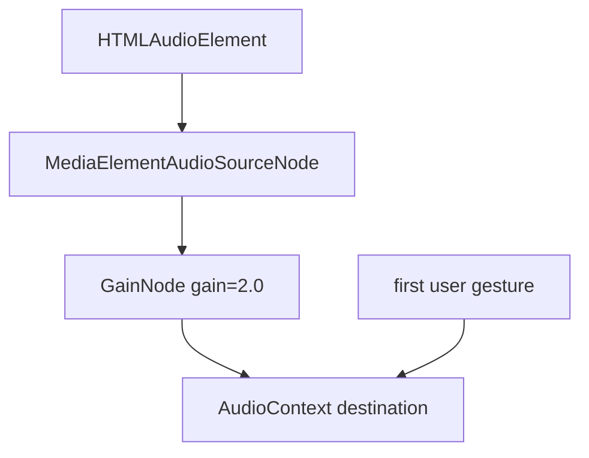

# Increase Notification Sound Volume with Fixed Playback Gain

## Goal Capsule

- **Objective:** Make notification sounds meaningfully louder at the current 100% volume setting without changing the existing 0-100% slider semantics or default value.
- **Authority hierarchy:** The existing notification-sound architecture (`src/client/lib/sound-player.ts`, `useNotificationSounds`, `notificationSoundsVolume`) stays in place; this change only adds a fixed software gain layer inside the player.
- **Stop condition:** Notification sounds are audibly louder at 100% volume, the existing slider still works as before, and the master toggle still suppresses all playback.
- **Execution profile:** Small client-only change; one primary implementation unit plus verification and i18n polish.

## Product Contract

### Summary

The notification-sounds feature already exposes a 0-100% volume slider that defaults to 100%, but users report the bundled clips are too quiet to hear. This plan applies a fixed software gain multiplier inside the sound player so that 100% volume sounds louder than the raw audio file, while leaving the slider UI and default unchanged.

### Problem Frame

Notification sounds are enabled and the volume slider is at its maximum (100%), yet users still miss the alerts because the bundled MP3 clips are mastered at a low level. Raising the slider above 100% is not supported by the native `HTMLAudioElement.volume` API, so the only software-side fix is to amplify the signal before it reaches the system mixer.

### Requirements

- R1. All notification sounds play through a fixed software gain multiplier.
- R2. The gain applies to both the "attention" and "completion" sounds.
- R3. The existing 0-100% volume slider semantics, default value (100%), and persistence behavior remain unchanged.
- R4. The gain is a single fixed value applied in the player, not a new user-facing setting.
- R5. The master notification-sounds toggle still suppresses all playback when off.

### Scope Boundaries

**Deferred for later**

- Replacing or re-mastering the source MP3 files.
- A user-configurable gain setting or volume slider above 100%.
- Per-sound volume or gain control.

**Outside this product's identity**

- OS-level toast/desktop notifications.
- Distinct sounds for errors or abnormal stops.

## Planning Contract

### Key Technical Decisions

- **KTD1 — Use the Web Audio API for amplification.** `HTMLAudioElement.volume` is limited to the 0-1 range and cannot amplify a quiet source. A `GainNode` in a Web Audio graph can apply a fixed multiplier greater than 1.0, which solves the reported problem without adding new UI.
- **KTD2 — Keep the fixed gain out of user settings.** The user explicitly chose a fixed-gain approach over extending the volume slider. The gain multiplier lives as a player constant (default `2.0`) so the behavior is consistent across installs and does not add another control to the settings panel.
- **KTD3 — Combine existing volume control with fixed gain.** The existing 0-100 setting continues to set `HTMLAudioElement.volume` to `0-1`. The fixed gain is applied on top, so 100% volume yields an effective gain of `1.0 * 2.0 = 2.0` and 0% is still silent.
- **KTD4 — Preserve autoplay-unlock behavior.** The Web Audio `AudioContext` must be resumed from a user gesture, just like the current element-based unlock. The existing first-interaction listener is reused/responsible for resuming the context.

### High-Level Technical Design

The sound player is augmented from a simple `Audio` element wrapper to a small Web Audio graph:

The rest of the system (`useNotificationSounds`, `SettingsPanel`, app settings) continues to call `playSound(kind, volume)` exactly as today. The volume argument still controls the audio element's `volume` property; the gain node adds a constant amplification layer.

## Implementation Units

### U1. Add fixed Web Audio gain to the sound player

- **Goal:** Amplify notification sound playback by routing the existing audio elements through a Web Audio graph with a fixed gain node.
- **Requirements:** R1, R2, R4.
- **Dependencies:** none.
- **Files:** `src/client/lib/sound-player.ts`; `src/client/lib/sound-player.test.ts`.
- **Approach:** Create a single `AudioContext` and a `GainNode` on first use. For each `SoundKind`, create the `HTMLAudioElement` as today, then create a `MediaElementAudioSourceNode` from it and connect it to the gain node and destination. Store the gain multiplier as a module constant (default `2.0`) and set `gainNode.gain.value` to it. Keep `playSound(kind, volume)` unchanged: clamp `volume` to 0-100, set `el.volume`, reset `currentTime`, and call `play()`. Reuse the existing gesture-unlock path to resume the `AudioContext` so autoplay policy remains satisfied. If the Web Audio graph cannot be built (no `AudioContext` support), fall back to the current element-only playback so sounds still play.
- **Patterns to follow:** Existing module-level singletons (`elements`, `unlocked`, listener flags) and test seams (`__resetSoundPlayer`, `__unlockSoundPlayer`) in `src/client/lib/sound-player.ts`.
- **Test scenarios:**
  - Happy path: after unlock, `playSound('attention')` creates an audio graph whose gain node value equals the fixed multiplier.
  - Happy path: `playSound('attention', 50)` sets the audio element volume to `0.5` while the gain node remains at the fixed multiplier.
  - Edge: `playSound` before unlock does not create the `AudioContext` and is a no-op.
  - Edge: volume `0` sets element volume to `0`, so output is silent regardless of gain.
  - Edge: volume `100` leaves element volume at `1` and gain at the fixed multiplier.
- **Verification:** Unit tests pass and, in the running app, a pending request at 100% volume is audibly louder than before.

### U2. Update player tests for Web Audio mocks

- **Goal:** Extend the sound-player unit tests to exercise the new gain path in a jsdom/node environment.
- **Requirements:** R1, R4.
- **Dependencies:** U1.
- **Files:** `src/client/lib/sound-player.test.ts`.
- **Approach:** Provide minimal global stubs for `AudioContext`, `GainNode`, and `createMediaElementSource` before importing the module under test. Assert that the gain node receives the expected fixed value and that the audio element still receives the correct `volume` for the input percentage. Keep the existing unlock/play assertions.
- **Patterns to follow:** Existing `MockAudio` stub pattern and `@ts-expect-error` global installation in `src/client/lib/sound-player.test.ts`.
- **Test scenarios:**
  - Happy path: mocked `GainNode.gain.value` is set to the fixed multiplier after unlock.
  - Regression: the audio element's `play()` is still invoked for each `playSound` call.
  - Edge: `createMediaElementSource` is called once per audio element and the returned source is connected to the gain node.
- **Verification:** `npm run test:client -- src/client/lib/sound-player.test.ts` passes.

### U3. Verify hook and settings wiring unchanged

- **Goal:** Confirm that `useNotificationSounds` and the settings panel continue to pass volume and toggle state without functional change.
- **Requirements:** R3, R5.
- **Dependencies:** U1.
- **Files:** `src/client/lib/use-notification-sounds.ts`; `src/client/components/SettingsPanel.tsx`.
- **Approach:** No code changes are required in these files; `playSound('attention', volume)` and `playSound('completion', volume)` keep working. Review the call sites to ensure the volume argument is still passed correctly. If type signatures changed, update call sites and any prop types.
- **Patterns to follow:** Existing toggle-guard and volume-passing code in `src/client/lib/use-notification-sounds.ts`.
- **Test scenarios:**
  - Regression: with the toggle off, no `playSound` calls occur.
  - Regression: with the toggle on and volume at `50`, `playSound` is invoked with volume `50`.
- **Verification:** `npm run lint` passes and the Settings → General panel still shows the 0-100% volume slider.

### U4. Update volume hint to mention amplification

- **Goal:** Help users understand why 100% now sounds louder than system audio for other apps.
- **Requirements:** R3.
- **Dependencies:** U1.
- **Files:** `src/client/i18n/en/settings.json`; `src/client/i18n/zh-CN/settings.json`.
- **Approach:** Update `general.notificationSoundsVolumeHint` in both locale files to note that notification sounds are amplified (e.g., "Master volume for all notification sounds; sounds are amplified so 100% is louder than raw playback.").
- **Patterns to follow:** Existing `general.notificationSoundsVolume` / `general.notificationSoundsVolumeHint` key convention.
- **Test scenarios:**
  - Happy path: the updated hint renders in both English and Chinese.
- **Verification:** Settings → General shows the updated hint in the active locale.

## Verification Contract

| Gate | Command / check | Expected result |
|------|-----------------|-----------------|
| Unit tests | `npm run test:client -- src/client/lib/sound-player.test.ts` | Passes with new gain assertions. |
| Lint | `npm run lint` | No new errors in changed files. |
| Manual audio check | Trigger a pending approval/question or a long completed turn at 100% volume | Sound is clearly louder than before the change. |
| Toggle regression | Disable notification sounds in Settings → General | No sounds play regardless of volume or events. |

## Definition of Done

- A fixed software gain is applied to both notification sounds through a Web Audio graph.
- The existing 0-100% volume slider, its default value (100%), and the master toggle behave exactly as before.
- Unit tests cover the gain application, pre-unlock no-op behavior, and volume-to-gain interaction.
- `npm run lint` passes.
- Settings hint text in both locales notes that sounds are amplified.
