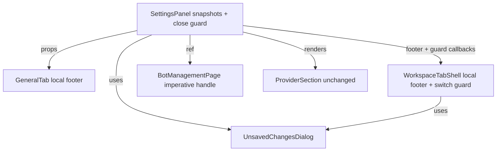

# Remove Settings Global Footer - Plan

## Goal Capsule

- **Objective:** Eliminate the redundant global Save/Cancel footer in Settings by moving save controls to the tabs that actually need them.
- **Product authority:** Settings panel currently mixes a global footer with per-form/per-section buttons, creating duplicate or misleading controls on Provider and Bot tabs.
- **Execution profile:** Front-end React change; no backend API changes.
- **Stop conditions:** Global footer removed; General and Workspace tabs each show a local Save/Cancel footer when dirty, with Save disabled and loading-state shown while saving; Cancel reverts that tab's fields without closing Settings; the Settings-close unsaved-changes guard still protects dirty state; and workspace switching is guarded when dirty.

---

## Product Contract

### Summary

Remove the bottom Save/Cancel footer from the Settings panel. General and Workspace tabs get their own local Save/Cancel controls. Appearance remains auto-save. Provider and Bot keep their existing per-form and per-section Save/Cancel buttons. The existing unsaved-changes dialog on closing Settings continues to protect dirty state across tabs, and switching workspaces inside the Workspace tab is also guarded when the current workspace has unsaved changes.

### Problem Frame

The Settings panel shows a global Save/Cancel footer on every tab. On Provider and Bot tabs, individual forms or sections already have their own Save/Cancel buttons. The duplicate controls make the UI feel inconsistent and can confuse users about which button actually persists their changes.

### Requirements

#### Footer placement

- R1. Remove the global Save/Cancel footer from the bottom of the Settings panel.
- R2. Provider tab keeps its existing per-provider create/edit Save/Cancel controls.
- R3. Bot tab keeps its existing page-level Save/Cancel for basic config and its per-section Save buttons.
- R4. Appearance tab remains auto-save; no Save/Cancel controls are added.
- R5. General tab gets a local Save/Cancel footer for app-level settings only when they are dirty.
- R6. Workspace tab gets a local Save/Cancel footer for the currently selected workspace's settings only when they are dirty.

#### Dirty state and close guard

- R7. Closing the Settings panel still triggers the existing unsaved-changes dialog when any tab has unsaved changes.
- R8. The dialog's Save action persists the dirty tab(s), Discard reverts them, and Keep editing returns to the panel.
- R9. Workspace tab prompts with Save/Discard/Keep editing when switching workspaces with unsaved changes.
- R10. Workspace tab keeps per-workspace draft state in memory so that unsaved edits are not lost when the prompt is dismissed.
- R11. Each local footer (General and Workspace tabs) disables Save when no relevant changes exist and shows a loading state while saving.
- R12. Cancel in a local footer (General and Workspace tabs) reverts that tab's editable fields to their last saved snapshot without closing Settings.

#### Existing immediate-save behavior

- R13. Path configuration in the General tab continues to save each path addition/removal immediately and does not contribute to the General tab's Save/Cancel dirty state.

### Key Decisions

- **Per-tab Save/Cancel over context-aware footer.** Remove the global footer entirely and add local footers only where needed, rather than hiding the footer on Provider/Bot. This makes the save surface explicit per tab.
- **Appearance stays auto-save.** Theme, language, and font-size toggles apply immediately to preserve instant visual feedback, even though General and Workspace move to explicit save.
- **Workspace switch is guarded when dirty.** Switching workspaces with unsaved changes prompts Save/Discard/Keep editing, matching the pattern used when switching bots.
- **Shared UnsavedChangesDialog component.** Both the Settings-close guard and the workspace-switch guard use the same reusable three-action dialog so the layout, copy, and behavior stay consistent.

### Scope Boundaries

#### In scope

- Removing the global Settings footer.
- Adding local Save/Cancel to General and Workspace tabs.
- Preserving existing Provider and Bot save controls.
- Preserving the Settings-close unsaved-changes guard.
- Adding a workspace-switch unsaved-changes guard.

#### Deferred for later

- Converting General or Workspace fields to auto-save/blur-commit.
- Batch-saving changes across multiple workspaces.

#### Outside this product's identity

- Reorganizing the Provider or Bot pages beyond the scope of the footer change.
- Changing the persistence model of app-level settings from local state to server-side.

### Dependencies / Assumptions

- The existing `SettingsPanel` snapshot-based dirty tracking can be reused for General and Workspace tabs.
- `BotManagementPage` already exposes an imperative handle for dirty/save/discard coordination, which the close guard can continue to use.
- No backend API changes are required.

### Acceptance Examples

- **AE1. Provider tab has no global footer**
  - **Covers:** R1, R2
  - **Given:** User opens Settings and selects Provider tab with a provider being edited.
  - **When:** The provider form is visible.
  - **Then:** Only the form's own Save/Cancel buttons appear; no global footer is shown.

- **AE2. General tab saves locally**
  - **Covers:** R5, R7
  - **Given:** User toggles "Reopen last workspace" in General tab.
  - **When:** The local Save button is clicked.
  - **Then:** The setting persists; closing Settings afterward does not show unsaved-changes dialog.

- **AE3. Close guard still works across tabs**
  - **Covers:** R7, R8
  - **Given:** User edits bot basic config without saving.
  - **When:** User clicks backdrop to close Settings.
  - **Then:** The unsaved-changes dialog appears with Save, Discard, and Keep editing options.

- **AE4. Workspace switch is guarded when dirty**
  - **Covers:** R9
  - **Given:** User changes the workspace name without saving.
  - **When:** User clicks another workspace in the sidebar.
  - **Then:** The unsaved-changes dialog appears; choosing Save persists the name change and switches workspaces, Discard reverts and switches, and Keep editing stays on the current workspace.

---

## Planning Contract

### Key Technical Decisions

- **KTD-1. Keep state ownership in `SettingsPanel`.** The existing snapshot ref and dirty checks stay in `SettingsPanel`. General and Workspace tabs receive controlled props (`isDirty`, `onSave`, `onCancel`, `isSaving`) rather than owning their own persistence. This avoids duplicating snapshot logic and keeps the cross-tab close guard simple.
- **KTD-2. Workspace tab footer follows the `BotTabShell` slot pattern.** `WorkspaceTabShell` accepts an optional `footer` ReactNode and renders it at the bottom of the right pane, just as `BotTabShell` does for `BotManagementPage`. This keeps the workspace layout component decoupled from the save logic.
- **KTD-3. Introduce a shared `UnsavedChangesDialog` component.** The Settings-close guard and the workspace-switch guard both use this component. It exposes Save/Discard/Keep editing actions, a saving state, and reuses the existing dialog visual pattern.
- **KTD-4. Use existing `JSON.stringify` snapshot comparison for dirty detection.** Both `SettingsPanel` and `BotManagementPage` already compare snapshots this way; continue the same pattern for General and Workspace dirty state.
- **KTD-5. Separate tab-local save/discard from close-guard save/discard.** `handleSaveApp` and `handleSaveWorkspace` persist only their respective scopes and update the snapshot. `handleSaveAll` (used by the close guard) saves every dirty scope — app settings, selected workspace, and bot state — regardless of which tab is active, then closes.
- **KTD-6. Path config stays immediate-save and outside General dirty state.** The Path config section already persists each addition/removal via `fetch` to `/api/system/path`. It does not flow through the app-settings snapshot, so it needs no change and does not affect the General tab footer.

### High-Level Technical Design

`SettingsPanel` continues to own the snapshots for app-level settings and workspace form state. The global footer is removed. Child tabs render their own footer and delegate save/discard to `SettingsPanel`.

The Settings-close guard and the workspace-switch guard both reuse `UnsavedChangesDialog`. Bot and Provider tabs are untouched because they already manage their own save controls.

### Assumptions

- `useAppSettings` setters remain synchronous and can be batched inside `handleSaveApp`.
- `workspaceState` keyed by workspace id is sufficient to preserve per-workspace drafts through a switch guard.
- Existing bot/Provider save flows are correct and only need to keep working, not be refactored.

### Sequencing

1. U1 — Extract `UnsavedChangesDialog` so later units can share it.
2. U2 — Remove the global footer and wire the close guard to the shared dialog.
3. U3 and U4 — Add the General tab and Workspace tab local footers in parallel; neither depends on the other once U2 is done.
4. U5 — Update/add tests and run quality gates.

---

## Implementation Units

### U1. Extract shared `UnsavedChangesDialog` component

- **Goal:** Provide a reusable three-action dialog for unsaved-changes prompts.
- **Requirements:** R7, R8, R9
- **Dependencies:** None
- **Files:**
  - `src/client/components/UnsavedChangesDialog.tsx` (new)
- **Approach:**
  - Props: `isOpen`, `title`, `message`, `onSave`, `onDiscard`, `onKeepEditing`, `isSaving`, optional labels for Save/Discard/Keep editing.
  - Render a modal overlay with the same visual structure used today in `SettingsPanel` and `BotManagementPage`: warning icon, title, message, and three right-aligned buttons (`Keep editing`, `Discard`, `Save changes`).
  - Save button shows a spinner and is disabled while `isSaving` is true.
  - Manage focus: move focus to the dialog container when it opens; return focus to the element that triggered the dialog when it closes.
  - Stop click/keyboard event propagation on the dialog surface so the `SettingsPanel` Escape/backdrop handlers do not also fire while the dialog is open. Call `onKeepEditing` on Escape and overlay click; call `onSave` on Enter.
- **Patterns to follow:** Tailwind tokens (`bg-surface`, `border-border`, `text-warning`, `bg-accent`), `cn()` utility, `Loader2` spinner, `useTranslation('settings')` for default labels.
- **Test scenarios:**
  - Does not render when `isOpen` is false.
  - Renders title, message, and three buttons when open.
  - Clicking Save calls `onSave`.
  - Clicking Discard calls `onDiscard`.
  - Clicking Keep editing calls `onKeepEditing`.
  - Escape key calls `onKeepEditing`.
  - Save button is disabled and shows spinner while `isSaving` is true.
- **Verification:** New component tests pass; `npm run lint` passes.

### U2. Remove global footer and update Settings-close guard

- **Goal:** SettingsPanel no longer renders a global Save/Cancel footer; the close guard uses the shared `UnsavedChangesDialog`.
- **Requirements:** R1, R7, R8
- **Dependencies:** U1
- **Files:**
  - `src/client/components/SettingsPanel.tsx`
  - `src/client/components/SettingsPanel.bots.test.tsx`
- **Approach:**
  - Delete the global footer JSX at the bottom of the Settings card.
  - Replace the inline unsaved-changes dialog markup with `<UnsavedChangesDialog ... />`.
  - Keep `isDirty()` as the source of truth for whether anything is unsaved.
  - Introduce `handleSaveAll` that saves every dirty scope regardless of the active tab: call `botPageRef.current?.save()` when the bot page is dirty, save app settings via `useAppSettings` setters if the app state is dirty, and save the selected workspace via `updateWorkspace` if the workspace state is dirty. Update `snapshotRef` after all saves succeed, then close the panel.
  - Introduce `handleDiscardAll` that discards every dirty scope: call `botPageRef.current?.discard()` if the bot page is dirty, revert app settings to the snapshot, and revert the selected workspace to the snapshot. Then close the panel.
  - Remove or rename the old `handleCancel` global behavior; the dialog's Discard action now reverts and closes.
  - Ensure the dialog Save action calls `handleSaveAll`, then clears `pendingClose` and calls `onClose`.
- **Patterns to follow:** Existing snapshot update logic in `handleSave`; existing discard logic in `handleDiscard`.
- **Test scenarios:**
  - The global Save and Cancel buttons are no longer present.
  - Closing Settings with dirty General settings opens the unsaved-changes dialog.
  - Choosing Save from the dialog persists the changes and closes the panel.
  - Choosing Discard reverts the changes and closes the panel.
  - Choosing Keep editing leaves the panel open and the changes intact.
  - Existing bot dirty guard delegation still works (update `SettingsPanel.bots.test.tsx` if button indexes change).
- **Verification:** `npm run test:client -- SettingsPanel` passes.

### U3. Add local Save/Cancel footer to General tab

- **Goal:** General tab shows its own Save/Cancel footer when app-level settings are dirty.
- **Requirements:** R5, R11, R12
- **Dependencies:** U2
- **Files:**
  - `src/client/components/SettingsPanel.tsx`
  - `src/client/components/SettingsPanel.test.tsx`
- **Approach:**
  - Extend `GeneralTab` props with `isDirty`, `onSave`, `onCancel`, and `isSaving`.
  - Render a footer at the bottom of the General tab content area when `isDirty` is true. Use the same wrapper style as the existing global footer and `BotTabShell` (`flex items-center justify-between px-6 py-4 border-t`) so the footer sits below the scrollable content and is always reachable.
  - In `SettingsPanel`, implement `handleSaveApp` inside a `try/finally` block: call `useAppSettings` setters for the app toggles, parse and commit `windowCapInput`/`archiveThresholdDaysInput` only if they differ from the snapshot values, then update `snapshotRef` with the saved values. Reset `isSaving` in `finally`.
  - Implement `handleDiscardApp`: reset local app state from `snapshotRef`, including `windowCapInput`/`archiveThresholdDaysInput`. Also reset the chat-store `windowCap` and app-settings `archiveThresholdDays` to snapshot values in case they were auto-committed on blur.
  - Pass `isAppDirty` (app-level snapshot diff only) to the footer so the workspace state does not affect the General footer.
  - If `updateWorkspace` or any app setter throws, surface the error with the existing `storeError` style and keep the footer visible so the user can retry.
- **Patterns to follow:** `JSON.stringify` not needed here because app settings are scalar; compare each field directly, matching the existing `isDirty` implementation.
- **Test scenarios:**
  - Toggling "Reopen last workspace" makes the local Save/Cancel footer appear.
  - Clicking Save persists the toggle, updates the snapshot, and hides the footer.
  - Clicking Cancel reverts the toggle and hides the footer.
  - The footer is hidden when no app-level changes exist.
  - Save is disabled and shows a spinner while `isSaving` is true.
  - If a save fails, an error message is shown and the footer remains visible.
  - Update `SettingsPanel.test.tsx` `defaultProps` to include the new props.
- **Verification:** `npm run test:client -- SettingsPanel` passes.

### U4. Add local Save/Cancel footer to Workspace tab and workspace-switch guard

- **Goal:** Workspace tab has its own Save/Cancel footer, and switching workspaces with unsaved changes shows a Save/Discard/Keep editing prompt.
- **Requirements:** R6, R9, R10, R11, R12
- **Dependencies:** U2
- **Files:**
  - `src/client/components/SettingsPanel.tsx`
  - `src/client/components/SettingsPanel.workspace.test.tsx` (new)
- **Approach:**
  - Restructure the right column in `WorkspaceTabShell` so it is a flex column: the section content is `flex-1 overflow-y-auto` and the footer slot is rendered below it as `flex-shrink-0`, matching `BotTabShell`.
  - Extend `WorkspaceTabShell` with an optional `footer` ReactNode prop and render it at the bottom of the right column when provided. Do not render a footer when `workspaces.length === 0`.
  - Add guard state to `WorkspaceTabShell`: `pendingWorkspaceId` and `showUnsavedDialog`.
  - Pass `isWorkspaceDirty`, `onSaveWorkspace`, `onDiscardWorkspace`, and `onSelectWorkspace` from `SettingsPanel`.
  - When a workspace list item is selected (click or keyboard) and `isWorkspaceDirty()` is true, set `pendingWorkspaceId` and open the shared `UnsavedChangesDialog` with a workspace-specific title/message (e.g., "Save changes to this workspace?"). Otherwise call `onSelectWorkspace(id)` directly.
  - Dialog Save: await `onSaveWorkspace()` inside `try/finally`; if it succeeds, switch to `pendingWorkspaceId` and clear state. If it fails, keep the dialog open and show the error.
  - Dialog Discard: call `onDiscardWorkspace()`, switch to `pendingWorkspaceId`, and clear state.
  - Dialog Keep editing: clear `pendingWorkspaceId` and close the dialog, leaving the current workspace draft intact.
  - In `SettingsPanel`, implement `handleSaveWorkspace`: persist `workspaceState[selectedWorkspaceId]` via `updateWorkspace`, then update `snapshotRef.current.workspaceState` for that workspace.
  - Implement `handleDiscardWorkspace`: reset `workspaceState[selectedWorkspaceId]` to `snapshotRef.current.workspaceState`, guarding against a missing snapshot by rebuilding from the store workspace if necessary.
  - Build the `footer` node from `SettingsPanel` using `isWorkspaceDirty()` and the workspace save/discard handlers.
- **Patterns to follow:** Mirror `BotManagementPage`'s bot-switch guard (`pendingBotId`, `showUnsavedDialog`, `handleDialogSave/Discard/KeepEditing`). Use `JSON.stringify` for workspace dirty comparison.
- **Test scenarios:**
  - Editing the workspace name makes the local Save/Cancel footer appear.
  - Clicking Save persists the workspace and hides the footer.
  - Clicking Cancel reverts the workspace name and hides the footer.
  - The footer is not shown when there are no workspaces.
  - With unsaved workspace changes, selecting a different workspace (click or keyboard) opens the unsaved-changes dialog.
  - Choosing Save persists the current workspace and switches to the selected workspace.
  - Choosing Discard reverts the current workspace and switches.
  - Choosing Keep editing stays on the current workspace and preserves the draft.
  - If workspace save fails, an error is shown and the dialog stays open.
- **Verification:** New and existing workspace tests pass.

### U5. Update tests and run quality gates

- **Goal:** All affected tests pass, lint is clean, and no new i18n keys are missing.
- **Requirements:** R1–R13
- **Dependencies:** U1–U4
- **Files:**
  - `src/client/components/SettingsPanel.test.tsx`
  - `src/client/components/SettingsPanel.bots.test.tsx`
  - `src/client/components/SettingsPanel.workspace.test.tsx` (new)
  - `src/client/components/UnsavedChangesDialog.test.tsx` (new)
  - `src/client/i18n/zh-CN/settings.json` (verify existing keys)
- **Approach:**
  - Update `GeneralTab` `defaultProps` in `SettingsPanel.test.tsx` to include the new footer props.
  - Add General footer behavior tests to `SettingsPanel.test.tsx`.
  - Add workspace footer and switch-guard tests to a new `SettingsPanel.workspace.test.tsx`.
  - Add `UnsavedChangesDialog.test.tsx`.
  - Adjust `SettingsPanel.bots.test.tsx` only if button indexes changed (global footer removal likely simplifies it).
  - Confirm the following existing keys exist in both `en` and `zh-CN`; no new keys are required:
    - `settings.unsavedDialog.title`
    - `settings.unsavedDialog.message`
    - `settings.unsavedDialog.keepEditing`
    - `settings.unsavedDialog.discard`
    - `settings.unsavedDialog.saveChanges`
    - `settings.unsavedDialog.saving`
    - `settings.actions.save`
    - `settings.actions.cancel`
    - `settings.actions.saving`
    - `settings.common.cancel`
- **Test scenarios:**
  - `npm run test:client` passes.
  - `npm run lint` passes.
- **Verification:** Both commands exit zero.

---

## Verification Contract

| Command | When to run | Expected result |
| --- | --- | --- |
| `npm run test:client` | After U2–U5 | All tests pass, including new General/Workspace footer tests and `UnsavedChangesDialog` tests. |
| `npm run lint` | After code changes | No ESLint errors or warnings. |
| `npm run test:client -- SettingsPanel` | During development | Fast feedback on SettingsPanel-related tests. |

---

## Definition of Done

### Global

- The global Save/Cancel footer is removed from `SettingsPanel`.
- General and Workspace tabs each render a local Save/Cancel footer when their own state is dirty.
- The Settings-close unsaved-changes dialog continues to appear for dirty app settings, workspace settings, or bot config.
- Workspace switching inside the Workspace tab is guarded by the same Save/Discard/Keep editing dialog.
- Provider and Bot tabs keep their existing per-form/per-section save controls.
- Appearance tab remains auto-save.
- `npm run test:client` and `npm run lint` pass.
- `CHANGELOG.md` is updated for the user-facing UI change.

### Per-unit

- **U1:** `UnsavedChangesDialog` renders and handles Save/Discard/Keep editing, saving state, and keyboard actions.
- **U2:** Global footer removed; close guard uses `UnsavedChangesDialog` and Save/Discard/Keep editing all work.
- **U3:** General tab local footer appears on dirty app state, Save persists, Cancel reverts.
- **U4:** Workspace tab local footer appears on dirty workspace state, Save persists, Cancel reverts, and workspace switch guard behaves correctly.
- **U5:** All tests and lint pass; i18n keys are verified.

---

## Risks & Dependencies

- **Risk:** `windowCapInput` and `archiveThresholdDaysInput` currently auto-commit on blur/Enter. If a user edits one of these and then clicks Cancel, the store may already be updated. `handleDiscardApp` must reset both the local input state and the underlying store values from the snapshot.
- **Risk:** If the `workspaces` array refetch/refresh occurs while a workspace draft is dirty, `SettingsPanel` must avoid overwriting `workspaceState[selectedWorkspaceId]` with stale server data. Keep the local draft until Save or Discard is explicitly invoked.
- **Risk:** Tests that locate buttons by DOM position may break when the global footer is removed. Update tests to use accessible labels or stable test IDs rather than array indexes where possible.
- **Dependency:** The plan assumes `BotManagementPage`'s imperative handle (`isDirty`, `save`, `discard`) continues to work unchanged.

---

## Sources / Research

- Current Settings panel with global footer: `src/client/components/SettingsPanel.tsx`
- Provider tab with per-form Save/Cancel: `src/client/components/ProviderSection.tsx`
- Bot tab with page-level and per-section save controls: `src/client/components/BotManagementPage.tsx`
- Bot tab layout footer slot: `src/client/components/BotTabShell.tsx`
- App settings persistence hook: `src/client/hooks/use-app-settings.ts`
- Existing Settings panel tests: `src/client/components/SettingsPanel.test.tsx`, `src/client/components/SettingsPanel.bots.test.tsx`
- i18n namespace: `src/client/i18n/en/settings.json`, `src/client/i18n/zh-CN/settings.json`
- Prior bot settings layout work: `docs/plans/2026-06-30-004-feat-bot-settings-unified-layout-plan.md`
