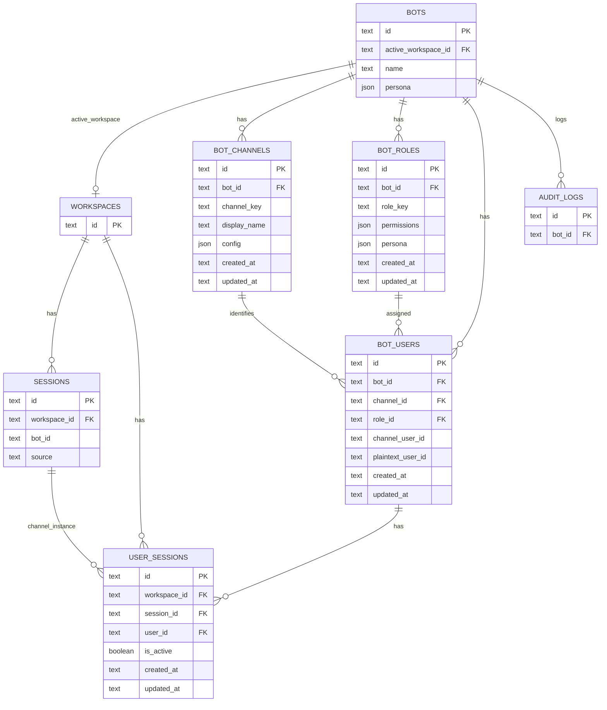

# Unified Bot/Workspace/Session/Member/Role Schema - Plan

## Goal Capsule

- **Objective:** Replace the fragmented bot/workspace/session/member/role schema with a unified, bot-centric relational model where new channels and roles are added by inserting rows, not by altering tables or releasing code changes.
- **Authority:** Technical refactoring request from the data-model stream; product behavior of bots, channels, roles, and sessions stays unchanged.
- **Stop conditions:** The refactor is done when the new schema supports the current WeCom/Feishu flows, a one-time migration moves existing data, and adding a new channel or role no longer requires schema migration.
- **Tail ownership:** Schema design, migration, and storage-layer changes live in the server storage and model layers.

---

## Product Contract

### Summary

Unify the database schema around a single bot-centric model. A workspace owns sessions. A bot owns its channels, roles, and members. A user is scoped to one bot and one channel, so the same real person can have different roles in different bots. Sessions remain workspace-level, while `user_sessions` captures which bot/channel/user instance is active for a given session. The global `wecom_user_id_mappings` table is retired; channel user identity is carried by per-bot, per-channel user rows.

### Problem Frame

The current schema grew feature-by-feature: `bots` accumulated JSON blobs, `bot_members` encoded channel and role as strings, and WeCom/Feishu each got their own user/session mapping tables. Recent features such as per-channel ownership, per-role persona, and bot member plaintext management each required new columns or table-specific migrations. The result is duplicated structure across WeCom and Feishu, no foreign-key relationships, and a pattern where every new capability forces a schema change. The goal is to invert that trend: make channels, roles, and members first-class rows so future capabilities can be expressed as data rather than DDL.

### Key Decisions

- **KTD1. Channels and roles are per-bot records, not global enums or code unions.** A bot has its own channel rows and role rows. Adding a new channel (for example, a future Slack or DingTalk integration) means inserting a row into the bot's channel table; adding a new role means inserting a row into the bot's role table. This moves extensibility from schema changes to data changes.
- **KTD2. Users are scoped to a single bot and a single channel.** The same real person interacting with Bot A and Bot B, or through WeCom and Feishu on the same bot, is represented by distinct user rows. This lets permissions and personas differ per bot without cross-bot coupling.
- **KTD3. Sessions stay workspace-level; `user_sessions` links a session to a bot/channel/user instance.** This preserves the current model where a session belongs to a workspace, while giving IM channels the ability to list and activate only the sessions bound to their bot.
- **KTD4. Retire the global `wecom_user_id_mappings` table.** Encrypted and plaintext identifiers move into the per-bot, per-channel user row. Cross-workspace or cross-bot correlation, if needed later, is built on top of these rows rather than a standalone mapping table.
- **KTD5. Accept a one-time rewrite migration.** The migration rebuilds the relevant tables and moves existing data in a single cut-over. This is preferred over incremental migrations because the structural changes are broad and the payoff is a long-term reduction in migration churn.
- **KTD6. Discard historical audit-log rows during migration.** Old event types and detail keys are not backfilled and the display layer is not responsible for normalizing them. Only audit logs written after the migration use the new terminology.
- **KTD7. Reuse existing JSON shapes and encryption for role permissions and channel configuration.** Role permissions keep the current policy shape, channel configuration keeps the current channel settings shape, and the same channel keys remain encrypted at rest.

### Requirements

**Core schema shape**

- R1. `workspaces` keeps its current responsibility: it is the container for folders, settings, skills, and GUI sessions.
- R2. `sessions` belongs to a workspace and remains the canonical session entity. GUI sessions continue to exist without an associated bot.
- R3. `bots` keeps bot metadata and a single active workspace binding. A bot is still bound to at most one active workspace at a time.
- R4. Channels are stored as per-bot rows. Each row carries a channel key (for example, `wecom` or `feishu`), a display name, and encrypted channel configuration.
- R5. Roles are stored as per-bot rows and are shared across all channels of that bot. Each row carries a role key, permissions, and an optional persona.
- R6. Users are stored as per-bot, per-channel rows. Each row carries the bot identifier, channel identifier, role identifier, plaintext user identifier, and encrypted/channel user identifier.
- R7. Bot membership is expressed by a user row plus its assigned role; no separate membership junction table is required beyond the user row.
- R8. `user_sessions` links a workspace session to a bot/channel/user instance and records whether it is the active session for that user. It supports multiple historical sessions per user with exactly one marked active.
- R9. `audit_logs` remains bot-scoped and continues to record actor, event type, and details.

**Behavioral requirements**

- R10. When an IM user switches sessions, only sessions linked to the same bot are offered as candidates. GUI sessions not linked to that bot are excluded.
- R11. A session may have zero or one active `user_sessions` entry per bot/channel/user instance at any time.
- R12. Removing a bot cascade-removes its channels, roles, users, and `user_sessions` entries.
- R13. Removing a workspace cascade-removes its sessions and any dependent `user_sessions` entries.

**Migration requirements**

- R14. Existing WeCom and Feishu workspace-user and user-session mapping tables are migrated into the unified `users` and `user_sessions` rows.
- R15. Existing `bot_members` data is migrated into per-bot, per-channel user rows with the corresponding role rows.
- R16. Existing `wecom_user_id_mappings` data is migrated into the per-bot, per-channel user rows and then the table is dropped.
- R17. The migration is idempotent and verifies row counts before dropping old tables.
- R18. After migration, adding a new channel or role requires only inserting rows; no `ALTER TABLE` or new table creation is needed.
- R19. Historical `bot_audit_logs` rows are discarded during migration; the application does not backfill or normalize old event types.

### Scope Boundaries

**Deferred for later**

- Per-channel role definitions (roles are currently shared across channels of a bot).
- Multi-workspace bot binding (a bot still has exactly one active workspace).
- Single-session overwrite model for IM users (the multi-session plus active-marker model is preserved).
- LLM provider management and `sessions.provider_id`.

**Outside this product's identity**

- Changing the runtime or SDK behavior of bots.
- Adding new IM channels as part of this refactor; the schema must support them, but implementing a new channel is separate work.

### Dependencies / Assumptions

- The team accepts a one-time rewrite migration with potential brief downtime.
- Existing WeCom/Feishu mapping data is complete enough to populate per-bot, per-channel user rows.
- The application layer will be updated to read from and write to the new schema after the migration.

### Outstanding Questions

**Resolved**

- Q1. How will the migration handle users that cannot be unambiguously assigned to a bot or channel?
  - A workspace has at most one active bot via `bots.active_workspace_id`. WeCom/Feishu workspace users are migrated to `bot_users` rows under that bot and the `wecom`/`feishu` channel. If a workspace has no active bot, those rows are skipped and logged; row-count verification surfaces the gap before any old table is dropped.
- Q2. What indexes are needed to keep session-switching and member-list queries performant?
  - `bot_users` has a unique index on `(bot_id, channel_id, channel_user_id)` for IM identity lookups. `user_sessions` has indexes on `(user_id)` and `(workspace_id, session_id)` for active-session and cascade-delete queries. The primary keys on `bot_channels` and `bot_roles` already support per-bot enumeration.

### Sources & Research

- Current schema and migrations in `src/server/storage/sqlite-store.ts`.
- Bot domain model in `src/server/models/bot.ts`.
- Session model in `src/server/models/session.ts`.
- Channel encryption in `src/server/utils/bot-channel-crypto.ts`.
- WeCom and Feishu service usage in `src/server/services/wecom-bot-service.ts`, `src/server/services/feishu-bot-service.ts`, and `src/server/services/bot-service.ts`.
- Client state in `src/client/stores/bot-store.ts` and `src/client/stores/session-store.ts`.
- Prior per-role persona plan: `docs/plans/2026-06-30-003-feat-per-role-bot-persona-plan.md`.
- Prior channel rename and per-channel ownership plan: `docs/plans/2026-07-01-001-feat-bot-channel-per-channel-owner-plan.md`.
- Prior bot member plaintext management plan: `docs/plans/2026-07-04-001-feat-bot-member-plaintext-management-plan.md`.

---

## Planning Contract

### Key Technical Decisions

- **KTD-PLAN-1. Store channel config and role permissions as JSON inside the new row tables.** `bot_channels.config_json` keeps the existing `WeComChannelConfig`/`FeishuChannelConfig` shape and `encryptChannelSettings` continues to encrypt credential keys. `bot_roles.permissions_json` keeps the existing `BotRolePolicy` shape. This reuses the crypto utilities in `src/server/utils/bot-channel-crypto.ts` and avoids inventing a new serialization format.
- **KTD-PLAN-2. Keep `bots.persona_json`; remove `channel_settings_json`, `role_policy_json`, and `role_personas_json`.** The migration rewrites the `bots` table to drop the legacy JSON columns. Bot-level persona serves as the default persona: when a role row has no `persona`, the bot's persona is used; when a role row has its own `persona`, the role's persona takes precedence.
- **KTD-PLAN-3. Keep the schema foreign-key-free at the SQLite level.** The legacy schema declares no foreign keys. The new tables also declare no physical foreign keys or `ON DELETE CASCADE` constraints. R12 and R13 are implemented by explicit delete calls in `deleteBot` and workspace delete, matching the current codebase's pattern and avoiding SQLite foreign-key enforcement surprises. Indexes still support lookups and performance, but cascading deletes are handled in code.
- **KTD-PLAN-4. Represent WeCom/Feishu identity as `bot_users.channel_user_id`.** For WeCom this is the historical encrypted user id; the plaintext mapping moves to `plaintext_user_id`. For Feishu this is the `open_id`. This preserves the existing lookup keys while unifying the storage shape.
- **KTD-PLAN-5. Implement the migration as a guarded schema-version function, not as an `ALTER TABLE` chain.** A new private method `migrateToUnifiedSchema()` runs after all existing migrations. It checks `bot_migration_state.version` and only executes when the version is below 5. The function creates new tables, migrates data in a transaction, verifies counts, drops old tables, and bumps the version. This pattern matches the existing rewrite migrations such as `migrateBotSettingsColumn()`.
- **KTD-PLAN-6. Replace `BotMember` with `BotUser` across the codebase.** The `BotMember` interface is removed; `BotUser` carries the same membership semantics plus channel and role foreign keys. Client stores and UI components that reference `BotMember` are updated to use `BotUser`.

### High-Level Technical Design

The new schema is a star around `bots`. A bot owns channels, roles, and users. Sessions stay under `workspaces`. `user_sessions` is the bridge between a session and the bot/channel/user instance that created or switched to it.

The migration flows in four phases inside one transaction:

1. **Create** the new tables with foreign keys and indexes.
2. **Populate** `bot_channels`, `bot_roles`, and `bot_users` from `bots`, `bot_members`, `wecom_workspace_users`, `wecom_user_id_mappings`, `feishu_workspace_users`, and the Feishu binding.
3. **Populate** `user_sessions` from `wecom_user_sessions`, `feishu_user_sessions`, and `feishu_active_sessions`, preserving the active marker.
4. **Verify** counts and drop the old tables, then bump `bot_migration_state.version` to 5.

### Assumptions / Constraints

- The new tables intentionally declare no physical foreign keys, consistent with the legacy schema. Cascade behavior for R12 and R13 is implemented in code, not via SQLite `ON DELETE CASCADE`.
- All existing bots have at most one active workspace; the migration does not support bots bound to multiple workspaces.
- The Feishu `feishu_bot_binding` table stores exactly one active workspace id. During migration, if no `bots` row has `active_workspace_id` equal to that workspace, the migration creates an implicit Feishu bot for that workspace (generated id, derived name, empty `persona_json`) and creates the `feishu` channel and default role rows under it. If a real `bots` row already exists for that workspace, the Feishu channel, role, and user rows are created under that existing bot id.
- `bot_users.plaintext_user_id` is stored as plain TEXT. It is treated as an internal correlation identifier, not as sensitive PII, and is not encrypted at rest.
- WeCom proactive messages keep their existing table but gain `bot_id` and `channel_id` columns during migration. Historical rows are backfilled from the workspace's active bot and the `wecom` channel so they continue to reference the unified `bot_users` table.

### Sequencing

Implementation proceeds in dependency order: schema design first, then migration and storage primitives, then services, then routes/client, then verification. Services that read from the same store can be updated in parallel once the primitives are in place.

### System-Wide Impact

- **Data lifecycle:** The migration transforms every WeCom/Feishu user and session mapping in the database. A failed migration can strand IM users without accessible sessions. The count-verification step in U2 is the last line of defense before old tables are dropped.
- **Auth and permission boundaries:** Roles move from string values on `bot_members` to foreign-keyed rows on `bot_roles`. Any code that checks `member.role === 'owner'` must resolve the user's `role_id` to `role_key` first; otherwise ownership checks silently fail.
- **Cross-layer coupling:** `sessions.bot_id` still records which bot created a session, but session-to-IM-user binding now lives in `user_sessions`. Components that previously joined `sessions` with `wecom_user_sessions` directly must join through `user_sessions` and `bot_users`.
- **Cascade behavior:** The schema declares no physical foreign keys; R12 and R13 are implemented by explicit delete calls in `deleteBot` and workspace delete. Deleting a bot removes its channels, roles, users, audit logs, and linked `user_sessions` through code; deleting a workspace removes its sessions and any `user_sessions` for those sessions through code.
- **Client/server contract:** The client receives `BotUser` shapes instead of `BotMember` shapes. HTTP paths stay the same, but field names and payload shapes change; the UI must update its types and rendering accordingly.
- **Audit log discontinuity:** Historical audit logs are discarded (R19). Downstream analytics or support workflows that relied on old event types must accept this gap or extract the data before the migration runs.

### Risks & Dependencies

| Risk | Severity | Mitigation |
|------|----------|------------|
| Migration silently loses rows because a workspace has no active bot. | High | Count verification fails and aborts old-table drops; skipped rows are logged with workspace id and source table. |
| Migration count verification aborts because a user exists in both `bot_members` and `wecom_workspace_users`. | Medium | The verification treats the source tables as non-overlapping; duplicates are logged and abort the migration so the operator can clean the source data. |
| Manual cascade deletes in `deleteBot` or workspace delete accidentally leave orphan rows or delete too much. | Medium | Write explicit tests that create a bot with channels/roles/users/sessions/audit_logs, delete the bot, and assert only the expected rows are removed; do the same for workspace delete. |
| Migration drops historical `bot_audit_logs`; the team accepts this discontinuity and documents it in `CHANGELOG.md` and the first-run notice after upgrade. | Medium | Document the data gap explicitly; downstream support workflows must rely on logs written after the migration. |
| The one-time rewrite migration has no rollback if it fails after old tables are dropped. | Medium | Create a timestamped database backup before the migration runs; document the restore procedure. |
| New channel/role/user CRUD endpoints rely on existing auth and do not add bot-level authorization in this refactor. | Medium | Document auth as a follow-up; do not expose new administrative endpoints beyond the existing route surface. |
| Type renames (`BotMember` -> `BotUser`) break client compilation. | Medium | Update client stores in U9a and components in U9b; catch residual references with `npm run lint`. |
| Encrypted channel settings are double-encrypted or decrypted with the wrong key after migration. | High | Reuse `encryptChannelSettings`/`decryptChannelSettings` exactly; add a migration test that round-trips a credential key. |
| Feishu active-session semantics differ from WeCom's multi-session model. | Medium | Map `feishu_active_sessions` into `user_sessions.is_active = 1` and merge `feishu_user_sessions` as historical rows; test both states. |

---

## Implementation Units

| U-ID | Title | Files touched | Depends on |
|------|-------|---------------|------------|
| U1 | Design new schema and TypeScript models | `src/server/models/bot.ts`, `src/server/models/session.ts`, new `src/server/models/bot-user.ts` | — |
| U2 | Implement one-time schema rewrite migration | `src/server/storage/sqlite-store.ts` | U1 |
| U3 | Refactor sqlite-store bot primitives | `src/server/storage/sqlite-store.ts` | U2 |
| U4 | Refactor sqlite-store session primitives | `src/server/storage/sqlite-store.ts` | U2 |
| U5 | Update bot-service CRUD and role logic | `src/server/services/bot-service.ts` | U3 |
| U6 | Update wecom-bot-service user/session mapping | `src/server/services/wecom-bot-service.ts`, `src/server/services/wecom-user-resolver.ts` | U3, U4 |
| U7 | Update feishu-bot-service user/session mapping | `src/server/services/feishu-bot-service.ts` | U3, U4 |
| U8 | Update chat-service IM session switching | `src/server/services/chat-service.ts` | U4, U6, U7 |
| U9a | Update API routes and client stores | `src/server/routes/bot-routes.ts`, `src/server/routes/session-routes.ts`, `src/client/stores/bot-store.ts`, `src/client/stores/session-store.ts` | U5, U6, U7, U8 |
| U9b | Update UI components for BotUser rename | React components in `src/client/components/**` that reference `BotMember`/`botMember` | U1, U9a |
| U10 | Add migration verification tests and update service tests | `src/server/storage/sqlite-store.test.ts`, `src/server/services/*.test.ts`, new `src/server/storage/migration.test.ts` | U1–U9b |

### U1. Design new schema and TypeScript models

**Goal:** Replace the current `BotChannel`, `BotRole`, and `BotMember` type unions with row-oriented models and add `BotUser` and `UserSession` models.

**Requirements:** R4, R5, R6, R7, R8, R18.

**Files:**
- `src/server/models/bot.ts`
- `src/server/models/session.ts`
- New `src/server/models/bot-user.ts` (or extend `bot.ts` if the team prefers fewer files)

**Approach:**
- Rename the channel union to `BotChannelKey` (`'wecom' | 'feishu'`) and the role union to `BotRoleKey` (`'owner' | 'admin' | 'normal'`).
- Add `BotChannel`, `BotRole`, `BotUser`, and `UserSession` interfaces with `id`, foreign keys, timestamps (`created_at`/`updated_at`), and JSON fields. Expose `roleKey` and `resolutionStatus` on `BotUser` as derived/serialized fields (resolved from `role_id` and `plaintext_user_id`), so client code and legacy checks can continue comparing `roleKey === 'owner'` and showing resolved/pending state.
- Update `Bot` to remove `channelSettings`, `rolePolicy`, and `rolePersonas`; keep `persona`.
- Update `CreateBotInput` and `UpdateBotInput` to match.
- Remove `BotMember` and `CreateBotMemberInput`; route callers to `BotUser` and `CreateBotUserInput`.
- Keep `BotChannelSettings`, `WeComChannelConfig`, `FeishuChannelConfig`, `BotRolePolicy`, `BotPersona`, and `ENCRYPTED_CHANNEL_KEYS` unchanged so encryption and validation reuse them.

**Test scenarios:**
- TypeScript compiles with `noUnusedLocals` and `noUnusedParameters`.
- A bot model no longer exposes `channelSettings` or `rolePolicy`.
- A bot user model can carry a plaintext user id, a channel user id, and foreign keys to a channel and role.
- `BotUser` exposes `roleKey` and `resolutionStatus` derived from `role_id` and `plaintext_user_id`.

**Verification:** `npm run lint` and `npm run test:server` (compilation/type checks).

### U2. Implement one-time schema rewrite migration

**Goal:** Build the migration that creates the new tables, moves data, verifies counts, and drops the old tables.

**Requirements:** R14, R15, R16, R17, R19, R12, R13.

**Files:**
- `src/server/storage/sqlite-store.ts`

**Approach:**
- Before the migration transaction begins, copy the current database file to a timestamped backup (for example, `<data-dir>/backup/pre-unified-schema-<timestamp>.db`) so an operator can restore it if the migration fails or post-migration verification reveals data loss.
- Add a private `migrateToUnifiedSchema()` method called at the end of the constructor after all existing migrations.
- Guard with `bot_migration_state.version`: only run when the stored version is `null` or less than 5.
- Inside a single transaction:
  1. Create `bot_channels`, `bot_roles`, `bot_users`, and `user_sessions` with the required columns and indexes, but no physical foreign keys. Cascade deletes are handled in code to stay consistent with the legacy schema.
  2. Rewrite `bots` to drop `channel_settings_json`, `role_policy_json`, and `role_personas_json`, preserving `id`, `name`, `active_workspace_id`, `persona_json`, and timestamps. Because SQLite does not support `ALTER TABLE DROP COLUMN`, use the existing rename-recreate pattern: rename to `bots_old`, create the new `bots` table with the reduced column set, copy the preserved columns, then drop `bots_old`.
  3. For each bot, split `channel_settings_json` into `bot_channels` rows for `wecom` and `feishu` when config is present, using fixed default display names (`'WeCom'`, `'Feishu'`) for `display_name`.
  4. For each bot, split `role_policy_json` into `bot_roles` rows for `owner`, `admin`, and `normal`, and migrate `role_personas_json` into the `persona` field on each role row when present.
  5. Migrate `bot_members` into `bot_users`, resolving each member's channel and role to the new row ids and preserving `created_at`/`updated_at`.
  6. Migrate `wecom_workspace_users` into `bot_users` under the workspace's active bot and the `wecom` channel, joining `wecom_user_id_mappings` for plaintext ids and preserving `created_at`/`updated_at`.
  7. Migrate `wecom_user_sessions` into `user_sessions`, preserving `isActive` and `created_at`/`updated_at`.
  8. Look up the workspace recorded in `feishu_bot_binding`. If no `bots` row has `active_workspace_id` equal to that workspace, create an implicit Feishu bot for that workspace and its default `feishu` channel and role rows. Then migrate `feishu_workspace_users` into `bot_users` under that bot and the `feishu` channel, preserving `created_at`/`updated_at`.
  9. Migrate `feishu_user_sessions` and `feishu_active_sessions` into `user_sessions`, marking active sessions and preserving `created_at`/`updated_at`.
  10. Backfill `sessions.source` for sessions that have rows in `wecom_user_sessions` or `feishu_user_sessions` (set to `'wecom'` or `'feishu'` respectively). GUI sessions without a mapping keep `source` as-is or remain `null`/`'gui'`.
  11. Verify counts: ensure the sum of migrated `bot_users` covers `bot_members`, `wecom_workspace_users`, and `feishu_workspace_users` (allowing for skipped unbound users and treating the three source tables as non-overlapping). If any source row would create a duplicate `(bot_id, channel_id, channel_user_id)`, log it and abort so an operator can clean the source data manually; the migration does not silently merge duplicates. Ensure `user_sessions` covers `wecom_user_sessions` plus `feishu_user_sessions`.
  12. Add `bot_id` and `channel_id` columns to `wecom_proactive_messages`. Backfill them by joining the message recipient's `encrypted_user_id` with `wecom_workspace_users` and the workspace's active bot to produce the corresponding `bot_users` row, then store the resulting `bot_id` and `wecom` channel id.
  13. Drop the old tables: `bot_members`, `wecom_user_sessions`, `wecom_user_id_mappings`, `wecom_workspace_users`, `feishu_bot_binding`, `feishu_user_sessions`, `feishu_active_sessions`, `feishu_workspace_users`.
  14. Bump `bot_migration_state.version` to 5 and record a snapshot of row counts.
- Make each sub-step idempotent so the migration can safely resume if the process is killed mid-way:
  - Use `CREATE TABLE IF NOT EXISTS` for new tables.
  - Use `INSERT OR IGNORE` / `ON CONFLICT DO NOTHING` (or `INSERT OR REPLACE` keyed by natural keys) when migrating rows, so rerunning a step does not duplicate data.
  - Use `DROP TABLE IF EXISTS` when dropping old tables.
  - Only bump `bot_migration_state.version` after all prior steps succeed.
- The version guard remains the first line of defense: if the stored version is already 5, the entire method returns immediately.

**Test scenarios:**
- A fresh database initializes to version 5 with empty new tables and no old tables.
- A legacy database with WeCom and Feishu users/sessions migrates and preserves active markers.
- A legacy database where `feishu_bot_binding` points to a workspace with no bot creates an implicit Feishu bot and migrates Feishu users under it.
- A bot with channel settings and role policy produces the correct channel and role rows.
- Historical `wecom_proactive_messages` rows receive backfilled `bot_id` and `channel_id` values.
- Re-running the migration on an already-migrated database does nothing and does not error.
- Row-count verification fails loudly if data is missing, preventing old-table drops.
- The migration creates a timestamped database backup before modifying the schema.

**Verification:** New migration test file plus `npm run test:server`.

### U3. Refactor sqlite-store bot primitives

**Goal:** Replace the old bot member and settings methods with channel, role, and user primitives.

**Requirements:** R4, R5, R6, R7, R12.

**Files:**
- `src/server/storage/sqlite-store.ts`

**Approach:**
- Remove methods: `setBotMember`, `removeBotMember`, `getBotMemberRole`, `listBotMembers`, `setWecomUserMapping`, `listWecomUserMappings`, `getWecomUserMapping`, `getEncryptedUserIdByPlaintext`, `setWecomWorkspaceUser`, `getWecomWorkspaceUser`, `listWecomWorkspaceUsers`, `isPlaintextUserIdUsedInWorkspace`, `setFeishuWorkspaceUser`, `setFeishuWorkspaceUserName`, `getFeishuWorkspaceUser`, `listFeishuWorkspaceUsers`, `getFeishuActiveWorkspace`, `setFeishuActiveWorkspace`, `clearFeishuActiveWorkspace`.
- Add methods:
  - `createBotChannel(botId, channelKey, displayName, config)`, `getBotChannel(botId, channelKey)`, `listBotChannels(botId)`, `updateBotChannel(id, config)`, `deleteBotChannel(id)`.
  - `createBotRole(botId, roleKey, permissions, persona?)`, `getBotRole(botId, roleKey)`, `listBotRoles(botId)`, `updateBotRole(id, permissions, persona?)`, `deleteBotRole(id)`.
  - `createBotUser(input)`, `getBotUser(id)`, `getBotUserByChannelIdentity(botId, channelId, channelUserId)`, `listBotUsers(botId)`, `listBotUsersByChannel(botId, channelId)`, `updateBotUser(id, input)`, `deleteBotUser(id)`.
- Update `createBot` to insert the default role rows (`owner`, `admin`, `normal`) and default channel rows (`wecom`, `feishu`) when initial settings are provided, rather than storing JSON on the bot row.
- Update `updateBot` to no longer write `channel_settings_json`, `role_policy_json`, or `role_personas_json`. Channel and role updates go through the new primitives.
- Update `deleteBot` to explicitly delete dependent rows in child-to-parent order: `user_sessions` for users of this bot, `bot_users`, `bot_roles`, `bot_channels`, and `audit_logs`, then finally the bot row. No physical foreign keys exist, so the application owns the cascade behavior.
- Update `resetData()` to continue deleting from all tables in arbitrary order (the schema remains foreign-key-free).

**Test scenarios:**
- Creating a bot creates default roles and channels.
- Updating a bot's persona does not touch channels or roles.
- Deleting a bot removes its channels, roles, users, audit logs, and any `user_sessions` linked to those users.
- Looking up a user by `(botId, channelId, channelUserId)` returns the correct role.

**Verification:** Updated `src/server/storage/sqlite-store.test.ts` and `npm run test:server`.

### U4. Refactor sqlite-store session primitives

**Goal:** Replace the WeCom/Feishu-specific session mapping methods with unified `user_sessions` primitives.

**Requirements:** R8, R10, R11, R13.

**Files:**
- `src/server/storage/sqlite-store.ts`

**Approach:**
- Remove methods: `setWecomSession`, `listWecomSessions`, `listWecomSessionsByUser`, `getWecomUserIdBySession`, `getActiveWecomSession`, `setActiveWecomSession`, `listWecomSessionsForBackfill`, `addFeishuUserSession`, `getFeishuSessionOwner`, `listFeishuSessionsByUser`, `listFeishuSessionsForWorkspace`, `setFeishuActiveSession`, `getFeishuActiveSession`, `clearFeishuActiveSession`.
- Add methods:
  - `addUserSession(workspaceId, sessionId, userId)` — inserts a `user_sessions` row.
  - `listUserSessionsByUser(userId)` — returns all sessions for a bot user.
  - `listUserSessionsForBot(botId)` — joins `bot_users` to return sessions scoped to a bot.
  - `getActiveUserSession(userId)` — returns the active session id for a user, with the same self-healing behavior as `getActiveWecomSession`.
  - `setActiveUserSession(userId, sessionId)` — demotes other rows and promotes the chosen session.
  - `getSessionUsers(sessionId)` — returns bot user ids linked to a session.
- Update `delete` (workspace delete) to explicitly delete `user_sessions` rows for sessions in the workspace before deleting the sessions themselves.
- Update `deleteLocalSession` to explicitly delete linked `user_sessions` rows.

**Test scenarios:**
- A user can have multiple historical sessions with exactly one active.
- Setting a session active demotes the previous active session.
- Deleting a workspace removes its sessions and `user_sessions`.
- Listing sessions for a bot returns only sessions linked to users of that bot.

**Verification:** Updated `src/server/storage/sqlite-store.test.ts` and `npm run test:server`.

### U5. Update bot-service CRUD and role logic

**Goal:** Make `bot-service.ts` read and write channels, roles, and users through the new primitives.

**Requirements:** R4, R5, R6, R7, R12.

**Files:**
- `src/server/services/bot-service.ts`

**Approach:**
- Replace all reads of `bot.channelSettings` and `bot.rolePolicy` with `listBotChannels(botId)` and `listBotRoles(botId)`.
- Replace `listBotMembers` usage with `listBotUsers`; update all `BotMember` type references to `BotUser`.
- Update member management methods to use `createBotUser`, `updateBotUser`, and `deleteBotUser`, resolving role by `roleKey` through `getBotRole`.
- Ensure any ownership check (`role === 'owner'`) resolves the user's `role_id` to `roleKey` first; return `roleKey` and `resolutionStatus` in API-facing `BotUser` objects so clients do not directly use `role_id`.
- Ensure default roles and channels are created when a bot is created; the service may call store methods directly or rely on `createBot` to do so.
- Preserve audit logging; event types and details may need minor renames from `member` to `user`.

**Test scenarios:**
- Creating a bot also creates `wecom` and `feishu` channel rows and `owner`/`admin`/`normal` role rows.
- Updating role permissions writes to `bot_roles` and leaves other roles untouched.
- Adding a bot member inserts a `bot_users` row with the correct channel and role.

**Verification:** `src/server/services/bot-service.test.ts` and `npm run test:server`.

### U6. Update wecom-bot-service user/session mapping

**Goal:** Replace WeCom-specific store calls with unified bot user and user session methods.

**Requirements:** R6, R8, R14, R16.

**Files:**
- `src/server/services/wecom-bot-service.ts`
- `src/server/services/wecom-user-resolver.ts`

**Approach:**
- Replace `setWecomUserMapping`, `getWecomUserMapping`, `getEncryptedUserIdByPlaintext`, `setWecomWorkspaceUser`, `getWecomWorkspaceUser`, `listWecomWorkspaceUsers` with calls to `getBotUserByChannelIdentity`, `createBotUser`, `updateBotUser`, and `listBotUsersByChannel`.
- Replace `setWecomSession`, `getActiveWecomSession`, `setActiveWecomSession`, `listWecomSessionsByUser` with unified `addUserSession`, `getActiveUserSession`, `setActiveUserSession`, `listUserSessionsByUser`.
- Update any `BotMember` type references to `BotUser`.
- The service resolves the active bot for the workspace and the `wecom` channel row, then uses those ids when creating or looking up users.
- Remove references to `wecom_user_id_mappings`; plaintext resolution is performed by reading `bot_users.plaintext_user_id`.

**Test scenarios:**
- A WeCom message creates a `bot_users` row under the workspace's active bot and the `wecom` channel if none exists.
- Switching WeCom sessions uses unified `user_sessions` and preserves the active marker.
- Listing a WeCom user's sessions returns only sessions linked to that bot user.

**Verification:** `src/server/services/wecom-bot-service.test.ts` and `npm run test:server`.

### U7. Update feishu-bot-service user/session mapping

**Goal:** Replace Feishu-specific store calls with unified bot user and user session methods.

**Requirements:** R6, R8, R14.

**Files:**
- `src/server/services/feishu-bot-service.ts`

**Approach:**
- Replace `getFeishuActiveWorkspace`, `setFeishuActiveWorkspace`, `clearFeishuActiveWorkspace` with bot/workspace lookup through `bots.active_workspace_id`.
- Replace `setFeishuWorkspaceUser`, `getFeishuWorkspaceUser`, `listFeishuWorkspaceUsers`, `setFeishuWorkspaceUserName` with unified bot user methods.
- Replace `addFeishuUserSession`, `getFeishuActiveSession`, `setFeishuActiveSession`, `clearFeishuActiveSession`, `listFeishuSessionsByUser`, `listFeishuSessionsForWorkspace`, `getFeishuSessionOwner` with unified user session methods.
- Update any `BotMember` type references to `BotUser`.
- The Feishu binding table is retired; the service uses the active bot bound to the workspace.

**Test scenarios:**
- A Feishu message creates a `bot_users` row under the workspace's active bot and the `feishu` channel.
- Feishu active-session behavior matches the unified `setActiveUserSession` semantics.
- Session ownership lookups return the correct bot user.

**Verification:** `src/server/services/feishu-bot-service.test.ts` and `npm run test:server`.

### U8. Update chat-service IM session switching

**Goal:** Ensure chat session creation and switching respect the unified bot/user/session model.

**Requirements:** R8, R10, R11.

**Files:**
- `src/server/services/chat-service.ts`

**Approach:**
- Update session creation for IM users to call `addUserSession` and `setActiveUserSession` after creating the session, and write `sessions.source` to `'wecom'` or `'feishu'` based on the channel key.
- Update session-switch logic to list candidate sessions via `listUserSessionsByUser` for the bot user, not by workspace alone.
- Update any `BotMember` type references to `BotUser`.
- Ensure GUI sessions without a bot user remain visible only in the GUI and are not offered as IM switch candidates.
- Remove any remaining direct reads of `wecom_user_sessions` or `feishu_user_sessions`.

**Test scenarios:**
- An IM user switching sessions sees only sessions linked to the same bot user.
- A GUI session created in the same workspace does not appear in the IM user's switch list.
- Creating an IM session automatically marks it active for the user.

**Verification:** `src/server/services/chat-service.test.ts` and `npm run test:server`.

### U9a. Update API routes and client stores

**Goal:** Keep HTTP contracts stable while routing internal calls through the updated services and models.

**Requirements:** R4, R5, R6, R7, R8, R10, R11.

**Files:**
- `src/server/routes/bot-routes.ts`
- `src/server/routes/session-routes.ts`
- `src/client/stores/bot-store.ts`
- `src/client/stores/session-store.ts`

**Approach:**
- In `bot-routes.ts`, replace `BotMember` shapes with `BotUser` shapes in request/response payloads. Keep the URL paths and HTTP verbs unchanged where possible.
- In `session-routes.ts`, ensure session-list and session-switch endpoints use the updated service methods.
- In `bot-store.ts`, update types and state fields from `botMembers`/`botMember` to `botUsers`/`botUser`. Update fetch/parse logic to match the new API response shapes.
- In `session-store.ts`, update any references to WeCom/Feishu-specific session lists to use the unified session store fields.
- **Out of scope for this refactor:** adding new authentication or authorization checks beyond what currently exists. Any new auth requirements will be handled in a follow-up.

**Test scenarios:**
- API request/response payloads use `BotUser` shapes while HTTP paths stay unchanged.
- Session switching in the client still receives the same effective list of sessions.
- TypeScript compiles and ESLint passes.

**Verification:** `npm run lint`, `npm run test:client`, and `npm run test:browser`.

### U9b. Update UI components for BotUser rename

**Goal:** Update all React components that reference `BotMember`/`botMember` to use `BotUser`/`botUser`.

**Requirements:** R4, R5, R6, R7.

**Files:**
- React components in `src/client/components/**` that reference `BotMember` or `botMember` (discovered by grep before implementation).

**Approach:**
- Before implementation, run a codebase search for `BotMember` and `botMember` in `src/client/components/` to produce the exact file list.
- Update type imports, prop names, state selectors, and rendering logic from `BotMember` to `BotUser`.
- Update any component-local variable names (`member` → `user`) only where they refer to bot users; keep unrelated uses unchanged.

**Test scenarios:**
- `npm run lint` and `npm run test:client` pass after the rename.
- The bot member management UI continues to list, add, update, and remove members without functional changes.

**Verification:** `npm run lint`, `npm run test:client`, and `npm run test:browser`.

### U10. Add migration verification tests and update service tests

**Goal:** Prove the migration is safe and the new primitives behave correctly.

**Requirements:** R17, R18, plus coverage for all prior requirements.

**Files:**
- `src/server/storage/sqlite-store.test.ts`
- `src/server/services/*.test.ts`
- New `src/server/storage/migration.test.ts`
- `src/client/stores/bot-store.test.ts` and `src/client/stores/session-store.test.ts` (after U9a)
- Component tests affected by U9b

**Approach:**
- Write a migration test that manually creates the pre-unification schema, seeds it with representative data, instantiates `SqliteStore`, and asserts the post-unification state.
- Assert that old tables are absent, new tables are present, and row counts match expectations.
- Assert that `bot_channels` and `bot_roles` are created for every legacy bot, that `bot_users` absorb `bot_members` and workspace users, and that `user_sessions` absorb WeCom and Feishu session mappings.
- Update existing service tests to use the new store methods and model shapes. Use isolated stores and `resetData()` per the repo's SQLite test convention.

**Test scenarios:**
- Migration from a representative production-like database succeeds and preserves active sessions.
- Migration is idempotent.
- Service tests exercise channel, role, user, and session CRUD through the new schema.
- Client store tests exercise the renamed types and API shapes.
- Component tests affected by U9b pass after the BotUser rename.

**Verification:** `npm run test:server`, `npm run test:client`, `npm run test:browser`.

---

## Verification Contract

| Gate | Command | When required |
|------|---------|---------------|
| Lint | `npm run lint` | After every unit and before final merge. |
| Server unit tests | `npm run test:server` | After U2–U8 and again after U10. Must include the new migration test and updated service tests. |
| Client jsdom tests | `npm run test:client` | After U9a and U9b. |
| Browser tests | `npm run test:browser` | After U9a and U9b. |
| Smoke test | `npm run tauri:dev` or a local dev server hit | Before declaring done. Verify that WeCom and Feishu webhooks still create sessions and that session switching returns the expected list. |

**Behavioral evaluation:** The migration test is the critical new gate. It must demonstrate that a pre-refactor database is transformed into the new schema without data loss for rows that have a clear mapping. Skipped rows (workspace users with no active bot) must be logged and surfaced in the test assertion.

---

## Definition of Done

### Global

- The new schema is in place: `bot_channels`, `bot_roles`, `bot_users`, and `user_sessions` exist with foreign keys and indexes; the old tables are dropped.
- Adding a new channel or role requires only inserting a row into `bot_channels` or `bot_roles`; no `ALTER TABLE` or new table is needed.
- The migration is idempotent and guarded by `bot_migration_state.version`.
- All references to `BotMember`, `wecom_user_sessions`, `feishu_user_sessions`, and `wecom_user_id_mappings` are replaced or removed from TypeScript source.
- `npm run lint`, `npm run test:server`, `npm run test:client`, and `npm run test:browser` pass.
- `CHANGELOG.md` is updated under a `Refactored` section describing the schema unification and explicitly noting that historical `bot_audit_logs` are discarded.
- A first-run notice after upgrade informs the user that historical audit logs were removed during the migration.
- Any dead code, temporary aliases, or abandoned migration attempts are removed from the diff.

### Per-unit

- U1: New models compile and old model shapes are no longer exported.
- U2: Migration runs, verifies counts, drops old tables, and bumps schema version.
- U3: `sqlite-store.ts` exposes complete channel/role/user primitives and no longer references legacy tables.
- U4: `sqlite-store.ts` exposes complete `user_sessions` primitives and no longer references legacy session tables.
- U5: `bot-service.ts` uses new primitives and tests pass.
- U6: `wecom-bot-service.ts` uses new primitives and tests pass.
- U7: `feishu-bot-service.ts` uses new primitives and tests pass.
- U8: `chat-service.ts` uses unified session switching and tests pass.
- U9: Routes and client stores use the new shapes; HTTP contracts remain compatible from the user's perspective.
- U10: Migration verification test and updated service/client tests pass.
