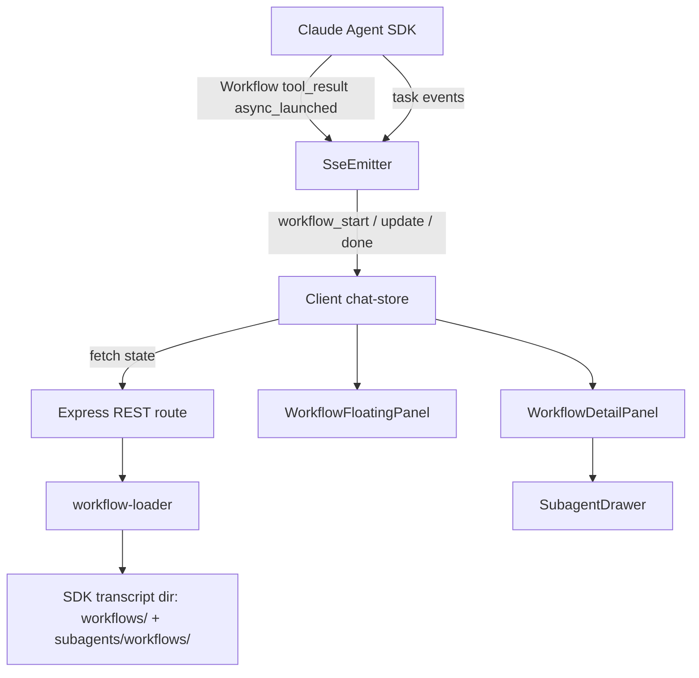

# Workflow Display in Comate

## Goal Capsule

- **Objective:** Add visibility into `Workflow` tool executions and their spawned subagents. Show live workflow status in a floating panel, keep the main message stream clean with a normal `Workflow` tool card, and open a full detail view on demand.
- **Product authority:** Existing subagent drawer and message stream patterns; extends them to workflow-generated subagents without redesigning the core chat layout.
- **Execution profile:** Standard client+server feature. Server side adds a workflow-state reader, workflow-specific SSE events, and a REST endpoint; client side adds a workflow store slice, a floating panel, and a detail view. Tail ownership: implementer.
- **Open blockers:** None.

---

## Product Contract

### Summary

When the main agent invokes the `Workflow` tool, Comate currently renders it as a plain tool card and drops the spawned subagents because they have no `parentToolUseId`. This plan adds a floating workflow status panel that stays visible while the main chat scrolls, plus a detail view that exposes the workflow's phases, subagents, and subagent conversations.

### Problem Frame

`Workflow` tool invocations launch a separate parallel task that can run many subagents across multiple phases. While it executes, the main agent continues and its messages push the `Workflow` tool card out of view. Users lose awareness of running workflow progress and have no way to inspect what subagents are doing. The current subagent UI is keyed by `parentToolUseId` and cannot map workflow subagents because they are created internally by the `Workflow` runtime without a `toolUseId`.

### Key Decisions

- **Main message stream shows a normal `Workflow` tool_use card.** It does not embed live progress; awareness comes from the floating panel.
- **Floating panel is session-scoped and always visible above the main chat.** It lists running workflows and offers one-click entry to the detail view.
- **Detail view mirrors the main agent layout:** message stream, subagent list, and subagent drawer for full conversation drill-down.
- **Workflow subagents are loaded from on-disk workflow state** (`subagents/workflows/<runId>/` and `workflows/<runId>.json`), not from the main session's subagent files.
- **Real-time updates use a hybrid of SDK task events plus disk reads.** SDK task events signal that something changed; the client/server re-reads the workflow JSON to obtain current phase/subagent detail.
- **v1 is display-only.** Cancel, retry, resume, or re-invoke are out of scope.

### Requirements

#### Workflow tool card

- R1. The `Workflow` `tool_use` in the main message stream renders as a normal tool card.
- R2. The card displays the workflow's current status (`running` / `completed` / `error`) and a minimal progress hint (current phase name and completed/running subagent counts) when available.
- R3. The card is clickable and opens the workflow detail view for that run.

#### Floating workflow panel

- R4. A floating panel is shown for the current session whenever at least one workflow is running or has completed in that session.
- R5. The panel stays visible and fixed relative to the viewport/chat chrome; it does not scroll away with the main message list.
- R6. The panel shows each workflow's status, current phase, progress bar across phases, and counts of completed/running/total subagents.
- R7. Clicking a workflow in the panel opens its detail view.
- R8. When multiple workflows are active or historical, the panel supports switching between them (list or tabs).
- R9. The panel auto-updates as workflow state changes; it does not require manual refresh.

#### Workflow detail view

- R10. The detail view renders a full conversation/message stream representing the workflow's execution: phases, subagent invocations, subagent completions, and final summary/error.
- R11. The detail view lists subagents with their status and allows opening each in the existing subagent drawer.
- R12. The detail view updates in real time while the workflow is running.
- R13. Completed workflows can be reopened from the floating panel history.

#### Server state exposure

- R14. The server exposes an endpoint that lets the client discover workflow `runId`s for the current session and read their on-disk state.
- R15. The server emits updates when a workflow task starts, progresses, or completes, so the client knows when to re-read disk state.

### Key Flows

- **F1. Main agent invokes the `Workflow` tool**
  - Main stream renders a normal `Workflow` tool card with a status badge.
  - Floating panel appears with the new workflow.
  - Panel shows current phase and subagent counts, updating live.
  - Covered by: R1, R2, R4, R6, R9.

- **F2. User wants to inspect a workflow while the main chat scrolls**
  - Floating panel remains visible as the main message list scrolls.
  - User clicks a panel item → detail view opens.
  - Covered by: R5, R7.

- **F3. User inspects a workflow subagent**
  - In the detail view, user clicks a subagent.
  - Existing subagent drawer opens with that subagent's full conversation.
  - Covered by: R10, R11.

- **F4. Workflow completes or errors**
  - Tool card transitions to `completed` or `error` state.
  - Panel keeps a historical entry.
  - Detail view reflects the final state, summary, and any error.
  - Covered by: R2, R8, R12, R13.

### Acceptance Examples

- **AE1** (covers R1, R2, R4, R6, R9): User runs `/deep-research`. Main chat shows a `Workflow` tool card with a "Running" badge. A floating panel appears showing the current phase, phase progress bar, and "3/7 subagents completed". The badge and panel update as the workflow progresses.
- **AE2** (covers R5, R7): The main agent continues sending follow-up messages. The workflow panel stays pinned in the same place. The user clicks the panel → detail view opens without scrolling the main chat.
- **AE3** (covers R10, R11): Detail view shows phase cards and a subagent list. The user clicks a running subagent → the existing subagent drawer opens and streams the subagent's messages.
- **AE4** (covers R8, R12, R13): Two workflows run in the same session. The panel lists both. After completion, both remain in the panel as historical entries and can be reopened.

### Scope Boundaries

- **In scope:** Display of workflow status, phases, subagents, and subagent conversations; a floating panel for current-session workflows; a detail view that reuses the existing subagent drawer.
- **Out of scope:** Cancel/retry/resume/re-invoke workflow from the UI; inline workflow log text display; global/cross-session workflow panel; virtualization or search inside the detail view.
- **Deferred:** Editing workflow parameters before launch, multi-workflow comparison views, workflow-level approvals, persisted workflow favorites, server-side file watchers (client polling is used for v1).

---

## Planning Contract

### Key Technical Decisions

- **Synthetic subagent key for workflow subagents.** Workflow subagents have no `parentToolUseId`, so the plan maps each to a synthetic key derived from `runId` and `agentId` (e.g., `workflow:<runId>:<agentId>`) when injecting them into the existing `SubagentState` store and `SubagentDrawer`. This reuses the current drawer and brief-status components without introducing a parallel subagent detail surface.
- **Real-time updates via workflow-specific SSE events plus REST fetch.** The server emits lightweight `workflow_start`, `workflow_update`, and `workflow_done` events. The client fetches full workflow state from a REST endpoint when it receives these events and while a workflow is active. This avoids holding per-run file watchers on the server and keeps the lifecycle simple; latency is acceptable because workflow phases change on human-noticeable timescales.
- **Detail view as a modal overlay with a mini chat layout.** A modal avoids competing with the subagent drawer for horizontal space and lets the detail view render a self-contained message stream. The modal contains a scrollable phase/subagent list and delegates subagent conversation drill-down to the existing drawer.
- **Server-side workflow loader analogous to subagent-loader.** A dedicated `workflow-loader` service reads `workflows/<runId>.json` and the per-run subagent jsonl files, normalizing them into a `WorkflowState` shape. Localizing this adapter makes SDK JSON schema changes easier to absorb.
- **No agent identity model for workflow subagents.** Workflow subagents remain anonymous execution artifacts. They do not create `BotUser` rows, session membership, or audit attribution. This matches v1's display-only scope and avoids schema churn for transient entities.

### High-Level Technical Design

### Sequencing

1. Build the server workflow loader (U1) and its tests first; it is the foundation for all other units.
2. Add SSE events and the REST endpoint (U2) so the client has a data source.
3. Extend shared types and the client store (U3) so the UI can hold workflow state.
4. Implement the UI surfaces in order of dependency: tool card (U4), floating panel (U5), detail view (U6).
5. Add i18n strings and final wiring (U7).

### Assumptions

- The SDK writes `workflows/<runId>.json` and `subagents/workflows/<runId>/agent-<id>.jsonl` under the same transcript directory used by analytics.
- The `Workflow` tool result contains `toolUseResult.status === 'async_launched'` and a `runId` string.
- Workflow JSON fields (`phases`, `workflowProgress`, `agentCount`, `status`, `summary`, `error`) are stable enough to render with a localized adapter and a graceful fallback when fields are missing.
- The existing subagent drawer can render workflow subagents if they are shaped as `SubagentState`; only the lookup key differs.

---

## Implementation Units

### U1. Server workflow-loader service

**Goal:** Read workflow state from disk and produce a normalized `WorkflowState` with phases and subagents.

**Requirements:** R10, R11, R14

**Dependencies:** None

**Files:**
- Create: `src/server/services/workflow-loader.ts`
- Create: `src/server/services/workflow-loader.test.ts`
- Read for patterns: `src/server/services/analytics-transcript-path.ts`, `src/server/services/subagent-loader.ts`

**Approach:**
- Resolve the transcript directory for the workspace using `resolveTranscriptDir`.
- Read `workflows/<runId>.json` and extract `status`, `phases`, `workflowProgress`, `agentCount`, `totalTokens`, `totalToolCalls`, `durationMs`, `summary`, and `error`.
- Discover subagent jsonl files in `subagents/workflows/<runId>/`.
- For each subagent file, parse SDK messages and reconstruct a `SubagentState` using a synthetic `parentToolUseId` of `workflow:<runId>:<agentId>`. Reuse the block-parsing and state-derivation logic from `subagent-loader.ts`; extract shared helpers if duplication becomes significant.
- Return `WorkflowState` or `null` when the workflow JSON is missing or unreadable.

**Patterns to follow:**
- `analytics-transcript-path.ts` for transcript path resolution.
- `subagent-loader.ts` for SDK message → `SubagentState` reconstruction.
- `json-store.ts` for defensive JSON parsing and temp-file write patterns (read side only).

**Test scenarios:**
- Happy path: workflow JSON plus one subagent jsonl returns a complete `WorkflowState` with correct status, phases, and subagent messages.
- Missing workflow JSON returns `null` without throwing.
- Missing subagent files returns a `WorkflowState` with an empty subagents list.
- Malformed workflow JSON logs an error and returns `null`.
- Malformed subagent jsonl skips that subagent and keeps the others.
- Covers AE3: subagent messages are reconstructed and can be looked up by synthetic key.

**Verification:**
- `npm run test:server` passes with the new `workflow-loader.test.ts`.
- Manual check: load a known workflow runId via a temporary script and inspect the returned state.

---

### U2. Server SSE workflow events + REST endpoint

**Goal:** Notify the client of workflow lifecycle changes and serve full workflow state on demand.

**Requirements:** R14, R15, R9 (partial), R12 (partial)

**Dependencies:** U1

**Files:**
- Modify: `src/server/services/sse-emitter.ts`
- Modify: `src/server/routes/chat.ts`
- Read for patterns: `src/server/routes/chat.ts`, `src/server/services/commands-service.ts` (for chokidar patterns, deferred to follow-up)

**Approach:**
- In `SseEmitter.handleUser`, detect a `tool_result` whose paired `tool_use` has `toolName === 'Workflow'` and whose `toolUseResult.status === 'async_launched'` with a `runId`. Emit `workflow_start` with `runId`, `sessionId`, and the `toolUseId`.
- Track active workflow runIds in a per-emitter `Set`. When task events arrive with a matching `task_id`, emit `workflow_update` with the `runId`.
- Emit `workflow_done` when a terminal task event arrives or when the workflow JSON read in U1 reports a terminal status.
- Add `GET /api/workspaces/:id/sessions/:sessionId/workflows/:runId` returning `{ workflow }` or `404`.
- Add `GET /api/workspaces/:id/sessions/:sessionId/workflows` returning `{ runIds }` discovered by scanning the session transcript for `Workflow` tool results with `async_launched`.

**Patterns to follow:**
- Existing `task_started` / `task_updated` SSE handling in `sse-emitter.ts`.
- Existing route error shapes (`{ error }`) and inline validation.

**Test scenarios:**
- SSE `workflow_start` is emitted when a `Workflow` tool result carries `async_launched` and `runId`.
- SSE `workflow_update` is emitted for task events matching a tracked runId.
- REST endpoint returns workflow state for a valid runId.
- REST endpoint returns `404` for a missing runId.
- List endpoint returns runIds found in the session transcript.

**Verification:**
- Route-level tests or manual SSE event inspection in browser DevTools.
- `npm run test:server` passes for any new route tests.

---

### U3. Shared types and client chat-store workflow slice

**Goal:** Add workflow types to the shared `SseEvent` union and store workflow state on the client.

**Requirements:** R4, R6, R8, R9, R12, R13

**Dependencies:** U2

**Files:**
- Modify: `src/server/types/message.ts`
- Modify: `src/client/types/message.ts`
- Modify: `src/client/stores/chat-store.ts`
- Modify: `src/client/stores/chat-store.test.ts`

**Approach:**
- Add a `WorkflowState` interface and `workflow_start`, `workflow_update`, `workflow_done` events to `SseEvent` in both type files; keep them byte-identical.
- Add `workflows: Record<string, WorkflowState[]>` keyed by `sessionId` to the chat store.
- Handle `workflow_start` by adding a placeholder `WorkflowState` with status `running` and begin polling the REST endpoint every 2 seconds.
- Handle `workflow_update` and `workflow_done` by fetching the current state from the endpoint and merging it into the store; stop polling when status is terminal.
- When merging workflow state, inject each workflow subagent into `subagents[sessionId]` using the synthetic key from U1 so the existing drawer can find it.
- Clean up workflow state when a session is deleted.

**Patterns to follow:**
- Existing `subagent_start` / `subagent_delta` / `subagent_done` handlers in `chat-store.ts`.
- Existing `loadMessages` merge logic for subagents.

**Test scenarios:**
- `workflow_start` adds a workflow to the store and starts polling.
- `workflow_update` merges fetched state without duplicating workflows.
- `workflow_done` transitions status to `completed` or `error` and stops polling.
- Workflow subagents are injected into `subagents[sessionId]` with synthetic keys.
- Session deletion removes the workflow list for that session.
- Covers AE4: multiple workflows in the same session are tracked independently.

**Verification:**
- `npm run test:client` passes with updated `chat-store.test.ts`.
- Dev console inspection confirms store transitions during a live workflow run.

---

### U4. Workflow tool card enhancement

**Goal:** Render the `Workflow` tool_use with a status badge and progress hint that opens the detail view.

**Requirements:** R1, R2, R3

**Dependencies:** U3

**Files:**
- Modify: `src/client/components/ChatMessageRenderer.tsx`
- Modify: `src/client/i18n/en/chat.json`
- Modify: `src/client/i18n/zh-CN/chat.json`
- Add/update tests in `src/client/components/ChatMessageRenderer.test.tsx` if it exists, or create a focused test file.

**Approach:**
- In `ChatMessageRenderer`, branch on `part.toolName === 'Workflow'` before the generic `Tool` rendering path.
- Render a compact card using the same container styling as `Tool` but with a status badge (running/completed/error), the current phase name, and completed/running/total subagent counts from the store.
- Pass an `onOpenWorkflow(runId)` callback from `ChatPanel` through `MessageList` to `ChatMessageRenderer`.
- Keep non-`Workflow` tool rendering unchanged.

**Patterns to follow:**
- `SubagentBriefStatus.tsx` for status-badge/duration/count layout.
- `ai-elements/tool.tsx` for card container styling.

**Test scenarios:**
- Workflow tool card renders with a status badge and progress hint.
- Clicking the card invokes `onOpenWorkflow` with the correct `runId`.
- Badge and hint update when the workflow store changes.
- Non-Workflow tools continue to render as before.

**Verification:**
- Component tests pass.
- Manual check during a live `/deep-research` run.

---

### U5. Floating workflow panel

**Goal:** Provide an always-visible panel that lists workflows for the current session.

**Requirements:** R4, R5, R6, R7, R8

**Dependencies:** U3, U4

**Files:**
- Create: `src/client/components/WorkflowFloatingPanel.tsx`
- Modify: `src/client/components/ChatPanel.tsx`
- Add tests: `src/client/components/WorkflowFloatingPanel.test.tsx`

**Approach:**
- Read workflows for the active session from the chat store.
- Render a fixed/absolute panel positioned above the message list (e.g., bottom-right within the chat area container).
- When no workflows exist, render nothing.
- For each workflow show status badge, current phase, a phase progress bar, and completed/running/total subagent counts.
- Support multiple workflows as a compact vertical list; clicking a workflow opens the detail view.
- Ensure the panel does not intercept scroll events meant for the message list.

**Patterns to follow:**
- `MessageSearchBar` positioning inside `ChatPanel` for fixed-overlays-above-messages pattern.
- Existing status-badge styling from `SubagentBriefStatus`.

**Test scenarios:**
- Panel renders when workflows exist and is absent when none exist.
- Panel reflects workflow state updates (status, phase, counts).
- Clicking a workflow item opens the detail view.
- Multiple workflows render as separate items.
- Covers AE2: panel remains reachable without scrolling the main message list.

**Verification:**
- Component tests pass.
- Manual visual check: open a long chat, scroll, and confirm the panel stays in place.

---

### U6. Workflow detail view + subagent drawer integration

**Goal:** Render the full workflow execution in a detail view and allow subagent drill-down through the existing drawer.

**Requirements:** R10, R11, R12, R13

**Dependencies:** U3, U5

**Files:**
- Create: `src/client/components/WorkflowDetailPanel.tsx`
- Create: `src/client/components/WorkflowConversation.tsx`
- Modify: `src/client/components/ChatPanel.tsx`
- Modify if necessary: `src/client/components/SubagentDrawer.tsx`
- Add tests: `src/client/components/WorkflowDetailPanel.test.tsx`

**Approach:**
- Implement the detail view as a modal overlay (Dialog) with a header, scrollable body, and close affordance.
- Header shows workflow description, status badge, duration, and aggregate stats.
- Body renders phases as compact cards and a subagent list. Use `WorkflowConversation` to adapt workflow phases and subagents into renderable message shapes and reuse `ChatMessageRenderer`.
- Subagent list items reuse `SubagentBriefStatus` with the synthetic key from U1; clicking opens `SubagentDrawer`.
- If `SubagentDrawer` cannot look up synthetic keys without modification, update its selector to fall back to a workflow-subagent lookup.
- Detail view subscribes to store changes so it updates while the workflow runs.

**Patterns to follow:**
- `SubagentDrawer.tsx` for side-panel/drawer layout and resize behavior.
- `ChatMessageRenderer.tsx` for message-part rendering.
- Radix Dialog for modal behavior (already used elsewhere in the UI).

**Test scenarios:**
- Detail panel renders workflow phases and subagent list.
- Clicking a subagent opens the existing subagent drawer with the correct conversation.
- Detail view updates when the workflow store changes.
- Completed workflows can be reopened from the floating panel.
- Covers AE3: subagent drawer opens from the detail view.

**Verification:**
- Component tests pass.
- Manual walkthrough: open detail view during a live workflow and inspect subagent conversations.

---

### U7. i18n and integration polish

**Goal:** Add translations, wire the UI surfaces together, and ensure clean integration.

**Requirements:** R1–R13 (UI strings)

**Dependencies:** U4, U5, U6

**Files:**
- Modify: `src/client/i18n/en/chat.json`
- Modify: `src/client/i18n/zh-CN/chat.json`
- Modify: `src/client/components/ChatPanel.tsx`
- Modify: `CHANGELOG.md`

**Approach:**
- Add workflow-specific keys to both locale files: status labels, panel title, detail view labels, empty/error states, progress bar labels.
- Wire `openWorkflowRunId` state and `onOpenWorkflow` / `onCloseWorkflow` callbacks in `ChatPanel`.
- Ensure the floating panel and detail panel are keyboard accessible and dismissible (Escape closes detail view).
- Update `CHANGELOG.md` with a concise entry following Keep a Changelog format.

**Patterns to follow:**
- Existing i18n namespace organization under `chat`.
- `ChatPanel` state ownership pattern already used for `openDrawerToolUseId`.

**Test scenarios:**
- All new UI strings have entries in both `en` and `zh-CN`.
- No console warnings about missing translation keys.
- Escape key closes the detail view.

**Verification:**
- `npm run lint` passes.
- Manual UI check in both languages.

---

## Verification Contract

| Gate | Command | Applies to | Notes |
|------|---------|------------|-------|
| Lint | `npm run lint` | All units | Must pass before any handoff. |
| Server unit tests | `npm run test:server` | U1, U2 | New `workflow-loader.test.ts` and any route tests. |
| Client unit tests | `npm run test:client` | U3, U4, U5, U6 | Updated `chat-store.test.ts` and new component tests. |
| Browser tests | `npm run test:browser` | U5, U6 (if feasible) | Add focused browser tests for panel and detail view interactions if the test harness supports modal rendering. |
| Manual smoke | Trigger a `Workflow` tool invocation (e.g., `/deep-research`) | End-to-end | Verify floating panel, detail view, and subagent drawer behave as described in AE1–AE4. |

---

## Definition of Done

- U1–U7 are implemented and covered by the Verification Contract gates above.
- `npm run lint` passes with no new warnings.
- All new tests pass; existing tests continue to pass.
- A live `Workflow` tool invocation shows the floating panel, opens the detail view, and drills into subagents without errors.
- Agent-tool subagents continue to render and open in the drawer exactly as before (no regression).
- i18n keys are present in both English and Chinese locale files.
- `CHANGELOG.md` has a user-facing entry for this feature.
- No workflow subagent creates user-identity, session-membership, or audit records.

---

## System-Wide Impact

- **SSE event vocabulary:** Three new event types (`workflow_start`, `workflow_update`, `workflow_done`) are emitted by the server and consumed by the client. Future SSE consumers must handle or ignore them.
- **Chat-store state shape:** New `workflows` field added to `ChatState`. Downstream selectors or devtools will see this new field.
- **Subagent drawer reuse:** Workflow subagents are injected into the existing `subagents` slice with synthetic keys. The drawer and brief-status components must tolerate keys that do not correspond to a real `tool_use` in the main transcript.
- **Message rendering:** `Workflow` tool invocations now render a custom card instead of the generic `Tool` component. Non-Workflow tool rendering is unchanged.
- **No identity/permission impact:** Workflow subagents are anonymous display artifacts and do not affect `BotUser`, `user_sessions`, or approval models.

---

## Risks & Dependencies

| Risk | Mitigation |
|------|------------|
| Workflow JSON structure changes between SDK versions | Keep the reader adapter localized in `workflow-loader.ts`; fail gracefully to a raw-state fallback if expected fields are missing. |
| SDK task events are unreliable or delayed | The client polls the REST endpoint while a workflow is active, so the UI catches up even if SSE hints are missed. |
| Main chat layout has limited space for a floating panel | Panel is compact and hides when no workflows exist; detail view opens in a separate modal. |
| Workflow subagent files may be cleaned up while detail view is open | Surface a "Workflow data no longer available" state in the detail view instead of crashing. |
| Synthetic subagent keys collide with real `toolUseId`s | Prefix workflow synthetic keys with `workflow:` to avoid collision with SDK-generated `toolUseId`s. |
| SSE reliability issues for long-running workflows | Reuse existing SSE heartbeat and reconnect logic; the client re-fetches state after reconnect using the active workflow list. |

---

## Open Questions

### Resolved During Planning

- **Real-time strategy:** Workflow-specific SSE events notify the client, which fetches full state via REST. Server-side file watchers are deferred.
- **Subagent drawer reuse:** Workflow subagents use synthetic keys so the existing drawer can render them.
- **Detail view container:** Modal overlay with mini chat layout.
- **Agent identity:** Workflow subagents remain anonymous; no user/identity tables are touched.

### Deferred to Implementation

- **Exact workflow JSON field mapping:** Inspect a real `workflows/<runId>.json` during implementation to finalize phase/subagent rendering shapes.
- **Polling interval tuning:** Start with 2 seconds; adjust based on observed update frequency and server load.
- **Detail view modal sizing:** Finalize width and scroll behavior once the phase list and subagent list are rendered with real data.

---

## Sources & Research

- **Upstream requirements-only plan:** `docs/plans/2026-07-07-001-feat-workflow-display-plan.md` (this file, enriched to implementation-ready).
- **Relevant code patterns:** `src/server/services/chat-service.ts`, `src/server/services/subagent-loader.ts`, `src/server/services/sse-emitter.ts`, `src/server/types/message.ts`, `src/client/types/message.ts`, `src/client/stores/chat-store.ts`, `src/client/components/ChatMessageRenderer.tsx`, `src/client/components/SubagentBriefStatus.tsx`, `src/client/components/SubagentDrawer.tsx`, `src/client/components/ChatPanel.tsx`, `src/server/routes/chat.ts`, `src/server/services/analytics-transcript-path.ts`.
- **Institutional learnings:** SSE heartbeat/reconnect/resume patterns documented in `docs/solutions/integration-issues/`; isolated SQLite testing convention in `docs/solutions/conventions/use-isolated-test-database-for-comate.md`.
- **Observed workflow runtime:** Workflow subagents live under `subagents/workflows/<runId>/` with meta files containing only `{"agentType":"workflow-subagent"}`; workflow state JSON lives at `workflows/<runId>.json`.
