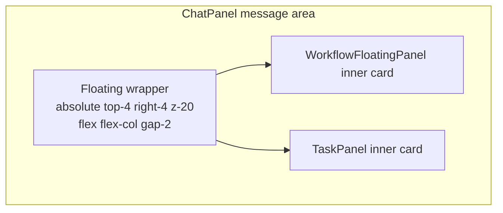

# Task Panel Float and Filter - Plan

## Goal Capsule

- **Objective:** Move the TaskPanel from an inline header bar to a floating top-right panel that stacks vertically with the WorkflowFloatingPanel, while narrowing its content to TaskCreate/TaskUpdate tasks only.
- **Product authority:** Existing WorkflowFloatingPanel positioning and behavior in `ChatPanel`; existing task status model and chat-store task scanning.
- **Execution profile:** Standard client-only refactor. Changes touch component layout, chat-store task scanning/filtering, and related tests.
- **Open blockers:** None.

---

## Product Contract

*Product Contract unchanged from the upstream brainstorm.*

### Summary

Relocate TaskPanel so it floats in the top-right corner of the chat area, stacked vertically above or below the WorkflowFloatingPanel. Restrict the panel to tasks produced by `TaskCreate`/`TaskUpdate` tool events; todos produced by `TodoWrite` continue to render in the message stream but no longer appear in TaskPanel.

### Problem Frame

TaskPanel currently sits as a horizontal bar below the chat header, consuming vertical space and pushing the message list down. The WorkflowFloatingPanel already floats in the top-right corner. The two progress surfaces have different positions and visual weights, so the chat chrome feels inconsistent. Additionally, TaskPanel mixes `TodoWrite` todos with `TaskCreate`/`TaskUpdate` tasks under one progress surface, even though the two tool families have different lifecycles and semantics.

### Key Decisions

- **Top-right floating position inside the chat area.** Matches WorkflowFloatingPanel and frees the header area for the message stream.
- **Vertical stacking with WorkflowFloatingPanel.** Workflow and task panels remain separate surfaces with independent visibility rules; they stack vertically when both are present.
- **Store-layer filtering of `TodoWrite` entries.** `TodoWrite` items are excluded from the session task list consumed by TaskPanel, instead of being hidden only in the UI.
- **Long task titles wrap instead of truncate.** The floating panel is wider than the collapsed header bar was, and users need to read the full task subject.

### Requirements

#### Positioning and layout

- R1. TaskPanel renders as a floating overlay positioned in the top-right corner of the chat message area.
- R2. When both TaskPanel and WorkflowFloatingPanel are visible, the two panels stack vertically without overlapping.
- R3. TaskPanel remains above the scrolling message list and below modal overlays, drawers, and toasts.
- R4. The panel supports a maximum height and scrolls internally when its content exceeds that height.

#### Content and filtering

- R5. TaskPanel displays only tasks created by `TaskCreate` or updated by `TaskUpdate`.
- R6. `TodoWrite` items no longer appear in TaskPanel.
- R7. `TodoWrite` items continue to render as normal tool cards in the message stream.
- R8. Each task row displays its status icon, full subject text, and active form text when in progress.
- R9. Long task subjects wrap to multiple lines instead of being truncated.

#### Interaction

- R10. The panel remains collapsed by default and expands on click, consistent with the current inline behavior.
- R11. Pressing Escape closes the expanded panel.
- R12. Switching sessions updates the panel to the new session's task list.

### Key Flows

- **F1. Both panels are visible**
  - **Trigger:** A session has both running task-tool tasks and active workflows.
  - **Outcome:** WorkflowFloatingPanel and TaskPanel appear stacked in the top-right corner without overlap.
  - **Covered by:** R1, R2.

- **F2. Agent uses TodoWrite**
  - **Trigger:** A `TodoWrite` tool_use arrives in the stream.
  - **Outcome:** The todo list renders as a normal tool card in the message stream; TaskPanel does not show it.
  - **Covered by:** R6, R7.

- **F3. Agent uses TaskCreate/TaskUpdate**
  - **Trigger:** `TaskCreate` or `TaskUpdate` tool events arrive.
  - **Outcome:** TaskPanel shows the task with status, subject, and active form.
  - **Covered by:** R5, R8.

### Acceptance Examples

- **AE1** (covers R1, R2, R4): TaskPanel floats in the top-right of the chat area. When a workflow is also running, the two panels stack vertically with a small gap and each panel scrolls independently if content is long.
- **AE2** (covers R5, R6, R7): A session receives `TodoWrite` with three todos. The message stream shows the TodoWrite tool card, but TaskPanel remains empty unless task-tool tasks are also present.
- **AE3** (covers R8, R9): A task with a long subject is shown in TaskPanel. The full text wraps across multiple lines within the panel width.

### Scope Boundaries

- **In scope:** TaskPanel layout, positioning, and content filtering; chat-store task scanning changes; related component tests.
- **Out of scope:** WorkflowFloatingPanel behavior, WorkflowDetailPanel, TodoList in the sidebar, task state machine changes, new user-managed task UI, server-side SSE changes.
- **Deferred:** Drag-to-reorder panels, user-toggleable panel position, global cross-session task aggregation.

### Dependencies / Assumptions

- The chat store already distinguishes `TodoWrite`, `TaskCreate`, and `TaskUpdate` tool events.
- `TaskItem` status vocabulary and icon mapping remain unchanged.
- WorkflowFloatingPanel keeps its current top-right absolute positioning within the same chat container.

---

## Planning Contract

### Key Technical Decisions

- **Filter `TodoWrite` in the client chat store, not in the UI.** The server-side `scanSdkMessagesForTasks` already emits only task-lifecycle system messages, so server-returned `tasks` never contain `TodoWrite`. Removing `TodoWrite` from the client-side `scanMessagesForTasks` and from the live `tool_use_done` handler completes the filtering without touching the server.
- **Let `ChatPanel` own the shared floating wrapper.** Both `WorkflowFloatingPanel` and `TaskPanel` currently render their own positioning wrappers. Refactoring them to render only their inner cards and placing them inside a single `absolute top-4 right-4` flex column in `ChatPanel` guarantees vertical stacking and avoids duplicate absolute contexts.
- **Keep `TaskItem` shape unchanged.** No new `source` field is added; `TodoWrite` is removed from the merged task list entirely, so consumers do not need to filter.

### High-Level Technical Design



- `WorkflowFloatingPanel` and `TaskPanel` become card-only components: they return `null` when empty and otherwise render the bordered/shadowed card surface.
- `ChatPanel` renders the shared wrapper once and places both cards inside it.
- The chat store's `tasks[sessionId]` no longer contains `TodoWrite` entries after `scanMessagesForTasks` and live event handling are updated.

### Sequencing

1. U1 — Filter `TodoWrite` out of the chat-store task list so the data contract is clean.
2. U2 — Refactor `TaskPanel` into a card-only floating panel component.
3. U3 — Update `ChatPanel` and `WorkflowFloatingPanel` to share a single floating wrapper.
4. U4 — Update translations and tests.

### Assumptions

- Server-side `loadMessages` continues to return only task-lifecycle tasks in the `tasks` field.
- No other component consumes `state.tasks` and expects `TodoWrite` entries.
- The existing `z-20` stacking context is sufficient for the new floating panel relative to the message list and below `z-50` overlays.

---

## Implementation Units

### U1. Filter TodoWrite out of chat-store task list

**Goal:** Ensure `state.tasks[sessionId]` contains only `TaskCreate`/`TaskUpdate` and task-lifecycle SSE tasks, with no `TodoWrite` entries.

**Requirements:** R5, R6, R7.

**Dependencies:** None.

**Files:**
- Modify: `src/client/stores/chat-store.ts`
- Add tests: `src/client/stores/chat-store.test.ts`

**Approach:**
- Remove the `TodoWrite` branch from `scanMessagesForTasks` so historical message scans no longer produce synthetic `todowrite-*` task items.
- Remove the `TodoWrite` branch from the `tool_use_done` handler so live `TodoWrite` tool results do not overwrite `state.tasks[sessionId]`.
- Leave the raw `TodoWrite` tool card rendering in the message stream untouched.
- Keep `TaskCreate`, `TaskUpdate`, and SSE `task_started`/`task_updated` paths unchanged.

**Patterns to follow:**
- Existing `scanMessagesForTasks` structure and the `tool_use_done` handler in the same file.

**Test scenarios:**
- `scanMessagesForTasks` with a `TodoWrite` tool_use returns an empty task list.
- `scanMessagesForTasks` with `TaskCreate` + matching `tool_result` returns the created task.
- `scanMessagesForTasks` with `TaskUpdate` patches an existing task's status.
- Live `tool_use_done` for `TodoWrite` leaves `state.tasks[sessionId]` unchanged.
- Live `tool_use_done` for `TaskCreate` adds a pending task awaiting its `tool_result`.

**Verification:**
- `npm run test:client` passes for `chat-store.test.ts`.
- Loading a session with historical `TodoWrite` messages shows no tasks in the store.

---

### U2. Refactor TaskPanel into a floating card

**Goal:** Convert `TaskPanel` from an inline header bar to a card-shaped floating panel that supports vertical stacking, internal scrolling, and wrapped long titles.

**Requirements:** R1, R4, R8, R9, R10, R11, R12.

**Dependencies:** U1.

**Files:**
- Modify: `src/client/components/TaskPanel.tsx`
- Modify: `src/client/i18n/en/chat.json`
- Modify: `src/client/i18n/zh-CN/chat.json`
- Update tests: `src/client/components/TaskPanel.test.tsx`

**Approach:**
- Remove the full-width inline wrapper (`relative flex-shrink-0 border-b ...`).
- Return `null` when the task list is empty.
- Render a single bordered card (`rounded-lg border border-border bg-surface p-3 shadow-lg`) containing:
  - A header with a `ListTodo` icon, panel title, progress bar, count, and expand chevron.
  - An expandable inner list with `max-h-64 overflow-y-auto` and `fontSizeClass(chatFontSize)`.
- Make task subject text wrap (`whitespace-normal` or equivalent) instead of truncating.
- Preserve `Escape` collapse and auto-collapse on `sessionId` change.
- Add a translated panel title via `useTranslation('chat')` and add any new keys to both `src/client/i18n/en/chat.json` and `src/client/i18n/zh-CN/chat.json`.

**Patterns to follow:**
- `WorkflowFloatingPanel` card styling and `useTranslation` pattern.
- Existing `statusConfig` and `TaskRow` rendering.

**Test scenarios:**
- Renders nothing when there are no tasks.
- Renders the collapsed card with progress summary when tasks exist.
- Expands to show task rows when clicked.
- Does not show `TodoWrite` tasks (covers AE2).
- Shows task status icon, subject, and active form text (covers R8).
- Long task subjects wrap within the card width (covers R9).
- Internal list scrolls when tasks exceed `max-h-64`.
- Pressing Escape collapses the expanded panel (covers R11).
- Switching `sessionId` collapses the panel (covers R12).

**Verification:**
- `npm run test:client` passes for `TaskPanel.test.tsx`.
- Manual visual check: TaskPanel appears as a top-right card, expands/collapses, and wraps long titles.

---

### U3. Share a single floating wrapper in ChatPanel

**Goal:** Stack `WorkflowFloatingPanel` and `TaskPanel` vertically in the top-right corner of the chat message area without overlap.

**Requirements:** R1, R2, R3.

**Dependencies:** U2.

**Files:**
- Modify: `src/client/components/ChatPanel.tsx`
- Modify: `src/client/components/WorkflowFloatingPanel.tsx`
- Update tests: `src/client/components/WorkflowFloatingPanel.test.tsx`
- Update tests: `src/client/components/ChatPanel.test.tsx`

**Approach:**
- Remove the inline `<TaskPanel>` render below the chat header in `ChatPanel`.
- Remove the outer `absolute top-4 right-4 ... pointer-events-none` wrapper from `WorkflowFloatingPanel`; keep the inner card as the component's rendered surface.
- In `ChatPanel`, inside the message area container, add a shared wrapper:
  ```
  absolute top-4 right-4 z-20 flex max-w-xs flex-col gap-2 pointer-events-none
  ```
- Render `WorkflowFloatingPanel` and `TaskPanel` as siblings inside the wrapper; each returns either an inner `pointer-events-auto` card or `null`.
- Order the panels so the workflow card appears above the task card (or match product preference); either order is acceptable as long as it is stable and visually consistent.

**Patterns to follow:**
- Existing `WorkflowFloatingPanel` wrapper styling.
- `ToastContainer` pointer-events wrapper/inner split.

**Test scenarios:**
- `WorkflowFloatingPanel` renders its inner card classes without the outer absolute wrapper.
- `ChatPanel` renders the shared floating wrapper only when at least one panel has content.
- Both panels are present in the wrapper when workflows and tasks are active (covers AE1).
- The wrapper positions panels at `top-4 right-4` with a vertical gap.

**Verification:**
- `npm run test:client` passes for `WorkflowFloatingPanel.test.tsx` and `ChatPanel.test.tsx`.
- Manual check: open a session with both running workflows and tasks; the two cards stack vertically and do not overlap.

---

### U4. Update integration tests

**Goal:** Ensure existing integration tests still pass after layout changes and add a layout assertion for the new floating position.

**Requirements:** R1, R10.

**Dependencies:** U2, U3.

**Files:**
- Modify: `src/client/components/ChatPanel.test.tsx`

**Approach:**
- Remove or replace the `TaskPanel` mock in `ChatPanel.test.tsx` so layout assertions can run against the real component or a lightweight placeholder.
- Add a `ChatPanel` test asserting that `TaskPanel` renders inside the message area floating wrapper, not below the header.

**Patterns to follow:**
- Existing `WorkflowFloatingPanel.test.tsx` mock patterns.

**Test scenarios:**
- `ChatPanel` no longer renders `TaskPanel` as an inline sibling of the chat header.
- `ChatPanel` renders `TaskPanel` inside the shared floating wrapper.

**Verification:**
- `npm run test:client` passes for `ChatPanel.test.tsx`.
- `npm run lint` passes.

---

## Verification Contract

| Gate | Command | Applies to | Notes |
|------|---------|------------|-------|
| Lint | `npm run lint` | All units | Must pass before handoff. |
| Client unit tests | `npm run test:client` | U1, U2, U3, U4 | Update affected test files. |
| Browser tests | `npm run test:browser` | U2, U3 (if feasible) | Add focused visual/regression tests for floating panel positioning if the harness supports it. |
| Manual smoke | Open a session with `TodoWrite` and `TaskCreate` | End-to-end | Verify TodoWrite stays in the message stream, TaskPanel shows only TaskCreate/TaskUpdate tasks, and both panels stack with workflows. |

---

## Definition of Done

- U1–U4 are implemented and covered by the Verification Contract gates above.
- `npm run lint` passes with no new warnings.
- All new and updated client tests pass; existing tests continue to pass.
- A live session shows TaskPanel floating in the top-right, stacked with WorkflowFloatingPanel when both are present.
- `TodoWrite` tool cards render in the message stream but do not appear in TaskPanel.
- `TaskCreate`/`TaskUpdate` tasks appear in TaskPanel with correct status, subject, and wrapped long titles.
- i18n keys are present in both English and Chinese locale files.
- `CHANGELOG.md` has a user-facing entry for this refactor.
- No server-side changes are required or made.

---

## Risks & Dependencies

| Risk | Mitigation |
|------|-----------|
| Other components rely on `state.tasks` containing `TodoWrite` entries | Search all consumers of `useChatStore((s) => s.tasks...)` before filtering; if any non-TaskPanel consumer needs todos, expose a separate selector rather than keeping them in `tasks`. |
| Server `tasks` field unexpectedly includes TodoWrite in the future | Add a defensive filter in the `loadMessages` merge path so server-returned tasks are also sanitized. |
| WorkflowFloatingPanel tests assert the removed outer wrapper | Update tests in U3 to assert the inner card classes instead. |
| Expanded TaskPanel dropdown extends beyond the card's `pointer-events-auto` area | Make the expanded list an internal scroll area inside the card rather than an absolute dropdown. |
| Long titles or many tasks push the floating card too tall | Cap card height and scroll internally (R4). |

---

## Sources & Research

- Current TaskPanel: `src/client/components/TaskPanel.tsx`
- Current WorkflowFloatingPanel: `src/client/components/WorkflowFloatingPanel.tsx`
- ChatPanel layout: `src/client/components/ChatPanel.tsx`
- Chat store task scanning: `src/client/stores/chat-store.ts`
- Server task scanning: `src/server/services/message-normalizer.ts`
- Prior task/todo panel plan: `docs/plans/2026-05-19-005-feat-task-todo-panel-plan.md`
- Floating panel patterns: `src/client/components/MessageSearchBar.tsx`, `src/client/components/ToastContainer.tsx`
