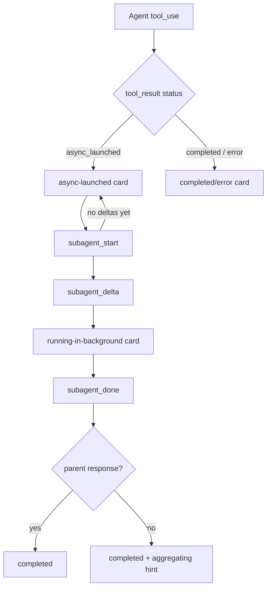

# Async Subagent Message Display - Plan

## Goal Capsule

- **Objective:** Adapt the chat message display so Agent tool invocations that run as async/background subagents render a clean, informative inline lifecycle card, hide internal launch metadata, and expose the existing drawer action.
- **Product authority:** Comate chat UI.
- **Execution profile:** Code changes across the SSE emitter, message renderer, subagent card, drawer, and i18n files.
- **Stop conditions:** Async-launched / running-in-background / completed / error states render correctly, raw "Async agent launched successfully" metadata is never shown inline, and `subagent_done` fires only when the subagent transcript truly ends.
- **Open blockers:** None.

---

## Product Contract

### Summary

Render Agent tool invocations as an inline lifecycle card that distinguishes **async-launched**, **running-in-background**, **completed**, and **error** states. Suppress the raw "Async agent launched successfully" metadata from the card body. Completed and error cards do **not** show inline result or error previews; the full collected output or error details live in the existing `SubagentDrawer`.

The backend must stop finalizing the subagent on the async-launch metadata `tool_result` so that `subagent_done` is emitted only when the subagent actually finishes.

### Requirements

#### State rendering

- R1. When an Agent `tool_use` has no matching `SubagentState` yet and its `tool_result` contains async-launch metadata, render an **async-launched** card instead of dumping the raw metadata text.
- R2. When a matching `SubagentState` exists, the subagent state is `running`, and the associated `tool_result` is still the async placeholder, render a **running-in-background** card with a distinct badge and a hint that the user can keep working.
- R3. When the subagent has finished (`subagent_done` received with success), render a **completed** card. Do not render an inline result preview. If the parent has not yet produced a follow-up response, the card may show a transient "Aggregating result..." hint.
- R4. When the subagent errors, render an **error** card. Do not render an inline error preview; the full error stays in the drawer.
- R5. The "Aggregating result..." hint appears only when the derived display state is `completed`, the parent assistant message is the most recent assistant message, and no later assistant content has been appended for this subagent.

#### Metadata suppression

- R6. The inline card must never display internal-only strings such as `agentId:`, `output_file:`, `outputFile`, or `Async agent launched successfully` as body text.
- R7. The card may still use the `agentId` internally to correlate with `SubagentState` and background-task APIs.

#### Actions

- R8. At any state, show an **Open panel** action that opens the existing `SubagentDrawer` for the full transcript. The button must have an accessible name, `aria-expanded`, and a visible focus ring.

#### Backend lifecycle fix

- R9. The SSE emitter must not call `finalizeSubagent` when an Agent `tool_result` carries `toolUseResult.status === 'async_launched'`. It should only finalize when the result represents the actual collected output or a synchronous completion.
- R10. `subagent_done` must be emitted only when the subagent's own transcript ends (via its `result` message), not when the async-launch metadata arrives.

#### Visual continuity

- R11. The card must align with the existing `SubagentBriefStatus` styling (rounded border, left accent, status badge, compactable body).
- R12. Each state must have a unique badge label and a recognizable icon/color so users can scan the message stream and distinguish background work from completed/error work.

#### Drawer and empty states

- R13. If the user opens the drawer before `subagent_start` has created a `SubagentState`, the drawer must render a minimal "Agent is starting..." placeholder instead of returning `null`.
- R14. The drawer must show an empty/loading state for the conversation area when `subagent.messages` is empty.

#### Multiple cards and content hierarchy

- R15. When a message contains multiple Agent `tool_use` parts, each part renders its own independent card, ordered by `toolUseId`, with independent Open panel actions.
- R16. The inline card content hierarchy is: header (Agent label, elapsed, tool count, status badge, Open panel button), optional collapsible prompt, optional progress hint, and optional aggregating-result hint. No result or error body is shown inline.

#### Accessibility

- R17. State transitions must be announced to assistive technologies via an `aria-live` region (e.g., "Async" → "Running in background" → "Completed" / "Error").

### Key Flows

- F1. Agent invoked with `run_in_background: true` (or default async)
  - **Trigger:** Assistant message contains an `Agent` `tool_use` part.
  - **Steps:**
    1. Server returns a `tool_result` with async-launch metadata; the emitter does **not** finalize the subagent.
    2. UI renders the async-launched card from the metadata.
    3. Server emits `subagent_start`; UI keeps the async-launched badge until the first `subagent_delta` arrives.
    4. `subagent_delta` events stream; UI transitions to running-in-background.
    5. Subagent transcript ends; server emits `subagent_done`; UI transitions to completed.
    6. Parent consumes the output and produces its next response; UI hides the aggregating-result hint.
  - **Outcome:** The user sees one coherent inline card that evolves through states instead of raw metadata text.

- F2. Synchronous Agent
  - **Trigger:** Assistant message contains an `Agent` `tool_use` part and the SDK returns the collected output inline.
  - **Steps:**
    1. `subagent_start` creates a running card.
    2. `subagent_delta` events stream.
    3. `subagent_done` finalizes the card to completed or error.
  - **Outcome:** Existing behavior is preserved.

### Acceptance Examples

- AE1. Async metadata only
  - **Given:** A message has an `Agent` `tool_use` with `toolUseId=tu-1` and a matching `tool_result` whose `toolUseResult.status === 'async_launched'` and output is `"Async agent launched successfully"`.
  - **When:** `SubagentBriefStatus` renders before `subagent_start` has been processed.
  - **Then:** The card shows an "Async" badge, the Agent label, and an Open panel button; the raw output text is not visible.

- AE2. Async-to-running transition
  - **Given:** `SubagentState` exists for `tu-1` with `state='running'`, zero messages, and the associated `tool_result` is still the async placeholder.
  - **When:** The card renders.
  - **Then:** The badge is "Async".
  - **When:** The first `subagent_delta` arrives.
  - **Then:** The badge changes to "Running in background" with a pulsing clock icon.

- AE3. Lifecycle guard in the emitter
  - **Given:** An `Agent` `tool_use` is tracked in `SseEmitter.activeSubagents`.
  - **When:** A `user` message delivers a `tool_result` for that `toolUseId` with `toolUseResult.status === 'async_launched'`.
  - **Then:** The emitter emits a `tool_result` event but **no** `subagent_done` event.
  - **When:** The subagent's own `result` SDK message arrives.
  - **Then:** The emitter emits `subagent_done`.

- AE4. No inline previews
  - **Given:** An async subagent completes and the final collected `tool_result` arrives.
  - **When:** The inline card renders in `completed` state.
  - **Then:** The card shows the completed badge and may show "Aggregating result..." while the parent is silent; the result output is not rendered in the card body.

### Scope Boundaries

- **Deferred for later:** Workflow async display (`WorkflowToolCard` already owns workflow lifecycle). Remote/cloud agent sessions. Cancel/stop action for background subagents. Duplicate-`subagent_delta` deduplication on reconnect.
- **Out of scope:** Message-streaming architecture changes beyond async state rendering. Adding new SSE event types beyond the lifecycle fix in R9–R10.

### Dependencies / Assumptions

- The UI derives async card states from `ChatMessage` parts plus `SubagentState`; it does not need a dedicated "retrieving result" SSE event because the subagent's own lifecycle events provide enough signal after the backend fix.
- Cancel/stop actions for background subagents are deferred; this plan assumes no user-facing kill affordance.
- The SDK may deliver the final collected output as a replacement `tool_result` for the same `toolUseId`; the chat store must allow replacing an async-placeholder result.

---

## Planning Contract

### Key Technical Decisions

- K1. **Derive async display states in the UI.** `SubagentState.state` stays `running | completed | error`. A new display helper returns `async_launched | running_in_background | completed | error` by combining the stored state with the associated `tool_result.toolUseResult.status`. This avoids new SSE events, avoids storage/schema changes, and avoids a flash from `running` to `async_launched`.
- K2. **Suppress the raw placeholder output for async metadata.** When the associated `tool_result` has `toolUseResult.status === 'async_launched'`, the card never renders `result.output` as body text, satisfying R6 regardless of the exact raw string.
- K3. **No inline result or error previews.** Completed and error cards intentionally omit result/error body content; users open the drawer for the full transcript. This removes ambiguity about whether to show truncated output and avoids leaking internal metadata.
- K4. **Allow the chat store to replace an async-placeholder `tool_result`.** If a later `tool_result` arrives for the same `toolUseId` and the existing one has `toolUseResult.status === 'async_launched'`, replace it instead of dedup-skipping. This supports the lifecycle when the SDK delivers the final output as a second `tool_result`.
- K5. **Keep the backend lifecycle fix minimal.** In `src/server/services/sse-emitter.ts`, skip `finalizeSubagent` only when `toolUseResult.status === 'async_launched'`. Sync completions and errors continue to finalize as before.
- K6. **Reuse existing visual tokens for the new states.** The async-launched badge uses the `Rocket` icon and `accent` color token. Running-in-background uses the pulsing `ClockIcon` and `warning` token with a "Running in background" label. Completed uses `CheckCircleIcon`/`success`, and error uses `XCircleIcon`/`destructive`.
- K7. **Provide a drawer placeholder for the no-state fallback.** If the user opens the drawer before `subagent_start` has created a `SubagentState`, the drawer renders a minimal "Agent is starting..." placeholder instead of returning `null`, so R8 can be honored in the async-launched fallback card.
- K8. **Surface state changes to assistive technologies.** A small `aria-live="polite"` region inside `SubagentBriefStatus` announces the current display-state label on change.

### High-Level Technical Design

The lifecycle is a small state machine driven by existing SSE events:

- `SseEmitter` owns whether `subagent_done` fires.
- `SubagentBriefStatus` owns the effective display state, the inline card, and the live-region announcement.
- `SubagentDrawer` reuses the same display helper for its header badge and renders placeholder/empty states.
- A new tiny utility `src/client/lib/subagent-display.ts` centralizes the derivation so both components stay consistent.

### Risks & Dependencies

- **Risk:** The chat-store `tool_result` dedup change (K4) could allow duplicate non-async results if the replacement guard is mis-implemented. Mitigation: only replace when the existing result's `toolUseResult.status === 'async_launched'`.
- **Risk:** `remote_launched` status is out of scope and would still be finalized prematurely. Mitigation: documented as a known deferred edge; the lifecycle check can be widened later without changing the rest of the design.
- **Risk:** Existing `SubagentBriefStatus` fallback is used for sync agents with no store state; changing it must not regress that path. Mitigation: keep the existing prompt/result rendering for non-async results and only short-circuit when `toolUseResult.status === 'async_launched'`.
- **Risk:** Multiple Agent cards in one message could visually clutter the stream. Mitigation: each card remains compact and independently actionable; ordering by `toolUseId` preserves a stable, deterministic layout.

---

## Implementation Units

### U1. Backend lifecycle fix in the SSE emitter

- **Goal:** Prevent `subagent_done` from firing on async-launch metadata.
- **Requirements:** R9, R10.
- **Files:**
  - `src/server/services/sse-emitter.ts`
  - `src/server/services/sse-emitter.test.ts`
- **Approach:**
  1. In `handleUser`, locate the block at `if (this.activeSubagents.has(toolUseId)) { this.finalizeSubagent(...); }`.
  2. Before finalizing, inspect `toolUseResult`. If it is an object with `status === 'async_launched'`, skip `finalizeSubagent`. Otherwise finalize as today.
  3. Still emit the `tool_result` event so the UI can detect the async state.
- **Test scenarios:**
  - Agent `tool_result` with `toolUseResult.status === 'async_launched'` does **not** emit `subagent_done`.
  - The same flow followed by the subagent's own `result` SDK message emits `subagent_done` exactly once.
  - Sync Agent `tool_result` without `async_launched` still finalizes and emits `subagent_done`.
  - Existing workflow async tests continue to pass.

### U2. Forward async metadata to the subagent card

- **Goal:** Give `SubagentBriefStatus` access to `toolUseResult` so it can detect async launches.
- **Requirements:** R1, R6.
- **Files:**
  - `src/client/components/ChatMessageRenderer.tsx`
  - `src/client/components/ChatMessageRenderer.test.tsx`
- **Approach:**
  1. In the `Agent` branch, stop constructing a stripped `tool_result` object for the `result` prop.
  2. Pass the full `agentResult` object from `resultMap` directly; `toolUseResult` is already preserved by `adaptChatMessage` and `buildResultMap`.
- **Test scenarios:**
  - `SubagentBriefStatus` receives a `result` whose `toolUseResult.status === 'async_launched'`.
  - Non-Agent tools are unaffected.

### U3. Derive and render the async lifecycle inline card

- **Goal:** Render async-launched, running-in-background, completed, and error cards; suppress internal metadata; omit inline previews; support multiple cards and accessibility announcements.
- **Requirements:** R1, R2, R3, R4, R5, R6, R8, R11, R12, R15, R16, R17.
- **Files:**
  - `src/client/lib/subagent-display.ts` (new)
  - `src/client/components/SubagentBriefStatus.tsx`
  - `src/client/components/SubagentBriefStatus.test.tsx`
- **Approach:**
  1. Create `getSubagentDisplayState(subagent: SubagentState | undefined, result: ToolResultPart | undefined): 'async_launched' | 'running_in_background' | 'completed' | 'error'`.
     - Return `async_launched` when `result.toolUseResult?.status === 'async_launched'` and (`!subagent` or `subagent.state === 'running'` with zero messages).
     - Return `running_in_background` when `result.toolUseResult?.status === 'async_launched'` and `subagent.state === 'running'` and `subagent.messages.length > 0`.
     - Return `subagent.state` when subagent exists and the result is not an async placeholder.
     - Return `completed` when `result?.isError === false` and no subagent exists (sync fallback).
     - Return `error` when `result?.isError === true` and no subagent exists.
  2. Add `async_launched` and `running_in_background` entries to `statusConfig` in `SubagentBriefStatus`.
     - `async_launched`: `Rocket` icon, `accent` badge/border classes, label key `subagentStatus.asyncLaunched`.
     - `running_in_background`: pulsing `ClockIcon`, `warning` badge/border classes, label key `subagentStatus.runningInBackground`.
  3. In the no-subagent fallback, when the result is async metadata, render the same card shape (badge, label, Open panel button) instead of the raw output.
  4. Suppress `result.output` whenever the result is async metadata. For completed and error states, never render an inline result/error body.
  5. Show `subagent.progressHint` when present. Show the "Aggregating result..." hint when display state is `completed`, the parent message is the most recent assistant message, and no follow-up content exists.
  6. Render each Agent `tool_use` part as its own independent `SubagentBriefStatus` card, preserving message order by `toolUseId`.
  7. Add an `aria-live="polite"` region that announces the current status label whenever the display state changes.
  8. Update the Open panel button with `aria-label`, `aria-expanded`, and a `focus-visible:ring` class.
- **Test scenarios:**
  - Async metadata result without a subagent renders the async badge and hides the raw output.
  - Subagent exists in `running` with zero messages and async result -> async badge.
  - After a text `subagent_delta`, the same subagent renders the running-in-background badge.
  - `subagent_done` with `error` renders the error badge and no inline error preview.
  - `subagent_done` with `completed` renders the completed badge, no inline result preview, and the aggregating hint while the parent is silent.
  - Sync Agent with no subagent state still renders prompt/result as before.
  - Multiple Agent cards in one message each have independent Open panel buttons.
  - Open panel button has accessible name and `aria-expanded` reflecting drawer state.
  - State transitions update the `aria-live` region.

### U4. Drawer status badge, placeholder, and empty/loading states

- **Goal:** Keep the drawer consistent with the inline card and make the Open panel action usable from the async-launched fallback.
- **Requirements:** R8, R11, R12, R13, R14.
- **Files:**
  - `src/client/components/SubagentDrawer.tsx`
- **Approach:**
  1. Import `getSubagentDisplayState` and use it to select the status config.
  2. Add `async_launched` and `running_in_background` entries to the drawer's `statusConfig` matching the inline card style.
  3. When `subagent` is null, render a placeholder panel with the Agent label and an "Agent is starting..." message instead of returning `null`.
  4. When `subagent.messages` is empty, render a loading/empty state in the conversation area (e.g., a centered spinner with "Waiting for subagent output...").
  5. Keep duration and tool count hidden in the placeholder state; show them once `subagent` exists.
- **Test scenarios:**
  - Drawer shows the async badge when the derived state is async-launched.
  - Drawer shows the running-in-background badge after the first delta.
  - Drawer renders the placeholder when opened before `subagent_start`.
  - Drawer renders the empty/loading state when `subagent.messages` is empty.

### U5. i18n strings for lifecycle states

- **Goal:** Provide user-facing copy for the new states and actions in both supported locales.
- **Requirements:** R2, R3, R5, R8, R12, R17.
- **Files:**
  - `src/client/i18n/en/chat.json`
  - `src/client/i18n/zh-CN/chat.json`
- **Approach:**
  - Add `subagentStatus.asyncLaunched` (EN: "Async", ZH: "异步").
  - Add `subagentStatus.runningInBackground` (EN: "Running in background", ZH: "后台运行中").
  - Add `subagentHint.asyncLaunched` (EN: "Launched in background. You can keep working.", ZH: "已在后台启动。您可以继续对话。").
  - Add `subagentHint.runningInBackground` (EN: "Running in background...", ZH: "正在后台运行...").
  - Add `subagentHint.aggregatingResult` (EN: "Aggregating result...", ZH: "正在汇总结果...").
  - Add `openSubagentPanel` (EN: "Open panel", ZH: "打开面板") — already referenced by `SubagentBriefStatus` but missing from the files.
- **Test scenarios:**
  - Component tests render the new keys without falling back to key names.
  - Both locale files contain the same key set.

### U6. Allow replacement of async-placeholder tool results

- **Goal:** Support final output delivery as a second `tool_result` for the same `toolUseId`.
- **Requirements:** R3, K4.
- **Files:**
  - `src/client/stores/chat-store.ts`
  - `src/client/stores/chat-store.test.ts`
- **Approach:**
  1. In the `tool_result` handler, when `alreadyHasResult` is true, check whether the existing result has `toolUseResult?.status === 'async_launched'`.
  2. If so, replace that part with the new `tool_result` instead of skipping.
  3. Otherwise keep the existing reconnect-replay skip behavior.
- **Test scenarios:**
  - A second `tool_result` for the same `toolUseId` replaces an async-placeholder result.
  - A second `tool_result` for a non-placeholder result is still skipped.
  - Replacement preserves the message list order and updates `resultMap` consumers.

---

## Verification Contract

| Command | Scope | Exit signal |
|---|---|---|
| `npm run test:server -- src/server/services/sse-emitter.test.ts` | Backend lifecycle and workflow async tests | All tests pass |
| `npx vitest run src/client/components/SubagentBriefStatus.test.tsx src/client/components/ChatMessageRenderer.test.tsx src/client/stores/chat-store.test.ts src/client/components/SubagentDrawer.test.tsx` | Frontend card, renderer, drawer, and store tests | All tests pass |
| `npm run lint` | TypeScript/ESLint | No errors |

- Add or update tests for every unit listed above before declaring the unit done.
- Update `CHANGELOG.md` under the Unreleased section with a brief user-facing note.

---

## Definition of Done

- R1–R17 are satisfied by the implementation and covered by tests.
- `SseEmitter` does not emit `subagent_done` on Agent `tool_result` events whose `toolUseResult.status === 'async_launched'`.
- The inline card never renders internal async metadata (`agentId`, `output_file`, `outputFile`, or the launch-success string) as body text.
- Completed and error cards do not render inline result or error previews.
- `SubagentBriefStatus` and `SubagentDrawer` share the same derived lifecycle state and badge styling.
- The drawer renders a placeholder when opened before `subagent_start` and an empty/loading state when `subagent.messages` is empty.
- i18n keys are present in both `en/chat.json` and `zh-CN/chat.json`.
- `npm run lint` and the targeted test commands pass.
- Any experimental/abandoned code from the implementation is removed before the final diff.
