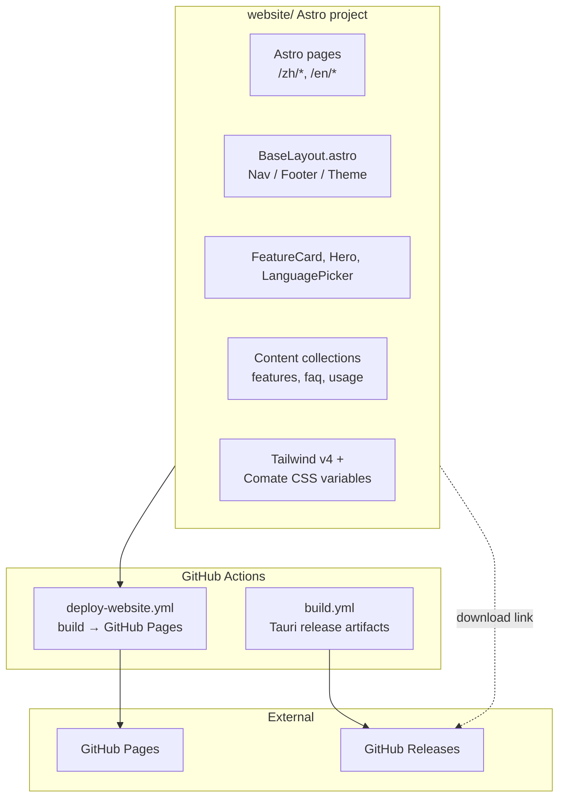

# Comate Website - Plan

## Goal Capsule

- **Objective:** Build a public marketing website for Comate that introduces the product, explains its features and usage, and guides potential users to download it.
- **Product authority:** The website content should accurately reflect Comate's existing architecture and capabilities as described in `README.md` and `CLAUDE.md`.
- **Execution profile:** Software implementation — new static website delivered alongside the existing desktop application repo.
- **Stop condition:** The site builds to static files, deploys successfully to GitHub Pages, and supports Chinese and English content.
- **Tail ownership:** Content updates and release-link freshness are owned by the Comate maintainers.

## Product Contract

*Product Contract preserved from the requirements-only brainstorm; no product-scope changes were made during planning.*

### Summary

Create a multi-page marketing website for Comate using Astro as the static site generator, hosted on GitHub Pages, with Chinese and English language support. The site will follow the visual style of the Comate desktop application, present core features and usage guidance, and link update records to GitHub Releases rather than maintaining a separate changelog page.

### Problem Frame

Comate currently ships as a desktop application with rich in-app functionality but no dedicated public landing surface. Potential users discover the project through the repository or word of mouth and must infer value from README alone. A focused marketing site gives them a clear, browsable introduction, feature overview, and a single path to download or try the app, while reducing the support burden of repeating "what is Comate and how do I start?"

### Requirements

#### Site Structure & Content

R1. A home page introduces Comate's value proposition and primary call-to-action to download or try the app.
R2. A features page presents Comate's key capabilities with concise descriptions and supporting visuals or screenshots.
R3. A usage / getting-started page explains how to install and begin using Comate.
R4. A download page or prominent CTA links to the official release artifact on GitHub Releases.
R5. Update records link directly to GitHub Releases instead of being maintained as a dedicated page on the site.
R6. An about or FAQ page addresses common questions about Comate's purpose, platform support, and licensing.

#### Design & Branding

R7. The site's visual design reuses Comate's existing color palette, typography, and component feel, drawing from the desktop client's theme definitions.
R8. The site supports both light and dark mode, defaulting to the user's system preference.
R9. The layout is responsive and readable on desktop, tablet, and mobile viewports.

#### Internationalization

R10. The site supports Chinese (zh-CN) and English (en) content.
R11. The default language is Chinese, with a visible language switcher on every page.
R12. Each localized page has a stable URL path, using a language prefix such as `/zh/` and `/en/`.

#### Build & Deployment

R13. The site is built with Astro as the static site generator.
R14. The static build output is configured for GitHub Pages deployment under the repository's default project subpath.
R15. The build produces clean, shareable URLs without requiring a server-side runtime.
R16. The site build is reproducible locally and can be triggered from a CI workflow on push to the main branch.

#### Maintenance & Quality

R17. Site content can be updated by editing Markdown or MDX files without touching page components.
R18. The site build fails visibly if required frontmatter or i18n content is missing.
R19. Links to GitHub Releases are verified or updated as part of the release process.

### Key Decisions

- **Astro for the static site generator.** Astro is purpose-built for content-driven, multi-page marketing sites, produces clean static output for GitHub Pages, and allows interactive components to be implemented as Astro islands; design tokens and color variables are ported from the desktop client.
- **Host on GitHub Pages.** The project already lives on GitHub, so GitHub Pages provides zero-cost hosting with a deployment path the team controls. A custom domain can be added later without structural changes.
- **Link update records to GitHub Releases.** Maintaining a separate changelog page on the site would duplicate the existing release process and risk going stale. Linking to GitHub Releases keeps the source of truth single and current.
- **Reuse the desktop app's visual style.** Brand consistency between the website and the application reinforces that Comate is a polished, cohesive product, even if it means the site leans darker and more utilitarian than a typical SaaS landing page.
- **Chinese as the default language.** The project has first-class Chinese localization in the desktop client and the primary audience for the initial site is Chinese-speaking users; English is available for broader reach.

### Scope Boundaries

#### Deferred for later

- Blog or release-notes section hosted on the site.
- Interactive in-browser demo of Comate.
- Custom domain configuration.
- Search functionality across site content.
- Newsletter or wait-list signup.

#### Outside this product's identity

- User accounts, authentication, or personalized content.
- E-commerce, paid plans, or license management.
- A separate documentation knowledge base beyond the usage page.

### Dependencies / Assumptions

- GitHub Pages is enabled for the repository.
- The repository already publishes releases to GitHub Releases.
- The desktop client's theme tokens in `src/client/hooks/use-theme.ts` and related files can be translated into website CSS variables.
- Screenshots or product imagery for the features page can be captured from the running Comate application.

### Outstanding Questions

All previously deferred planning questions are now resolved as Key Technical Decisions in the Planning Contract below.

---

## Planning Contract

### Key Technical Decisions

- **Site source lives in a top-level `website/` directory.**
  - *Chosen:* A standalone Astro project under `website/` keeps its own `node_modules`, lockfile, and build lifecycle, avoiding coupling with the Vite/Tauri client and the `wecom-cli` workspace.
  - *Rejected:* `packages/website` would let root `npm install` cover the site, but would entangle Astro/Vite/Tauri tooling, slow the desktop CI, and force workspace-level dependency reconciliation (especially Tailwind v4 vs. v3).
  - *Deferred:* A separate repository is overkill while the site is maintained by the same team.

- **Use Astro's built-in i18n routing with explicit locale folders and `/zh/`, `/en/` URL prefixes.**
  - *Chosen:* Astro's built-in `i18n` with `prefixDefaultLocale: true` gives stable, predictable URLs and provides `getRelativeLocaleUrl`/redirect helpers automatically. Pages are placed in `src/pages/` for the default Chinese locale and `src/pages/en/` for English. The locale mapping is configured as `{ path: 'zh', codes: ['zh-CN'] }` so URLs use `/zh/` while content and UI strings keep the `zh-CN` tag.
  - *Rejected:* Manual locale folders would require writing locale-link helpers from scratch and are error-prone. Dynamic `[lang]` routes would reduce duplication but move routing logic into components and obscure the built-in i18n fallback behavior.
  - *Tradeoff:* URL slugs are shortened to `/zh/` even though the app uses the `zh-CN` locale tag; the content locale code remains `zh-CN` and the mapping `zh` (URL) → `zh-CN` (content) is recorded in `src/i18n/utils.ts`.

- **Download CTA links to the GitHub Releases listing page.**
  - *Chosen:* The Releases listing is stable, requires no client-side user-agent detection, and satisfies R4/R5.
  - *Rejected/deferred:* Deeplinking via `/releases/latest/download/...` is one click shorter but breaks if asset names change; platform detection adds complexity and can be wrong inside corporate proxies or under ARM translation. Platform-specific deeplinking is deferred until release asset names are stable.

- **Features and FAQ content use Astro Content Collections with Zod schemas.**
  - *Chosen:* Content Collections give typed frontmatter, enforce completeness at build time, and let non-developers edit MDX, satisfying R17 and making R18 enforceable.
  - *Rejected:* Hard-coded copy in `.astro` files is fastest to implement but violates R17; plain JSON/YAML works but is less maintainable for long-form content.

- **Website uses Tailwind CSS v4 with the official Vite plugin.**
  - *Chosen:* Tailwind v4 is Astro v7's recommended path and uses CSS-first configuration (`@theme`, `@import "tailwindcss"`).
  - *Rejected:* Tailwind v3 would align with the existing `tailwind.config.js` and team expertise, but relies on `@astrojs/tailwind`, which Astro is deprecating for v7. Using v3 would also require a separate PostCSS setup.
  - *Consequence/risk:* Color tokens must be ported from `src/client/index.css` and `tailwind.config.js` to v4 `@theme` syntax, creating a second source of truth. For the initial release, tokens are copied manually; a shared `@comate/theme` package can be extracted later if the site grows. The implementation must use `@tailwindcss/vite@4.x`, not `@astrojs/tailwind`.

- **Theme follows the app: dark class strategy with system-preference default and a dedicated storage key.**
  - *Chosen:* An inline `<script>` in `BaseLayout.astro` sets the `dark` class before first paint, mirroring the desktop client's class-based strategy and preventing a flash of unstyled theme. The website uses its own `comate-website-theme` localStorage key so marketing-site preferences do not affect the desktop app.
  - *Rejected:* A React island would hydrate after paint and flash; a `data-theme` attribute would require rewriting Tailwind configuration.

- **GitHub Pages deployment uses project-subpath configuration.**
  - *Chosen:* `site: 'https://ai-dvps.github.io'`, `base: '/comate'`, `trailingSlash: 'always'`, and committing `.nojekyll` to `website/public/` so Jekyll does not suppress the `_astro` asset directory.
  - *Implication:* All internal links, images, and the FOUC script must respect the configured `base`; otherwise the deployed site will 404 for CSS/JS.

- **Website quality gates run in a dedicated CI job rather than through the root workspace.**
  - *Chosen:* Because `website/` is outside `packages/*`, root `npm install` and root `npm run lint` will not cover the site. A separate workflow job runs `cd website && npm install && npm run check && npm run build && npm run test`.
  - *Implication:* Website lint/format rules and test configuration live inside `website/`; the root CI is extended only by the dedicated workflow.

### High-Level Technical Design

The marketing site is a standalone Astro static project under `website/`. It is not part of the npm workspace, so it builds and deploys independently of the desktop client.



Page routing is file-based and locale-prefixed via Astro i18n. Shared UI (Nav, Footer, LanguagePicker) reads the current locale from `Astro.currentLocale` and generates localized links with `getRelativeLocaleUrl`. Content collections live under `src/content/<section>/<locale>/` and are queried by page components. The BaseLayout injects the theme class before paint and loads the global Tailwind stylesheet.

### Output Structure

```text
website/
├── astro.config.mjs
├── package.json
├── tsconfig.json
├── .gitignore
├── README.md
├── public/
│   ├── favicon.svg
│   └── images/
│       └── features/           # screenshots / illustrations
├── src/
│   ├── components/
│   │   ├── Nav.astro
│   │   ├── Footer.astro
│   │   ├── LanguagePicker.astro
│   │   ├── ThemeToggle.astro
│   │   ├── Hero.astro
│   │   └── FeatureCard.astro
│   ├── content/
│   │   ├── config.ts           # collection schemas
│   │   ├── features/
│   │   │   ├── zh-CN/
│   │   │   │   ├── chat.mdx
│   │   │   │   ├── workspaces.mdx
│   │   │   │   └── ...
│   │   │   └── en/
│   │   │       ├── chat.mdx
│   │   │       └── ...
│   │   ├── faq/
│   │   │   ├── zh-CN/
│   │   │   │   └── ...
│   │   │   └── en/
│   │   │       └── ...
│   │   └── home/
│   │       ├── zh-CN/
│   │       │   └── hero.mdx
│   │       └── en/
│   │           └── hero.mdx
│   ├── i18n/
│   │   ├── ui.ts               # UI strings + typed helper
│   │   ├── utils.ts            # pure locale helpers
│   │   └── utils.test.ts       # unit tests for helpers
│   ├── layouts/
│   │   └── BaseLayout.astro
│   ├── lib/
│   │   └── cn.ts               # class-merge utility (port of app helper)
│   ├── pages/
│   │   ├── index.astro         # /zh/ home (default locale)
│   │   ├── features.astro
│   │   ├── usage.astro
│   │   ├── download.astro
│   │   ├── about.astro
│   │   └── en/
│   │       ├── index.astro
│   │       ├── features.astro
│   │       ├── usage.astro
│   │       ├── download.astro
│   │       └── about.astro
│   ├── styles/
│   │   └── global.css
│   └── tests/
│       └── e2e/
│           ├── smoke.spec.ts   # route rendering smoke tests
│           └── links.spec.ts   # internal link / asset checks
```

### Risks & Dependencies

- **Tailwind v4 API churn and token drift.** Tailwind v4 uses CSS-based configuration (`@theme`, `@import "tailwindcss"`). The implementer must port the existing `tailwind.config.js` color map to v4 theme syntax. Risk is low but requires reading current v4 docs. Because the desktop app stays on Tailwind v3, the website tokens are copied manually for the initial release, creating a second source of truth; a shared theme package should be considered if the site grows.
- **No marketing screenshots exist.** The features page depends on product imagery that must be captured from a running Comate instance. If screenshots are unavailable, the first version can use icon-based cards and defer imagery to a follow-up.
- **GitHub Pages subpath behavior.** With `base: '/comate'`, all internal links and asset references must use Astro's `base` helpers. A misconfiguration will cause 404s for CSS/JS on the deployed site.
- **Root workspace isolation.** Because `website/` is not under `packages/*`, root `npm install` will not install website dependencies. The CI workflow and local dev instructions must explicitly run `npm install` inside `website/`. Website linting and formatting also live inside `website/` rather than inheriting the root config.
- **URL/content locale mismatch.** The website exposes `/zh/` URLs while the app uses the `zh-CN` locale tag. Any future sharing of translation files or analytics must map between the two.
- **GitHub Pages must be enabled.** The deployment workflow only works if repository Pages are configured to use GitHub Actions. Until an owner enables Pages, the workflow will report a deployment error.
- **Draft releases are invisible to non-collaborators.** The existing Tauri release workflow creates draft releases. If the Download CTA points to GitHub Releases while the latest release is still a draft, anonymous visitors will not see it. The release process should publish releases (or remove `draft: true`) before publicizing the site, or the Download page should explain how to build from source when no public release is available.

### Sources & Research

- **Astro v7 docs:** GitHub Pages deployment guide, i18n routing guide, Content Collections guide, Tailwind styling guide. The official action `withastro/action@v6` is the recommended deployment path.
- **Repository research:** No existing website or static-site setup exists. The desktop client uses Tailwind v3 with custom HSL color variables in `src/client/index.css` and a color map in `tailwind.config.js`. i18n uses `i18next` with `en` and `zh-CN`. Brand assets are in `src-tauri/icons/`.
- **Institutional learnings:** `docs/solutions/` contains no prior learnings about static sites, GitHub Pages, or marketing-site i18n; this work should be captured as a learning after it lands if any non-obvious pitfalls surface.

---

## Implementation Units

### U1. Scaffold the Astro project in `website/`

- **Goal:** Create a standalone Astro v7 static project with TypeScript, build scripts, and GitHub Pages configuration.
- **Requirements:** R13, R14, R15, R16
- **Dependencies:** None
- **Files:**
  - `website/package.json`
  - `website/astro.config.mjs`
  - `website/tsconfig.json`
  - `website/.gitignore`
  - `website/README.md`
- **Approach:** Initialize Astro with the static template. Configure `site: 'https://ai-dvps.github.io'`, `base: '/comate'`, `trailingSlash: 'always'`, and `i18n` with `prefixDefaultLocale: true` and the locale mapping `{ path: 'zh', codes: ['zh-CN'] }`. Add `@astrojs/sitemap` and `@astrojs/mdx`. Define package scripts: `dev`, `build`, `check` (runs `astro check`), `test`, and `test:e2e`. Commit `.nojekyll` to `website/public/` so Jekyll does not suppress the `_astro` asset directory. Add `website/` to the root `.eslintrc.cjs` `ignorePatterns` so the root React/Vite linter does not recurse into Astro files.
- **Patterns to follow:** Astro official GitHub Pages deployment guide.
- **Test scenarios:**
  - `cd website && npm install && npm run build` exits 0.
  - `cd website && npm run check` exits 0 with no TypeScript/template errors.
  - `website/dist/zh/index.html` exists and a root `dist/index.html` (if present) redirects to `/zh/`.
  - `website/dist/.nojekyll` exists so Jekyll does not suppress `_astro` assets.
- **Verification:** Local build succeeds and `npm run preview` serves the site.

### U2. Port Comate design tokens and global styles

- **Goal:** Make the website visually consistent with the desktop app by porting color tokens and global styles.
- **Requirements:** R7
- **Dependencies:** U1
- **Files:**
  - `website/src/styles/global.css`
  - `website/src/lib/cn.ts`
- **Approach:** Copy the CSS variable definitions from `src/client/index.css` into `global.css`. Map the existing `tailwind.config.js` color aliases to Tailwind v4 `@theme` entries (e.g., `bg`, `surface`, `accent`, `text-primary`). Add a small `cn()` class-merge utility mirroring `src/client/components/ui/utils.ts` so components use the same composition pattern as the app. Define accessible defaults: WCAG 2.1 AA contrast, visible `focus-visible` outlines using the accent color, hover/active states for links and buttons, and `prefers-reduced-motion` support for any motion.
- **Patterns to follow:** App theme in `src/client/hooks/use-theme.ts`, color mapping in `tailwind.config.js`, and `cn()` utility in `src/client/components/ui/utils.ts`.
- **Test scenarios:**
  - Light mode shows warm off-white background (`--color-bg: 40 20% 96%`) and dark text.
  - Dark mode shows near-black background (`--color-bg: 0 0% 5%`) and light text.
  - Tailwind utility classes (`bg-bg`, `text-text-primary`, `bg-accent`) resolve to the ported CSS variables.
- **Verification:** Visual check of a test page in both themes.

### U3. Add theme toggle and FOUC prevention

- **Goal:** Support light/dark mode switching with no flash of wrong theme on load.
- **Requirements:** R8
- **Dependencies:** U2
- **Files:**
  - `website/src/layouts/BaseLayout.astro`
  - `website/src/components/ThemeToggle.astro`
- **Approach:** Add an inline head script in `BaseLayout.astro` that reads `localStorage.getItem('comate-website-theme')` or `prefers-color-scheme` and sets the `dark` class before first paint. Render a client-only theme toggle (Astro island or vanilla script) that updates the class and persists to the `comate-website-theme` key. Use a website-specific storage key so marketing-site preferences do not affect the desktop app.
- **Patterns to follow:** App theme in `src/client/hooks/use-theme.ts`.
- **Test scenarios:**
  - Refreshing the page in either theme does not show a flash of the opposite theme.
  - The theme toggle updates the class and persists to `comate-website-theme`.
  - Toggling the marketing site does not write to the app's theme storage key.
- **Verification:** Visual check and localStorage inspection in both themes.

### U4. Implement i18n routing and shared shell

- **Goal:** Provide bilingual Chinese/English navigation and a page shell used across every page.
- **Requirements:** R10, R11, R12
- **Dependencies:** U1, U2, U3
- **Files:**
  - `website/src/i18n/ui.ts`
  - `website/src/i18n/utils.ts`
  - `website/src/i18n/utils.test.ts`
  - `website/src/components/Nav.astro`
  - `website/src/components/Footer.astro`
  - `website/src/components/LanguagePicker.astro`
  - `website/src/components/MobileNav.astro`
  - `website/src/pages/404.astro`
  - `website/src/pages/en/404.astro`
- **Approach:** Use Astro's built-in i18n with locales configured as `{ path: 'zh', codes: ['zh-CN'] }` and `'en'`, `defaultLocale: 'zh-CN'`, and `prefixDefaultLocale: true`. Build a typed `useTranslations(lang)` helper for UI strings that falls back to the default locale when a key is missing. Keep `utils.ts` as pure functions (no Astro global dependency) so it can be unit-tested with the repo's existing test tooling. Generate all internal links with `getRelativeLocaleUrl`. The language picker strips the current locale prefix and rebuilds the path for the target locale. The header nav shows Home, Features, Usage, Download, and About in that order; the footer repeats those links plus a GitHub repository link and license note. On narrow viewports the nav collapses into a hamburger button (minimum 44×44dp touch target) that toggles a vertical panel containing nav links and the language picker. The theme toggle lives in the header on desktop and inside the mobile panel on narrow viewports. Add a localized 404 page and ensure a request to the root `/` path redirects to `/zh/`.
- **Patterns to follow:** App i18n structure in `src/client/i18n/`.
- **Test scenarios:**
  - `/zh/` renders the Chinese home page; `/en/` renders the English home page.
  - A request to `/` redirects to `/zh/`.
  - `/zh/unknown-page` renders the localized 404 page.
  - Nav links on `/zh/features` point to `/zh/usage`, `/zh/download`, etc.
  - Language switcher on `/zh/features` links to `/en/features`, not `/en/`.
  - Missing translation key falls back to the default locale string.
  - Unit tests for `utils.ts` pass with `npm run test` inside `website/`.
- **Verification:** Manual navigation through all pages in both locales; unit tests green.

### U5. Build the Home and Download pages

- **Goal:** Introduce Comate and guide visitors to download the app.
- **Requirements:** R1, R4, R5
- **Dependencies:** U2, U3, U4
- **Files:**
  - `website/src/pages/index.astro`
  - `website/src/pages/en/index.astro`
  - `website/src/content/home/zh-CN/hero.mdx`
  - `website/src/content/home/en/hero.mdx`
  - `website/src/pages/download.astro`
  - `website/src/pages/en/download.astro`
- **Approach:** Create localized MDX content for the hero section (tagline, description, primary CTA) with frontmatter fields for `title`, `description`, and optional `og:image`. The Home page imports and renders the hero content plus feature highlights. `BaseLayout.astro` consumes page-level `title` and `description` props to render `<title>`, `<meta name="description">`, and Open Graph tags for each localized page. The Download page explains the install options and links to the GitHub Releases listing.
- **Patterns to follow:** README feature categories and installation notes.
- **Test scenarios:**
  - Home page renders the tagline "Your friendly AI workspace companion" or its Chinese equivalent.
  - Primary CTA links to `/zh/download` or `/en/download`.
  - Download page links to `https://github.com/ai-dvps/comate/releases`.
  - Both pages render correctly in `/zh/` and `/en/`.
- **Verification:** Home and download pages are accessible and visually match the design system.

### U6. Build the Features page

- **Goal:** Present Comate's key capabilities with descriptions and supporting visuals.
- **Requirements:** R2
- **Dependencies:** U2, U3, U4
- **Files:**
  - `website/src/pages/features.astro`
  - `website/src/pages/en/features.astro`
  - `website/src/content/features/zh-CN/*.mdx`
  - `website/src/content/features/en/*.mdx`
  - `website/src/components/FeatureCard.astro`
- **Approach:** Define a `features` content collection with a Zod schema requiring `title`, `description`, and optional `icon` and `image`. Group features by category (e.g., Workspaces, Chat, File Explorer, WeCom Bot, Task Tracking). The page queries the collection for the current locale via a `getLocalizedCollection('features', locale)` helper in `src/i18n/utils.ts` that returns default-locale entries when a translation is missing; this keeps fallback behavior consistent and testable. Render features in a responsive grid (1 column on mobile, 2 on tablet, 3 on desktop). When a feature references an image that is missing or not yet captured, render an icon placeholder so the card does not collapse or show a broken image box.
- **Patterns to follow:** README feature sections and content collection schema patterns from Astro v7 docs.
- **Test scenarios:**
  - Features page lists at least the categories present in `README.md`.
  - Each feature card displays title, description, and optional image.
  - Removing a required frontmatter field causes `astro build` to fail with a clear error (R18).
  - Fallback to default locale when a feature has no translation.
  - Missing or invalid image path renders the icon placeholder without layout breakage.
- **Verification:** `/zh/features` and `/en/features` render all content without build errors.

### U7. Build the Usage and About/FAQ pages

- **Goal:** Explain how to install and start using Comate, and answer common questions.
- **Requirements:** R3, R6
- **Dependencies:** U2, U3, U4
- **Files:**
  - `website/src/pages/usage.astro`
  - `website/src/pages/en/usage.astro`
  - `website/src/pages/about.astro`
  - `website/src/pages/en/about.astro`
  - `website/src/content/usage/zh-CN/*.mdx`
  - `website/src/content/usage/en/*.mdx`
  - `website/src/content/faq/zh-CN/*.mdx`
  - `website/src/content/faq/en/*.mdx`
- **Approach:** Usage page walks through download, install, and first workspace setup based on `README.md`. The About page explains Comate's purpose, target audience, and licensing; FAQ answers common operational questions such as platform support (macOS 13+, Windows 10+), how update records link to GitHub Releases, and how to report issues. Keeping About and FAQ as separate pages lets the About page tell the product story while FAQ remains scannable Q&A; both are linked from the nav and footer.
- **Patterns to follow:** README installation steps and system requirements.
- **Test scenarios:**
  - Usage page includes download, install, and first-run instructions.
  - About page includes project purpose and license information.
  - FAQ includes macOS/Windows requirements, update-record links, and issue reporting.
  - Both pages are available in `/zh/` and `/en/`.
- **Verification:** Content renders and internal links are valid.

### U8. Add build verification and GitHub Pages deployment

- **Goal:** Deploy the site automatically on pushes to main and catch build regressions in CI.
- **Requirements:** R16, R18
- **Dependencies:** U1–U7
- **Files:**
  - `.github/workflows/deploy-website.yml`
  - `website/package.json` scripts
  - `website/tests/e2e/smoke.spec.ts`
  - `website/tests/e2e/links.spec.ts`
- **Approach:** Create a dedicated workflow that checks out the repo, sets up Node.js 22 (Astro 7 requires Node >=22.12.0), installs dependencies inside `website/`, runs `astro check`, runs `astro build`, runs `npm run test` (unit tests), runs `npm run test:e2e` against the built `dist/` (or a Node-based link-check script if Playwright setup is deferred), and deploys to GitHub Pages using `withastro/action@v6` and `actions/deploy-pages@v5`. Configure repository Pages source to GitHub Actions. Trigger the workflow on pushes to `main` that touch `website/**` or the workflow file; app changes should not trigger website deploys.
- **Patterns to follow:** Astro GitHub Pages deployment guide and existing `.github/workflows/build.yml` for naming conventions.
- **Test scenarios:**
  - Workflow triggers on push to `main` that touches `website/**`.
  - Workflow fails if `astro check` or `astro build` fails (e.g., invalid frontmatter).
  - E2E smoke tests verify `/zh/`, `/en/`, `/zh/features`, `/en/features`, etc. render.
  - E2E link tests verify no 404s on internal links or asset paths.
  - Workflow deploys successfully and the site is reachable at `https://ai-dvps.github.io/comate/`.
- **Verification:** After merging, the live URL returns the Chinese home page.

### U9. Capture and integrate product imagery

- **Goal:** Provide visual assets for the Home, Features, Usage, and Download pages.
- **Requirements:** R2
- **Dependencies:** U1, U6
- **Files:**
  - `website/public/images/features/*.png` or `*.webp`
- **Approach:** Capture screenshots from a running Comate application for key features (workspace, chat, file explorer, WeCom bot, tasks). Optimize images (WebP preferred, max width ~1200px). Add alt text in both languages via frontmatter. Pages may ship with icon-based placeholders if imagery is delayed; U5, U6, and U7 should not be blocked waiting for screenshots.
- **Patterns to follow:** Optimize images for web; use `loading="lazy"` for below-the-fold images.
- **Test scenarios:**
  - Feature cards with images display correctly.
  - Images have localized `alt` text.
  - Missing image does not break the page layout.
  - Image file paths respect the configured GitHub Pages `base` path.
- **Verification:** Features page renders with images on both locales.

---

## Verification Contract

### Pre-merge gates

- **Type/template gate:** `cd website && npm run check` exits 0 before any PR is merged.
- **Local build gate:** `cd website && npm install && npm run build` exits 0 before any PR is merged.
- **Unit test gate:** `cd website && npm run test` exits 0.
- **E2E smoke gate:** `cd website && npm run test:e2e` verifies `/zh/`, `/en/`, `/zh/features`, `/en/features`, `/zh/download`, `/en/download`, `/zh/usage`, `/en/usage`, `/zh/about`, `/en/about` render.
- **Link gate:** E2E link tests confirm no 404s on internal links or asset paths; download CTA points to the GitHub Releases listing.
- **i18n gate:** Verify language switcher preserves the current page path for every page.
- **Theme gate:** Verify light/dark mode and no flash of wrong theme on hard refresh.
- **Visual regression gate:** `cd website && npm run preview` and manual smoke test of the pages above.

### Post-merge gate

- **Deployment gate:** GitHub Actions `deploy-website.yml` triggers on relevant pushes to `main` and the live GitHub Pages URL (`https://ai-dvps.github.io/comate/`) serves the Chinese home page.

---

## Definition of Done

- U1–U9 are implemented and verified.
- The site is live on GitHub Pages at the configured project subpath.
- Chinese (`/zh/`) and English (`/en/`) versions of Home, Features, Usage, Download, and About are accessible.
- The site reuses Comate's color palette and supports light/dark mode.
- The GitHub Pages deployment workflow triggers on pushes to `main` that touch `website/**` or its workflow file, and runs successfully.
- Any experimental or abandoned directory structures, sample content, or unused assets from the implementation process are removed.
- The plan file reflects the final state of the work; no unresolved blocking questions remain.
