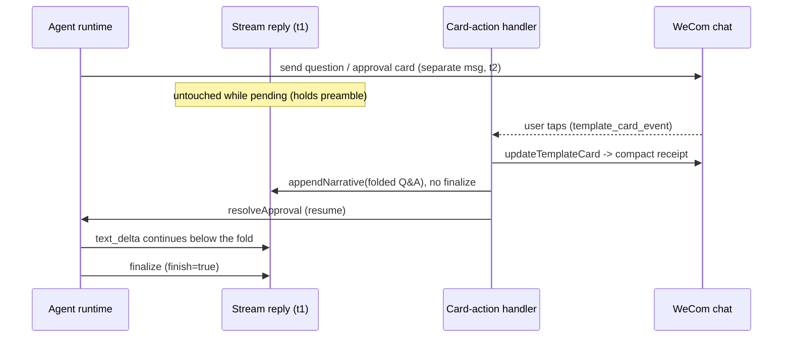

# WeCom Card/Stream Timeline - Plan

## Goal Capsule

- **Objective:** Eliminate the WeCom timeline reversal where the post-card answer streams into the bubble above the question or permission card, so the original streaming reply reads top-to-bottom as a resolved question → choice → answer narrative.
- **Product authority:** WeCom bot message-rendering behavior, spanning the streaming reply and the card-action resolution path.
- **Open blockers:** None. Wording, truncation, and multi-card formatting were resolved during planning; only small tunables remain, deferred to implementation.

---

## Product Contract

### Summary

On WeCom, keep the answer streaming in the original reply and demote the question or permission card to a resolved receipt. While a card is pending, only the card is shown and the streaming reply is left untouched; when the user taps, the card flips to a compact terminal state, the resolved Q&A is written into the streaming reply in one shot, and the answer continues streaming into the same bubble. The streaming reply becomes a self-contained, top-to-bottom record; the card below is a closed interaction receipt.

### Problem Frame

The WeCom bot has one passive streaming reply per inbound user message and sends question and permission cards as separate messages. When the agent asks a question or requests permission mid-turn, the card appears below the streaming bubble, the user answers, and the agent resumes — but the resumed text keeps streaming into the bubble above the card, so the answer lands above the question it answers and the timeline reads backward. When a turn runs past nine minutes, the passive stream is closed and the final result arrives as yet another separate message below the card, which is ordered but inconsistent with the non-timeout case. The WeCom bot SDK offers no way to delete or edit an already-sent message or card outside the tap response, so the card cannot be removed after the fact; the fix has to work within a single accumulating stream plus a card that flips to a terminal state at tap time.

### Key Decisions

- **Single-narrative stream over cut-and-continue or text-only.** Keep streaming and button interactions and accept a compact resolved-card receipt below the stream, rather than closing the stream at card time (which would stop the post-card answer from streaming) or replacing buttons with typed replies (which weakens permission confirmations).
- **Card as receipt, not landing spot.** Because WeCom cannot delete or edit a sent card outside the tap response, the card stays as a small terminal receipt ("已回答 / 已允许 / 已拒绝"); the streaming reply carries the narrative.
- **Echo only at resolution.** Nothing about a question or permission is written into the stream while it is pending; the resolved Q&A is appended in one shot when the user taps. The stream never shows a dangling unanswered question, and the rule is uniform: the stream records only resolved interactions.
- **Question-only for AskUserQuestion; tool+outcome for permissions.** For AskUserQuestion the stream records the question prompt and the chosen option label(s), never the full option list (the buttons stay on the card). For permissions the stream records the tool name and the outcome, not the command arguments, so long or sensitive parameters are not duplicated into the persistent bubble.

### Key Flows

- F1. AskUserQuestion, answered (common case)
  - **Trigger:** Agent emits a question mid-turn.
  - **Steps:** A question card is sent as a separate message; the streaming bubble keeps whatever preamble it had and is otherwise left untouched. The user taps an option. The card flips to "✅ 已回答". The stream appends one block with the question text and the chosen option label. The agent's answer continues streaming into the same bubble below that block.
  - **Outcome:** Reading the streaming bubble top-to-bottom reconstructs preamble → question → chosen answer → agent answer; the card below reads as a closed receipt.
  - **Covers R1, R2, R5, R6.**

- F2. Permission request, allowed or denied
  - **Trigger:** Agent requests tool approval mid-turn.
  - **Steps:** An approval card is sent; the stream is left untouched while pending. The user taps Allow / Deny / Always allow. The card flips to the matching terminal state. The stream appends one line naming the tool and the outcome, with no arguments. The turn continues streaming into the same bubble.
  - **Outcome:** The stream records that a tool was approved or denied and which tool, without repeating the command.
  - **Covers R1, R3, R5, R6.**

- F3. Card abandoned (user never taps)
  - **Trigger:** A question or approval card is shown and the user does not respond.
  - **Steps:** The stream holds its preamble and nothing about the pending interaction. No dangling question line is appended.
  - **Outcome:** The bubble reads as a paused turn with no orphan question; the card remains below as an open receipt until it expires or is resolved.
  - **Covers R4, R6.**

- F4. Post-answer turn exceeds nine minutes (existing behavior, unchanged)
  - **Trigger:** After the user answers, the agent keeps running past the passive-stream limit.
  - **Steps:** The passive stream closes at the safeguard; the remainder of the answer is delivered as proactive messages, exactly as today.
  - **Outcome:** Order stays correct because proactive messages land below the card; this pre-existing fallback is not modified.
  - **Covers R7.**

### Requirements

**Narrative folding (into the streaming reply)**

- R1. While a question or permission card is pending, the streaming reply MUST NOT be modified to reference it; the card is shown on its own and the stream holds its current content.
- R2. On AskUserQuestion resolution, the streaming reply MUST append a single block containing the question prompt text and the label(s) of the chosen option(s); the full option list MUST NOT be appended.
- R3. On permission resolution, the streaming reply MUST append a single line containing the tool name and the outcome (allowed / denied / always-allowed); the tool's arguments or command MUST NOT be appended.
- R4. If a card is abandoned or expires without a tap, the streaming reply MUST NOT contain any question or permission line for that interaction.

**Card receipt behavior**

- R5. When the user taps, the card MUST transition to a compact terminal state reflecting the outcome (answered / allowed / denied / always-allowed), consistent with the existing terminal-state behavior; the card is not deleted.
- R6. After resolution, the agent's continuation MUST stream into the same streaming bubble below the appended Q&A block, so the bubble reads preamble → resolved interaction → answer in top-to-bottom order.

**Scope constraints**

- R7. The nine-minute passive-stream safeguard and its proactive-message fallback MUST remain unchanged.
- R8. The change applies to WeCom only; Feishu and the web UI rendering MUST NOT be altered.

### Acceptance Examples

- AE1. Single question, answered
  - **Given** a streaming bubble with a preamble and one AskUserQuestion card.
  - **When** the user selects an option.
  - **Then** the bubble ends as "preamble → ❓question / ↳ 你的选择：label → streamed answer" and the card shows the answered terminal state.
  - **Covers R1, R2, R5, R6.**

- AE2. Multi-question, answered
  - **Given** an AskUserQuestion with several questions, some multi-select.
  - **When** the user submits.
  - **Then** the bubble appends each question prompt with its selected label(s) in order and never lists unselected options.
  - **Covers R2.**

- AE3. Permission allowed with long arguments
  - **Given** an approval for a tool whose arguments are long or sensitive.
  - **When** the user allows.
  - **Then** the bubble shows "🔐 tool → 已允许" and does not reproduce the arguments; the card retains the full request as the terminal receipt.
  - **Covers R3, R5.**

- AE4. Permission denied
  - **Given** an approval card.
  - **When** the user denies.
  - **Then** the bubble shows "🔐 tool → 已拒绝" and the agent's continuation streams below it.
  - **Covers R3, R6.**

- AE5. Card never answered
  - **Given** a question card the user ignores.
  - **When** the turn stays pending or the card expires.
  - **Then** the streaming bubble contains no line for that question.
  - **Covers R4.**

- AE6. Long post-answer turn
  - **Given** a resolved card followed by an answer exceeding nine minutes.
  - **When** the safeguard fires.
  - **Then** the remaining answer arrives as proactive messages below the card, identical to current behavior.
  - **Covers R7.**

### Success Criteria

- A reader scanning a finished WeCom turn top-to-bottom can reconstruct the question asked, the user's choice, and the agent's answer from the streaming bubble alone, without reading the card.
- No finished turn shows the agent's answer above the question or permission it responds to.
- The streaming experience for turns without a question or permission is unchanged.

### Scope Boundaries

- **Deferred for later:** Fold free-text (reply-in-chat) questions into the stream. Excluded for now: when a question has no options, the existing `text_notice` "reply in chat" fallback stays as-is, and its answer arrives as a separate user turn; folding that back is a larger, separate change.
- **Outside this work:** Deleting or editing WeCom cards after send outside the tap response (unsupported by the WeCom bot SDK); replacing button cards with typed text Q&A; changing the nine-minute safeguard or proactive fallback; Feishu behavior; web UI rendering.

### Dependencies / Assumptions

- The WeCom bot SDK exposes no delete, recall, or edit for sent messages; the card can be updated only once, in the tap response (used to render the terminal receipt). The design relies only on streaming into the passive reply and flipping the tapped card to a terminal state.
- Each inbound user message yields exactly one passive streaming reply; the appended Q&A and the continued answer share that single stream, so appends are not overwritten by the final result.
- The card-action resolution path can reach the active streaming reply for the session to append the resolved Q&A; an active-stream registry keyed by session already exists in the WeCom bot service.

### Outstanding Questions

Resolved during planning — wording/markers (KTD3) and truncation / multi-card ordering (KTD4). Only small tunables remain; see plan-level Open Questions (Deferred to Implementation).

### Sources / Research

- WeCom streaming reply, single-buffer accumulation, and the nine-minute safeguard to proactive fallback: `src/server/services/wecom-stream-reply.ts`.
- Card terminal-state transitions at tap time and the card-action resolution path, including the `activeStreamReplies` registry: `src/server/services/wecom-bot-service.ts`.
- Card builders, key encoding, event parsing, and the existing terminal-state card: `src/server/services/wecom-template-card.ts`.
- WeCom bot SDK surface used here (`sendMessage` / `replyStream` / `replyStreamNonBlocking` / `updateTemplateCard` in the tap response; no recall, delete, or later edit): `node_modules/@wecom/aibot-node-sdk`.
- Prior streaming behavior and rationale: `docs/plans/2026-05-22-009-feat-wecom-streaming-response-plan.md`.
- Feishu contrast (in-place card updates via cardkit; out of scope): `src/server/services/feishu-card-stream.ts`.

---

## Planning Contract

**Product Contract preservation:** changed — Scope Boundaries (free-text folding moved to "Deferred for later", confirmed during planning) and Outstanding Questions (resolved into KTD3/KTD4). Requirements, Flows, Acceptance Examples, and all R/F/AE IDs are unchanged.

### Key Technical Decisions

- **KTD1. Append-without-finalize is a new stream capability.** The existing `interrupt` appends and closes the stream, and WeCom cannot reopen a passive reply, so folding needs an append that does not finalize. Directional: mirror `interrupt` (clear the active placeholder, ensure a single blank-line separator, append to the same buffer, flush) but leave the stream open and collecting unchanged; return a no-op/false when the stream is already finalized or the nine-minute safeguard has closed it (the fold is then skipped, consistent with R4/R7).
- **KTD2. Fold at card resolution, before the agent resumes.** The template-card event handler already has the session id, the pending approval/question, and the parsed selection. Build the folded text and call `appendNarrative` on the active stream reply synchronously **before** `runtime.resolveApproval(...)`, so the block is flushed into t1 before the agent is resumed and R6 ordering is deterministic rather than dependent on SDK continuation timing. `updateCardToTerminal` keeps its current position (the tap-response terminal flip); `runtime.resolveApproval` still resumes the agent exactly as today, only now after the fold. This matches the High-Level Technical Design sequence below.
- **KTD3. Folded text format (resolves wording/markers).** Question block: one `❓{question}` line and one `↳ 你的选择：{labels}` line per question, with multi-select labels joined into a single `{labels}` string. Permission line: `🔐 {tool} → {已允许|已拒绝|已始终允许}` (no `请求权限：` prefix, matching AE3/AE4, the U3 tests, and the Verification Contract). Strings are hardcoded Chinese, matching the existing WeCom server style — there is no server-side i18n for WeCom bot strings, so none is introduced.
- **KTD4. Long text and multiple cards (resolves truncation/ordering).** Cap each folded question prompt at roughly 200 characters with an ellipsis. Emit one appended block per resolved card, in resolution order, separated by a blank line; do not merge blocks across cards. Exact cap length and label-join punctuation are implementation-time tunables.
- **KTD5. Terminal-card behavior is unchanged.** `buildTerminalCard` + `updateCardToTerminal` already render the compact disabled receipt via `updateTemplateCard` in the tap response; this work does not alter card rendering. WeCom only honors that card update within roughly five seconds of the event, which the current resolution order already satisfies.

### High-Level Technical Design

Before: the answer streams into t1 above the card, so it floats above the question it answers. After: t1 reads preamble → folded ❓/🔐 line → answer, and the card below is a closed receipt.

### Assumptions

- `updateTemplateCard` is valid only in the tap response (~5s); there is no delete, recall, or later edit to rely on.
- The active stream reply is keyed by session id in the same service that handles the card event, so the handler can reach it without new plumbing.
- The stream reply may be absent at resolution (already finalized, or closed by the safeguard); the fold is a deliberate no-op in that case rather than an error.

---

## Implementation Units

### U1. Stream "append without finalize" capability

- **Goal:** Give the stream reply a way to append text that stays visible and keeps the stream open for further streaming.
- **Requirements:** R1, R2, R3, R4, R6 (mechanism the fold relies on).
- **Dependencies:** None.
- **Files:**
  - `src/server/services/wecom-stream-reply.ts` (modify — add the append method to `StreamReplyResult`)
  - `src/server/services/wecom-stream-reply.test.ts` (modify — coverage below)
- **Approach:** Add an `appendNarrative(text)` method alongside `interrupt`. It clears the active placeholder, ensures exactly one blank-line separator before the new text, appends to the same `responseText` buffer, and flushes without setting `finish`, without stopping collection, and without touching the safeguard. It returns `false` and changes nothing when the stream is already finalized or the safeguard has closed the passive reply.
- **Patterns to follow:** Mirror `interrupt` for placeholder clearing and separator handling, minus its finalize path; reuse the existing debounced/non-blocking flush.
- **Test scenarios:**
  - Happy path: append a block, then a subsequent `text_delta` arrives — the flushed frames show the block before the continued text, and no frame has `finish=true` until the real finalize.
  - Returns `false` and is a no-op when the stream is already finalized.
  - Returns `false` and is a no-op after the safeguard has fired (passive closed).
  - Separator: appending twice does not accumulate extra blank lines (exactly one blank line between prior content and the block).
  - An animated placeholder active at append time is cleared, not duplicated above the block.
- **Verification:** Unit tests green; the captured frame sequence proves the folded text precedes continued text and that `finish` is set only on the genuine finalize.

### U2. Resolved-Q&A text formatter (pure)

- **Goal:** Produce the exact folded strings for questions and permissions from data already available at resolution, with no I/O.
- **Requirements:** R2, R3 (and AE2, AE3).
- **Dependencies:** None.
- **Files:**
  - `src/server/services/wecom-template-card.ts` (modify — export the formatters beside the card builders) or a new `src/server/utils/wecom-fold-text.ts`
  - matching `.test.ts` next to the chosen file
- **Approach:** Two pure functions. One formats a question fold from the pending questions plus the resolved answers (the same shape `buildAnswersFromCardEvent` already produces), emitting the `❓` / `↳` lines per question and joining multi-select labels. The other formats a permission line from the tool name and the action (`allow` / `deny` / `always_allow`). Both apply the KTD3 wording and the KTD4 question-prompt cap; they omit a question pair when its answer is empty.
- **Patterns to follow:** Reuse the `answers` shape from `buildAnswersFromCardEvent`; match the surrounding hardcoded Chinese literals.
- **Test scenarios:**
  - Single-question fold renders `❓question` then `↳ 你的选择：label`.
  - Multi-question fold renders one `❓`/`↳` pair per question in order; unselected options never appear (Covers AE2).
  - Multi-select labels are joined into one `{labels}` string.
  - A question prompt longer than the cap is truncated with an ellipsis.
  - Permission actions map to `已允许` / `已拒绝` / `已始终允许`; arguments are never present in the output (Covers AE3).
  - A question with an empty answer contributes no pair.
- **Verification:** Unit tests green; outputs are deterministic strings for fixed inputs.

### U3. Fold hook in the card-action handler

- **Goal:** When a question or permission resolves, fold the formatted text into the active stream reply so the bubble reads in order, and leave every unrelated path untouched.
- **Requirements:** R1, R2, R3, R4, R5, R6 (and AE1, AE4, AE5).
- **Dependencies:** U1, U2.
- **Files:**
  - `src/server/services/wecom-bot-service.ts` (modify the template-card event handler's approval and question branches)
  - `src/server/services/wecom-bot-service.test.ts` (modify/extend — coverage below)
- **Approach:** In the approval branch and the question branch, build the folded text via U2 and call `appendNarrative` on `activeStreamReplies.get(sessionId)` **before** `runtime.resolveApproval(...)`; do nothing when the lookup is empty, the formatter returns an empty/whitespace string, or the append returns false. `updateCardToTerminal` keeps its current position. Do not change the `resume` / `select_workspace` / `/stop` paths, the `resolveApproval` call itself, or the terminal-card update. The free-text (`text_notice`) question path is not touched.
- **Patterns to follow:** Sit beside the existing `updateCardToTerminal` calls; reuse the `activeStreamReplies.get(sessionId)` lookup already used by `/stop`.
- **Test scenarios:**
  - Approval allow: resolving folds a `🔐 … → 已允许` line into the active stream before continued tokens (Covers AE1-shape for permissions).
  - Approval deny: folds `🔐 … → 已拒绝` and the continuation streams below it (Covers AE4).
  - Question single + multi: folds the `❓`/`↳` block in question order (Covers AE1, AE2).
  - No active stream reply at resolution: no throw and no proactive send — the fold is skipped (Covers the closed-stream case).
  - Abandoned card (never resolved): nothing is folded; the stream holds no orphan line (Covers R4 / AE5).
  - Free-text question path: unchanged output versus the pre-change baseline (scope guard).
- **Verification:** Integration tests green; lint clean; server tests keep the mandatory `test-env` first import and an isolated store.

---

## Verification Contract

- **Automated:** `node:test` for the stream-reply append (U1), the formatter (U2), and the card-action fold (U3); `npm run lint`. Server tests must keep the `test-utils/test-env` first import and use an isolated store.
- **Manual WeCom round-trip (no automated coverage for the live WS + card-event path):**
  - AskUserQuestion answered → bubble reads preamble → `❓`/`↳` → answer; the card shows a compact receipt (Covers AE1).
  - Permission allowed then denied → `🔐 … → 已允许/已拒绝`, no command arguments in the bubble (Covers AE3, AE4).
  - Card ignored → the bubble has no orphan question line (Covers AE5).
  - A turn with no card → streaming is byte-for-byte unchanged versus today.
  - A post-answer turn running past nine minutes → the proactive fallback is unchanged (Covers AE6).
- **Why manual:** the real WeCom WebSocket and `template_card_event` round-trip are not exercised by the automated suite.

---

## Definition of Done

- R1–R8 satisfied; AE1–AE6 demonstrable (AE1–AE5 via integration tests where the card-event path is mockable, AE6 and the live ordering via the manual WeCom checks).
- New unit and integration tests green; `npm run lint` clean; server SQLite isolation honored in every new test file.
- No behavior change for free-text questions, `/resume`, `/workspace`, `/stop`, the nine-minute safeguard, Feishu, or the web UI.
- `CHANGELOG.md` entry for the user-facing WeCom behavior change, following Keep a Changelog.

---

## Open Questions

**Deferred to Implementation**

- Exact character cap for folded question prompts and the precise multi-select label-join punctuation.
- Final wording of the permission line (markers and any short prefix) — a wording tunable, not a behavior change; the in-scope specs (KTD3/AE3/AE4) use the no-`请求权限：`-prefix form.
