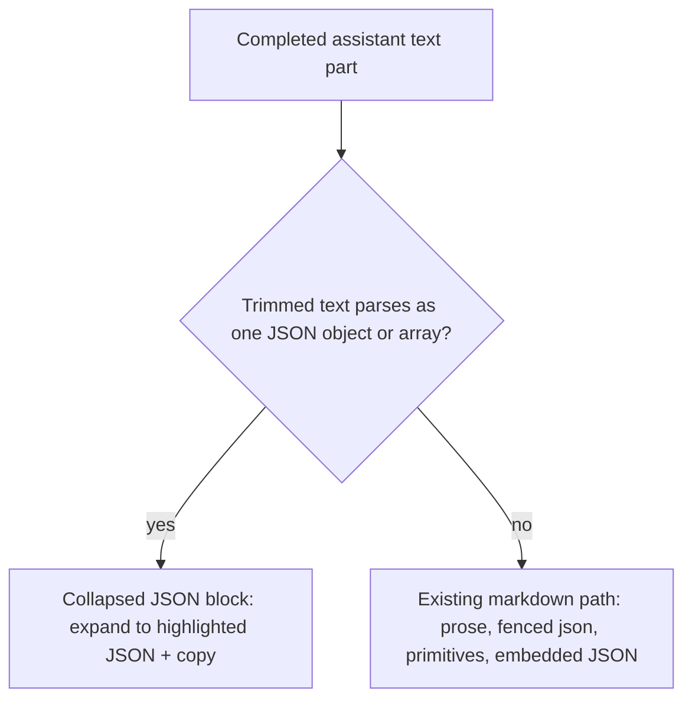
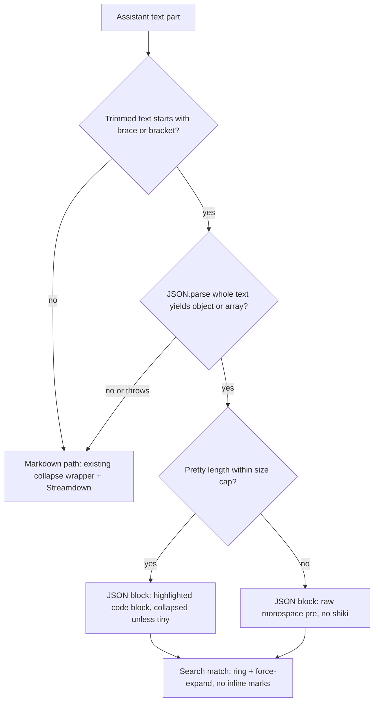

# JSON Message Rendering - Plan

## Goal Capsule

- **Objective:** Make structured JSON assistant output readable in chat — fixing the unreadable `ce-code-review` report — through a generic, strict, client-side JSON message renderer.
- **Product authority:** Product Contract from `ce-brainstorm`; enriched to `implementation-ready` by `ce-plan`. Product decisions are locked in the Product Contract; the Planning Contract owns how it is built.
- **Open blockers:** None. Subagent coverage is in scope; the size cap is a starting value to tune on real payloads.

---

## Product Contract

> Product Contract preservation: changed — R3, Key Decisions/Summary terminology clarified "whole-message" to "whole text part" to match the per-part renderer; R3 restated as parse-gated (no completion bit threaded); added AE8 (user-JSON untouched, clarifies R1's assistant-only scope). No behavior change.

### Summary

JSON-only assistant text parts render as a collapsed, syntax-highlighted, expandable JSON block (with a copy action) instead of flowing into the markdown renderer as a blob. Detection is strict (whole-part) and client-side, so prose is untouched and neither the transcript nor the message-part schema changes. This fixes the `ce-code-review` report and any similar skill output at once.

### Problem Frame

The `ce-code-review` skill — and any skill or agent using the same structured-output contract — finishes by emitting a single raw JSON object as the assistant message text, with no code fence. That text flows straight into the markdown renderer as prose, producing a wall of unformatted JSON that is unreadable and hard to copy. Subagent conversations share the same render path, so any JSON-only subagent reply has the same problem. The data is correct and complete; the cost is purely presentational — the chat surface has no way to show a structured payload readably.

### Key Decisions

- **Generic JSON renderer, not a `ce-code-review` card.** A strict-shape rule covers every skill that emits a JSON-only report and treats the payload as opaque, so nothing keys off one skill's schema; a tailored verdict/requirements card is deferred.
- **Strict whole-part detection.** Requiring the entire trimmed text of one text part to be a single JSON value keeps false positives near zero on ordinary answers; JSON embedded in prose is intentionally not extracted.
- **Client-side detection at the existing text render point.** Matches the repo's "client-side detection only; no schema change" precedent and leaves the byte-identical client/server message-part union and the stored transcript untouched.
- **Collapsed by default, expand to highlighted JSON.** A one-line summary header keeps chat scannable; full highlighted JSON and a copy action are one click away.
- **Subagent conversations included.** They reuse the same renderer, so the fix reaches JSON-only subagent replies without extra work.

Detection boundary (R1–R3):



### Requirements

**Detection**

- R1. Detect a JSON-renderable assistant text part only when its entire trimmed text parses as a single JSON object or array; anything else (prose, fenced code, primitives, embedded JSON) renders through the existing markdown path unchanged.
- R2. Run detection client-side at the assistant-text render point, with no change to the message-part schema or the stored transcript.
- R3. Run detection per text part on each render but treat it as a no-op on in-progress or non-JSON text, so a streaming part stays on the markdown path until it is final and parses as valid JSON — no separate completion signal is threaded.

**Presentation**

- R4. Render a detected JSON message as a block collapsed by default with a small summary header (top-level kind, key/item count, and size) and an expand control.
- R5. When expanded, show the JSON pretty-printed and syntax-highlighted, and offer a copy action that writes the original raw text.
- R6. Treat the payload as opaque JSON; do not read `ce-code-review`–specific fields or any skill schema.

**Coverage & safety**

- R7. Apply the same rendering to JSON-only assistant text in subagent conversations, since they share the renderer.
- R8. Keep large payloads from blocking the UI by parsing with a cheap guard and bounding highlighting; the exact size threshold is a starting value to tune.
- R9. Non-JSON assistant messages (markdown, tool, and thinking parts) render identically to today, with no regression.

### Key Flows

- F1. Render a completed assistant text part
  - **Trigger:** A text part is finalized/coalesced and reaches the assistant-text render point.
  - **Steps:** Trim the text; attempt to parse it as one JSON object or array; on success render the collapsed JSON block, otherwise render via the existing markdown path.
  - **Outcome:** JSON-only messages are readable; all other messages are unchanged.
  - **Covered by:** R1, R2, R3, R4, R9

### Acceptance Examples

- AE1. Strict JSON hit renders as a block.
  - **Covers:** R1, R4, R5
  - **Given:** a completed assistant text part whose trimmed text is `{"a":1}`
  - **When:** the message renders
  - **Then:** it shows a JSON block (auto-expanded for this tiny payload) with pretty, highlighted JSON
- AE2. Fenced JSON is left to markdown.
  - **Covers:** R1
  - **Given:** an assistant message containing a fenced `json` code block
  - **When:** the message renders
  - **Then:** the code fence renders as before and is not lifted into the JSON block
- AE3. Embedded JSON in prose is not extracted.
  - **Covers:** R1
  - **Given:** `Here is the config: {"x":1} — use it`
  - **When:** the message renders
  - **Then:** it stays prose on the markdown path, not a JSON block
- AE4. Streaming partial stays markdown until complete.
  - **Covers:** R3
  - **Given:** an in-progress text part reading `{"status":"com`
  - **When:** it renders mid-stream
  - **Then:** it shows as plain text and only flips to the JSON block once the part is complete and valid
- AE5. Primitive whole text part is not treated as JSON.
  - **Covers:** R1
  - **Given:** a completed assistant text part exactly `42` or `"ok"`
  - **When:** the message renders
  - **Then:** it renders as plain text, not a JSON block
- AE6. Subagent reply uses the same block.
  - **Covers:** R7
  - **Given:** a JSON-only assistant reply inside a subagent conversation
  - **When:** it renders
  - **Then:** it uses the same JSON block as top-level chat
- AE7. Large payload stays responsive.
  - **Covers:** R8
  - **Given:** a very large valid JSON message
  - **When:** it renders
  - **Then:** the UI stays responsive, with highlighting bypassed above the size cap
- AE8. User JSON stays plain.
  - **Covers:** R1
  - **Given:** a user message whose whole text is `{"a":1}`
  - **When:** the message renders
  - **Then:** it renders as a plain paragraph, not a JSON block (detection is assistant-only)

### Success Criteria

- No completed JSON-only assistant message shows as a raw unformatted blob, in top-level chat or subagent views.
- Non-JSON assistant messages (markdown, tool, thinking) render identically to today — no regression.
- The renderer stays responsive on large payloads and works for any skill that emits a JSON-only report, with no per-skill changes.

### Scope Boundaries

**Deferred for later**

- A schema-aware rich card for `ce-code-review` (verdict badge, requirements and residual-risks layout) — more useful for that one skill but schema-coupled; generic JSON is the baseline.
- Threading a streaming-completion bit through the message adapter and lists for a literal "only when complete" gate — revisit only if the parse-gated flip shows visible flicker on real streams.
- Inline search-highlight marks inside reformatted JSON — offsets do not survive pretty-printing; matched messages still ring and auto-expand.

**Outside this change**

- Tool-result JSON rendering (a separate surface; tool inputs already have a structured fallback).
- Embedded or inline JSON within prose (strict whole-part only).
- Server-side detection, a new message-part variant, or any transcript/schema migration.
- Suppressing these messages as internal agent chatter.

### Dependencies / Assumptions

- **Assumption — user-visible content.** JSON-only assistant messages are content worth rendering, not internal chatter to hide.
- **Assumption — low false-positive rate.** Ordinary prose rarely parses as a single JSON object, and fenced `json` is excluded, so a strict whole-part rule is safe for normal answers.
- **Assumption — generic across skills.** Skills beyond `ce-code-review` may emit similar JSON-only reports; the rule intentionally covers them without per-skill work.
- **Dependency — single client render point.** All assistant text passes one render chokepoint (see Sources), which is where the detect-and-swap decision lives.
- **Dependency — syntax highlighting.** The repo already ships `shiki` via the vendored code block; expanded JSON highlighting reuses that path rather than adding a new highlighter.

### Outstanding Questions

**Resolve before planning**

- None.

**Deferred to planning**

- The payload-size threshold that bounds highlighting and the default-expand cutoff for tiny JSON (R8) — resolved in the Planning Contract as starting values to tune on real payloads.

---

## Planning Contract

### Key Technical Decisions

- **Parse-gated flip, no streaming-bit threading.** Detection runs per text part, computed directly on each render (the detector is cheap: a first-char (`{`/`[`) guard plus a try/catch `JSON.parse`) — not via a Hook, because it runs inside the `parts.map` callback and behind the text/role branch where Hooks are not allowed. Partial streaming text is not valid JSON so it returns null and stays on the markdown path, flipping once on the first render where the whole part parses — which works identically for subagents because it is message-agnostic. Threading a completion bit is deferred unless flicker is observed. (R3, AE4)
- **Per-part detection; JSON parts bypass the markdown collapse wrapper.** The renderer iterates parts, so "whole" means one whole text part; a qualifying part renders the block instead of the existing collapse wrapper, which avoids two competing expanders and truncation fighting the summary, while non-JSON parts keep that wrapper unchanged. (R1, R9)
- **Reuse the vendored highlighted code block with a size-cap bypass.** The body renders through the existing shiki code block (light/dark themes, copy plumbing) below a size cap; above the cap it renders raw monospace with no shiki, so the UI stays responsive and the highlighter's length-plus-edges cache key cannot collide on huge JSON. The first-char guard keeps a huge prose string that merely starts with `{` from ever reaching `JSON.parse`. (R5, R8, AE7)
- **Copy raw, display pretty; opaque payload; strict parse.** The copy action writes the original `part.text` for a lossless round-trip while the view shows `JSON.stringify(value, null, 2)`; the renderer reads no `ce-code-review` keys and uses `JSON.parse` only (no JSON5), so trailing-comma or commented "almost JSON" stays markdown by design. (R5, R6, R1)
- **Auto-expand tiny payloads and keep search parity.** A payload whose pretty text is roughly three lines or ~120 characters or less starts expanded, otherwise collapsed; the block accepts the same search props as the markdown path and rings plus force-expands on match, but draws no inline marks inside reformatted JSON because offsets do not survive pretty-printing. (R4, AE1)
- **i18n in both locales for all chrome.** Header label, key/item count, size, expand/collapse, and copy/copied use `useTranslation('chat')` keys added to both `en/chat.json` and `zh-CN/chat.json`, following the repo convention rather than the hardcoded "Show more/less" precedent in the existing collapse wrapper.

### High-Level Technical Design

Per-part flow at the assistant-text render point. The streaming case is handled by the parse gate: a partial part fails the `JSON.parse` gate and falls through to the markdown path, and the flip is simply the first render where that gate succeeds.



Subagent conversations traverse the same node because they render through the same component; no subagent-specific path is added.

### Assumptions (planning-time)

- The chat store coalesces streamed deltas into a single text part before render, so the parse gate sees one growing string and flips on the first valid render (see Sources: SSE resume learning). No `MessagePart` or `RenderableMessage` shape change is required for the parse-gate approach.
- The size cap starts at roughly 200 KB of pretty-printed text or roughly 5,000 lines, whichever comes first, and is meant to be tuned on real payloads; size is measured in UTF-16 code units, so emoji-heavy payloads reach the cap earlier than their character count suggests.
- The existing highlighted code block's themes (github-light/dark) and its header/action slots are the right primitives; we use a standalone copy (writes raw text) rather than the block's context-bound copy button, which copies the displayed pretty string.

### Implementation Constraints

- Strict TypeScript (`noUnusedLocals`/`noUnusedParameters`); named-export component; `const` arrow handlers; `cn()` with Tailwind palette tokens; `lucide-react` icons.
- Client-only change: do not modify `src/client/types/message.ts`, `src/server/types/message.ts`, the chat store, the adapter, or `tool-renderers/registry.ts` (tool-input only).
- Tests mock `streamdown` and `react-i18next` as the existing renderer tests do; do not real-render Streamdown in jsdom.

### Sequencing

U1 (helper) → U2 (component, consumes the helper's shape) → U3 (wire at the render branch). Each unit lands with its co-located tests.

### Risks & Dependencies

- **Premature-flip flicker.** A streaming prefix that is momentarily valid JSON could flip early; the parse gate makes this rare and self-correcting on the next delta, and a completion bit can be threaded later if it is observed on real streams.
- **Highlighter cache collision on huge JSON.** The size-cap bypass never feeds oversized payloads to shiki, so the length-plus-edges cache key cannot produce stale highlighting; we do not modify the code block's cache key.
- **Search offset mismatch after pretty-print.** Reformatted indices no longer match the source, so the block rings and force-expands on match and skips inline marks rather than marking wrong positions.
- **Dependencies.** Vendored shiki code block and `src/client/lib/language.ts` (present); `useTranslation('chat')` namespace; the `cli-meta` pure-detect pattern; chat-store text coalescing.

---

## Implementation Units

### U1. Strict JSON detection helper

- **Goal:** Provide a pure `detectStructuredReport(text)` that returns `{ value, pretty, meta }` or `null`, where `meta` is `{ kind: 'object' | 'array', count: number, size: number }`.
- **Requirements:** R1, R3, R6; AE1, AE2, AE3, AE5.
- **Dependencies:** None.
- **Files:**
  - Create `src/client/lib/structured-report.ts`
  - Test `src/client/lib/structured-report.test.ts`
- **Approach:** Mirror `detectCliMeta` (`src/client/lib/cli-meta.ts:24`): trim, apply the first-char (`{`/`[`) guard, `JSON.parse` inside try/catch, reject when `typeof value !== 'object' || value === null` (drops primitives and `null`), then compute `pretty = JSON.stringify(value, null, 2)`, `kind` via `Array.isArray`, `count` (object keys or array length), and `size = pretty.length`. Return `null` on throw, empty input, or non-object. Strict parse only — no JSON5. Document that `size` is UTF-16 code units.
- **Patterns to follow:** `cli-meta.ts` pure detect shape; strict TypeScript; no external deps.
- **Test scenarios:**
  - Happy: `{"a":1}` returns object meta with pretty formatting; `[1,2,3]` returns `kind: 'array'`, `count: 3`.
  - Covers AE5: `42`, `"ok"`, `null`, `true` each return `null` (primitive gate).
  - Covers AE2: a full fenced ```` ```json ```` block string returns `null`.
  - Covers AE3: `Here is {"x":1} — use it` returns `null` (whole text does not parse).
  - Edge: leading/trailing whitespace and newlines are trimmed and still detect; empty or whitespace-only returns `null`.
  - Edge: malformed `{"a":`, trailing-comma `{"a":1,}`, and unquoted-key `{a:1}` each return `null`.
  - Edge: unicode/emoji/astral characters in values parse, and `size` reflects UTF-16 units.
  - Edge: a huge non-JSON string starting with `{` passes the guard but throws on parse and returns `null` without crashing; a huge valid array returns meta with a large `size` (capping is the component's job).
  - Error: non-string input returns `null` defensively.
- **Verification:** `npm run test:client` green for the helper; `npm run lint` clean.

### U2. Structured JSON message component

- **Goal:** Render a detected payload as a collapsed-by-default block with a summary header, expand/collapse toggle, and copy; the expanded body shows highlighted JSON via the vendored code block, or raw monospace above the size cap.
- **Requirements:** R4, R5, R6, R8; AE1, AE7.
- **Dependencies:** U1 (consumes `value`/`pretty`/`meta`).
- **Files:**
  - Create `src/client/components/ai-elements/structured-report.tsx`
  - Test `src/client/components/ai-elements/structured-report.test.tsx`
  - Add i18n keys to `src/client/i18n/en/chat.json` and `src/client/i18n/zh-CN/chat.json`
- **Approach:** Named-export component with props `{ value, pretty, meta, raw, forceExpanded?, hasSearchMatch?, isCurrentSearchMatch? }`. Hold local expanded state, defaulting to expanded when `forceExpanded || hasSearchMatch || isCurrentSearchMatch` or the payload is tiny (pretty ≤ ~120 chars or ≤ ~3 lines). Header uses `cn()` + Tailwind tokens and `lucide` chevron/Copy/Check icons. Body below the cap renders `<CodeBlock code={pretty} language="json">`; above the cap renders `<pre className="overflow-auto"><code>{pretty}</code></pre>` with a small "highlighting skipped for size" note. Copy is a standalone header button that writes `raw` via `navigator.clipboard.writeText` (FilePath pattern), not the context-bound code-block copy button. i18n keys (e.g. `structuredReport.label`, `.keys`, `.items`, `.size`, `.expand`, `.collapse`, `.copy`, `.copied`, `.highlightSkipped`) go in both chat namespaces.
- **Patterns to follow:** Header chrome like `SkillRenderer.tsx`; body via `src/client/components/ai-elements/code-block.tsx` `<CodeBlock>`; standalone copy like `src/client/components/.../FilePath.tsx:60-66`; `cn()` + tokens; `lucide-react` icons.
- **Execution note:** Start with a failing test that a JSON meta renders collapsed and expands to show highlighted JSON.
- **Test scenarios:**
  - Happy: object meta shows header `JSON · N keys · size`, collapsed by default (pretty hidden); clicking the toggle expands and renders highlighted JSON; the copy button writes `raw` (mock `navigator.clipboard`).
  - Covers AE7: `pretty.length` above the cap renders raw `<pre>` (no shiki), shows the skip note, and still expands, collapses, and copies.
  - Edge: array meta shows `N items`; a tiny payload (≤ ~120 chars or ≤ ~3 lines) starts expanded.
  - Edge: `forceExpanded`/`hasSearchMatch` starts expanded and shows the ring affordance; inline marks are not asserted (out of scope).
  - Opaque: a `ce-code-review`-shaped object renders with no key-specific UI (no verdict/requirements labels) — assert generic header only.
  - i18n: both `en/chat.json` and `zh-CN/chat.json` contain the new keys.
- **Verification:** `npm run test:client` green; `npm run lint` clean; manual light+dark check of one JSON message in dev.

### U3. Wire detection at the assistant-text branch

- **Goal:** At the assistant text branch in `ChatMessageRenderer.tsx`, detect and swap: a JSON part renders `<StructuredReport>`, otherwise `<CompactableText>` as today; the user branch is unchanged and search props pass through.
- **Requirements:** R2, R3, R7, R9; AE4, AE6, AE8.
- **Dependencies:** U1, U2.
- **Files:**
  - Modify `src/client/components/ChatMessageRenderer.tsx`
  - Extend `src/client/components/ChatMessageRenderer.test.tsx`
- **Approach:** In the `part.type === 'text'` branch (~:253-271), keep the user/assistant split; for assistant, compute `const report = detectStructuredReport(part.text)` directly — no Hook, since this runs inside the `parts.map` callback and behind the text/role branch, where Hooks are not allowed, and the detector is cheap. When `report` is non-null render `<StructuredReport {...report} raw={part.text} {...searchProps} />` (branch before the collapse wrapper, so JSON parts bypass it); otherwise render `<CompactableText ...>{part.text}</CompactableText>` unchanged. No changes to the adapter, types, lists, or store, and no entry in `tool-renderers/registry.ts`.
- **Patterns to follow:** The existing part-switch special-cases (Agent/Workflow at ~:288-372); the `cli-meta` detect→swap idea applied inside the assistant branch (not `pairCliMeta`, which is user-text only).
- **Test scenarios:**
  - Covers AE1: a completed assistant message with one JSON text part renders `StructuredReport` and does not use the collapse wrapper for that part.
  - Covers R9: assistant prose/markdown, tool, and thinking parts render exactly as today, with no `StructuredReport`.
  - Covers AE4: a partial `{"status":"com` part renders on the markdown path; after the same part is updated to full valid JSON, the re-render shows `StructuredReport` (flip on completion via parse).
  - Mixed message: one JSON text part plus one prose text part plus a tool part — only the JSON part becomes `StructuredReport`; the others are unchanged.
  - Covers AE8: a user message whose text is `{"a":1}` renders as a plain paragraph, not `StructuredReport`.
  - Covers AE6: a JSON-only reply rendered through the shared subagent path renders `StructuredReport`.
  - Search: `forceExpanded`/`hasSearchMatch` are passed to `StructuredReport` for a matched JSON part, matching the markdown path's parity.
- **Verification:** `npm run test:client` green including the updated `ChatMessageRenderer.test.tsx`; `npm run lint` clean; manual render of a `ce-code-review`-style final message in top-level chat and in a subagent view.

---

## Verification Contract

| Gate | Command / check | Applies to | Done signal |
|---|---|---|---|
| Lint | `npm run lint` | all units | clean; no unused locals/params, strict TS satisfied |
| Client unit tests | `npm run test:client` | U1, U2, U3 | all green; new helper, component, and branch tests pass |
| Manual render | `npm run dev:client` or `npm run tauri:dev` | U2, U3 | a JSON final message renders collapsed/expandable with copy in light + dark, in chat and a subagent view; non-JSON messages unchanged |
| Scope guard | diff review | U3 | no changes to `types/message.ts`, chat store, adapter, or `tool-renderers/registry.ts` |

No behavioral skill evaluation is required (pure client rendering). `release:validate` does not apply.

---

## Definition of Done

- Each unit's test scenarios pass; `npm run lint` and `npm run test:client` are green.
- A `ce-code-review`-shaped JSON final assistant message renders as a collapsed/expandable highlighted JSON block whose copy writes the raw text, in top-level chat and in a subagent view, in light and dark themes.
- Non-JSON assistant messages (markdown, tool, thinking) render identically to before; user JSON messages stay plain paragraphs.
- A streaming JSON part stays markdown mid-stream and flips once on completion; a large JSON payload does not freeze the UI (raw-monospace fallback).
- i18n keys are present in both `src/client/i18n/en/chat.json` and `src/client/i18n/zh-CN/chat.json`.
- No changes to `MessagePart`/`RenderableMessage` types, the transcript, or `tool-renderers/registry.ts`.
- Any abandoned-attempt code (for example an experimental streaming-bit thread) is removed from the diff before merge.

---

## Sources / Research

Orientation for the implementer — verified against the repo; repo-relative breadcrumbs, not prescription.

- Assistant-text render chokepoint: `src/client/components/ChatMessageRenderer.tsx` (~:253-271) — assistant text flows `CompactableText` → `Response` → `Streamdown`; the detect-and-swap lives here (U3).
- Client-side detect precedent: `src/client/lib/cli-meta.ts:24` (`detectCliMeta`) — pure `T | null`; the model for U1's `detectStructuredReport`. Apply it inside the assistant branch, not in `pairCliMeta` (user-text only).
- Highlight + copy primitives: `src/client/components/ai-elements/code-block.tsx` (`<CodeBlock>` :418, `highlightCode` :183, themes :158-161, cache key :140-148, copy button :456-509); standalone copy pattern `FilePath.tsx:60-66`; language-id helper `src/client/lib/language.ts`.
- Renderer/test exemplars: `tool-renderers/renderers/AskUserQuestionRenderer.tsx`, `SkillRenderer.tsx`, `StructuredFallback.tsx`; tests `ChatMessageRenderer.test.tsx` (mocks `streamdown`/`react-i18next`/chat store, `makeTextMessage`) and `GlobRenderer.test.tsx` (RTL + `userEvent`).
- Subagent path: `src/client/components/SubagentConversation.tsx` renders `ChatMessageRenderer` (:4, :52) per `adaptSubagentMessage` (:50) — JSON block applies automatically (R7).
- Parse-gate rationale: chat-store coalesces streamed text deltas into one part before render; see `docs/solutions/integration-issues/sse-stream-resume-on-reconnect-2026-05-18.md` for the coalescing/replay shape the renderer reads. The server-only isolated-DB rule (`docs/solutions/conventions/use-isolated-test-database-for-comate.md`) does not apply to these jsdom tests.
- Edge-case pass: an end-user flow analysis informed the KTDs (parse-gate vs completion bit, per-part scope, copy-raw vs pretty, size-cap bypass and highlighter cache collision, search parity, i18n, tiny-payload expand).
