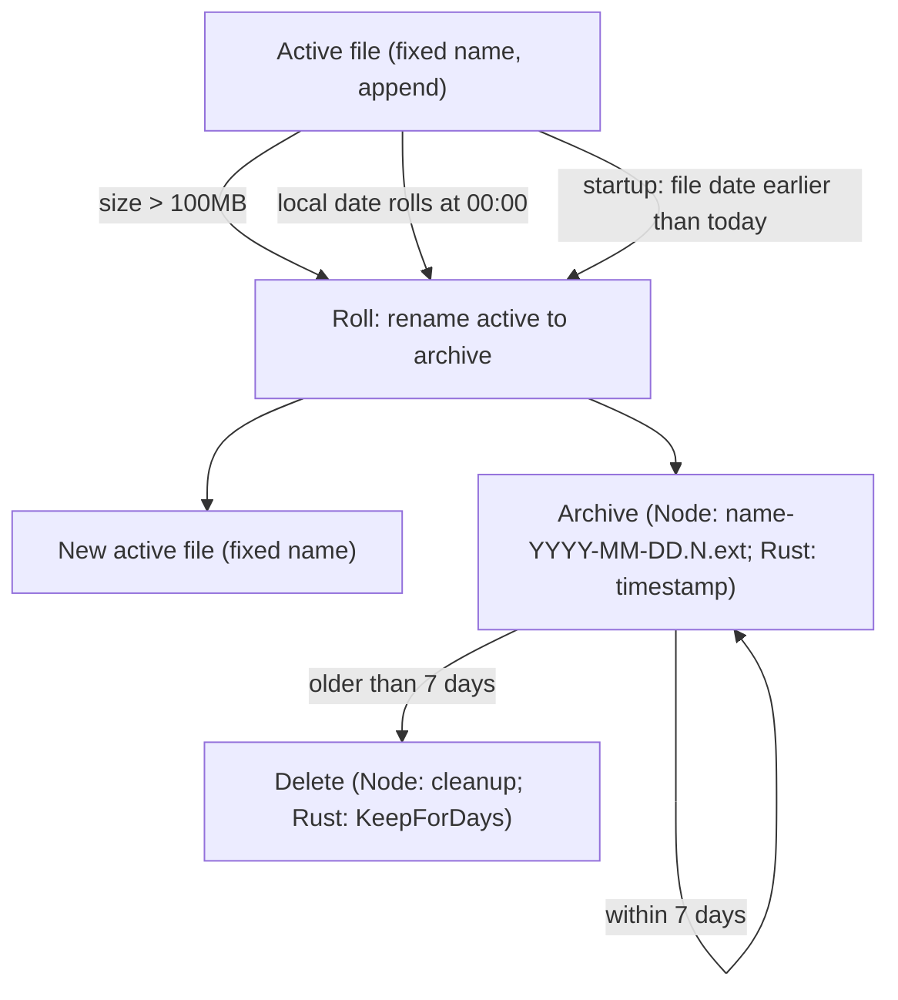
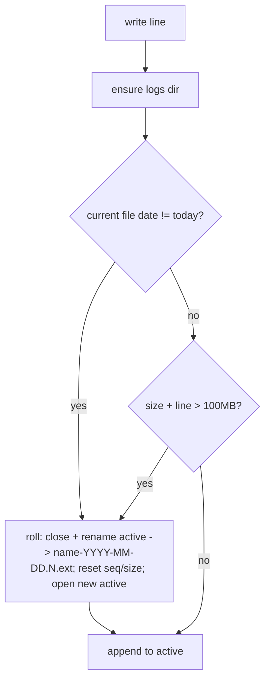
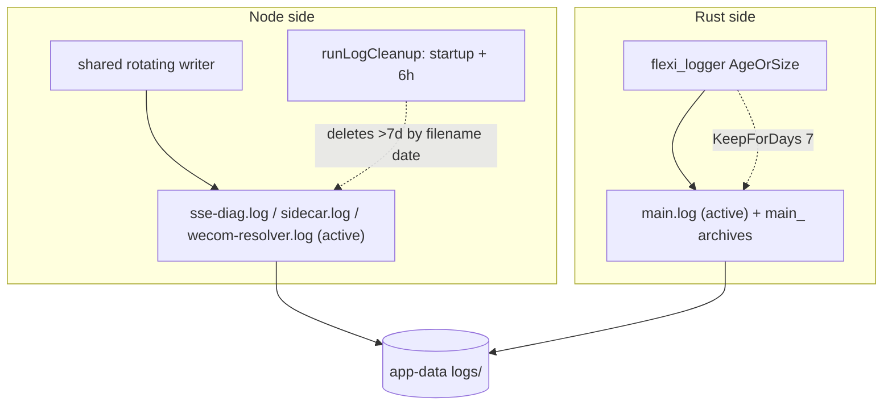

# Log Rotation and Retention - Plan

## Goal Capsule

- **Objective:** 把 Node 与 Rust 目前三套互不一致的日志滚动/保留行为，统一为一套"单文件 100MB 或每日滚动 + 带日期归档 + 7 天保留"的策略。
- **Product authority:** 用户（产品负责人）经 `ce-brainstorm` 对话确认范围；计划阶段经 `ce-plan` 确认落地取舍。
- **Execution profile:** `code` —— Node 侧新增共享滚动写入器并迁移三个 logger、改写目录清理；Rust 侧用 `flexi_logger` 替换 `tauri-plugin-log` 的文件输出。
- **Stop conditions:** 任一层不能做到"满 100MB 或每日滚动且保留 7 天"，或清理会误删正在写的当前文件，即视为未达成。
- **Open blockers:** 无。Deferred-to-Planning 项已在 Planning Contract 中落为决策或 Assumptions。

## Product Contract

### Summary

给所有日志（Node 的 `sse-diag.log` / `sidecar.log` / `wecom-resolver.log` 与 Rust 的 `main.log`）上同一套滚动：当前文件过 100MB 立即滚、没到 100MB 也在每天滚动一次。正在写的始终是固定文件名；Node 归档改名成 `name-YYYY-MM-DD.N.ext`，Rust 归档由 `flexi_logger` 产出时间戳名（见 Planning Contract）。归档保留 7 天后清理，Node 由目录清理、Rust 由 `KeepForDays(7)` 各自负责。Rust 的"每日滚"由 `flexi_logger` 的 `AgeOrSize(Age::Day, …)` 直接覆盖常驻与关机两种用法。

### Problem Frame

目前 `logs/` 目录里同时存在三套不同的滚动/保留行为。`sse-diag.log` 与 `sidecar.log` 是纯追加、自身不滚动，只靠目录级清理（按文件 mtime 超过 7 天删除、整目录聚合超过 100MB 从最旧删）兜底，在此之前文件可以一直增长。`wecom-resolver.log` 自己另做了一套 10MB 单文件滚动，只保留一个 `.1`、不带日期、更早的历史直接丢弃。Rust 的 `main.log` 走 `tauri-plugin-log` 的 5MB / `KeepOne`，同样不带日期。

后果是：想定位"昨天那段日志"很困难，因为文件名里没有日期；`sse-diag.log` / `sidecar.log` 在两次清理之间可能涨到很大；整目录 100MB 聚合上限在突发写入下可能把仍在保留期内的旧文件按大小顶掉；三套逻辑分散在三处，保留语义不一致。

### Key Decisions

- **一套策略覆盖所有日志。** Node 与 Rust 用同一套滚动语义，换取"任何日志、任何用法都一致"——代价是 Rust 侧要引入 `flexi_logger`（见 Planning Contract）。
- **触发条件：单文件 100MB 或每日，先到先滚。** 单文件 100MB 取代旧的"整目录 100MB 聚合"，每日滚动保证按日可定位。
- **当前文件固定名，归档才带日期。** 换来稳定的 tail / 脚本跟随路径；代价是当天正在写的文件在滚动前名字里没有日期。
- **保留 7 天。** Node 按归档文件名中的日期清理，Rust 由 `flexi_logger` 的 `KeepForDays(7)` 清理；清理绝不碰正在写的固定名当前文件。
- **替换三套旧机制。** 废弃目录 100MB 聚合上限、resolver 自带 10MB `.1` 滚动、Rust 的 `tauri-plugin-log` 5MB `KeepOne`，由本策略统一接管。

### Requirements

**Rolling trigger**

- R1. 每个日志流的当前文件体积一旦超过 100MB，立即滚动：把当前文件改名为带日期的归档，另开一个新的固定名当前文件继续写。
- R2. 每个日志流在本地日期跨过 0 点时滚动一次，即使当前文件未到 100MB。
- R3. 同一文件同时满足两个触发条件时按"先满足先触发"处理，滚动后日期与序号按新文件重新计算。
- R4. 每日滚动同时具备两个来源——运行中跨零点（覆盖常驻进程）与启动按日切（覆盖关机后重启或漏跑）——保证任何使用习惯下每天都是独立文件。Node 的运行中来源用"每次写入时校验日期"实现（见 KTD2）；Rust 由 `flexi_logger` 的 `AgeOrSize` 直接满足。

**Naming**

- R5. 正在被写入的当前文件保持固定文件名（`sse-diag.log`、`sidecar.log`、`wecom-resolver.log`、`main.log`），不含日期。
- R6. Node 滚动产生的归档命名为 `<原名>-<YYYY-MM-DD>.<N>.<ext>`（如 `sse-diag-2026-07-10.0.log`），日期为该文件覆盖的本地日历日。
- R7. Node 归档序号 `N` 在每个日历日内从 0 开始，当日每次因大小再次滚动时递增，跨天后重置为 0。
- R7a. Rust 的 `main.log` 归档采用 `flexi_logger` 的时间戳命名（如 `main_2026-07-10_00-00-00.log`），不受 R6/R7 约束；这是选用 `flexi_logger` 的既定取舍。

**Coverage**

- R8. Node 侧所有日志流（`sse-diag.log`、`sidecar.log`、`wecom-resolver.log`）统一采用本策略，移除 `resolver-logger` 自带的 10MB `.1` 滚动。
- R9. Rust 的 `main.log` 采用本策略（满 100MB 或每日滚动、保留 7 天），通过 `flexi_logger` 替换 `tauri-plugin-log` 的文件输出来实现，移除现有 5MB / `KeepOne` 行为。

**Retention and cleanup**

- R10. Node 归档按文件名中的日期保留 7 天，超过即删除；Rust 归档由 `flexi_logger` 的 `KeepForDays(7)` 保留 7 天。
- R11. 清理只删除符合归档命名规则的文件，绝不删除或截断任何正在被写入的固定名当前文件。
- R12. Node 的目录清理在启动时执行一次，并在运行中周期性执行（沿用现有 6 小时间隔），保证常驻进程也会回收过期归档。

**Unification**

- R13. 废弃当前"整个 `logs/` 目录 100MB 聚合上限"的清理规则，由"单文件 100MB + 7 天保留"接管体积边界。
- R14. 三个 Node 写入路径共享同一套滚动与命名实现；Rust 统一走 `flexi_logger`。不再各自维护不同的滚动逻辑。

### Key Flows

- F1. 大小触发滚动
  - **Trigger:** 当前文件写入后体积超过 100MB。**Covers R1, R6, R7.**
  - **Steps:** 将当前文件改名为归档 → 新建固定名当前文件 → 继续写入。
  - **Outcome:** 原内容进入带日期的归档，当前文件从空续写。
- F2. 运行中每日滚动
  - **Trigger:** Node 写入时检测到本地日期已变 / Rust `AgeOrSize` 触发。**Covers R2, R4.**
  - **Steps:** 将上一日的当前文件归档 → 新建当天当前文件。
  - **Outcome:** 常驻进程每天也产出独立的当日文件。
- F3. 启动按日切
  - **Trigger:** 进程启动时发现当前文件来自早于今天的日历日。**Covers R2, R4.**
  - **Steps:** 写入前先把旧当前文件归档 → 再开始当天写入。
  - **Outcome:** 关机过夜或漏跑的日子也能补齐每日文件。
- F4. 保留清理
  - **Trigger:** Node 启动时与周期清理点 / Rust `KeepForDays(7)`。**Covers R10, R11, R12.**
  - **Steps:** 识别归档 → 删除早过 7 天的归档 → 跳过所有固定名当前文件。
  - **Outcome:** 磁盘受控，当前文件安全。

### Acceptance Examples

- AE1. **Covers R1, R3, R7.** **Given** `sse-diag.log` 当天已滚过 1 次（已存在 `sse-diag-2026-07-10.0.log`）且当前文件再次超过 100MB，**When** 触发滚动，**Then** 新归档命名为 `sse-diag-2026-07-10.1.log`，当前 `sse-diag.log` 重新从空开始。
- AE2. **Covers R2, R4.** **Given** 进程常驻并跨过 2026-07-10 23:59 到 07-11 00:00，**When** 第一次写入发生在 07-11，**Then** 07-10 的当前文件被归档，07-11 起写入新的当前文件。
- AE3. **Covers R2, R4.** **Given** 用户昨晚关机、今晨启动且 `main.log` 仍是昨天的日期，**When** 启动完成，**Then** 昨天的 `main.log` 先被归档，再开始写入今天的内容。
- AE4. **Covers R10, R11.** **Given** `logs/` 里同时存在 8 天前的归档 `sse-diag-2026-07-02.0.log` 和正在写的 `sse-diag.log`，**When** 清理运行，**Then** 删除前者、保留后者不动。

### Success Criteria

- 任意时刻，`logs/` 目录里除固定名当前文件外，Node 归档全部符合 `<name>-<YYYY-MM-DD>.<N>.<ext>`，Rust 归档为 `flexi_logger` 时间戳名。
- 任意一个日志流，同一天除最后一片外每个归档文件均不超过 100MB。
- 常驻过夜与每天关机两种用法下，都能按日期定位到独立的当日归档。

### Scope Boundaries

- 不对归档做 gzip 压缩，不在本次引入（`flexi_logger` 的压缩变体不启用）。
- 不做远程 / 集中式日志收集，不改日志内容、格式或级别。
- 不为单个日志流设置差异化的保留期，统一 7 天。
- 不保留额外的整目录总量硬上限，体积边界由单文件 100MB 与 7 天保留承担。

### Dependencies and Assumptions

- Rust 改用 `flexi_logger`，因此不再启用 `tauri-plugin-log` 的 `KeepAll`；`KeepAll` 的已知 bug（`tauri-apps/plugins-workspace#1397`，只保留最近 2 个文件）与本方案无关。
- 归档日期采用本地日历日，与 `src-tauri/src/lib.rs` 已有的本地时区策略一致。
- 体积边界由"单文件 100MB + 7 天保留"承担，未假设额外的整目录总量上限。

### Outstanding Questions

**Resolve Before Planning**

- 无。

**Deferred to Planning**

- 已在 Planning Contract 中落定：分层各管各的保留清理（R10/R11）、Node 运行中每日滚采用"写入时校验日期"（KTD2）、废弃整目录 100MB 聚合上限且不设安全上限（R13）。

### Sources and Research

- `src/server/utils/log-cleanup.ts` — 当前目录清理：7 天年龄、100MB 聚合上限、`getLogsDir()`。
- `src/server/utils/diag-logger.ts` — `sse-diag.log`，纯追加。
- `src/server/utils/sidecar-logger.ts` — `sidecar.log`，纯追加。
- `src/server/utils/resolver-logger.ts` — `wecom-resolver.log`，自带 10MB 单文件 `.1` 滚动。
- `src/server/index.ts` — 启动时与每 6 小时运行 `runLogCleanup()`，并含 legacy 文件清理。
- `src-tauri/src/lib.rs` — 当前 `tauri-plugin-log` 配置：5MB、`RotationStrategy::KeepOne`、`UseLocal`、Folder 目标写入 app-data `logs/`。
- `src-tauri/Cargo.lock` — `tauri-plugin-log` 锁定 v2.8.0（无按天触发器）。
- 外部：`tauri-plugin-log` v2 无按天/到点滚动触发器；`KeepAll` 缺陷 #1397（只保留最近 2 个文件）—— 见 Sources 链接。
- 外部：`flexi_logger` 滚动 API（`Criterion::AgeOrSize`、`Cleanup::KeepForDays`、`log` 门面原生）—— 见 Sources 链接。

---

## Planning Contract

> **Product Contract preservation:** changed: R6/R7 — Rust 归档改用 `flexi_logger` 时间戳命名，新增 R7a 承接（用户已确认）；R10/R11 保留清理落实为"分层各管各的"。其余 Product Contract 条目与 R/A/F/AE ID 不变。

### Key Technical Decisions

- **KTD1. Node 共享一个滚动写入器。** 新建一个被三个 logger 共用的滚动写入器，集中实现"满 100MB 或每日"与 `<name>-<日期>.<N>` 命名。理由：用一处实现替换三套发散逻辑，测试面收敛到一处。取舍：多一次对 diag/sidecar/resolver 的迁移，但消除 resolver 自带 10MB `.1` 的特例。
- **KTD2. Node 每日滚动用"写入时校验日期 + 启动切"。** 每次写日志前比较当前文件日期与本地今日，跨日则滚；启动时再补一刀。理由：比独立定时器简单，空闲流本就没有内容，"下次写入时再滚"不丢信息。只有当将来要求"空闲也准点 0 点滚"时才改定时器。
- **KTD3. Rust 用 `flexi_logger` 替换 `tauri-plugin-log` 的文件输出。** 配置 `Criterion::AgeOrSize(Age::Day, 100*1024*1024)` 与 `Cleanup::KeepForDays(7)`，debug→stdout、release→app-data `logs/` 下 `main.log`。理由：它是唯一同时满足"每日或大小"触发、按天保留、且原生对接现有 `log::*!` 宏的现成库，并彻底绕开 #1397（不用 `KeepAll`）。取舍：归档名为时间戳式（R7a），并新增一个依赖、改动 Rust 启动初始化。
- **KTD4. 保留清理分层各管各的。** Node 目录清理只删符合 `<name>-<日期>.<N>` 的 Node 归档；Rust 归档由 `flexi_logger` 的 `KeepForDays(7)` 自管。理由：两套命名不同，统一清理器要同时识别两种格式、耦合更高；分层各管同一 7 天更简单且同样安全。
- **KTD5. 废弃整目录 100MB 聚合上限（R13），不设替代安全上限。** 理由：单文件 100MB + 7 天保留已把体积边界约束住；旧的聚合上限在突发写入下会把仍在保留期内的旧文件按大小顶掉，正是要去掉的反模式。

### High-Level Technical Design

Node 写入路径（每个 logger 共享）：

两层共目录、保留各管各：

### Assumptions

- "日" = 本地日历日，与 Rust 现有本地时区策略一致；DST 切换当天按本地日期计，不特殊处理。
- Node 空闲流的每日滚动发生在其下一次写入时（KTD2），不保证 0 点整。
- 不保留整目录总量硬上限（KTD5）；最坏情况体积约为"流数 × 每日满量滚动次数 × 7 天 × 100MB"，由保留期自然回收。
- 服务器端涉及 `getStorageDir()` 的测试遵循既有约定：首句导入 `test-utils/test-env`，用隔离目录（`COMATE_DATA_DIR`），不对默认 `data.db` 构造 `SqliteStore()`。

### Sequencing

- U1（共享写入器）→ U2（迁移三个 Node logger）→ U3（改写目录清理）。
- U4（Rust `flexi_logger`）与 U1–U3 相互独立，可并行；落地后与 U3 共同验证"同目录、不互相误删"。

---

## Implementation Units

### U1. Node 共享滚动写入器

- **Goal:** 提供一个被所有 Node logger 共用的滚动写入器，实现"满 100MB 或每日滚动 + `<name>-<YYYY-MM-DD>.<N>.<ext>` 归档 + 固定名当前文件"。
- **Requirements:** R1, R2, R3, R4, R5, R6, R7, R14（F1, F2；AE1, AE2）。
- **Dependencies:** 无。
- **Files:**
  - 新建 `src/server/utils/rotating-writer.ts`
  - 新建 `src/server/utils/rotating-writer.test.ts`
- **Approach:** 每个日志流持有状态 `{ activePath, currentDate, currentSize, todaySeq }`。**构造时从磁盘播种（覆盖同日重启）：** 若固定名当前文件已存在且属于本地今日，`currentSize = statSync(activePath).size`，并扫描 `logs/` 下既有的 `<name>-<YYYY-MM-DD>.<N>.<ext>`，令 `todaySeq = max(N) + 1`（无则 0），使同日重启后续写 R1 阈值、序号从既有归档续编而不覆盖（仿 `src/server/utils/resolver-logger.ts` 的 stat 取大小）；若当前文件属于更早的日历日，则先滚动再把两者重置为 0。写入流程：确保目录存在 → 若当前文件日期早于本地今日则滚动（KTD2）→ 否则若 `currentSize + line > 100MB` 则滚动 → 追加。滚动 = 关闭并重命名当前文件为 `<name>-<currentDate>.<todaySeq>.<ext>`、`todaySeq++`、重置 `currentSize`、以固定名重开当前文件。对外暴露与现有 logger 一致的 `write/warn/error` 形态，并保留 `diag-logger` 的时间戳格式与 `mirrorToConsole()` 行为。滚动失败时降级为继续追加，不抛出。
- **Patterns to follow:** `src/server/utils/diag-logger.ts`（时间戳、`mirrorToConsole`、可写流错误处理）；`src/server/utils/resolver-logger.ts`（滚动时 `destroy` 旧流再重建，避免 fd 泄漏）——但把分散逻辑统一到本写入器。
- **Test scenarios:**
  - Happy: 连续写入落到固定名当前文件，内容含时间戳。
  - Happy: 同一天多次写入不滚动、序号保持 0。
  - Covers AE1. 当日已存在 `... .0.log`、当前文件再次超过 100MB → 新归档为 `... .1.log`，当前文件从空开始。
  - Covers R1/R7（同日重启）. 固定名当前文件已含约 60MB 且已存在 `<name>-<today>.0.log` 时构造写入器 → `currentSize` 从约 60MB 续计、`todaySeq` 从 1 续编；再写约 50MB 触发滚动 → 新归档为 `<name>-<today>.1.log`、不覆盖 `.0.log`，当前文件从空开始。
  - Covers AE2. 模拟日期跨天后的第一次写入 → 旧当前文件被归档为昨日日期、新当前文件从今日开始。
  - Edge: 序号在每个日历日重置为 0（跨天后第一次滚动从 `.0` 开始）。
  - Edge: 单次写入本身超过 100MB 时仍只滚一次、不丢失该行。
  - Error: 重命名失败时仍继续追加到当前文件、不抛错、不丢后续写入。
  - Integration: 两个不同流并发写入各自的当前文件，互不影响序号与文件。
- **Verification:** 单元测试全绿；手工 `tail -f` 固定名当前文件可见持续写入，触发滚动后生成符合命名的归档。

### U2. 迁移三个 Node logger 到共享写入器

- **Goal:** 把 `diag-logger`、`sidecar-logger`、`resolver-logger` 改为基于 U1 的薄封装，删除 `resolver-logger` 自带的 10MB `.1` 滚动。
- **Requirements:** R8, R14。
- **Dependencies:** U1。
- **Files:**
  - 修改 `src/server/utils/diag-logger.ts`
  - 修改 `src/server/utils/sidecar-logger.ts`
  - 修改 `src/server/utils/resolver-logger.ts`
  - 修改 `src/server/index.ts`（确认"diag log file: sse-diag.log"提示仍成立；当前文件名不变）
- **Approach:** 每个 logger 仅保留对外 API（`diagLog`/`diagWarn`、`resolverLog`/`resolverWarn`/`resolverError`、sidecar 现有导出）与各自流名，写入委托给 U1。删除 `resolver-logger.ts` 中的 `MAX_LOG_SIZE`/`ROTATION_CHECK_INTERVAL`/`rotateIfNeeded` 与 `.1` 改名逻辑。调用方签名与行为不变。
- **Patterns to follow:** 维持各 logger 现有导出形态与日志级别；沿用 `diag-logger` 的 `mirrorToConsole()` 判定。
- **Test scenarios:**
  - Happy: 每个 logger 写入落到各自固定名当前文件（`sse-diag.log`/`sidecar.log`/`wecom-resolver.log`）。
  - Edge: resolver 不再产出 `wecom-resolver.log.1`。
  - Integration: 现有调用点（`diagLog`/`resolverLog` 等）无需改动即可工作；server 正常启动，启动日志里仍打印 `sse-diag.log` 路径。
- **Verification:** `npm run test:server` 绿；启动后三个当前文件出现且随写入滚动出归档。

### U3. 改写目录清理为按文件名日期的 7 天保留

- **Goal:** 把 `runLogCleanup()` 改为"只删符合 `<name>-<YYYY-MM-DD>.<N>.<ext>` 且日期早过 7 天的归档"，绝不碰固定名当前文件；移除 100MB 聚合上限；保留启动 + 6 小时周期。
- **Requirements:** R10, R11, R12, R13（F4；AE4）；KTD4, KTD5。
- **Dependencies:** U1（命名约定）、U2。
- **Files:**
  - 修改 `src/server/utils/log-cleanup.ts`（保留 `getLogsDir()`/`ensureLogsDir()`）
  - 新建 `src/server/utils/log-cleanup.test.ts`（首句导入 `test-utils/test-env`，使用隔离数据目录）
- **Approach:** 枚举 `getLogsDir()` → 用正则识别 Node 归档名并解析其中日期 → 与本地今日比较，超过 7 天则 `unlinkSync` → 跳过固定名当前文件、不符合命名规则的文件、以及 Rust 时间戳归档（由 `flexi_logger` 自管，见 KTD4）。删除旧的 `MAX_SIZE_BYTES` 聚合上限逻辑。`getLogsDir()` 路径不变（继续与 Rust 同目录）。
- **Patterns to follow:** 现有 `log-cleanup.ts` 的"出错静默忽略"风格与目录枚举方式；`src/server/storage/data-dir.ts` 的路径解析（测试里用隔离目录）。
- **Test scenarios:**
  - Covers AE4. 同时存在 8 天前的 `sse-diag-2026-07-02.0.log` 与正在写的 `sse-diag.log` → 删除前者、保留后者。
  - Happy: 6 天前的归档保留，8 天前的删除。
  - Edge: 固定名当前文件即使 mtime 很旧也绝不删除（R11）。
  - Edge: 不符合命名规则的文件（如 Rust `main_2026-07-02_00-00-00.log`、无关文件）被跳过。
  - Edge: 目录不存在时直接返回、不抛错。
  - Integration: 在隔离 `COMATE_DATA_DIR` 下运行，确认不触碰生产 `data.db`/生产 `logs/`。
- **Verification:** 单元测试全绿；启动一次与周期触发均能回收过期归档；活动文件始终存在。

### U4. Rust 改用 flexi_logger

- **Goal:** 用 `flexi_logger` 替换 `tauri-plugin-log` 的文件输出，配置 `AgeOrSize(Age::Day, 100MB)` + `KeepForDays(7)`，保留 debug→stdout、release→app-data `logs/main.log`、本地时区、Info 级别；现有 `log::*!` 调用不变。
- **Requirements:** R4, R5, R7a, R9, R10, R14；KTD3。
- **Dependencies:** 无（与 U1–U3 独立）；落地后与 U3 共同验证同目录不互相误删。
- **Files:**
  - 修改 `src-tauri/Cargo.toml`（新增 `flexi_logger`，移除 `tauri-plugin-log`）
  - 修改 `src-tauri/src/lib.rs`（替换插件初始化块；保留现有 `log::LevelFilter::Info` 与本地时区意图）
  - 检查并按需修改 `src-tauri/capabilities/default.json`（移除 `tauri-plugin-log` 相关权限项，若有声明）
  - 检查并按需修改 `src-tauri/tauri.conf.json` 及 bundle 配置（移除对 log 插件的引用，若有）
  - `src-tauri/Cargo.lock` 随依赖变更更新
- **Approach:** 在 `setup` 早期用 `flexi_logger::Logger` 初始化：`log_to_file(FileSpec::default().directory(<app-data logs>).basename("main"))`，`rotate(Criterion::AgeOrSize(Age::Day, 100*1024*1024), Naming::Timestamps, Cleanup::KeepForDays(7))`，debug 附加 `duplicate_to_stdout`，`log_level(info)`，本地时区。不再 `.plugin(tauri_plugin_log ...)`。实施时先核对 `Age::Day` 的确切变体名与当前文件命名行为。
- **Execution note:** Rust 的文件滚动行为主要靠运行时冒烟验证，而非纯单元测试；优先做 debug + release 的启动/滚动冒烟。
- **Patterns to follow:** 复用 `lib.rs` 现有的 app-data 目录解析与"目录不可用时降级"的处理；保留 debug/release 目标差异。
- **Test scenarios:**
  - Smoke: debug 构建启动，stdout 与文件均可见日志；release 构建仅写文件。
  - Smoke（Covers R2/R4）: 运行中跨过 0 点 → 产生新的时间戳归档、`main.log` 继续写。
  - Smoke（Covers R1）: 让 `main.log` 超过 100MB → 触发滚动、当前文件重置。
  - Smoke（Covers R10）: 放置 8 天前的时间戳归档 → 启动后被 `KeepForDays(7)` 清理。
  - Integration（Covers R11/KTD4）: Node 与 Rust 同时写入同一 `logs/`，Node 清理不删除 `main.log` 与 Rust 归档，`flexi_logger` 不动 Node 归档。
- **Verification:** `cargo build`（debug 与 release）通过；应用启动无日志相关 panic；上述冒烟项人工确认；`npm run lint` / `cargo clippy`（若项目使用）无新增告警。

---

## Verification Contract

- **Node 单元测试：** `npm run test:server`（`node:test`，已排除 `src/server/vendor/`）。覆盖 U1 的滚动/序号/跨日、U3 的按日期保留与不误删。涉及 `getStorageDir()` 的用例首句导入 `test-utils/test-env` 走隔离目录。
- **Lint：** `npm run lint`（`.ts`/`.tsx`），无新增告警。
- **Rust 构建：** 在 `src-tauri/` 下 `cargo build`（debug）与 `cargo build --release`（release）均通过；如项目配置了 `cargo clippy`，无新增告警。
- **行为冒烟（人工，验证跨层一致性）：**
  - 启动应用，`logs/` 下出现 `sse-diag.log` / `sidecar.log` / `wecom-resolver.log` / `main.log` 四个固定名当前文件。
  - 让任一 Node 当前文件超过 100MB → 产出 `<name>-<日期>.<N>.log`；让 `main.log` 超过 100MB 或跨天 → 产出时间戳归档。
  - 放置 8 天前的 Node 归档与 8 天前的 Rust 归档 → 启动后两者分别被 Node 清理与 `KeepForDays(7)` 删除，四个当前文件均保留。
- **质量门：** 四个当前文件在任意时刻均存在且可写；清理前后当前文件句柄不丢（滚动后写入不中断）。

## Definition of Done

- 四个日志流均满足"满 100MB 或每日滚动、保留 7 天、当前文件固定名、清理不误删当前文件"（R1–R14、R7a）。
- U1–U4 各自的 Verification 全部达成；`npm run test:server` 与 `npm run lint` 绿；`cargo build`（debug/release）通过。
- 旧的 resolver 10MB `.1` 滚动、`tauri-plugin-log` 依赖与配置、目录 100MB 聚合上限均已移除，无残留引用。
- AE1–AE4 均有对应测试或冒烟覆盖。
- **清理准则：** 不在 diff 中留下任何被放弃的滚动/重命名实验代码或死分支；未采用的方案只留在本计划的 Sources and Research，不进入代码。
