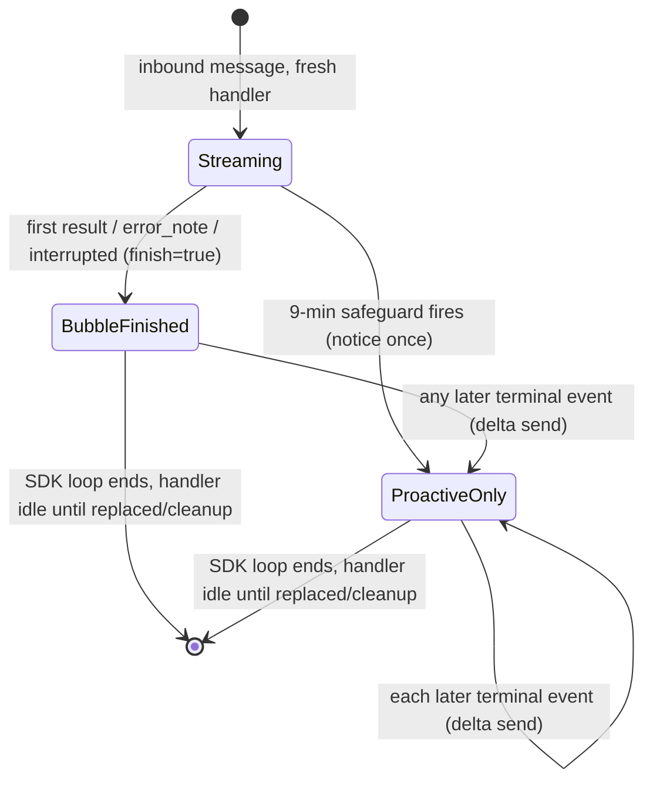

# WeCom Main-Agent Result Delivery - Plan

## Goal Capsule

- **Objective:** Make the WeCom bot deliver every main-agent result from a single run in real time, so late and post-sub-agent results stop being silently dropped.
- **Product authority:** This Product Contract (`ce-brainstorm`), confirmed 2026-07-11.
- **Open blockers:** None for planning. One adjacent loss path — a new inbound message replacing a still-running handler — is explicitly deferred; see Scope Boundaries.

---

## Product Contract

### Summary

The WeCom bot will deliver every main-agent result from a single run to the user in real time, including results that arrive after the 9-minute notice and after a sub-agent returns. The 9-minute "still working" notice stays as it is; sub-agents keep appearing only as progress placeholders, never as separate messages.

### Problem Frame

Today one reply handler serves each inbound WeCom message. When the first terminal event arrives — `result`, and the same gate also covers `error_note` and `interrupted` — the handler finalizes and then ignores every later event (`src/server/services/wecom-stream-reply.ts:369,409-415,229,261`). The 9-minute safeguard makes the common case worse: after it fires (`src/server/services/wecom-stream-reply.ts:19,310-328`) only the proactive path remains, and it too finalizes on first use. Sub-agents never emit a top-level result (`src/server/services/sse-emitter.ts:82-93,901-915`); their work reaches the user only through the main agent's next result, which is the one being dropped. Net effect: for any run that produces more than one main-agent result — most visibly long tasks and any task using sub-agents — the WeCom user sees only the first answer and never the later ones.

### Key Decisions

- **Deliver every main-agent result, not just the first.** The handler today finalizes on the first terminal event and drops the rest; the fix is to deliver each one. Completeness across the run matters more than collapsing to a single message.
- **Sub-agents are not a delivery channel.** Sub-agent SDK output (`parent_tool_use_id`) is routed to a sub-agent emitter and never produces a top-level result, so nothing sub-agent-side needs sending. The perceived "missing async result" is the main agent's suppressed follow-up, which is where the fix belongs.
- **Keep the 9-minute notice as a pure nudge.** Its text and timing stay unchanged; it must only inform the user, never close the delivery channel.

### Requirements

**Result delivery completeness**

- R1. Deliver every main-agent terminal result from a single WeCom-triggered run to the WeCom user, not only the first one.
- R2. Keep the WeCom delivery channel open from the inbound message until the main run truly ends, so a terminal result no longer suppresses later results from the same run.
- R3. Deliver main-agent results that arrive after the 9-minute deferral has fired, via the existing proactive send path.

**Deferral notice**

- R4. Keep the 9-minute deferral notice text and timing unchanged; firing it must not close or suppress subsequent result delivery.

**Sub-agent handling**

- R5. Do not send any sub-agent result as a WeCom message; sub-agent lifecycle events remain status/placeholder indicators only, as today.

**Conversational voice**

- R6. Present the multiple delivered messages as one continuous conversational voice from the bot.

### Key Flows

- F1. Corrected delivery lifecycle for one WeCom-triggered run
  - **Trigger:** An inbound WeCom message starts a main-agent run with a fresh reply handler.
  - **Steps:** Each main-agent terminal result is delivered as it emits; if the 9-minute mark is reached first, the notice fires and delivery stays open; when the main run truly ends, the channel closes.
  - **Outcome:** The WeCom user receives every main-agent result in order; sub-agents appear only as progress placeholders.
  - **Covered by:** R1, R2, R3, R4, R5, R6

### Acceptance Examples

- AE1.
  - **Covers:** R2, R3
  - **Given:** A run is still working past the 9-minute mark.
  - **When:** The deferral notice fires and a main-agent result arrives afterward.
  - **Then:** That result is delivered to WeCom.

- AE2.
  - **Covers:** R1, R5
  - **Given:** The main agent is awaiting a sub-agent.
  - **When:** The sub-agent finishes and the main agent produces a follow-up result.
  - **Then:** That follow-up result is delivered, and no separate sub-agent message is sent.

- AE3.
  - **Covers:** R1, R6
  - **Given:** A single run yields several main-agent results over time.
  - **When:** They emit in sequence.
  - **Then:** Each arrives as its own WeCom message, in emission order, reading as one voice.

- AE4.
  - **Covers:** R1
  - **Given:** A main-agent terminal event is an error or carries no text.
  - **When:** It occurs.
  - **Then:** It is still treated as a deliverable main-agent result (exact user-facing text deferred to planning).

### Success Criteria

- No main-agent result from a run is dropped; the WeCom user receives all of them.
- The 9-minute notice fires exactly once per qualifying run and never suppresses a result.
- No sub-agent output ever appears as a WeCom message.
- No result is sent more than once.

### Scope Boundaries

- Concurrent-message loss: a new inbound message replacing a still-running handler can still drop the prior run's late results — deferred to a separate item.
- Sub-agent results as standalone WeCom messages — explicitly excluded; sub-agents surface only through the main agent's next result.
- The `wecom_proactive_messages` injection queue and `WeComQueueWorker` are an unrelated path and are not touched.

### Dependencies / Assumptions

- "Every main-agent result" means every terminal event of the main agent's run (`result`, `error_note`, `interrupted`).
- Delivery order follows emission order; WeCom preserves the order messages are sent.
- The existing proactive-send chunking is reused as-is.
- Handler replacement on a new inbound message is pre-existing behavior this work does not change.

### Outstanding Questions

- **Resolve before planning:** none.
- **Deferred to planning:** three — the run-truly-ends question (KTD-1), the exact-mechanism question (KTD-2), and the empty/error-text question (AE4/KTD-4) — all resolved in the Planning Contract.

---

## Planning Contract

Product Contract preservation: R/A/F/AE IDs and product scope unchanged; the Product Contract's three deferred-to-planning questions are resolved below (KTD-1, KTD-2, KTD-4).

### Summary

The fix is a single-file change in `src/server/services/wecom-stream-reply.ts`. Deliver on every main-agent terminal event instead of finalizing on the first: the first result closes the passive bubble (`finish=true`), and every later result is sent proactively as only its new content. The handler stays alive after each result until the SDK message loop ends and the handler is replaced or cleaned up. The 9-minute safeguard is unchanged. No runtime change is needed — see KTD-1.

### Key Technical Decisions

- **KTD-1. Decouple delivery from closing, without inventing a run-end signal.** The first terminal event finishes the passive bubble; every terminal event delivers; the handler keeps processing after each result. Delivery routes through the runtime's `botEventHandlers` set, not the `activeStreamReplies` map, and the map's only two readers (`/stop` at `src/server/services/wecom-bot-service.ts:794`, `foldIntoActiveStream` at `:1517`) both tolerate a missing entry and fall back to a proactive send — so a deterministic "run over" event is not required for correctness. Resolves the deferred "run truly ends" question by not needing one.
- **KTD-2. Proactive deliveries send only the new content (delta cursor).** Track a delivered-length cursor into the accumulated text; each post-bubble result sends the slice added since the last delivery, chunked and empty-guarded by the existing proactive path. No earlier content is re-pasted. Resolves the deferred "exact mechanism" question.
- **KTD-3. Once the bubble is finished, later content never refreshes the passive stream.** After the first result, passive refresh and placeholders stop; later content accumulates silently and is delivered proactively at the next terminal event. A finished `streamId` cannot take more frames cleanly, and this matches the confirmed "first result is the bubble, the rest are proactive messages" segmentation.
- **KTD-4. Error and empty results keep today's wording.** An error result still appends `⚠️ 处理失败，请稍后重试。` and is delivered; a result with no deliverable text sends nothing but does not close the channel. Resolves the deferred empty/error-text question (AE4).
- **KTD-5. Keep `onFinalized` firing on the first delivery.** This matches the "turn finalized → proactive" behavior the fold and `/stop` readers already handle, and delivery is unaffected either way. Final timing is left to implementation with this as the default.

### High-Level Technical Design

State lifecycle for one inbound WeCom message (directional; the prose and KTDs are authoritative):



Per-terminal-event delivery decision (directional, not implementation spec):

```text
delta = responseText since last delivery
if passive bubble still open and safeguard not fired:
    finalize the bubble with finish=true (the bubble already shows the text)
else if delta has non-whitespace text:
    send delta proactively via the existing chunked sendMessage path
else:
    send nothing, keep the channel open
advance delivered-length cursor; never set a global "suppress later events" flag
```

### Assumptions

- The `botEventHandlers` set is the real delivery route for late events; the `activeStreamReplies` map is bookkeeping whose readers degrade gracefully (verified at `src/server/services/wecom-bot-service.ts:794,1517`).
- A proactive `sendMessage` is valid even within the 9-minute window — `finalizeStream` already falls back to it on error (`src/server/services/wecom-stream-reply.ts:235-251`), so the capability exists before the safeguard.
- Delivery order follows emission order and WeCom preserves send order; the existing proactive chunking and single-retry are reused unchanged.
- Feishu's stream reply (`src/server/services/feishu-bot-service.ts`) may share this finalize-on-first pattern. It is not verified here and is out of scope for this WeCom-only fix; flag for a follow-up if confirmed.

---

## Implementation Units

### U1. Deliver every main-agent result; bubble on the first, proactive deltas after

- **Goal:** Make one inbound WeCom message deliver every main-agent terminal result. The first result closes the passive bubble; each later result is sent proactively as its new content; the 9-minute notice still fires once and never suppresses a result.
- **Requirements:** R1, R2, R3, R4, R5, R6; AE1, AE2, AE3, AE4; F1; KTD-1, KTD-2, KTD-3, KTD-4, KTD-5.
- **Dependencies:** none.
- **Files:**
  - `src/server/services/wecom-stream-reply.ts` (modify)
  - `src/server/services/wecom-stream-reply.test.ts` (modify one assertion, add scenarios)
- **Approach:** Replace the single global finalize/suppress flag with a bubble-finalized flag (passive-bubble idempotency only) plus a delivered-length cursor. On each terminal event, apply the per-event decision in the High-Level Technical Design. Rework every `streamFinalized` gate, not only the handler-entry early-return (`wecom-stream-reply.ts:369`): drop the `if (streamFinalized) return;` in `handleTerminal` (`:302`) so each terminal event re-runs the decision, and make `finalizeProactive` (`:259`) re-entrant so it sends a delta for every post-bubble result; keep `finalizeStream` (`:224`) guarded so the passive bubble finishes exactly once. Make passive refresh and placeholders bail once the bubble is finished, mirroring how they already bail on `passiveClosed`. Keep the safeguard, the failure suffix, the empty-body guard, chunking, and single-retry exactly as today.
- **Execution note:** Characterize the gate test-first. Flip the existing "no extra sends on a second terminal event" assertion and add the multi-result, 9-minute, and sub-agent scenarios before or alongside the code change — the bug is a subtle state interaction, so the tests are the proof.
- **Patterns to follow:** `finalizeStream` / `finalizeProactive`, `logSend`, `splitWecomMessage`, and the test file's `makeTrackingConn` plus `__setSafeguardDelayForTesting` helpers. Keep new code in the same closure and logging style.
- **Test scenarios:**
  - **Happy path**
    - Covers AE3. Two `result` events before the safeguard: the first finalizes the bubble (`finish=true` exactly once); the second produces exactly one proactive `sendMessage` carrying only the second result's text. (Flips the current "no extra sends on second terminal" assertion.) Drive the second result with a full `assistant_start → text_delta → assistant_done → result` sequence so `collecting` re-arms and the delta cursor sees real growth — not two back-to-back `result` events.
    - Covers AE1. One `result` after the safeguard fires: delivered proactively (existing test stays green).
    - A single `result` before the safeguard: unchanged fast-path behavior (existing tests stay green).
  - **Edge cases**
    - Covers AE2. `subagent_done` followed by a main-agent `result`: that result is delivered; no `subagent_*` event ever triggers a `sendMessage`.
    - Covers AE4. An error `result` (isError) after the bubble is finished is delivered proactively with the `⚠️ 处理失败，请稍后重试。` suffix.
    - Covers AE4. An empty `result` (no accumulated text) after the bubble is finished sends nothing, and a later non-empty `result` is still delivered.
    - The 9-minute notice fires exactly once even when multiple results arrive before and after it (R4).
    - No content is sent twice: two results each carry only their own delta (Success Criteria).
  - **Error and failure paths**
    - A proactive chunk that fails is retried once and does not throw (existing test stays green).
  - **Integration scenarios**
    - Within 9 minutes, a run that yields two results shows result one as the passive bubble and result two as a separate proactive message (the confirmed segmentation), asserted via the recorded `replyStream`/`sendMessage` calls.
    - `interrupt(...)` after the first result still returns false and the `/stop` proactive fallback still applies (no regression to existing interrupt tests).
    - `appendNarrative(...)` after the first result still returns false and changes nothing — the passive bubble is closed and the active registration is gone (no regression to existing appendNarrative tests).
    - The multi-result and integration fixtures mirror the SDK's per-turn shape — a fresh `assistant_start` (new `messageId`) before each result's `text_delta`s — confirming the runtime emits a new assistant message per turn (`sse-emitter.ts` resets per `messageId`).
- **Verification:** All scenarios above are green under `npm run test:server`; `npm run lint` is clean. Manually drive one WeCom run that exceeds 9 minutes or uses a sub-agent and confirm every result arrives, the notice appears once, and nothing is duplicated.

---

## Verification Contract

| Gate | Command / method | When it applies | Done signal |
|---|---|---|---|
| Unit/integration tests | `npm run test:server` (the `wecom-stream-reply` suite runs under `node:test` with the isolated store) | Always | Every U1 scenario green, including the flipped assertion |
| Lint | `npm run lint` | Always | Clean |
| Manual WeCom check | Drive a real run past 9 minutes or with a sub-agent | Before merge | Every result delivered, notice once, no duplicates, no sub-agent messages |

---

## Definition of Done

- Every main-agent terminal result from one WeCom-triggered run is delivered (R1, R2, R3).
- The 9-minute notice fires exactly once per qualifying run and never suppresses a result (R4).
- No sub-agent output ever appears as a WeCom message (R5).
- Multiple delivered messages read as one voice, in emission order, with no content sent twice (R6, Success Criteria).
- The flipped single-delivery test and the new multi-result, 9-minute, sub-agent, error, and empty scenarios are green.
- `npm run lint` and `npm run test:server` pass.
- No behavior change to the web SSE route or to Feishu (Feishu is out of scope and unchanged).
