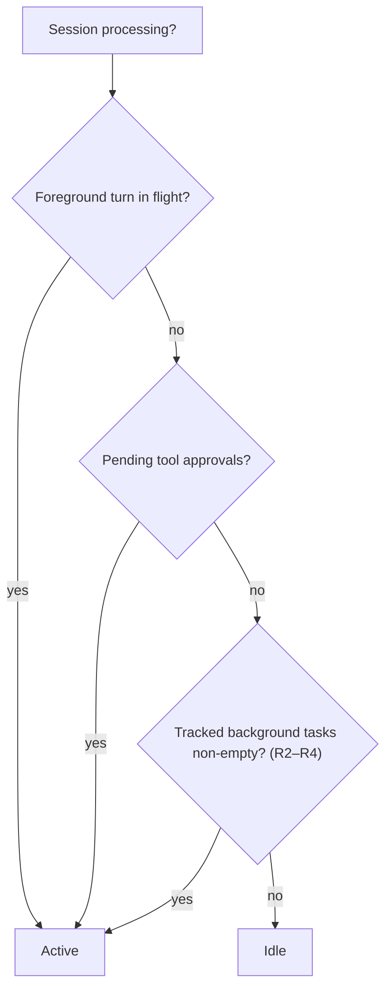
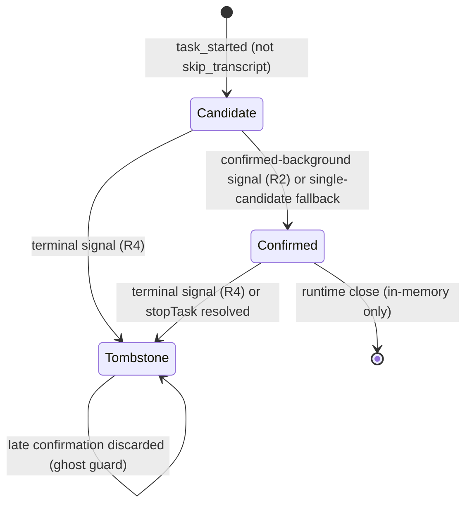
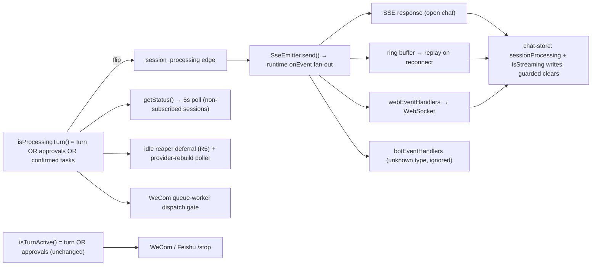

# Session Active State for Background Tasks - Plan

## Goal Capsule

- **Objective:** Keep a session's active state truthful while its background tasks (async sub-agents, background Bash) are still running, and make the stop button a one-click clear.
- **Product authority:** This Product Contract (`ce-brainstorm`), confirmed 2026-07-11.
- **Open blockers:** None for planning. One unverified runtime behavior — whether synchronous sub-agents emit `task_started` — is fenced off by R2's gating; see Outstanding Questions.

---

## Product Contract

### Summary

A session stays active until its background tasks settle, not just until the foreground turn's `result` arrives. The server folds confirmed background tasks into the existing processing state, so the session-list spinner, the open chat's "generating" state, and the idle-reaper guard all extend with no new UI states. The stop button becomes a one-click clear: interrupt the turn and stop every running background task.

### Problem Frame

Today a session's active state comes from the foreground turn alone: a marker set when the first assistant event flows and cleared on `assistant_done` / `interrupted`, plus any pending tool approvals (`src/server/services/session-runtime.ts:166-171,534-536`). When Claude Code launches an async sub-agent or a background Bash command — "run the tests in the background" — the tool result returns immediately with an `async_launched` payload, the turn finishes, and `result` clears the marker while the task is still running. The session list goes quiet and the open chat looks done.

The cost is worse than cosmetic. The runtime idle reaper guards on the same foreground state (`src/server/services/chat-service.ts:933`), so ten minutes after the last subscriber leaves it closes the runtime and its SDK subprocess, killing the still-running task. Meanwhile the SDK already emits the full task lifecycle (`task_started`, `task_progress`, `task_updated`, `task_notification`), and for async sub-agents those messages are the only completion signal at all — the emitter deliberately skips `subagent_done` for async launches (`src/server/services/sse-emitter.ts:793-800`). The client even stores these tasks (`src/client/stores/chat-store.ts:2042-2078`). Only the active-state derivation never consumed them.

### Key Decisions

- **Background tasks extend "processing" rather than getting their own state.** The list spinner, the open-chat generating state, the 5-second status poll, and the idle-reaper guard all key off one processing semantic today; extending it fixes every surface at once and adds no new UI states. A distinct background indicator was offered and rejected.
- **Set membership requires a confirmed-background signal.** A bare `task_started` is not enough: the emitter already observes `async_launched` on async-agent tool results, `backgroundTaskId` on Bash results, and `is_backgrounded` on task patches. Whether synchronous sub-agents emit `task_started` is unverified, and an unverified member could pin a session active forever or be killed by a wrongful clear-all.
- **Stop means clear-all.** One click interrupts the turn and stops every running background task. This was chosen over per-task or turn-only control as the simplest timeline, accepting that there is no way to stop generation while letting a background test finish.
- **Ambient tasks stay invisible.** Tasks flagged `skip_transcript` are housekeeping; counting them would pin sessions permanently, so they never enter the tracked set.

### Requirements

**Active-state semantics (server)**

- R1. A session counts as processing while any tracked background task it started is still running, in addition to an in-flight foreground turn or pending tool approvals.
- R2. A task enters the tracked set only with a confirmed-background signal — an `async_launched` tool result, a `backgroundTaskId` on a Bash result, or an `is_backgrounded` task patch; a bare `task_started` is not sufficient.
- R3. Tasks flagged `skip_transcript` never enter the tracked set.
- R4. A task leaves the tracked set on any terminal signal: a `task_notification` (`completed` / `failed` / `stopped`) or a terminal `task_updated` status (`completed` / `failed` / `killed`).
- R5. The idle reaper must not reclaim a runtime while its session has tracked background tasks running.



**Client presentation**

- R6. A session processing only due to background tasks shows the same active treatment as a foreground turn — list spinner for every session, "generating" for the open session — with no new indicators.
- R7. The open session's "generating" state persists from foreground completion until the last tracked task settles, even though the client clears its streaming flag on the turn's `result` today.

**Stop behavior**

- R8. The stop button always performs a one-click clear: interrupt the in-flight foreground turn (if any) and stop every running tracked background task via the SDK stop API.
- R9. A user-stopped task clears active state through the normal terminal path (R4) via its `stopped` notification; no special-case state repair.

### Key Flows

- F1. Background task outlives its turn
  - **Trigger:** A tool call launches a background task (async sub-agent or background Bash) and the foreground turn continues.
  - **Steps:** The tool result returns immediately with a background-confirmed payload and the task enters the tracked set; the turn's `result` clears the foreground marker; the session stays processing because the set is non-empty; when the task settles, its terminal message removes it; with the set empty, the session idles.
  - **Covers:** R1, R2, R4, R6, R7.
- F2. One-click clear
  - **Trigger:** The user clicks stop while the session shows generating.
  - **Steps:** The client calls the clear-all path; the server interrupts the foreground turn if one is in flight and calls the SDK stop API for every task in the tracked set; each stopped task emits a terminal `stopped` notification and leaves the set through the normal path.
  - **Covers:** R8, R9.

### Acceptance Examples

- AE1. Idle reaper survival
  - **Given** a background task still running and no client subscribed, **when** the 10-minute idle grace expires, **then** the runtime stays alive and the task completes normally. Covers R5.
- AE2. Unconfirmed task
  - **Given** a `task_started` with no confirmed-background signal, **when** the turn's `result` arrives, **then** the session idles normally. Covers R2.
- AE3. Ambient task
  - **Given** a `task_started` flagged `skip_transcript`, **when** it runs to completion, **then** active state never changes. Covers R3.
- AE4. Last settle clears
  - **Given** two background tasks running after the turn ended, **when** the first settles, **then** active state stays; **when** the second settles, **then** it clears. Covers R1, R4, R7.

### Scope Boundaries

- **Deferred for later:** Selective stop — stopping one background task, or stopping the turn while letting tasks finish. The SDK stop API is per-task; v1 exposes only clear-all.
- **Outside v1:** Background tasks spawned *by* sub-agents. Their lifecycle messages carry `parent_tool_use_id` and are dropped by the sub-agent event router today (`src/server/services/sse-emitter.ts:83-93,890-906`); clear-all neither shows nor stops them.
- **Not changing:** No visual distinction between "model generating" and "background task running" (rejected in dialogue). WeCom/Feishu bots inherit the corrected processing semantics automatically and need no bot-specific work.

### Dependencies / Assumptions

- The SDK `query` exposes `stopTask(taskId)`, which stops a running task and emits a terminal `task_notification` with status `stopped` (`node_modules/@anthropic-ai/claude-agent-sdk/sdk.d.ts:2490-2492`). Clear-all depends on it; `SessionRuntime` already holds the `query`.
- Task lifecycle messages for top-level tasks arrive without `parent_tool_use_id`, so they pass through the parent emitter's per-event callback (`src/server/services/sse-emitter.ts:462-477`). The runtime's message loop is long-lived across turns, so terminal notifications landing after `result` are still consumed.
- Assumption: `interrupt()` does not stop background tasks on its own (matches CLI behavior); clear-all therefore calls the stop API explicitly per task.
- Assumption: synchronous Task-tool sub-agents either never emit `task_started` or always pair it with a terminal message. Unverified; R2's gating keeps the design safe either way.

### Outstanding Questions

- **Deferred to planning:** Empirically confirm whether synchronous sub-agents emit `task_started` (watch the SSE log in a real session). R2 gates around the answer, so planning is not blocked; a positive answer would let a later revision relax the gate.
- **Deferred to planning:** Whether the existing stop popover (`src/client/components/PromptInput.tsx:101`) should confirm before clear-all, given its destructive scope.

### Sources / Research

- Active state today — marker set/cleared in the emitter callback, `src/server/services/session-runtime.ts:166-171`; processing formula, `src/server/services/session-runtime.ts:534-536`.
- Idle reaper — 10-minute grace and `isProcessingTurn` deferral, `src/server/services/chat-service.ts:60,925-944`.
- Async sub-agent gap — `finalizeSubagent` skipped on `async_launched`, `src/server/services/sse-emitter.ts:793-800`; sub-agent router drops non-message events, `src/server/services/sse-emitter.ts:83-93,890-906`.
- SDK task model — `task_started` with `subagent_type` / `skip_transcript` (`node_modules/@anthropic-ai/claude-agent-sdk/sdk.d.ts:4217-4239`); `task_notification` terminal statuses (4179-4190); `task_updated` patch with `is_backgrounded` (4243-4256); `stopTask` (2490-2492); `Agent.run_in_background` (`sdk-tools.d.ts:428-430`); `Bash.run_in_background` and `backgroundTaskId` (`sdk-tools.d.ts:472-474,2651-2653`). `task_type` values confirmed from the bundled CLI binary: `local_agent`, `local_bash`, `local_workflow`.
- Client surfaces — 5-second status poll updates streaming only for unsubscribed sessions, `src/client/stores/chat-store.ts:101-148`; tasks store, `src/client/stores/chat-store.ts:2042-2078`; streaming disables the composer, `src/client/components/PromptInput.tsx:199,776,811-813`.
- Every code claim in this contract was verified against these sources by an independent fresh-context pass during the brainstorm; none were refuted.

---

## Planning Contract

Product Contract preservation: R/A/F/AE IDs and product scope unchanged; the Product Contract above is byte-identical to the brainstorm-confirmed version. Both deferred-to-planning Outstanding Questions are resolved below: the stop popover → **KTD-5** (keep the popover, conditional copy); whether synchronous sub-agents emit `task_started` → **KTD-2** (the design is safe either way) plus an execution-time observation step in U1. Scope and the four call-outs below were confirmed at the scoping gate on 2026-07-11: the composer stays locked during background-only processing (KTD-4), bot `/stop` stays turn-only (KTD-6), the stop popover stays (KTD-5), and workflow tasks are excluded from v1 tracking (KTD-2).

### Summary

The server becomes the single authority for "session is processing." `SessionRuntime` gains a background-task tracker: a candidate set fed by raw SDK task messages, a confirmed set fed only by confirmed-background signals (R2), and a tombstone set that stops an already-terminated task from being resurrected by a late confirmation. `isProcessingTurn()` gains a third disjunct — confirmed set non-empty — which extends the idle reaper, the provider-rebuild poller, the 5-second status poll, and the bot queue gate through one predicate change. A new `session_processing { processing, backgroundTaskCount }` event is edge-emitted whenever the predicate flips and force-emitted on every subscribe; because it goes through `SseEmitter.send()`, it rides the existing `onEvent` fan-out to SSE clients, the replay ring buffer, WebSocket handlers, and bot handlers with no new plumbing. The client keeps a `sessionProcessing[sessionId]` slice written by this event and guards its `result` / `interrupted` / `rate_limit` streaming clears on it, so the open session keeps its "generating" state until the last task settles (R7) while every surface keeps today's exact visuals (R6). The stop button's one-click clear becomes `runtime.stopAll()` — a failure-isolated guarded interrupt plus `stopTask` per confirmed task — behind the existing confirmation popover, whose copy mentions background tasks only when some are running. Bots keep today's turn-only stop semantics on a separate predicate.

### Key Technical Decisions

- **KTD-1. One predicate, one new event, server is the only authority.** `isProcessingTurn()` becomes `currentMessageStartId !== undefined || pendingApprovals.size > 0 || confirmedBackgroundTasks.size > 0`. The client never reconstructs membership — it cannot: the confirmed-background signals (`tool_use_id`, `skip_transcript`, `is_backgrounded`, the raw async/Bash tool-result payloads) are dropped by the emitter's whitelist before the wire. The server therefore emits a single `session_processing { processing, backgroundTaskCount }` event carrying the verdict; `backgroundTaskCount` is `confirmedBackgroundTasks.size`. `getStatus()` keeps its current shape — `isProcessing` simply reads the extended predicate (`src/server/services/session-runtime.ts:496-502,534-536`), so the 5-second poll (`src/client/stores/chat-store.ts:101-148`) and `StatusResult` WS response (`src/server/websocket/server.ts:203-204`) inherit R1/R5 untouched.
- **KTD-2. Confirmation-gated membership with two-sided correlation, tombstones, and a single-candidate fallback.** A `task_started` creates only a *candidate* (R2). Confirmation paths: (a) an `async_launched` result from the **Task-tool branch** of `handleUser` (`src/server/services/sse-emitter.ts:793-801`, already scoped to `activeSubagents`, so workflow async results at `:803-824` emit nothing — the v1 workflow exclusion), correlated by `tool_use_id`; (b) a Bash result carrying `backgroundTaskId`, correlated directly by task id; (c) a `task_updated` patch with `is_backgrounded`, correlated by task id. Because `tool_use_id` is optional on `SDKTaskStartedMessage` and ordering is not guaranteed, three hardening rules apply: (1) a **pending-confirmation map** keyed by `tool_use_id` holds an `async_launched` result that arrived before its `task_started`; (2) a **tombstone set** of terminated task ids discards any confirmation arriving after a terminal signal — otherwise a fast-failing task resurrects as a ghost and pins the session forever; (3) a **single-candidate fallback** confirms when an uncorrelated `async_launched` arrives and exactly one unconfirmed candidate with no `tool_use_id` exists (with two or more candidates there is no guess). `skip_transcript` tasks never become candidates (R3). This resolves the deferred sync-sub-agent question by construction: if synchronous sub-agents emit `task_started`, they stay unconfirmed candidates with zero predicate effect and are removed by their terminal signal; if they do not, every candidate is genuinely background. An execution-time `diagLog` observation in U1 records the empirical answer.
- **KTD-3. Edge-triggered emission riding `send()`; force-emit on subscribe.** A new `emitSessionProcessing(processing, backgroundTaskCount)` method calls `SseEmitter.send()` (`src/server/services/sse-emitter.ts:462-478`), whose unconditional `onEvent` callback pushes the event to the ring buffer, bot handlers, and WebSocket handlers (`src/server/services/session-runtime.ts:172-181`) even with no subscriber attached — so replay-on-reconnect works and no heartbeat-style bypass is introduced (contrast the heartbeat learning, which deliberately bypasses the buffer). Edges are evaluated after every `emitter.handle(msg)` in the message loop, and after every approval/interrupt/clear-all mutation, emitting only when the predicate flips. `subscribe()` and `subscribeWebSocket()` additionally force-emit the current verdict after replay and after the pending-approval re-emit (`src/server/services/session-runtime.ts:414-478`), mirroring that hydration precedent: a fresh subscriber mid background-only task has no `currentMessageStartId`-anchored replay, so the force-emit is what restores the spinner; on WS reconnect with `lastEventId` the force-emit runs after replay, so final state wins.
- **KTD-4. Client keeps an authoritative `sessionProcessing` slice; streaming clears are guarded, visuals and lockout unchanged.** New flat-map slices `sessionProcessing: Record<string, boolean>` and `sessionBackgroundTaskCount: Record<string, number>` are written only by the `session_processing` case in `handleSseEvent`/`handleWsEvent`, which also writes `isStreaming[sid] = processing` (the WS envelope is generic — `WsEventMessage.data: unknown` at `src/server/websocket/types.ts:39-46` — so no envelope change is needed). The `result`, `interrupted`, and `rate_limit` cases (`src/client/stores/chat-store.ts:1846-1849,1716-1718,1754-1780`) now clear `isStreaming[sid]` only when `!sessionProcessing[sid]`; everything else in those cases is untouched. R6 is satisfied by construction: the surfaces render from the same `isStreaming` flag a foreground turn drives, so `SessionListItem`/`deriveSessionState` (including its `finished-unread` > `streaming` ordering, identical to the foreground-turn treatment today) and `TaskPanel` need no changes. **Confirmed call-out:** the composer lockout during background-only processing is intentional — "generating" today disables the composer (`src/client/components/PromptInput.tsx:199,776,811-813`), and this is the "simplest timeline" chosen at brainstorm Q2. Unlocking the composer while only background tasks run is a client-only follow-up, already enabled by the `backgroundTaskCount` payload.
- **KTD-5. Clear-all is a composed `stopAll()`; the route stops spawning runtimes; the popover stays.** `SessionRuntime.stopAll()`: snapshot the confirmed set; if `isTurnActive()` (KTD-6) invoke the existing `interrupt()` wrapper (`src/server/services/session-runtime.ts:717-728`) inside its own try/catch, swallowing its rethrow after `diagLog` — the wrapper's eager `emitInterrupted` marker clear and error-note path must be preserved, and a throw must not skip the task loop; then `Promise.allSettled` a `query.stopTask(taskId)` per snapshot task. A resolved `stopTask` also untracks the task locally: the SDK documents a terminal `stopped` notification (the R9 path), and the local untrack is an idempotent safety net in case that notification is ever dropped — it changes nothing observable when the notification arrives. A rejected `stopTask` is logged and the task stays tracked until its own terminal signal or runtime close. A task launched mid-`stopAll` escapes the snapshot — documented, accepted. The interrupt route (`src/server/routes/chat.ts:256-272`) switches from `getOrCreateRuntime` to `getRuntimeIfExists` — clicking a stale stop must not spawn a fresh Claude process — and calls `stopAll()`; with no runtime it returns `200 { ok: true }` (stopping nothing is success; the popover has already closed). **Confirmed call-out:** the existing confirmation popover (`src/client/components/PromptInput.tsx:1000-1074`) stays; its title becomes conditional on `backgroundTaskCount` via a new pluralized i18n key pair (`stopPopover.titleWithTasks_one/_other`) in both `en` and `zh-CN` `chat.json`, with `cancel`/`confirm`/`stopping` unchanged.
- **KTD-6. Bots get a turn-only predicate.** New public `isTurnActive()` = `currentMessageStartId !== undefined || pendingApprovals.size > 0` (the pre-change shape of `isProcessingTurn()`). The WeCom `/stop` gate (`src/server/services/wecom-bot-service.ts:784-785`) and the Feishu `stopTurn` gate (`src/server/services/feishu-bot-service.ts:979-980`) switch to it, so a background-only session truthfully replies 当前没有正在进行的对话。 instead of interrupting an idle query and reporting 已中断 while the task keeps running. **Confirmed call-out:** bot `/stop` stays turn-only — no new kill capability for bot users. Everything else in those handlers is unchanged. The WeCom queue-worker dispatch gate (`src/server/services/wecom-queue-worker.ts:151-152`) keeps the extended `isProcessingTurn()` — proactive bot messages wait for background tasks to settle, matching "bots inherit the corrected processing semantics automatically." This predicate swap is the minimal bot-adjacent change needed to preserve the Scope Boundaries' intent: the bot gates keep today's turn-only semantics while the shared predicate's meaning extends — no new bot behavior is introduced.

### High-Level Technical Design

Tracker signal contract (directional; prose and KTDs are authoritative):

```text
type TaskSignal =
  | { kind: 'started'; taskId; toolUseId?; skipTranscript?; subagentType? }  // task_started, raw fields
  | { kind: 'asyncLaunched'; toolUseId; agentId? }                          // Task-tool async result only (activeSubagents branch)
  | { kind: 'bashBackgrounded'; toolUseId; taskId }                         // Bash result backgroundTaskId
  | { kind: 'backgroundedPatch'; taskId }                                   // task_updated patch.is_backgrounded === true
  | { kind: 'terminal'; taskId }                                            // task_notification completed|failed|stopped;
                                                                            // task_updated completed|failed|killed
```

Tracker operations (directional):

```text
started:        skip if skipTranscript or tombstoned; else candidates[taskId] = { toolUseId }
asyncLaunched:  if a candidate holds toolUseId → confirm it
                else if exactly one candidate exists and it has no toolUseId → confirm it (fallback)
                else pendingConfirmations[toolUseId] = true (consumed when its task_started arrives)
bashBackgrounded / backgroundedPatch: confirm taskId directly (both are confirmed-background signals)
confirm(id):    if tombstoned → discard (ghost guard); else candidates.delete(id); confirmed.add(id); edge()
terminal(id):   candidates.delete(id); confirmed.delete(id); tombstones.add(id) (bounded, FIFO); edge()
edge():         next = isProcessingTurn(); if next !== lastEmitted → emit session_processing(next, confirmed.size)
```

Task membership lifecycle:



A `skip_transcript` task never enters the diagram (R3). Candidates that never confirm have no predicate effect; candidate records are a few bytes each and live only for the runtime's lifetime, so v1 adds no candidate eviction beyond runtime close (a TTL sweep is listed as follow-up if real-world leaks appear).

Predicate consumers and the event fan-out:



### Assumptions

- `agentId` on an `async_launched` result is not assumed to equal the SDK `task_id`; correlation relies on `tool_use_id` and the fallback. `agentId` is carried on the signal only for `diagLog` forensics.
- The provider-rebuild poller (`src/server/services/chat-service.ts:880-895`) keeps the extended predicate: a provider switch during a long background task defers until the task settles — the same treatment as switching mid-turn today. Accepted, documented; Gap-2 ghost states would have made this permanent, which the tombstone rule prevents.
- `stopTask` rejection semantics are unverified; the design treats rejection as "still running" (task stays tracked) and never throws out of `stopAll`.
- `interrupt()` does not stop background tasks (brainstorm assumption); `stopAll` therefore stops them explicitly. If the SDK's `interrupt()` is ever observed to stop tasks too, the per-task `stopTask` calls harmlessly hit already-stopped ids.
- In-memory tracker state lost on sidecar restart is correct by construction: the sidecar owns the Claude subprocess, so the tasks are genuinely dead and `{ processing: false }` is the truth.

### Deferred to Execution

- Observe whether synchronous Task-tool sub-agents emit `task_started` (U1 adds the `diagLog`; the manual verification pass in the Verification Contract records the answer). R2 gates around either result.
- Verify whether workflow runs emit task-level terminal signals (`task_notification` / terminal `task_updated`); if they do, workflow tracking becomes a small follow-up — the emitter seam is already identified (`src/server/services/sse-emitter.ts:803-824`) and workflow async results are distinguishable by `runId`.
- The v1 stop-popover copy is turn-agnostic ("Stop generating and N background tasks?") so it stays truthful in the background-only state, where no turn exists; final wording may be tuned at implementation time without changing the key structure.
- Observe whether the SDK emits a terminal `result` message after `query.interrupt()`. The wrapper's eager `emitInterrupted` clear makes `stopAll` independent of the answer; the observation just confirms the interrupt aftermath.

---

## Implementation Units

### U1. Server background-task tracker, extended predicate, and the `session_processing` event

- **Goal:** `SessionRuntime` tracks confirmed background tasks, folds them into processing, and edge-emits the verdict so every downstream surface (spinner, generating state, poll, reaper) extends through one predicate.
- **Requirements:** R1, R2, R3, R4, R5, R7 (server half); AE1, AE2, AE3, AE4; KTD-1, KTD-2, KTD-3.
- **Dependencies:** none. U1 defines the `TaskSignal` contract U2 implements and the event shape U3 consumes.
- **Files:**
  - `src/server/services/session-runtime.ts` (modify — tracker state and operations per the High-Level Technical Design; extended `isProcessingTurn()`; new public `isTurnActive()`; edge evaluation after each `emitter.handle(msg)` in `runMessageLoop` (`:214-222`) and after approval/interrupt mutations; force-emit in `subscribe()` (`:414-447`) and `subscribeWebSocket()` (`:449-478`) after the replay and approval re-emit; `diagLog` every `started` signal with its `toolUseId`/`subagentType`/`skipTranscript` fields)
  - `src/server/services/sse-emitter.ts` (modify — new `emitSessionProcessing(processing, backgroundTaskCount)` calling `send()`; new optional `onTaskSignal` callback following the existing `onEvent` constructor-callback style)
  - `src/server/types/message.ts` (modify — add `{ type: 'session_processing'; processing: boolean; backgroundTaskCount: number }` to the `SseEvent` union beside `task_started` (`:305`); export the `TaskSignal` union. The client copy of this file is byte-identical and is updated in U3)
  - `src/server/services/session-runtime.test.ts` (modify — add the scenarios below)
  - `src/server/services/chat-service.test.ts` (modify — R5 reaper scenario)
- **Approach:** Add `taskCandidates: Map<string, { toolUseId?: string }>`, `confirmedBackgroundTasks: Set<string>`, `pendingConfirmations: Set<string>` (tool_use_ids), `terminatedTaskIds` tombstones (bounded FIFO set, ~256 entries), and `lastEmittedProcessing?: boolean` to `SessionRuntime`. Implement `handleTaskSignal` and `evaluateProcessingEdge` as private methods per the directional pseudocode, and wire the emitter's `onTaskSignal` to it in the constructor next to the existing `onEvent` wiring (`:167-181`). Extend `isProcessingTurn()` with the third disjunct; add `isTurnActive()`. Emit edges from the single `evaluateProcessingEdge()` helper so all mutation sites share one code path; force-emit on subscribe without suppressing future edges (the force-emit also sets `lastEmittedProcessing`).
- **Execution note:** Characterize the tracker test-first. Drive `handleTaskSignal` with synthetic signals directly (the suite already pokes private state via casts); the integration scenarios inject confirmations the same way, so U1 verifies standalone — the full paired emitter+runtime sequence over real emitter seams is owned by U2. The bug being fixed is a state-interaction bug, so the tests are the proof: write the failing predicate/edge tests before the tracker code.
- **Patterns to follow:** `createMockSdkClient` + `SessionRuntime.open(...)` in `session-runtime.test.ts`; private-state assertions via casts (`(runtime as unknown as { currentMessageStartId?: string })...`); the `SseEmitter(null, (id, event) => events.push(event))` capture pattern in `sse-emitter.test.ts`; `import '../test-utils/test-env.js'` as the first statement of every server test file.
- **Test scenarios:**
  - **Happy path**
    - Covers F1/AE4. Candidate → confirm via `asyncLaunched` (tool_use_id match) → set marker, clear marker (turn `result`) → still processing; terminal signal → removed → single `{ processing: false, backgroundTaskCount: 0 }` edge; the `{ true }` edge fired once, at confirmation.
    - Covers AE4. Two confirmed tasks settling in sequence: exactly one `{ false }` edge, after the second terminal.
    - Covers R2 path (c). Candidate + `backgroundedPatch` → confirmed; predicate extends past turn end.
    - Covers R2 path (b). `bashBackgrounded` with no prior candidate → direct confirm (the Bash result is itself the confirmed signal).
  - **Edge cases**
    - Ghost guard: `started` → `terminal` → late `asyncLaunched` for that task → discarded; predicate never extends; no edges (Critical-Gap-2 regression test).
    - Out-of-order: `asyncLaunched` before `started` → pending confirmation; matching `started` later → confirmed.
    - Fallback: `started` without `toolUseId` + one candidate + uncorrelated `asyncLaunched` → confirmed. With two candidates → no confirmation, predicate unaffected.
    - Covers AE3. `started` with `skipTranscript` → never tracked; no edges.
    - Covers AE2. `started` with no confirmation, turn `result` → idles (`{ false }` edge on the marker clear, if a `{ true }` had fired at turn start).
    - Unconfirmed candidate that never terminates → predicate unaffected (candidate ≠ confirmed).
  - **Error and failure paths**
    - Signals referencing unknown task ids (`terminal` for a never-seen task, `confirm` for a tombstoned id) are no-ops.
  - **Integration scenarios**
    - Covers R5/AE1. In `chat-service.test.ts`: a runtime whose `isProcessingTurn()` stays true (background-only) past `__setIdleGracePeriodForTesting` is not closed and the close reschedules (extends the existing reaper-deferral test pattern at `chat-service.ts:925-944`).
    - Hydration: fresh `subscribe()` during background-only processing (no `currentMessageStartId`) delivers `session_processing { true }` via the force-emit; `subscribeWebSocket` with a `lastEventId` delivers replay first and the force-emit last, so `{ true }` wins.
    - Marker-clear race: a task confirmed via a synthetic `handleTaskSignal`, then a real `result` SDK message fed through the paired emitter — no `{ false }` edge, predicate stays true (this is the original bug, encoded as a test).
- **Verification:** All scenarios green under `npm run test:server`; `npm run lint` clean.

### U2. Emitter → tracker signal wiring

- **Goal:** The emitter feeds the tracker from raw SDK messages at the five seams where the confirmed-background signals are still visible, before its whitelist normalization drops them.
- **Requirements:** R2, R3, R4; KTD-2.
- **Dependencies:** U1 (the `onTaskSignal` hook and `TaskSignal` contract).
- **Files:**
  - `src/server/services/sse-emitter.ts` (modify — signal emission at the five seams)
  - `src/server/services/sse-emitter.test.ts` (modify — add the scenarios below)
- **Approach:** Invoke `onTaskSignal` with raw fields at: `task_started` (`:122-130`, read `tool_use_id`, `skip_transcript`, `subagent_type` before the whitelist send); `task_updated` (`:132-149`, read raw `patch.is_backgrounded` and terminal `patch.status` before the normalized-patch whitelist); `task_notification` (`:165-177`, terminal statuses → `terminal`); `handleUser` tool results (`:774-832`): the `activeSubagents` branch's existing `isAsyncLaunch` computation (`:793-801`) → `asyncLaunched { toolUseId, agentId? }`; the message-level `toolUseResult.backgroundTaskId` string → `bashBackgrounded { toolUseId, taskId }`. The `pendingWorkflows` branch (`:803-824`) stays untouched — workflow async launches emit no signal in v1.
- **Execution note:** Add the signal-capture parameter to the emitter constructor exactly where `onEvent` already is, and assert against captured signal arrays — same fixture style as the existing SSE-event capture tests. Every existing emitter assertion must stay green (the wire events are unchanged; only the side channel is added).
- **Patterns to follow:** the existing `emitter.handle({...} as unknown as SDKMessage)` fixtures in `sse-emitter.test.ts`; the raw-field reading style already used at `:782-783` (`typeof x === 'string' ? x : ''`).
- **Test scenarios:**
  - **Happy path**
    - `task_started` with `tool_use_id`/`subagent_type`/`skip_transcript` → `started` signal carries all three; the existing `task_started` wire event is unchanged.
    - `task_updated` with `patch.is_backgrounded: true` → `backgroundedPatch`; terminal `patch.status` (`completed`/`failed`/`killed`) → `terminal`.
    - `task_notification` (`completed`/`failed`/`stopped`) → `terminal`.
    - Tool result for an active sub-agent with `toolUseResult.status === 'async_launched'` → `asyncLaunched` with the block's `tool_use_id` and the payload's `agentId`.
    - Tool result whose message-level `toolUseResult.backgroundTaskId` is a string → `bashBackgrounded` with the block's `tool_use_id` and the id.
  - **Edge cases**
    - `task_started` without `tool_use_id` → `started` with `toolUseId` undefined (feeds the U1 fallback).
    - Workflow async launch (tool_use_id in `pendingWorkflows`, result has `runId`) → **no** signal (v1 exclusion), and the existing `workflow_start` event is still sent.
    - A synchronous sub-agent's normal completion (`finalizeSubagent` path) → no signal.
  - **Error and failure paths**
    - Malformed raw fields (non-string ids, missing `patch`) produce no signal and no throw — same tolerance as the existing whitelist code.
  - **Integration scenarios**
    - Paired emitter+runtime (this unit owns the fixture; U1 drives its tracker synthetically): a `task_started` + `async_launched` + `result` + `task_notification` SDK sequence produces exactly the U1 edge sequence `{true}` → `{false}`.
- **Verification:** All scenarios green under `npm run test:server`; `npm run lint` clean.

### U3. Client authoritative processing slice, guarded clears, and conditional popover copy

- **Goal:** The client trusts the server's processing verdict: the open session keeps "generating" until the last task settles (R7), every session keeps today's exact active visuals (R6), and the stop popover names the background tasks it will kill.
- **Requirements:** R6, R7; F1; KTD-4, KTD-5 (popover half).
- **Dependencies:** U1 (event shape).
- **Files:**
  - `src/client/types/message.ts` (modify — add the `session_processing` member; **must stay byte-identical to `src/server/types/message.ts`** — the two files are a synced pair)
  - `src/client/stores/chat-store.ts` (modify — `sessionProcessing` and `sessionBackgroundTaskCount` slices; `session_processing` case in `handleSseEvent` (`:1073`) and `handleWsEvent` (`:1039`) that also writes `isStreaming[sid]`; guards on the `result` (`:1846-1849`), `interrupted` (`:1716-1718`), and `rate_limit` (`:1754-1780`) clears; prune both new slices where `sessionStatus` is pruned (`:126-127`))
  - `src/client/components/PromptInput.tsx` (modify — popover title selection at `:1000-1074`: `count > 0 ? t('chat:stopPopover.titleWithTasks', { count }) : t('chat:stopPopover.title')`, count from `sessionBackgroundTaskCount[activeSessionId] ?? 0`)
  - `src/client/i18n/en/chat.json` (modify — `stopPopover.titleWithTasks_one` / `stopPopover.titleWithTasks_other`, turn-agnostic so the copy stays truthful in the background-only state where no turn exists: "Stop generating and {{count}} background task?" / "Stop generating and {{count}} background tasks?")
  - `src/client/i18n/zh-CN/chat.json` (modify — same keys, "停止生成并停止 {{count}} 个后台任务？" for both plural forms, mirroring the `newMessages_one/_other` pattern)
  - `src/client/stores/chat-store.test.ts` (modify — add the scenarios below)
- **Approach:** The `session_processing` case is the only writer of the new slices and sets `isStreaming[sid] = processing` outright (authoritative for subscribed sessions — this also hydrates a session subscribed mid background-only task). The three clear sites become conditional on `!sessionProcessing[sid]`. The poll path (`:101-148`) is untouched: unsubscribed sessions already derive `isStreaming` from `getStatus().isProcessing`, which U1 extends. No changes to `SessionList`, `SessionListItem`, `ChatPanel`, `TaskPanel`, or `interruptSession` — R6 holds by construction and the stop flow reuses the same endpoint with broadened server semantics.
- **Execution note:** Follow the existing suite's patterns (import `handleSseEvent`/`handleWsEvent`, `vi.spyOn(wsClient, 'request')`, `vi.stubGlobal('fetch', ...)`, reset via `useChatStore.setState`). The guards are one-condition changes; assert the retained-flag behavior with the existing fake-frame helpers before touching code. Popover copy is verified manually (see Verification Contract) since `PromptInput` has no test file today.
- **Patterns to follow:** existing `task_started`/`task_updated` cases (`:2042-2078`) for the event-case shape; the `sessionStatus` slice (`:101-148`) for flat-map pruning; the `newMessages_one/_other` keys for the pluralized i18n pattern.
- **Test scenarios:**
  - **Happy path**
    - `session_processing { processing: true, backgroundTaskCount: 1 }` → `sessionProcessing[sid]` true, count 1, `isStreaming[sid]` true (covers mid-task subscription hydration, R7).
    - `session_processing { processing: false, backgroundTaskCount: 0 }` → all three cleared.
  - **Edge cases**
    - Covers R7. `result` while `sessionProcessing[sid]` is true → `isStreaming[sid]` retained; the later `{ false, 0 }` edge clears it (the client-side half of the original bug fix).
    - `interrupted` and `rate_limit` variants of the same guard.
    - `result` with no `sessionProcessing` entry → clears exactly as today (non-regression; existing tests stay green).
    - Poll-driven non-subscribed session: `status` response with `isProcessing: true` still sets `isStreaming` via the existing path (unchanged).
  - **Error and failure paths**
    - A `session_processing` frame with a missing/unknown session id is ignored (same tolerance as existing task events).
  - **Integration scenarios**
    - Sequence `assistant_start` → `session_processing {true,1}` → `result` → `session_processing {false,0}`: `isStreaming` stays true through the `result` and clears on the final edge — the full F1 client walk.
- **Verification:** All scenarios green under `npm run test:client`; `npm run lint` clean; popover copy checked manually per the Verification Contract.

### U4. One-click clear-all (`stopAll`), route hardening, and the bot turn-only predicate

- **Goal:** The stop button interrupts the turn and stops every tracked background task in one click (R8), stopped tasks clear through the normal terminal path (R9), the route no longer spawns a runtime to stop nothing, and bot `/stop` stays truthfully turn-only.
- **Requirements:** R8, R9; F2; KTD-5, KTD-6.
- **Dependencies:** U1 (confirmed set, `isTurnActive`, tombstones/terminate helpers).
- **Files:**
  - `src/server/services/session-runtime.ts` (modify — `stopAll()` per KTD-5; reuse the existing `terminate`/edge helpers from U1 so untracking emits edges)
  - `src/server/routes/chat.ts` (modify — `:256-272`: `getRuntimeIfExists`, `stopAll()`, `200 { ok: true }` when no runtime, comment updated to clear-all; error mapping unchanged)
  - `src/server/services/wecom-bot-service.ts` (modify — `:784-785` gate → `isTurnActive()`)
  - `src/server/services/feishu-bot-service.ts` (modify — `:979-980` gate → `isTurnActive()`)
  - `src/server/services/session-runtime.test.ts` (modify — `stopAll` scenarios)
  - `src/server/routes/chat.test.ts` (modify — add the route's first interrupt-route coverage, following neighboring route-test scaffolding)
- **Approach:** `stopAll()` snapshots the confirmed set, guards the existing `interrupt()` wrapper on `isTurnActive()` inside its own try/catch (swallow its rethrow after `diagLog`, preserving the wrapper's eager `emitInterrupted` marker clear; never skip the task loop), then `Promise.allSettled`s `query.stopTask(id)` per snapshot task; resolved ids are untracked locally (idempotent with the later `stopped` notification — the R9 safety net), rejected ids are logged and left tracked. Bot gates switch predicates with no other change; the WeCom queue-worker gate is deliberately untouched (KTD-6). Client `interruptSession` and `ChatPanel.handleStop` are unchanged — the endpoint and its semantics broaden server-side.
- **Execution note:** Test `stopAll` first with a mock query exposing `interrupt`/`stopTask`/`close` (the suite's `createMockSdkClient` pattern), including the interrupt-throws and stopTask-rejects paths — those two isolation properties are the unit's main value. The route file has no interrupt coverage today, so add it using the same harness the neighboring routes use.
- **Patterns to follow:** `interrupt()` (`src/server/services/session-runtime.ts:717-728`) for the guarded-call and `diagLog` style; existing `chat.test.ts` route fixtures; the bot handlers' existing reply flow (left byte-identical apart from the predicate call).
- **Test scenarios:**
  - **Happy path**
    - Turn in flight + two confirmed tasks → `interrupt` called once, `stopTask` called per task, predicate false afterwards, exactly one final `{ false }` edge (F2).
    - Tasks only, no turn → `interrupt` not called; `stopTask` per task; `{ false }` after the last untrack.
  - **Edge cases**
    - A `stopped` notification arriving after an optimistic untrack → idempotent, no extra edge (R9).
    - Task launched mid-`stopAll` (after the snapshot) → not stopped (documented snapshot semantics).
  - **Error and failure paths**
    - `interrupt()` throws → the `stopTask` loop still runs to completion; failure logged.
    - One `stopTask` rejects → the others still resolve; the rejected task stays tracked and the predicate may stay true (asserted); no throw escapes `stopAll`.
  - **Integration scenarios**
    - Route: no runtime → `200 { ok: true }` and no runtime created (the `getOrCreateRuntime` regression); runtime present → `stopAll` invoked; `ChatError` → existing status/code mapping.
    - WeCom `/stop` with a background-only session → replies 当前没有正在进行的对话。 and does not call `interrupt()`; with a turn in flight → behaves exactly as today (interrupt + `cancelPendingApprovals` + 已中断）. Feishu `stopTurn` mirrors both.
- **Verification:** All scenarios green under `npm run test:server`; `npm run lint` clean.

---

## Verification Contract

| Gate | Command / method | When it applies | Done signal |
|---|---|---|---|
| Server unit/integration tests | `npm run test:server` (node:test via tsx; covers `session-runtime`, `sse-emitter`, `chat-service`, `routes/chat`; every file opens with `test-utils/test-env.js` and uses isolated stores) | Always | Every U1/U2/U4 scenario green |
| Client store tests | `npm run test:client` (vitest jsdom; `chat-store` suite) | Always | Every U3 scenario green |
| Lint | `npm run lint` | Always | Clean |
| Manual end-to-end checklist | Steps below | Before merge | Every step observed |

Manual end-to-end checklist (restart the sidecar first — it serves from `dist/`, and a stale build reproduces old behavior; see the sse-clean-close-retry learning):

1. **Background Bash.** Have the agent run a long command in the background (e.g. a dev build or `sleep 180`). After the turn's `result`, the row spinner and the open session's generating state persist and the composer stays disabled (intended, KTD-4); when the command finishes, generating clears promptly.
2. **Async sub-agent.** Launch an `Agent` with `run_in_background`; same persistence; the sub-agent's completion clears the state. While it runs, check the diag log for the U1 `task_started` observation line and record whether synchronous sub-agents emit it (deferred question).
3. **Clear-all.** During step 1 or 2, click stop: the popover shows the background-task title with the right count; confirming interrupts the turn (if any), shows the tasks as stopped/killed in `TaskPanel`, and clears generating. With no tasks running, the popover shows the plain title and stop behaves exactly as before.
4. **Two-task settle (AE4).** Launch two background tasks; the first settling keeps generating; the second clears it.
5. **Reaper survival (AE1/R5).** Unsubscribe from the session (navigate away) with a task running and wait out the idle grace — locally shorten it via the `__setIdleGracePeriodForTesting` knob or the grace constant and restore it after; the runtime stays alive and the task completes.
6. **Hydration.** Close to tray mid-task and reopen → spinner restored. Drop and re-establish the WebSocket (or reload the renderer) → state restored after replay.
7. **Accepted consequences.** Switch provider mid-task → the rebuild defers until tasks settle, then applies cleanly. A `deriveSessionState` finished-unread session with a running task shows the same treatment a foreground turn would produce today.
8. **Bot surfaces.** WeCom `/stop` during background-only processing replies 当前没有正在进行的对话。; during a real turn it interrupts exactly as before.

## Definition of Done

- R1–R5 hold by the extended predicate and tracker, proven by U1/U2 tests including the ghost-guard, fallback, pending-confirmation, and AE2/AE3/AE4 scenarios.
- R6/R7 hold by construction (identical `isStreaming`-driven surfaces) and by the U3 guard tests; visuals verified manually (checklist step 1).
- R8/R9 hold via `stopAll()` and its U4 tests, including interrupt-failure isolation, `stopTask` rejection, optimistic-untrack idempotency with the `stopped` notification, and snapshot semantics.
- AE1 verified by the reaper test (U1) and checklist step 5.
- All gates in the Verification Contract pass: `npm run test:server`, `npm run test:client`, `npm run lint`, and the manual checklist.
- The two `types/message.ts` copies remain byte-identical; i18n keys added to both `en` and `zh-CN`.
- Bot `/stop` replies truthfully on background-only sessions; the queue-worker and rebuild-poller couplings are the documented accepted consequences, nothing else.
- `CHANGELOG.md` gains a Keep-a-Changelog entry for the fix, and the change lands as Conventional Commits with this plan committed alongside the code (per the commit-plan-and-brainstorm-files-with-code-changes convention).
