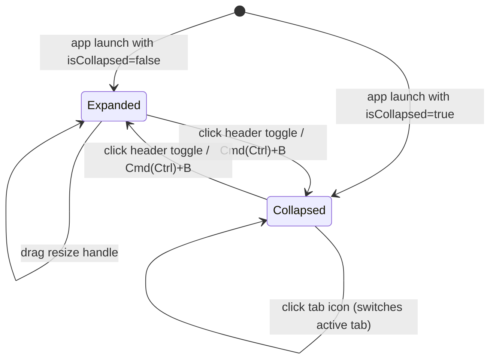

# Sidebar Collapse and Expand - Plan

## Goal Capsule

- **Objective:** Add a collapse/expand control to the main left sidebar so users can reclaim horizontal space on small screens while keeping tab switching within one click.
- **Product Authority:** UI chrome preference; no server-side or workspace-scoped data changes.
- **Stop Conditions:** The sidebar toggles between expanded and a narrow icon rail, the previous width restores on expand, the toggle lives in the chat panel header, and the state persists across restarts.
- **Execution Profile:** Client-only React change; no sidecar or native work.
- **Tail Ownership:** Frontend; no ongoing operational concerns.

---

## Product Contract

*Product Contract updated to reflect the chat-panel-header toggle placement decided during the brainstorm.*

### Summary

Add a toggle that collapses the main left sidebar into a narrow icon rail showing the sessions, todos, and files tab icons. The toggle is a single icon button in the chat panel header. The collapsed state and width persist across app restarts, and a keyboard shortcut toggles the state.

### Problem Frame

The main sidebar is always visible and currently occupies 200–600px of horizontal space. Users who run the app in a small window or on a compact screen need more room for the chat panel, but they still want quick access to switch between sessions, todos, and files. Today the only recourse is manual resizing, which does not go below 200px and still leaves a large panel when it is not actively being used. A fixed bottom button inside the sidebar also wastes vertical space in the rail.

### Requirements

- R1. The sidebar supports two states: expanded and collapsed.
- R2. In the collapsed state the sidebar renders as a narrow icon rail, wide enough to display the three tab icons comfortably (target ~48px).
- R3. Clicking a tab icon in the collapsed rail switches the active tab without expanding the sidebar.
- R4. Clicking the toggle in the chat panel header toggles the sidebar between expanded and collapsed.
- R5. Expanding the sidebar restores the width it had before the last collapse.
- R6. The collapse/expand state persists across application restarts.
- R7. A keyboard shortcut toggles collapse and expand.
- R8. Tab icons and the header toggle show accessible labels via tooltips.
- R9. When expanded, the existing drag-to-resize handle on the sidebar's right edge continues to work exactly as it does today.
- R10. The sidebar no longer renders a collapse button at the bottom of the expanded panel or an expand button at the bottom of the collapsed rail.

### Key Decisions

- **Icon rail instead of fully hidden.** A fully hidden sidebar would save the most space, but the primary use case is small-window multitasking where users still want one-click tab switching. The rail keeps that affordance at the cost of a small persistent strip.
- **Toggle lives in the chat panel header.** Placing the single toggle in the header saves vertical space inside the sidebar rail, keeps the control visible regardless of sidebar state, and does not add a floating element on the window edge.
- **One toggle icon for both states.** The header button changes its icon and tooltip to indicate the action it will perform (collapse vs. expand) rather than showing two separate buttons.
- **Restore previous resized width on expand.** Re-opening to the last manually dragged width respects the user's layout preference; falling back to a default width would force re-adjustment every time.

### Scope Boundaries

- The file panel, settings panel, analytics panel, and other secondary surfaces are not affected.
- A fully-hidden zero-width sidebar mode is out of scope; only the icon-rail collapse state is supported.
- A floating button on the sidebar/content edge or window title bar is out of scope.
- Touch or swipe gestures are out of scope.
- Changing tab order, tab icons, or tab behavior beyond collapse-aware rendering is out of scope.

### Dependencies / Assumptions

- The existing `useSidebarWidth` hook and localStorage persistence pattern in `src/client/hooks/` will be reused for the collapsed state.
- The existing `sidebar.collapse` and `sidebar.expand` i18n keys will be reused for the header toggle tooltip.
- The project already bundles Radix UI tooltip primitives.

### Sources & Research

- `src/client/components/Sidebar.tsx` — current sidebar with three tabs and right-edge resize handle.
- `src/client/components/ChatPanel.tsx` — chat panel header where the toggle will live.
- `src/client/App.tsx` — horizontal layout housing Sidebar, FilePanel, and ChatPanel.
- `src/client/hooks/use-sidebar-width.ts` — existing width/collapse persistence hook.
- `src/client/hooks/use-sidebar-keyboard-shortcut.ts` — global Cmd/Ctrl+B shortcut.
- `src/client/components/ui/tooltip.tsx` — Radix-based tooltip primitive.
- `src/client/i18n/en/common.json` and `src/client/i18n/zh-CN/common.json` — existing sidebar label keys.
- `src/client/components/Sidebar.test.tsx` — existing jsdom tests for tab rendering.
- `src/client/components/ChatPanel.test.tsx` — existing jsdom tests for the chat panel.
- `docs/plans/2026-05-29-002-feat-resizable-sidebar-plan.md` — prior plan that implemented resizing and explicitly deferred collapsible behavior.

---

## Planning Contract

### Key Technical Decisions

- **Keep collapsed state in `useSidebarWidth`.** `useResizableWidth` manages width persistence. Adding `isCollapsed` and `toggleCollapse` to the same hook keeps sidebar chrome state in one place and follows the existing `localStorage` persistence pattern.
- **Store previous width separately from collapsed width.** When the user collapses, the current width is saved as the "previous width" and the live width becomes the rail width. On expand, the live width is restored to the saved previous width. This avoids losing the user's dragged width across collapse cycles.
- **Move the toggle out of `Sidebar` into `ChatPanel`.** `Sidebar` now only renders the rail/tab content and the resize handle. The collapse/expand trigger is rendered by `ChatPanel` in its header, receiving state and a callback from `App`. This removes the need for a bottom button inside the sidebar.
- **Global keyboard shortcut remains in `App`.** Cmd/Ctrl+B is a common "sidebar toggle" convention. Listening on `window` from `App` keeps the shortcut discoverable and avoids propagating keyboard concerns into `Sidebar` or `ChatPanel`. The existing guard ignores events when the user is typing in an input, textarea, or contenteditable.
- **Reuse the existing tooltip primitive and i18n keys.** The Radix-based tooltip component is already styled and accessible. The header toggle reuses `sidebar.collapse` / `sidebar.expand`, so no new translation keys are required.

### High-Level Technical Design

The sidebar collapse state is a simple two-state machine driven by one hook and wired into `App`, `Sidebar`, and `ChatPanel`.

State transitions:
- On **collapse**, the current resized width is saved and the sidebar width becomes the fixed rail width.
- On **expand**, the saved resized width is restored.
- The drag handle is visible only in the `Expanded` state.
- Tab icons are visible and clickable in both states.
- The header toggle icon and tooltip reflect the action that will happen on the next click.

### Assumptions

- The keyboard shortcut will not conflict with an existing browser or app shortcut on any supported platform; if a conflict surfaces during implementation, the shortcut can be changed or made configurable in settings.
- The collapsed rail width can be a fixed Tailwind class value (e.g., `w-12`) rather than user-configurable.
- Existing jsdom tests can render the `Sidebar` and `ChatPanel` components using the existing `I18nextProvider` wrapper.

### Sequencing

1. Remove the bottom collapse/expand buttons from `Sidebar`.
2. Add the toggle button to the `ChatPanel` header.
3. Wire the new props in `App` and drop the old `onToggleCollapse` prop from `Sidebar`.
4. Update tests.

---

## Implementation Units

### U1. Extend sidebar width hook to track collapsed state

- **Goal:** Add `isCollapsed` and `toggleCollapse` to the sidebar state hook, persist the collapsed flag, and remember the pre-collapse width so expansion restores it.
- **Requirements:** R1, R5, R6
- **Dependencies:** None
- **Files:**
  - Modify: `src/client/hooks/use-sidebar-width.ts`
  - Create: `src/client/hooks/use-sidebar-width.test.ts`
- **Approach:** Wrap or extend the existing `useResizableWidth` usage. Introduce a second `localStorage` key for the collapsed boolean. On collapse, store the current width under a "previous width" key and set the live width to the rail width. On expand, restore the previous width. Clamp restored values within `[200, 600]` to respect current bounds.
- **Patterns to follow:** `src/client/hooks/use-resizable-width.ts` for localStorage read/write guards.
- **Test scenarios:**
  - Happy path: hook initializes with `isCollapsed: false` and the stored width when no collapsed flag exists.
  - Happy path: calling `toggleCollapse` switches `isCollapsed` and updates the persisted flag.
  - Edge case: expanding after collapse restores the width that existed before collapse, not the default width.
  - Edge case: a corrupted or missing `localStorage` entry falls back to sensible defaults without throwing.
- **Verification:** Hook tests pass; `npm run test:client src/client/hooks/use-sidebar-width.test.ts` succeeds.

### U2. Remove sidebar bottom toggle buttons

- **Goal:** Strip the fixed bottom collapse/expand buttons from `Sidebar` so the only remaining toggle surface is the chat panel header.
- **Requirements:** R10
- **Dependencies:** None
- **Files:**
  - Modify: `src/client/components/Sidebar.tsx`
  - Modify: `src/client/components/Sidebar.test.tsx`
- **Approach:** Remove the `onToggleCollapse` prop from `SidebarProps`. Delete the bottom collapse button in the expanded branch and the bottom expand button in the collapsed branch. Remove the now-unused `ChevronLeft` and `ChevronRight` imports. Keep the icon rail, tab switcher, tab content, and resize handle unchanged.
- **Patterns to follow:** Existing tooltip usage for the collapsed rail icons.
- **Test scenarios:**
  - Happy path: expanded `Sidebar` renders text tabs and the resize handle and no collapse button.
  - Happy path: collapsed `Sidebar` renders icon buttons and no expand button.
  - Edge case: the resize handle is present when expanded and absent when collapsed.
- **Verification:** Sidebar tests pass; `npm run test:client src/client/components/Sidebar.test.tsx` succeeds.

### U3. Add sidebar toggle to ChatPanel header

- **Goal:** Render a single icon button in the chat panel header that toggles the sidebar.
- **Requirements:** R4, R8
- **Dependencies:** U2
- **Files:**
  - Modify: `src/client/components/ChatPanel.tsx`
  - Create/Modify: `src/client/components/ChatPanel.test.tsx`
- **Approach:** Add `isSidebarCollapsed` and `onToggleSidebarCollapse` optional props to `ChatPanel`. Position the button absolutely on the left side of the existing header so the centered session/model text is unchanged. Use `PanelLeft` when expanded and `PanelLeftOpen` when collapsed, with tooltips drawn from the `common` namespace (`sidebar.collapse` / `sidebar.expand`). Only render the button when a callback is provided so the component stays usable in isolation.
- **Patterns to follow:** Existing header styling; `src/client/components/ui/tooltip.tsx` for tooltips; `cn()` for conditional class merging.
- **Test scenarios:**
  - Happy path: when a callback is provided, the header renders a toggle button with the collapse label while expanded.
  - Happy path: the button label switches to expand when `isSidebarCollapsed` is true.
  - Happy path: clicking the button calls `onToggleSidebarCollapse`.
  - Edge case: when no callback is provided, no toggle button is rendered.
- **Verification:** ChatPanel tests pass; `npm run test:client src/client/components/ChatPanel.test.tsx` succeeds.

### U4. Wire collapse state and keyboard shortcut in App

- **Goal:** Connect the sidebar collapse hook to `Sidebar` and `ChatPanel`, and keep the global keyboard shortcut.
- **Requirements:** R4, R6, R7
- **Dependencies:** U2, U3
- **Files:**
  - Modify: `src/client/App.tsx`
- **Approach:** Continue destructuring `isCollapsed`, `toggleCollapse`, `width`, and `setWidth` from `useSidebarWidth`. Pass `isCollapsed` and `width` to `Sidebar`. Pass `isSidebarCollapsed` and `onToggleSidebarCollapse` to `ChatPanel`. Remove the old `onToggleCollapse` prop from `Sidebar`. Keep `useSidebarKeyboardShortcut(toggleSidebarCollapse)` in `App`.
- **Patterns to follow:** Existing hook usage and prop drilling in `App`.
- **Test scenarios:**
  - Integration (manual): pressing Cmd/Ctrl+B toggles the sidebar when no text input is focused.
  - Integration (manual): pressing Cmd/Ctrl+B while typing in the prompt input does not toggle the sidebar.
- **Verification:** The app compiles, the sidebar toggles via the keyboard shortcut in dev, and the collapsed/expanded state restores correctly across reloads.

### U5. Update tests for the new toggle placement

- **Goal:** Cover the new header-toggle behavior and ensure the removed sidebar buttons are no longer expected.
- **Requirements:** R1–R10 (where feasible under jsdom)
- **Dependencies:** U2, U3
- **Files:**
  - Modify: `src/client/components/Sidebar.test.tsx`
  - Modify: `src/client/components/ChatPanel.test.tsx`
- **Approach:** Remove Sidebar tests that asserted bottom collapse/expand buttons. Add ChatPanel tests asserting the header toggle renders with the correct label per state and calls the callback on click.
- **Patterns to follow:** Existing `I18nextProvider` wrapper and workspace/chat-store mocks.
- **Test scenarios:**
  - Happy path: expanded `Sidebar` renders text tabs and the resize handle.
  - Happy path: collapsed `Sidebar` renders icon buttons.
  - Happy path: `ChatPanel` header renders the toggle with the collapse label when expanded.
  - Happy path: `ChatPanel` header renders the toggle with the expand label when collapsed.
  - Happy path: clicking the header toggle calls the toggle handler.
- **Verification:** `npm run test:client src/client/components/Sidebar.test.tsx src/client/components/ChatPanel.test.tsx` succeeds.

---

## Verification Contract

- **Automated test command:** `npm run test:client src/client/components/Sidebar.test.tsx src/client/components/ChatPanel.test.tsx src/client/hooks/use-sidebar-width.test.ts`
- **Lint command:** `npm run lint`
- **Type-check command:** `npx tsc -b`
- **Manual verification:**
  - Launch the app with `npm run dev:client` (or `npm run tauri:dev` for the full desktop shell).
  - Toggle the sidebar with the header button and with Cmd/Ctrl+B.
  - Confirm the sidebar restores to the previous width after expanding.
  - Confirm tab switching works in the collapsed rail.
  - Confirm tooltips appear on the header toggle and collapsed icons.
  - Confirm the sidebar has no bottom toggle buttons in either state.
  - Resize the sidebar when expanded and confirm collapse/expand preserves the resized width across reloads.

---

## Definition of Done

- All implementation units are complete and the app compiles without type errors.
- `npm run lint` passes with zero warnings.
- Automated tests for the hook, `Sidebar`, and `ChatPanel` pass.
- The sidebar toggles between expanded and collapsed states via both the header button and the keyboard shortcut.
- Collapsed-state width, expanded width, and collapsed flag persist across application reloads.
- The header toggle and collapsed rail show accessible tooltips in both English and Chinese.
- No bottom toggle buttons remain in the sidebar.
- No dead code, experimental files, or unrelated changes remain in the diff.
- The `CHANGELOG.md` is updated with a user-facing entry for the new collapse/expand behavior.
