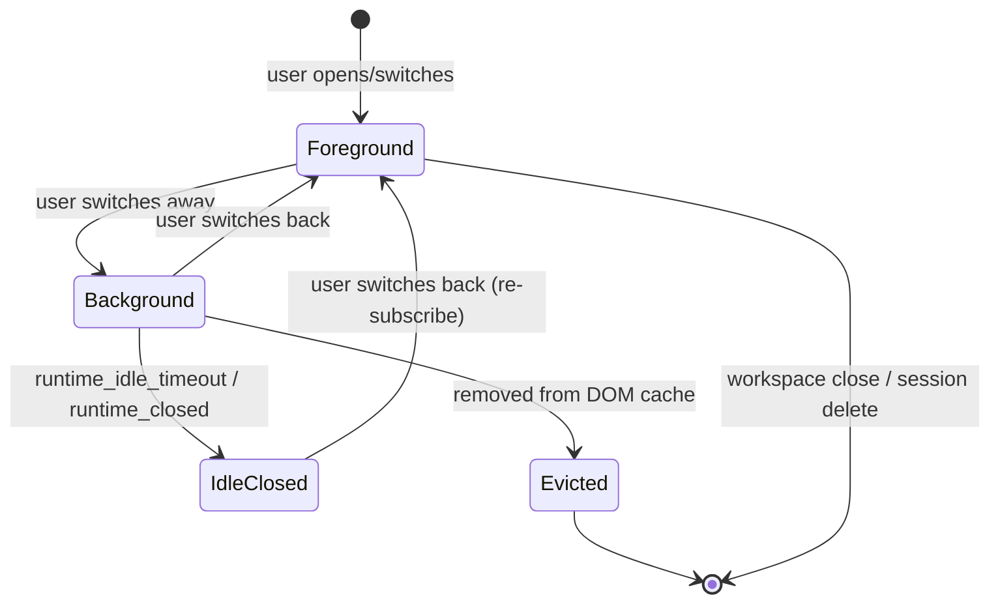

# Background Session Streaming - Plan

## Goal Capsule

- **Objective:** Keep every recently-active open session subscribed and rendered in the background until an idle timeout expires, so switching back shows the latest stream state without waiting for catch-up.
- **Product authority:** The user expects a desktop app to keep background tabs alive, not behave like a throttled browser tab.
- **Open blockers:** None.
- **Tail ownership:** Client-side subscription and rendering logic, plus a minimal server-side unsubscribe guard.

## Product Contract

### Summary

Make session switches focus changes instead of subscription rebuilds. Any session in the current workspace that has recent activity stays subscribed and mounted in the React tree while hidden; it continues receiving streaming events until it goes idle or is evicted from the DOM cache. When the user switches back, the session is already up to date.

### Problem Frame

Today the client tears down every SSE/WebSocket subscription except the foreground session. If a user starts a stream in Session A, switches to Session B, and does not return quickly, the ring-buffered events for Session A can be evicted. When the user finally switches back, the session looks idle even though work happened. This breaks the desktop-app tab metaphor and forces users to baby-sit the active session.

### Key Decisions

- **Idle-timeout subscription lifetime, not stream-only lifetime.** Async agents and background tasks may emit events after the foreground assistant turn appears finished, so we keep the subscription alive until the session is genuinely idle.
- **Reuse the server runtime idle timeout as the idle policy.** The server-side idle grace period is 10 minutes (`RUNTIME_IDLE_GRACE_PERIOD_MS`). The client relies on this rather than introducing its own timeout.
- **Raise `DOM_CACHE_LIMIT` from 3 to 5.** The current limit only allows 2 background sessions; raising it supports the stated 3–5 concurrent stream expectation.
- **Full hidden React tree, not state-only skeleton.** Background sessions remain mounted and visually hidden so switching back is instant. We accept the additional memory and render cost.
- **Centralized background-stream registry over patching the session-switch guard.** A registry owns subscribe, keep-alive, and teardown logic as concurrency grows.
- **Include a minimal server-side unsubscribe guard.** The server currently calls `runtime.unsubscribe()` unconditionally, which can tear down a sibling SSE/WebSocket handler. A small guard prevents this mixed-channel bug.

### Requirements

**Subscription lifecycle**

- R1. When a session in the current workspace becomes active (user opens or switches to it), the client subscribes it.
- R2. When the user switches away from a session, its subscription is kept alive if the session still has recent activity.
- R3. A background subscription is torn down only when the session is removed from the DOM cache or its idle timeout expires.
- R4. The foreground session is always subscribed whenever it has activity.

**Rendering**

- R5. Every cached session is mounted in the React tree, even when it is not visible.
- R6. Non-foreground sessions are visually hidden but continue receiving state updates from their subscription.
- R7. Switching back to a background session shows its current content immediately, without re-fetching messages or waiting for new events.

**Scope and behavior**

- R8. No notification badges, toasts, or auto-focus behavior are introduced for background streams.
- R9. The change is scoped to the current workspace; switching workspaces may tear down subscriptions for the previous workspace.
- R10. The server event protocol remains unchanged; a minimal runtime guard prevents mixed-channel teardown when multiple handlers exist.

### Key Flows

- **F1. User starts a stream and switches away**
  - **Trigger:** User sends a message in Session A, then selects Session B.
  - **Steps:** Session A is added to the background registry and stays subscribed; its message view remains mounted and hidden; SSE events update Session A's state; Session B becomes the foreground session.
  - **Outcome:** Switching back to Session A shows the latest content instantly.

- **F2. Background session goes idle**
  - **Trigger:** No events or activity for Session A beyond the idle timeout.
  - **Steps:** The server closes the runtime and emits `runtime_closed`; the client removes Session A from the background registry and tears down its subscription; Session A remains in the DOM cache until evicted.
  - **Outcome:** Switching back to Session A re-subscribes and replays buffered events if they are still available.

### Acceptance Examples

- **AE1. Concurrent streaming sessions.** User has five sessions streaming at once. All five stay subscribed and mounted hidden; foreground switches are instant.
- **AE2. Stream ends but async work continues.** Session A's assistant turn finishes, but a subagent or background task keeps emitting events. Session A's subscription stays alive until the idle timeout expires.
- **AE3. Idle teardown.** Session A receives no events for longer than the idle timeout. Its subscription closes automatically; switching back later re-subscribes and may replay from the ring buffer.
- **AE4. No new notifications.** While Session A streams in the background, the app does not badge the session list, show toasts, or auto-switch focus.

### Scope Boundaries

- **Deferred for later:** Server-side replay buffer expansion as a reliability safety net.
- **Deferred for later:** Cross-workspace background streaming.
- **Outside this change:** UI notifications, unread counts, or auto-switching for background streams.
- **Outside this change:** User-level "pin/keep-open" controls.
- **Outside this change:** Virtualization or lazy rendering optimizations beyond hidden paint.

### Dependencies / Assumptions

- The client store already tracks `isStreaming` and `lastActivityAt` per session.
- Idle timeout policy: reuse the server runtime idle timeout (`RUNTIME_IDLE_GRACE_PERIOD_MS`, currently 10 minutes).
- `DOM_CACHE_LIMIT` will be raised from 3 to 5 to support 3–5 concurrent streams.
- The server runtime supports multiple web event handlers; a small unsubscribe guard is needed so mixed SSE/WebSocket handlers do not interfere.
- Exact performance acceptance criteria for 5 hidden sessions will be defined during implementation.

### Outstanding Questions

- **Deferred to Implementation:** Exact CSS hidden strategy and whether the existing `inert` attribute is kept, replaced with `aria-hidden`, or removed for background sessions.
- **Deferred to Implementation:** Performance acceptance criteria for 3–5 concurrent hidden sessions (memory, frame time, switch latency).

### Sources / Research

- Grounding dossier used during the brainstorm: `/tmp/compound-engineering/ce-brainstream/1784032911/grounding.md`
- Related prior plans: `docs/plans/2026-05-17-014-feat-subagent-streaming-display-plan.md`, `docs/plans/2026-05-18-006-fix-sse-stream-resume-on-reconnect-plan.md`

---

## Planning Contract

**Product Contract preservation:** Changed from the original requirements-only version: R10 was relaxed to allow the minimal server-side unsubscribe guard, and Key Decisions were added for the DOM cache limit increase and the server guard. All other Product Contract text and IDs are preserved.

### Key Technical Decisions

- **KTD1. Additive subscriptions.** `subscribeToSession` stops closing other sessions. `setActiveSession` becomes a pure focus change that only subscribes the target if it is not already subscribed.
- **KTD2. Background-stream registry in `chat-store`.** A session-scoped registry tracks which sessions should stay alive in the background. Entries are added on streaming/activity, removed on `runtime_closed` or DOM-cache eviction, and cleared on workspace cleanup.
- **KTD3. Raise `DOM_CACHE_LIMIT` from 3 to 5.** This matches the stated 3–5 concurrent stream expectation while keeping memory bounded.
- **KTD4. Preserve hidden `inert`/`hidden` rendering.** Non-foreground sessions stay mounted with the existing hidden/inert attributes. We will only relax `inert` if it is found to suppress needed effects.
- **KTD5. Minimal server-side unsubscribe guard.** WebSocket unsubscribe removes only that socket's handler. SSE heartbeat and response state are cleared only when no SSE response and no web handlers remain.

### High-Level Technical Design

The subscription lifecycle moves from a single-active model to a registry model:

The client keeps a `backgroundSessions` registry. `setActiveSession` no longer tears down other subscriptions. `subscribeToSession` is additive. When a session starts streaming or receives an event, it enters the registry. The server keeps the runtime alive while any handler is subscribed; after the 10-minute idle timeout it closes the runtime and emits `runtime_closed`, which removes the session from the registry.

On the server, `SessionRuntime` separates WebSocket handler removal from SSE teardown. The WebSocket server's `unsubscribe` path removes the socket-specific handler and only calls `runtime.unsubscribe()` when no handlers remain for that session.

### Assumptions

- The desktop client uses WebSocket subscriptions (`wsClient`).
- Server runtime idle timeout remains 10 minutes and is the authoritative idle signal.
- Hidden MessageList instances can be rendered without breaking existing scroll/load-more behavior by gating on `isVisible`.

### Sequencing

1. U1 and U5 can start in parallel (client subscription refactor and server guard are independent).
2. U2 builds on U1.
3. U3 builds on U1 and U2.
4. U4 builds on U3.
5. U6 validates all prior units.

---

## Implementation Units

### U1. Client — Make session subscriptions additive

- **Goal:** Stop `subscribeToSession` from closing other sessions and make `setActiveSession` a focus change.
- **Requirements:** R1, R2, R4.
- **Dependencies:** None.
- **Files:** `src/client/stores/chat-store.ts`.
- **Approach:** Remove the `closeSessionSubscriptions(sessionId)` call from `subscribeToSession`. In `setActiveSession`, subscribe the target only if it is not already subscribed; do not close other subscriptions. Update `createSession`, `addSession`, and `forkSession` so they do not tear down unrelated subscriptions. Keep `closeSessionSubscriptions` for workspace cleanup and explicit teardown paths.
- **Patterns to follow:** Existing `sessionSubscriptions` map, `lastEventId` cursor, `wsClient.onReconnect` resubscription.
- **Test scenarios:**
  - Subscribing Session B while Session A is streaming does not close Session A's subscription.
  - Switching from Session A to Session B leaves both subscribed.
  - Creating a new session does not tear down background subscriptions.
- **Verification:** `src/client/stores/chat-store.test.ts` passes; manual multi-session stream test shows two sessions updating.

### U2. Client — Add background-stream registry

- **Goal:** Track which sessions should stay subscribed in the background and manage their lifecycle.
- **Requirements:** R2, R3, R4.
- **Dependencies:** U1.
- **Files:** `src/client/stores/chat-store.ts`.
- **Approach:** Add a `backgroundSessions` registry (a `Set<string>` or equivalent). When a session starts streaming (`isStreaming[sessionId] === true`) or receives an SSE event, add it to the registry and ensure it is subscribed. On `runtime_closed`, remove the session and call `closeSingleSessionSubscription`. On DOM-cache eviction, remove the evicted session. On workspace cleanup, clear the registry.
- **Patterns to follow:** Existing session-scoped maps (`isStreaming`, `lastActivityAt`, `serverNonce`).
- **Test scenarios:**
  - A session is added to the registry when streaming starts.
  - `runtime_closed` removes the session from the registry and closes its subscription.
  - Evicting a session from the DOM cache removes it from the registry.
- **Verification:** `src/client/stores/chat-store.test.ts` passes; registry state is inspectable during a live run.

### U3. Client — Raise DOM cache limit and keep hidden rendering

- **Goal:** Support up to four background sessions mounted hidden alongside the foreground session.
- **Requirements:** R5, R6, AE1.
- **Dependencies:** U1, U2.
- **Files:** `src/client/stores/chat-store.ts` (constant), `src/client/components/ChatPanel.tsx`.
- **Approach:** Change `DOM_CACHE_LIMIT` from 3 to 5. Keep `ChatPanel.tsx` mapping `domCache` sessions with the existing `hidden` class and `inert` attribute for non-active sessions. Only relax `inert` if hidden MessageList effects are found to be suppressed during U4.
- **Patterns to follow:** Existing `domCache` eviction logic in `setActiveSession`, `touchDomCache`, `createSession`, `addSession`.
- **Test scenarios:**
  - Five sessions are cached; four are hidden and one is visible.
  - Switching foreground toggles visibility without remounting the component tree.
- **Verification:** `src/client/components/ChatPanel.test.tsx` passes; manual check shows five session views in DOM.

### U4. Client — Suppress hidden MessageList side effects

- **Goal:** Hidden sessions should receive state updates but not auto-scroll or fetch older messages.
- **Requirements:** R6, R7.
- **Dependencies:** U3.
- **Files:** `src/client/components/MessageList.tsx`, `src/client/components/VirtualizedMessageList.tsx`.
- **Approach:** Guard auto-scroll and load-more effects with `isVisible === false` early returns. Ensure `VirtualizedMessageList` does not remeasure while hidden.
- **Patterns to follow:** Existing `isVisible` prop already passed from `ChatPanel`.
- **Test scenarios:**
  - A hidden `MessageList` does not auto-scroll when new events arrive.
  - A hidden `MessageList` does not trigger an older-messages fetch.
  - `VirtualizedMessageList` does not remeasure while `isVisible` is false.
- **Verification:** `src/client/components/MessageList.test.tsx` passes; manual multi-session stream shows no visible scroll jumps on switch.

### U5. Server — Guard runtime unsubscribe for mixed handlers

- **Goal:** Prevent one channel's unsubscribe from tearing down a sibling SSE/WebSocket handler.
- **Requirements:** R10.
- **Dependencies:** None.
- **Files:** `src/server/services/session-runtime.ts`, `src/server/websocket/server.ts`.
- **Approach:** Add `unsubscribeWebSocket(handler)` to `SessionRuntime` that removes the handler from `webEventHandlers` and only stops the heartbeat / clears `activeRes` when no SSE response exists and no web handlers remain. Update `src/server/websocket/server.ts` `unsubscribe` and disconnect paths to remove the socket-specific handler and call the guarded `runtime.unsubscribe()` only when no handlers remain for that session.
- **Patterns to follow:** Existing `addWebEventHandler` / `removeWebEventHandler` Set operations; `activeRes` / heartbeat lifecycle in `unsubscribe`.
- **Test scenarios:**
  - WebSocket unsubscribe with no other handlers clears SSE state as before.
  - WebSocket unsubscribe while an SSE response is active leaves the SSE response and heartbeat intact.
  - Multiple WebSocket sockets subscribed to the same session: one disconnect does not affect the other.
- **Verification:** `src/server/services/session-runtime.test.ts` and `src/server/websocket/server.test.ts` pass; existing streaming tests show no regression.

### U6. Tests — Cover background subscription lifecycle

- **Goal:** Add focused test coverage for the new background-stream behavior.
- **Requirements:** All R-IDs, AE1–AE4.
- **Dependencies:** U1–U5.
- **Files:** `src/client/stores/chat-store.test.ts`, `src/client/components/ChatPanel.test.tsx`, `src/client/components/MessageList.test.tsx`, `src/server/services/session-runtime.test.ts`, `src/server/websocket/server.test.ts`.
- **Approach:** Add unit tests for additive subscriptions, registry transitions, DOM cache limit, hidden MessageList behavior, and server unsubscribe guard. Extend existing tests rather than replacing them.
- **Test scenarios:**
  - Covers AE1: five concurrent streams are all subscribed and mounted hidden.
  - Covers AE2: registry keeps a session alive after the foreground turn finishes.
  - Covers AE3: `runtime_closed` tears down the background subscription.
  - Covers AE4: background streaming does not emit notification state changes.
- **Verification:** `npm run test:client` and `npm run test:server` pass with the new cases.

---

## Verification Contract

| Gate | Command | Purpose |
|------|---------|---------|
| Lint | `npm run lint` | Catch style and type errors across changed files. |
| Client unit tests | `npm run test:client` | Validate chat-store, ChatPanel, and MessageList changes. |
| Server unit tests | `npm run test:server` | Validate session-runtime and WebSocket server guard. |
| Manual smoke | Open the desktop app, start streams in 5 sessions, switch between them | Confirm instant visual switch and no lost events. |

---

## Definition of Done

- All implementation units (U1–U6) are complete and merged.
- `npm run lint`, `npm run test:client`, and `npm run test:server` pass.
- Manual smoke test confirms five concurrent streams stay subscribed and hidden; switching foreground sessions is instant.
- Existing single-session streaming, reconnect, approval, and session-switch behavior shows no regression.
- The server guard does not break existing SSE or WebSocket behavior.
- Performance of five hidden sessions is measured and deemed acceptable, or a follow-up optimization task is filed.
- Any abandoned experimental code from the implementation process is removed from the diff.

---

## System-Wide Impact

- **Memory and render cost:** Up to five sessions are mounted in the React tree. This increases memory and background render work; the trade-off was accepted for instant switching.
- **Server runtime lifetime:** Background subscriptions keep runtimes alive until the 10-minute idle timeout. This increases server-side memory usage compared to immediate teardown.
- **WebSocket handler tracking:** The server now tracks per-socket handlers and guards shared runtime teardown.
- **User experience:** Users no longer need to remain on a streaming session to avoid losing progress; switching is instant.

## Risks & Dependencies

| Risk | Mitigation |
|------|------------|
| Five hidden sessions cause unacceptable memory or frame-time cost. | Measure during implementation; file a follow-up for virtualization if thresholds are exceeded. |
| `inert` attribute suppresses needed effects in hidden sessions. | Validate during U4; relax to `aria-hidden` only if necessary. |
| Server guard changes existing unsubscribe behavior. | Covered by existing and new server tests; keep the guard conditional on handler count. |
| Longer runtime lifetime increases server memory pressure. | Bounded by the existing 10-minute idle timeout. |
