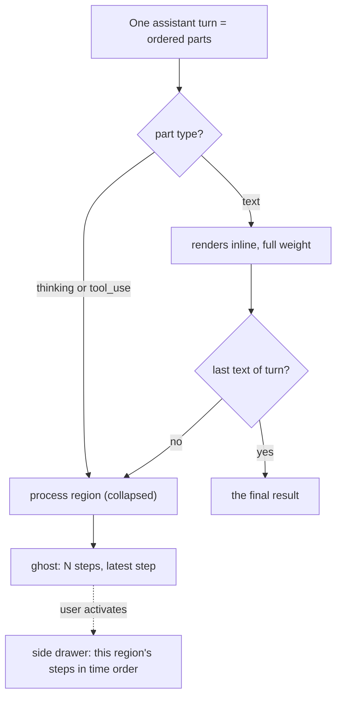
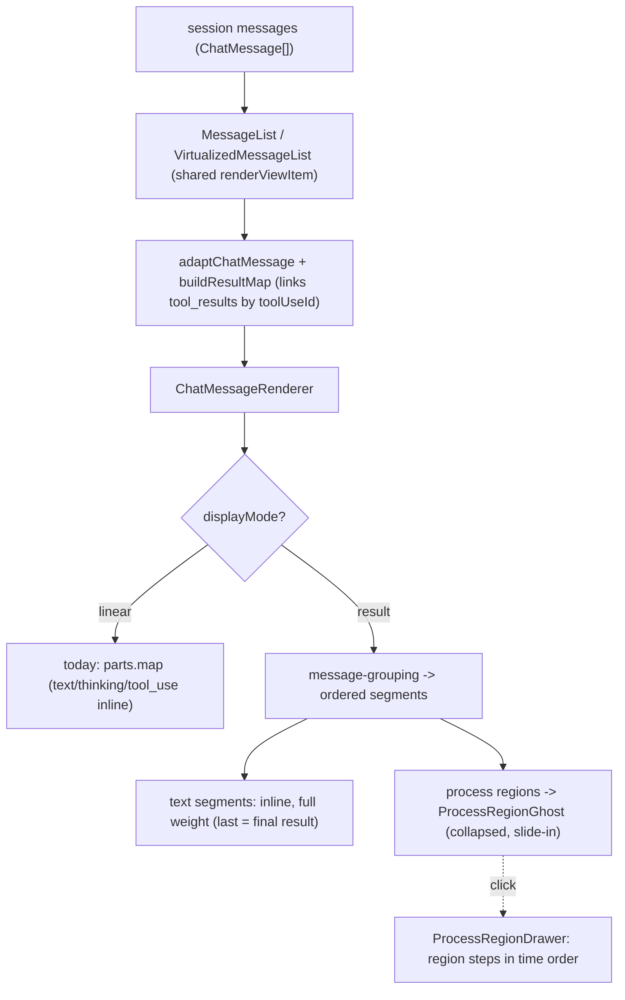

# Result-Focused Message Display Mode - Plan

## Goal Capsule

- **Objective:** Add a result-focused display mode to the chat that collapses an agent turn's thinking and tool-use runs into a minimal, expandable element so the text results dominate each turn.
- **Product authority:** Product behavior comes from the requirements-only brainstorm (preserved below); the implementation approach is owned by this plan.
- **Execution profile:** Client-only React/Vite change. No server route, message data model, or persistence-schema change.
- **Stop conditions:** Result mode ships behind a global header toggle, the linear mode is preserved unchanged, and flows F1/F2 plus acceptance examples AE1–AE4 pass under `npm run test:client` and a manual check.
- **Open blockers:** None. No-final-text handling is accepted as a v1 default; persistence is a single global preference; scope is the primary (non-bot) chat panel.

---

## Product Contract

Product Contract unchanged from the requirements-only brainstorm (R/F/AE IDs and text preserved). This pass adds the Planning Contract, Implementation Units, Verification Contract, and Definition of Done.

### Summary

A second chat display mode that makes the agent's text results the focus of each turn. Within an assistant turn, runs of thinking and tool calls collapse into a minimal one-line "ghost" that shows only the latest step and opens into a side drawer for that region's full timeline; all of the turn's text stays visible inline. New sessions open in this result-focused mode by default, with a header toggle back to today's linear view.

### Problem Frame

Today the chat renders every message linearly: thinking blocks, tool calls, and the agent's text answers all carry similar visual weight. In a long agentic turn with many tool calls, finding the actual answer means scrolling past a wall of process noise, and the result never gets visual priority. This is friction every time a turn does real work.

### Key Decisions

- **Aggressive result-focus, and it is the default.** Process regions collapse to a minimal ghost line, and new sessions open in result-focused mode. The point is to let the agent's text answers dominate; process detail is on demand only.
- **Per-region drawer, not a whole-turn panel.** Each collapsed region opens its own drawer for that run's steps. This matches the existing per-tool drawer pattern and keeps each exploration scoped to one region.
- **View-only transform, no storage change.** Grouping is derived from existing message parts at render time; the message data model and persistence are unchanged. This contains risk and reuses the current model.
- **Approvals and interrupts stay prominent.** Action-required events are never folded into a ghost, because hiding them would block the user.
- **Ghost stays collapsed; no auto-expand.** The ghost live-updates the latest step but never auto-opens, so the completed result stays the focus after a turn ends.

### Requirements

**Mode and toggle**

- R1. The chat offers two display modes: the existing linear mode and a new result-focused mode.
- R2. New sessions open in result-focused mode by default.
- R3. A header toggle switches modes and persists the choice as a preference.
- R4. Switching modes reinterprets the same session messages without reloading the session.

**Turn grouping and visible content**

- R5. In result-focused mode, consecutive thinking and tool-use parts within a turn form one process region, broken whenever a text part appears.
- R6. Every text part renders inline at full weight, including mid-turn text.
- R7. A turn's last text part is treated as the final result.

**Collapsed process region (the ghost)**

- R8. A process region renders collapsed as a single low-weight ghost line showing the region's latest step, a step count, and an expand affordance.
- R9. As steps stream in, the ghost updates its latest step with a slide-in-from-bottom motion.
- R10. The ghost stays collapsed during and after the turn; expansion is user-initiated only.

**Expand into a drawer**

- R11. Activating a ghost opens a side drawer containing that region's steps in time order.
- R12. The drawer reuses the existing side-drawer affordances (resizable, Escape to close).

**Edge behaviors**

- R13. Approval requests and other action-required interrupts render prominently and are not folded into a ghost.
- R14. A turn ending without a text part produces no final-result block and terminates at its last ghost.

How a turn's parts map to the result-focused view:

### Key Flows

- F1. Live turn in result-focused mode
  - **Trigger:** The user sends a prompt and the assistant turn begins streaming.
  - **Steps:** Thinking and tool-use parts accumulate into one or more process regions; each region's ghost shows its latest step and updates with a slide-in as new steps arrive; text parts render inline at full weight as they arrive; on completion the last text part is the final result and the ghosts remain collapsed.
  - **Outcome:** The user watches progress with minimal noise and sees the result prominently.
  - **Covered by:** R1, R5, R6, R7, R8, R9, R10
- F2. Expand a process region
  - **Trigger:** The user activates a ghost.
  - **Steps:** A side drawer opens showing that region's steps in time order (thinking, tool-use, results); the drawer is resizable and closes on Escape.
  - **Outcome:** The user reviews the hidden process for one region without leaving the result-focused view.
  - **Covered by:** R11, R12

### Acceptance Examples

- AE1. Turn with mid-turn text
  - **Covers R5, R6, R7.** Given a turn with parts `[thinking, tool_use, text, thinking, tool_use, text_final]`, when rendered in result-focused mode, then two process regions collapse to ghosts and both text parts render inline, the last being the final result.
- AE2. Turn with no final text
  - **Covers R14.** Given a turn whose last part is a tool_use with no trailing text, when rendered, then no final-result block appears and the turn ends at its last ghost.
- AE3. Approval mid-turn
  - **Covers R13.** Given a tool_use that triggers an approval request, when the request fires, then it renders prominently outside any ghost and awaits user action.
- AE4. Expand region
  - **Covers R11, R12.** Given a collapsed ghost for a region with three steps, when the user activates it, then a drawer opens showing those three steps in time order and closes on Escape.

### Scope Boundaries

- Deferred for later: applying the mode to bot, WeCom, and Feishu session viewers, unless they share this chat surface.
- Out of scope: any change to the message data model or persistence; replacing the linear mode (it remains available via the toggle); a whole-turn or whole-session drawer (per-region was chosen).

#### Deferred to Follow-Up Work

- A per-session persistence override (this v1 uses one global preference; per-session would mirror `FastMode`/`ApprovalMode` and need a session field plus PUT route).
- A one-time first-run hint that the default view changed, for existing users on upgrade.

### Dependencies and Assumptions

- The existing message model (one assistant message with interleaved parts; tool_results arriving as separate user messages re-linked by `toolUseId`) is sufficient to derive regions with no schema change. Verified against the codebase.
- The existing side-drawer pattern is reused for the drawer. Verified.
- Assumption: collapsed regions change the heights the virtualized message list measures; resolving that is a planning concern, not a product decision.

### Outstanding Questions

- Deferred to planning:
  - Whether bot, WeCom, and Feishu session viewers share this chat surface and should receive the mode. → Resolved: scope is the primary (non-bot) chat panel; other viewers keep linear rendering.
  - The ghost's exact "latest step" label (tool name alone, or with a status indicator). → Resolved as a planning assumption: latest step is the segment's last part (a tool_use shows its tool name; a thinking part shows a "thinking" state); final label polish is deferred to implementation.
  - How tool_result parts stored as separate messages are pulled into a region's drawer view. → Resolved: reuse `buildResultMap` to link each tool_use to its result by `toolUseId`, as the main renderer does today.
  - Height estimation in the virtualized list for collapsed and expanded states. → Resolved: see KTD5; handled by the existing ResizeObserver-backed `measureElement`.
  - Whether the first-run hint ships together with the default-mode flip, or the flip ships without it as an accepted tradeoff. The default change is what creates the onboarding need, so coupling them may be warranted; currently listed as follow-up work (see Deferred to Follow-Up Work). → Open: decide before implementation.

### Sources / Research

- Current rendering and data model (verified): `src/client/components/MessageList.tsx` and `src/client/components/ChatMessageRenderer.tsx` (linear `parts.map` today); `src/server/types/message.ts` (message and part types); `src/client/components/chat-message-adapter.ts` (`buildResultMap` re-links tool_results by `toolUseId`); `src/client/stores/chat-store.ts` (streaming reducer, `updateAssistantPart`).
- Drawer and toggle precedent (verified): `src/client/components/SubagentDrawer.tsx` and `src/client/components/SubagentConversation.tsx` (resizable `aside`, Escape, reuses the message renderer inside); `src/client/components/ChatPanel.tsx` (drawer mount and `onOpenDrawer` threading); `src/client/components/FastModeToggle.tsx` and `src/client/components/ApprovalModeToggle.tsx` (header toggle precedent).
- Persistence, animation, virtualization, and test patterns (verified): `src/client/hooks/use-app-settings.ts` (global localStorage preference blob + setter); `src/client/components/ToastContainer.tsx` (enter-animation pattern); `src/client/components/VirtualizedMessageList.tsx` (`@tanstack/react-virtual` ResizeObserver-backed `measureElement`); `src/client/components/MessageList.test.tsx` and `src/client/stores/chat-store.test.ts` (test patterns).
- Institutional learnings: `docs/solutions/integration-issues/sse-stream-resume-on-reconnect-2026-05-18.md` (store streaming state is deliberately fragile around resume — validates deriving the view rather than mutating the store); `docs/solutions/integration-issues/sse-clean-close-retry-2026-05-22.md` (approvals arrive on a separate SSE channel and `approvalQueue`, not as message parts — validates R13 needing no special code).
- No display or view-mode toggle exists in the chat today; the absence was verified by search.

---

## Planning Contract

### Key Technical Decisions

- **KTD1. Grouping is a pure derived transform in the shared render path, not a store mutation.** A pure function turns an assistant message's parts into ordered view regions (text parts and process regions); `ChatMessageRenderer` consumes them when its `displayMode` prop is `'result'`. Both the virtualized and non-virtualized lists render through `ChatMessageRenderer`, so both paths are covered from one place. `displayMode` is an explicit prop (default `'linear'`), not a value the renderer reads globally — the two message lists pass the live setting, while the per-region drawer and the existing subagent drawer pass `'linear'` so they never inherit result mode and always render their parts linearly. Rationale: the chat store's streaming state is deliberately fragile around resume (load-from-server guards against clobbering it), so deriving the view avoids colliding with that logic; an explicit prop keeps result mode scoped to the primary chat panel.
- **KTD2. Display mode is a single global preference, default `result`, backed by a shared reactive store.** It lives in `useAppSettings` (`src/client/hooks/use-app-settings.ts`), like font size and theme, and keeps its localStorage backing — but `useAppSettings` must be converted from per-component `useState` into a shared reactive store (Zustand with `persist`, or a Context + `useSyncExternalStore`/storage listener) so the toggle write and the renderer read share one source. As written today the hook gives each caller an independent state copy, so the header toggle would mutate only its own component and the chat would not re-render until a full reload — breaking R4. Making the store reactive also fixes the same latent bug for font size. Rationale: matches the brainstorm's global-preference analogy, needs no server change, and makes new sessions always open in result mode. Per-session persistence (mirroring `FastMode`/`ApprovalMode`) was considered and deferred.
- **KTD3. No animation library; slide-in via Tailwind plus a hand-rolled keyframe.** A `slide-in-from-bottom` keyframe is added to `src/client/index.css` `@layer utilities` and driven by the `entered` + `requestAnimationFrame` class-swap pattern already used by `ToastContainer.tsx`, with a `motion-reduce:transition-none` guard. Rationale: the repo intentionally replaced `motion/react` with CSS keyframes; following that avoids introducing a dependency.
- **KTD4. Approvals need no special handling.** Approvals arrive on a separate SSE channel (`pending_approval`/`pending_question`) and render through a separate `approvalQueue` state, not as message parts, so they are structurally outside what the grouping folds. R13 is satisfied by leaving the approval surface untouched. Validated against `docs/solutions`.
- **KTD5. Virtualization is safe by construction.** `@tanstack/react-virtual`'s `measureElement` is `ResizeObserver`-backed, so it auto-remeasures when a collapsed ghost's height differs from an expanded linear message's. The repo's explicit `requestAnimationFrame(() => virtualizer.measure())` pattern is the fallback if a transition delays the height change.

### High-Level Technical Design

Render pipeline for a turn (the grouping lives in the shared path so both list implementations are covered):

### Assumptions

- Grouping is computed per assistant message at render time from its `parts`; tool_results (separate user messages) are linked by `toolUseId` via the existing `buildResultMap`, both inline and inside the drawer.
- The ghost's "latest step" is the region's last part: a tool_use shows its tool name; a thinking part shows a "thinking" state. The region is live while that last part's `isStreaming` is true (the message-level `isStreaming` is dropped by `adaptChatMessage`, so liveness is derived from the part). The live indicator is an `animate-pulse` `ClockIcon` matching `SubagentDrawer`'s running state. Final label polish is deferred to implementation.
- Bot, WeCom, and Feishu session viewers and the subagent drawer explicitly pass `displayMode='linear'` to `ChatMessageRenderer`; result mode applies only to the primary chat panel's message lists.

### Sequencing

U2 (grouping function) and U1 (preference and toggle) are independent foundations. U3 (ghost rendering, gated on mode) depends on U1 and U2. U4 (drawer) depends on U3. Recommended order: U2, then U1, then U3, then U4.

---

## Implementation Units

### U1. Display-mode preference and header toggle

- **Goal:** Add a global result/linear display-mode preference (default `result`) and a header toggle to switch it, so the rest of the work has a mode value to read.
- **Requirements:** R1, R2, R3, R4.
- **Dependencies:** None.
- **Files:**
  - `src/client/hooks/use-app-settings.ts` (modify) — convert from per-component `useState` to a shared reactive store (keep localStorage backing; see KTD2) and add `displayMode: 'result' | 'linear'` (default `'result'`) with a reactive setter.
  - `src/client/components/DisplayModeToggle.tsx` (create) — boolean toggle result↔linear, cloned from `FastModeToggle.tsx`'s shape (same button classes, `aria-pressed`, `Tooltip`, `useTranslation('chat')`) but reading/writing the global `useAppSettings` value rather than the session; pick a `lucide-react` icon such as `AlignLeft` or `Rows3`.
  - `src/client/components/PromptInput.tsx` (modify) — render `<DisplayModeToggle />` inside the existing `{sessionId && !isBotSession}` toggle block, beside `FastModeToggle` and `ApprovalModeToggle`.
  - `src/client/components/DisplayModeToggle.test.tsx` (create).
- **Approach:** A single global preference in the now-reactive `useAppSettings` (localStorage-backed, no server change). The toggle writes the shared store; both message lists read it reactively and pass `displayMode` down as a prop to `ChatMessageRenderer` (KTD1/KTD2), so flipping the toggle re-renders the chat in place (R4 — reinterpret without reload). New sessions inherit the global default `result` (R2). The toggle is `!isBotSession` gated like its siblings, so bot sessions neither show it nor enter result mode.
- **Patterns to follow:** `FastModeToggle.tsx` (toggle button shape, aria, tooltip); `src/client/hooks/use-app-settings.ts` (localStorage blob + setter).
- **Test scenarios:**
  - Reading the setting returns the persisted value, or the `'result'` default when unset; the setter writes to the settings blob and the returned value updates.
  - `DisplayModeToggle` renders, reflects the current mode via `aria-pressed`, and toggling flips the stored preference.
- **Verification:** The toggle appears in the header for non-bot sessions; flipping it changes the stored preference; a reload preserves it; a brand-new session renders in result mode by default.

### U2. Turn-grouping transform

- **Goal:** Produce ordered view segments from an assistant message's parts: consecutive thinking and tool-use parts form process regions, each text part is a text segment, and the last text part is marked final; turns without text produce no final segment.
- **Requirements:** R5, R6, R7, R14.
- **Dependencies:** None (pure function).
- **Files:**
  - `src/client/components/message-grouping.ts` (create) — a pure function taking a message's parts and returning ordered segments (`{ type: 'text', part, isFinal }` and `{ type: 'process', parts, latest }`). No React, no store access.
  - `src/client/components/message-grouping.test.ts` (create).
- **Approach:** Walk parts once; accumulate consecutive `thinking`/`tool_use` parts into a process region; emit a text segment for each `text` part; tag the final text segment `isFinal`. If no text part exists, emit no `isFinal` segment so the turn ends at its last process region (R14). tool_result parts live in separate messages and are linked later by `buildResultMap`, so they are not grouped here.
- **Patterns to follow:** the part reasoning in `src/client/components/chat-message-adapter.ts`.
- **Test scenarios:**
  - Covers AE1, R5, R6, R7: parts `[thinking, tool_use, text, thinking, tool_use, text_final]` yield two process regions and two text segments, the last text marked final.
  - Covers AE2, R14: parts ending in `tool_use` yield no final segment; the turn ends at its last process region.
  - Leading text then process: `[text, thinking, tool_use]` yields a non-final text segment then a process region.
  - Text-only turn: `[text]` yields one text segment marked final.
  - Empty parts: `[]` yields no segments.
  - Single thinking part: `[thinking]` yields one process region and no text segment.
- **Verification:** The function is pure and fully unit-tested; grouping matches the data model (tool_results excluded, handled by `buildResultMap` downstream).

### U3. Ghost rendering and live slide-in (result mode)

- **Goal:** In result mode, render each process region as a minimal ghost line that live-updates the latest step with a slide-in-from-bottom while staying collapsed; render text segments inline at full weight. Leave linear mode unchanged.
- **Requirements:** R1, R4, R6, R8, R9, R10.
- **Dependencies:** U1 (the `displayMode` value), U2 (the grouped segments).
- **Files:**
  - `src/client/components/ChatMessageRenderer.tsx` (modify) — accept a `displayMode` prop (default `'linear'`); when `'result'`, consume U2's regions (render text parts at full weight and process regions through the new ghost); when `'linear'`, keep today's `parts.map`.
  - `src/client/components/MessageList.tsx` and `src/client/components/VirtualizedMessageList.tsx` (modify) — read `displayMode` from `useAppSettings` and pass it to `ChatMessageRenderer` in both render paths.
  - `src/client/components/ProcessRegionGhost.tsx` (create) — a `<button>` (keyboard-focusable, with a composed `aria-label` such as "Process region, {N} steps, latest: {label}") showing step count, latest-step label (in an `aria-live="polite"` region), an expand chevron, a destructive error badge when any tool in the region failed, and an `animate-pulse` `ClockIcon` live indicator while the region's last part is streaming; accepts an `onOpen` callback for U4.
  - `src/client/index.css` (modify) — add a `slide-in-from-bottom` keyframe in `@layer utilities` with a `motion-reduce:transition-none` guard. Unlike `ToastContainer`'s one-shot mount animation, re-trigger it per new step by keying the animated latest-step node on the latest-part identity (`key={latestPart.toolUseId ?? 'thinking'}`) so each new step remounts and replays the keyframe.
  - `src/client/components/ProcessRegionGhost.test.tsx` (create); extend `src/client/components/MessageList.test.tsx` (or add a renderer test) for the grouped render and the linear regression.
- **Approach:** `ChatMessageRenderer` takes `displayMode` as a prop, threaded from both message lists (KTD1), so the result-mode branch covers virtualized and non-virtualized paths together. The "latest step" is the region's last part; the region is live while that part's `isStreaming` is true (the message-level flag is dropped by `adaptChatMessage`). Derive a `hasError` flag per region (any `tool_result` with `isError`) to drive the error badge. The ghost never auto-expands (R10). The virtualized list's `measureElement` auto-remeasures the shorter ghost height (KTD5); if a transition delays it, call `requestAnimationFrame(() => virtualizer.measure())` per the repo pattern.
- **Patterns to follow:** `ToastContainer.tsx` (enter animation), `src/client/index.css` `@layer utilities` keyframes, the existing text rendering inside `ChatMessageRenderer.tsx`.
- **Test scenarios:**
  - Covers R8: a process region renders the ghost with its step count, latest-step label, an error badge when a tool in the region failed, and a focusable button with an accessible name.
  - Covers R9: when the latest part changes during streaming, the ghost updates and the slide-in class applies.
  - Covers R10: the ghost stays collapsed after the turn completes (no auto-expand).
  - Covers R6: text segments render inline at full weight, including mid-turn text.
  - Covers R1, R4 (regression): in linear mode, `ChatMessageRenderer` renders parts exactly as today, with no ghost.
- **Verification:** Result mode shows ghosts plus visible text; linear mode is byte-for-byte unchanged; the animation respects `motion-reduce`; a session with more than 50 messages still renders and measures correctly.

### U4. Per-region side drawer

- **Goal:** Activating a ghost opens a side drawer showing that region's steps in time order (thinking, tool-use, and their results), reusing the existing drawer pattern; Escape closes it.
- **Requirements:** R11, R12.
- **Dependencies:** U3 (the ghost emits the open action).
- **Files:**
  - `src/client/components/ProcessRegionDrawer.tsx` (create) — clone `SubagentDrawer.tsx`'s shape (`<aside>`, resizable 300–600, Escape-to-close) plus dialog focus management (move focus in on open, trap Tab, return focus to the activating ghost on close); body renders the region's parts linearly by reusing `ChatMessageRenderer` with `displayMode='linear'`, receiving the session-level `resultMap` (built in `MessageList`/`VirtualizedMessageList` over the full message list) — not a `buildResultMap` recomputed over the region slice, which contains no `tool_result` parts.
  - `src/client/components/ChatPanel.tsx` (modify) — add drawer state for an open process region (keyed by message id and region index, plus a width state), mirroring `openDrawerToolUseId`/`subagentPanelWidth`; render the drawer as a sibling after the message column; wire the ghost's `onOpen`; clear the open-drawer state when `displayMode` transitions away from `result` (R4) so no orphaned drawer persists.
  - `src/client/components/ProcessRegionDrawer.test.tsx` (create).
- **Approach:** Reuse the established `SubagentDrawer`/`WorkflowDetailPanel` aside pattern and the `SubagentConversation` technique of rendering linear detail via `ChatMessageRenderer` inside a drawer — no new drawer infrastructure. The drawer shows only the clicked region's parts in time order (per-region, R11), rendered with `displayMode='linear'`. tool_results are linked to their tool_use by `toolUseId` via the session-level `resultMap` passed in from the message list (a region slice has no `tool_result` parts to build a map from).
- **Patterns to follow:** `SubagentDrawer.tsx`, `SubagentConversation.tsx`, and the drawer mounting in `ChatPanel.tsx`.
- **Test scenarios:**
  - Covers AE4, R11: activating a ghost opens the drawer scoped to that region's steps in time order.
  - Covers R12: Escape closes the drawer and leaves the message list state unchanged.
  - Each region opens its own drawer (per-region, not whole-turn).
  - Integration: tool_results render alongside their tool_use inside the drawer.
- **Verification:** The drawer opens and closes correctly, shows the region's steps in time order, resizes, and closes on Escape.

---

## Verification Contract

- `npm run lint` — ESLint passes on all touched `.ts`/`.tsx`.
- `npm run test:client` — Vitest (jsdom) covers: `message-grouping.test.ts` (U2, including AE1 and AE2 cases), `ProcessRegionGhost.test.tsx` and the grouped-render test (U3), `ProcessRegionDrawer.test.tsx` (U4, AE4), and `DisplayModeToggle.test.tsx` plus the `use-app-settings` hook test (U1). No server tests are needed (no server change).
- Manual check via `npm run dev:client` (or `npm run tauri:dev`): open a session and confirm result mode is the default; toggle to linear and back and confirm the view reinterprets without a reload (R4); watch a streaming turn and confirm the ghost live-updates with the slide-in (F1, R9); click a ghost and confirm the drawer opens with that region's steps and closes on Escape (F2, AE4); in a session with more than 50 messages confirm correct rendering and height measurement; trigger an approval mid-turn and confirm it surfaces outside the ghost (AE3, R13).
- `npm run test:browser` if a `*.browser.test.tsx` is added for the toggle interaction.

---

## Definition of Done

- Global: all four units implemented; `npm run lint` clean; `npm run test:client` green; flows F1 and F2 and acceptance examples AE1–AE4 verified under the manual check; `CHANGELOG.md` updated (user-facing change).
- Per-unit:
  - U1: the toggle is present for non-bot sessions, persists across reload, and new sessions open in result mode.
  - U2: the grouping function is pure and unit-tested, including the AE1 and AE2 cases.
  - U3: result mode renders ghosts and visible text, linear mode is unchanged, the animation respects `motion-reduce`, and the virtualized path measures correctly.
  - U4: the drawer opens per-region, shows the region's steps in time order, closes on Escape, and links tool_results.
- Cleanup: no dead-end or experimental code from abandoned approaches is left in the diff.
