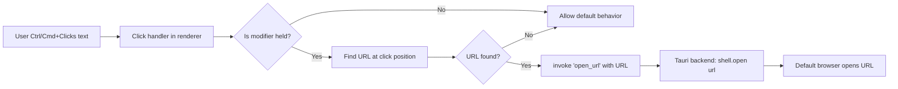

## Goal Capsule

- **Objective:** Allow users to open `http://` and `https://` URLs found in chat message text (assistant responses, user messages, and tool output text) in the system default browser by holding Ctrl (Windows/Linux) or Cmd (macOS) and clicking the URL. Plain clicks keep existing behavior.
- **Authority hierarchy:** This plan > CLAUDE.md conventions > general React/Tauri best practices.
- **Stop conditions:** Stop when the URL regex and click handler are unit-tested, the Tauri backend `open_url` command is implemented and exposed, `npm run lint` passes, and relevant client tests pass.
- **Execution profile:** Interactive (`ce-work` in this session) — small, bounded frontend+backend change.
- **Tail ownership:** ce-work lands the implementation and commits.

---

## Product Contract

### Summary

Add modifier-click URL opening to chat messages so users can quickly open referenced links in their default browser without copying and pasting.

### Problem Frame

Chat messages from the assistant and user often contain URLs (documentation links, issue references, API endpoints). Currently users must copy the URL text and manually paste it into a browser. A lightweight Ctrl/Cmd+Click gesture reduces friction while keeping the chat UI clean and preserving plain-click behavior for text selection.

### Requirements

**Interaction**

- R1. When the user holds Ctrl (Windows/Linux) or Cmd (macOS) and clicks an `http://` or `https://` URL in a chat message, the URL opens in the system default browser.
- R2. URLs keep their existing visual appearance; no new link styling is introduced.
- R3. Plain clicks on message text retain current behavior (text selection, copy, search highlighting, etc.).
- R6. All rendered links in assistant messages (including markdown syntax links and GFM-autolinked bare URLs) open via the `open_url` command on modifier+click, not via `target="_blank"` default navigation.

**Scope**

- R4. URL detection applies to user message text parts rendered by `ChatMessageRenderer`, to assistant message text parts through a `Streamdown` anchor override, and to tool error text rendered in `ToolOutput`.
- R5. Only `http://` and `https://` URLs are detected; other schemes (`mailto:`, `ftp:`, `file:`, etc.) are ignored.

### Scope Boundaries

- **In scope:** User message text parts (`text` type); assistant message links via `components.a` override; tool error text in `ToolOutput`; backend Tauri command to open URLs; unit tests.
- **Out of scope:** Visual link styling changes; handling non-HTTP(S) schemes; handling URLs in structured tool renderers that already implement their own link behavior (e.g., `WebFetchRenderer`); tool output result text (always rendered in `CodeBlock`); right-click context menus.
- **Deferred to Follow-Up Work:** Changing existing `target="_blank"` link behavior in tool renderers to use the same `open_url` command; adding a tooltip/hint when hovering a URL; making tool output `CodeBlock` content clickable.

---

## Planning Contract

### Key Technical Decisions

- **KTD-1: Delegate URL opening to a Tauri backend command.** The frontend will call `invoke('open_url', { url })` and the Rust shell will use `tauri_plugin_shell::ShellExt::open`. This is the canonical Tauri v2 way to open external URLs in the system browser and avoids relying on `window.open` behavior inside a webview. Precedent: `reveal_in_file_manager` in `src-tauri/src/lib.rs` already uses `invoke` for OS integration.
- **KTD-2: Reuse the existing `tauri-plugin-shell` dependency.** `Cargo.toml` already includes `tauri-plugin-shell = "2"`; no new Rust or npm dependency is required for the backend command. The frontend already uses `@tauri-apps/api` for `invoke`.
- **KTD-3: Detect URLs in user/tool text with a conservative regex.** A pattern such as `/https?:\/\/[^\s<>"')\]]+/` (with trailing punctuation stripping) is sufficient for plain chat text. Avoid complex URL-parsing libraries to keep the change lightweight.
- **KTD-4: Handle assistant messages via a `Streamdown` `components.a` override, not raw-text linkification.** Assistant text renders through `CompactableText` → `Response` → `Streamdown`, which uses `remark-gfm` to autolink bare URLs and renders them as styled `<a target="_blank">`. To satisfy R6 without breaking markdown, override the anchor component so modifier+click invokes `open_url` while preserving the existing styling and plain-click behavior.
- **KTD-5: Apply URL detection at the message-rendering layer, not at the store layer.** The store keeps raw text; the renderer transforms it for display. This preserves streaming semantics and search-highlighting ranges (which are computed on raw text).
- **KTD-6: Guard `invoke` with `isTauri()` and fall back to `window.open` in browser dev/test modes.** Every existing lib-level invoke wrapper in the repo (`tauri-api.ts`, `updater-api.ts`, `use-badge-sync.ts`) follows this pattern.

### Assumptions

- The `@tauri-apps/api` package provides a compatible `invoke` API for custom commands in this repo's Tauri version (`^2.0.0`).
- The `shell` plugin's `open` method works on all target platforms (macOS, Windows, Linux) when called from the Rust backend. No capability change is required for app-defined commands; the implementer must not add `shell:default` or `shell:allow-open`.
- Tool output result strings always render in `CodeBlock` (verified in `tool.tsx`); linkification of result content is deferred. Only `errorText` is linkified in `ToolOutput`.

### Constraints

- No new third-party runtime dependencies (npm or Cargo).
- Follow the repo's ESLint and TypeScript strict conventions.
- Tests must use the existing jsdom/Vitest setup for client components; server-side isolation rules do not apply because no server routes change.
- Repo-relative file paths only.

---

## High-Level Technical Design

The rendering layer has two paths:

1. **Plain text** (user messages, tool error text): split raw text into URL and non-URL segments. Each URL segment is wrapped in a `` with a click handler that checks `event.ctrlKey || event.metaKey`. On modifier+click, the handler calls `invoke('open_url', { url })`.
2. **Markdown** (assistant messages): override the `Streamdown` anchor component so modifier+click on any rendered link invokes `open_url` while preserving existing styling and plain-click behavior.

The backend exposes a new `open_url` Tauri command that uses `app_handle.shell().open(url, None)` to launch the system browser.

---

## Implementation Units

### U1. Add Tauri `open_url` backend command

- **Goal:** Expose a secure Tauri command that opens a given URL in the system default browser.
- **Requirements:** R1
- **Dependencies:** None
- **Files:**
  - `src-tauri/src/lib.rs` (modify: add `open_url` command and register in `invoke_handler`)
- **Approach:**
  - Add a `#[tauri::command] fn open_url(url: String) -> Result<(), String>` function in `lib.rs`.
  - Inside the command, validate that `url` starts with `http://` or `https://`; return an error otherwise.
  - Use `app_handle.shell().open(&url, None)` from `tauri_plugin_shell::ShellExt` to open the URL.
  - Register the command in the `invoke_handler` list alongside existing commands.
  - **No capability change is required.** App-defined commands registered via `tauri::generate_handler!` are not ACL-gated, and `shell().open()` called from Rust bypasses the IPC permission layer. Do not add `shell:default` or `shell:allow-open` to `src-tauri/capabilities/default.json`.
- **Patterns to follow:** `reveal_in_file_manager` in `src-tauri/src/lib.rs` (command signature, error mapping, registration pattern).
- **Test scenarios:**
  - Test expectation: none — backend command is exercised manually or via integration testing; no unit-test harness for Rust commands exists in this repo.
- **Verification:** Running the app, invoking `invoke('open_url', { url: 'https://example.com' })` from the devtools console opens the default browser; invalid schemes return an error.

### U2. Create frontend URL-opening utility and `LinkifiedText`

- **Goal:** Provide a small, testable client-side utility that invokes the backend command and a React helper that renders plain text with modifier-clickable URLs.
- **Requirements:** R1, R2, R3, R5
- **Dependencies:** U1
- **Files:**
  - `src/client/lib/open-url.ts` (create: `invoke` wrapper and URL regex/splitting logic)
  - `src/client/components/LinkifiedText.tsx` (create: React component that splits text and renders clickable URL spans)
  - `src/client/lib/open-url.test.ts` (create: utility tests)
  - `src/client/components/LinkifiedText.test.tsx` (create: component tests)
- **Approach:**
  - `open-url.ts` exports an async `openUrlInBrowser(url: string): Promise<void>` that validates the scheme, guards with `isTauri()` from `src/client/lib/tauri-api.ts`, calls `invoke('open_url', { url })` in the Tauri shell, and falls back to `window.open(url, '_blank', 'noopener')` in browser dev/test modes. Rejections are caught and logged so no unhandled promise rejection reaches the click handler.
  - `LinkifiedText.tsx` accepts `text: string` and an optional `ranges?: SearchHighlightRange[]` prop. It splits text on the URL regex, renders each URL inside a `` with an `onClick` handler, and renders non-URL segments with `HighlightText` when `ranges` are provided so search highlighting continues to work.
  - The click handler calls `event.preventDefault()` and `openUrlInBrowser(url)` only when `event.ctrlKey || event.metaKey`; otherwise it does nothing, preserving default behavior.
  - Do not add styling classes to URL segments so appearance matches surrounding text.
  - Strip trailing punctuation commonly attached to URLs in prose (`. , ; : ! ? ) ] } > "`).
- **Patterns to follow:** Existing `invoke` usage in `src/client/lib/tauri-api.ts` and `src/client/components/FileExplorer.tsx`; `HighlightText` composition in `ChatMessageRenderer.tsx`.
- **Test scenarios:**
  - Happy path: plain text containing `https://example.com` renders a span; Cmd+click triggers `invoke` with the correct URL.
  - Happy path: plain text containing `http://example.com/path?query=1` works identically.
  - Edge case: Ctrl+click on Windows/Linux triggers `invoke`; plain click does not.
  - Edge case: trailing punctuation (e.g., `https://example.com.`) strips the punctuation and opens the clean URL.
  - Edge case: multiple URLs in one string each become independently clickable.
  - Edge case: text with no URLs renders unchanged.
  - Edge case: text with search ranges highlights matches correctly when URLs are present.
  - Error path: `openUrlInBrowser` with `ftp://example.com` rejects or no-ops without calling `invoke`.
- **Verification:** Unit tests pass; component renders without visual differences in the app.

### U3. Integrate linkification into user and assistant message text

- **Goal:** Make URLs in user messages and assistant messages Ctrl/Cmd+clickable.
- **Requirements:** R1, R2, R3, R4, R5, R6
- **Dependencies:** U2
- **Files:**
  - `src/client/components/ChatMessageRenderer.tsx` (modify: user text and assistant text rendering paths)
  - `src/client/components/ai-elements/compactable-text.tsx` (modify: pass `components.a` override to `Response`)
  - `src/client/components/ChatMessageRenderer.test.tsx` (modify: cover U3 scenarios)
- **Approach:**
  - For user messages (`message.role === 'user'`, `part.type === 'text'`): replace `
<HighlightText ... />
` with `
<LinkifiedText text={part.text} ranges={ranges} />
`. This preserves search highlighting and adds modifier-click URL support.
  - For assistant messages: keep the `CompactableText` → `Response` → `Streamdown` pipeline. Override the anchor component passed to `Streamdown` via `components.a` so that on modifier+click it calls `openUrlInBrowser(url)` and on plain click it keeps the existing `target="_blank"` behavior. The override preserves the existing styling classes (`wrap-anywhere font-medium text-primary underline`) so there is no visual change.
  - Structured reports continue to use `StructuredReport`; no linkification is added there.
- **Patterns to follow:** Existing `HighlightText` composition in `ChatMessageRenderer.tsx`; `Streamdown` `components` prop pattern.
- **Test scenarios:**
  - Happy path: user message with a URL renders with modifier-click support.
  - Happy path: assistant message with a bare URL renders as a styled link; modifier+click invokes `open_url`.
  - Edge case: assistant markdown message with a URL inside a markdown link still renders as a styled link; modifier+click invokes `open_url`.
  - Edge case: message with search matches still highlights correctly when URLs are present.
  - Error path: rendering a message with an empty string or only whitespace does not crash.
- **Verification:** Client component tests pass; manual smoke test in the app shows modifier+click opens URLs in the browser and plain click selects text.

### U4. Integrate linkification into tool error text

- **Goal:** Make URLs in tool error text Ctrl/Cmd+clickable while keeping result output in `CodeBlock`.
- **Requirements:** R1, R2, R3, R4, R5
- **Dependencies:** U2
- **Files:**
  - `src/client/components/ai-elements/tool.tsx` (modify: `ToolOutput` error-text branch)
  - `src/client/components/ai-elements/tool.test.tsx` (modify: cover U4 scenarios)
- **Approach:**
  - In `ToolOutput`, leave the existing `output` rendering untouched (all string output continues to render in `CodeBlock`).
  - For `errorText`, replace the plain `
{errorText}
` with `<LinkifiedText text={errorText} />` so URLs in error messages are modifier-clickable.
- **Patterns to follow:** Existing conditional rendering in `ToolOutput`.
- **Test scenarios:**
  - Happy path: error text containing a URL is modifier-clickable.
  - Edge case: string output still renders in `CodeBlock` without linkification.
  - Edge case: error text with no URLs renders unchanged.
- **Verification:** Client component tests pass; manual smoke test in the app.

---

## Verification Contract

| Gate | Command / Action | Success signal |
|---|---|---|
| Lint | `npm run lint` | No errors or warnings |
| Client unit tests | `npm run test:client -- src/client/lib/open-url.test.ts src/client/components/LinkifiedText.test.tsx src/client/components/ChatMessageRenderer.test.tsx src/client/components/ai-elements/tool.test.tsx` | All tests pass |
| Type check | `npx tsc --noEmit` (or build) | No type errors |
| Manual smoke | Run `npm run tauri:dev`, send/receive a message containing `https://example.com`, hold Cmd/Ctrl and click the URL | Default browser opens the URL; plain click does not |

---

## Definition of Done

- All requirements R1–R6 are implemented.
- `open-url.ts`, `LinkifiedText`, and the `components.a` override are covered by unit tests for the scenarios listed in U2, U3, and U4.
- User messages and assistant message links open URLs on modifier+click without visual changes.
- Tool error text is modifier-clickable; tool result output continues to render in `CodeBlock`.
- The Tauri backend exposes `open_url` and restricts it to `http://`/`https://`.
- `npm run lint` passes and no new TypeScript errors are introduced.
- The plan file is committed alongside the code changes (repo convention).
