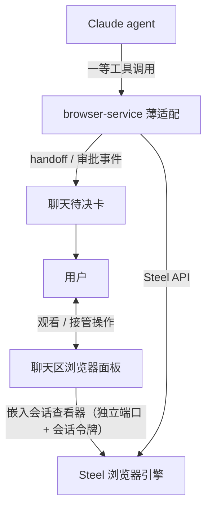
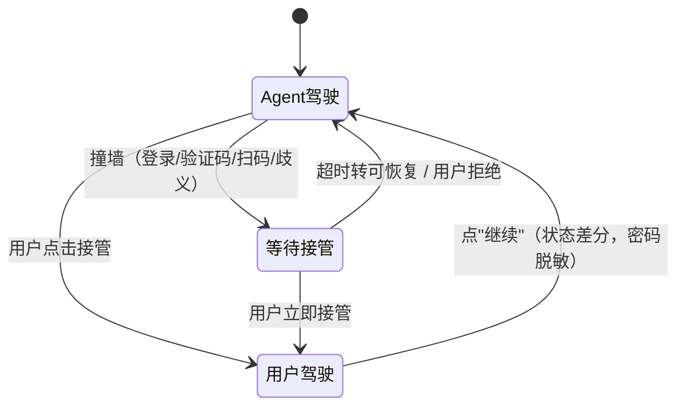
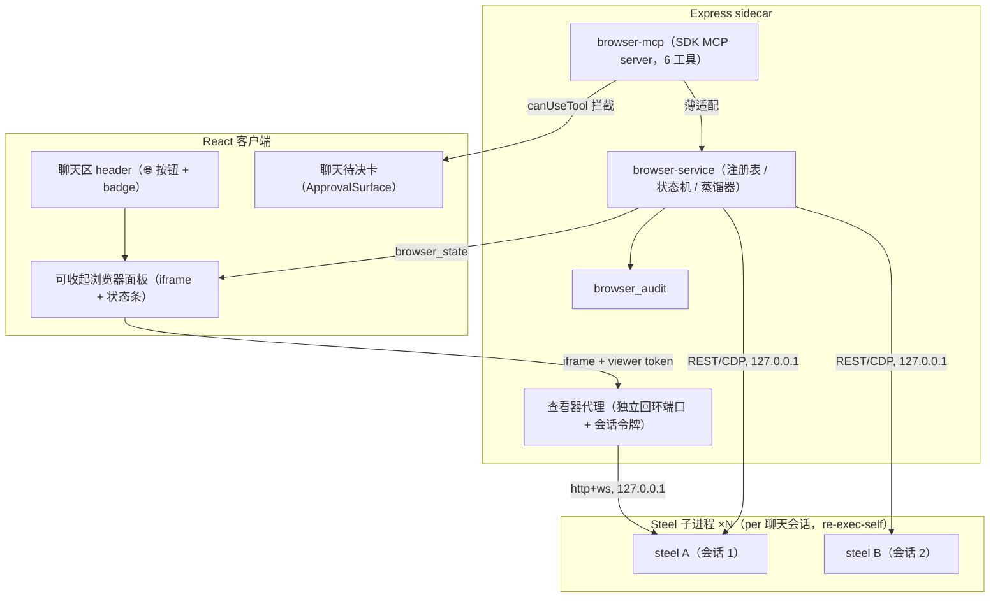
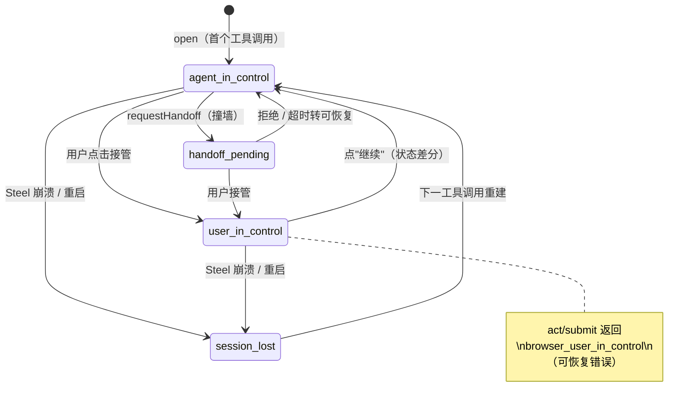

# 内嵌受控浏览器 - Plan

## Goal Capsule

- **Objective:** 为 GUI 聊天会话交付内嵌受控浏览器——agent 可驾驶、用户可看见、可随时接管后交还。
- **Product authority:** 本文档的 Product Contract（v1 范围经用户逐轮确认，含 2026-07-18 面板放置修订）。
- **Execution profile:** Deep（横跨 sidecar 服务编排、SDK 工具面、权限引擎、客户端面板、Tauri 配置、构建管线）。
- **Stop conditions:** 提交硬门被绕过且无法修复；Steel 无法作为 sidecar 子进程稳定运行且无替代路径；凭据进入模型上下文的通道无法关闭。
- **Tail ownership:** 实现方负责全部单元、测试与验证门槛，并在 CHANGELOG.md 记录用户可见变更。

---

## Product Contract

**Product Contract preservation:** changed: R1、R2、Key Decisions 面板项——面板放置由 RightPanel tab 修订为聊天区右侧可收起面板（2026-07-18 用户决策）；其余不变。

### Summary

为 GUI 聊天会话构建内嵌受控浏览器：Steel 作为 sidecar 子进程提供浏览器引擎与会话，聊天区右侧的可收起面板内嵌 Steel 实时会话查看器；agent 通过薄适配的一等工具驾驶，用户可在面板中随时接管——输密码、扫码、做一段复杂操作——点"继续"后 agent 带状态差分接手。完整形态（agent 驾驶 + 实时画面 + 双向接管）即 v1 最小发布单元。

### Problem Frame

Comate 用户今天想让 agent 操作网页，只能在系统浏览器里手动操作后复制粘贴回聊天，或借助外部工具——上下文断裂，且 agent 全程不可见。市面上的 agentic 浏览器（Comet、Dia、Atlas）都是独立浏览器产品，无法嵌入已有工作区；而 Tauri 的系统 webview 在 macOS WKWebView / Linux WebKitGTK 上不暴露 CDP，多数 Tauri 应用在技术上也做不出可驱动的内嵌浏览器。

更根本的障碍是信任：看不见 agent 在浏览器里做什么，用户不敢让它填表提交；登录墙、验证码、扫码挡住绝大多数真实场景；把凭据交给模型上下文更是不可接受。不能看见、不能接管的"受控"只是营销词汇。

### Key Decisions

- **Steel 引擎 + 内置查看器，工具面薄适配。** Steel（steel-browser，Apache-2.0）作为 sidecar 子进程提供浏览器引擎、stateful 会话与可交互会话查看器，省掉帧流与输入回传两套自研管线。Claude 看到的工具面仍是 Comate 自有一等工具的薄适配层，权限分类、审批渲染、工作流录制可按工具名挂接。
- **完整形态即 v1 最小。** agent 驾驶 + 面板直播 + 双向接管三者不可砍半——只读观看解决不了登录墙，没有直播的驾驶不值得信任。
- **单页面 per-session 一对一。** 浏览器实例与聊天会话一对一（一个 workspace 可有多个活跃会话）；workspace 级共享与多标签页后置。
- **聊天区右侧可收起面板 + 可弹出浮窗。** 聊天区 header 的浏览器按钮控制面板展开/收起，宽度可拖拽并记忆；handoff 发出时自动展开；与 RightPanel（文件/Git）完全独立。
- **登录态会话内有效 + 可选"记住此站点"。** 默认不落盘；勾选后以 workspace 级持久，同 workspace 新会话免登。
- **提交类动作硬门。** 表单提交/支付/发布在任何审批模式（含 auto）下都逐次确认——复用 AskUserQuestion"任何模式都必须问人"的硬门先例。
- **仅 GUI 会话。** bot 会话（WeCom/飞书）后置——bot 无面板，接管与登录需要另一条路径，安全模型不同。



### Actors

- A1. **GUI 用户** — workspace 聊天会话的使用者；观看、审批、接管、交还。
- A2. **Claude agent** — 会话内的驾驶者；通过一等工具操作浏览器，撞墙时发起 handoff。
- A3. **browser-service** — sidecar 内的适配服务；管理 Steel 进程与会话，向 agent 暴露工具面，向面板与会话路由事件。

### Requirements

**面板与观看**

- R1. 用户可在聊天区右侧的可收起面板中实时观看受控浏览器画面：聊天区 header 的浏览器按钮控制展开/收起，宽度可拖拽并记忆，handoff 发出时自动展开，可再弹出为浮窗。
- R2. 面板跟随当前活跃会话：切换聊天会话时面板切到该会话的浏览器；该会话无浏览器时显示空状态。
- R3. 面板常驻显示控制状态（agent 驾驶 / 等待接管 / 用户驾驶）与当前页面 URL。
- R4. agent 驾驶时面板为只读观看；用户点击"接管"后面板捕获键鼠。

**双向接管**

- R5. agent 检测到需要人工的情形（登录、验证码、扫码、歧义表单）时发起 handoff：面板进入待决状态并自动展开，聊天中同步出现待决卡（复用审批卡通道）。
- R6. 用户可随时主动接管；接管期间 agent 暂停，任何时刻只有一个控制者。
- R7. 用户点"继续"交还控制权时，agent 收到状态差分（URL 变化、表单已填值，密码类字段脱敏），不重复已完成的步骤。
- R8. handoff 超过服务器固定时长（10 分钟）未响应时转为可恢复状态：agent 在聊天中说明情况并等待，任务不阻塞。
- R9. 用户在面板中的输入（含凭据）永远不进入模型上下文与聊天记录。

**agent 驱动面**

- R10. agent 通过一小组一等工具驱动浏览器（打开页面、读取页面结构、点击/填写、提交、提取），工具输出默认为蒸馏的页面结构而非原始 HTML 或整页截图；截图可按需以 image block 单独返回（审计不存图）。
- R11. 工具层为薄适配：Comate 自有工具名转调 Steel API，权限分类、审批渲染、工作流录制可按工具名挂接。

**权限与安全**

- R12. 提交类动作（表单提交、支付、发布）在任何审批模式下都必须逐次经用户确认，确认界面展示目标 URL 与字段清单（敏感字段仅列字段名、值脱敏）。
- R13. 浏览/提取类动作遵循会话的审批模式（auto/readonly/manual）；域名级"始终允许"可持久化到 workspace 设置。

**会话与登录态**

- R14. 每个聊天会话拥有独立的受控浏览器实例（单页面）；浏览器生命周期随会话。
- R15. 登录态默认仅会话内有效；用户在面板登录后可选择"记住此站点"，之后同 workspace 的新会话免登。

**运行时与分发**

- R16. 浏览器引擎由 Steel 提供，作为 sidecar 子进程运行；Steel 服务端构建产物打进安装包 resources，Chromium 不捆绑、首次使用时按解析梯获取。
- R17. 浏览器不可用（未安装或启动失败）时，工具调用返回显式错误并在聊天中说明解决路径，不静默失败。

### Key Flows



- F1. **agent 驾驶完成任务（无接管）**
  - **Trigger:** 用户 prompt 要求网页操作（打开、填写、提交、提取）。
  - **Actors:** A1, A2, A3
  - **Steps:** agent 经工具打开页面 → 读取页面结构 → 执行动作 → 提交类动作前弹逐次确认 → 结果回到聊天。
  - **Covered by:** R10, R11, R12, R13
- F2. **撞墙接管与交还**
  - **Trigger:** agent 遇到登录墙、验证码、扫码或歧义表单。
  - **Actors:** A1, A2, A3
  - **Steps:** agent 发起 handoff（面板自动展开并进入待决状态 + 聊天待决卡）→ 用户接管并在面板操作 → 点"继续" → agent 带状态差分接手。
  - **Covered by:** R5, R6, R7, R9
- F3. **用户主动接管**
  - **Trigger:** 用户观看时点击"接管"。
  - **Actors:** A1, A2
  - **Steps:** agent 暂停 → 用户在面板操作（可看可改）→ 点"继续"交还。
  - **Covered by:** R4, R6, R7, R9
- F4. **handoff 超时未响应**
  - **Trigger:** handoff 待决超过服务器固定时长（10 分钟）。
  - **Actors:** A1, A2
  - **Steps:** 超时按 timeoutDeny 决议待决卡（卡片消失），agent 在聊天中说明"等你方便时继续"，任务保持可恢复；用户回来后经面板直接接管或让 agent 重新发起 handoff。
  - **Covered by:** R8
- F5. **首次使用浏览器**
  - **Trigger:** 会话中第一次浏览器工具调用。
  - **Actors:** A2, A3
  - **Steps:** 检查运行时 → Chromium 缺失则按解析梯获取（含进度提示）→ 启动 Steel → 失败则显式报错并给出解决路径。
  - **Covered by:** R16, R17

### Acceptance Examples

- AE1. **Covers R9.** 用户在接管中输入密码完成登录后，聊天记录与模型上下文中只出现"用户已完成登录"这一事实，密码不出现在任何事件、日志或上下文中。
- AE2. **Covers R12.** 审批模式为 auto 时 agent 尝试提交表单，仍弹出逐次确认，确认界面列出目标 URL 与字段清单（敏感字段仅列字段名、值脱敏）。
- AE3. **Covers R2.** 同一 workspace 两个活跃会话各有浏览器；用户从会话 1 切到会话 2，面板切换为会话 2 的画面，会话 1 的浏览器保持运行。
- AE4. **Covers R8.** handoff 发出后用户超时未响应，待决卡按超时决议、agent 在聊天中说明并挂起为可恢复状态；用户回来后经面板接管或让 agent 重新发起 handoff 继续任务。
- AE5. **Covers R16, R17.** 本机无可用浏览器运行时时，工具调用返回显式错误，聊天中提示获取方式，而不是表现为"页面没有内容"式的静默失败。

### Success Criteria

- v1 验收路径可走通：聊天指令打开网页 → 接管完成登录 → agent 填表并提交（提交前确认）→ 提取结果在聊天/工作区可见，全程不离开 Comate。
- 面板观看体验：画面与 agent 动作主观同步（观看不落后于聊天动作日志）。
- 凭据零泄漏：任意接管流程后，模型上下文与持久化记录中可审计地不含用户凭据。

### Scope Boundaries

**Deferred for later**

- WeCom/飞书 bot 会话驱动浏览器（bot 无面板，接管与登录需另一条路径）。
- 多标签页与导航历史；workspace 级共享浏览器与会话间转移。
- 录制-回放工作流、物化视图监控、站点知识层（自动化资产层）。
- 连接用户本机 Chrome 的"出诊"运行时模式。
- 浏览器动作的域名级权限台账细粒度配置（v1 仅 R12 硬门 + R13 审批模式继承）。
- 提交动作的页面级/网络级拦截（v1.1 加固，方向见 Risks & Dependencies 的 RISK-1）。
- Tauri 原生第二窗口浮窗（v1 用应用内浮层）。

**Outside this product's identity**

- 不做通用浏览器替代品：无地址栏自由冲浪、书签、下载管理器定位。
- 不做云端浏览器服务：Steel 仅在本机 sidecar 运行，浏览器数据不出本机。

### Dependencies / Assumptions

- Steel（steel-browser）能作为 sidecar 子进程稳定运行（Node 应用 + 自带 Chromium 管理，不要求用户安装 Docker）；其会话查看器支持交互操作且可 iframe 嵌入（官方支持，无 X-Frame-Options 限制）——2026-07-18 外部研究确认。
- 嵌入会话查看器需给 CSP 增加 `frame-src`：当前 `src-tauri/tauri.conf.json` 仅在 `connect-src` 放行 localhost，`frame-src` 未设置且生产环境 webview origin 为 `tauri://localhost`（2026-07-18 验证发现）。
- 复用机制已验证存在（2026-07-18 验证报告）：pending_approval 注册/重连重发/决议路由全链路（`src/server/services/session-runtime.ts`、`src/server/routes/chat.ts`）、WS 开放 eventType 与 git-changes 第二订阅通道先例（`src/server/websocket/types.ts:41-48`、`src/server/services/git-changes-service.ts:127`）、AskUserQuestion 硬门（`session-runtime.ts:306-317`）、WorkspaceSettings 扁平字段袋（`src/server/models/workspace.ts:10-35`）、PORT=0 ready-message 握手先例（`src-tauri/src/lib.rs:509-548` ↔ `src/server/index.ts:192-204`）。
- 服务端当前无任何 playwright/puppeteer/CDP 代码（playwright 仅 devDependencies 用于测试），客户端无 iframe/canvas 帧渲染基础设施——绿地，无遗留约束。
- bot 会话开放浏览器前，browser 类工具在 bot 策略中默认 deny。

### Sources / Research

- `docs/ideation/2026-07-18-embedded-controlled-browser-ideation.html` — 特性全集：6 个生存方向、22 条淘汰记录、外部研究综述。
- [steel-dev/steel-browser](https://github.com/steel-dev/steel-browser) 与 [docs.steel.dev](https://docs.steel.dev/llms.txt) — 引擎、stateful sessions、可嵌入会话查看器；关键约束：**自托管单进程单会话**（issue #72，需 N 进程编排）；服务端不在 npm 发布（需 vendored）；Chromium 需系统安装或自备（`CHROME_EXECUTABLE_PATH`）；REST/CDP/查看器默认无认证（官方明示勿暴露端口）；issue #311 为进行中的协调漏洞披露。
- `@anthropic-ai/claude-agent-sdk` 0.3.207 本地类型（`node_modules/@anthropic-ai/claude-agent-sdk/sdk.d.ts`）与 [agent-sdk 文档](https://code.claude.com/docs/en/agent-sdk/custom-tools) — `createSdkMcpServer`/`tool()` 签名、zod raw shape、`mcp__<key>__<tool>` 命名、权限求值顺序（allow 规则先于 canUseTool）、`CLAUDE_CODE_STREAM_CLOSE_TIMEOUT`。
- [Simon Willison: Piloting Claude for Chrome](https://simonwillison.net/2025/Aug/26/piloting-claude-for-chrome/) — 提示注入红队数据（23.6%→11.2%），提交硬门与逐次确认的外部依据。
- `docs/solutions/integration-issues/` 的 SSE 学习（心跳、续播、身份守卫）——事件通道的可靠性纪律来源。

---

## Planning Contract

### Key Technical Decisions

- **KTD-1. Steel 编排：N 进程模型 + 进程生命周期纪律。** Steel 自托管单进程仅支持单会话（issue #72），browser-service 作编排器：每个活跃聊天会话 spawn 一个 steel 子进程，动态端口，`/v1/health` 探测，并发上限默认 4（超出双呈现：工具结果结构化错误 + `browser_unavailable` 面板降级事件）。生命周期纪律：teardown 钩子显式挂在会话删除、workspace 删除级联、`closeRuntimesForWorkspace` 三处（会话删除不会触发 runtime 关闭，浏览器不能容忍该空隙）；Rust 关停优雅窗口仅 2 秒（`src-tauri/src/lib.rs:140-199`），teardown 按 SIGKILL 进程组预算设计，不做优雅协商；sidecar 启动时清理上一轮残留（pidfile/端口探测，强制退出不走 `/shutdown`）；Windows 无 POSIX 进程组语义，用 Job Object 等价物或记为 best-effort。`forkSession` 产生新 sessionId——浏览器不随 fork，新会话走冷启动。
- **KTD-2. 分发与执行形态：re-exec-self + 供应链校验。** pkg 把 sidecar 打成单入口二进制，不存在 `spawn('node', [steel.js])`；采用 re-exec-self 模式——`COMATE_STEEL=1` 环境分支复用 sidecar 二进制承载 steel 入口（镜像现有 `COMATE_SIDECAR=1` 先例），steel 的 api 构建产物（纯 JS + 生产依赖）vendored 进 `src-tauri/resources/steel/` 并在 esbuild 打包时纳入入口路径。构建期两道闸：原生依赖审计（产物含 `.node`/Mach-O/PE 即 fail，macOS universal 共享一份 resources 会静默坏架构）；体积预算（现 resources 已 ~236MB，steel 部分 ≤80MB，CI 校验）。Chromium 不捆绑：系统 Chrome/Edge → 配置路径 → 懒下载（固定版本、官方端点、按平台 SHA-256 校验、临时目录下载校验后原子改名、失配 fail-closed、无静默自更新）。Steel vendored 以 commit SHA + lockfile 固定。
- **KTD-3. 工具面：createSdkMcpServer + 蒸馏页面模型。** `browser-mcp.ts` 用 `tool()` + zod raw shape 定义 6 个一等工具（open/snapshot/act/submit/extract/requestHandoff），实例注入 `buildSdkOptions` 的 mcpServers record（工具名 `mcp__comate-browser__*`）。蒸馏器输出页面模型（a11y 树 + 稳定 ref + readability 正文，数百 token 预算），原始 DOM 不进上下文；截图按需（image block），审计不存图像。`CLAUDE_CODE_STREAM_CLOSE_TIMEOUT` 写入 `buildSdkOptions` 的 `options.env`（per-session，不污染全局流纪律）。
- **KTD-4. 权限：类别前缀归类 + 双层提交硬门 + bot 三重纵深。** ① `CATEGORY_TOOL_MAP` 加前缀匹配：`mcp__comate-browser__*` → `browser` 类别；两个 preset 中 browser 一律 `deny`（含 ALLOW_ALL_PRESET，防 grandfathered 继承）；admin 旁路对 browser 类别无效；`sanitizePolicy` 从 SAFE_PRESET 补缺失键即存量策略的 fail-closed 迁移路径（写成契约而非行为巧合）。② 提交硬门双层：`canUseTool` 层位于 auto 分支之前（AskUserQuestion 先例）作为第一门；**submit 工具 handler 内部直接发起 pending_approval 往返作为第二门**——因为 workspace 内 `.claude/settings.json` 的 `permissions.allow` 可在 canUseTool 之前短路（SDK 权限求值顺序：allow 规则先匹配），恶意仓库不可靠设置文件买到免确认提交。分类规则：submit 工具、submit 语义控件（`type=submit`/表单内提交按钮）、表单内 Enter 键。提交确认载荷经 KTD-8 脱敏规则集处理后方可进入待决事件流（凭据永不入审批卡）。批准后派发前，submit handler 经 CDP 重读 form action 与字段值并与批准快照 diff，任何不符即中止并重新确认（防批准后被页面 JS 改写）。v1 明示可接受残余（见 RISK-1）。导航面：auto 模式下会话内首次跨 eTLD+1 导航需一次确认（会话级记忆，不依赖持久域名台账），其余跨域导航落审计标记（RISK-1 残余清单同步覆盖导航型外泄）。③ bot 纵深：browser MCP server 注入以 `!isBotSession` 为条件（根本不注册）；两条 bot canUseTool 路径在 'unknown' fall-through 前对 `mcp__comate-browser__*` 显式 deny（反探测通用文案）；类别 deny 兜底。snapshot/extract 标注 `readOnlyHint` 并入 `READONLY_TOOLS`。
- **KTD-5. 控制状态机：互斥控制，状态归属 browser-service。** 状态 `agent_in_control | user_in_control | handoff_pending`（+ `session_lost` 瞬态）与浏览器注册表全部住在 browser-service（按 chat sessionId 键），**不挂 runtime 或 SDK MCP server 实例**——runtime 重建（provider 切换、bot 策略变更等既有触发点）时新实例按 sessionId 重新绑定既有浏览器；`onRuntimeClose` 是单槽回调（已被 WS server 占用），browser-service 改为链式监听，不得覆盖。`user_in_control` 时 act/submit 返回可恢复 `browser_user_in_control` 结构化错误；screenshot 在接管期间同样硬阻断（像素不可脱敏），snapshot/extract 经脱敏规则集或阻断；进行中动作完成后翻转；切换聊天会话释放键鼠捕获但保持 `user_in_control`。Steel 崩溃时 browser-service 主动解除该会话挂起的 browser 待决卡（容忍 runtime 已不存在），并迁移 `browser_state` 到 `session_lost`。
- **KTD-6. Handoff：pending_approval 往返下沉 handler 本体，canUseTool 层为纵深。** `requestHandoff` 的 handler 内部直接发起 pending_approval 往返（与 submit 同构——workspace 内 `.claude/settings.json` 的 allow 规则可在 canUseTool 之前短路，拦截层单独不足以保证 handoff 纪律），canUseTool 层拦截作为第一门与 UI 入口；超时服务器固定 10 分钟（忽略 agent 可控的 input.timeout）；面板输入活动以**无内容的活动 ping** 重置计时（永不含击键数据）；超时复用 `timeoutDeny` 语义转可恢复，客户端在 chat-store 的 `'sse'` 分支补 `approval_timeout` 处理（现有事件未消费，卡片此前会静默消失）。交还时生成状态差分（URL/DOM 增量/表单已填值，按 KTD-8 脱敏规则集处理）注入工具结果。
- **KTD-7. 查看器通道：per-session 令牌 + 独立回环端口 + 远程面加固。** 威胁模型（2026-07-18 安全审查修正）：sidecar 当前 CORS 为 `*`、WS 无 Origin 校验、审批决议为无认证 POST、`serverNonce` 会向每个 SSE 订阅者广播——它不是凭证，且单一值无法区分会话归属。因此：① 查看器凭证为 **per-session 随机 viewer token**，由服务端经 iframe URL 一次性下发，代理校验令牌与会话归属；② 查看器代理放在**独立回环端口**（与 sidecar API 不同源）——Steel 查看器是渲染敌对页面数据的第三方 UI，与整个 API 同源地被 XSS 即等于交出全部 API；③ Steel API 与 Chromium CDP 一律绑 127.0.0.1（验收断言无回环外监听）；④ iframe src 只能由服务端会话注册表构造，永不来自 agent/用户/工具输入；⑤ U9 的远程面加固是查看器安全的前置。同机非浏览器进程对本机端口的访问记为显式接受风险（见 RISK-4）。
- **KTD-8. 登录态托管：值只进不出 + PSL 键规则 + 脱敏规则集。** "记住此站点"勾选 → 导出 `sessionContext` → 存 workspace settings `browserSiteAuth`——**值只进不出**：GET workspace 时服务端剥离该字段的值（只下发站点键与元数据），值仅在服务端注入路径消费（现有 secret 先例是整袋下发，sessionContext 是可重放的活会话令牌，必须更强）；设置整袋替换与记住站点写入之间的并发以服务端字段级合并处理。键规则：引入 tldts（真 PSL，仓内无此依赖）；localhost/IP/单标签主机加端口维度；IP 字面量主机禁用"记住此站点"（跨网络语义不稳）；注入发生在首个 open() 的 origin 匹配时，键前做 IDN/punycode 归一化。脱敏规则集（状态差分、蒸馏与提交确认载荷共用）：`type=password`、`autocomplete∈{current-password,new-password,cc-*,one-time-code}`、name/id/aria 正则——残余（混淆字段漏入）记档。workspace 删除级联同步清理注册表、audit 行与该字段。
- **KTD-9. 事件与审计纪律。** `browser_state` 事件族走 git-changes 式被动订阅（不触发 runtime 创建；按 sessionId 订阅，新的订阅形状；disconnect 清理注册同款 unsubscribe）；不进会话 ring buffer，hydration = 订阅时推送当前态；它是控制态唯一事实源（待决卡只是表现形式），状态机每次迁移（含 approval resolve/timeout/abort 引发的）补发。审计写 `browser_audit` 表（sqlite-store 构造器内建表 + migration version + `resetData()` 同步清理）：正向形状只存工具名/分类/URL origin/字段名，字段值与图像永不入库（`bot-audit-logger` 的 ">32 字符即 redact" 启发式会误伤 URL，browser_audit 自定义字段级契约）。

### High-Level Technical Design





### Output Structure

```text
src/server/
  services/
    browser-service.ts            # 会话注册表、状态机、Steel 编排、登录态注入
    browser-steel-process.ts      # re-exec-self 子进程、握手、看门狗、端口、pidfile
    browser-mcp.ts                # createSdkMcpServer + 6 个一等工具
    browser-page-model.ts         # 蒸馏器（a11y+ref 页面模型 + 脱敏规则集）
    browser-audit.ts              # 动作审计（字段级脱敏契约）
    security/
      request-origin-guard.ts     # CORS 收紧、WS Origin 校验、变更路由 Sec-Fetch 校验
  routes/
    browser-proxy.ts              # 查看器代理（独立回环端口 + 会话令牌）
    health-browser.ts             # /api/health/browser
  services/__tests__/             # node:test（test-utils/test-env 先行）
src/client/
  components/browser/
    BrowserPane.tsx               # 可收起面板 + 状态条 + keep-alive iframe
    BrowserStateBar.tsx           # 三态 + 接管/继续按钮
    BrowserPopout.tsx             # 应用内浮层
  stores/browser-pane-store.ts    # 展开/宽度/会话跟随
src-tauri/
  resources/steel/                # vendored steel-browser（构建期生成，纯 JS）
```

### Sequencing

U2 先行（分发与执行形态），U1 依赖 U2，U9（远程面加固）在 U4/U7 之前落地，U3 依赖 U1，U4 依赖 U3+U9，U5 依赖 U3+U4，U7 依赖 U1+U2+U9，U6 依赖 U5+U7，U8 依赖 U5+U6。建议落地顺序：U2 → U1 → U9 → U3 → U4 → U5 → U7 → U6 → U8。

### System-Wide Impact

- **Tauri 壳：** 不新增 capabilities（steel 由 Node 侧 spawn，不经 Tauri shell——实现期不得误加 `shell:allow-spawn` 条目）；CSP `frame-src` 放宽是全 webview 生效，查看器代理因此对非查看器路径不得返回可嵌框响应（X-Frame-Options 或路径白名单）；dev（vite 5173 origin）与生产（`tauri://localhost`）两种 origin 均需验证；Windows WebView2 的 CSP 行为差异列入测试。
- **打包/发布管线：** resources 已 ~236MB（claude 占 230MB），steel 体积预算 ≤80MB 且 CI 校验（签名自动更新管线对每 MB 逐平台递归计费）；macOS universal 共享一份 resources——vendored 产物原生依赖审计失败即构建失败；re-exec-self 不破坏单 sidecar 二进制的现有打包形状。
- **WS 协议面：** WS 请求联合类型有穷举检查（新增订阅类型缺 dispatch 即编译失败）；`browser_state` 必须被动订阅（不得像 `handleSubscribe` 那样触发 runtime 创建）；按 sessionId 订阅是新的订阅形状（git-changes 为 workspaceId）；`handleDisconnect` 须注册 browser 通道的清理。
- **SDK 集成面：** `buildSdkOptions` 是 GUI/bot 共用——browser MCP server 注入必须以 `!isBotSession` 为条件（bot 会话当天即可经 fall-through 获得工具，fail-closed 晚一行都是事故）；`system_init` 会透传新工具名（`sse-emitter.ts:111-128`），客户端 tool-renderers 兜底与设置页 MCP 展示口径需覆盖进程内 server，避免误报"未配置"；`onRuntimeClose` 单槽已被占用，browser-service 链式监听。
- **bot 面：** ToolCategory 为固定六类联合类型，新增 browser 类别强制编译期更新 SAFE/ALLOW_ALL preset、`resolveEffectivePolicy`、客户端权限 UI 与 i18n 双语言类别标签；admin 旁路会自动覆盖所有已归类工具——browser 必须显式排除；bot 拒绝文案复用反探测通用句，不发明新文案。
- **设置与数据：** `browserSiteAuth` 值只进不出（GET 剥离），服务端字段级合并解决整袋替换写竞争；Chromium 懒下载路径必须经 `getStorageDir()` 派生以兼容测试隔离；`browser_audit` 入 sqlite-store 建表序列并纳入 `resetData()`；workspace 删除级联覆盖注册表、audit、`browserSiteAuth`。
- **失败传播：** Steel 崩溃 → 主动解除挂起待决卡 + `session_lost`（不得等 10 分钟超时兜底）；sidecar 重启 = 浏览器进程态全灭（`browserSiteAuth` 是唯一幸存状态，这正是登录态走 settings 注入而非进程恢复的原因）；启动时清理上一轮残留进程；第 5 个并发请求 → 工具错误 + 面板降级事件双呈现。

---

## Risks & Dependencies

- **RISK-1（High）提交硬门残余绕过面。** v1 分类规则无法证明的提交路径：JS 语义控件（`<button type="button">Place order</button>`）、页面内 `form.submit()`/fetch/XHR 提交、多步流程末态按钮、合成键盘（表单外焦点）；导航型外泄（注入页面指引导航到攻击者域名携带上下文——auto 模式下以会话级首次导航确认缓解，见 KTD-4）。**可接受残余（明示）**：这些路径在 v1 按会话审批模式处理，不做逐次确认；凡是动作后发生导航或 POST 的不可证明点击，审计中单独标记为"潜在提交"。**v1.1 方向（钉死）**：CDP Network 域侦测动作后携带载荷的 POST/PUT + `addScriptToEvaluateOnNewDocument` 覆写 `HTMLFormElement.submit/requestSubmit` 与 fetch/XHR 回传 sidecar，将 act 追溯重分类为 submit 并阻断待确认。对外文案与 Success Criteria 只承诺"可证明的提交需确认"。
- **RISK-2（High）sidecar 远程面既存暴露。** CORS `*`、WS 无 Origin 校验、审批决议无认证 POST——既存问题，但本特性抬高其价值（已登录浏览器、待决卡、viewer 令牌）。U9 加固是 U4/U7 的前置，验收含跨源攻击 fixture（路过网页不能读 API、不能决议审批、不能取 viewer 令牌）。
- **RISK-3（High）Steel 为 pre-1.0 beta 且存在未公开漏洞披露（issue #311）。** 显式接受：以 commit SHA 固定版本、跟踪 GHSA、披露后 N 天内升级的义务；本机绑定 + 会话令牌 + bot fail-closed 构成缓解；未决披露不阻塞 v1 发布（本地场景），但发布说明中披露此姿态。
- **RISK-4（Medium）本机进程可访问 localhost 端口。** 任何本机进程可枚举并无认证驱动已登录浏览器（Steel 端口无认证；nonce/令牌只防网页与远程）。显式接受：本机恶意软件已拥有用户态一切；缓解为随机高端口、会话关闭即 teardown、不复用知名端口、安全文档披露；调研项：Steel 是否支持 pipe 模式 CDP 替代 TCP。
- **RISK-5（Medium）Chromium 与 Steel 供应链。** 固定版本 + SHA-256 + 原子改名 + 失配 fail-closed（KTD-2）；Steel vendored 以 commit SHA + lockfile 固定；本机篡改记为残余。
- **RISK-6（Medium）凭据明文存储。** `browserSiteAuth` 与 wecomBotSecret 同为先例明文 SQLite；值只进不出 + 数据目录权限 + workspace 删除级联缓解；OS keychain 加密列为后续项。
- **RISK-7（Medium）并发资源占用。** 每个浏览器实例 = Node + Chromium（数百 MB）；上限 4 + 双呈现错误（KTD-1）；内存紧张机器的调度策略留作运行期观察。
- **RISK-8（Low）面板观看延迟。** Steel OSS 查看器为 screencast-over-WS（非 WebRTC），localhost 下 CPU 开销可接受；若实测延迟影响信任，升级路径为自研帧通道（ideation 的 ghost-tab 方案仍在档案中）。

### Open Questions

**Resolve Before Planning**

- 无。

**Deferred to Implementation**

- Steel 的 cast WS 对 Origin 的行为（pre-1.0 未文档化）——集成期验证跨源页面直连 Steel 端口必须失败，若失败则加回环 shim 拒绝带浏览器源的流量。
- Steel 是否支持 `--remote-debugging-pipe` 替代 TCP CDP——若支持则消除 RISK-4 的一部分。
- re-exec-self 的 esbuild 入口编排细节（steel 入口与 sidecar 入口的打包形状）——U2 实现期定稿。

---

## Implementation Units

### U1. browser-service 核心：Steel 进程编排与会话生命周期

- **Goal:** 每个活跃聊天会话一个 steel 子进程：spawn（re-exec-self）、动态端口、健康探测、看门狗回收、并发上限、会话注册表与 `session_lost` 恢复。
- **Requirements:** R14, R16, R17, F5, AE5
- **Dependencies:** U2
- **Files:** `src/server/services/browser-service.ts`、`src/server/services/browser-steel-process.ts`、`src/server/services/__tests__/browser-service.test.ts`、`src/server/services/__tests__/browser-steel-process.test.ts`
- **Approach:** re-exec-self 子进程（`COMATE_STEEL=1` 分支，镜像 `COMATE_SIDECAR=1` 先例）；会话注册表与控制状态机 keyed by chat sessionId（不挂 runtime/MCP 实例）；teardown 钩子挂会话删除、workspace 级联、`closeRuntimesForWorkspace`；2 秒关停预算（SIGKILL 进程组）；启动时 pidfile/端口探测清理上轮残留；并发上限默认 4，超出双呈现（工具错误 + `browser_unavailable`）；崩溃 → 主动解除该会话 browser 待决卡 + `session_lost`，下一工具调用重建。
- **Patterns to follow:** `src-tauri/src/lib.rs:457-548`（spawn/握手/状态）、`index.ts:139-160`（健康探测）、`git-changes-service.ts:244-249`（降级事件）
- **Test scenarios:**
  - Happy path: spawn → 就绪探测通过 → 注册表可查 → teardown 后无残留
  - 端口分配：并发两个进程端口不冲突且仅绑 127.0.0.1
  - 看门狗：sidecar 模拟退出，Chrome 进程树被回收；重启后上轮 pidfile 残留被清理
  - 上限：第 5 个请求 → 工具结构化错误 + `browser_unavailable` 事件
  - 崩溃恢复：kill steel → 挂起待决卡被解除 → `session_lost` → 下一调用重建成功
  - 集成：会话删除 / workspace 删除 / `closeRuntimesForWorkspace` 三路径均触发 teardown
- **Verification:** 新测试全绿；`npm run test:server` 通过；无进程/端口泄漏

### U2. Steel 分发：re-exec-self 打包 + Chromium 解析梯 + 供应链校验

- **Goal:** steel 入口纳入 sidecar 打包（re-exec-self），vendored 产物进 resources；Chromium 解析梯 + 校验下载；`/api/health/browser`。
- **Requirements:** R16, R17, F5, AE5
- **Dependencies:** 无
- **Files:** `scripts/build-steel-bundle.ts`（新）、`scripts/build-sidecar.ts`（挂接 steel 入口与资源）、`src/server/utils/resolve-steel.ts`（新）、`src/server/utils/resolve-chromium.ts`（新）、`src/server/routes/health-browser.ts`（新）、`src-tauri/tauri.conf.json`（resources 映射 + CSP `frame-src`）、`src/server/index.ts`（挂路由 + `COMATE_STEEL` 分支）
- **Approach:** pinned steel（commit SHA + lockfile）构建期 npm 安装构建，仅取纯 JS api 产物与生产依赖；构建期原生依赖审计（`.node`/Mach-O/PE 即 fail）与体积预算（≤80MB）；运行时解析：TAURI_RESOURCE_DIR → COMATE_DATA_DIR → dev 源码树；Chromium：系统 Chrome/Edge → 配置路径 → 懒下载（固定版本 + SHA-256 + 原子改名 + 失配 fail-closed）；全部失败显式报错。
- **Execution note:** 打包/配置为主，优先安装与运行时冒烟验证，单测覆盖解析梯顺序与校验失败路径。
- **Patterns to follow:** `resolve-sdk-binary.ts:20-79`（四级梯）、`build-sidecar.ts`（pkg 管线）、`index.ts:139-151`（resolve-then-probe）
- **Test scenarios:**
  - 解析梯顺序：资源目录 > 数据目录 > dev 树；全缺失 → 显式错误（非静默）
  - Chromium 校验：SHA-256 匹配通过 / 失配 fail-closed（不留半截文件）
  - 构建闸：vendored 产物混入 `.node` 文件 → 构建失败；体积超限 → CI 失败
  - `/api/health/browser`：全就绪 200；缺 Chromium 503 含解决路径
  - re-exec-self：`COMATE_STEEL=1` 分支启动 steel 而非 sidecar API
- **Verification:** 新测试全绿；打包产物含 resources/steel；dev 与生产两种模式解析正确

### U9. sidecar 远程面加固（前置）

- **Goal:** 收敛 sidecar 的远程攻击面，为审批硬门与查看器令牌提供地基：CORS 收紧、WS Origin 校验、状态变更路由 Origin/Sec-Fetch-Site 校验。
- **Requirements:** R12（硬门有效性前提）
- **Dependencies:** 无
- **Files:** `src/server/services/security/request-origin-guard.ts`（新）、`src/server/index.ts`（CORS 配置）、`src/server/websocket/server.ts`（upgrade 校验）、`src/server/services/__tests__/request-origin-guard.test.ts`
- **Approach:** CORS 从 `*` 收紧到按平台的 app origin 矩阵（macOS/Linux 生产 `tauri://localhost`、Windows 生产 `http(s)://tauri.localhost`、dev vite origin）；WS upgrade 校验 Origin；审批决议等状态变更路由校验 Origin/Sec-Fetch-Site；读取类路由保持本机可用并加 Host 头白名单（127.0.0.1/localhost/tauri scheme host，防 DNS rebinding）。不改变任何既有功能语义，只加来源校验。
- **Test scenarios:**
  - 跨源 fetch（模拟路过网页）读 API → 拒绝；同 app origin → 正常
  - 无 Origin/恶意 Origin 的 WS upgrade → 拒绝
  - 跨源 POST 审批决议 → 拒绝；合法来源 → 正常
  - 既有客户端（Tauri webview 各平台 origin + dev）全链路回归通过
  - 真实 webview 采集：记录 macOS WKWebView 与 Windows WebView2 在 fetch/WS upgrade 上实际发送的 Origin/Sec-Fetch 头，据此定稿 null-Origin 策略（合法客户端不得被拒）
  - Host 头白名单：异常 Host 的请求（含读路由）被拒
- **Verification:** 新测试全绿；跨源攻击 fixture 失败；既有 `npm run test:server` 不回归

### U3. 一等工具面：browser-mcp（SDK MCP server + 蒸馏器 + handler 级硬门）

- **Goal:** `createSdkMcpServer` 注册 6 个一等工具，蒸馏页面模型，submit 硬门下沉 handler；GUI 会话条件注入。
- **Requirements:** R10, R11, R12, F1
- **Dependencies:** U1
- **Files:** `src/server/services/browser-mcp.ts`、`src/server/services/browser-page-model.ts`、`src/server/services/chat-service.ts`（mcpServers 合并点 + `!isBotSession` 条件注入 + `options.env` 流超时）、`src/server/services/__tests__/browser-mcp.test.ts`、`src/server/services/__tests__/browser-page-model.test.ts`
- **Approach:** `tool()` + zod raw shape；server key `comate-browser`；蒸馏器：a11y 树 + 稳定 ref + readability 正文（数百 token 预算），脱敏规则集共用（KTD-8）；截图按需（image block，审计不存图）；submit 工具 handler 内部直接发起 pending_approval 往返（设置文件不可旁路），canUseTool 层保留为纵深；readOnlyHint 标注 snapshot/extract；handler 错误 `{isError:true}` 结构化（响亮失败）；`CLAUDE_CODE_STREAM_CLOSE_TIMEOUT` 入 `options.env`。
- **Technical design (directional):** 页面模型伪 schema — `{url,title,pageType,forms:[{ref,fields:[{ref,label,type,required,sensitive}]}],actions:[{ref,role,name}],content:{text,truncated},alerts[],tokenEstimate}`；ref 带语义（role+name），DOM 变化后整批失效。
- **Patterns to follow:** SDK 本地类型 `sdk.d.ts:467-488, 6745-6749`；`chat-service.ts:1310-1348`（合并点）
- **Test scenarios:**
  - Happy path: mcpServers record 同时含 sdk 实例与既有 stdio 配置；bot 会话不含 browser server
  - 蒸馏：含密码/autocomplete=cc-number 字段 → 标 sensitive、值缺席；超预算 → 截断标记
  - ref 失效：DOM 变化后旧 ref → 结构化失效错误
  - submit handler 级硬门：workspace 含宽松 `.claude/settings.json`（`permissions.allow` 覆盖 browser 工具）时，提交仍弹确认
  - TOCTOU：批准后表单被改写（action 或字段值变化）→ 派发中止并重新弹确认
  - 工具错误：steel 不可达 → `{isError:true}` 含 stage 与解决路径
- **Verification:** 新测试全绿；SDK 会话中工具以 `mcp__comate-browser__*` 可见

### U4. 权限闸门：browser 类别 + 双层提交硬门 + bot 纵深

- **Goal:** 前缀归类落地 browser 类别；提交分类规则 + canUseTool 层硬门；bot 三重纵深；ApprovalSurface 渲染提交清单。
- **Requirements:** R12, R13, AE2
- **Dependencies:** U3, U9
- **Files:** `src/server/services/tool-permission-policy.ts`（前缀匹配 + browser 类别 + preset/admin 约束）、`src/server/services/chat-service.ts`（两条 bot 路径 fall-through 前拒绝）、`src/server/services/session-runtime.ts`（硬门位置）、`src/client/components/ApprovalSurface.tsx`（提交清单）、`src/server/services/__tests__/tool-permission-policy.test.ts`、`src/server/services/__tests__/browser-permission-gate.test.ts`
- **Approach:** `CATEGORY_TOOL_MAP` 支持 `mcp__<server>__*` 前缀条目（仅 comate-browser）；browser 在两个 preset 一律 deny；admin 旁路对 browser 无效；`sanitizePolicy` 补键即 fail-closed 迁移契约。GUI：snapshot/extract 入 READONLY_TOOLS，act 随审批模式，submit 分类（submit 工具 / `type=submit` 与表单内提交按钮 / 表单内 Enter）在 auto 分支前拦截，渲染 URL + 字段值清单；不可证明的点击按审批模式放行并落审计标记（RISK-1）。bot：拒绝文案复用反探测通用句。
- **Patterns to follow:** `session-runtime.ts:306-317`（AskUserQuestion 硬门）、`chat-service.ts:1455-1463`（IDENTITY_SENSITIVE_TOOLS）、`ApprovalSurface.tsx:327-356`
- **Test scenarios:**
  - Covers AE2. auto 模式下 submit 工具调用 → 仍弹逐次确认（含 URL + 字段清单）
  - 分类：`type=submit` 点击 / 表单内 Enter → 硬门；普通链接点击 → 按审批模式
  - readonly 模式下 snapshot/extract 自动放行
  - bot（WeCom 与 Feishu 两路径）调用任意 browser 工具 → 拒绝（通用文案）；admin bot 同样被拒
  - ALLOW_ALL_PRESET 下 browser 类别仍 deny；存量策略 sanitizePolicy 补键后为 deny
  - 跨源 fixture：路过网页 POST 决议审批 → 被拒（依赖 U9）
  - auto 模式下首次跨域导航 → 一次确认；同域再次导航放行；跨域导航落审计标记
- **Verification:** 新测试全绿；`npm run test:server` 通过

### U5. 控制状态机 + handoff 通道

- **Goal:** 互斥控制状态机（归属 browser-service）+ requestHandoff 的 canUseTool 拦截 + 服务器固定超时 + 状态差分交还 + `browser_state` 事件族。
- **Requirements:** R5, R6, R7, R8, R9, F2, F3, F4, AE1, AE4
- **Dependencies:** U3, U4
- **Files:** `src/server/services/browser-control.ts`（新，或并入 browser-service）、`src/server/services/session-runtime.ts`（拦截点 + 链式 onRuntimeClose）、`src/server/websocket/`（browser_state 通道 + disconnect 清理）、`src/server/services/__tests__/browser-control.test.ts`、`src/client/stores/chat-store.ts`（approval_timeout 事件消费）
- **Approach:** requestHandoff 的 pending_approval 往返在 handler 本体发起（KTD-6，防 settings.json allow 短路），canUseTool 层拦截为纵深；复用 pending_approval 全链路；超时服务器固定 10 分钟，面板活动以无内容 ping 重置；超时复用 timeoutDeny 语义，chat-store `'sse'` 分支补 `approval_timeout` toast；user_in_control 时 act/submit 返回可恢复 `browser_user_in_control`；交还生成状态差分（KTD-8 脱敏规则集）注入工具结果；`browser_state` 被动订阅（不触发 runtime 创建）+ 订阅时推送当前态 + 每次迁移补发；会话切换释放捕获保持 user_in_control。
- **Technical design (directional):** 状态转换表 — 行 {agent_in_control, handoff_pending, user_in_control, session_lost} × 列 {接管点击, 继续点击, 超时, agent 工具调用, 崩溃}，每格唯一结果；实现以该表为断言源。
- **Patterns to follow:** `session-runtime.ts:422-436`（timeoutDeny）、`:458-475`（重发）、`git-changes-service.ts:171-173`（订阅推送）
- **Test scenarios:**
  - handoff 全周期：请求 → 待决 → 接管 → 继续 → agent 收到状态差分（sensitive 字段值缺席）
  - Covers AE4. 超时 → 可恢复态 + 聊天说明；用户回来后接管继续
  - 互斥：user_in_control 中 act → `browser_user_in_control`（可恢复，不挂起）
  - 接管期间 screenshot → 硬阻断（同款可恢复错误）；接管期间工具结果不含画面像素与字段值
  - Covers AE1. 接管输入密码后，审计/日志/工具结果/聊天中均无该值
  - 会话切换：捕获释放、状态保持；返回后恢复
  - 竞争：handoff 待决 + 已在 takeover → 以待决卡为唯一活动卡；崩溃于 takeover 中 → 待决卡被解除 + session_lost
  - `browser_state` 订阅不创建 runtime；disconnect 后订阅清理
- **Verification:** 新测试全绿；状态转换表断言全通过

### U6. 聊天区浏览器面板（可收起 pane + 状态条 + 浮窗）

- **Goal:** 聊天区 header 浏览器按钮 + 可收起可拖宽面板 + 三态状态条 + keep-alive iframe 查看器 + 应用内浮窗 + handoff 自动展开与 badge。
- **Requirements:** R1, R2, R3, R4, F2, F3, AE3
- **Dependencies:** U5, U7
- **Files:** `src/client/components/browser/BrowserPane.tsx`、`BrowserStateBar.tsx`、`BrowserPopout.tsx`、`src/client/stores/browser-pane-store.ts`、聊天区 header 组件（加按钮）、`src/client/i18n/en/`、`src/client/i18n/zh-CN/`、`src/client/components/browser/__tests__/`
- **Approach:** pane 独立于 RightPanel（不动 ContentTab 联合类型）；展开状态与宽度 persist；iframe keep-alive（CSS-hidden 先例）；iframe src 只由服务端构造（含 viewer token，KTD-7）；状态条渲染五态：agent 驾驶、等待接管、用户驾驶、接管中（busy/禁用，对应"进行中动作完成后翻转"的等待窗口）、session_lost（崩溃文案 + 手动重试，注明下一工具调用自动重建）；handoff 时 header 按钮 badge + 面板自动展开；首次使用（F5）的下载/启动进度：面板打开时显示确定性进度态（百分比 + 可取消），面板关闭时由聊天在途工具调用携带进度文案；跟随活跃会话；空状态为纯说明态（"此会话还没有浏览器，让 Claude 处理网页任务时会自动打开"，不提供主 CTA）；`browser_unavailable` 降级态；浮窗为应用内 overlay——状态条弹出按钮，浮窗为面板同一画面镜像（状态条控件随画面走，两个入口同一状态机），关闭即回面板，跟随活跃会话切换；可访问性：接管/继续/弹出按钮键盘可达且有可见焦点，控制状态迁移经 aria-live 通告，Esc 或失焦释放键鼠捕获，浮窗焦点圈定且关闭后焦点还原。
- **Patterns to follow:** `RightPanel.tsx:287-292`（keep-alive）、`right-panel-store.ts`（宽度持久化）、`GitChangesPanel`（降级态 UI）
- **Test scenarios:**
  - 展开/收起与宽度持久化
  - handoff 事件 → badge 出现 + 面板自动展开
  - Covers AE3. 切换会话 → 面板切换画面；后台会话浏览器不销毁
  - 收起时 iframe 不卸载，重开不重载
  - `browser_unavailable` → 降级 UI + 重试
  - iframe src 不接受用户/agent 输入（注入 fixture 失败）
  - 五态渲染各有断言（含接管中禁用态与 session_lost 重试）
  - 首次使用进度态（面板开/关两路径）
  - 键盘可达性与 Esc 释放捕获；浮窗与面板同一状态机镜像
  - i18n：en 与 zh-CN 键齐全
- **Verification:** `npm run test:client` 通过；面板三态与聊天待决卡状态一致

### U7. 查看器代理：独立回环端口 + 会话令牌

- **Goal:** 查看器代理运行于独立回环端口（与 sidecar API 不同源）；per-session viewer token 校验；Steel 端口仅绑 127.0.0.1。
- **Requirements:** R1, R9
- **Dependencies:** U1, U2, U9
- **Files:** `src/server/routes/browser-proxy.ts`（独立端口监听）、`src/server/services/__tests__/browser-proxy.test.ts`
- **Approach:** 开工前置 spike 闸：用朴素回环代理在异源上加载 pinned Steel 查看器，验证帧渲染与键鼠转发端到端可用，并枚举查看器实际打开的全部 http/WS 端点（代理测试清单以其为准，而非仅 cast ws）。然后：browser-service 签发 per-session 随机 viewer token（经 iframe URL 一次性下发）；代理校验令牌与会话归属（会话 A 的令牌看不了会话 B）；http 转发 + ws upgrade 转发；代理对非查看器路径返回 X-Frame-Options 拒绝；Steel API/CDP 仅绑 127.0.0.1；跨源直连 Steel 端口的集成期验证（Open Questions 的 shim 决策点）。
- **Test scenarios:**
  - spike：异源代理下查看器帧渲染与键鼠转发端到端可用；端点枚举清单与代理转发清单一致
  - 无/错令牌 → 403 通用文案；会话 A 令牌请求会话 B → 拒绝
  - 正确令牌 → 查看器 HTML 与 cast ws 经代理可达
  - Steel 端口无回环外监听 socket（绑定断言）
  - 跨源页面（无令牌）对代理与 Steel 端口的 fetch/WS → 失败
  - 代理端口与 sidecar API 不同源（origin 断言）
- **Verification:** 新测试全绿；客户端网络面板中无直连 steel 端口

### U8. 登录态托管 + 审计

- **Goal:** "记住此站点"全链路（勾选 → 导出 → 值只进不出存储 → 注入）+ PSL 键规则 + 设置页管理列表 + 动作审计表。
- **Requirements:** R15, R9, AE1
- **Dependencies:** U5, U6
- **Files:** `src/server/services/browser-service.ts`（导出/注入）、`src/server/models/workspace.ts`（`browserSiteAuth` 字段 + GET 剥离）、`src/server/services/browser-audit.ts`、`src/server/storage/sqlite-store.ts`（browser_audit 建表 + resetData）、`src/client/components/SettingsPanel.tsx`（Security 区管理列表）、`src/client/components/browser/BrowserStateBar.tsx`（勾选框，U6）、`src/server/services/__tests__/browser-site-auth.test.ts`、`src/server/routes/workspaces.ts`（GET 剥离值）
- **Approach:** "记住此站点"勾选放在 BrowserStateBar 的 user_in_control 态（与"继续"并列，交还时随状态差分提交——handoff 卡只在撞墙流程出现，主动接管 F3 无卡可勾）。入口判据：先在 pinned SHA 上 dump `GET /v1/sessions/:id/context` 的实际内容（cookies 之外是否含 storage state），若缺 localStorage/IndexedDB 则将 R15 限定为 cookie 型认证并记档 SSO 站点限制。键规则用 tldts（PSL）：公网 eTLD+1、localhost/IP/单标签加端口、IP 字面量禁用、IDN 归一化；GET workspace 时服务端剥离值（只下发键与元数据）；注入发生在首个 open() origin 匹配；字段级合并解决整袋替换写竞争；workspace 删除级联清理；bot 会话永不注入；审计正向形状（工具名/分类/URL origin/字段名，值与图像永不入库）。
- **Patterns to follow:** `bot-audit-logger.ts`（审计模式，脱敏契约自定义）、`PermissionsSubTab.tsx`（presentational 子表单）
- **Test scenarios:**
  - 勾选记住 → 新会话打开同站点 → 已登录（注入生效）
  - 主动接管（F3，无 handoff 卡）完成登录后可在状态条勾选记住
  - 入口判据：pinned SHA 上 dump 导出内容，确认 storage state 覆盖范围与文档一致
  - 键矩阵：`example.co.uk`（不串到整个 co.uk）、`user.github.io`（不串到整个 github.io）、`localhost:3000` vs `:8080`（不互串）、IP 主机禁用记住
  - GET workspace 响应不含 `browserSiteAuth` 的值（仅键与元数据）
  - 撤销 → 存储清除 → 不再注入；workspace 删除 → 级联清理
  - sessionContext 不出现在 diagLog、审计表、工具结果、聊天事件、GET 响应
  - 审计：act/submit/takeover/handback 序列逐条落表且字段形状正确
- **Verification:** 新测试全绿；`npm run test:server` 与 `npm run test:client` 通过

---

## Verification Contract

- `npm run lint`（--max-warnings 0，全仓通过）
- `npm run test:server`（node:test；新服务测试全部先 import `test-utils/test-env`，使用 `createIsolatedStore()`/`:memory:`）
- `npm run test:client`（jsdom：面板、状态条、设置 UI、审批面）
- `npm run test:browser`（Playwright 浏览器模式：面板展开/收起/浮窗交互；跨源攻击 fixture）
- 冒烟验收：对本地确定性测试站走通 v1 验收路径（打开 → 接管登录 → 填表 → 提交硬门确认 → 提取可见），全程不离开 Comate
- `CHANGELOG.md` 记录用户可见变更（Keep a Changelog）

## Definition of Done

**Global**

- 全部 9 个单元落地，Verification Contract 全绿
- 冒烟验收路径手工走通（含 handoff 超时、会话切换、Steel 崩溃恢复、跨源攻击四个变体）
- 凭据零泄漏自查：接管流程后模型上下文、日志、审计表、聊天事件、GET workspace 响应均不含凭据
- i18n 双语言齐全；无 dead-end / 实验性残留代码
- `CHANGELOG.md` 已更新

**Per-unit**

- 该单元测试场景全部实现并通过
- 该单元 Verification 中的结果性条件成立（非仅测试绿）

---

## Deferred / Open Questions

### From 2026-07-18 review

- **域名级"始终允许"在 v1 的范围未定** — Product Contract / Requirements R13 vs Scope Boundaries (P1, coherence + product-lens + design-lens, confidence 100)

  R13 把域名级"始终允许"持久化列为 v1 需求，Scope Boundaries 将域名级权限配置整体后置（"v1 仅 R12 硬门 + R13 审批模式继承"），且 U4 不包含任何域名持久化实现——三处互相矛盾。候选裁决：裁掉 R13 的域名条款并入已后置的域名权限台账（评审推荐），或保留并在 U4/U8 补授予与撤销界面。
